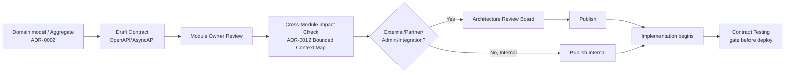
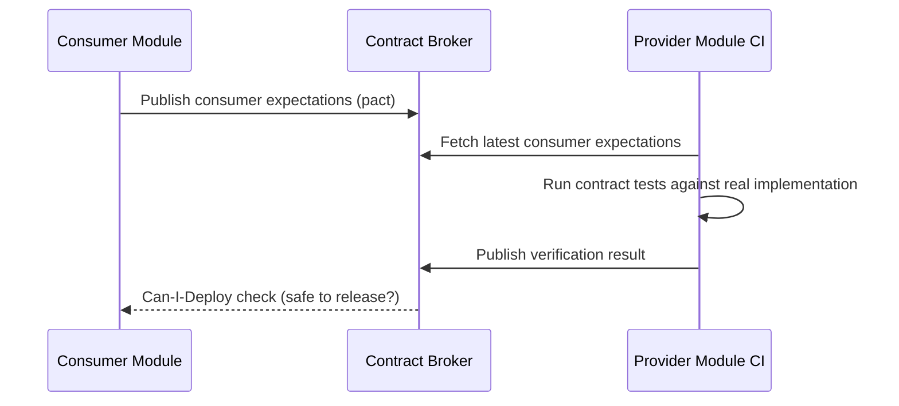

# Contract-First Architecture

**Scope note:** This document formalizes the *contract discipline*
`01-API-VISION.md` committed to as a Goal ("Contracts before code") and
Part 1 deliberately left as tooling-undefined. It does not redesign any
Part 1 layer, naming rule, or versioning policy — it specifies how a
contract is authored, owned, tested, and evolved before implementation
begins.

## Contract-First Architecture

**Recommendation.** No Module writes API implementation code before an
explicit, reviewable contract exists and has passed the Quality Gates
(`04-API-GOVERNANCE.md`). The contract — not the running service — is
the source of truth: implementation is verified against the contract,
never the reverse. This is the concrete mechanism that makes
`01-API-VISION.md` Goal #2 real rather than aspirational.

## OpenAPI Lifecycle

A REST contract's lifecycle, layered onto the Draft → Published →
Deprecated → Retired stages already Accepted in
`04-API-GOVERNANCE.md`:

1. **Author** — the owning Module writes the OpenAPI document (format
   and tooling standards: `17-OPENAPI-GOVERNANCE.md`) describing every
   resource, operation, and DTO, using the naming rules already
   Recommended in `06-NAMING-CONVENTIONS.md`.
2. **Lint and validate** — automated schema validation (structural
   correctness, naming-convention conformance) runs before human
   review, so reviewers spend time on design, not typos.
3. **Review** — the same Module Owner → Cross-Module Impact →
   Architecture Review Board flow as `04-API-GOVERNANCE.md`.
4. **Publish** — the OpenAPI document becomes the versioned, canonical
   contract; it is the input to `17`'s generated documentation and
   `20`'s SDK generation, not a separate description of them.
5. **Evolve** — every change to a Published document is classified
   breaking/non-breaking per `04-API-GOVERNANCE.md`'s Breaking Change
   Policy before it is allowed to merge.

## Schema Governance

- Every DTO/schema referenced by more than one endpoint within a
  Module is defined once and referenced (`$ref`), never duplicated —
  duplication is exactly how contract drift starts.
- A schema is never shared *across* Module contracts by direct
  reference (that would violate ADR-0003's Schema-per-Module boundary
  applied to contracts) — a cross-Module data shape is either (a)
  independently defined per Module (accepting some duplication at the
  contract level, since the Modules are genuinely independent), or (b)
  promoted to a Shared Kernel-style published schema only with
  Architecture Review Board approval, mirroring the `domain-driven-
  design` Skill's explicit warning to keep a Shared Kernel small and
  governed, never a default.
- Schema changes go through the same Breaking Change Policy as
  endpoint changes — a field-type change in a shared DTO is exactly as
  breaking as removing an endpoint.

## Contract Ownership

Identical to `04-API-GOVERNANCE.md`'s Ownership model: one owning
Module per contract, Single Adoption Point discipline. This document
adds one refinement specific to contracts: **the contract file itself
lives in the owning Module's own source tree**, never in a
shared/central "all contracts" repository structure that would make
ownership ambiguous — discoverability is solved instead by the API
Catalog (`23-API-CATALOG.md`), not by centralizing the files.

## Consumer-Driven Contracts (CDC)

**Recommendation.** For Internal API calls between Modules (the
highest-volume, highest-change-frequency contract type), this Board
recommends the Consumer-Driven Contract pattern: a consuming Module
records its actual usage expectations of a provider Module's contract
as an executable contract test, and the provider Module runs that test
in its own pipeline before a change ships. This catches a breaking
change *from the consumer's actual usage*, not just from the provider's
own (possibly incomplete) OpenAPI document — a meaningfully stronger
guarantee than schema validation alone.

For Partner and Public-adjacent contracts, where consumers are outside
this platform's control, classic Provider-side contract testing against
the Published OpenAPI/AsyncAPI document is used instead — a CDC
relationship requires a cooperating consumer team, which an external
Partner is not obligated to be.

## Contract Testing

**Recommendation**, tool selection deferred to `31-ENTERPRISE-PRODUCT-
DECISIONS.md`. Contract tests are a mandatory Quality Gate addition:

A provider Module cannot deploy a change that fails a known consumer's
contract test — this is enforced in CI, not by manual coordination
between teams, which is the actual mechanism (not just a policy
statement) that prevents the breaking-change incidents
`04-API-GOVERNANCE.md`'s policy exists to avoid.

## Backward Compatibility

Re-affirms, and does not duplicate, `07-VERSIONING.md`'s Compatibility
Policy. What this document adds: backward compatibility is *verified*,
not just *declared* — every contract change is checked against contract
tests (above) and against the previous Published version's schema
(structural diff) before merge. A change that the structural diff
flags as breaking cannot be merged into a non-major-version branch,
mechanically enforcing what `04`/`07` state as policy.
