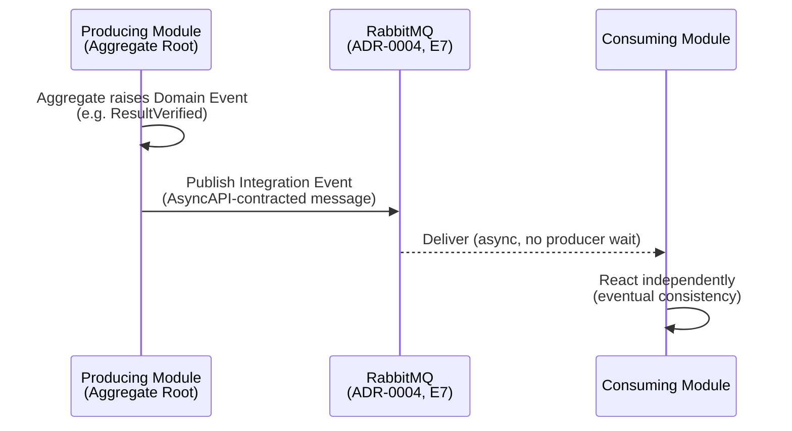

# AsyncAPI and Event APIs

**Scope note:** This document specifies the *contract notation and
message-shape governance* for the event-driven integration already
Accepted via ADR-0004 and implemented on RabbitMQ (Technology Baseline
E7). It does not redesign event-driven integration, does not introduce
a new broker, and does not define the platform's Event Catalog
(explicitly listed as Part 2 scope in the mission, but distinct from
*contract format*, which this document does cover) — a full Event
Catalog with discovery UI is deferred; this document defines the
*message contract standard* the eventual catalog will list.

## AsyncAPI

**Recommendation.** AsyncAPI 3.x is the mandatory notation for every
Domain Event and Integration Event this platform's Modules publish or
consume over RabbitMQ. It is the direct async analogue of
`17-OPENAPI-GOVERNANCE.md`'s OpenAPI standard: same governance
posture, same Quality Gate requirement, different protocol shape.

## Event APIs vs. Request/Response APIs

`02-API-FIRST-ARCHITECTURE.md`'s five-layer model describes
request/response traffic. Event APIs are a distinct traffic shape and
follow their own lifecycle:

A Module never blocks on a consumer's processing — this is the
`domain-driven-design` Skill's Domain Events pattern (temporal
decoupling) applied concretely: the producing Module's request/response
API call already returned before any consumer reacts.

## Event Standards

- **Domain Events are internal to a Bounded Context; Integration
  Events cross Module boundaries** — the same distinction the
  `domain-driven-design` Skill draws, already implicit in ADR-0004 and
  made explicit here for contract purposes. A Module publishes an
  Integration Event only for a Domain Event other Modules have a
  documented need to react to (e.g., `ResultVerified` triggers
  Notification Service and Billing) — not every internal state change
  is published outward.
- **Events are immutable facts, past tense, never retracted.** Reuses
  `06-NAMING-CONVENTIONS.md`'s Fact: event names are the existing
  Ubiquitous Language names (`TestOrdered`, `SpecimenCollected`,
  `SpecimenAccessioned`, `SpecimenRejected`, `ResultVerified`,
  `ResultReleased`, `ClaimAdjudicated`) verbatim — this document adds
  no new event-naming scheme.
- **A correction is a new event, not a mutation of a published one**
  (e.g., a mis-verified result is corrected via a new, explicitly
  named correction event — not by editing or resending the original
  `ResultVerified` message under the same identity).

## Message Contracts

Every event's AsyncAPI-defined payload includes, at minimum:

| Field | Purpose |
|---|---|
| `eventId` | Unique identifier for this specific event occurrence (UUIDv7, `05-API-STANDARDS.md`) |
| `eventType` | The Domain Event name (`ResultVerified`, etc.) |
| `occurredAt` | UTC timestamp of the domain fact, not the publish time if they differ |
| `correlationId` | Propagated from the originating request (`05-API-STANDARDS.md`), letting an event be traced back to the API call that caused it |
| `tenantId`, `organizationId`, `branchId` | Multi-tenancy context (`14-MULTI-TENANCY.md`), carried on every event so a consumer can apply the same Data-Scope filtering discipline it applies to synchronous calls |
| `payload` | The event-specific data, schema-governed exactly as an OpenAPI DTO would be (`16-CONTRACT-FIRST.md`'s Schema Governance rules apply identically) |

A Sensitive Operation's event (`ResultVerified`, `ResultReleased`)
additionally carries the Human-in-the-Loop attestation reference (who
verified, per ADR-0007/CLAUDE.md Section 15) — the event is not merely
a data-change notification, it is part of the same auditable chain
`09-AUTHORIZATION.md` establishes for the synchronous path.

## Compatibility

Event contract evolution follows the same Breaking Change Policy as
REST contracts (`04-API-GOVERNANCE.md`, `07-VERSIONING.md`): adding an
optional payload field is non-breaking; removing or retyping a field,
or changing what triggers the event, is breaking and requires a new
event-contract version, published and consumed side-by-side during a
deprecation window exactly as a REST API version would be. This
document does not create a second, parallel versioning scheme for
events — it applies the existing one to a second protocol.

## What Remains Explicitly Out of Scope Here

A full Event Catalog (discoverability UI, cross-Module event browsing)
and Webhook delivery of these events to external Partner/Public
consumers are covered separately in `23-API-CATALOG.md` and
`19-WEBHOOKS.md` respectively — this document defines only the message
contract standard both of those build on.
