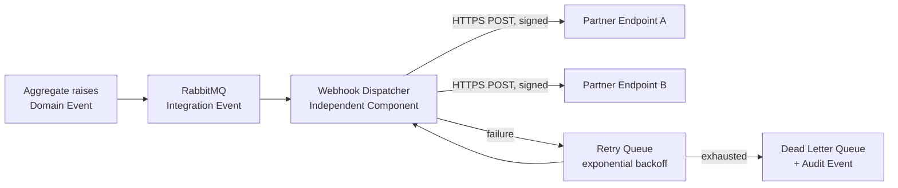

# Webhooks

**Scope note:** Webhooks are how an Integration or Partner Event
(`18-ASYNCAPI-EVENTS.md`) leaves this platform's own RabbitMQ backbone
and reaches an external HTTP endpoint the platform does not control.
This is a distinct concern from internal event delivery, which never
needs a webhook — two Modules inside the Monolith consume RabbitMQ
directly.

## Webhook Architecture

A **Webhook Dispatcher** is a new architectural role — an Independent
Component in the same sense as the Constitution Section 11 list
(Notification Service, Device Integration Gateway, etc.), consuming
Integration Events from RabbitMQ and delivering them outward over
HTTPS. This Board does not select a specific product to fill this role
in this document (see `31-ENTERPRISE-PRODUCT-DECISIONS.md`) — the role
and its required behavior are specified here regardless of eventual
implementation.

## Subscriptions

A Partner (never a Public/anonymous consumer, in this platform's
current scope — Public developer access remains Part-2-undesigned per
`03-API-DOMAIN-INVENTORY.md`) registers a webhook subscription
declaring: the specific event types it wants (a subset of the
AsyncAPI-contracted events in `18`), its endpoint URL, and the
Tenant/Organization scope the subscription is limited to. A
subscription never receives events outside its declared Tenant scope —
this is `14-MULTI-TENANCY.md`'s cross-tenant protection extended to
the outbound direction, which is just as important as the inbound
direction this platform has focused on so far.

## Retries

**Recommendation.** A failed delivery (non-2xx response, timeout) is
retried with exponential backoff. The exact number of retry attempts
and backoff timing are not fixed by this Board — inventing specific
numbers would violate the No-Guessing Rule, and the correct values
depend on real Partner SLA negotiation this Board has no evidence for.
What is fixed: retries are bounded (not infinite), and exhausting
retries moves the event to a Dead Letter Queue with a mandatory Audit
Event — a silently-dropped webhook is treated as a defect class, not
an acceptable failure mode, consistent with Full Auditability
(Accepted Architecture Principle #10).

## Signing

**Recommendation.** Every webhook payload is signed (HMAC over the raw
request body, using a per-subscription secret issued through the
platform's secret-management discipline, `12-SECRETS-AND-KEYS.md`) and
carries a signature header the receiving Partner verifies before
trusting the payload. This is the same trust-boundary principle as
`11-API-SECURITY.md`'s Tampering control, applied to a channel the
platform does not control the receiving end of.

## Security

- Webhook endpoint URLs are validated at registration time to reject
  internal/private IP ranges (SSRF protection, OWASP API7 — the same
  control class `11-API-SECURITY.md` already requires for inbound
  Anti-Corruption Layer calls, applied here to outbound delivery).
- Webhook Dispatcher credentials (the signing secret) follow the same
  Key Lifecycle as any other secret (`12-SECRETS-AND-KEYS.md`) —
  generation, rotation, revocation, with rotation triggering a grace
  period where both old and new signatures validate, so a Partner is
  never locked out mid-rotation.
- A subscription delivering only to `https://` endpoints — no
  unencrypted `http://` webhook delivery is permitted, ever.

## Idempotency

Every webhook delivery carries the same `eventId`
(`18-ASYNCAPI-EVENTS.md`) as the underlying event. A Partner receiving
a retried delivery (same `eventId`) is expected to treat it as a
duplicate, not a new occurrence — this is the outbound mirror of
`05-API-STANDARDS.md`'s `Idempotency-Key` requirement for inbound
unsafe operations, using the event's own natural identifier rather than
a separately issued key.

## Delivery Guarantees

**Fact-labeled honestly, not oversold:** this architecture provides
**at-least-once delivery**, not exactly-once — the retry mechanism
above means a Partner may receive the same `eventId` more than once
(hence the Idempotency requirement above being mandatory, not
optional). At-least-once is the standard, achievable guarantee for a
distributed event-to-webhook pipeline; this Board does not claim
exactly-once semantics, which would require a distributed-transaction
guarantee this platform's architecture (RabbitMQ + independent HTTP
delivery to an external, uncontrolled endpoint) cannot actually provide
without a level of complexity this phase has no evidence justifies.
