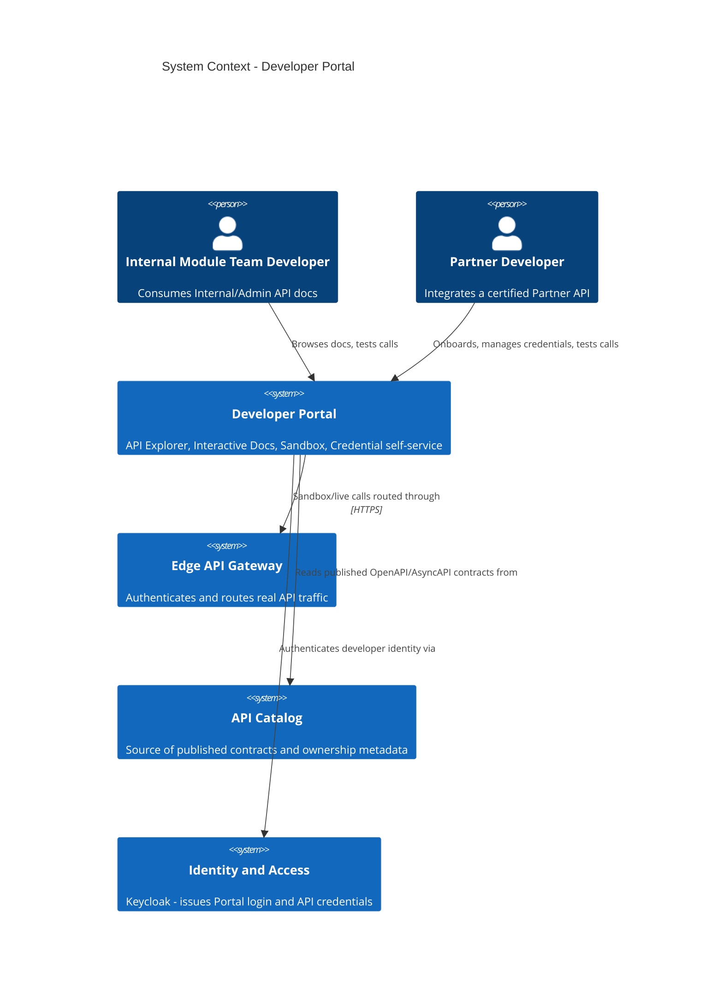
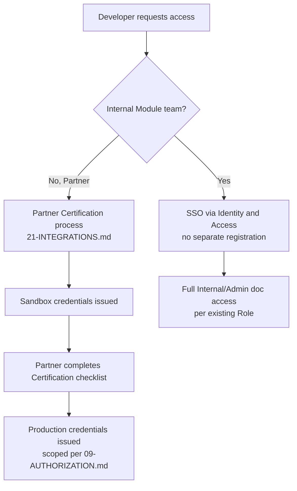

# Developer Portal

## System Context

The Developer Portal is a **new Independent Component role**, not a
Module in the 28-Module Catalog — it is developer-facing tooling that
sits alongside the platform, reading from `23-API-CATALOG.md` and
authenticating through the existing Identity and Access Module rather
than owning its own identity system. This Board does not select a
specific Developer Portal product here (see
`31-ENTERPRISE-PRODUCT-DECISIONS.md`) — this document specifies the
required architecture regardless of product.

## API Explorer and Interactive Docs

**Recommendation.** Rendered directly from each Module's Published
OpenAPI/AsyncAPI document (`17`, `18`) — never a hand-maintained
second copy of the contract, for the same drift-prevention reason
`20-SDK-STRATEGY.md` requires generated SDKs. A developer can read the
endpoint/event catalog, inspect schemas, and issue a live "try it"
call from the browser against either the Sandbox (below) or, for an
already-certified Partner, production, gated by the same
Authentication/Authorization model every other caller goes through
(`08`, `09`) — the Portal is a UI over real API calls, not a separate
privileged path.

Localization: per ADR-0010 (Accepted), the Portal itself supports
Arabic/English and RTL/LTR rendering. Whether the OpenAPI `description`
fields are rendered bilingually depends on
`17-OPENAPI-GOVERNANCE.md`'s Documentation Standards note (English
authoring, translation as a Portal rendering concern) — this document
does not change that division of responsibility.

## Sandbox

**Recommendation.** A dedicated Sandbox Tenant (using the same Hybrid
Tenant Isolation model, ADR-0005 — a Sandbox is simply a Tenant flagged
non-production, not a separate infrastructure stack) lets a developer
exercise the full request/response and, where subscribed, webhook
lifecycle (`19-WEBHOOKS.md`) against synthetic data. **No real
Patient, financial, or clinical data ever appears in the Sandbox** —
this is a direct, non-negotiable application of CLAUDE.md Section 13
("Never use real medical data or real personal data in examples,
tests, or diagrams") to a system this platform will operate, not just
to this document set's own prose.

## Developer Onboarding

Public/self-service developer registration (any third party
registering without a prior business relationship) is **not
designed here** — it depends on the Public API type
(`03-API-DOMAIN-INVENTORY.md`) remaining unpopulated by this platform's
own Decision, and on `24-MARKETPLACE.md`'s publishing model, which
this document does not pre-empt.

## Credentials

Credential issuance reuses `08-AUTHENTICATION.md`'s existing grants —
the Portal is a UI for a developer to request and view (never to
generate independently of Identity and Access) OAuth2 Client
Credentials for their service identity, and to trigger rotation
through the existing Secrets/Key Lifecycle (`12-SECRETS-AND-KEYS.md`).
The Portal never displays a secret after its initial issuance —
standard secret-hygiene practice consistent with `12`'s Secure
Distribution requirement.

## Self-Service

A Partner developer can, without filing a support ticket: view their
current rate-limit tier and consumption (`13-RATE-LIMITING.md`,
`26-BILLING.md`'s Usage Metering), rotate their own credentials,
manage their Webhook subscriptions (`19`), and view their integration's
recent error/audit log (scoped to their own Data Scope,
`14-MULTI-TENANCY.md`). Self-service does not extend to changing rate
tiers or Certification status — those remain governed actions
(`04-API-GOVERNANCE.md`, `21-INTEGRATIONS.md`).
