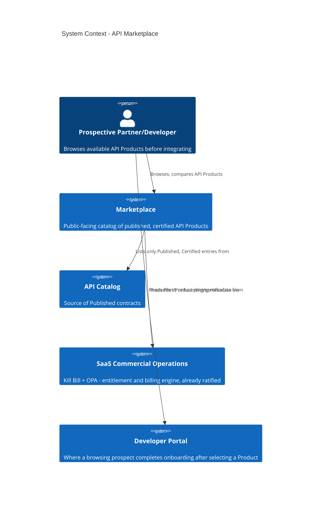

# Marketplace

## Positioning

The Marketplace is the commercially-packaged, publicly-browsable
presentation layer over a subset of `23-API-CATALOG.md`'s entries —
specifically, entries a Module or Partner has chosen to expose as an
**API Product** (below). It is the furthest-downstream document in
this set and depends on `21-INTEGRATIONS.md` (Partner Certification),
`23-API-CATALOG.md` (the data source), and `25-MONETIZATION.md` (what
makes a listing commercial) all being in place first.

## Marketplace Architecture

## API Products

An **API Product** is a Marketplace-specific packaging concept, distinct
from a raw Catalog entry: one or more related API contracts
(`23-API-CATALOG.md` entries), bundled with a commercial Plan
(`25-MONETIZATION.md`), and a documented Certification status
(`21-INTEGRATIONS.md`). Not every Published contract becomes an API
Product — Internal and Admin API types (`03-API-DOMAIN-INVENTORY.md`)
are never Marketplace-listed by definition; only External, Partner, and
(once the platform makes that Decision) Public-classified contracts are
eligible.

## Partner Publishing

**Recommendation.** A Module team (or, for the specific case of
SaaS Commercial Operations' reseller/channel-partner candidate,
`03`'s Future row) submits an API Product for Marketplace listing
through the same Architecture Review Board approval flow already
established in `04-API-GOVERNANCE.md` — the Marketplace does not
introduce a second, parallel approval body. A listing additionally
requires: the underlying contract(s) already in Published lifecycle
status, Partner Certification already passed
(`21-INTEGRATIONS.md`), and a commercial Plan already defined
(`25-MONETIZATION.md`).

## Partner Certification (Marketplace-Specific Layer)

`21-INTEGRATIONS.md`'s Certification checklist governs whether a
specific Partner *integration* is technically sound. Marketplace
listing adds one further check on top: **product-readiness review** —
does the API Product have complete Interactive Docs
(`22-DEVELOPER-PORTAL.md`), a defined SLA tier
(`28-SLA.md`), and Sandbox support (`22`)? A Product failing this
check can still be used under a direct, non-Marketplace Partner
agreement (`21-INTEGRATIONS.md` alone) — Marketplace listing is a
stricter, additive bar, not the only path to Partner integration.

## What This Document Does Not Decide

- **Whether the platform opens general Public/self-service Marketplace
  registration at all** — this remains contingent on the still-
  unpopulated Public API type (`03-API-DOMAIN-INVENTORY.md`), which is
  a product/business Decision outside this Board's authority (No-
  Guessing Rule — this Board does not assert the platform will or will
  not do this).
- **Specific pricing figures** — `25-MONETIZATION.md` defines the
  *mechanism* (Plans, tiers); no number is invented here or there.
- **A Marketplace platform product selection** — see
  `31-ENTERPRISE-PRODUCT-DECISIONS.md` for why this was not evaluated
  (no dedicated Build-vs-Buy category was in scope for the 7 items
  that Task assigned; a Marketplace-specific platform, if the business
  Decision to pursue one is made, needs its own future Build-vs-Buy
  pass).
