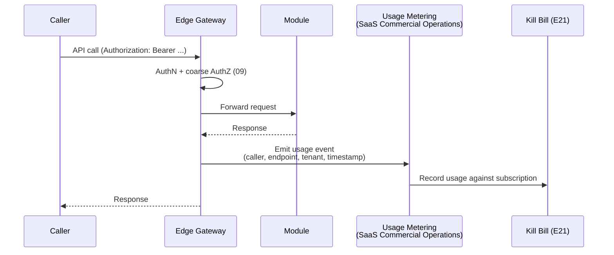

# Billing

**Scope note:** Where `25-MONETIZATION.md` defines the commercial
structure (Plans, Products, Subscriptions), this document defines the
**operational metering and credential-management pipeline** that feeds
it — the API-layer-specific application of the already-frozen Kill
Bill + OPA composition, plus the credential machinery
(`08-AUTHENTICATION.md`) that ties a consuming identity to a billable
subscription.

## Usage Metering

Usage metering is emitted at the Edge Gateway, not per-Module — this
keeps metering consistent regardless of which Module served the
request, and means a Module never needs its own billing-awareness
logic (consistent with `02-API-FIRST-ARCHITECTURE.md`'s rule that the
Gateway, not Modules, owns cross-cutting concerns like this one). Each
usage event carries the same Correlation ID as the originating request
(`05-API-STANDARDS.md`), letting a specific billed event be traced back
to its exact call for dispute resolution.

## Billing

Billing itself — invoice generation, payment collection, dunning for
past-due subscriptions — is Kill Bill's own, already-ratified
capability (Technology Baseline E21); this document does not redesign
Kill Bill's billing engine. What is new here: the **mapping** from raw
API usage events to Kill Bill's billing units, which did not exist
before there was an API layer to meter.

## Quota Management

Reuses `13-RATE-LIMITING.md`'s Tenant/Partner quota structure as the
*enforcement* mechanism (Gateway-level, real-time, `429` on exceed) and
adds the *measurement* side: cumulative usage against a billing-period
quota (e.g., "calls this billing cycle" as distinct from
`13`'s per-second/per-minute burst and sustained-rate limits, which
are availability-protection controls, not commercial ones). A Tenant
can be within its `13` rate limit yet still approaching or exceeding
its `25`-defined Plan's included quota — these are two independent
thresholds serving two different purposes, both enforced at the same
Gateway layer but not conflated into one number.

## Consumption

A Tenant/Partner's own consumption view (current-period usage vs.
quota) is surfaced through `22-DEVELOPER-PORTAL.md`'s Self-Service
capability, sourced from the same Usage Metering pipeline above — not
a separately maintained reporting path that could show different
numbers than what Kill Bill actually bills.

## API Keys

**Recommendation.** Distinct from the OAuth2 Client Credentials already
specified in `08-AUTHENTICATION.md` for service/Partner identities: a
simpler API Key (a single bearer secret, no OAuth2 token exchange) is
offered as a lower-friction credential type specifically for
Sandbox usage and low-sensitivity read-only External/Partner API
Products (`24-MARKETPLACE.md`), where the overhead of a full OAuth2
flow is disproportionate. An API Key is never accepted for a Sensitive
Operation or any endpoint requiring fine-grained Data-Scope
authorization beyond a single static scope — those always require the
full OIDC/JWT path (`08`, `09`). API Keys follow the same Secret
Lifecycle as any other credential (`12-SECRETS-AND-KEYS.md`).

## Client Registration

A new Partner/developer client (OAuth2 or API Key) is registered
through `22-DEVELOPER-PORTAL.md`'s onboarding flow, which creates: (a)
a service identity in Identity and Access (`08`), (b) a Kill Bill
subscription reflecting the chosen Plan (`25`), and (c) an entry in
`23-API-CATALOG.md`'s consumer registry (a Catalog facet distinct from
the contract-listing facet already described there — tracking *who
consumes what*, not just *what exists*). These three registrations
happen atomically from the developer's perspective through the Portal,
even though they touch three different Modules/systems — the Portal is
the orchestration point, not a fourth independent system of record.

## OAuth Client Management

Client lifecycle (create, rotate credentials, suspend, delete) is
Keycloak's native OAuth2 client-management capability
(`08-AUTHENTICATION.md`), exposed through the Developer Portal's
Self-Service surface (`22`) rather than requiring direct Keycloak Admin
API access for any Partner or Module team — the same Anti-Corruption
boundary already established for every other Keycloak interaction
(`02-API-FIRST-ARCHITECTURE.md` Layer 5) applies to client management
too.
