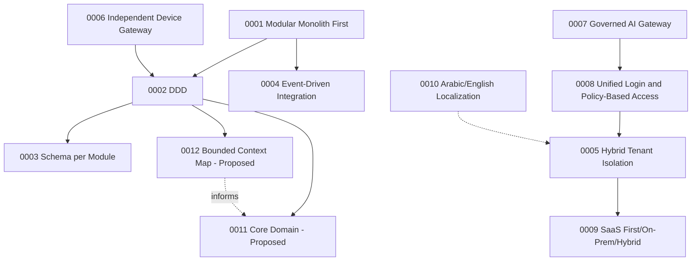

# ADR Certification

Produced using the `architecture-decision-records` Skill's review
checklist (Context clear, options considered, consequences documented,
related ADRs linked, status accurate) applied to all 12 ADRs.

## ADR Index (re-verified against `.claude/context/decisions.md`)

| ADR | Title | Status (verified by direct file read) | Quality | Consistency w/ Index |
|---|---|---|---|---|
| 0001 | Modular Monolith First | Accepted | Full MADR-style structure, options considered (microservices, monolith, modular monolith), consequences documented | Matches |
| 0002 | Domain-Driven Design | Accepted | Same | Matches |
| 0003 | Schema per Module | Accepted | Same | Matches |
| 0004 | Event-Driven Integration | Accepted | Same | Matches |
| 0005 | Hybrid Tenant Isolation | Accepted | Same | Matches |
| 0006 | Independent Device Gateway | Accepted | Same | Matches |
| 0007 | Governed AI Gateway | Accepted | Same | Matches |
| 0008 | Unified Login and Policy-Based Access | Accepted | Same | Matches |
| 0009 | SaaS First, On-Premise Ready, Hybrid Ready | Accepted | Same | Matches |
| 0010 | Arabic/English and Localization First | Accepted | Same | Matches |
| 0011 | Core Domain — Test Processing and Result Verification | **Proposed — Amended** | Includes an explicit "Why Proposed, Not Accepted" section — a quality practice exceeding the standard template, specifically defending against silent status promotion | Matches |
| 0012 | Candidate Bounded Context Map | **Proposed — Amended** | Same defensive-status-documentation pattern as 0011 | Matches |

**Status field accuracy: 12/12 verified correct** by direct file read
against `.claude/context/decisions.md`'s ADR Index table — zero drift.

## Coverage Check — Decisions That Should Have an ADR But Don't

`.claude/context/decisions.md`'s own "Proposed Decisions" section
already self-identifies 4 decisions **not yet independently ADR'd**,
despite touching Accepted principles:

| Candidate Decision | Related Accepted Principle | Has Own ADR? |
|---|---|---|
| Event-Driven Notifications | ADR-0004 (general Event-Driven Integration) | No — correctly not assumed covered by 0004 |
| Central Audit Trail | Constitution §23 (Auditability by Default) | No |
| Configurable Workflow Engine | Not tied to a specific ADR | No |
| Module SDK and Module Template | Not tied to a specific ADR | No |

**Finding: this is not a defect.** `.claude/context/decisions.md`
itself explicitly states these remain Proposed and are "not to be
considered covered implicitly" by a broader Accepted principle — this
is the correct, disciplined outcome (no premature ADR promotion), not
a coverage gap this audit needs to raise as new. Carried forward to
`12-OPEN-QUESTIONS-REGISTER.md` for SAD-phase visibility.

## Duplicate / Conflicting Decision Check

**No duplicate or conflicting ADRs found.** Each of the 12 ADRs
addresses a distinct architectural concern; no two ADRs make
contradictory claims about the same subject (verified by reading all
12 "Decision" sections side by side — e.g., ADR-0005's tenancy model
and ADR-0009's SaaS/On-Premise model are complementary, not competing,
correctly cross-referenced in each other's Context sections).

## Obsolete Decision Check

**No obsolete ADRs found.** All 12 remain actively cited by subsequent
phases (EARB `10-ADR-REVIEW.md`, API Platform `15-ADR-REVIEW.md`) as
still governing — none has been superseded, and none should be, per
both independent reviews already performed.

## ADR Dependency Graph

## ADR Timeline

| Date | Event |
|---|---|
| 2026-07-15 | ADRs 0001-0010 created, Accepted as part of Constitution v1 |
| 2026-07-16 (Discovery Phase 04/06) | ADRs 0011-0012 first drafted as Inferred/Proposed |
| 2026-07-16 (Gap Closure Wave 7/9/14) | ADRs 0011-0012 Amended with re-evaluation evidence, remain Proposed |
| 2026-07-17 (EARB phase) | All 12 ADRs reviewed, 0 status changes, ADR-0011 Proposed status explicitly re-confirmed |
| 2026-07-18 (API Platform Part 2) | All 12 ADRs reviewed again for API-First compatibility, 0 status changes, ADR-0011 independently re-confirmed Proposed |
| 2026-07-18 (this Certification Audit) | Status field accuracy re-verified 12/12, no drift found |

## ADR Health Report

| Metric | Result |
|---|---|
| Total ADRs | 12 |
| Accepted | 10 |
| Proposed — Amended | 2 (0011, 0012) |
| Rejected | 0 |
| Superseded | 0 |
| Deprecated | 0 |
| Status accuracy (verified vs. index) | 12/12 |
| Have "Why Proposed, Not Accepted" defensive documentation | 2/2 (both Proposed ADRs) |
| Independently re-reviewed by 2+ subsequent phases without status drift | 12/12 |
| Missing ADRs for self-identified Proposed Decisions | 4 (correctly left unADR'd, not a defect) |

## Certification Verdict

**PASS.** ADR discipline is the single most rigorously and consistently
maintained governance mechanism in this repository — verified by three
independent reviews (EARB, API Platform Part 2, this audit) all
reaching the same conclusion on every ADR's status without drift.
