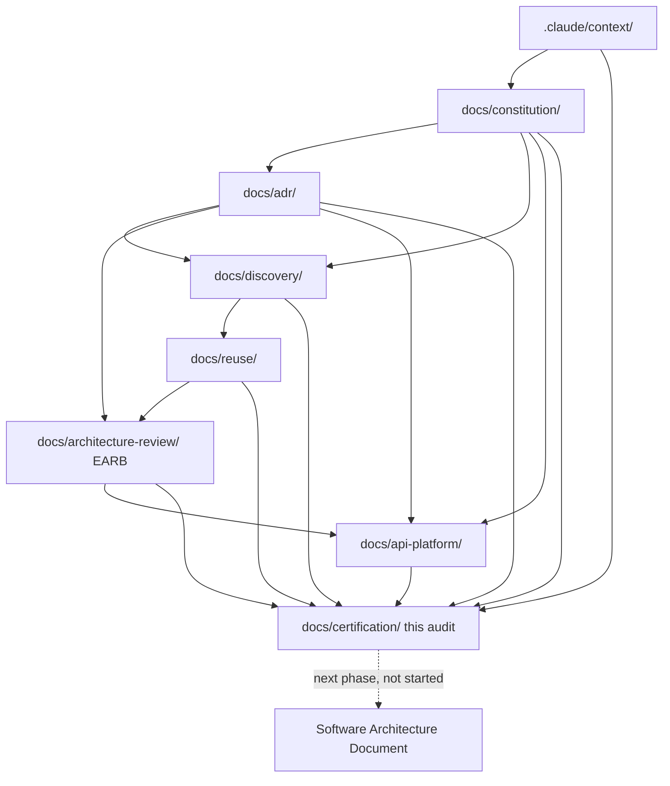

# Complete Repository Index

Every document tree in this repository, what it contains, and how it
relates to every other tree. File counts verified by direct `find` at
audit time.

## Top-Level Structure

```
/home/user/test-m3ml/
├── CLAUDE.md                    Working-agreement summary (git workflow, no-guessing rule)
├── README.md                    Minimal project stub
├── .claude/
│   ├── SKILLS-INVENTORY.md      Full Skill provenance (source/license/commit/security)
│   ├── SKILLS-VALIDATION-REPORT.md   Skill installation validation + DDD-skill search process
│   ├── context/                 9 files — the living Context Store (see below)
│   └── skills/                  9 installed Skills (see docs/certification/00)
└── docs/
    ├── constitution/            4 files — governing rules
    ├── adr/                     12 files — Architecture Decision Records
    ├── discovery/                99 files — Discovery + Gap Closure
    ├── reuse/                   1,396 files — Build-vs-Buy/Reuse Intelligence
    ├── architecture-review/     14 files — Enterprise Adoption Review (EARB)
    ├── api-platform/            34 files — API Platform Strategy Parts 1-2
    └── certification/           26 files — Audit + Closure + Open Questions Resolution + ARR/Baseline Freeze
```

## `.claude/context/` (9 files) — The Context Store

| File | Purpose |
|---|---|
| `README.md` | Context Store usage rules, status vocabulary |
| `vision.md` | Platform vision, Confirmed Context + Expanded Vision |
| `architecture-principles.md` | 25 principles, Draft/Accepted status per principle |
| `decisions.md` | ADR Index + Proposed Decisions not yet ADR'd |
| `glossary.md` | Ubiquitous Language, Accepted Definitions + Discovery-phase candidate terms |
| `module-catalog.md` | 16 initial categories + Discovery's 8→28 Bounded Context evolution |
| `open-questions.md` | 31 Open Questions (see `docs/certification/12`) |
| `constraints.md` | 14 Confirmed constraints |
| `stakeholders.md` | 15 initial + 39-Persona expanded stakeholder catalog |

## `docs/constitution/` (4 files)

| File | Purpose |
|---|---|
| `README.md` | What the Constitution is/is not, authority statement |
| `PROJECT-CONSTITUTION.md` | 62 sections, v1 (1-47) + v2 (48-62) |
| `CHANGELOG.md` | v1 and v2 version history |
| `REVIEW-REPORT.md` | Internal quality review + v2 Addendum |

## `docs/adr/` (14 files)

`0001-modular-monolith-first.md` through `0010-arabic-english-and-
localization-first.md`, `0011-core-domain-test-processing-and-result-
verification.md`, `0012-candidate-bounded-context-map.md`,
`0013-postgresql-as-primary-relational-database.md`,
`0014-disaster-recovery-and-business-continuity-baseline.md` — **all 14
Accepted**. (0011/0012 were Proposed — Amended at this audit's original
authoring; promoted to Accepted 2026-07-18 in the Open Questions
Resolution phase. 0013/0014 added 2026-07-18 in the Pre-SAD Baseline
Correction phase.) Original certification: `docs/certification/
04-ADR-CERTIFICATION.md` (historical record, preserved).

## `docs/discovery/` (99 files)

| Subdirectory | Contents |
|---|---|
| Top level | `README.md`, `DISCOVERY-BOOK.md`, `HEALTHCARE-OPERATIONS-DISCOVERY-BOOK.md`, `DISCOVERY-FRAMEWORK.md`, `EXECUTION-GUIDE.md`, `EXECUTE-DISCOVERY.md`, `GAP-CLOSURE-CHANGELOG.md` |
| `prompts/` | 12 phase playbooks (`01_MASTER.md` through `12_FINAL_DISCOVERY_BOOK.md`) |
| `reports/` | Per-phase reports (00-12) + 15 GAP-CLOSURE-*.md wave reports (00-14) |
| `artifacts/` | Detailed per-phase/per-wave working artifacts (event storming boards, subdomain maps, persona catalogs, etc.) |
| `diagrams/` | Discovery-phase diagrams |

## `docs/reuse/` (1,396 files)

| Component | Count | Purpose |
|---|---|---|
| `MASTER_*.md` (top level) | 18 | Executive Summary, Feature Catalog, Decision Register, Repository Database/Ranking, License Matrix, Dependency Matrix, Engine/Library/SDK Catalogs, Shared/Platform Components, Build-vs-Buy Matrix, Reuse/Comparison/Security Matrices, Readiness/Completion Reports |
| 28 Module directories | 1,378 | One directory per Module (see `.claude/context/module-catalog.md`), each containing per-Feature 13-file research sets |

## `docs/architecture-review/` (14 files) — EARB Phase

`01-EXECUTIVE-SUMMARY.md` through `14-READINESS-FOR-SAD.md`. Full
certification: `docs/certification/01-FULL-ENTERPRISE-AUDIT.md`
Section 8, `08-LICENSING-CERTIFICATION.md`.

## `docs/api-platform/` (34 files) — API Platform Strategy

`00-SKILLS-AND-TOOLS-USED.md` through `15-ADR-REVIEW.md` (Part 1, 16
files), `16-CONTRACT-FIRST.md` through `33-PART2-EXECUTIVE-SUMMARY.md`
(Part 2, 18 files). Full certification: `docs/certification/
06-API-CERTIFICATION.md`.

## `docs/certification/` (26 files) — Audit + Closure + Open Questions Resolution + ARR/Baseline Freeze

| File | Purpose |
|---|---|
| `00-SKILLS-AND-MCP-REVIEW.md` | Skill/MCP inventory and usage audit |
| `01-FULL-ENTERPRISE-AUDIT.md` | All 12 audit-dimension clusters |
| `02-CONSISTENCY-REPORT.md` | Cross-document consistency verification |
| `03-TRACEABILITY-MATRIX.md` | Vision→SAD-input traceability chain |
| `04-ADR-CERTIFICATION.md` | ADR-specific review |
| `05-DDD-CERTIFICATION.md` | DDD scoring (8/10) |
| `06-API-CERTIFICATION.md` | API Platform document-by-document review |
| `07-SECURITY-CERTIFICATION.md` | Architectural security risk review |
| `08-LICENSING-CERTIFICATION.md` | License cross-consistency |
| `09-SAFE-FIXES-APPLIED.md` | 3 documentation fixes, full justification |
| `10-DECISION-REGISTER.md` | 43 unified decisions |
| `11-RISK-REGISTER.md` | 15 unified risks |
| `12-OPEN-QUESTIONS-REGISTER.md` | 31 questions, prioritized and timed |
| `13-PROJECT-MEMORY.md` | Complete project history and knowledge preservation |
| `14-PROJECT-INDEX.md` | This document |
| `15-SAD-INPUT-PACKAGE.md` | Validated SAD inputs |
| `16-EXECUTIVE-DOSSIER.md` | Board/CTO-level summary |
| `17-READINESS-SCORES.md` | Quantified readiness scores |
| `18-CERTIFICATION-REPORT.md` | Formal certification report + final decision |
| `19-CERTIFICATION-CLOSURE-REPORT.md` | Final pre-SAD cleanup closure report (documentation corrections + governance enhancements, no architectural change) |
| `20-OPEN-QUESTIONS-RESOLUTION.md` | Resolution of all 31 Open Questions; ADR-0011/0012 promoted to Accepted; SAD authorization statement |
| `21-ARCHITECTURE-READINESS-REVIEW.md` | Final pre-SAD readiness review across 6 review areas |
| `22-ARCHITECTURE-BASELINE-FREEZE.md` | Formal freeze of the complete architectural baseline |
| `23-SAD-READINESS-MATRIX.md` | All 25 planned SAD sections rated Ready/Partially Ready/Missing Inputs |
| `24-REPOSITORY-MODIFICATION-REPORT.md` | Files touched in the Architecture Readiness Review phase |
| `25-EXECUTIVE-CONCLUSION.md` | READY FOR SOFTWARE ARCHITECTURE DOCUMENT verdict (superseded by `25-PRE-SAD-CLEAN-CLOSURE.md` below — historical record preserved) |
| `25-PRE-SAD-CLEAN-CLOSURE.md` | Pre-SAD Baseline Correction closure report: decision-count correction, Kong/OpenBao governance clarification, ADR-0013/0014, consistency sweep, final SAD readiness conclusion |

**Note on the shared "25" prefix:** `25-EXECUTIVE-CONCLUSION.md` (Architecture
Readiness Review) and `25-PRE-SAD-CLEAN-CLOSURE.md` (Pre-SAD Baseline
Correction) are two distinct files from two distinct phases that happen to
share a numeric prefix under this repository's per-phase numbering
convention; neither is a duplicate or a replacement filename for the other.

## Relationship Between Every Artifact Tree


