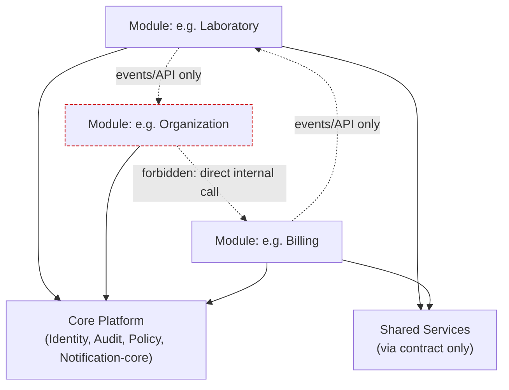
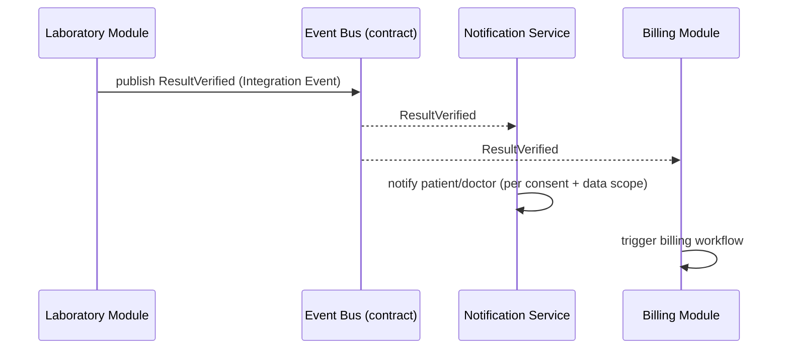
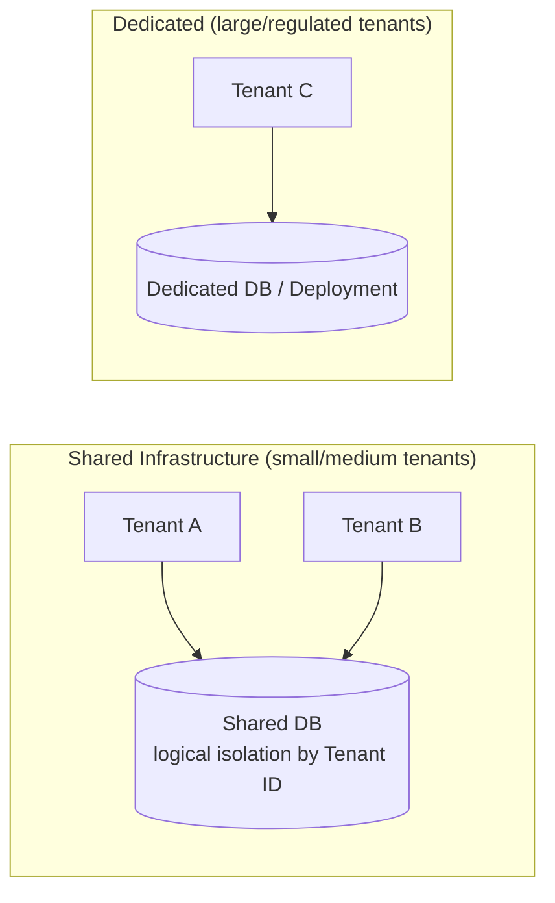
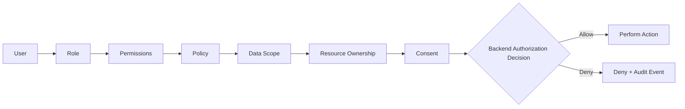
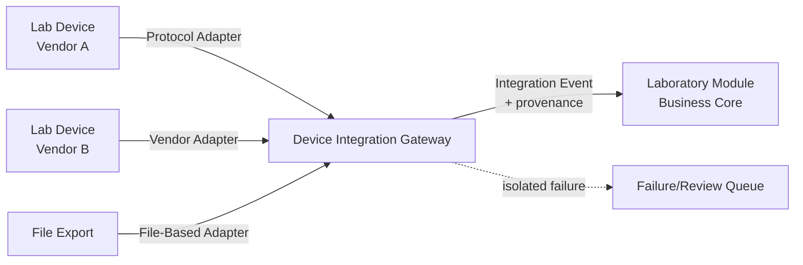
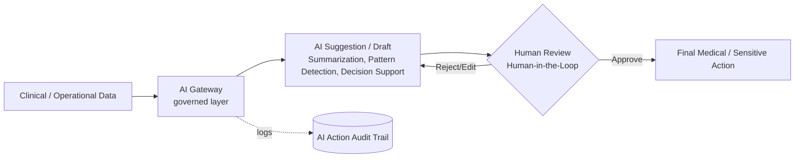
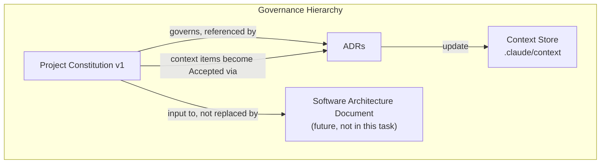
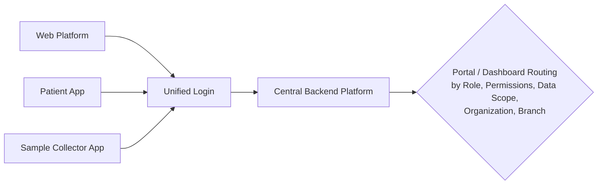

# Project Constitution v2.1

**Status:** Accepted (v2.1)
**Applies to:** the digital healthcare platform project (`darhous/test-m3ml`), starting
point: Laboratory Management.
**Relationship to other documents:** this Constitution states the *governing rules*
of the architecture. It is **not** the Software Architecture Document (SAD) — the
SAD (later) describes *how* systems are built to satisfy these rules. It is also not
an implementation plan: it names no programming language, framework, cloud provider,
message broker, database product, AI provider, or frontend framework — technology
selections are made and recorded through the ADR process (Section 39) and cross-
referenced from here, not written as Constitution rules.

**v2 note:** v2 is a strict superset of v1. Sections 1–47 and the "Consolidated
Accepted Decisions" appendix are unchanged from v1 (no prior architectural decision
was altered — see `docs/constitution/CHANGELOG.md`). Sections 48–62 are new:
they upgrade this document from an architecture-decision record into a full
Enterprise Architecture Constitution (engineering policies, fitness functions,
budgets, quality gates, governance processes) so that writing the Software
Architecture Document later does not require re-deriving project rules.

**v2.1 note (2026-07-18, Final Pre-SAD Semantic Consistency Correction):** a
minor, non-substantive amendment via Section 45, correcting active
governing text that had become stale relative to later-Accepted decisions:
Section 51's RTO/RPO rows (stale once ADR-0013, PostgreSQL as the Primary
Relational Database, and ADR-0014, Disaster Recovery and Business
Continuity Baseline, were Accepted), Section 6's Core Domain recommendation
and the Section 47 Glossary's Core Domain row (stale once ADR-0011 was
Accepted), and Section 46's Open Questions framing (stale once all 14
listed items, and the platform's other tracked Open Questions, were
resolved). In every case only the *status/reason* text is corrected — no
numeric RTO/RPO/availability value is introduced, the 14-item Open
Questions list itself is preserved unmodified as history, and no rule in
Sections 1–50 or 52–62 is changed in substance. No ADR was reopened and no
principle was reversed. See `docs/constitution/CHANGELOG.md` for the full
amendment record.

See `docs/constitution/README.md` for authority/process notes and
`docs/constitution/CHANGELOG.md` for the version history.

---

## 1. Purpose and Authority

**Purpose.** This Constitution is the single set of governing rules that every
module, team, and future Software Architecture Document must comply with. Its job
is to make architectural decisions predictable and enforceable *before* large
amounts of code exist, so the platform does not collapse into an unstructured,
tightly-coupled system as it grows from "laboratory management" toward a broad
healthcare platform.

**Authority.**
- This Constitution has precedence over any individual module's local design
  choices. A module may not silently violate a Constitution rule.
- Where this Constitution conflicts with `.claude/context/*.md`, the Constitution
  wins for anything marked `Accepted` in `decisions.md` (each such item has a
  corresponding ADR — see Section 39). Anything still `Draft`/`Proposed`/`Open` in
  the context store is **not** governed yet and is not silently promoted by this
  document.
- Changing an `Accepted` rule in this Constitution requires the Amendment Process
  (Section 45), not an ad-hoc edit.

**Non-authority (explicit boundaries).** This Constitution does **not**:
- Select a programming language, framework, cloud provider, message broker,
  database product, AI provider, or frontend framework.
- Constitute legal, medical-regulatory, or compliance certification of any kind
  (see Section 31, Compliance Readiness Rules).
- Replace the future Software Architecture Document (SAD), which will contain
  concrete technical designs derived from these rules.
- Define a final Module Catalog, a Roadmap, or Tasks.

## 2. Scope

**In scope:** architecture-governing rules for the whole platform: module
boundaries, data ownership, tenancy, security/authorization, device integration,
AI governance, localization, and the engineering practices (testing, ADRs,
documentation, git workflow) needed to keep the architecture coherent as it grows.

**Out of scope for v1:** the final list of Bounded Contexts/Modules (see
`module-catalog.md` — categories only), a detailed SAD, an implementation
Roadmap, specific technology selections, and any answer to the questions still
listed as `Open` in Section 46 / `.claude/context/open-questions.md`.

**Starting point vs. long-term goal.** Per `vision.md`: the platform starts with
**Laboratory Management** and is intended to grow into a broad healthcare
platform with a central Backend Platform, Unified Login, and Role/Permission/
Data-Scope/Organization/Branch-based routing to the correct Portal/Dashboard.
Every rule below is written to hold at both the starting point and the long-term
shape — no rule here assumes "lab-only" forever.

## 3. Vision

Restated from `.claude/context/vision.md` (Draft there; treated here as the
frame this Constitution is built to serve, not as a newly-Accepted fact):

- A Digital Healthcare Platform, not a plain CRUD system.
- Central Backend Platform serving all client surfaces.
- Unified Login; post-login routing to a Portal/Dashboard by Role, Permissions,
  Data Scope, Organization, Branch.
- Direction: API-First, Event-Driven, AI-Ready, Integration-Ready.

This Constitution operationalizes that vision into enforceable rules. It does not
expand the vision itself — vision changes go through `vision.md` first.

## 4. Core Values

| Value | Meaning |
|---|---|
| Modularity over monolith-by-accident | The system is a Modular Monolith by deliberate design, not a Big Ball of Mud that happens to be one deployable. |
| Autonomy with contracts | Modules move independently, but only ever interact through explicit contracts (APIs, events, approved read models). |
| Security is backend-owned | No control that matters is enforced only in a UI. |
| Evidence over imagination | Scaling, compliance, and extraction decisions are triggered by measured needs, not anticipated ones. |
| Human accountability for medical AI | AI assists; humans decide on sensitive clinical matters. |
| Traceability by default | Every sensitive action, medical result, and AI action leaves an audit trail. |
| Deliberate, not premature, global reach | Multi-tenant, multi-organization, multi-branch, Arabic/English, and SaaS/On-Premise/Hybrid are v1 commitments — but implementation depth still follows measured need, not speculation. |

## 5. Architecture Principles

Restates and formalizes the `Accepted` subset of `.claude/context/architecture-principles.md`
(full status update in Section "Update Context" is applied separately to that file).

### Rule: Modular Monolith First
**Required**
- v1 of the platform ships as a Modular Monolith composed of clearly bounded
  Modules, each aligned to one or more Bounded Contexts.
**Forbidden**
- Starting the platform as a set of independently deployed microservices "by
  default."
**Exceptions**
- The components explicitly named in Section 9 (Independent Components) may be
  operationally independent from the start, because they are justified by
  concrete operational needs (protocol isolation, external-facing surface,
  variable load, or governed external calls), not by general microservice
  preference.
**Rationale**
- Avoids distributed-systems cost (network calls, partial failure, eventual
  consistency everywhere) before the domain model and team structure justify it.
**Verification**
- Architecture/dependency tests confirming module code lives in one deployable
  unit except for the named Independent Components.
- ADR required (0001) before this could ever be reversed.

### Rule: Selective Service Extraction Only When Justified
**Required**
- Extracting a module into an independent service requires a documented,
  measurable operational or organizational trigger (e.g., independent scaling
  need observed in production, a team boundary conflict, a hard latency/
  isolation requirement).
**Forbidden**
- Extracting a module "because microservices are best practice" or in
  anticipation of scale that has not been measured.
**Verification**
- An ADR documenting the trigger, alternatives considered, and consequences
  must exist before extraction work starts.

### Rule: Domain-Driven Design as the Modeling Approach
**Required**
- Module boundaries are derived from Bounded Contexts and Ubiquitous Language,
  not from technical layering (e.g., not "all controllers", "all repositories").
**Forbidden**
- A generic technical name (`Manager`, `Helper`, `Processor`, `Utils`) standing
  in for a domain concept in a public module contract.
**Verification**
- DDD consistency review (Section 5 of `REVIEW-REPORT.md`) at each new module's
  design time.

### Rule: Event-Driven Integration Between Modules
**Required**
- Cross-module side effects that other modules react to are expressed as
  Domain/Integration Events, not synchronous calls that assume the callee's
  internal success/failure semantics.
**Forbidden**
- A module directly invoking another module's internal service methods across
  the boundary.
**Exceptions**
- Synchronous request/response through an approved API contract is allowed when
  the caller needs an immediate answer (e.g., "is this permission granted") —
  see Section 12 (Event-Driven Architecture Rules) for the boundary between the
  two.
**Verification**
- Contract tests on published events; module dependency tests forbidding
  synchronous cross-module service imports.

### Rule: API-First Design
**Required**
- Every module defines its public contract (API and/or events) before internal
  implementation is treated as stable.
**Verification**
- API design review using `api-design-principles` prior to a contract being
  marked stable.

### Rule: No Direct Cross-Module Database Access
See Section 16/17 (Data Ownership, Database and Migration Rules) — stated once
here as a top-level principle because it is the single most load-bearing rule
for keeping "Modular Monolith" from silently becoming "Distributed Monolith
with a shared database."

### Rule: Contracts Over Implementation Sharing
**Required**
- Code reuse between modules happens through a published contract (API,
  event schema, shared library that is itself versioned and owned) — never by
  one module importing another module's internal package.
**Forbidden**
- Deep imports into another module's internal namespace/package.
**Verification**
- Dependency-direction architecture tests (Section 9, Module Dependency Rules).

## 6. Domain-Driven Design Rules

**Required**
- Each Module is defined in terms of one or more Bounded Contexts, using
  Ubiquitous Language agreed with the relevant Stakeholders (`stakeholders.md`).
- A Bounded Context is a model/language boundary, not a deployment unit. It is
  not automatically a microservice (see Section 1, DDD skill "Common
  Mistakes").
- Every Bounded Context distinguishes, at minimum: Entities, Value Objects,
  Aggregates (with one Aggregate Root), Domain Events, Repositories.
- Aggregates are kept small: one root plus the minimal cluster needed for its
  invariants; other aggregates are referenced by ID, not object reference.
- An Anti-Corruption Layer is required at every boundary where an external
  system's model would otherwise leak into a Bounded Context's domain model —
  this explicitly includes Device Integration (Section 24) and AI Gateway
  (Section 28) boundaries.

**Forbidden**
- A single "God model" (e.g., one `Patient` class) shared, mutable, and
  understood differently across multiple Bounded Contexts.
- Anemic domain objects that are pure data bags while all business rules live
  in generic "service" classes, for the Core Domain specifically (see Strategic
  Design below).

**Recommendation (not yet a Rule) at v1/v2 authoring:** identify the Core
Domain(s) for the platform (Strategic Design/Distillation) once module
discovery begins; this Constitution did not name the Core Domain at that
time — it was logged as an Open Question (Section 46, item 14).

**Update (2026-07-18, v2.1):** the dedicated DDD session this
recommendation called for has since taken place. The Core Domain is
**Accepted** as "Patient-to-Result Orchestration" — ADR-0011, confirmed via
explicit user review in the Open Questions Resolution phase (see
`docs/certification/20-OPEN-QUESTIONS-RESOLUTION.md`). Open Question item
14 (Section 46) is resolved accordingly. This does not change the
principle stated here (Core Domain deserves the deepest modeling
investment and must not be anemic) — only its former "not yet identified"
status.

**Verification**
- DDD consistency review using the `domain-driven-design` skill's Quick
  Diagnostic (7-row checklist) at each Bounded Context's design time.

## 7. Bounded Context Rules

### Rule: Explicit Context Boundaries
**Required**
- Every Bounded Context is named, documented (purpose, Ubiquitous Language
  terms, owning team/module), and appears in a Context Map before
  implementation begins.
**Forbidden**
- An undocumented, implicit context boundary discovered only by reading code.
**Verification**
- Context Map reviewed as part of each module's design review; `c4-architecture`
  System Context/Container diagrams reference the same boundaries.

### Rule: Context Mapping Patterns Must Be Named
**Required**
- Every relationship between two Bounded Contexts is labeled with an explicit
  context-mapping pattern (e.g., Customer/Supplier, Conformist, Anti-Corruption
  Layer, Open Host Service + Published Language, Shared Kernel).
- Shared Kernel is allowed only when explicitly justified and kept small; it
  requires an ADR because it is an exception to Module Ownership (Section 8).
**Forbidden**
- An unlabeled, "just calls it" relationship between two contexts.
**Verification**
- Context Map document review; ADR required for any Shared Kernel.

## 8. Module Ownership Rules

### Rule: One Owning Module Per Bounded Context Concept
**Required**
- Every domain concept (entity, aggregate, event, table) has exactly one owning
  Module. That Module is the only writer of that concept's state.
**Forbidden**
- Two modules both writing to the same conceptual entity/table.
**Rationale**
- Ownership ambiguity is the most common cause of Modular Monolith decay into
  a Big Ball of Mud.
**Verification**
- Data Ownership Rules verification (Section 16) — schema/table-to-module
  mapping check.

### Rule: A Module Owns Its Data, Migrations, Business Rules, and Public Contracts
**Required**
- A module's schema, migrations, business/validation rules, and published
  API/event contracts are authored and versioned by that module alone.
**Forbidden**
- A central "shared migrations" folder that mutates another module's schema.
**Verification**
- Repository/folder governance check (Section 41): migrations live under the
  owning module's directory.

## 9. Module Dependency Rules

### Rule: Acyclic, Directed Module Dependencies
**Required**
- Module dependencies form a Directed Acyclic Graph. Core Platform (Section 10)
  may be depended on by any module; it depends on no module.
**Forbidden**
- Circular dependencies between two modules (A depends on B and B depends on A).
- A module depending on another module's internal implementation details.
**Verification**
- Automated architecture/dependency-direction tests (e.g., a dependency-graph
  check) run as part of Definition of Done (Section 43).



### Rule: Independent Components May Depend on Core Contracts Only
**Required**
- The Independent Components (Section 9 of the decisions list — see Section 11
  below) integrate with modules only via published APIs/events, never via
  direct code dependency.
**Verification**
- Same dependency-direction tests, applied across deployable-unit boundaries
  too.

## 10. Core Platform Rules

**Required**
- Core Platform contains only genuinely cross-cutting capability needed by
  virtually every module: Identity (authn identity, not per-module profile
  data), Policy/Authorization primitives, Audit primitives, and the
  notification/eventing primitives that other modules build on.
- Core Platform exposes stable, versioned contracts; breaking changes follow
  Section 15 (API Versioning and Compatibility Rules).

**Forbidden**
- Placing domain-specific logic (e.g., lab result interpretation, billing
  rules) inside Core Platform "because it's shared."

**Verification**
- Definition-of-Done check: any addition to Core Platform must show it is used
  by 2+ unrelated modules and contains no single-domain business logic.

## 11. Shared Services Rules

Restates the user-approved list of components that **may be operationally
independent from the start** because they are justified by concrete needs
(protocol/vendor isolation, externally-facing surface, independently variable
load, or governed external-provider calls):

- Notification Service
- Device Integration Gateway
- AI Gateway
- Analytics Platform
- Search Service
- File Processing Service
- Public API Gateway
- Background Workers

### Rule: Shared Services Are Consumed Through Contracts Only
**Required**
- Any module using a Shared Service does so through that service's published
  API/event contract.
**Forbidden**
- A module embedding a Shared Service's internal library/config directly
  instead of calling its contract.
**Rationale**
- Keeps these components genuinely extractable/replaceable and prevents a
  "shared service" from becoming a second, informal Core Platform with
  uncontrolled coupling.
**Verification**
- Dependency-direction tests as in Section 9; contract tests per service.

## 12. Event-Driven Architecture Rules

### Rule: Domain Events Stay Inside a Bounded Context; Integration Events Cross It
**Required**
- A Domain Event (internal fact within one Bounded Context) is only promoted to
  an Integration Event (crosses Bounded Context/Module boundaries) through a
  deliberate, documented translation — not by broadcasting internal events
  as-is.
**Forbidden**
- Publishing an internal domain event schema directly as the cross-module
  integration contract.
**Verification**
- Event catalog review: each Integration Event has an explicit owning module,
  schema, and consumers list.

### Rule: Events Are Immutable Facts, Past Tense
**Required**
- Event names describe something that already happened (`ResultVerified`,
  `SampleCollected`), and published events are never mutated after publication
  (corrections are new events, e.g., `ResultCorrected`, referencing the
  original).
**Forbidden**
- Re-publishing an edited version of an already-consumed event under the same
  identity.
**Verification**
- Event schema review; append-only event log design review where an event
  store is used.



## 13. Event Naming and Versioning Rules

**Required**
- Event names: `<BoundedContext>.<AggregateOrConcept><PastTenseVerb>` at the
  integration layer (e.g., `Laboratory.ResultVerified`), to keep provenance
  unambiguous across modules.
- Every Integration Event schema carries an explicit version. Breaking schema
  changes publish a new version; consumers migrate on their own schedule
  during a defined deprecation window (see Section 15 for the compatibility
  policy this follows).

**Forbidden**
- Silently changing a published event schema in a breaking way under the same
  version identifier.

**Verification**
- Event schema registry/catalog check as part of Definition of Done.

## 14. API Design Rules

**Required**
- Every module's public API is designed API-first (contract before
  implementation), reviewed with the `api-design-principles` skill.
- APIs are resource/domain-oriented and use the platform's Ubiquitous Language,
  not database table names.
- All state-changing operations are authorized server-side per Section 21
  regardless of what the API style is.

**Forbidden**
- Leaking internal database identifiers or schema shape directly as the public
  API contract without an explicit mapping layer.

**Verification**
- API governance review (Section quality review, Section "Review Process"
  below) before a contract is marked stable.

*No specific API style (REST/GraphQL/RPC) or protocol is chosen here — that is
an implementation decision for the SAD, guided by these rules.*

## 15. API Versioning and Compatibility Rules

**Required**
- Public API and Integration Event contracts are versioned explicitly.
- Backward-incompatible changes require a new version and a defined
  deprecation window for the old version; they may not silently replace it.
**Forbidden**
- Removing or changing the meaning of a field in a published contract version
  without a version bump.
**Verification**
- Contract/consumer tests; changelog entry required for every contract change.

## 16. Data Ownership Rules

### Rule: Schema per Module
**Required**
- Inside the initial Modular Monolith, every module owns a distinct schema
  (or clearly namespaced table set) and its migrations.
**Forbidden**
- A module reading or writing tables owned by another module directly (no
  cross-schema joins/writes).
**Rationale**
- Preserves module autonomy and future extractability without requiring
  Database per Module from day one.
**Verification**
- Database permission checks (per-module DB role/grants) + repository
  dependency tests forbidding cross-module ORM/query access.

### Rule: Cross-Module Data Access via Contract Only
**Required**
- A module needing another module's data uses: (a) that module's API, (b)
  Domain/Integration Events, or (c) an explicitly approved Read Model
  maintained by (or approved by) the owning module.
**Forbidden**
- Direct SQL joins against another module's owned schema (see worked example
  below).
**Verification**
- Architecture tests; repository dependency tests; database permission checks.

### Rule: No Cross-Module Table Access (worked example, as required by the task brief)
**Required**
- A module accesses another module through an approved contract.
**Forbidden**
- Direct SQL joins against another module's owned schema.
**Rationale**
- Protects module autonomy and future extractability.
**Verification**
- Architecture tests.
- Repository dependency tests.
- Database permission checks.

## 17. Database and Migration Rules

**Required**
- Database per Module is **not** required initially (Schema per Module is the
  v1 baseline).
- A module may move to a fully separate database when/if it is extracted into
  an independent service (Section 5, Selective Service Extraction).
- Large or regulated tenants may receive a dedicated database as part of the
  Hybrid Tenant Isolation model (Section 18/19) — this is a deployment-topology
  decision, not a module-boundary change.
- Every module owns and versions its own migrations; migrations run in an
  order that respects the module dependency graph (Section 9), never assuming
  another module's schema state directly.

**Forbidden**
- A "shared migrations" tool/step that edits multiple modules' schemas in one
  unreviewed migration.

**Verification**
- Migration ownership check (folder governance, Section 41); migration dry-run
  per module in CI.

## 18. Multi-Tenancy Rules

**Required**
- The platform is Multi-Tenant, Multi-Organization, Multi-Branch from v1.
- Tenant, Organization, and Branch are distinct concepts (see `glossary.md`):
  a Tenant may contain multiple Organizations; an Organization may contain
  multiple Branches.
- Every tenant-scoped record carries an explicit Tenant identifier; Data Scope
  (Section 21) is derived from Tenant + Organization + Branch + Role +
  Permissions + Resource Ownership + Consent.

**Forbidden**
- Any tenant-scoped table/entity without an explicit tenant-identifying
  column/attribute "because it's implied by context."

**Verification**
- Schema review checklist item: every tenant-scoped entity has an explicit
  tenant reference.

*Exact multi-tenancy data-partitioning technique (e.g., tenant ID column vs.
separate schema vs. separate database) is Hybrid per Section 19, and the
specific default for the "shared" tier remains an implementation choice for
the SAD, not fixed here.*

## 19. Tenant Isolation Rules

### Rule: Hybrid Tenant Isolation
**Required**
- Small/medium tenants: shared infrastructure with strict logical isolation
  (every query/command scoped by Tenant, enforced server-side).
- Large or regulated tenants: dedicated database or dedicated deployment must
  be an available option.
- Tenant isolation is testable: automated tests must prove tenant A can never
  read/write tenant B's data through any code path.
**Forbidden**
- A code path that determines tenant scope from client-supplied, unverified
  input alone (must be derived from authenticated session/policy context).
**Verification**
- Multi-Tenant Isolation Testing (Section 36): dedicated automated test suite
  attempting cross-tenant access and asserting denial.



## 20. Authentication Rules

**Required**
- Unified Login: one authentication entry point for all user types across all
  clients (Web Platform, Patient App, Sample Collector App).
- Authentication establishes identity only; it does not by itself grant access
  to any resource (see Section 21 for authorization).
- Session/credential validation happens on the backend for every
  privileged request; a client never self-asserts its own role/permission set.

**Forbidden**
- Trusting a client-supplied role/permission claim without backend
  verification against the authoritative Identity/Policy source.

**Verification**
- Security testing (Section 37): attempt to forge/elevate a role claim from
  the client and confirm the backend rejects it.

*No specific authentication protocol/provider is chosen here.*

## 21. Authorization and Data Scope Rules

### Rule: Backend-Enforced Authorization
**Required**
- Every state-changing and every sensitive read operation is authorized on the
  backend, evaluating Role, Permissions, Policy, Data Scope, Organization,
  Branch, Resource Ownership, and Consent.
**Forbidden**
- Relying on UI hiding/disabling as an access control. UI hiding is never
  considered an authorization control (explicit user rule).
**Rationale**
- A UI-only control is trivially bypassed by any direct API call.
**Verification**
- Security tests that call backend endpoints directly, bypassing the UI, and
  confirm authorization still holds.

### Rule: Least Privilege and Deny by Default
**Required**
- Default access is deny; access is granted explicitly per Role/Permission/
  Policy. New capabilities are inaccessible until explicitly granted.
**Forbidden**
- A "default allow, block specific things" authorization model.
**Verification**
- Policy engine test suite asserting an unlisted action is denied by default.

### Rule: Zero Trust Between Modules and Services
**Required**
- Internal service-to-service/module-to-module calls are also authenticated
  and authorized — internal network position is never treated as sufficient
  trust.
**Verification**
- Security tests attempting an internal call without valid service identity/
  authorization context.

### Rule: Explicit Data Scope
**Required**
- Every query that returns tenant/organization/branch/patient-linked data is
  scoped explicitly by the caller's Data Scope; scope is computed server-side
  from Role + Policy + Organization + Branch + Resource Ownership + Consent.
**Verification**
- Data Scope unit tests per role archetype; cross-tenant/cross-branch access
  attempts must fail.

### Rule: Sensitive Operations Require Elevated Controls; Break-Glass Is Exceptional
**Required**
- Operations affecting verified medical results, consent, or cross-tenant
  administrative actions require elevated authorization checks (e.g.,
  step-up verification, dual control, or explicit justification capture).
- Emergency "Break-Glass" access exists only for exceptional situations, is
  time-limited, requires a captured justification, and is fully audited.
**Forbidden**
- A standing, un-time-boxed "admin override" credential used for routine work.
**Verification**
- Audit log review confirming every Break-Glass use has a justification, time
  bound, and follow-up review record.



## 22. Consent and Delegated Access Rules

**Required**
- Where a user acts on behalf of another (e.g., a caregiver, a delegated staff
  role, or a patient granting a doctor access), that delegation is explicit,
  recorded, revocable, and factored into Data Scope.
- Consent state is itself auditable (who granted/revoked, when, scope).

**Forbidden**
- Implicit "assumed consent" derived only from organizational relationship
  without an explicit, recorded grant, for anything touching medical data.

**Verification**
- Consent audit trail review; tests confirming access is denied after consent
  revocation.

*Exact consent model UX and legal sufficiency are Open (Section 46) — this
section states the architectural rule (explicit, recorded, revocable,
auditable), not the legal/regulatory sufficiency of any specific flow.*

## 23. Audit and Traceability Rules

**Required**
- Every sensitive action (verified medical result changes, authorization
  decisions on sensitive operations, consent changes, Break-Glass access, AI
  actions per Section 28) produces an Audit Event.
- Audit Events are immutable and retained independently of the business record
  they describe (an audit trail must survive/outlive the corrected/deleted
  business record it documents).
**Forbidden**
- Deleting or mutating an Audit Event as part of any normal application
  workflow.
**Verification**
- Audit completeness tests: for each sensitive-operation code path, assert an
  Audit Event is produced; immutability enforced at the audit store level
  (e.g., append-only permission grants).

## 24. Medical Device Integration Rules

**Required**
- Device integration exists from the first architecture version, not as a
  later bolt-on.
- Device adapters (protocol-specific and vendor-specific) live outside the
  business Core, behind a Device Gateway, using Vendor Adapters, Protocol
  Adapters, and Integration Events to reach the domain.
- The Device Gateway must be able to support, over time: HL7, HL7 v2, FHIR,
  ASTM, TCP/IP, Serial Communication, File-Based Integration, and Vendor APIs
  — the architecture must not preclude any of these, though not all are
  necessarily implemented in v1.
- Every imported result retains source and provenance (which device, which
  adapter, when, raw-payload reference) permanently.
- A device/adapter failure must not corrupt core business data — failures are
  isolated, logged, and surfaced for review, not silently swallowed or allowed
  to write partial/invalid state into the domain.

**Forbidden**
- Business/domain logic (e.g., result interpretation) living inside a device
  adapter.
- A device adapter writing directly into another module's owned schema
  (Section 16 applies here too — the Device Gateway is itself a module-like
  owner of its own integration data, publishing Integration Events onward).

**Verification**
- Anti-Corruption Layer review at the Device Gateway boundary; fault-injection
  tests simulating malformed/partial device payloads and asserting core data
  integrity is preserved; provenance-field presence check on every imported
  result.



## 25. Workflow and State Transition Rules

**Required**
- Business processes with multiple steps/approvals (e.g., sample collection →
  processing → verification → release) are modeled as explicit, configurable
  Workflows with defined states and allowed transitions — not as ad-hoc status
  flags scattered across code.
- State transitions that affect verified medical results or sensitive data
  require the same authorization/audit treatment as Section 21/23.
**Forbidden**
- An undocumented implicit state machine expressed only as scattered
  conditionals.
**Verification**
- Workflow definition review; state-transition tests confirming illegal
  transitions are rejected.

*Configuration over hardcoded workflows is a Draft principle in
`architecture-principles.md`; this Constitution treats "workflows are
explicit and configurable" as Required, while the exact configuration
mechanism remains an SAD-level implementation choice.*

## 26. Notification Rules

**Required**
- Notifications are triggered by Domain/Integration Events (Section 12), not
  by direct calls buried in unrelated business logic.
- Notification content and delivery respect Data Scope and Consent (Section
  21/22) — a notification must not leak data the recipient is not scoped/
  consented to see.
**Forbidden**
- Embedding sensitive medical detail in a notification channel/payload that
  does not meet the same data-scope/consent bar as the primary application.
**Verification**
- Notification-payload review against Data Scope rules; the specific channel
  set (SMS/Email/Push/WhatsApp/etc.) remains Open (Section 46).

## 27. File and Document Rules

**Required**
- Files/documents (lab reports, device exports, attachments) are owned by the
  module that produced/manages them, with the same provenance requirement as
  Section 24 where the file originates from a device.
- Access to a file/document follows the same Data Scope/Consent rules as
  structured data — a file is not a bypass around Section 21.
**Forbidden**
- A "generic file store" that is readable by any module without going through
  the owning module's authorization check.
**Verification**
- Access-control tests on file/document retrieval endpoints, same pattern as
  Section 21 verification.

## 28. AI Governance Rules

**Required**
- AI is an independent, governed layer — not embedded ungoverned inside
  arbitrary modules.
- Permitted AI-assisted functions: Summarization, patient-friendly
  explanations, pattern detection, anomaly detection, search, operational
  assistance, and clinical decision *support*.
- Human-in-the-Loop is mandatory before any sensitive clinical action is
  finalized.
- Every AI action (prompt, model/version, output, cost, evaluation outcome,
  provider used) is logged and auditable (Section 23 applies to AI actions
  too).
- Sending sensitive information to an external AI provider requires an
  approved policy and controls (e.g., data minimization, contractual/technical
  safeguards) to exist first.

**Forbidden**
- AI independently: approving a medical result, modifying a verified medical
  result, publishing a final diagnosis, or sending a final medical decision
  without human review.
- Sending sensitive data to an external AI provider by default / without an
  approved policy.

**Verification**
- Human-in-the-Loop gate tests: attempt to have an AI-produced sensitive
  output reach a "final" state without a human-approval step, and confirm it
  is blocked.
- AI action audit-log completeness check.
- Policy-gate check on any outbound call to an external AI provider carrying
  sensitive data.



## 29. Security Rules

**Required**
- Backend-Enforced Authorization (Section 21) and Zero Trust between
  internal components are baseline, not optional hardening.
- Least Privilege applies to service accounts, database roles, and
  integration credentials, not only human users.
- A STRIDE-style threat review is performed for each new Bounded
  Context/module and for each new external integration (device, AI provider,
  external API partner) before it goes live.
**Forbidden**
- Shipping a new external-facing integration without a documented threat
  review.
**Verification**
- STRIDE review artifact required per module/integration (see Section 37,
  Security Testing Rules, and the quality review in
  `docs/constitution/REVIEW-REPORT.md`).

## 30. Privacy Rules

**Required**
- Medical data is classified as highly sensitive by default (Constraint #5 in
  `constraints.md`).
- Data minimization applies to any data leaving the platform's control
  (notifications, external AI providers, external API partners, exports).
- Consent (Section 22) governs sharing of personal/medical data beyond the
  minimum needed for direct care/operational purposes.
**Forbidden**
- Sending medical/personal data to an external system/provider without a data
  minimization review and, where applicable, consent.
**Verification**
- Data-flow review for every external integration, checked against
  minimization and consent rules.

## 31. Compliance Readiness Rules

**Required**
- The architecture is built to be *capable* of meeting healthcare
  data-protection and audit requirements (Backend-Enforced Authorization, Full
  Auditability, tenant isolation, consent tracking, data provenance).
- Specific regulatory regimes (per market) are tracked as Open Questions
  (Section 46 / `open-questions.md` items 1–2) until answered.
**Forbidden**
- Any claim, in this document or derived documents, that the platform "is
  compliant" with a named regulation — that is a legal/compliance
  determination outside this Constitution's authority (Section 1).
**Verification**
- This section itself is the guard: any future PR/document claiming legal
  compliance certification must be rejected in review unless it cites an
  actual external compliance assessment, which this task does not produce.

## 32. Localization Rules

**Required**
- Arabic and English are supported from the beginning, with RTL and LTR UI
  support.
- Multi-Currency and Multi-Timezone support, and locale-aware date/number/
  address formatting, are v1 architectural requirements (not later add-ons).
- The architecture allows additional markets/languages later without a
  structural rewrite (e.g., no hardcoded assumption of a single locale/
  currency/timezone anywhere in domain models).
**Forbidden**
- Hardcoding a single language, currency, or timezone assumption into a
  domain model or contract.
**Verification**
- Localization review: domain models/contracts checked for hardcoded locale
  assumptions; RTL/LTR rendering check at UI review time.

## 33. Observability Rules

**Required**
- Observability by Default (Draft principle, elevated to Required here at the
  architecture level): every module exposes enough logging/metrics/tracing to
  answer "is this module healthy" and "what happened for this request,"
  without requiring code changes to add basic visibility.
- Audit Events (Section 23) are a compliance/traceability concern and are
  distinct from operational observability data — the two must not be
  conflated into one undifferentiated log stream.
**Verification**
- Definition-of-Done check: new module ships with baseline
  logging/metrics/tracing and does not mix audit and operational logs.

*Specific observability tooling is not chosen here.*

## 34. Reliability and Resilience Rules

**Required**
- Cross-module Integration Events are designed for eventual consistency and
  at-least-once delivery assumptions (consumers must tolerate
  redelivery/ordering variance unless a stronger guarantee is explicitly
  documented for that event).
- A dependency (device, external AI provider, external API partner, another
  module's API) failing must degrade gracefully — it must not silently corrupt
  data (Section 24) or leave a workflow in an undefined state (Section 25).
**Forbidden**
- A design that assumes exactly-once, in-order delivery of Integration Events
  without an explicit, documented mechanism guaranteeing it.
**Verification**
- Fault-injection/chaos-style tests per critical integration; idempotency
  tests on event consumers.

## 35. Testing Rules

**Required**
- Every module ships with tests proving: its public contract behaves as
  documented, its authorization rules hold (Section 21), and its data-scope
  rules hold (Section 18/19).
- Architecture-level tests (dependency direction, no cross-module DB access)
  run continuously, not just at initial review.
**Forbidden**
- Merging a module without contract-level and authorization-level tests.
**Verification**
- Definition of Done (Section 43) includes explicit test-category checklist.

## 36. Multi-Tenant Isolation Testing Rules

**Required**
- A dedicated test suite attempts cross-tenant and cross-organization/branch
  data access for representative role archetypes and asserts denial in every
  case.
- This suite runs against both the "shared infrastructure" and "dedicated"
  isolation tiers (Section 19).
**Forbidden**
- Treating tenant isolation as "implied correct" from code review alone
  without an executable test proving it.
**Verification**
- The suite itself is the verification artifact; it is required before any
  module handling tenant-scoped data is considered done.

## 37. Security Testing Rules

**Required**
- STRIDE-based threat review (Section 29) is performed per module/integration.
- Each identified threat is mapped to a mitigation using the
  `threat-mitigation-mapping` skill before the module/integration is
  considered done; unmitigated threats are explicitly logged as accepted
  risk with a named owner, not silently dropped.
- Authorization bypass attempts (client-side role forgery, UI-hiding
  reliance, direct backend calls skipping the UI) are part of the standard
  security test set (Section 20/21).
**Forbidden**
- Closing a STRIDE review with unmitigated threats that have no documented
  owner/decision.
**Verification**
- STRIDE + threat-mitigation artifacts stored per module; reviewed as part of
  `docs/constitution/REVIEW-REPORT.md`-style gates going forward.

## 38. Documentation Rules

**Required**
- Every Accepted architectural decision has an ADR (Section 39).
- The Context Store (`.claude/context/`) status taxonomy
  (Draft/Proposed/Accepted/Rejected/Superseded) is respected — this
  Constitution does not silently promote items still marked Draft/Proposed/
  Open elsewhere.
- Diagrams use Mermaid syntax and follow C4 conventions where applicable
  (`c4-architecture`, `mermaid-diagrams` skills).
**Forbidden**
- An "Accepted" statement anywhere in `.claude/context/` without a
  corresponding ADR link.
**Verification**
- Contradiction review (Section "Review Process" / `REVIEW-REPORT.md`) checks
  this explicitly.

## 39. ADR Rules

**Required**
- Any significant architectural decision (module boundary shape, tenancy
  model, security control, integration pattern, AI governance rule) is
  recorded as an ADR under `docs/adr/` before being treated as Accepted.
- ADR status lifecycle: `Proposed → Accepted → Superseded` (or `Rejected`).
  Superseding an Accepted ADR requires a new ADR that references it — an
  Accepted ADR is never edited to reverse its decision.
- ADR content at minimum: Status, Context, Decision, Alternatives Considered,
  Positive Consequences, Negative Consequences, Risks, Verification, Revisit
  Triggers.
**Forbidden**
- Editing an Accepted ADR's Decision section after acceptance instead of
  writing a Superseding ADR.
**Verification**
- `docs/adr/` directory review; `decisions.md` ADR Index cross-check
  (Section "Update Context").

## 40. Naming Conventions

**Required**
- Domain/Ubiquitous Language names in code, contracts, and events — not
  generic technical names (Section 6).
- Integration Event names follow `<BoundedContext>.<Concept><PastTenseVerb>`
  (Section 13).
- ADR files: `docs/adr/NNNN-kebab-case-title.md`, four-digit sequential
  number.
- Context files and this Constitution use the Draft/Proposed/Accepted/
  Rejected/Superseded status vocabulary consistently — no synonyms
  ("Confirmed", "Final", "Locked") introduced ad hoc.
**Verification**
- Naming-convention spot check as part of documentation/code review.

## 41. Repository and Folder Governance

**Required structure (documentation layer, established by this task):**
```
docs/
  constitution/
    PROJECT-CONSTITUTION.md
    README.md
    CHANGELOG.md
    REVIEW-REPORT.md
  adr/
    0001-modular-monolith-first.md
    ...
.claude/
  context/            (Context Store — status-tagged, not final)
  skills/             (project-scoped Agent Skills)
CLAUDE.md             (working-agreement summary)
```
**Required**
- Module source code (when it exists) is organized by Bounded Context/module
  name, not by technical layer at the top level (Section 6).
- Each module's migrations live under that module's own directory (Section
  17).
**Forbidden**
- A top-level `controllers/`, `services/`, `models/` split that mixes all
  modules' code together.
**Verification**
- Repository structure review at first code-scaffolding time (out of scope
  for this task, but the rule is fixed now to avoid rework later).

## 42. Git Workflow

Restates and elevates `CLAUDE.md` Section 16 (already Accepted working
agreement) as an architecture-governance rule, since it governs how all the
above gets safely captured over time:

**Required**
- All completed work stages are saved on `main`.
- `git pull --rebase origin main` before starting work.
- A clear commit, then `git push origin main`, after each completed stage.
**Forbidden**
- Force push, under any circumstance, without explicit fresh user approval
  for that specific push.
**Exceptions**
- None standing; any exception requires explicit, one-time user approval.
**Verification**
- Stop-and-ask on any conflict or rejected push (no automated resolution).

## 43. Definition of Done for Architectural Work

A module/integration/decision is "done" at the architecture level only when:

- [ ] Its Bounded Context and Ubiquitous Language terms are documented.
- [ ] Its public contract (API/events) is defined and versioned (Sections
      13–15).
- [ ] It has no direct cross-module DB access (Section 16/17) — verified by
      architecture tests.
- [ ] Data Scope and Authorization rules are implemented and tested (Section
      21, 35, 36).
- [ ] A STRIDE review has been performed and threats mapped to mitigations or
      explicitly accepted with an owner (Section 29, 37).
- [ ] Audit Events are emitted for its sensitive operations (Section 23).
- [ ] If it involves AI: Human-in-the-Loop gates and AI action logging are in
      place (Section 28).
- [ ] If it involves a device: Anti-Corruption Layer, provenance, and
      failure-isolation are in place (Section 24).
- [ ] Localization assumptions are checked (no hardcoded locale/currency/
      timezone) (Section 32).
- [ ] An ADR exists for any significant decision embedded in it (Section 39).
- [ ] Relevant `.claude/context/` files are updated, preserving history
      (Section "Update Context").

## 44. Exception Process

**Required**
- Any deviation from a `Required`/`Forbidden` rule in this Constitution must
  be: (1) proposed explicitly with the specific rule and reason, (2) approved
  by the user (project owner) before implementation, (3) recorded as either a
  documented `Exception` on the relevant rule (if narrow and recurring) or a
  superseding ADR (if it changes the rule generally).
**Forbidden**
- Silent deviation discovered only after the fact in code review.
**Verification**
- Contradiction review (quality gate) checks that no shipped module violates
  a rule without a linked exception/ADR.

## 45. Constitution Amendment Process

**Required**
- Amending an `Accepted` rule in this Constitution requires: (1) explicit
  user request or approval, (2) an entry in `docs/constitution/CHANGELOG.md`
  describing what changed and why, (3) a version bump if the change is
  substantive, (4) an ADR if the amendment reverses or materially changes a
  decision that itself has an ADR (Section 39).
**Forbidden**
- Editing this document's `Accepted` content without a corresponding
  CHANGELOG entry.
**Verification**
- `CHANGELOG.md` review alongside any diff to this file.

## 46. Open Questions

Carried over from `.claude/context/open-questions.md` as it stood at v1/v2
authoring (2026-07-15), unchanged at that time — this Constitution did not
answer them.

**Update (2026-07-18, v2.1):** all items below (1–14), along with the rest
of the platform's tracked Open Questions, were subsequently resolved in
the Open Questions Resolution phase — see `docs/certification/
20-OPEN-QUESTIONS-RESOLUTION.md` for the authoritative current answer to
each, and `.claude/context/open-questions.md` for the live-updated
register. The list below is preserved unmodified as the historical record
of what was still open when this Constitution was authored; it is not the
current status of any item.

1. Target countries/markets.
2. Local legal/regulatory requirements (regulatory/health/data-protection).
3. Hosting model specifics beyond "SaaS First, On-Premise Ready, Hybrid
   Ready" (Section "Tenancy and Deployment" is Accepted at that level; finer
   detail is still Open).
4. Expected scale specifics (exact user/transaction/lab counts beyond the
   qualitative targets in Section "Scalability").
5. Lab device types/protocols to support first.
6. Offline Mode requirement.
7. The precise default data-partitioning technique for the "shared"
   isolation tier (Section 19 fixes the two-tier model; the shared tier's
   exact technique is still open).
8. Data isolation requirements in more regulatory detail than Section 19.
9. Whether hospitals/clinics are supported from v1 or only laboratories.
10. Notification channel set (SMS/Email/Push/WhatsApp/etc.).
11. Fuller detail on AI usage limits beyond Section 28's governance rules.
12. Languages/currencies beyond the confirmed Arabic/English baseline
    (Section 32).
13. Legacy system migration needs.

New open item raised while writing this Constitution:

14. Which Bounded Context is the platform's Core Domain (Strategic
    Design/Distillation, Section 6) — not yet decided; requires a dedicated
    DDD session once module discovery starts.

## 47. Glossary

This Constitution uses the terms defined in `.claude/context/glossary.md`
(Tenant, Organization, Branch, User, Role, Permission, Policy, Data Scope,
Bounded Context, Module, Core Platform, Shared Service, Domain Event,
Integration Event, Workflow, Portal, Module SDK, Module Template, Plugin
Contract, Audit Event, Human-in-the-Loop) without redefining them here, to
avoid two sources of truth. Terms introduced by this Constitution and not yet
in the glossary:

| Term | Definition | Status |
|---|---|---|
| Independent Component | A component (Notification Service, Device Integration Gateway, AI Gateway, Analytics Platform, Search Service, File Processing Service, Public API Gateway, Background Workers) permitted to be operationally independent from v1 for a documented reason, without being a general microservices default. | Accepted (this Constitution) |
| Hybrid Tenant Isolation | The two-tier tenant isolation model: shared infrastructure with logical isolation for small/medium tenants, dedicated database/deployment option for large/regulated tenants. | Accepted (this Constitution) |
| Break-Glass Access | Exceptional, time-limited, justified, fully audited emergency access path that bypasses normal authorization flow. | Accepted (this Constitution) |
| Anti-Corruption Layer | A translation layer preventing an external system's (device, AI provider, legacy system) model from leaking into a platform Bounded Context's domain model. | Accepted (this Constitution, per DDD skill) |
| Core Domain | The Bounded Context(s) where the platform's competitive/differentiating value lives, warranting the deepest modeling investment. | **Accepted (2026-07-18, v2.1): "Patient-to-Result Orchestration" — ADR-0011.** Open at v1/v2 authoring (Section 46, item 14); identified via a dedicated DDD session in the Open Questions Resolution phase. |

---

## Independent Components, Tenancy, Data, Clients, Security, Devices, AI,
## Localization, and Scalability — Consolidated Accepted Decisions

The following restates, in one place, every decision block the user marked
"Accepted for Constitution v1" verbatim in scope, cross-referenced to the
section(s) above that turn it into enforceable rules. This block exists so
the Constitution can be read top-to-bottom without losing the original
decision grouping; it introduces no new rules beyond Sections 5–36 above.

| Decision Area | Accepted Content | Governed by Section(s) |
|---|---|---|
| Architecture | Modular Monolith First; Selective Service Extraction; DDD; Bounded Contexts; Event-Driven Integration; API-First; No direct cross-module DB access; Contracts over implementation sharing; module owns data/migrations/rules/contracts; independent gateways/services allowed where justified | 5, 6, 9, 10, 12, 14, 16 |
| Independent Components | Notification Service, Device Integration Gateway, AI Gateway, Analytics Platform, Search Service, File Processing Service, Public API Gateway, Background Workers | 11 |
| Tenancy and Deployment | SaaS First, On-Premise Ready, Hybrid Ready, Multi-Tenant, Multi-Organization, Multi-Branch, Hybrid Tenant Isolation, replaceable cloud provider where practical, configurable data residency | 18, 19 |
| Data | Schema per Module, module owns schema/migrations, no direct cross-module table access, contract-only cross-module access, Database per Module not required initially, dedicated DB for large/regulated tenants, medical data highly sensitive | 16, 17 |
| Clients | Unified Web Platform, dedicated Patient App, dedicated Sample Collector/Home Visit App, shared Backend Platform, Unified Login, Portal/menu/action routing by User/Role/Permissions/Policies/Data Scope/Organization/Branch/Resource Ownership/Consent | 20, 21 |
| Security and Authorization | Backend-Enforced Authorization, Least Privilege, Zero Trust, Explicit Data Scopes, Deny by Default, Full Auditability, elevated controls for sensitive ops, Break-Glass rules, testable tenant isolation, UI hiding is not authorization | 21, 22, 23, 29 |
| Medical Device Integration | Included from v1, adapters outside Core, Device Gateway + Vendor/Protocol Adapters + Integration Events, HL7/HL7v2/FHIR/ASTM/TCP-IP/Serial/File-Based/Vendor API readiness, no core-data corruption on device failure, provenance retained | 24 |
| AI | Independent governed layer, permitted assistive functions, forbidden autonomous final medical actions, mandatory Human-in-the-Loop, auditable AI actions, governed prompts/models/outputs/costs/evaluations/provider usage, no ungoverned sensitive data to external providers | 28 |
| Localization | Arabic and English from the beginning, RTL/LTR, Multi-Currency, Multi-Timezone, locale-aware formatting, architecture allows more markets/languages later | 32 |
| Scalability | Ready to evolve toward thousands of organizations, tens of thousands of branches, millions of patients/orders/results, high event throughput; no premature infrastructure over-engineering; scaling triggered by measured needs | Section 5 (Selective Service Extraction), Section 34 |





---

# Part II — Enterprise Architecture Constitution (v2 Additions)

Everything below is new in v2. It does not alter, weaken, or reinterpret any
Accepted rule in Sections 1–47 above — it adds the engineering-practice,
verification, budget, and governance layer needed so that the Software
Architecture Document (SAD), when written, can cite this Constitution instead
of re-deciding project rules from scratch. Where a v2 section overlaps a v1
topic (e.g., versioning, ADR lifecycle, documentation status), the v2 section
says so explicitly and extends rather than restates the v1 rule.

## 48. Engineering Principles

Cross-cutting engineering policies that apply to every module regardless of
its Bounded Context. Each policy below governs *how* code and operations
behave, complementing the *architectural* rules in Sections 5–37. No policy
below names a specific library, framework, or vendor.

### Error Handling Policy
**Rule:** Errors are handled at the layer that has enough context to decide
whether to retry, degrade, or fail the operation — not swallowed at the point
they occur.
**Rationale:** Silent failure is indistinguishable from success to a caller
and to Audit (Section 23); healthcare workflows cannot tolerate ambiguous
failure states.
**Required:** Every error crossing a module boundary (API response, event
consumer failure) is classified (see Exception Classification) and either
handled, retried per the Retry Policy, or surfaces as an explicit failure to
the caller/operator.
**Forbidden:** Catching an exception and discarding it without logging,
re-throwing, or an explicit, documented reason for ignoring it.
**Exceptions:** Genuinely expected, non-actionable conditions (e.g., a cache
miss) may be handled silently if documented as such at the call site.
**Verification:** Code review checklist item; fault-injection tests
(Section 34) assert no error path results in silent state corruption.

### Exception Classification
**Rule:** Exceptions/errors are classified into at least: *Domain
Violation* (a business rule was broken — expected, not a bug), *Integration
Failure* (a dependency, device, or external provider failed), *Programming
Error* (an invariant the code assumed was true was false), and *Infrastructure
Failure* (network/resource exhaustion).
**Rationale:** Each class has a different correct response (surface to user,
retry, page an operator, fail fast) — treating them identically produces
either alarm fatigue or silent data problems.
**Required:** Every module's public contract documents which exception
classes its operations can produce.
**Forbidden:** A single generic "Error" type used for all four classes with
no way for a caller to distinguish them.
**Exceptions:** None.
**Verification:** API contract review (Section 14) checks exception
classification is documented per operation.

### Logging Policy
**Rule:** Every module logs at a minimum: request/operation entry with
Correlation ID, authorization decisions on sensitive operations (cross-
referenced from Audit, Section 23, not duplicated as a second audit trail),
and every Integration Failure/Programming Error/Infrastructure Failure.
**Rationale:** Operational logs are how "is this module healthy right now"
gets answered (Section 33, Observability Rules) without waiting for a user
complaint.
**Required:** Logs never contain medical data content or credentials/secrets
in plaintext (see Secrets Management); logs are structured (see Structured
Logging).
**Forbidden:** Logging a full medical record, a password, an API key, or a
Break-Glass justification's raw sensitive content at a non-restricted log
level.
**Exceptions:** A dedicated, access-restricted, audited log sink may carry
more sensitive detail than the general operational log stream — this is an
Audit Event (Section 23) concern, not a general logging one.
**Verification:** Log-content review (no PII/PHI/secret sweep) as part of
Definition of Done (Section 43, extended by Section 53 below).

### Structured Logging
**Rule:** Logs are emitted as structured, machine-parseable records (field-
keyed), not free-text strings, so they can be filtered/aggregated by module,
tenant, correlation ID, and severity without text parsing.
**Rationale:** Free-text logs cannot be reliably queried across a Modular
Monolith with many modules; structure is what makes Observability (Section
33) actually queryable rather than just "present."
**Required:** Every log record carries, at minimum: timestamp, module/
component, severity, Correlation ID, and a stable event/message code (not
just a free-text sentence that may be reworded later, breaking dashboards).
**Forbidden:** Logging solely as unstructured free text for anything used by
an alert or dashboard.
**Exceptions:** Ad hoc developer debug output not wired into log aggregation
is exempt.
**Verification:** Log schema review at module Definition of Done.

### Correlation IDs
**Rule:** Every request/operation entering the platform is assigned a
Correlation ID at the boundary (API Gateway, event ingestion, scheduled job
trigger) that propagates through every module, event, and log line it
touches.
**Rationale:** In a Modular Monolith with Event-Driven Integration (Section
12), a single business operation touches multiple modules asynchronously;
without a Correlation ID, tracing "what happened for this one request" is
not possible.
**Required:** Integration Events (Section 13) carry the originating
Correlation ID (or a documented causation/correlation ID pair when an event
triggers further events).
**Forbidden:** Generating a new, unrelated ID at each module boundary that
breaks the ability to trace a request end-to-end.
**Exceptions:** None.
**Verification:** Correlation ID propagation test: trigger a cross-module
flow and assert the same Correlation ID (or documented causation chain)
appears in every module's logs/events for that flow.

### Distributed Tracing Readiness
**Rule:** Every module is built so that a distributed trace can be attached
later (via the Correlation ID and explicit span boundaries at each
module/service call) without a redesign, even though v1 does not mandate a
specific tracing backend.
**Rationale:** Selective Service Extraction (Section 5, ADR 0001) means some
modules become real network calls later; tracing readiness now avoids a
retrofit.
**Required:** Module entry/exit points and outbound calls to other modules/
Independent Components are identifiable as span boundaries in principle
(named, timed, correlated) — no specific tracing library is required in v1.
**Forbidden:** Designing a module's internal call structure in a way that
makes it structurally impossible to attribute time/failure to a specific
step later (e.g., one giant untraceable batch function for an entire
business process).
**Exceptions:** Purely internal, single-module, synchronous helper calls do
not need individual span boundaries.
**Verification:** Design review question at module Definition of Done: "can
this module's request path be traced end-to-end if tracing were enabled
tomorrow?"

### Observability Policy
**Rule:** Extends Section 33 (Observability Rules). Every module exposes
Logs, Metrics, and Health (Section below) as three distinct, non-conflated
signal types, each queryable independently.
**Rationale:** Conflating audit, operational logs, and metrics into one
stream (already forbidden by Section 33) makes none of the three signal
types reliable.
**Required:** A module cannot be marked done (Section 43/53) without all
three signal types present.
**Forbidden:** Treating "we have some console output" as satisfying this
policy.
**Exceptions:** None.
**Verification:** Same as Section 33's Definition-of-Done check, now cross-
referenced by the Module Acceptance Checklist (Section 53).

### Metrics Policy
**Rule:** Every module exposes at least: request/operation rate, error rate,
and latency distribution for its public contract operations, plus any
domain-specific counters needed to answer "is this module doing its job"
(e.g., results-verified rate for Laboratory).
**Rationale:** These are the minimum signals needed to evaluate the Non-
Functional Budgets in Section 51 once they are no longer Draft.
**Required:** Metrics are tagged with module and, where applicable, tenant
tier (shared/dedicated — Section 19) so Hybrid Tenant Isolation performance
can be evaluated separately per tier.
**Forbidden:** A metric that cannot be attributed to a specific module or
operation.
**Exceptions:** None.
**Verification:** Metrics-presence check at Definition of Done; cross-
referenced by Architecture Fitness Function "Metrics Coverage" (Section 49).

### Health Checks
**Rule:** Every module and every Independent Component (Section 11) exposes
a health signal distinguishing at least "healthy," "degraded" (dependency
issue, still serving), and "unhealthy" (cannot serve).
**Rationale:** Reliability and Resilience Rules (Section 34) require graceful
degradation; a health check is how an operator/orchestrator learns a
dependency has degraded before it becomes a full outage.
**Required:** A degraded/unhealthy Independent Component (e.g., Device
Integration Gateway) reports which downstream capability is affected, not
just a binary up/down.
**Forbidden:** A health check that only confirms the process is running
without checking its critical dependencies (database connectivity, event bus
reachability).
**Exceptions:** None.
**Verification:** Health-check-presence and semantics review at Definition
of Done.

### Configuration Management
**Rule:** Environment-specific and tenant-specific configuration (e.g.,
locale defaults, notification channel toggles, feature flags) is externalized
from code and versioned/audited when changed — not hardcoded or edited
directly in a running environment.
**Rationale:** Supports Multi-Tenant Readiness (Section 18), Localization
(Section 32), and Hybrid deployment (ADR 0009) without code changes per
tenant/market.
**Required:** Configuration changes affecting authorization, data scope, or
tenant isolation are themselves audited (Section 23) — configuration is not
a backdoor around Backend-Enforced Authorization.
**Forbidden:** Secrets stored as plain configuration values (see Secrets
Management).
**Exceptions:** None.
**Verification:** Configuration-change audit trail review; check that no
sensitive/authorization-affecting config bypasses Section 23.

### Secrets Management
**Rule:** Credentials, API keys, encryption keys, and similar secrets are
never stored in source control, logs, or plain configuration files — they
are managed through a dedicated secret-handling mechanism, referenced by
name/reference at runtime.
**Rationale:** A leaked secret in a medical-data platform can cascade into a
privacy breach (Section 30) with no way to "undo" the disclosure.
**Required:** Secrets are rotatable without a code deployment; access to a
secret is itself Least-Privilege scoped (Section 21) and auditable.
**Forbidden:** Committing a secret to the repository (Section 41 governance)
under any circumstance, including "temporarily for testing."
**Exceptions:** None. A committed secret is treated as compromised and
rotated, not just removed from history.
**Verification:** Secret-scanning check as part of the git workflow
(Section 42/56); access-audit review for secret retrieval.

### Feature Flag Policy
**Rule:** A capability that is not yet ready for all tenants/users, or that
is being rolled out incrementally, is gated by an explicit, backend-evaluated
feature flag — not by client-side conditional rendering alone (consistent
with "UI hiding is never an authorization control," Section 21).
**Rationale:** Lets Evolution Strategy (Section 55) changes and new modules
ship incrementally without violating Backend-Enforced Authorization.
**Required:** A feature flag's evaluation respects Data Scope/Tenant context
(a flag can be enabled per tenant, not just globally); flags are inventoried
so stale flags are visible.
**Forbidden:** Using a feature flag as a substitute for real authorization
(a flag controls *availability* of a capability, not *who* may use it once
available — that remains Section 21's job).
**Exceptions:** None.
**Verification:** Feature-flag inventory review; stale-flag cleanup check at
each Architecture Review Board cadence (Section 57).

### Versioning Policy
**Rule:** Extends Section 15 (API Versioning and Compatibility Rules), which
covers API/event contracts specifically. This policy applies the same
discipline platform-wide: any versioned artifact (API, event schema,
configuration schema, exported file format, Module SDK/Template referenced
in `glossary.md`) carries an explicit version and a documented compatibility
policy.
**Rationale:** Without a uniform versioning discipline, non-API artifacts
(e.g., a device-import file format, a Module Template) become silent
compatibility hazards that Section 15 does not cover by name.
**Required:** Every versioned artifact states, at minimum, its current
version and whether it follows Backward Compatibility, Forward Compatibility,
or neither (and why).
**Forbidden:** An unversioned artifact that other modules/external parties
depend on.
**Exceptions:** Purely internal, single-module implementation details are not
"versioned artifacts" in this sense.
**Verification:** Versioning-artifact inventory check at Definition of Done.

### Backward Compatibility
**Rule:** A new version of a contract/artifact does not break existing
consumers within its documented support window (see Deprecation Policy).
**Rationale:** Modules evolve independently (ADR 0001); breaking a consumer
without warning defeats the purpose of Contracts Over Implementation
Sharing (Section 5).
**Required:** A backward-incompatible change ships as a new version
alongside the old one, per Section 15, for at least the deprecation window.
**Forbidden:** Silently changing behavior of an existing version.
**Exceptions:** A security-critical fix may break compatibility with an
expedited (not zero) notice window, logged as an Exception (Section 44).
**Verification:** Consumer contract tests run against both old and new
versions during a deprecation window.

### Forward Compatibility
**Rule:** Consumers are built to tolerate unknown-but-well-formed additions
to a contract (e.g., an unrecognized additional field in an event) without
failing, where the contract's versioning policy allows additive changes.
**Rationale:** Lets a producer add non-breaking fields without forcing every
consumer to redeploy in lockstep — necessary for independently evolving
modules (Event-Driven Integration, Section 12).
**Required:** Contract parsers/consumers ignore unrecognized additive fields
rather than rejecting the whole message.
**Forbidden:** A consumer that fails hard on any unrecognized field, turning
every additive change into a breaking one in practice.
**Exceptions:** Contracts explicitly marked closed/strict (rare, must be
documented) may reject unknown fields deliberately.
**Verification:** Forward-compatibility test: send a message with an
additional unexpected field and confirm the consumer still processes it.

### Deprecation Policy
**Rule:** Deprecating a contract version, API, event, or module capability
follows a defined window: announce → dual-support period → removal, never an
immediate cutover.
**Rationale:** Gives dependent modules and external API partners
(`stakeholders.md`) time to migrate, consistent with Backward Compatibility.
**Required:** A deprecation is recorded (changelog entry per Section 15) with
an explicit removal-not-before date/condition; it is communicated to known
consumers where they are identifiable.
**Forbidden:** Removing a still-consumed contract version with no
deprecation window.
**Exceptions:** Emergency security removal, logged as an Exception
(Section 44).
**Verification:** Deprecation-window tracking as part of the contract's
changelog; Architecture Review Board (Section 57) reviews pending
deprecations at each cadence.

### Retry Policy
**Rule:** A caller retries a failed operation only when the failure is
classified (Exception Classification) as potentially transient (Integration
Failure, some Infrastructure Failures) and the operation is safe to retry
per the Idempotency Policy.
**Rationale:** Blind retries amplify load during an outage and can
duplicate side effects (e.g., double-billing) if the operation is not
idempotent.
**Required:** Retries use backoff and a bounded maximum attempt count; a
retry exhausting its budget surfaces as an explicit failure, not silent
drop.
**Forbidden:** Retrying a Domain Violation or Programming Error (retrying
does not fix a broken business rule or a code bug).
**Exceptions:** None.
**Verification:** Retry-budget and backoff review for each external/
cross-module call; fault-injection test confirming exhausted retries
surface, not vanish.

### Idempotency Policy
**Rule:** Every operation that may be retried or that consumes an
at-least-once-delivered Integration Event (Section 34) is idempotent: repeat
delivery/execution produces the same end state as a single execution.
**Rationale:** Section 34 already assumes at-least-once delivery for
Integration Events; this policy is what makes that assumption safe rather
than a source of duplicate side effects (e.g., double notification, double
billing charge).
**Required:** State-changing operations exposed to retry or event replay
carry or derive a deduplication key (e.g., event ID, idempotency key on an
API call).
**Forbidden:** A payment/billing-affecting or medical-record-affecting
operation with no idempotency guarantee.
**Exceptions:** None for sensitive operations (Section 21); genuinely
side-effect-free read operations do not need this by construction.
**Verification:** Idempotency tests: execute the same operation/event twice
and assert single effect (already required by Section 34; restated here as
a general engineering policy, not only an event-consumer concern).

### Cache Policy
**Rule:** Any cached data has an explicit owner (the module that owns the
underlying data, Section 8), an explicit invalidation/expiry strategy, and
never becomes the source of truth for authorization or Data Scope decisions.
**Rationale:** A stale cache that is consulted for an authorization decision
can grant access that has since been revoked — directly undermining
Backend-Enforced Authorization (Section 21).
**Required:** Caches used for sensitive/authorization-relevant data are
invalidated synchronously on the underlying change (not time-expiry alone).
**Forbidden:** Caching a Data Scope, Permission, or Consent decision beyond
the lifetime of the request it was computed for, unless invalidation on
change is guaranteed.
**Exceptions:** Non-sensitive, purely presentational data may use
time-expiry caching.
**Verification:** Cache-invalidation review for any cache touching
authorization/Data Scope/Consent data; cross-referenced by Evolution
Strategy (Section 55) for when a dedicated cache layer is introduced.

### Scheduling Policy
**Rule:** Time-based/recurring operations (scheduled jobs) are owned by a
single module, are idempotent (see Idempotency Policy) against
double-execution (e.g., due to a scheduler failover), and are observable
(Logging/Metrics/Health) like any other module operation.
**Rationale:** A missed or double-run scheduled job (e.g., a billing cycle
or a compliance report) is a correctness incident, not just an
inconvenience, in a healthcare/billing context.
**Required:** Every scheduled operation has a documented owner module, a
documented recovery behavior if a run is missed, and Audit Events (Section
23) if it performs sensitive actions.
**Forbidden:** An undocumented "someone will notice if it stops running"
scheduled job.
**Exceptions:** None.
**Verification:** Scheduled-job inventory review; missed-run alerting check.

### Background Jobs Policy
**Rule:** Long-running or deferred work (beyond simple scheduled jobs — e.g.,
bulk imports, report generation) runs as an explicit Background Job with
trackable status (queued/running/succeeded/failed), owned by one module, and
is one of the Background Workers Independent Component's responsibilities
(Section 11) or a module-local equivalent.
**Rationale:** Keeps long-running work from blocking synchronous request
paths and gives operators/users a way to know a deferred task's outcome.
**Required:** A failed background job is surfaced (not silently dropped) and
retried per the Retry Policy where safe.
**Forbidden:** Fire-and-forget background work with no status tracking for
anything affecting medical or billing data.
**Exceptions:** Genuinely best-effort, non-critical background work (e.g., a
non-essential cache warm) may skip status tracking if documented as such.
**Verification:** Background-job status/observability review at Definition
of Done.

### File Processing Policy
**Rule:** Extends Section 27 (File and Document Rules). File ingestion/
processing (uploads, device file-based imports, bulk exports) validates
format and size before processing, tracks processing status like a
Background Job, and preserves provenance per Section 24 where the file
originates from a device.
**Rationale:** Files are a common vector for both data corruption
(malformed input) and resource exhaustion (oversized/malicious input) if
unguarded.
**Required:** A malformed or oversized file is rejected with a clear,
audited reason, not partially processed.
**Forbidden:** Processing a file whose format was not validated first.
**Exceptions:** None.
**Verification:** File-processing fault-injection tests (malformed/oversized
input) confirming rejection without partial state corruption.

### Integration Reliability Policy
**Rule:** Every external/cross-boundary integration (device, AI provider,
external API partner, another module) has a documented failure mode and
recovery behavior, consistent with Section 34 (Reliability and Resilience
Rules), stated explicitly per integration rather than only as a general
principle.
**Rationale:** "Degrade gracefully" (Section 34) is not actionable per
integration until someone writes down what "graceful" means for that
specific dependency.
**Required:** Each integration's design documents: timeout behavior, retry
behavior (per Retry Policy), fallback/degraded behavior, and what data (if
any) is queued for later reconciliation on failure.
**Forbidden:** An integration with no documented behavior for "the other
side is down."
**Exceptions:** None.
**Verification:** Integration reliability review at Definition of Done;
fault-injection test per integration (Section 34).

## 49. Architecture Fitness Functions

A Fitness Function is an automatable or repeatable check that proves an
architectural rule from Sections 5–48 still holds. This section indexes the
Fitness Functions already implied by earlier sections and states them
uniformly (Goal / Validation Method / Automated Checks / Manual Review /
Failure Criteria) so they can be run as a set, not rediscovered piecemeal.

### Module Isolation
**Goal:** No module's implementation details are reachable from outside the
module except through its published contract.
**Validation Method:** Static dependency analysis of module code boundaries.
**Automated Checks:** Dependency-direction/architecture tests (Section 9).
**Manual Review:** Code review flags any cross-module import that is not
through a published contract package.
**Failure Criteria:** Any detected import of another module's internal
(non-contract) namespace.

### Dependency Direction
**Goal:** Module dependencies form a Directed Acyclic Graph with Core
Platform as the only universal dependency (Section 9).
**Validation Method:** Dependency graph construction from module manifests/
imports.
**Automated Checks:** Cycle-detection check in CI.
**Manual Review:** Architecture Review Board (Section 57) reviews any new
cross-module dependency edge before it is merged.
**Failure Criteria:** Any cycle detected; any non-Core module depended on by
2+ unrelated modules without being reclassified (Section 10's "2+ unrelated
modules" test, applied in the other direction as a smell-check).

### DDD Boundaries
**Goal:** Every module maps to explicit Bounded Context(s) with Ubiquitous
Language, no God models, no anemic Core Domain objects (Section 6).
**Validation Method:** DDD consistency review using the `domain-driven-design`
skill's Quick Diagnostic (7-row checklist).
**Automated Checks:** Naming-convention lint for generic technical names
(`Manager`, `Helper`, `Processor`, `Utils`) in public module contracts.
**Manual Review:** DDD Review (Section 52) at module acceptance.
**Failure Criteria:** Quick Diagnostic score below the "expert-readable"
band, or any generic technical name in a public contract.

### API Contracts
**Goal:** Every public API is contract-first, versioned, and does not leak
internal schema (Sections 14–15).
**Validation Method:** API governance review using `api-design-principles`.
**Automated Checks:** Contract/consumer tests; schema-diff check on every
change (flags breaking changes automatically).
**Manual Review:** API Review (Section 52) before a contract is marked
stable.
**Failure Criteria:** A breaking schema-diff without an accompanying version
bump and deprecation entry.

### Event Contracts
**Goal:** Integration Events are explicit, versioned, immutable, and
translated deliberately from Domain Events (Sections 12–13).
**Validation Method:** Event catalog review.
**Automated Checks:** Event schema registry validation on publish.
**Manual Review:** Event catalog reviewed at each module's design review.
**Failure Criteria:** A published event with no catalog entry, no version,
or a breaking schema change under the same version.

### Authorization
**Goal:** Every state-changing and sensitive read operation is
Backend-Enforced, Zero-Trust, Deny-by-Default (Section 21).
**Validation Method:** Direct-backend-call security testing, bypassing any
UI.
**Automated Checks:** Automated authorization test suite per role
archetype; policy-engine default-deny test.
**Manual Review:** Security Review (Section 52).
**Failure Criteria:** Any endpoint reachable without a passing authorization
check, or reliant on client-supplied role/permission claims.

### Data Isolation
**Goal:** No module reads/writes another module's owned schema directly
(Sections 16–17).
**Validation Method:** Database permission and query-origin analysis.
**Automated Checks:** Database role/grant checks (a module's DB credential
cannot reach another module's schema); repository dependency tests.
**Manual Review:** Data ownership review at module acceptance.
**Failure Criteria:** Any successful cross-schema query/write from a
non-owning module's credential.

### Tenant Isolation
**Goal:** No tenant can read/write another tenant's data through any code
path, in either isolation tier (Section 19).
**Validation Method:** Multi-Tenant Isolation Testing (Section 36).
**Automated Checks:** Automated cross-tenant access-attempt suite, run
against both shared and dedicated tiers.
**Manual Review:** Tenant isolation review at module acceptance for any
module handling tenant-scoped data.
**Failure Criteria:** Any successful cross-tenant read/write in the
automated suite.

### Audit Coverage
**Goal:** Every sensitive operation (Section 21/23) produces an immutable
Audit Event.
**Validation Method:** Audit completeness testing.
**Automated Checks:** Per-sensitive-operation-code-path assertion that an
Audit Event is emitted; immutability check on the audit store (append-only
grants).
**Manual Review:** Audit trail spot-check during Security Review.
**Failure Criteria:** Any sensitive-operation code path with no
corresponding Audit Event, or any code path able to mutate/delete an
existing Audit Event.

### Logging Coverage
**Goal:** Every module meets the Logging Policy and Structured Logging
policy (Section 48).
**Validation Method:** Log-content and log-schema review.
**Automated Checks:** Structured-log schema validation; PII/PHI/secret
content sweep on log output samples.
**Manual Review:** Logging review at Definition of Done.
**Failure Criteria:** Any log record missing required fields (Correlation
ID, module, severity), or any medical/secret content found in a
non-restricted log sink.

### Metrics Coverage
**Goal:** Every module meets the Metrics Policy (Section 48).
**Validation Method:** Metrics-presence review.
**Automated Checks:** Presence check for rate/error/latency metrics per
public contract operation.
**Manual Review:** Performance Review (Section 52) confirms metrics are
sufficient to evaluate Non-Functional Budgets (Section 51) once they leave
Draft status.
**Failure Criteria:** A public contract operation with no corresponding
metric.

### Documentation Coverage
**Goal:** Every module has the documentation required by the Module
Acceptance Checklist (Section 53) and follows Documentation Governance
(Section 59).
**Validation Method:** Documentation Review (Section 52).
**Automated Checks:** Presence check for required files (README, ADR-if-
applicable per Section 53).
**Manual Review:** Documentation Review.
**Failure Criteria:** Missing README, missing ADR for a significant
embedded decision, or a stale/contradicted status tag (Draft/Proposed/
Accepted/Rejected/Superseded, or the separate Document Status vocabulary
from Section 59).

### Security Coverage
**Goal:** Every module/integration has a STRIDE review with threats mapped
to mitigations or explicitly accepted risk (Sections 29, 37).
**Validation Method:** STRIDE review using `stride-analysis-patterns`,
mitigation mapping using `threat-mitigation-mapping`.
**Automated Checks:** Authorization bypass test suite (Section 21);
security-relevant dependency/secret scanning (Section 48, Secrets
Management).
**Manual Review:** Security Review (Section 52).
**Failure Criteria:** A STRIDE review with an unmitigated threat that has no
named owner/accepted-risk decision (already forbidden by Section 37).

## 50. Architecture Decision Matrix

This matrix restates the 10 Accepted ADRs (`docs/adr/0001`–`0010`) in a
single comparative view. It does not add, remove, or reinterpret any
decision — every cell is drawn directly from the named ADR's own Context/
Alternatives/Consequences/Risks/Revisit Triggers sections. Where an ADR does
not state a quantified cost, the Cost/Benefit columns are qualitative, not
invented numbers (consistent with the No-Guessing Rule).

| Decision | Context (summary) | Alternatives | Why (chosen) | Trade-offs | Cost (qualitative) | Benefits | Risks | Rollback | Migration Trigger |
|---|---|---|---|---|---|---|---|---|---|
| **0001** Modular Monolith First | Domain/team structure not yet proven; broad platform ahead | Microservices from day one; unstructured monolith | Lowest distributed-systems cost while domain is still discovered | Some independence unavailable until extraction | Discipline cost: must maintain architecture tests | Fast iteration, low operational overhead | Boundary erosion if tests lapse; premature-extraction pressure | Not a single rollback — reversed per-module via Selective Service Extraction | Measured, sustained per-module scaling/team/latency need (documented in a new ADR) |
| **0002** Domain-Driven Design | Multiple distinct domains must compose coherently, "not a plain CRUD system" | Generic technical layering; data-model-first design | Principled boundary derivation + shared language with domain experts | Requires ongoing domain-expert collaboration; learning curve | Modeling-session time investment | Reduced ambiguity, natural module boundaries | Cargo-cult DDD (vocabulary without real modeling); Bounded Context mistaken for microservice | Superseding ADR required; lighter internal design allowed per-context for Generic Subdomains | A context proves purely generic (Strategic Design classification) |
| **0003** Schema per Module | Cross-module DB access would silently break Module Ownership | Shared schema; Database per Module from day one | Enforces ownership today without full DB-per-module operational cost | No cross-schema SQL joins for reporting | Analytics/reporting must go through Read Models/Analytics Platform | Extraction later is a deployment change, not a redesign | Silent boundary violation under time pressure; migration ordering issues | Per-module move to full Database per Module (not a whole-ADR reversal) | Measured extraction/scaling need, or regulated-tenant dedicated-DB requirement |
| **0004** Event-Driven Integration | Modules must react to each other without violating Schema per Module | Synchronous-only calls; DB triggers/polling | Temporal decoupling; matches API-First/Event-Driven vision | Must design for eventual consistency | Idempotent, redelivery-tolerant consumer design effort | Independent module evolution/failure; natural audit trail | Ordering/duplicate-delivery assumption bugs; Domain Event leaking as integration contract | Scoped synchronous-API exception per interaction (Section 44), not ADR reversal | Interaction proves to need strong/immediate consistency eventual consistency cannot satisfy |
| **0005** Hybrid Tenant Isolation | Tenants vary from small/medium to large/regulated with different isolation needs | Fully shared only; dedicated-per-tenant always | Matches actual tenant variance without over-provisioning | Two tiers to test/operate | Isolation test suite maintenance across both tiers | Cost-effective default, no rewrite when first large tenant arrives | Logical-isolation bug causing cross-tenant leakage; unclear tier-promotion path | Not reversible wholesale — tier model is structural; promotion path refined via SAD | Regulatory requirement the two-tier model cannot satisfy; measured dedicated-tier cost data |
| **0006** Independent Device Gateway | Device integration needed from v1; protocol/vendor churn risks core corruption | Adapters embedded in Laboratory module; generic catch-all integration module | Isolates protocol/vendor churn and failure from business logic | Extra operationally independent component to run | Anti-Corruption Layer design/maintenance per vendor/protocol | New vendors added without touching business logic; provenance preserved | Business logic creeping into an adapter; silent data loss on failure | Not applicable — Gateway independence is structural per Section 11 | Volume/criticality justifying further Gateway splitting (separate ADR under 0001's process) |
| **0007** Governed AI Gateway | AI must never issue unreviewed final medical decisions | AI embedded per-module with no central gateway; fully autonomous AI with exception-only review | Structural enforcement of Human-in-the-Loop, not policy-only | Every sensitive AI feature needs a review-step UX | Product/UX work for Human-in-the-Loop flows | Single governance point; clear AI-suggested vs. human-approved boundary | Human-in-the-Loop gate bypass; sensitive data sent externally without policy | Not applicable to the mandatory-HITL core; classification refinement allowed for genuinely non-sensitive functions | Answers to AI usage-limit open questions refine, never loosen, the no-autonomous-final-decision rule without a superseding ADR |
| **0008** Unified Login and Policy-Based Access | Multiple client surfaces/user types need one access model without UI-only controls | Separate login per client; UI-enforced visibility as primary control; RBAC only | Matches vision's routing model with enough granularity for consent/tenancy | More upfront Policy + Data Scope + Resource Ownership design work | Policy engine design and per-role test coverage | One place to reason about authorization; UI-hiding-as-security excluded by design | Client-supplied claims trusted without verification; Break-Glass misuse | Policy-model extension for a new access need, not reversal of Unified Login | A client/user type needs an access model the Policy structure cannot express |
| **0009** SaaS First, On-Premise/Hybrid Ready | Tenant range spans SaaS-comfortable to regulated on-premise/hybrid needs | SaaS-only; on-premise-first; cloud-provider-locked design | Optimizes common case without closing the door on regulated tenants | Discipline overhead avoiding proprietary lock-in | Architecture review overhead per new infra dependency | Negotiating leverage, resilience to provider issues, market-residency readiness | Silent SaaS-only coupling; residency configurability as afterthought | Scoped exception (Section 44) for a specific dependency, not ADR reversal | Legal/market requirement a "replaceable where practical" design cannot satisfy |
| **0010** Arabic/English and Localization First | Arabic- and English-speaking users from v1; RTL retrofits are costly later | English-only then localize; hardcode one currency/timezone | Avoids costly later rewrite of domain models/UI | More upfront design discipline (locale/currency/timezone context everywhere) | RTL UI design/testing surface from v1 | Multi-branch/multi-tenant operation across timezones/currencies by design | Hardcoded locale assumption slipping into a model; RTL treated as CSS-only | Extends the supported set, never reverses the RTL/Multi-Currency/Multi-Timezone baseline | Additional markets/languages answered in `open-questions.md` #1/#12 |

*Full detail, including Positive/Negative Consequences prose, remains in each
`docs/adr/NNNN-*.md` file — this matrix is a navigation aid, not a
replacement.*

## 51. Non-Functional Budgets

**Status of this section: Draft.** Per explicit instruction, no number below
is invented. Every budget either states a value with its basis, or is marked
`Draft — <reason>` where the reason is a specific missing input (usually an
open question in `.claude/context/open-questions.md`), not a placeholder
number.

| Budget | Value | Status | Reason / Basis |
|---|---|---|---|
| API Latency | Not set | Draft | No expected-scale, client geography, or per-endpoint criticality data exists yet (`open-questions.md` #4). Latency budgets must differ by operation criticality (e.g., a Break-Glass check vs. a report export) — a single number would misrepresent the system. |
| Login Time | Not set | Draft | Same as API Latency — depends on identity-provider design (SAD-level, not yet chosen) and network conditions in unconfirmed target markets (`open-questions.md` #1). |
| Search Latency | Not set | Draft | No Search Service design exists yet (Independent Component per Section 11, not yet designed); depends on data volume, which depends on `open-questions.md` #4. |
| Report Generation | Not set | Draft | No report catalog exists (out of scope — no Module Catalog finalized); generation time depends on report complexity, not yet defined. |
| Notification Delay | Not set | Draft | Depends on the notification channel set, which is `open-questions.md` #10 (Open). |
| Event Delay | Not set | Draft | Depends on Integration Event volume/throughput, which depends on `open-questions.md` #4 (expected scale). Section 34 already fixes the *reliability* guarantee (at-least-once); this budget concerns *speed*, not correctness, and remains open. |
| Background Job Delay | Not set | Draft | Depends on job type and volume — no job catalog exists yet. |
| Cache Hit Ratio | Not set | Draft | No cache layer exists yet (Section 55, Evolution Strategy, defines when one would be introduced); a target ratio cannot precede the cache's existence. |
| Error Rate | Not set | Draft | Depends on defining "error" per operation criticality (see Exception Classification, Section 48) and on production traffic patterns that do not exist pre-launch. |
| Recovery Time Objective (RTO) | Not set | Draft | **Updated 2026-07-18 (v2.1):** the DR classification and governance framework is Accepted — ADR-0014 establishes 4 service-criticality tiers and backup/restore/governance principles. The gap here is numeric and deployment-specific only: final RTO values remain pending Business Approval, Regulatory Validation, and Workload Evidence, and a decided hosting-model detail (`open-questions.md` #3) — not a complete absence of DR design. |
| Recovery Point Objective (RPO) | Not set | Draft | **Updated 2026-07-18 (v2.1):** PostgreSQL is formally selected as the platform's primary transactional relational engine — ADR-0013 (Accepted). ADR-0014 (Accepted) establishes the backup/recovery principles a final RPO will be measured against. The gap here is numeric and deployment-specific only: final RPO values, replication topology, retention policy, and tenant-tier commitments remain pending Business Approval, Regulatory Validation, and Workload Evidence — not an absence of database or DR design. |
| Availability | Not set | Draft | Depends on the chosen hosting/deployment model per tenant tier (Section 19) and on RTO/RPO above; a single platform-wide number would also misrepresent the two-tier Hybrid Tenant Isolation model, which may reasonably justify different availability commitments per tier. |
| Observability Coverage | 100% of modules meet Logging/Metrics/Health baseline (Section 48) before acceptance | **Set (qualitative, not a numeric SLA)** | This is a binary Definition-of-Done gate (Section 53), not a percentage SLA — deliberately not expressed as a numeric target to avoid implying partial observability is acceptable. |
| Audit Coverage | 100% of sensitive operations (Section 21/23) emit an Audit Event before acceptance | **Set (qualitative)** | Same reasoning as Observability Coverage — Audit Coverage is a correctness gate (Section 49, Audit Coverage Fitness Function), not a target to be tuned. |
| Security Review Coverage | 100% of modules/integrations have a STRIDE review with all threats mitigated or explicitly accepted with an owner, before acceptance | **Set (qualitative)** | Already Required by Section 29/37/43 — restated here as a budget/gate for completeness, not a new rule. |

**Rule governing this section:** any future numeric budget (API Latency,
RTO/RPO, Availability, etc.) proposed for the SAD must cite the specific
open question it resolves and the evidence used (e.g., a measured pilot, a
contractual SLA) — it may not be introduced as an assumption. This is an
application of the No-Guessing Rule (`CLAUDE.md` Section 3) to non-functional
requirements specifically, since NFRs are a common place for silent, unverified
assumptions to enter an architecture.

**Verification:** Non-Functional Budget review at each Architecture Review
Board cadence (Section 57) — checks whether any budget above can move from
Draft to Set given newly answered open questions.

## 52. Architecture Quality Gates

Mandatory reviews required before accepting each artifact type below. A gate
that already exists elsewhere in this Constitution is referenced, not
redefined.

| Artifact | Required Reviews (in typical order) |
|---|---|
| **Module** | Architecture Review → DDD Review → API Review (if it exposes a contract) → Security Review → Privacy Review (if it touches personal/medical data) → Performance Review → Documentation Review → Operational Review |
| **API** | API Review (Section 14, `api-design-principles`) → Security Review (authorization on every state-changing operation, Section 21) → Documentation Review |
| **Workflow** | DDD Review (state model consistency, Section 25) → Security Review (authorization/audit on sensitive transitions) → Operational Review (failure/recovery behavior) |
| **Device Adapter** | Architecture Review (Anti-Corruption Layer placement, Section 24) → Security Review (STRIDE on the new external surface, Section 29) → Operational Review (fault-injection results, Section 34) → Documentation Review (provenance fields documented) |
| **AI Integration** | Architecture Review (AI Gateway boundary respected, Section 28) → Privacy Review (data sent to any external provider) → Security Review (Human-in-the-Loop gate tests pass) → Documentation Review (AI action audit fields documented) |
| **Notification Channel** | Privacy Review (Data Scope/Consent respected in payload, Section 26) → Security Review → Documentation Review |
| **Database Migration** | Architecture Review (migration stays within the owning module's schema, Section 17) → Operational Review (migration dry-run, rollback plan) |

### Review Definitions

- **Architecture Review** — checks the artifact against Sections 5–17 (module
  boundaries, dependency direction, data ownership) and, where relevant,
  Section 49's Fitness Functions.
- **DDD Review** — the `domain-driven-design` skill's Quick Diagnostic
  (7-row checklist), per Section 6/49.
- **Security Review** — STRIDE (`stride-analysis-patterns`) plus mitigation
  mapping (`threat-mitigation-mapping`), per Sections 29/37.
- **Privacy Review** — data-flow and minimization/consent check, per
  Sections 22/30.
- **API Review** — `api-design-principles` checklist, per Section 14.
- **Performance Review** — checks Metrics Policy compliance (Section 48) and,
  once Non-Functional Budgets (Section 51) leave Draft status, checks against
  them.
- **Documentation Review** — checks the Module Acceptance Checklist
  (Section 53) and Documentation Governance (Section 59) status tags.
- **Operational Review** — checks Health Checks, Retry/Idempotency/Cache/
  Scheduling policy compliance (Section 48), and fault-injection test
  results (Section 34).

**Verification:** No artifact in the table above is merged/accepted without
its listed reviews recorded (reviewer + outcome), consistent with Section 43
(Definition of Done) and Section 53 (Module Acceptance Checklist).

## 53. Module Acceptance Checklist

A Module is not considered ready/done until every item below is satisfied.
This checklist consolidates (does not replace) the individual requirements
already stated across Sections 6–48; it exists as a single copyable
checklist for module reviewers.

- [ ] **README** — purpose, owning Bounded Context(s), Ubiquitous Language
      terms, public contract summary.
- [ ] **ADR** — exists for any significant decision embedded in the module
      (Section 39), or explicitly noted as "no significant decision beyond
      Constitution-level rules."
- [ ] **Architecture Review** — passed (Section 52).
- [ ] **Tests** — contract-level and authorization-level tests exist
      (Section 35).
- [ ] **API Contracts** — defined, versioned, reviewed (Sections 14–15).
- [ ] **Events** — Domain/Integration Events cataloged with schema and
      version (Sections 12–13).
- [ ] **Permissions** — the module's operations are mapped to
      Permissions/Policies (Section 21).
- [ ] **Policies** — Data Scope computation documented for every operation
      returning tenant/organization/branch/patient-linked data (Section 21).
- [ ] **Audit Events** — emitted for every sensitive operation (Section 23).
- [ ] **Metrics** — rate/error/latency plus domain-specific counters exposed
      (Section 48, Metrics Policy).
- [ ] **Logs** — structured, Correlation-ID-propagating, free of medical/
      secret content at non-restricted levels (Section 48, Logging Policy).
- [ ] **Health Check** — healthy/degraded/unhealthy signal exposed
      (Section 48).
- [ ] **Feature Flags** — inventoried if used; not used as an authorization
      substitute (Section 48).
- [ ] **Documentation** — status-tagged per Documentation Governance
      (Section 59); no undocumented "Accepted" claim.
- [ ] **Migration** — schema/migrations owned and versioned by this module
      alone (Section 17).
- [ ] **Rollback** — a rollback/undo path exists for the module's migrations
      and, where applicable, its feature-flagged capabilities.
- [ ] **Versioning** — public contract and any exported artifact versioned
      per Section 48 (Versioning Policy).
- [ ] **Configuration** — externalized, no hardcoded tenant/environment
      assumptions (Section 48, Configuration Management).
- [ ] **Localization** — no hardcoded language/currency/timezone assumption
      (Section 32).
- [ ] **Security Review** — STRIDE review completed, threats mitigated or
      explicitly accepted with an owner (Sections 29/37).

**Verification:** this checklist itself is the verification artifact —
reviewed at module acceptance, referenced by the "Module" row of Section 52.

## 54. Architecture Radar

Adopt/Trial/Assess/Hold, restricted to **patterns, practices, protocols,
architectural styles, integration styles, testing practices, documentation
practices, security practices, and monitoring practices** — no products or
vendors are named, consistent with the "no technology choice" constraint.

### Adopt
*(Already Accepted via an ADR — safe to use without further justification.)*

- Modular Monolith (ADR 0001)
- Domain-Driven Design, Bounded Contexts, Ubiquitous Language (ADR 0002)
- Schema per Module (ADR 0003)
- Event-Driven Integration, Domain/Integration Events (ADR 0004)
- Hybrid Tenant Isolation (ADR 0005)
- Anti-Corruption Layer at external boundaries (ADR 0006, 0007)
- Human-in-the-Loop governance pattern (ADR 0007)
- Policy-Based Access Control with explicit Data Scope (ADR 0008)
- Contract-first API design (Section 14)
- Structured, correlated logging (Section 48)
- STRIDE threat modeling per module/integration (Section 29)

### Trial
*(Consistent with Accepted principles; recommended for the next module(s)
built, but not yet proven on this specific platform — expect to learn and
adjust.)*

- Read Models for approved cross-module reporting access (Section 16)
- Idempotency-key pattern for state-changing APIs (Section 48)
- Feature-flag-gated incremental module rollout (Section 48)
- Distributed-tracing-ready span boundaries without a tracing backend yet
  (Section 48)
- Anti-Corruption Layer generalized beyond devices/AI to any future legacy
  system integration (Section 46, item 13's eventual answer)

### Assess
*(Worth evaluating for a specific, justified case — not a default; requires
a Migration Trigger per Section 55 before adoption.)*

- CQRS (Command Query Responsibility Segregation) for a module with proven
  divergent read/write load
- Event Sourcing for a Bounded Context needing full historical
  reconstruction beyond what Audit Events already provide
- A dedicated Search Service (already an Independent Component option,
  Section 11) once search needs exceed simple query capability
- A dedicated caching layer (Section 48, Cache Policy) once measured latency
  data justifies it
- Sagas/process managers for multi-module workflows once a workflow proves
  too complex for simple event choreography

### Hold
*(Explicitly not appropriate at this stage — would contradict an Accepted
decision or introduce unjustified complexity.)*

- Microservices-by-default decomposition (contradicts ADR 0001; only via
  Selective Service Extraction with a documented trigger)
- Shared-database access across modules (contradicts ADR 0003)
- Synchronous chained calls as the default cross-module integration style
  (contradicts ADR 0004; synchronous calls remain available for
  immediate-answer needs only, Section 5)
- Client-side/UI-only authorization checks as a security boundary
  (contradicts Section 21 — explicitly forbidden, not just discouraged)
- Ungoverned, directly embedded AI calls inside arbitrary modules
  (contradicts ADR 0007)
- A single global database schema shared by all tenants with no isolation
  boundary (contradicts ADR 0005)

**Verification:** reviewed at each Architecture Review Board cadence
(Section 57); an item moves between quadrants only via the same process
that would move a Draft/Proposed decision toward Accepted (ADR for Adopt,
documented trigger for Assess→Adopt per Section 55).

## 55. Evolution Strategy

Every "when do we add X" question below requires a **measurable trigger**,
not anticipation — consistent with Core Value "Evidence over imagination"
(Section 4) and Selective Service Extraction (ADR 0001). No trigger below
specifies a precise numeric threshold (that would violate the No-Guessing
Rule, since no scale/traffic baseline is confirmed yet — `open-questions.md`
#4); each instead names the *kind* of evidence required, to be quantified
once real measurements exist.

| Evolution | Trigger Type Required Before Adoption | Not a Valid Trigger |
|---|---|---|
| **Split a Module into an independent Service** | Measured, sustained operational need (independent scaling, deployment cadence, or team-boundary conflict) documented in an ADR (ADR 0001, Selective Service Extraction) | "Microservices are best practice"; anticipated future scale |
| **Split a Module's Database** | The module is being extracted into a service (previous row), or a large/regulated tenant requires a dedicated database (ADR 0005) | Convenience; avoiding a cross-schema query that should instead go through a contract (Section 16) |
| **Add CQRS to a module** | Measured, divergent read vs. write load/shape for that specific module's data, where a single model demonstrably serves both poorly | "CQRS is a best practice for complex domains" without measured divergence |
| **Add Event Sourcing to a Bounded Context** | A concrete, unmet requirement for full historical state reconstruction that Audit Events (Section 23) and normal persistence cannot satisfy | General auditability needs — Section 23's Audit Events already satisfy those without Event Sourcing |
| **Add a dedicated Search Service** | Query/search needs measurably exceed what the owning module's own data store can serve (e.g., full-text relevance ranking, cross-entity search) not achievable via Read Models | Preemptive addition "in case we need search later" |
| **Add a dedicated Cache layer** | Measured latency/load data (Section 51's Non-Functional Budgets, once Set) showing a specific read path exceeds budget without caching | Guessing that caching "will probably help" |
| **Add Read Models for cross-module reporting** | A module genuinely needs another module's data for read purposes and the existing API/event contracts cannot serve it efficiently (Section 16) | Convenience shortcut instead of designing a proper API |
| **Add an independent Analytics Platform** | Analytics/reporting needs measurably exceed what approved Read Models can serve (already anticipated as an Independent Component, Section 11) | Anticipatory build-out before any reporting need is validated |

**Rule:** any row above being triggered requires either a new ADR (if it
establishes a new architectural pattern platform-wide) or a documented
Exception/extension referencing the relevant existing ADR (if it is a
single, scoped instance) — per the Exception Process (Section 44) and ADR
Rules (Section 39/61).

**Verification:** Evolution Strategy triggers reviewed at each Architecture
Review Board cadence (Section 57); a proposal to adopt any "Assess" or
"Hold" item from the Architecture Radar (Section 54) must cite the specific
trigger row above it satisfies.

## 56. Repository Governance

Extends Sections 40 (Naming Conventions), 41 (Repository and Folder
Governance), and 42 (Git Workflow) — those sections are unchanged; this
section adds what they did not yet cover.

### Repository Structure and Folder Standards
Restates Section 41's structure as Accepted and adds: when module source
code exists, each module directory contains, at minimum, the artifacts
listed in the Module Acceptance Checklist (Section 53) in predictable
locations (e.g., a `README` at the module root) — the exact language-level
layout is an SAD-level decision, not fixed here.

### Naming Standards
Restates Section 40 (Ubiquitous Language naming, Integration Event naming,
ADR file naming, status vocabulary discipline) as Accepted and unchanged.
Adds: repository-level names (module directory names) use the same
Ubiquitous Language as the Bounded Context they implement — a module
directory name is not a generic technical term.

### Documentation Standards
See Section 59 (Documentation Governance) for the full policy — this
subsection only cross-references it so Repository Governance is complete
without duplicating it.

### CODEOWNERS Strategy
**Rule:** Each module has a designated owner (person, role, or team —
whichever exists at the time; this Constitution does not invent a team
structure that does not yet exist) responsible for reviewing changes to that
module's contract and schema.
**Required:** A change to a module's public contract (API/events) or schema
requires review/approval from that module's designated owner before merge.
**Forbidden:** A contract-affecting change merged without the owning
module's designated reviewer approving it.
**Exceptions:** Until a multi-person team exists, the project owner fulfills
this role for every module (Fact, not an assumption — see Section 57,
Architecture Review Board, for the same acknowledgment).
**Verification:** Branch protection (below) enforces required review.

### Templates
**Required:** A new module, a new ADR, and a new RFC (Section 57) each start
from a template that already encodes the Module Acceptance Checklist
(Section 53), the ADR structure (Section 39), and the review-type list
(Section 57), respectively, so required fields are not forgotten.
**Verification:** Template presence and up-to-dateness reviewed at each
Architecture Review Board cadence.

### Issue Labels
**Required:** Issues/tasks distinguish at minimum: `architecture` (governed
by this Constitution), `bug`, `enhancement`, and `open-question` (tracks an
item that should also appear in `.claude/context/open-questions.md`).
**Rationale:** Keeps architecture-governance work visible and distinguishable
from ordinary product work, and keeps the Context Store's Open Questions
list synchronized with actual tracked work rather than drifting apart.
**Verification:** Label taxonomy reviewed at each Architecture Review Board
cadence.

### Release Strategy
**Required:** A release records which module contract versions it includes
(cross-referencing Section 15/48's Versioning Policy), so a consumer can
determine compatibility without inspecting code.
**Forbidden:** A release with no record of which contract versions it
carries.
**Verification:** Release-notes-vs-contract-version cross-check.

*No specific release cadence (continuous/scheduled) or branching model
detail beyond what follows is fixed here — that is an SAD-level choice
guided by these rules.*

### Versioning Strategy
**Required:** Restates and generalizes Section 48's Versioning Policy at the
repository level: any tagged release version is traceable to the exact
commit and to the contract versions it carries.
**Verification:** Release tag ↔ commit ↔ contract-version traceability
check.

### Commit Message Standards
**Required:** A commit message states what changed and, where non-obvious,
why — consistent with this project's existing commit history style (see
prior commits in this repository for the established convention). A commit
touching a module's public contract references the contract version change.
**Forbidden:** A commit message that only restates the diff mechanically
with no indication of intent for a non-trivial change.
**Verification:** Commit message spot-check during code review.

### Pull Request Standards
**Required:** A pull request touching a module's contract/schema links the
relevant ADR (if any), states which Architecture Quality Gates (Section 52)
apply, and records their outcomes before merge.
**Forbidden:** Merging a contract-affecting PR with an unresolved required
Quality Gate.
**Verification:** PR template (see Templates above) enforces these fields.

### Branch Protection Rules
**Required:** The default branch (`main`, per `CLAUDE.md` Section 16/
Constitution Section 42) requires: passing automated Fitness Functions
(Section 49) where automatable, and the CODEOWNERS approval above, before
merge.
**Forbidden:** Direct pushes to `main` that bypass review for
contract/schema-affecting changes.
**Exceptions:** Documentation-only changes (like this Constitution itself)
follow the existing Git Workflow (Section 42) without requiring a separate
module-owner review, since they carry no module contract.
**Verification:** Repository branch-protection configuration review (an
SAD/tooling-level implementation step, flagged here as a requirement to
satisfy, not implemented by this Constitution).

### Git Workflow
Restates Section 42 as Accepted and unchanged: work saved on `main`,
`pull --rebase` before starting, clear commit + push after each stage, no
force push, stop-and-ask on conflict.

### Definition of Ready
**New — did not exist in v1.**
**Rule:** A module/feature is "Ready" to start implementation only when: its
Bounded Context and Ubiquitous Language are documented (Section 6), its
public contract is at least drafted (Section 14), its Data Scope/
authorization model is identified (Section 21), and any Open Question
(Section 46) it depends on is either answered or explicitly accepted as a
risk with an owner.
**Forbidden:** Starting implementation on a module whose authorization model
or Bounded Context is still undefined.
**Verification:** Definition-of-Ready checklist reviewed before
implementation work begins (SAD/planning-level process, defined here so it
exists when needed).

### Definition of Done
Restates Section 43 (Definition of Done for Architectural Work) as Accepted
and unchanged, now also cross-referenced by the Module Acceptance Checklist
(Section 53) for the module-specific instantiation of the same idea.

## 57. Architecture Review Board

**Fact, stated plainly:** at the time of this Constitution (v2), the project
has one project owner and no separate architecture team yet
(`stakeholders.md` lists "Development Teams" as a future stakeholder
category, not a current roster). This section defines the Architecture
Review Board (ARB) as a **function/process**, currently fulfilled entirely
by the project owner, so that the process is ready to scale to a real board
without a redesign later — it does not assert a team that does not exist.

### Authority
**Required:** The ARB (today: the project owner) is the only body that may:
approve an Exception (Section 44), approve a Constitution Amendment
(Section 45), approve moving an Architecture Radar item (Section 54) from
Assess to Adopt, and approve a new Independent Component beyond the eight
named in Section 11.
**Forbidden:** A module team unilaterally deciding any of the above without
ARB approval, once the ARB is more than one person.

### Decision Types and Required Process

| Decision Type | Needs ADR? | Needs RFC? | Needs Collective Approval? |
|---|---|---|---|
| New Accepted architectural principle/pattern platform-wide | Yes (Section 39) | Recommended if it affects 2+ teams once multiple teams exist | Yes, once ARB has more than one member |
| Scoped Exception to an existing rule (Section 44) | No (unless it becomes recurring, then yes) | No | No — project owner approval suffices per Section 44 |
| Selective Service Extraction of a specific module (ADR 0001's process) | Yes | Recommended (affected module owners should have input) | Yes, once relevant module owners exist |
| Constitution Amendment (Section 45) | Yes if it reverses/changes an ADR-backed decision | Yes for any Amendment touching more than one Section | Yes |
| A new Independent Component beyond Section 11's list | Yes | Yes | Yes |
| Day-to-day implementation choice within an already-Accepted rule | No | No | No — module owner decides within the rule's bounds |

**RFC definition:** a Request for Comments is a proposal circulated for
review *before* a decision is finalized, used when a decision affects
multiple modules/teams and benefits from input before an ADR formalizes it.
An RFC is not itself a decision record — it precedes and informs the ADR.

**Verification:** the Decision Types table above is the verification
artifact — any decision claiming ARB approval is checked against which row
it falls under.

### Cadence
**Required:** The ARB reviews, at a regular cadence (frequency to be set
once real operational cadence data exists — marked Draft here, same
reasoning as Section 51): pending Deprecations (Section 48), the Non-
Functional Budgets table (Section 51) for items ready to leave Draft, the
Architecture Radar (Section 54) for quadrant moves, and Evolution Strategy
triggers (Section 55) that may have fired.
**Verification:** cadence review minutes/log (mechanism not fixed here —
SAD/tooling-level detail).

## 58. Risk Governance

| Risk Category | Examples (illustrative, not exhaustive) | Owner | Review Frequency | Mitigation | Escalation |
|---|---|---|---|---|---|
| **Technical Risk** | Module boundary erosion; missing Fitness Function automation | Architecture Review Board (Section 57) | Each ARB cadence | Section 49 Fitness Functions, Section 52 Quality Gates | Escalates to a Constitution Amendment (Section 45) if the rule itself proves unworkable |
| **Operational Risk** | Missed scheduled job; degraded Independent Component | Owning module/component's designated reviewer (Section 56, CODEOWNERS) | Continuous (via Health Checks, Section 48) + ARB cadence for patterns | Health Checks, Retry/Idempotency policies (Section 48) | Escalates to ARB if recurring across modules |
| **Clinical Risk** | AI suggestion reaching a final state without human review; incorrect device provenance | AI Gateway / Device Gateway owners | Each ARB cadence + immediate on any Human-in-the-Loop gate test failure | Sections 24, 28 (Anti-Corruption Layer, mandatory HITL, provenance) | Immediate escalation to project owner — this is the platform's highest-severity risk category given `constraints.md` #5/#6 |
| **Security Risk** | Unmitigated STRIDE threat; authorization bypass | Security Review owner (Section 52) | Per-module at Security Review; ARB cadence for platform-wide patterns | STRIDE + threat-mitigation-mapping (Sections 29/37) | Escalates immediately to ARB; see also R1/R2 in `docs/constitution/REVIEW-REPORT.md` (DoS, incident response — still Open Risks) |
| **Privacy Risk** | Sensitive data sent externally without policy; consent not respected in a notification | Privacy Review owner (Section 52) | Per-integration at Privacy Review; ARB cadence for patterns | Sections 22, 26, 30 | Escalates to ARB; legal/regulatory escalation is out of this Constitution's authority (Section 31) |
| **Architecture Drift** | A module quietly violating Module Isolation/Dependency Direction (Section 49) | Architecture Review Board | Each ARB cadence, backed by continuous automated Fitness Functions | Section 49 automated checks | Escalates to a mandatory remediation item before the next module is accepted |
| **Vendor Lock-in** | A dependency chosen at SAD-time that forecloses On-Premise/Hybrid readiness (ADR 0009) | Architecture Review Board | Each new infrastructure dependency proposal (SAD-time, not yet reached) | ADR 0009's "replaceable where practical" review | Escalates to ARB before adoption, per ADR 0009's Verification |
| **Knowledge Risk** | Single-person understanding of a module/decision with no documentation | CODEOWNERS (Section 56) | Each ARB cadence | Module Acceptance Checklist Documentation item (Section 53); ADR requirement (Section 39) | Escalates to ARB if a module has no documented owner or README |

**Rule:** every risk category above must have a non-empty Owner before a
module touching that risk category is accepted (cross-referenced by
Section 52's review gates) — an unowned risk is itself a Governance Gap
(Section 62).

**Verification:** Risk Governance table reviewed at each ARB cadence;
Clinical and Security risk categories are reviewed with the highest
priority given `constraints.md` #5/#6 (highly sensitive medical data, no
autonomous final AI medical decisions).

## 59. Documentation Governance

**Important distinction (to avoid contradicting Section 40's "no synonym
status vocabulary" rule):** this section defines a **Document Lifecycle
Status** for documents/files themselves (README, guides, this Constitution,
future RFCs). It is deliberately a *different* vocabulary from the
**Decision Status** taxonomy (`Draft`/`Proposed`/`Accepted`/`Rejected`/
`Superseded`) used in `.claude/context/` and `docs/adr/` for architectural
*decisions* — a document can be in `Review` status while describing a
decision that is already `Accepted`, and the two must not be conflated.
Section 40's naming-convention rule still applies *within* each vocabulary
(no further synonyms inside either one).

### Document Status Vocabulary (documents, not decisions)

| Status | Meaning |
|---|---|
| `Draft` | Being written; not yet ready for review. |
| `Review` | Circulated for feedback; not yet final. |
| `Accepted` | Finalized and governing, per this Constitution's own status line convention. |
| `Deprecated` | Still present but superseded in practice; kept for history. |
| `Archived` | Removed from active governance; retained for record only. |

### Naming
**Required:** Document filenames are kebab-case, descriptive, and (for
versioned governance documents like ADRs) numbered per Section 40.
**Verification:** naming spot-check during Documentation Review.

### Folder Structure
Restates Section 41 as Accepted and unchanged (`docs/constitution/`,
`docs/adr/`, `.claude/context/`).

### Versioning
**Required:** A governance document (this Constitution, `README.md`,
`CHANGELOG.md`) that changes substantively carries a version bump and a
CHANGELOG entry (Section 45); non-substantive documents (most module
READMEs) do not require a version number, only a Document Status.

### Review and Approval
**Required:** A document moves from `Draft` to `Review` when circulated, and
from `Review` to `Accepted` only via the same authority structure as
Section 57 (ARB) for governance documents, or the relevant module owner
(Section 56) for module documentation.
**Forbidden:** Marking a document `Accepted` without the required review
having occurred.

### Archiving and Superseded Documents
**Required:** A `Deprecated` document states what superseded it (linking
forward); an `Archived` document is moved to a clearly marked location
rather than deleted, preserving history (consistent with the Context Store's
existing "never delete, use Superseded" rule, Section README of
`.claude/context/`).
**Forbidden:** Deleting a governance document instead of marking it
`Deprecated`/`Archived`.

**Verification:** Documentation Review (Section 52) checks every reviewed
document carries a valid Document Status and, where `Deprecated`, a
forward link.

## 60. Glossary Governance

Governs `.claude/context/glossary.md` and any term introduced by this
Constitution (Section 47).

**Required**
- **Who may add a term:** anyone proposing architectural work may propose a
  new Draft term; it enters `glossary.md` at `Draft` status immediately
  (consistent with the existing "add first, tag Draft" pattern already used
  in that file).
- **Who may change a term's definition:** a Draft term's definition may be
  refined freely during discussion. An `Accepted` term's definition may only
  change via the same Constitution Amendment Process (Section 45) that
  governs any other Accepted content, since Accepted terms are already
  referenced by Accepted rules (Section 47).
- **Who may reject a term:** a proposed term is marked `Rejected` (not
  deleted, per the Context Store's history-preservation rule) with a stated
  reason, by the same authority as any other Proposed-to-Rejected decision
  (today: the project owner; ARB per Section 57 once it exists).

**Forbidden**
- Two different Accepted terms with contradictory definitions for the same
  word without one being marked `Superseded`.
- Silently redefining an `Accepted` term's meaning inside a module's local
  documentation instead of updating `glossary.md`.

**Verification:** Glossary consistency check (no contradictory Accepted
definitions) as part of the Contradiction Review pattern already established
in `docs/constitution/REVIEW-REPORT.md`.

## 61. ADR Governance

Extends Section 39 (ADR Rules), which is unchanged. Section 39 already
established the lifecycle `Proposed → Accepted → Superseded` (or
`Rejected`). This section adds two states the original lifecycle did not
name, to match standard ADR practice for a long-lived project:

### Extended ADR Lifecycle

```
Draft → Proposed → Accepted → Deprecated → Superseded
                       ↓
                    Rejected
```

- **`Draft`** — being written, not yet circulated for a decision. (New in
  v2 — v1's Section 39 started the lifecycle at `Proposed`; all 10 existing
  ADRs went directly from author to `Accepted` in a single-owner context,
  which is why `Draft` was not needed for them. It is added now for future
  ADRs written collaboratively.)
- **`Proposed`** — circulated, under decision. Unchanged from Section 39.
- **`Accepted`** — decided, governing. Unchanged from Section 39.
- **`Deprecated`** — new in v2: the decision still stands and has not been
  reversed, but is no longer the recommended path for new work (e.g., a
  pattern being phased out without yet having a formal replacement ADR).
  This differs from `Superseded`, which requires a specific replacing ADR.
- **`Superseded`** — a specific new ADR replaces this one. Unchanged from
  Section 39.
- **`Rejected`** — considered, not adopted. Unchanged from Section 39.

**Required:** An ADR may move `Deprecated → Superseded` when a replacing ADR
is written, but never the reverse. None of the 10 existing ADRs
(`docs/adr/0001`–`0010`) change status as part of this v2 upgrade — all
remain `Accepted`.
**Forbidden:** Skipping straight from `Deprecated` back to `Accepted`
without a new ADR re-establishing the decision (status changes are
forward-only except for correcting a clerical error, which is not a status
change in the governance sense).
**Verification:** ADR Governance is checked the same way as Section 39 —
`docs/adr/` directory review plus `decisions.md` ADR Index cross-check —
now also checking that no ADR uses a status outside this extended six-state
list.

## 62. Constitution Self Validation

This section is the mandatory self-review required before treating v2 as
complete, answering exactly the questions specified for this task. Full
supporting detail is in `docs/constitution/REVIEW-REPORT.md` (v2 Addendum);
this section states the headline answers.

**Does a contradiction exist?**
One was found and resolved: Section 59's new Document Status vocabulary
(`Draft/Review/Accepted/Deprecated/Archived`) could be read as conflicting
with Section 40's "no synonym status vocabulary" rule, since it looks like a
second Draft/Accepted taxonomy. Resolved by explicit scoping — Section 59
governs *documents*, the existing taxonomy governs *decisions*; Section 40's
"no synonyms" rule is preserved *within* each vocabulary. See REVIEW-REPORT.md
v2 Addendum, Contradiction C4, for full detail.

**Does duplication exist?**
Yes, by design in three places, each explicitly cross-referenced rather than
silently repeated: Section 48's Versioning Policy extends (does not restate)
Section 15; Section 56's Repository Governance restates Sections 40/41/42/43
by reference, adding only Definition of Ready and the items genuinely new
(CODEOWNERS, Templates, Issue Labels, Release Strategy, Commit/PR standards,
Branch Protection); Section 61's ADR Governance extends (does not restate)
Section 39. No content was copy-pasted between sections without a cross-
reference.

**Does a Rule exist without Verification?**
No — every Rule block introduced in Sections 48, 49 (by construction, since
each Fitness Function's format includes Validation Method/Automated
Checks/Manual Review), 56, 58 (via Owner + Review Frequency), 59, 60, and 61
includes an explicit Verification (or, for Section 58's risk table, an
equivalent Review Frequency + Mitigation + Escalation triple). See
REVIEW-REPORT.md v2 Addendum, Validation Checklist, item 1.

**Does a Decision exist without an ADR?**
No new top-level architectural decision was introduced in v2 — v2 is
governance/process/engineering-policy structure built entirely on the 10
already-Accepted ADRs (Section 50's matrix restates them; no new row was
added). Where a v2 policy could arguably rise to "significant architectural
decision" (e.g., the extended ADR lifecycle in Section 61, the Document
Status vocabulary in Section 59), it is treated as a *process* rule
analogous to v1's Sections 38–45 (which also had no individual ADRs) rather
than a new architectural decision requiring one — consistent with the
precedent already set in v1.

**Does an unused Principle exist?**
Checked against Sections 5 and `architecture-principles.md`: every Accepted
principle from v1 is referenced by at least one v2 section (e.g., Least
Privilege → Secrets Management/CODEOWNERS; Event-Driven Integration →
Idempotency Policy/Event Contracts Fitness Function; Human-in-the-Loop → AI
Integration Quality Gate). No Accepted principle was found with zero
downstream usage in v2. The four still-`Draft` principles (Secure by
Design, Privacy by Design, Configuration over hardcoded workflows,
Observability by Default, Backward-Compatible Evolution) remain Draft and
are intentionally not "used" as governing rules yet, consistent with the
No-Guessing Rule — v2's Configuration Management, Observability, and
Versioning policies are drawn from the newly-introduced Engineering
Principles rules themselves (Section 48), not from silently promoting these
still-Draft principles.

**Does a Governance Gap exist?**
Yes — carried over, not newly discovered, from `REVIEW-REPORT.md` v1 (R1,
R2): no Denial-of-Service/rate-limiting policy, and no incident-response
process, both still absent in v2. Newly identified in v2: the Architecture
Review Board (Section 57) and CODEOWNERS (Section 56) are defined as
functions currently fulfilled by one person — there is no governance rule
yet for what happens if that single point of authority is unavailable
(a continuity/succession gap). All three gaps are logged in
`docs/constitution/REVIEW-REPORT.md` v2 Addendum rather than silently
patched, since none were part of an explicit user-approved decision.

**Full report:** see `docs/constitution/REVIEW-REPORT.md`, "v2 Addendum"
section, for the complete Strengths / Contradictions / Open Risks / Missing
Decisions / Ambiguous Terms / Validation Checklist covering Sections 48–62.

---

*End of Project Constitution v2.1. Like v1 and v2, this document
deliberately excludes: final Module Catalog, Roadmap, Tasks, programming
language/framework/cloud/broker/AI-provider/frontend-framework choice, and
any final legal compliance claim. (The primary relational database engine
is an exception recorded here only by cross-reference: PostgreSQL is
Accepted via ADR-0013, a separate governing document — this Constitution
still does not itself state a product choice as one of its own rules.)
Numeric Non-Functional Budgets remain Draft (Section 51) pending real
measurement data and deployment-topology decisions, though the Disaster
Recovery classification framework behind RTO/RPO is now Accepted
(ADR-0014). The next planned step, per explicit instruction, is the
Software Architecture Document — not started here.*
