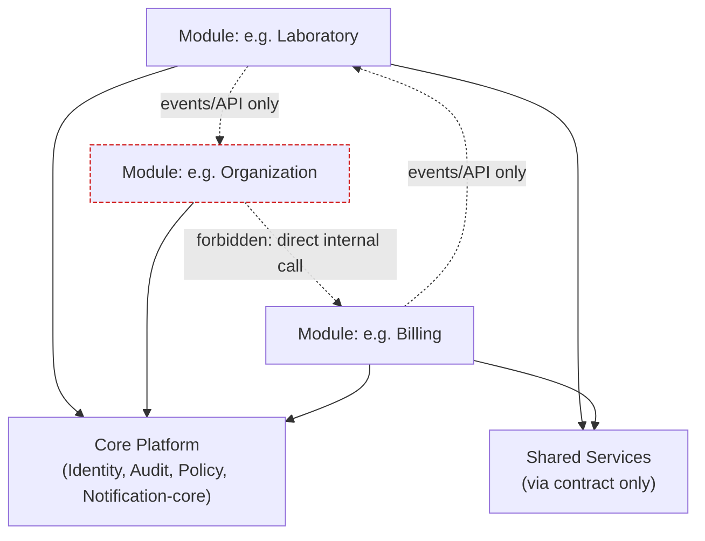
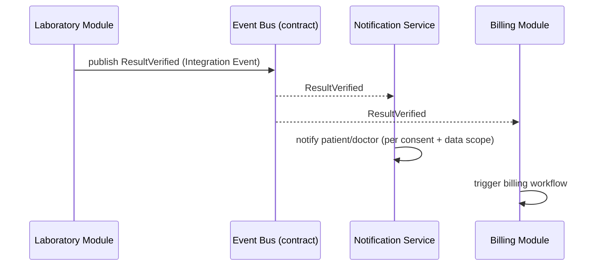
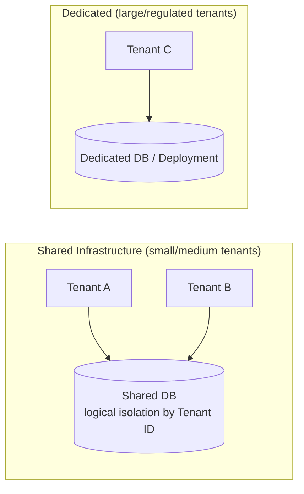
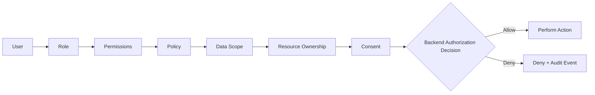
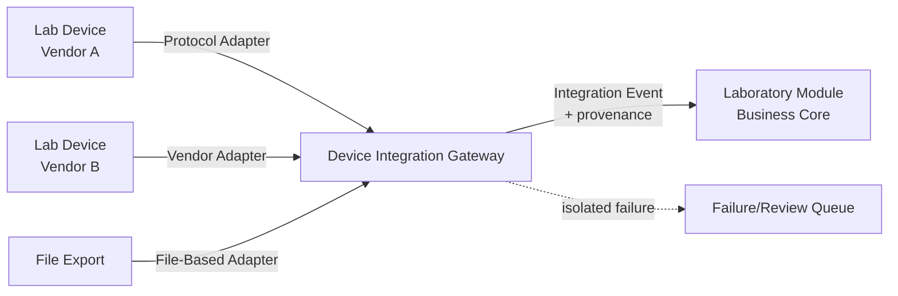
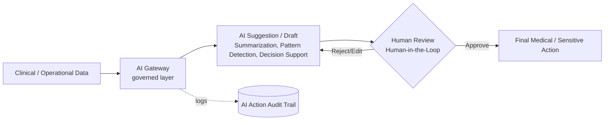
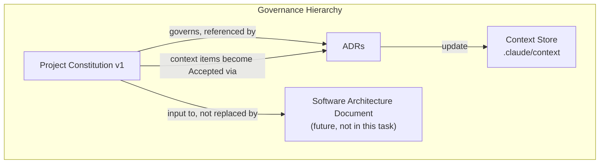
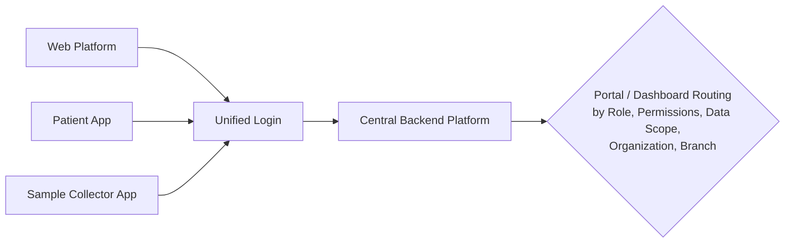

# Project Constitution v1

**Status:** Accepted (v1)
**Applies to:** the digital healthcare platform project (`darhous/test-m3ml`), starting
point: Laboratory Management.
**Relationship to other documents:** this Constitution states the *governing rules*
of the architecture. It is **not** the Software Architecture Document (SAD) — the
SAD (later) describes *how* systems are built to satisfy these rules. It is also not
an implementation plan: it names no programming language, framework, cloud provider,
message broker, database product, AI provider, or frontend framework.

See `docs/constitution/README.md` for authority/process notes and
`docs/constitution/CHANGELOG.md` for the version history.

---

## 1. Purpose and Authority

**Purpose.** This Constitution is the single set of governing rules that every
module, team, and future Software Architecture Document must comply with. Its job
is to make architectural decisions predictable and enforceable *before* large
amounts of code exist, so the platform does not collapse into an unstructured,
tightly-coupled system as it grows from "laboratory management" toward a broad
healthcare platform.

**Authority.**
- This Constitution has precedence over any individual module's local design
  choices. A module may not silently violate a Constitution rule.
- Where this Constitution conflicts with `.claude/context/*.md`, the Constitution
  wins for anything marked `Accepted` in `decisions.md` (each such item has a
  corresponding ADR — see Section 39). Anything still `Draft`/`Proposed`/`Open` in
  the context store is **not** governed yet and is not silently promoted by this
  document.
- Changing an `Accepted` rule in this Constitution requires the Amendment Process
  (Section 45), not an ad-hoc edit.

**Non-authority (explicit boundaries).** This Constitution does **not**:
- Select a programming language, framework, cloud provider, message broker,
  database product, AI provider, or frontend framework.
- Constitute legal, medical-regulatory, or compliance certification of any kind
  (see Section 31, Compliance Readiness Rules).
- Replace the future Software Architecture Document (SAD), which will contain
  concrete technical designs derived from these rules.
- Define a final Module Catalog, a Roadmap, or Tasks.

## 2. Scope

**In scope:** architecture-governing rules for the whole platform: module
boundaries, data ownership, tenancy, security/authorization, device integration,
AI governance, localization, and the engineering practices (testing, ADRs,
documentation, git workflow) needed to keep the architecture coherent as it grows.

**Out of scope for v1:** the final list of Bounded Contexts/Modules (see
`module-catalog.md` — categories only), a detailed SAD, an implementation
Roadmap, specific technology selections, and any answer to the questions still
listed as `Open` in Section 46 / `.claude/context/open-questions.md`.

**Starting point vs. long-term goal.** Per `vision.md`: the platform starts with
**Laboratory Management** and is intended to grow into a broad healthcare
platform with a central Backend Platform, Unified Login, and Role/Permission/
Data-Scope/Organization/Branch-based routing to the correct Portal/Dashboard.
Every rule below is written to hold at both the starting point and the long-term
shape — no rule here assumes "lab-only" forever.

## 3. Vision

Restated from `.claude/context/vision.md` (Draft there; treated here as the
frame this Constitution is built to serve, not as a newly-Accepted fact):

- A Digital Healthcare Platform, not a plain CRUD system.
- Central Backend Platform serving all client surfaces.
- Unified Login; post-login routing to a Portal/Dashboard by Role, Permissions,
  Data Scope, Organization, Branch.
- Direction: API-First, Event-Driven, AI-Ready, Integration-Ready.

This Constitution operationalizes that vision into enforceable rules. It does not
expand the vision itself — vision changes go through `vision.md` first.

## 4. Core Values

| Value | Meaning |
|---|---|
| Modularity over monolith-by-accident | The system is a Modular Monolith by deliberate design, not a Big Ball of Mud that happens to be one deployable. |
| Autonomy with contracts | Modules move independently, but only ever interact through explicit contracts (APIs, events, approved read models). |
| Security is backend-owned | No control that matters is enforced only in a UI. |
| Evidence over imagination | Scaling, compliance, and extraction decisions are triggered by measured needs, not anticipated ones. |
| Human accountability for medical AI | AI assists; humans decide on sensitive clinical matters. |
| Traceability by default | Every sensitive action, medical result, and AI action leaves an audit trail. |
| Deliberate, not premature, global reach | Multi-tenant, multi-organization, multi-branch, Arabic/English, and SaaS/On-Premise/Hybrid are v1 commitments — but implementation depth still follows measured need, not speculation. |

## 5. Architecture Principles

Restates and formalizes the `Accepted` subset of `.claude/context/architecture-principles.md`
(full status update in Section "Update Context" is applied separately to that file).

### Rule: Modular Monolith First
**Required**
- v1 of the platform ships as a Modular Monolith composed of clearly bounded
  Modules, each aligned to one or more Bounded Contexts.
**Forbidden**
- Starting the platform as a set of independently deployed microservices "by
  default."
**Exceptions**
- The components explicitly named in Section 9 (Independent Components) may be
  operationally independent from the start, because they are justified by
  concrete operational needs (protocol isolation, external-facing surface,
  variable load, or governed external calls), not by general microservice
  preference.
**Rationale**
- Avoids distributed-systems cost (network calls, partial failure, eventual
  consistency everywhere) before the domain model and team structure justify it.
**Verification**
- Architecture/dependency tests confirming module code lives in one deployable
  unit except for the named Independent Components.
- ADR required (0001) before this could ever be reversed.

### Rule: Selective Service Extraction Only When Justified
**Required**
- Extracting a module into an independent service requires a documented,
  measurable operational or organizational trigger (e.g., independent scaling
  need observed in production, a team boundary conflict, a hard latency/
  isolation requirement).
**Forbidden**
- Extracting a module "because microservices are best practice" or in
  anticipation of scale that has not been measured.
**Verification**
- An ADR documenting the trigger, alternatives considered, and consequences
  must exist before extraction work starts.

### Rule: Domain-Driven Design as the Modeling Approach
**Required**
- Module boundaries are derived from Bounded Contexts and Ubiquitous Language,
  not from technical layering (e.g., not "all controllers", "all repositories").
**Forbidden**
- A generic technical name (`Manager`, `Helper`, `Processor`, `Utils`) standing
  in for a domain concept in a public module contract.
**Verification**
- DDD consistency review (Section 5 of `REVIEW-REPORT.md`) at each new module's
  design time.

### Rule: Event-Driven Integration Between Modules
**Required**
- Cross-module side effects that other modules react to are expressed as
  Domain/Integration Events, not synchronous calls that assume the callee's
  internal success/failure semantics.
**Forbidden**
- A module directly invoking another module's internal service methods across
  the boundary.
**Exceptions**
- Synchronous request/response through an approved API contract is allowed when
  the caller needs an immediate answer (e.g., "is this permission granted") —
  see Section 12 (Event-Driven Architecture Rules) for the boundary between the
  two.
**Verification**
- Contract tests on published events; module dependency tests forbidding
  synchronous cross-module service imports.

### Rule: API-First Design
**Required**
- Every module defines its public contract (API and/or events) before internal
  implementation is treated as stable.
**Verification**
- API design review using `api-design-principles` prior to a contract being
  marked stable.

### Rule: No Direct Cross-Module Database Access
See Section 16/17 (Data Ownership, Database and Migration Rules) — stated once
here as a top-level principle because it is the single most load-bearing rule
for keeping "Modular Monolith" from silently becoming "Distributed Monolith
with a shared database."

### Rule: Contracts Over Implementation Sharing
**Required**
- Code reuse between modules happens through a published contract (API,
  event schema, shared library that is itself versioned and owned) — never by
  one module importing another module's internal package.
**Forbidden**
- Deep imports into another module's internal namespace/package.
**Verification**
- Dependency-direction architecture tests (Section 9, Module Dependency Rules).

## 6. Domain-Driven Design Rules

**Required**
- Each Module is defined in terms of one or more Bounded Contexts, using
  Ubiquitous Language agreed with the relevant Stakeholders (`stakeholders.md`).
- A Bounded Context is a model/language boundary, not a deployment unit. It is
  not automatically a microservice (see Section 1, DDD skill "Common
  Mistakes").
- Every Bounded Context distinguishes, at minimum: Entities, Value Objects,
  Aggregates (with one Aggregate Root), Domain Events, Repositories.
- Aggregates are kept small: one root plus the minimal cluster needed for its
  invariants; other aggregates are referenced by ID, not object reference.
- An Anti-Corruption Layer is required at every boundary where an external
  system's model would otherwise leak into a Bounded Context's domain model —
  this explicitly includes Device Integration (Section 24) and AI Gateway
  (Section 28) boundaries.

**Forbidden**
- A single "God model" (e.g., one `Patient` class) shared, mutable, and
  understood differently across multiple Bounded Contexts.
- Anemic domain objects that are pure data bags while all business rules live
  in generic "service" classes, for the Core Domain specifically (see Strategic
  Design below).

**Recommendation (not yet a Rule):** identify the Core Domain(s) for the
platform (Strategic Design/Distillation) once module discovery begins; this
Constitution does not name the Core Domain — that requires a dedicated DDD
session and is logged as an Open Question (Section 46).

**Verification**
- DDD consistency review using the `domain-driven-design` skill's Quick
  Diagnostic (7-row checklist) at each Bounded Context's design time.

## 7. Bounded Context Rules

### Rule: Explicit Context Boundaries
**Required**
- Every Bounded Context is named, documented (purpose, Ubiquitous Language
  terms, owning team/module), and appears in a Context Map before
  implementation begins.
**Forbidden**
- An undocumented, implicit context boundary discovered only by reading code.
**Verification**
- Context Map reviewed as part of each module's design review; `c4-architecture`
  System Context/Container diagrams reference the same boundaries.

### Rule: Context Mapping Patterns Must Be Named
**Required**
- Every relationship between two Bounded Contexts is labeled with an explicit
  context-mapping pattern (e.g., Customer/Supplier, Conformist, Anti-Corruption
  Layer, Open Host Service + Published Language, Shared Kernel).
- Shared Kernel is allowed only when explicitly justified and kept small; it
  requires an ADR because it is an exception to Module Ownership (Section 8).
**Forbidden**
- An unlabeled, "just calls it" relationship between two contexts.
**Verification**
- Context Map document review; ADR required for any Shared Kernel.

## 8. Module Ownership Rules

### Rule: One Owning Module Per Bounded Context Concept
**Required**
- Every domain concept (entity, aggregate, event, table) has exactly one owning
  Module. That Module is the only writer of that concept's state.
**Forbidden**
- Two modules both writing to the same conceptual entity/table.
**Rationale**
- Ownership ambiguity is the most common cause of Modular Monolith decay into
  a Big Ball of Mud.
**Verification**
- Data Ownership Rules verification (Section 16) — schema/table-to-module
  mapping check.

### Rule: A Module Owns Its Data, Migrations, Business Rules, and Public Contracts
**Required**
- A module's schema, migrations, business/validation rules, and published
  API/event contracts are authored and versioned by that module alone.
**Forbidden**
- A central "shared migrations" folder that mutates another module's schema.
**Verification**
- Repository/folder governance check (Section 41): migrations live under the
  owning module's directory.

## 9. Module Dependency Rules

### Rule: Acyclic, Directed Module Dependencies
**Required**
- Module dependencies form a Directed Acyclic Graph. Core Platform (Section 10)
  may be depended on by any module; it depends on no module.
**Forbidden**
- Circular dependencies between two modules (A depends on B and B depends on A).
- A module depending on another module's internal implementation details.
**Verification**
- Automated architecture/dependency-direction tests (e.g., a dependency-graph
  check) run as part of Definition of Done (Section 43).



### Rule: Independent Components May Depend on Core Contracts Only
**Required**
- The Independent Components (Section 9 of the decisions list — see Section 11
  below) integrate with modules only via published APIs/events, never via
  direct code dependency.
**Verification**
- Same dependency-direction tests, applied across deployable-unit boundaries
  too.

## 10. Core Platform Rules

**Required**
- Core Platform contains only genuinely cross-cutting capability needed by
  virtually every module: Identity (authn identity, not per-module profile
  data), Policy/Authorization primitives, Audit primitives, and the
  notification/eventing primitives that other modules build on.
- Core Platform exposes stable, versioned contracts; breaking changes follow
  Section 15 (API Versioning and Compatibility Rules).

**Forbidden**
- Placing domain-specific logic (e.g., lab result interpretation, billing
  rules) inside Core Platform "because it's shared."

**Verification**
- Definition-of-Done check: any addition to Core Platform must show it is used
  by 2+ unrelated modules and contains no single-domain business logic.

## 11. Shared Services Rules

Restates the user-approved list of components that **may be operationally
independent from the start** because they are justified by concrete needs
(protocol/vendor isolation, externally-facing surface, independently variable
load, or governed external-provider calls):

- Notification Service
- Device Integration Gateway
- AI Gateway
- Analytics Platform
- Search Service
- File Processing Service
- Public API Gateway
- Background Workers

### Rule: Shared Services Are Consumed Through Contracts Only
**Required**
- Any module using a Shared Service does so through that service's published
  API/event contract.
**Forbidden**
- A module embedding a Shared Service's internal library/config directly
  instead of calling its contract.
**Rationale**
- Keeps these components genuinely extractable/replaceable and prevents a
  "shared service" from becoming a second, informal Core Platform with
  uncontrolled coupling.
**Verification**
- Dependency-direction tests as in Section 9; contract tests per service.

## 12. Event-Driven Architecture Rules

### Rule: Domain Events Stay Inside a Bounded Context; Integration Events Cross It
**Required**
- A Domain Event (internal fact within one Bounded Context) is only promoted to
  an Integration Event (crosses Bounded Context/Module boundaries) through a
  deliberate, documented translation — not by broadcasting internal events
  as-is.
**Forbidden**
- Publishing an internal domain event schema directly as the cross-module
  integration contract.
**Verification**
- Event catalog review: each Integration Event has an explicit owning module,
  schema, and consumers list.

### Rule: Events Are Immutable Facts, Past Tense
**Required**
- Event names describe something that already happened (`ResultVerified`,
  `SampleCollected`), and published events are never mutated after publication
  (corrections are new events, e.g., `ResultCorrected`, referencing the
  original).
**Forbidden**
- Re-publishing an edited version of an already-consumed event under the same
  identity.
**Verification**
- Event schema review; append-only event log design review where an event
  store is used.



## 13. Event Naming and Versioning Rules

**Required**
- Event names: `<BoundedContext>.<AggregateOrConcept><PastTenseVerb>` at the
  integration layer (e.g., `Laboratory.ResultVerified`), to keep provenance
  unambiguous across modules.
- Every Integration Event schema carries an explicit version. Breaking schema
  changes publish a new version; consumers migrate on their own schedule
  during a defined deprecation window (see Section 15 for the compatibility
  policy this follows).

**Forbidden**
- Silently changing a published event schema in a breaking way under the same
  version identifier.

**Verification**
- Event schema registry/catalog check as part of Definition of Done.

## 14. API Design Rules

**Required**
- Every module's public API is designed API-first (contract before
  implementation), reviewed with the `api-design-principles` skill.
- APIs are resource/domain-oriented and use the platform's Ubiquitous Language,
  not database table names.
- All state-changing operations are authorized server-side per Section 21
  regardless of what the API style is.

**Forbidden**
- Leaking internal database identifiers or schema shape directly as the public
  API contract without an explicit mapping layer.

**Verification**
- API governance review (Section quality review, Section "Review Process"
  below) before a contract is marked stable.

*No specific API style (REST/GraphQL/RPC) or protocol is chosen here — that is
an implementation decision for the SAD, guided by these rules.*

## 15. API Versioning and Compatibility Rules

**Required**
- Public API and Integration Event contracts are versioned explicitly.
- Backward-incompatible changes require a new version and a defined
  deprecation window for the old version; they may not silently replace it.
**Forbidden**
- Removing or changing the meaning of a field in a published contract version
  without a version bump.
**Verification**
- Contract/consumer tests; changelog entry required for every contract change.

## 16. Data Ownership Rules

### Rule: Schema per Module
**Required**
- Inside the initial Modular Monolith, every module owns a distinct schema
  (or clearly namespaced table set) and its migrations.
**Forbidden**
- A module reading or writing tables owned by another module directly (no
  cross-schema joins/writes).
**Rationale**
- Preserves module autonomy and future extractability without requiring
  Database per Module from day one.
**Verification**
- Database permission checks (per-module DB role/grants) + repository
  dependency tests forbidding cross-module ORM/query access.

### Rule: Cross-Module Data Access via Contract Only
**Required**
- A module needing another module's data uses: (a) that module's API, (b)
  Domain/Integration Events, or (c) an explicitly approved Read Model
  maintained by (or approved by) the owning module.
**Forbidden**
- Direct SQL joins against another module's owned schema (see worked example
  below).
**Verification**
- Architecture tests; repository dependency tests; database permission checks.

### Rule: No Cross-Module Table Access (worked example, as required by the task brief)
**Required**
- A module accesses another module through an approved contract.
**Forbidden**
- Direct SQL joins against another module's owned schema.
**Rationale**
- Protects module autonomy and future extractability.
**Verification**
- Architecture tests.
- Repository dependency tests.
- Database permission checks.

## 17. Database and Migration Rules

**Required**
- Database per Module is **not** required initially (Schema per Module is the
  v1 baseline).
- A module may move to a fully separate database when/if it is extracted into
  an independent service (Section 5, Selective Service Extraction).
- Large or regulated tenants may receive a dedicated database as part of the
  Hybrid Tenant Isolation model (Section 18/19) — this is a deployment-topology
  decision, not a module-boundary change.
- Every module owns and versions its own migrations; migrations run in an
  order that respects the module dependency graph (Section 9), never assuming
  another module's schema state directly.

**Forbidden**
- A "shared migrations" tool/step that edits multiple modules' schemas in one
  unreviewed migration.

**Verification**
- Migration ownership check (folder governance, Section 41); migration dry-run
  per module in CI.

## 18. Multi-Tenancy Rules

**Required**
- The platform is Multi-Tenant, Multi-Organization, Multi-Branch from v1.
- Tenant, Organization, and Branch are distinct concepts (see `glossary.md`):
  a Tenant may contain multiple Organizations; an Organization may contain
  multiple Branches.
- Every tenant-scoped record carries an explicit Tenant identifier; Data Scope
  (Section 21) is derived from Tenant + Organization + Branch + Role +
  Permissions + Resource Ownership + Consent.

**Forbidden**
- Any tenant-scoped table/entity without an explicit tenant-identifying
  column/attribute "because it's implied by context."

**Verification**
- Schema review checklist item: every tenant-scoped entity has an explicit
  tenant reference.

*Exact multi-tenancy data-partitioning technique (e.g., tenant ID column vs.
separate schema vs. separate database) is Hybrid per Section 19, and the
specific default for the "shared" tier remains an implementation choice for
the SAD, not fixed here.*

## 19. Tenant Isolation Rules

### Rule: Hybrid Tenant Isolation
**Required**
- Small/medium tenants: shared infrastructure with strict logical isolation
  (every query/command scoped by Tenant, enforced server-side).
- Large or regulated tenants: dedicated database or dedicated deployment must
  be an available option.
- Tenant isolation is testable: automated tests must prove tenant A can never
  read/write tenant B's data through any code path.
**Forbidden**
- A code path that determines tenant scope from client-supplied, unverified
  input alone (must be derived from authenticated session/policy context).
**Verification**
- Multi-Tenant Isolation Testing (Section 36): dedicated automated test suite
  attempting cross-tenant access and asserting denial.



## 20. Authentication Rules

**Required**
- Unified Login: one authentication entry point for all user types across all
  clients (Web Platform, Patient App, Sample Collector App).
- Authentication establishes identity only; it does not by itself grant access
  to any resource (see Section 21 for authorization).
- Session/credential validation happens on the backend for every
  privileged request; a client never self-asserts its own role/permission set.

**Forbidden**
- Trusting a client-supplied role/permission claim without backend
  verification against the authoritative Identity/Policy source.

**Verification**
- Security testing (Section 37): attempt to forge/elevate a role claim from
  the client and confirm the backend rejects it.

*No specific authentication protocol/provider is chosen here.*

## 21. Authorization and Data Scope Rules

### Rule: Backend-Enforced Authorization
**Required**
- Every state-changing and every sensitive read operation is authorized on the
  backend, evaluating Role, Permissions, Policy, Data Scope, Organization,
  Branch, Resource Ownership, and Consent.
**Forbidden**
- Relying on UI hiding/disabling as an access control. UI hiding is never
  considered an authorization control (explicit user rule).
**Rationale**
- A UI-only control is trivially bypassed by any direct API call.
**Verification**
- Security tests that call backend endpoints directly, bypassing the UI, and
  confirm authorization still holds.

### Rule: Least Privilege and Deny by Default
**Required**
- Default access is deny; access is granted explicitly per Role/Permission/
  Policy. New capabilities are inaccessible until explicitly granted.
**Forbidden**
- A "default allow, block specific things" authorization model.
**Verification**
- Policy engine test suite asserting an unlisted action is denied by default.

### Rule: Zero Trust Between Modules and Services
**Required**
- Internal service-to-service/module-to-module calls are also authenticated
  and authorized — internal network position is never treated as sufficient
  trust.
**Verification**
- Security tests attempting an internal call without valid service identity/
  authorization context.

### Rule: Explicit Data Scope
**Required**
- Every query that returns tenant/organization/branch/patient-linked data is
  scoped explicitly by the caller's Data Scope; scope is computed server-side
  from Role + Policy + Organization + Branch + Resource Ownership + Consent.
**Verification**
- Data Scope unit tests per role archetype; cross-tenant/cross-branch access
  attempts must fail.

### Rule: Sensitive Operations Require Elevated Controls; Break-Glass Is Exceptional
**Required**
- Operations affecting verified medical results, consent, or cross-tenant
  administrative actions require elevated authorization checks (e.g.,
  step-up verification, dual control, or explicit justification capture).
- Emergency "Break-Glass" access exists only for exceptional situations, is
  time-limited, requires a captured justification, and is fully audited.
**Forbidden**
- A standing, un-time-boxed "admin override" credential used for routine work.
**Verification**
- Audit log review confirming every Break-Glass use has a justification, time
  bound, and follow-up review record.



## 22. Consent and Delegated Access Rules

**Required**
- Where a user acts on behalf of another (e.g., a caregiver, a delegated staff
  role, or a patient granting a doctor access), that delegation is explicit,
  recorded, revocable, and factored into Data Scope.
- Consent state is itself auditable (who granted/revoked, when, scope).

**Forbidden**
- Implicit "assumed consent" derived only from organizational relationship
  without an explicit, recorded grant, for anything touching medical data.

**Verification**
- Consent audit trail review; tests confirming access is denied after consent
  revocation.

*Exact consent model UX and legal sufficiency are Open (Section 46) — this
section states the architectural rule (explicit, recorded, revocable,
auditable), not the legal/regulatory sufficiency of any specific flow.*

## 23. Audit and Traceability Rules

**Required**
- Every sensitive action (verified medical result changes, authorization
  decisions on sensitive operations, consent changes, Break-Glass access, AI
  actions per Section 28) produces an Audit Event.
- Audit Events are immutable and retained independently of the business record
  they describe (an audit trail must survive/outlive the corrected/deleted
  business record it documents).
**Forbidden**
- Deleting or mutating an Audit Event as part of any normal application
  workflow.
**Verification**
- Audit completeness tests: for each sensitive-operation code path, assert an
  Audit Event is produced; immutability enforced at the audit store level
  (e.g., append-only permission grants).

## 24. Medical Device Integration Rules

**Required**
- Device integration exists from the first architecture version, not as a
  later bolt-on.
- Device adapters (protocol-specific and vendor-specific) live outside the
  business Core, behind a Device Gateway, using Vendor Adapters, Protocol
  Adapters, and Integration Events to reach the domain.
- The Device Gateway must be able to support, over time: HL7, HL7 v2, FHIR,
  ASTM, TCP/IP, Serial Communication, File-Based Integration, and Vendor APIs
  — the architecture must not preclude any of these, though not all are
  necessarily implemented in v1.
- Every imported result retains source and provenance (which device, which
  adapter, when, raw-payload reference) permanently.
- A device/adapter failure must not corrupt core business data — failures are
  isolated, logged, and surfaced for review, not silently swallowed or allowed
  to write partial/invalid state into the domain.

**Forbidden**
- Business/domain logic (e.g., result interpretation) living inside a device
  adapter.
- A device adapter writing directly into another module's owned schema
  (Section 16 applies here too — the Device Gateway is itself a module-like
  owner of its own integration data, publishing Integration Events onward).

**Verification**
- Anti-Corruption Layer review at the Device Gateway boundary; fault-injection
  tests simulating malformed/partial device payloads and asserting core data
  integrity is preserved; provenance-field presence check on every imported
  result.



## 25. Workflow and State Transition Rules

**Required**
- Business processes with multiple steps/approvals (e.g., sample collection →
  processing → verification → release) are modeled as explicit, configurable
  Workflows with defined states and allowed transitions — not as ad-hoc status
  flags scattered across code.
- State transitions that affect verified medical results or sensitive data
  require the same authorization/audit treatment as Section 21/23.
**Forbidden**
- An undocumented implicit state machine expressed only as scattered
  conditionals.
**Verification**
- Workflow definition review; state-transition tests confirming illegal
  transitions are rejected.

*Configuration over hardcoded workflows is a Draft principle in
`architecture-principles.md`; this Constitution treats "workflows are
explicit and configurable" as Required, while the exact configuration
mechanism remains an SAD-level implementation choice.*

## 26. Notification Rules

**Required**
- Notifications are triggered by Domain/Integration Events (Section 12), not
  by direct calls buried in unrelated business logic.
- Notification content and delivery respect Data Scope and Consent (Section
  21/22) — a notification must not leak data the recipient is not scoped/
  consented to see.
**Forbidden**
- Embedding sensitive medical detail in a notification channel/payload that
  does not meet the same data-scope/consent bar as the primary application.
**Verification**
- Notification-payload review against Data Scope rules; the specific channel
  set (SMS/Email/Push/WhatsApp/etc.) remains Open (Section 46).

## 27. File and Document Rules

**Required**
- Files/documents (lab reports, device exports, attachments) are owned by the
  module that produced/manages them, with the same provenance requirement as
  Section 24 where the file originates from a device.
- Access to a file/document follows the same Data Scope/Consent rules as
  structured data — a file is not a bypass around Section 21.
**Forbidden**
- A "generic file store" that is readable by any module without going through
  the owning module's authorization check.
**Verification**
- Access-control tests on file/document retrieval endpoints, same pattern as
  Section 21 verification.

## 28. AI Governance Rules

**Required**
- AI is an independent, governed layer — not embedded ungoverned inside
  arbitrary modules.
- Permitted AI-assisted functions: Summarization, patient-friendly
  explanations, pattern detection, anomaly detection, search, operational
  assistance, and clinical decision *support*.
- Human-in-the-Loop is mandatory before any sensitive clinical action is
  finalized.
- Every AI action (prompt, model/version, output, cost, evaluation outcome,
  provider used) is logged and auditable (Section 23 applies to AI actions
  too).
- Sending sensitive information to an external AI provider requires an
  approved policy and controls (e.g., data minimization, contractual/technical
  safeguards) to exist first.

**Forbidden**
- AI independently: approving a medical result, modifying a verified medical
  result, publishing a final diagnosis, or sending a final medical decision
  without human review.
- Sending sensitive data to an external AI provider by default / without an
  approved policy.

**Verification**
- Human-in-the-Loop gate tests: attempt to have an AI-produced sensitive
  output reach a "final" state without a human-approval step, and confirm it
  is blocked.
- AI action audit-log completeness check.
- Policy-gate check on any outbound call to an external AI provider carrying
  sensitive data.



## 29. Security Rules

**Required**
- Backend-Enforced Authorization (Section 21) and Zero Trust between
  internal components are baseline, not optional hardening.
- Least Privilege applies to service accounts, database roles, and
  integration credentials, not only human users.
- A STRIDE-style threat review is performed for each new Bounded
  Context/module and for each new external integration (device, AI provider,
  external API partner) before it goes live.
**Forbidden**
- Shipping a new external-facing integration without a documented threat
  review.
**Verification**
- STRIDE review artifact required per module/integration (see Section 37,
  Security Testing Rules, and the quality review in
  `docs/constitution/REVIEW-REPORT.md`).

## 30. Privacy Rules

**Required**
- Medical data is classified as highly sensitive by default (Constraint #5 in
  `constraints.md`).
- Data minimization applies to any data leaving the platform's control
  (notifications, external AI providers, external API partners, exports).
- Consent (Section 22) governs sharing of personal/medical data beyond the
  minimum needed for direct care/operational purposes.
**Forbidden**
- Sending medical/personal data to an external system/provider without a data
  minimization review and, where applicable, consent.
**Verification**
- Data-flow review for every external integration, checked against
  minimization and consent rules.

## 31. Compliance Readiness Rules

**Required**
- The architecture is built to be *capable* of meeting healthcare
  data-protection and audit requirements (Backend-Enforced Authorization, Full
  Auditability, tenant isolation, consent tracking, data provenance).
- Specific regulatory regimes (per market) are tracked as Open Questions
  (Section 46 / `open-questions.md` items 1–2) until answered.
**Forbidden**
- Any claim, in this document or derived documents, that the platform "is
  compliant" with a named regulation — that is a legal/compliance
  determination outside this Constitution's authority (Section 1).
**Verification**
- This section itself is the guard: any future PR/document claiming legal
  compliance certification must be rejected in review unless it cites an
  actual external compliance assessment, which this task does not produce.

## 32. Localization Rules

**Required**
- Arabic and English are supported from the beginning, with RTL and LTR UI
  support.
- Multi-Currency and Multi-Timezone support, and locale-aware date/number/
  address formatting, are v1 architectural requirements (not later add-ons).
- The architecture allows additional markets/languages later without a
  structural rewrite (e.g., no hardcoded assumption of a single locale/
  currency/timezone anywhere in domain models).
**Forbidden**
- Hardcoding a single language, currency, or timezone assumption into a
  domain model or contract.
**Verification**
- Localization review: domain models/contracts checked for hardcoded locale
  assumptions; RTL/LTR rendering check at UI review time.

## 33. Observability Rules

**Required**
- Observability by Default (Draft principle, elevated to Required here at the
  architecture level): every module exposes enough logging/metrics/tracing to
  answer "is this module healthy" and "what happened for this request,"
  without requiring code changes to add basic visibility.
- Audit Events (Section 23) are a compliance/traceability concern and are
  distinct from operational observability data — the two must not be
  conflated into one undifferentiated log stream.
**Verification**
- Definition-of-Done check: new module ships with baseline
  logging/metrics/tracing and does not mix audit and operational logs.

*Specific observability tooling is not chosen here.*

## 34. Reliability and Resilience Rules

**Required**
- Cross-module Integration Events are designed for eventual consistency and
  at-least-once delivery assumptions (consumers must tolerate
  redelivery/ordering variance unless a stronger guarantee is explicitly
  documented for that event).
- A dependency (device, external AI provider, external API partner, another
  module's API) failing must degrade gracefully — it must not silently corrupt
  data (Section 24) or leave a workflow in an undefined state (Section 25).
**Forbidden**
- A design that assumes exactly-once, in-order delivery of Integration Events
  without an explicit, documented mechanism guaranteeing it.
**Verification**
- Fault-injection/chaos-style tests per critical integration; idempotency
  tests on event consumers.

## 35. Testing Rules

**Required**
- Every module ships with tests proving: its public contract behaves as
  documented, its authorization rules hold (Section 21), and its data-scope
  rules hold (Section 18/19).
- Architecture-level tests (dependency direction, no cross-module DB access)
  run continuously, not just at initial review.
**Forbidden**
- Merging a module without contract-level and authorization-level tests.
**Verification**
- Definition of Done (Section 43) includes explicit test-category checklist.

## 36. Multi-Tenant Isolation Testing Rules

**Required**
- A dedicated test suite attempts cross-tenant and cross-organization/branch
  data access for representative role archetypes and asserts denial in every
  case.
- This suite runs against both the "shared infrastructure" and "dedicated"
  isolation tiers (Section 19).
**Forbidden**
- Treating tenant isolation as "implied correct" from code review alone
  without an executable test proving it.
**Verification**
- The suite itself is the verification artifact; it is required before any
  module handling tenant-scoped data is considered done.

## 37. Security Testing Rules

**Required**
- STRIDE-based threat review (Section 29) is performed per module/integration.
- Each identified threat is mapped to a mitigation using the
  `threat-mitigation-mapping` skill before the module/integration is
  considered done; unmitigated threats are explicitly logged as accepted
  risk with a named owner, not silently dropped.
- Authorization bypass attempts (client-side role forgery, UI-hiding
  reliance, direct backend calls skipping the UI) are part of the standard
  security test set (Section 20/21).
**Forbidden**
- Closing a STRIDE review with unmitigated threats that have no documented
  owner/decision.
**Verification**
- STRIDE + threat-mitigation artifacts stored per module; reviewed as part of
  `docs/constitution/REVIEW-REPORT.md`-style gates going forward.

## 38. Documentation Rules

**Required**
- Every Accepted architectural decision has an ADR (Section 39).
- The Context Store (`.claude/context/`) status taxonomy
  (Draft/Proposed/Accepted/Rejected/Superseded) is respected — this
  Constitution does not silently promote items still marked Draft/Proposed/
  Open elsewhere.
- Diagrams use Mermaid syntax and follow C4 conventions where applicable
  (`c4-architecture`, `mermaid-diagrams` skills).
**Forbidden**
- An "Accepted" statement anywhere in `.claude/context/` without a
  corresponding ADR link.
**Verification**
- Contradiction review (Section "Review Process" / `REVIEW-REPORT.md`) checks
  this explicitly.

## 39. ADR Rules

**Required**
- Any significant architectural decision (module boundary shape, tenancy
  model, security control, integration pattern, AI governance rule) is
  recorded as an ADR under `docs/adr/` before being treated as Accepted.
- ADR status lifecycle: `Proposed → Accepted → Superseded` (or `Rejected`).
  Superseding an Accepted ADR requires a new ADR that references it — an
  Accepted ADR is never edited to reverse its decision.
- ADR content at minimum: Status, Context, Decision, Alternatives Considered,
  Positive Consequences, Negative Consequences, Risks, Verification, Revisit
  Triggers.
**Forbidden**
- Editing an Accepted ADR's Decision section after acceptance instead of
  writing a Superseding ADR.
**Verification**
- `docs/adr/` directory review; `decisions.md` ADR Index cross-check
  (Section "Update Context").

## 40. Naming Conventions

**Required**
- Domain/Ubiquitous Language names in code, contracts, and events — not
  generic technical names (Section 6).
- Integration Event names follow `<BoundedContext>.<Concept><PastTenseVerb>`
  (Section 13).
- ADR files: `docs/adr/NNNN-kebab-case-title.md`, four-digit sequential
  number.
- Context files and this Constitution use the Draft/Proposed/Accepted/
  Rejected/Superseded status vocabulary consistently — no synonyms
  ("Confirmed", "Final", "Locked") introduced ad hoc.
**Verification**
- Naming-convention spot check as part of documentation/code review.

## 41. Repository and Folder Governance

**Required structure (documentation layer, established by this task):**
```
docs/
  constitution/
    PROJECT-CONSTITUTION.md
    README.md
    CHANGELOG.md
    REVIEW-REPORT.md
  adr/
    0001-modular-monolith-first.md
    ...
.claude/
  context/            (Context Store — status-tagged, not final)
  skills/             (project-scoped Agent Skills)
CLAUDE.md             (working-agreement summary)
```
**Required**
- Module source code (when it exists) is organized by Bounded Context/module
  name, not by technical layer at the top level (Section 6).
- Each module's migrations live under that module's own directory (Section
  17).
**Forbidden**
- A top-level `controllers/`, `services/`, `models/` split that mixes all
  modules' code together.
**Verification**
- Repository structure review at first code-scaffolding time (out of scope
  for this task, but the rule is fixed now to avoid rework later).

## 42. Git Workflow

Restates and elevates `CLAUDE.md` Section 16 (already Accepted working
agreement) as an architecture-governance rule, since it governs how all the
above gets safely captured over time:

**Required**
- All completed work stages are saved on `main`.
- `git pull --rebase origin main` before starting work.
- A clear commit, then `git push origin main`, after each completed stage.
**Forbidden**
- Force push, under any circumstance, without explicit fresh user approval
  for that specific push.
**Exceptions**
- None standing; any exception requires explicit, one-time user approval.
**Verification**
- Stop-and-ask on any conflict or rejected push (no automated resolution).

## 43. Definition of Done for Architectural Work

A module/integration/decision is "done" at the architecture level only when:

- [ ] Its Bounded Context and Ubiquitous Language terms are documented.
- [ ] Its public contract (API/events) is defined and versioned (Sections
      13–15).
- [ ] It has no direct cross-module DB access (Section 16/17) — verified by
      architecture tests.
- [ ] Data Scope and Authorization rules are implemented and tested (Section
      21, 35, 36).
- [ ] A STRIDE review has been performed and threats mapped to mitigations or
      explicitly accepted with an owner (Section 29, 37).
- [ ] Audit Events are emitted for its sensitive operations (Section 23).
- [ ] If it involves AI: Human-in-the-Loop gates and AI action logging are in
      place (Section 28).
- [ ] If it involves a device: Anti-Corruption Layer, provenance, and
      failure-isolation are in place (Section 24).
- [ ] Localization assumptions are checked (no hardcoded locale/currency/
      timezone) (Section 32).
- [ ] An ADR exists for any significant decision embedded in it (Section 39).
- [ ] Relevant `.claude/context/` files are updated, preserving history
      (Section "Update Context").

## 44. Exception Process

**Required**
- Any deviation from a `Required`/`Forbidden` rule in this Constitution must
  be: (1) proposed explicitly with the specific rule and reason, (2) approved
  by the user (project owner) before implementation, (3) recorded as either a
  documented `Exception` on the relevant rule (if narrow and recurring) or a
  superseding ADR (if it changes the rule generally).
**Forbidden**
- Silent deviation discovered only after the fact in code review.
**Verification**
- Contradiction review (quality gate) checks that no shipped module violates
  a rule without a linked exception/ADR.

## 45. Constitution Amendment Process

**Required**
- Amending an `Accepted` rule in this Constitution requires: (1) explicit
  user request or approval, (2) an entry in `docs/constitution/CHANGELOG.md`
  describing what changed and why, (3) a version bump if the change is
  substantive, (4) an ADR if the amendment reverses or materially changes a
  decision that itself has an ADR (Section 39).
**Forbidden**
- Editing this document's `Accepted` content without a corresponding
  CHANGELOG entry.
**Verification**
- `CHANGELOG.md` review alongside any diff to this file.

## 46. Open Questions

Carried over from `.claude/context/open-questions.md` (unchanged, still
Open — this Constitution does not answer them):

1. Target countries/markets.
2. Local legal/regulatory requirements (regulatory/health/data-protection).
3. Hosting model specifics beyond "SaaS First, On-Premise Ready, Hybrid
   Ready" (Section "Tenancy and Deployment" is Accepted at that level; finer
   detail is still Open).
4. Expected scale specifics (exact user/transaction/lab counts beyond the
   qualitative targets in Section "Scalability").
5. Lab device types/protocols to support first.
6. Offline Mode requirement.
7. The precise default data-partitioning technique for the "shared"
   isolation tier (Section 19 fixes the two-tier model; the shared tier's
   exact technique is still open).
8. Data isolation requirements in more regulatory detail than Section 19.
9. Whether hospitals/clinics are supported from v1 or only laboratories.
10. Notification channel set (SMS/Email/Push/WhatsApp/etc.).
11. Fuller detail on AI usage limits beyond Section 28's governance rules.
12. Languages/currencies beyond the confirmed Arabic/English baseline
    (Section 32).
13. Legacy system migration needs.

New open item raised while writing this Constitution:

14. Which Bounded Context is the platform's Core Domain (Strategic
    Design/Distillation, Section 6) — not yet decided; requires a dedicated
    DDD session once module discovery starts.

## 47. Glossary

This Constitution uses the terms defined in `.claude/context/glossary.md`
(Tenant, Organization, Branch, User, Role, Permission, Policy, Data Scope,
Bounded Context, Module, Core Platform, Shared Service, Domain Event,
Integration Event, Workflow, Portal, Module SDK, Module Template, Plugin
Contract, Audit Event, Human-in-the-Loop) without redefining them here, to
avoid two sources of truth. Terms introduced by this Constitution and not yet
in the glossary:

| Term | Definition | Status |
|---|---|---|
| Independent Component | A component (Notification Service, Device Integration Gateway, AI Gateway, Analytics Platform, Search Service, File Processing Service, Public API Gateway, Background Workers) permitted to be operationally independent from v1 for a documented reason, without being a general microservices default. | Accepted (this Constitution) |
| Hybrid Tenant Isolation | The two-tier tenant isolation model: shared infrastructure with logical isolation for small/medium tenants, dedicated database/deployment option for large/regulated tenants. | Accepted (this Constitution) |
| Break-Glass Access | Exceptional, time-limited, justified, fully audited emergency access path that bypasses normal authorization flow. | Accepted (this Constitution) |
| Anti-Corruption Layer | A translation layer preventing an external system's (device, AI provider, legacy system) model from leaking into a platform Bounded Context's domain model. | Accepted (this Constitution, per DDD skill) |
| Core Domain | The Bounded Context(s) where the platform's competitive/differentiating value lives, warranting the deepest modeling investment. | Open — not yet identified (Section 46, item 14) |

---

## Independent Components, Tenancy, Data, Clients, Security, Devices, AI,
## Localization, and Scalability — Consolidated Accepted Decisions

The following restates, in one place, every decision block the user marked
"Accepted for Constitution v1" verbatim in scope, cross-referenced to the
section(s) above that turn it into enforceable rules. This block exists so
the Constitution can be read top-to-bottom without losing the original
decision grouping; it introduces no new rules beyond Sections 5–36 above.

| Decision Area | Accepted Content | Governed by Section(s) |
|---|---|---|
| Architecture | Modular Monolith First; Selective Service Extraction; DDD; Bounded Contexts; Event-Driven Integration; API-First; No direct cross-module DB access; Contracts over implementation sharing; module owns data/migrations/rules/contracts; independent gateways/services allowed where justified | 5, 6, 9, 10, 12, 14, 16 |
| Independent Components | Notification Service, Device Integration Gateway, AI Gateway, Analytics Platform, Search Service, File Processing Service, Public API Gateway, Background Workers | 11 |
| Tenancy and Deployment | SaaS First, On-Premise Ready, Hybrid Ready, Multi-Tenant, Multi-Organization, Multi-Branch, Hybrid Tenant Isolation, replaceable cloud provider where practical, configurable data residency | 18, 19 |
| Data | Schema per Module, module owns schema/migrations, no direct cross-module table access, contract-only cross-module access, Database per Module not required initially, dedicated DB for large/regulated tenants, medical data highly sensitive | 16, 17 |
| Clients | Unified Web Platform, dedicated Patient App, dedicated Sample Collector/Home Visit App, shared Backend Platform, Unified Login, Portal/menu/action routing by User/Role/Permissions/Policies/Data Scope/Organization/Branch/Resource Ownership/Consent | 20, 21 |
| Security and Authorization | Backend-Enforced Authorization, Least Privilege, Zero Trust, Explicit Data Scopes, Deny by Default, Full Auditability, elevated controls for sensitive ops, Break-Glass rules, testable tenant isolation, UI hiding is not authorization | 21, 22, 23, 29 |
| Medical Device Integration | Included from v1, adapters outside Core, Device Gateway + Vendor/Protocol Adapters + Integration Events, HL7/HL7v2/FHIR/ASTM/TCP-IP/Serial/File-Based/Vendor API readiness, no core-data corruption on device failure, provenance retained | 24 |
| AI | Independent governed layer, permitted assistive functions, forbidden autonomous final medical actions, mandatory Human-in-the-Loop, auditable AI actions, governed prompts/models/outputs/costs/evaluations/provider usage, no ungoverned sensitive data to external providers | 28 |
| Localization | Arabic and English from the beginning, RTL/LTR, Multi-Currency, Multi-Timezone, locale-aware formatting, architecture allows more markets/languages later | 32 |
| Scalability | Ready to evolve toward thousands of organizations, tens of thousands of branches, millions of patients/orders/results, high event throughput; no premature infrastructure over-engineering; scaling triggered by measured needs | Section 5 (Selective Service Extraction), Section 34 |





---

*End of Project Constitution v1. This document deliberately excludes: final
Module Catalog, Roadmap, Tasks, programming language/framework/cloud/broker/
database/AI-provider/frontend-framework choice, and any final legal
compliance claim.*
