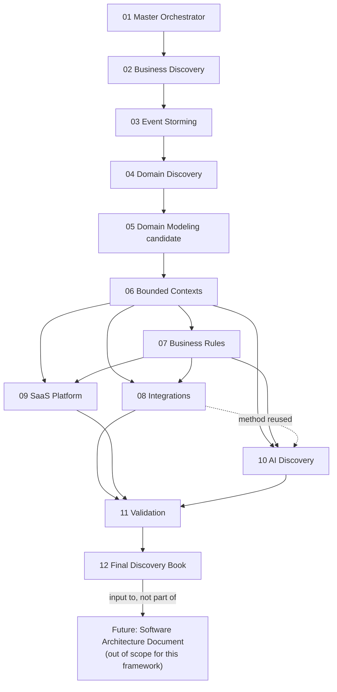

# Enterprise Discovery Framework

**Status:** Accepted (framework definition — governs how Discovery is run,
not itself a Discovery output)
**Applies to:** the Discovery phase of `darhous/test-m3ml` (digital
healthcare platform, starting point Laboratory Management), and is designed
to be reusable, largely as-is, for future Enterprise projects (see "Reuse
Design," below).
**Relationship to other documents:** this framework operationalizes
Discovery *underneath* `docs/constitution/PROJECT-CONSTITUTION.md` v2 — it
does not add, remove, or reinterpret any Constitution rule or ADR. It
produces the inputs a future Software Architecture Document (SAD) task will
consume. It is not the SAD itself, and Discovery has not been executed as
of this document's creation (see `docs/discovery/README.md` for current
status).

---

## 1. Why 12 Playbooks (and why not 11 or 15)

Each playbook in `docs/discovery/prompts/` obeys Single Responsibility: one
playbook, one clearly bounded question, one set of deliverables that the
*next* playbook (and only the next few, per the dependency table below)
consumes. The count is justified, not accepted by default:

- **01 (Master)** must be separate from the content phases because it has a
  fundamentally different job — sequencing and gating, not discovering
  anything. Merging it into 02 would make Business Discovery responsible
  for orchestration too, violating Single Responsibility.
- **02 (Business) / 03 (Event Storming) / 04 (Domain Discovery)** are three
  separate concerns commonly conflated in weaker Discovery processes:
  *why the business exists* (02), *what actually happens, chronologically*
  (03), and *how to classify what happens into subdomains* (04). Merging
  02+03 would bias event elicitation toward whatever business capabilities
  were named first, instead of letting the raw event chronology surface
  capabilities Business Discovery missed. Merging 03+04 would force
  clustering decisions before the full event picture exists.
- **05 (Domain Modeling) / 06 (Bounded Contexts)** are kept separate and in
  this specific order deliberately — see the explicit "Note on Ordering" at
  the top of `prompts/05_DOMAIN_MODELING.md`. Collapsing them into one
  playbook would hide the exact moment where candidate tactical structures
  get formally partitioned, which is the single most error-prone step in
  DDD-driven discovery (Bounded-Context-mistaken-for-microservice, and
  Aggregate-boundary-drawn-too-early are both symptoms of skipping this
  separation).
- **07 (Business Rules)** must follow, not precede, 06 — a rule/invariant
  cannot be correctly scoped to "which Bounded Context enforces this" until
  the context exists. It also must not be merged into 05, because 05 is
  structural (what are the parts) and 07 is behavioral (what must always be
  true) — conflating them produces Aggregates designed around whichever
  rule was discussed first rather than around real consistency boundaries.
- **08 (Integrations) / 09 (SaaS Platform) / 10 (AI Discovery)** are three
  distinct external-facing concerns that a single "cross-cutting concerns"
  playbook would flatten into an unreviewable grab-bag. Each has a
  different Constitution anchor (Section 24, Sections 18–19/32, Section 28
  respectively) and a different specialist skill set
  (`stride-analysis-patterns` general use vs. tenancy-pattern reasoning vs.
  `threat-mitigation-mapping` focused on AI data flows). 10 is kept
  separate from 08 specifically because AI governance (Constitution Section
  28, ADR 0007) carries materially higher review weight (mandatory
  Human-in-the-Loop design per use case) than a typical device/API
  integration — folding it into 08 would let AI use cases get the same
  lighter review a routine integration gets.
- **11 (Validation)** must be separate from every content phase because its
  entire value is seeing *across* phases (cross-phase contradictions,
  platform-wide DDD smells, a full STRIDE pass) — a check embedded inside
  each content phase can only ever see that one phase's own output.
- **12 (Final Discovery Book)** must be separate from 11 because compiling
  and ADR-authoring is a distinct responsibility from reviewing — conflating
  them would create pressure to compile before Validation is actually clean,
  since "just fix it while compiling" is exactly the shortcut Single
  Responsibility is meant to prevent.

**Conclusion: 12 is correct for this project.** No two playbooks share a
responsibility, and no playbook is so thin it adds process overhead without
adding a real, separable checkpoint. A future Enterprise project with a
much smaller domain (e.g., a single-Bounded-Context internal tool) could
justifiably merge 08–10 into one "External Concerns" playbook — that
would be a legitimate, documented deviation for that project's context, not
a change to this framework's default.

## 2. Reuse Design

The `prompts/` playbooks are written in two layers, deliberately, so the
framework can be copied to a future Enterprise project with minimal
editing:

1. **Generic methodology** (the bulk of every playbook: Purpose, Scope,
   Execution Steps, Review Checklist, Quality Gates, Common Mistakes) —
   applies to any Enterprise Discovery effort using DDD/Event-Storming-based
   discovery, regardless of domain.
2. **Project Bindings** (one short section per playbook, plus the specific
   file paths named throughout) — the only parts that need to change for a
   new project: swap the Constitution/ADR/Context file paths and the
   project-specific constraints named in each "Project Bindings" section.

`DISCOVERY-FRAMEWORK.md`, `EXECUTION-GUIDE.md`, and `EXECUTE-DISCOVERY.md`
themselves reference this project's specific paths throughout (they are not
written as pure templates) — a future reuse should treat the `prompts/`
folder as the reusable core and treat these three top-level documents as
worked examples to adapt, not as templates to copy verbatim.

## 3. Phase Order and Dependency Table

| # | Playbook | Depends On | Produces | Consumed By |
|---|---|---|---|---|
| 01 | Master Orchestrator | — | Execution ledger | All phases (gates each) |
| 02 | Business Discovery | 01 | Business Capability Map, Value Streams | 03, 04, 09 |
| 03 | Event Storming | 02 | Event Storming board, Hotspots, Pivotal Events | 04, 05, 08 |
| 04 | Domain Discovery | 03 | Subdomain map, Core/Supporting/Generic classification, proposed Core Domain answer | 05, 06 |
| 05 | Domain Modeling (candidate) | 04 | Candidate Aggregates/Entities/Value Objects, cross-Subdomain overlap list | 06, 07 |
| 06 | Bounded Contexts | 05 | Formal Context list, Context Map, Module Ownership draft | 07, 08, 09, 12 |
| 07 | Business Rules | 06 | Invariant catalog, state machines, Sensitive Operation flags | 08, 12 |
| 08 | Integrations | 06, 07 | Integration inventory, ACL designs, first-pass STRIDE | 09, 10, 11 |
| 09 | SaaS Platform | 06, 07 | Tenancy/localization analysis, narrowed Open Questions | 11, 12 |
| 10 | AI Discovery | 06, 07, 08 (method) | AI use-case catalog, HITL designs, rejected-candidate log | 11, 12 |
| 11 | Validation | 02–10 (all) | Validation report, full STRIDE+mitigation mapping | 12 |
| 12 | Final Discovery Book | 11 | Discovery Book, new ADRs, updated Context Store, Completion Report | Future SAD task |

## 4. Where Context Gets Updated

| Playbook | `.claude/context/` files touched | Nature of update |
|---|---|---|
| 02 | `stakeholders.md`, `open-questions.md` | Refine needs, append new questions |
| 03 | `glossary.md`, `open-questions.md` | Append terms, append Hotspot-derived questions |
| 04 | `open-questions.md` (item 14), `glossary.md` | Propose Core Domain answer, append Subdomain terms |
| 05 | `glossary.md` | Append tactical building-block terms |
| 06 | `module-catalog.md`, `glossary.md` | Append Discovery-candidate contexts, per-context terms |
| 07 | `open-questions.md`, `constraints.md` | Append unresolved rule Hotspots, append user-confirmed constraints |
| 08 | `open-questions.md` (items 5, 10, 13) | Update with findings |
| 09 | `open-questions.md` (items 3, 4, 15, 16), `constraints.md` | Narrow with evidence |
| 10 | `open-questions.md` (item 11) | Narrow with use-case boundaries |
| 11 | `open-questions.md` | Final-pass accuracy correction only |
| 12 | `decisions.md`, `glossary.md`, `constraints.md`, `open-questions.md`, `module-catalog.md` | Formal promotion, ADR cross-references, final consolidation |

**Rule governing every row above:** every update is append-only and
status-tagged (Draft/Proposed/Accepted/Rejected/Superseded, per
`.claude/context/README.md`'s taxonomy). No playbook before 12 may write
`Accepted` into a Context Store file. Only Playbook 12, and only for a
finding Playbook 11 validated with zero contradictions, may do so — and
only alongside the ADR that Constitution Section 39 requires for it.

## 5. Where ADRs Get Updated

**No playbook before 12 authors an ADR.** Playbooks 02–11 may *flag* that a
finding looks ADR-worthy (each has an "ADR Impact" section stating this
explicitly), but the actual authoring — using the
`architecture-decision-records` skill, following the exact format of the
existing `docs/adr/0001`–`0010` — happens exclusively in Playbook 12, after
Playbook 11's Validation confirms the finding has no unresolved
contradiction. This mirrors the same discipline the Constitution itself
uses (Section 39: ADR before Accepted) and prevents Discovery from
accumulating premature, unvalidated ADRs that would later need superseding.

## 6. When Reports Get Created

Every content playbook (02–10) produces its own phase report under
`docs/discovery/reports/NN-<phase>-report.md` at the end of its own
Execution Steps — this is not deferred to Validation. Playbook 11 produces
two additional, cross-phase reports (`11-validation-report.md`,
`11-stride-mitigation-mapping.md`). Playbook 12 produces the final
`12-discovery-completion-report.md`. Playbook 01 maintains a continuously
updated execution ledger (`artifacts/00-master-execution-log.md`), which is
not a "report" in the same sense — it is a live process record, updated
throughout the run rather than produced once at phase end.

## 7. When Diagrams Get Created

Diagrams are produced by the playbook that owns the content they visualize
(see each playbook's own "Required Diagrams" section) — not batched at the
end. Playbook 11 does not create new diagrams; it validates the syntax of
every diagram already produced. Playbook 12 does not create new diagrams
either; it assembles a consolidated index referencing what already exists.
This keeps every diagram traceable to the phase whose findings it depicts,
consistent with Playbook 12's Traceability Gate ("no new claims introduced
at compilation time" — the same principle applied to diagrams as to text).

## 8. Stage-Transition Criteria

A phase may begin only when:

1. Every phase it depends on (Section 3's table) is marked `complete` in
   the Playbook 01 execution ledger.
2. That completion was verified against the dependency phase's own Exit
   Criteria, not merely its existence (Playbook 01, Execution Step 4c).
3. No open Stop Condition from an earlier phase remains unresolved.

A phase may be marked `complete` only when its own Exit Criteria (stated in
its playbook) are fully satisfied — partial completion is recorded as
`blocked` or `in progress` in the ledger, never rounded up to `complete`.

## 9. Quality Gates (Framework-Level Summary)

Every content playbook enforces its own Quality Gates (see each playbook).
At the framework level, three gates apply across all of them:

- **No-Guessing Gate:** every finding traces to an explicit user statement,
  existing Confirmed/Accepted context, or is left `Open` — never asserted
  from inference alone. This is `CLAUDE.md` Section 3 applied uniformly
  across all 12 playbooks, not a Discovery-specific invention.
- **ADR-Before-Accepted Gate:** no Context Store file gains an `Accepted`
  entry without a corresponding ADR, enforced structurally by restricting
  ADR authoring to Playbook 12 (Section 5, above).
- **Constitution Non-Contradiction Gate:** no Discovery finding may
  contradict an Accepted Constitution rule or ADR; any apparent
  contradiction is escalated per Constitution Section 44, never resolved by
  silently reinterpreting either the finding or the rule.

## 10. Definition of Complete (for the Discovery phase as a whole)

Discovery is complete only when **all** of the following hold:

- [ ] Playbook 01's execution ledger shows Playbooks 02–12 all `complete`.
- [ ] Playbook 11's Validation Report shows zero unresolved contradictions
      and zero unmitigated/unowned STRIDE threats.
- [ ] Playbook 12's Discovery Book and Discovery Completion Report both
      exist and pass the Reader Test.
- [ ] Every Context Store file touched during Discovery preserves its full
      history (no deletions), per each file's own established rule.
- [ ] Every new ADR (if any) follows the exact format of
      `docs/adr/0001`–`0010` and is cross-referenced from
      `.claude/context/decisions.md`.
- [ ] `.claude/context/module-catalog.md`'s Discovery-candidate update is
      explicitly labeled as candidates, not a final Module Catalog
      (Constitution Section 2/46 still applies — Discovery narrows, it does
      not by itself finalize, the Module Catalog).
- [ ] No Software Architecture Document content, no production code, and no
      technology/language/framework/cloud/database/AI-provider selection
      exists anywhere in the Discovery output (same boundary the
      Constitution itself observes).

Discovery being "complete" per this definition is the precondition for
starting a future Software Architecture Document task — it is not itself
that task.
