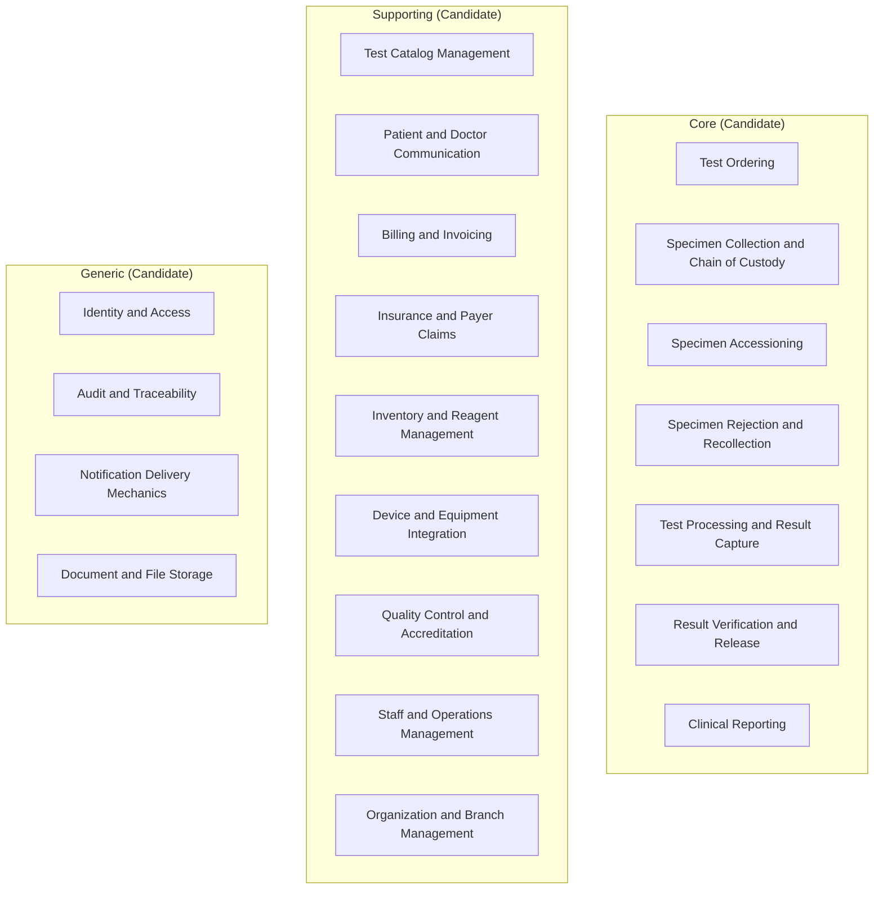

# Diagram — Business Capability Map (Phase 02)

```mermaid
flowchart TB
  subgraph Core["Core (Candidate)"]
    C1[Test Ordering]
    C2[Specimen Collection and Chain of Custody]
    C3[Specimen Accessioning]
    C4[Specimen Rejection and Recollection]
    C5[Test Processing and Result Capture]
    C6[Result Verification and Release]
    C7[Clinical Reporting]
  end

  subgraph Supporting["Supporting (Candidate)"]
    S1[Test Catalog Management]
    S2[Patient and Doctor Communication]
    S3[Billing and Invoicing]
    S4[Insurance and Payer Claims]
    S5[Inventory and Reagent Management]
    S6[Device and Equipment Integration]
    S7[Quality Control and Accreditation]
    S8[Staff and Operations Management]
    S9[Organization and Branch Management]
  end

  subgraph Generic["Generic (Candidate)"]
    G1[Identity and Access]
    G2[Audit and Traceability]
    G3[Notification Delivery Mechanics]
    G4[Document and File Storage]
  end
```
