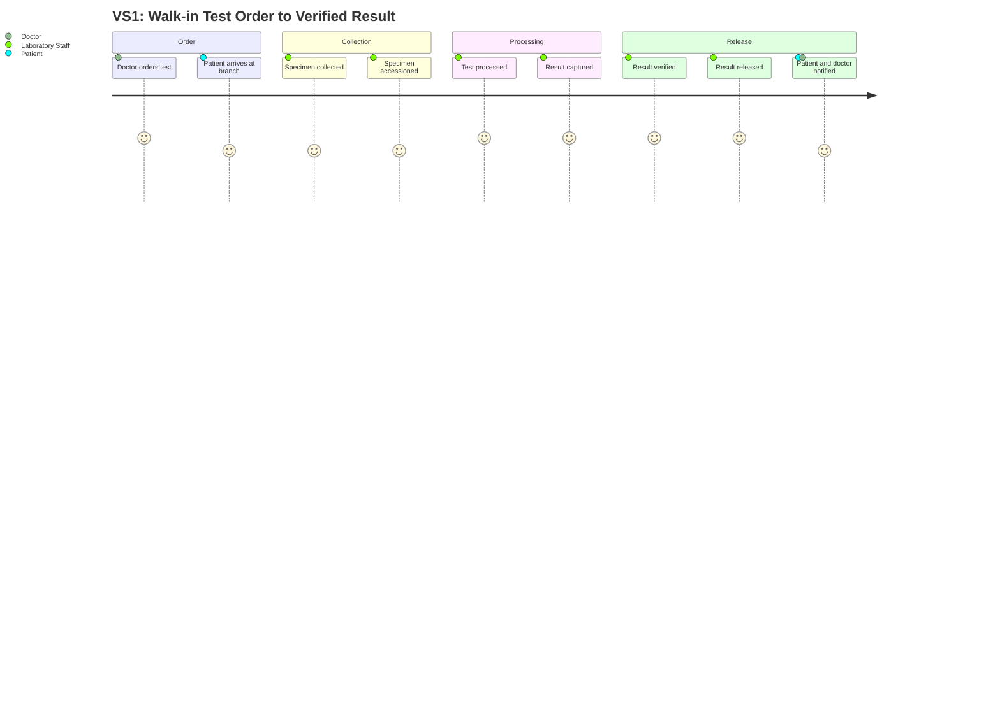
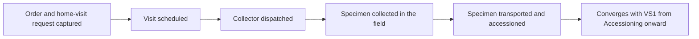
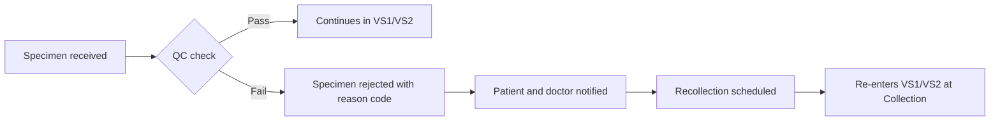
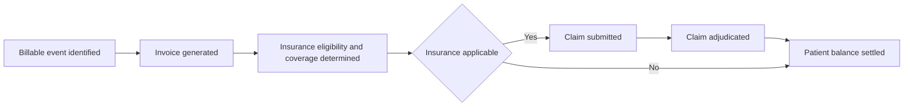

# Diagrams — Value Streams (Phase 02)

## VS1 — Walk-in Test Order to Verified Result Delivery

## VS2 — Home Sample Collection to Verified Result Delivery

## VS3 — Specimen Rejected and Recollected

## VS4 — Insurance Claim Billing Cycle

