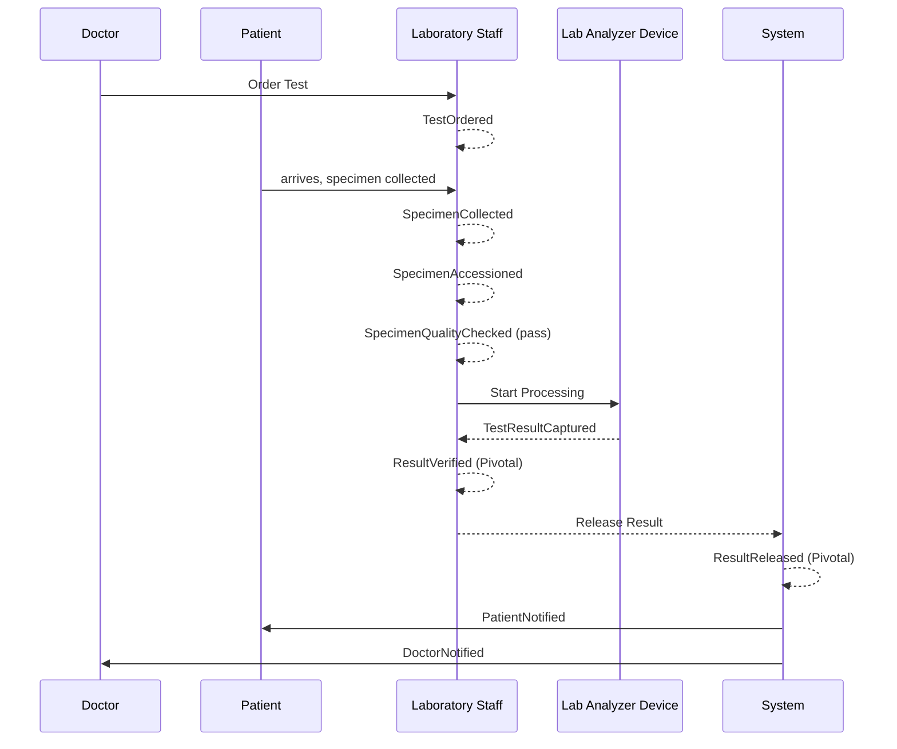
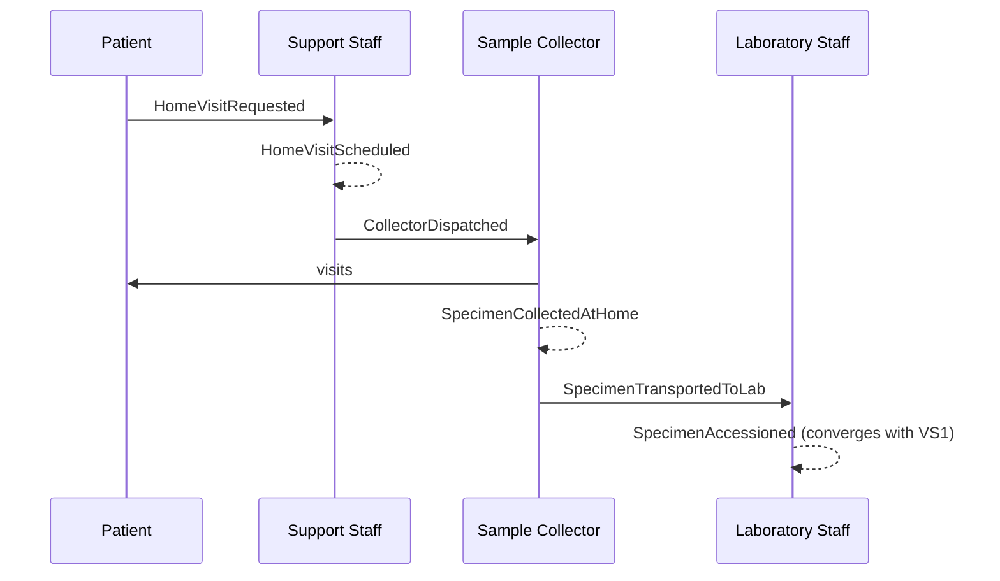
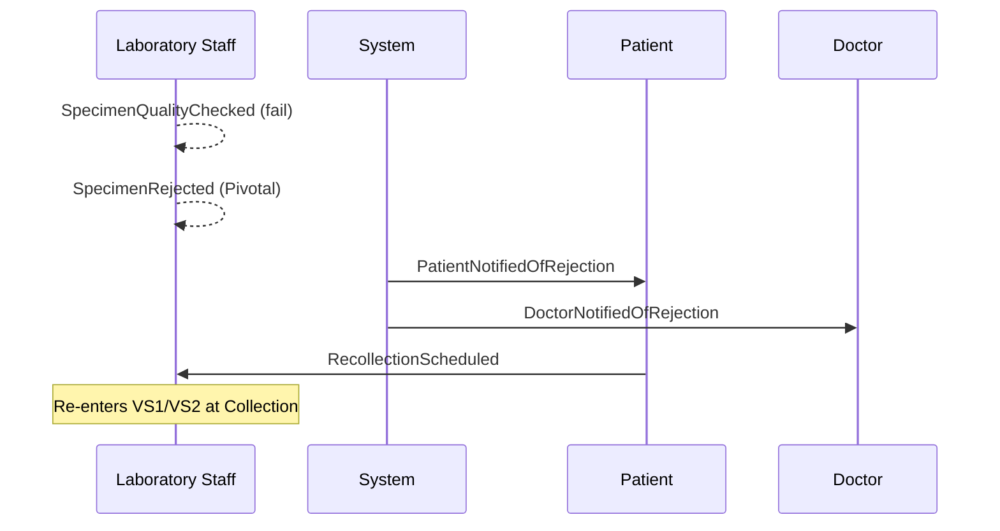
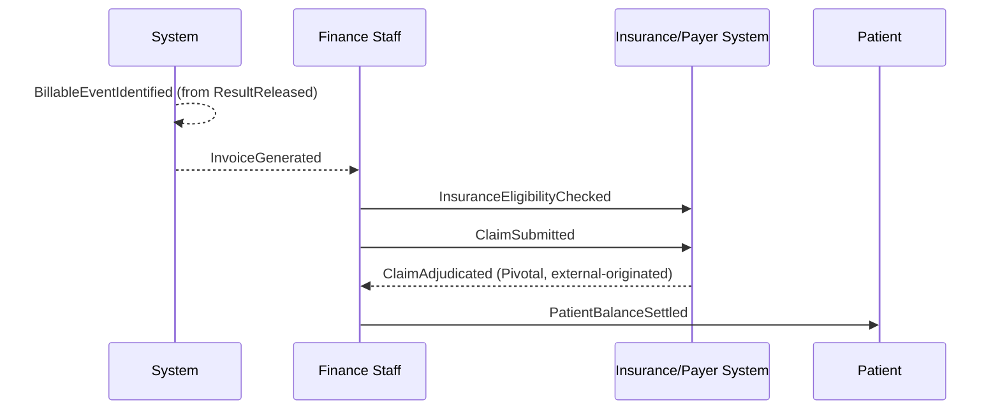

# Diagrams — Event Storming Timelines (Phase 03)

## VS1 — Walk-in Test Order to Verified Result Delivery

## VS2 — Home Sample Collection

## VS3 — Specimen Rejected and Recollected

## VS4 — Insurance Claim Billing Cycle

