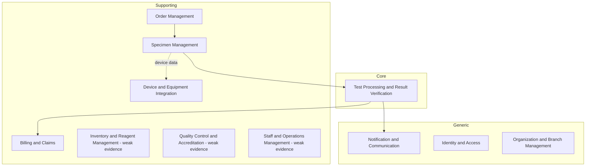

# Diagram — Subdomain Map (Phase 04)

```mermaid
flowchart TB
  subgraph Core["Core"]
    D3[Test Processing and Result Verification]
  end

  subgraph Supporting["Supporting"]
    D1[Order Management]
    D2[Specimen Management]
    D5[Billing and Claims]
    D7[Device and Equipment Integration]
    D9[Inventory and Reagent Management - weak evidence]
    D10[Quality Control and Accreditation - weak evidence]
    D11[Staff and Operations Management - weak evidence]
  end

  subgraph Generic["Generic"]
    D4[Notification and Communication]
    D6[Identity and Access]
    D8[Organization and Branch Management]
  end

  D1 --> D2 --> D3
  D3 --> D4
  D3 --> D5
  D2 -. device data .-> D7
```
