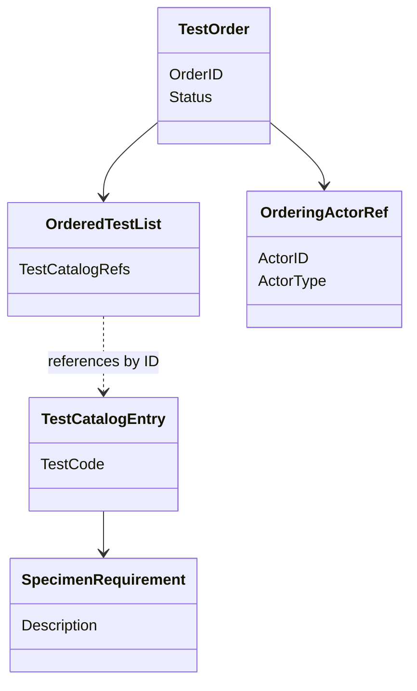
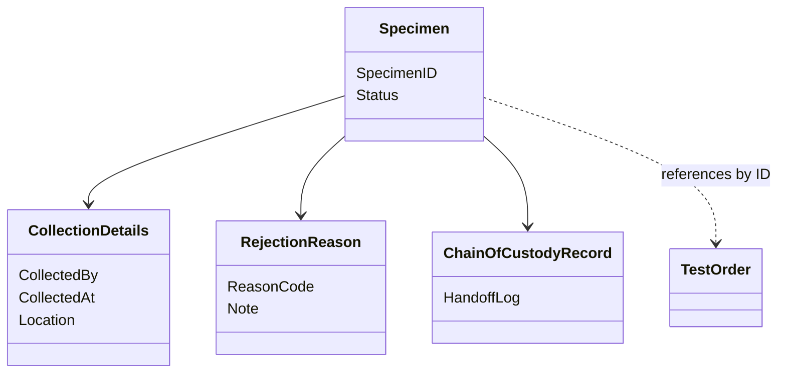
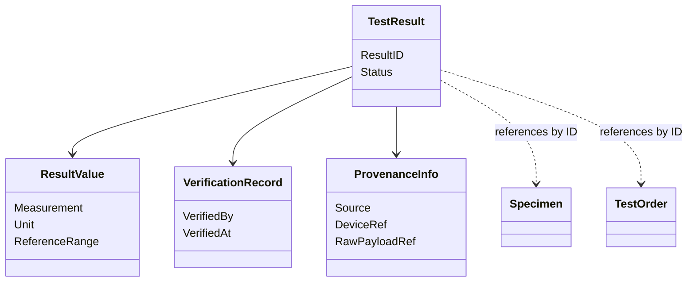
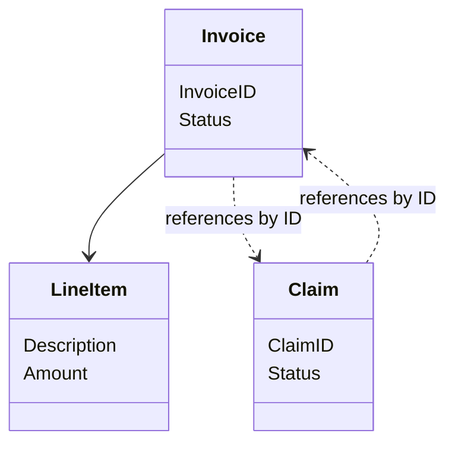

# Diagrams — Candidate Aggregates (Phase 05)

## Subdomain 1 — Order Management

## Subdomain 2 — Specimen Management

## Subdomain 3 — Test Processing and Result Verification (Core)

## Subdomain 5 — Billing and Claims

