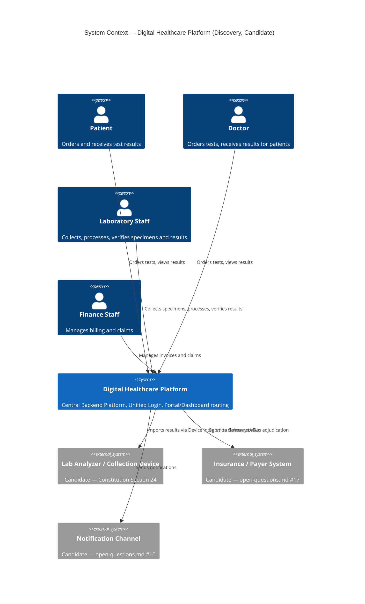

# Diagram — C4 System Context (Phase 06)

```mermaid
C4Context
  title System Context — Digital Healthcare Platform (Discovery, Candidate)

  Person(patient, "Patient", "Orders and receives test results")
  Person(doctor, "Doctor", "Orders tests, receives results for patients")
  Person(labstaff, "Laboratory Staff", "Collects, processes, verifies specimens and results")
  Person(finance, "Finance Staff", "Manages billing and claims")

  System(platform, "Digital Healthcare Platform", "Central Backend Platform, Unified Login, Portal/Dashboard routing")

  System_Ext(device, "Lab Analyzer / Collection Device", "Candidate — Constitution Section 24")
  System_Ext(payer, "Insurance / Payer System", "Candidate — open-questions.md #17")
  System_Ext(notif, "Notification Channel", "Candidate — open-questions.md #10")

  Rel(patient, platform, "Orders tests, views results")
  Rel(doctor, platform, "Orders tests, views results")
  Rel(labstaff, platform, "Collects specimens, processes, verifies results")
  Rel(finance, platform, "Manages invoices and claims")
  Rel(platform, device, "Imports results via Device Integration Gateway (ACL)")
  Rel(platform, payer, "Submits claims, receives adjudication")
  Rel(platform, notif, "Sends notifications")
```
