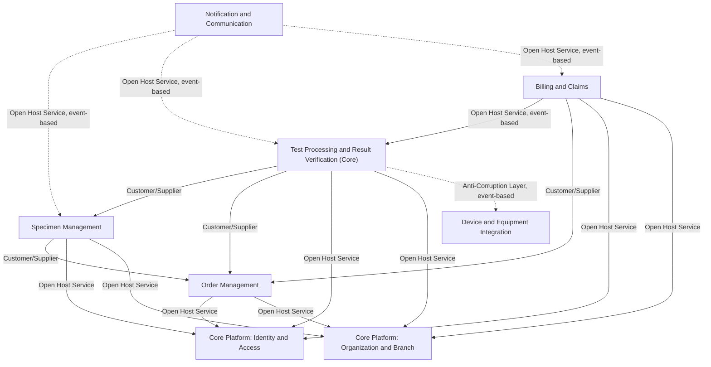
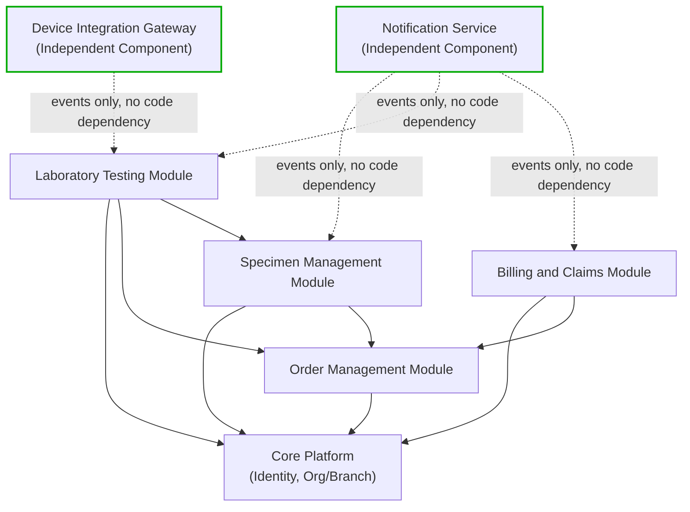

# Diagrams — Bounded Contexts (Phase 06)

## Context Map

```mermaid
flowchart TB
  CP_ID["Core Platform: Identity and Access"]
  CP_ORG["Core Platform: Organization and Branch"]
  OM["Order Management"]
  SM["Specimen Management"]
  TP["Test Processing and Result Verification (Core)"]
  NC["Notification and Communication"]
  BC["Billing and Claims"]
  DI["Device and Equipment Integration"]

  OM -->|Open Host Service| CP_ID
  OM -->|Open Host Service| CP_ORG
  SM -->|Customer/Supplier| OM
  SM -->|Open Host Service| CP_ID
  SM -->|Open Host Service| CP_ORG
  TP -->|Customer/Supplier| SM
  TP -->|Customer/Supplier| OM
  TP -->|Open Host Service| CP_ID
  TP -->|Open Host Service| CP_ORG
  TP -. Anti-Corruption Layer, event-based .-> DI
  NC -. Open Host Service, event-based .-> SM
  NC -. Open Host Service, event-based .-> TP
  NC -. Open Host Service, event-based .-> BC
  BC -->|Open Host Service, event-based| TP
  BC -->|Customer/Supplier| OM
  BC -->|Open Host Service| CP_ID
  BC -->|Open Host Service| CP_ORG
```

## Module Dependency Graph (compile-time edges only)

```mermaid
flowchart TB
  Core["Core Platform<br/>(Identity, Org/Branch)"]
  OM[Order Management Module]
  SM[Specimen Management Module]
  LT[Laboratory Testing Module]
  BC[Billing and Claims Module]

  OM --> Core
  SM --> Core
  SM --> OM
  LT --> Core
  LT --> OM
  LT --> SM
  BC --> Core
  BC --> OM

  classDef indep stroke:#0a0,stroke-width:2px;
  Notif["Notification Service<br/>(Independent Component)"]:::indep
  DevGW["Device Integration Gateway<br/>(Independent Component)"]:::indep
  Notif -. events only, no code dependency .-> SM
  Notif -. events only, no code dependency .-> LT
  Notif -. events only, no code dependency .-> BC
  DevGW -. events only, no code dependency .-> LT
```
