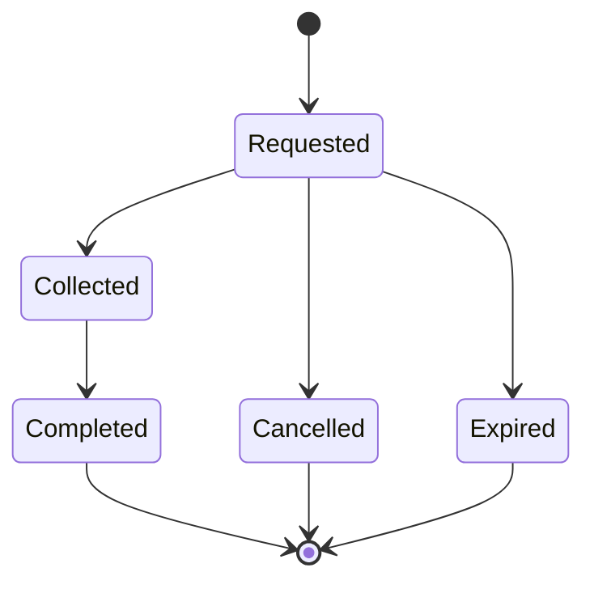
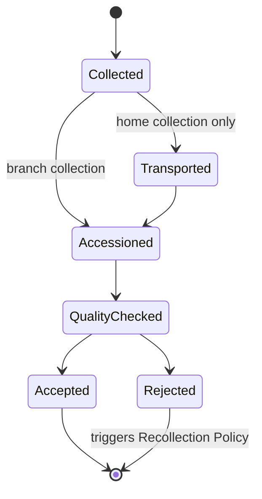
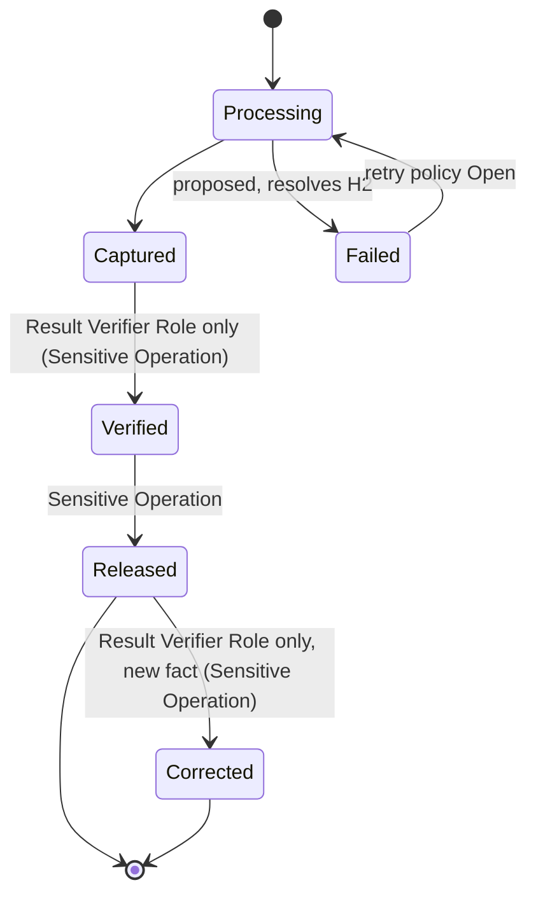
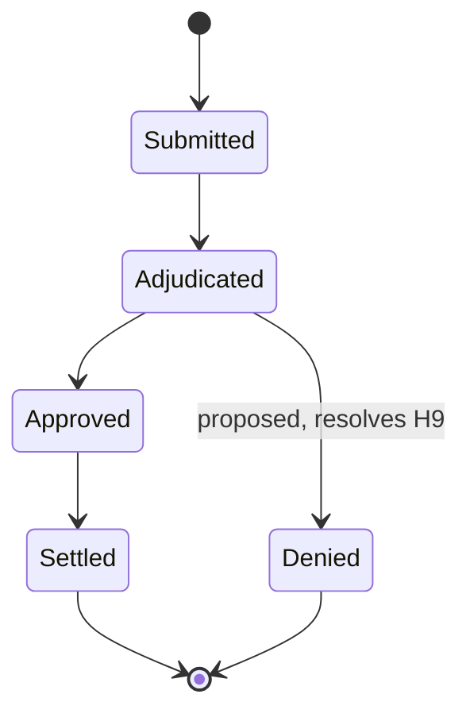

# Diagrams — Workflow State Machines (Phase 07)

## TestOrder

```mermaid
stateDiagram-v2
    [*] --> Requested
    Requested --> Collected
    Collected --> Completed
    Requested --> Cancelled
    Requested --> Expired
    Completed --> [*]
    Cancelled --> [*]
    Expired --> [*]
```

## Specimen

```mermaid
stateDiagram-v2
    [*] --> Collected
    Collected --> Transported : home collection only
    Collected --> Accessioned : branch collection
    Transported --> Accessioned
    Accessioned --> QualityChecked
    QualityChecked --> Accepted
    QualityChecked --> Rejected
    Accepted --> [*]
    Rejected --> [*] : triggers Recollection Policy
```

## TestResult (Core — highest scrutiny)

```mermaid
stateDiagram-v2
    [*] --> Processing
    Processing --> Captured
    Processing --> Failed : proposed, resolves H2
    Captured --> Verified : Result Verifier Role only (Sensitive Operation)
    Verified --> Released : Sensitive Operation
    Released --> Corrected : Result Verifier Role only, new fact (Sensitive Operation)
    Failed --> Processing : retry policy Open
    Released --> [*]
    Corrected --> [*]
```

## Claim

```mermaid
stateDiagram-v2
    [*] --> Submitted
    Submitted --> Adjudicated
    Adjudicated --> Approved
    Adjudicated --> Denied : proposed, resolves H9
    Approved --> Settled
    Settled --> [*]
    Denied --> [*]
```
