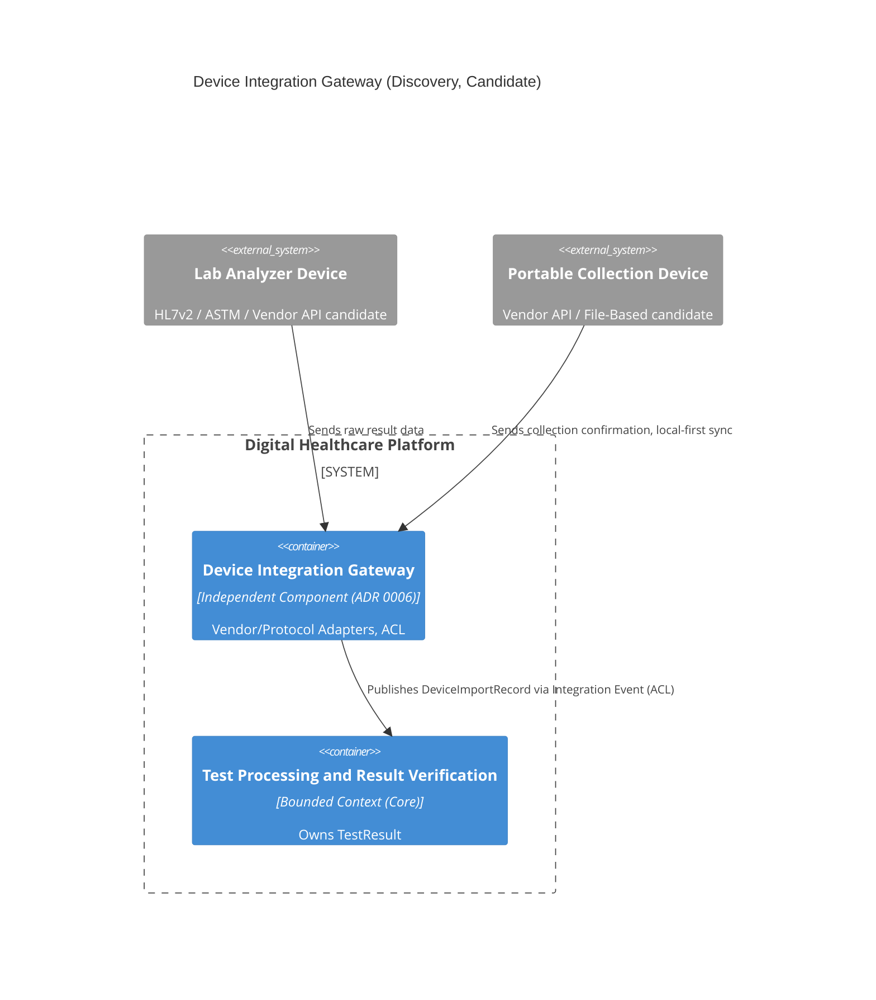
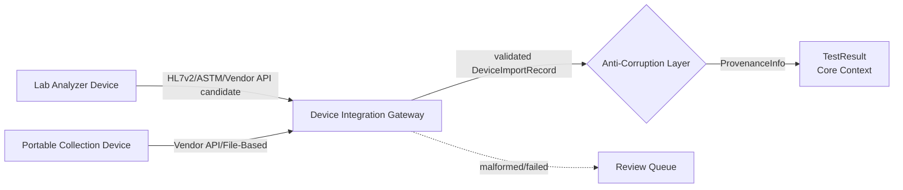
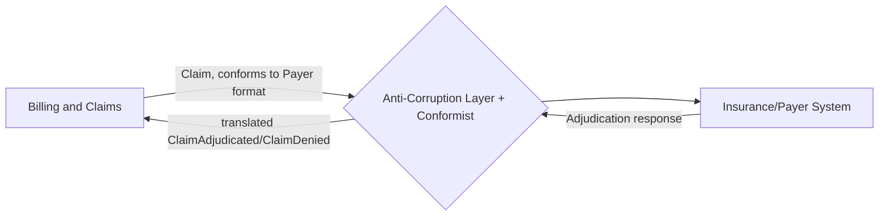

# Diagrams — Integrations (Phase 08)

## C4 Container — Device Integration Gateway

```mermaid
C4Container
  title Device Integration Gateway (Discovery, Candidate)

  System_Boundary(platform, "Digital Healthcare Platform") {
    Container(gateway, "Device Integration Gateway", "Independent Component (ADR 0006)", "Vendor/Protocol Adapters, ACL")
    Container(testproc, "Test Processing and Result Verification", "Bounded Context (Core)", "Owns TestResult")
  }

  System_Ext(analyzer, "Lab Analyzer Device", "HL7v2 / ASTM / Vendor API candidate")
  System_Ext(portable, "Portable Collection Device", "Vendor API / File-Based candidate")

  Rel(analyzer, gateway, "Sends raw result data")
  Rel(portable, gateway, "Sends collection confirmation, local-first sync")
  Rel(gateway, testproc, "Publishes DeviceImportRecord via Integration Event (ACL)")
```

## Anti-Corruption Layer Boundary — Device Data

```mermaid
flowchart LR
  Dev1[Lab Analyzer Device] -->|HL7v2/ASTM/Vendor API candidate| GW[Device Integration Gateway]
  Dev2[Portable Collection Device] -->|Vendor API/File-Based| GW
  GW -->|validated DeviceImportRecord| ACL{Anti-Corruption Layer}
  ACL -->|ProvenanceInfo| TR[TestResult<br/>Core Context]
  GW -. malformed/failed .-> DLQ[Review Queue]
```

## Anti-Corruption Layer Boundary — Insurance/Payer

```mermaid
flowchart LR
  BC[Billing and Claims] -->|Claim, conforms to Payer format| ACL2{Anti-Corruption Layer + Conformist}
  ACL2 --> Payer[Insurance/Payer System]
  Payer -->|Adjudication response| ACL2
  ACL2 -->|translated ClaimAdjudicated/ClaimDenied| BC
```
