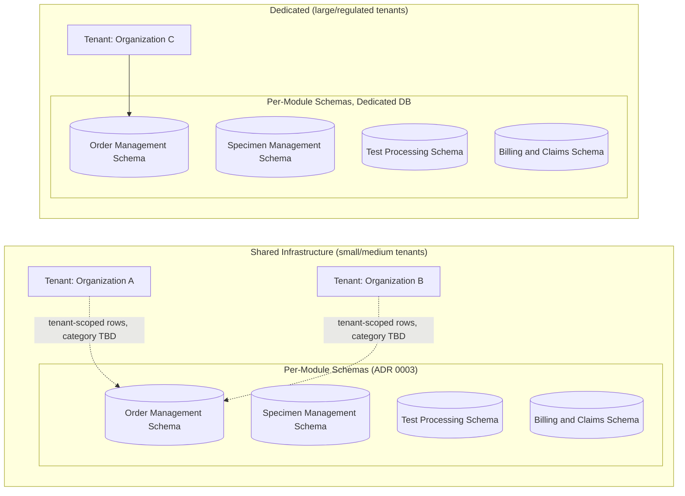

# Diagram — Tenant Isolation, Applied to Real Bounded Contexts (Phase 09)

**Note:** this diagram makes explicit what the Constitution's own
illustrative Section 19 diagram left abstract — tenant partitioning
(horizontal, per-tenant) and Schema per Module (ADR 0003, per-module) are
two independent axes that apply *together*, not as alternatives.
