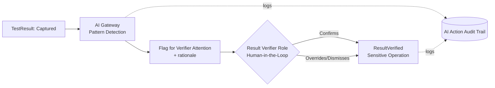
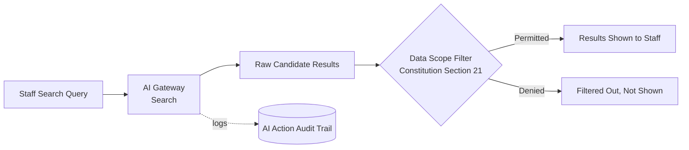

# Diagrams — AI Use Cases (Phase 10)

Two representative patterns are diagrammed (not all 7 — repeating the same
shape 7 times would be decorative, not informative; these two show the
structurally distinct cases in the catalog).

## Pattern A — High-Stakes, Mandatory HITL (Use Case #3: Result Pattern Flagging)

**Why this shape matters:** the AI Gateway never has a path to
`ResultVerified` that bypasses the Result Verifier Role gate — the flag is
an *input* to the human decision, not a parallel approval path.

## Pattern B — Low-Stakes, No Approval Gate, Data-Scope-Filtered (Use Case #6: Catalog Search)

**Why this shape matters:** no Human-in-the-Loop approval is needed (search
results aren't an "action"), but Data Scope enforcement is non-negotiable —
this is the pattern for every low-stakes use case in the catalog (#5, #6,
#7), while Pattern A is the pattern for every high-stakes one (#1, #3, #4).
