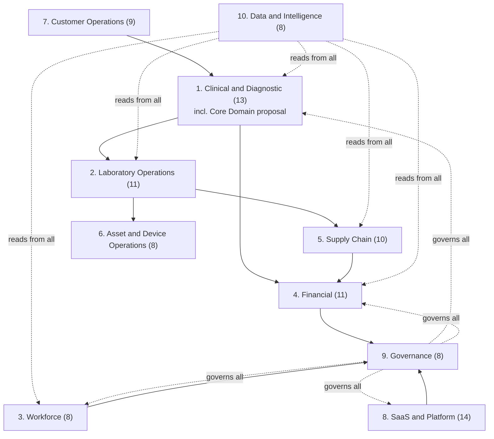

# Diagram — Enterprise Capability Map, Category Level (Wave 3)

**Note:** a 100-node diagram (one per capability) would be unreadable and
decorative, not informative — this shows the 10 categories and their
primary dependency direction instead, which is the genuinely useful
at-a-glance view. Full per-capability detail is in
`artifacts/W3-enterprise-capability-map.md`.

