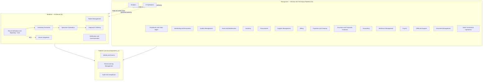

# Diagram — Enterprise Context Map, Tiered by Maturity (Wave 9)

**Note:** intra-tier edges within "Recognized" are omitted from this
diagram for readability (a full 16-node mesh would be decorative, not
useful) — see `artifacts/W9-bounded-context-remapping.md`'s Context
Mapping table for the specific relationships that matter.
