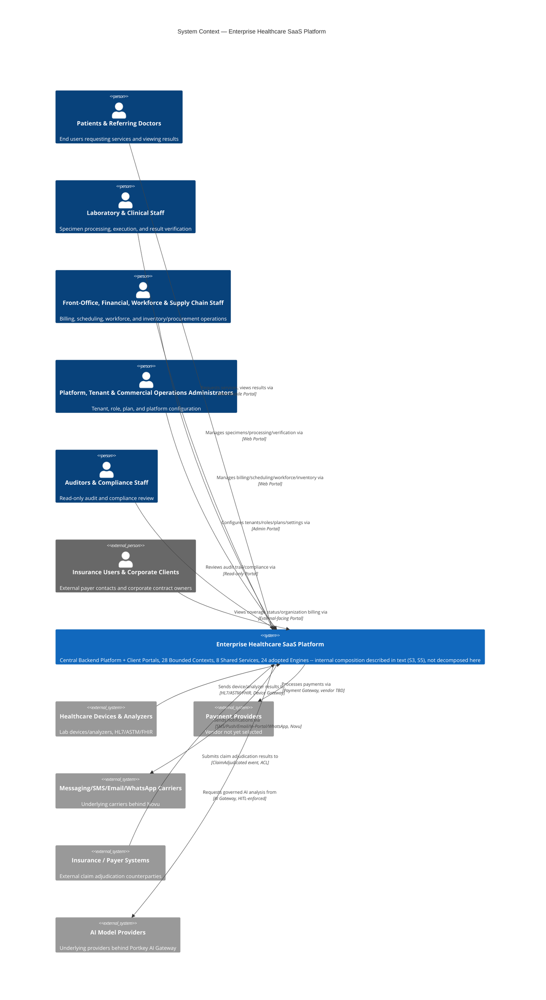

# SAD Wave 2 — Context & Scope

## 1. Document Metadata

| Field | Value |
|---|---|
| Wave number and title | 2 of 13 — Context & Scope (`docs/sad/README.md`) |
| Document Status | **Accepted** (per `docs/constitution/PROJECT-CONSTITUTION.md` §59 Document Status Vocabulary). Accepted by the **Project Owner**, acting as the Architecture Review Board (Constitution §57 — the ARB is a function/process fulfilled entirely by the project owner today), on 2026-07-20, following an Independent Architecture Review of the Wave 2 Corrective Review (commit `db2ee66`). Final Architecture Review Verdict at acceptance time: **PASS**. This registers the administrative act of acceptance only — no substantive/architectural content of this Wave was changed to produce this status change (see §19 for the last substantive review, which remains the operative content review, and the Acceptance Record after §19 for the full acceptance history). |
| Owner | Author of this Wave (session author, 2026-07-20) |
| Review authority | Project Owner, acting as Architecture Review Board (Constitution §57 — the ARB is a function/process fulfilled entirely by the project owner today) |
| Dependencies | Wave 1 (`01-introduction-goals-constraints-stakeholders.md`) — **Accepted**, 2026-07-20 |
| Supersedes | None |
| Superseded by | None |
| Updated | 2026-07-20 |

## 2. Purpose and Relationship to Wave 1

**Function of this Wave:** define the System of Interest and its boundary
— what the platform is, who interacts with it, what external systems it
touches, and what is in/out/deferred/unresolved scope — at the depth a
System Context view requires. This Wave does **not** decompose the
system internally (Building Blocks, Wave 4), describe runtime behavior
(Wave 5), or fix a deployment topology (Wave 6).

**What this Wave draws from Wave 1 (Accepted):** the Business and
Architectural Goals (Wave 1 §4), the Primary Stakeholders and their
Concerns (Wave 1 §5–§6), and the Known/Regulatory/Technical Constraints
(Wave 1 §7–§9) — all reused by reference, not redefined. Where this
Wave names an Actor or a boundary decision, it traces back to Wave 1's
own sourcing, not a new independent judgment.

**What this Wave explicitly does not cover**, because it belongs to a
later Wave (full mapping in §18, Wave Boundary Map): Solution Strategy
(Wave 3), Building Block View (Wave 4), Runtime View (Wave 5),
Deployment View (Wave 6), Security/Privacy/Trust Boundaries (Wave 7),
Multi-Tenancy/Identity/Access Governance (Wave 8), AI Governance/Device
Integration/Other Cross-Cutting Concerns (Wave 9), Architecture
Decisions & Traceability as its own dedicated pass (Wave 10 — this Wave
still cites sources, per §17, but does not perform Wave 10's
consolidation work), Quality Requirements (Wave 11), Risk Treatment
(Wave 12), and the final Glossary/Close-out (Wave 13).

**This Wave does not redefine Goals or Stakeholders.** It uses Wave 1's
existing, Accepted goals and stakeholders as fixed inputs to derive
*where the system's boundary sits* — a different question from *what
the system is trying to achieve* (already answered) or *who cares about
it* (already answered).

## 3. System of Interest

**System of Interest: the Enterprise Healthcare SaaS Platform** — a
single governed system comprising:

1. **A central Backend Platform** (Wave 1 §4.1, `vision.md`) serving
   every client surface through Unified Login and Policy-Based Access
   (ADR-0008) — there is no Portal-specific backend fork
   (`docs/api-platform/01-API-VISION.md` Goal 1).
2. **Client surfaces/Portals** (Web Platform, Patient App, Sample
   Collector/Home Visit App — Constitution's Consolidated Accepted
   Decisions appendix, "Clients" row) that consume the Backend Platform;
   future Partner/Public-facing surfaces are explicitly Part-2/Future
   scope (`03-API-DOMAIN-INVENTORY.md`), not yet designed.
3. **28 Bounded Contexts** (9 Modeled + 19 Recognized, ADR-0012
   Accepted) organized as a **Modular Monolith** (ADR-0001), each owning
   its own schema (ADR-0003) and communicating primarily through Domain/
   Integration Events (ADR-0004).
4. **8 Independent Components / Shared Services** (Constitution §11:
   Notification Service, Device Integration Gateway, AI Gateway,
   Analytics Platform, Search Service, File Processing Service, Public
   API Gateway, Background Workers) — operationally independent from
   the start for named, justified reasons, but **logically part of the
   platform**, not external to it (see §5, §15).
5. **24 Technology Baseline Engines, with status preserved, not a
   uniform "24 Adopted" block** (`docs/architecture-review/
   02-TECHNOLOGY-BASELINE.md`): 19 fully APPROVED from the original
   EARB freeze, 2 CONDITIONALLY APPROVED from that same freeze (Eramba
   Community — implementation due diligence required before production
   adoption; Mirth Connect — frozen-release risk), and 3 more fully
   APPROVED added later (Kong Gateway, OpenBao, PostgreSQL). Several
   Engines additionally carry an unresolved License/Legal dependency
   (e.g., Novu, Cal.com, Atlas CMMS, openIMIS, Frappe Helpdesk, Frappe
   CRM — `Requires Legal Verification` or AGPL-3.0, per R-04/R-07). A
   Legal Dependency does **not** mean an Engine is rejected, and a
   Frozen Baseline does **not** mean every Engine's due diligence is
   complete — both are preserved states, not resolved to either
   extreme. All 24 are, regardless of individual status, adopted and
   operated by the platform, wrapped behind its own API and an
   Anti-Corruption Layer — "no Engine's native API is ever exposed
   directly to a Portal, Partner, or Public consumer"
   (`01-API-VISION.md`).

**What the System of Interest is explicitly not** (each contradicts a
Confirmed/Accepted source):

- **Not a single web application.** Multiple client surfaces exist by
  design (Unified Login routes to the correct one) — Wave 1 §4.1,
  `vision.md`.
- **Not a laboratory-only system.** The Confirmed target is a
  "Healthcare Operations Platform," explicitly **not** "a LIMS, a
  Laboratory Management System, a Patient Results Portal, or a Billing
  System alone" (`docs/discovery/artifacts/
  W1-vision-scope-operating-model.md`, verbatim).
- **Not a clinic-only system.** 9 Confirmed customer types span
  independent labs through hospitals, medical groups, and corporate
  healthcare providers (§4 below).
- **Not just an API Gateway.** Kong Gateway (E22) is one adopted Engine
  operating the Edge layer, not the system itself
  (Technology Baseline).
- **Not a microservices collection.** ADR-0001: Modular Monolith by
  deliberate design, with only the 8 named components operationally
  independent for specific, documented reasons — not a general
  microservices posture.
- **Not one deployment.** ADR-0009: SaaS First, On-Premise Ready,
  Hybrid Ready — the same System of Interest is deployable across three
  topologies (deployment *design* is Wave 6, not this Wave).

## 4. Business Context

Restated from Wave 1 §4.1 and `docs/discovery/artifacts/
W1-vision-scope-operating-model.md` (both already-cited sources — not
re-derived here):

- **First target market: Egypt**, with architecture carrying
  **readiness** for additional markets — this is an **architectural
  capability claim, not a legal/regulatory compliance claim**. Per
  Constitution §31 (Compliance Readiness Rules, cited via Wave 1 §1
  Non-authority) and this Wave's own governing rules: global-readiness
  is never treated as evidence of legal/regulatory compliance in any
  country. Any Egypt-specific legal/regulatory item not independently
  verified remains classified `Requires Legal Verification`
  (`W1-vision-scope-operating-model.md`), never silently promoted to a
  compliance decision.
- **9 Confirmed customer types**: independent laboratory, laboratory
  chain, hospital, medical center, clinic, medical group, corporate
  healthcare provider, multi-branch diagnostic entity, Partner/external
  API client.
- **32 Confirmed business domains** define the platform's eventual
  operating scope (`W1-vision-scope-operating-model.md`, full list in
  §9 below) — of which Baseline Discovery covered only ~4–6 in real
  depth; the remainder are Recognized/shallow, not absent (§8–§9).
- **Core Domain, with its caveats preserved**: ADR-0011 (Accepted,
  2026-07-18) names **Patient-to-Result Orchestration** as the Core
  Domain. Per Wave 1 §4.2's footnote (itself sourced from ADR-0011's
  full text), this Wave repeats the same caveat rather than silently
  dropping it: the evidence remains `Inferred — Industry Reference`,
  and the Specimen Management/Home Collection Logistics alternative is
  an explicitly disclosed, **unresolved competing hypothesis** — not
  superseded, not re-scored, and **not re-litigated in this Wave**.
  Business Context here is stated exactly as Accepted, no more
  confidently than the ADR itself claims.
- **Operating value**: a SaaS Multi-Tenant Platform that manages
  healthcare/diagnostic institution operations — Unified Login,
  Role/Permission/Policy/Data-Scope-based routing, configurable
  workflows and result-verification policies, medical device
  integration from v1, Arabic/English + RTL/LTR, White Label, Plans and
  Subscriptions, Usage/Entitlement Tracking, SaaS billing readiness, and
  On-Premise/Hybrid readiness — all already Accepted or Confirmed per
  Wave 1 §4 and the ADRs cited there.

## 5. System Boundary

### Inside the System of Interest

**Corrected 2026-07-20** (Reader Testing finding, Corrective Review
Pass 1): this table previously listed only three categories, silently
dropping Client Surfaces/Portals even though §3 names them as one of
the System of Interest's five constituent parts. Added below as a
fourth row — this was an omission in the table, not a boundary change.

| Category | Members | Source |
|---|---|---|
| Central Backend Platform + Client Surfaces/Portals | The shared Backend Platform and the client surfaces that consume it through Unified Login (Web Platform, Patient App, Sample Collector/Home Visit App) — no Portal-specific backend fork | §3; `01-API-VISION.md` Goal 1; Constitution's Consolidated Accepted Decisions appendix ("Clients" row) |
| Bounded Contexts / Modules (Modular Monolith) | 28 (9 Modeled + 19 Recognized) | ADR-0012 (Accepted); §8 below |
| Independent Components / Shared Services | Notification Service, Device Integration Gateway, AI Gateway, Analytics Platform, Search Service, File Processing Service, Public API Gateway, Background Workers | Constitution §11 (Accepted) |
| Adopted/Integrated Technology Baseline Engines | 24 Engines (Keycloak, OPA, RabbitMQ, ERPNext, Kong Gateway, PostgreSQL, etc.) — operated and upgraded by the platform, wrapped behind the platform's own API + Anti-Corruption Layer | `02-TECHNOLOGY-BASELINE.md`, `01-API-VISION.md` |

**Independently deployable but logically internal** (explicit
clarification, per instruction): the 8 components above may run as
separate deployables from day one (Constitution §11's own justification
— protocol isolation, external-facing surface, variable load, governed
external calls) — this is an *operational* independence, not a
*logical/scope* exclusion. They remain part of the System of Interest.

### Outside the System of Interest (True External Systems)

Entities the platform does **not** own, operate, or upgrade — it only
calls or is called by them across an explicit boundary (typically an
Anti-Corruption Layer or a Partner/Integration API). Full inventory in
§7.

### Responsibility Boundaries (context level only — no deployment design)

| Party | Responsibility (context-level) | Source |
|---|---|---|
| **The Platform** | The Backend Platform, all 28 Bounded Contexts, the 8 Shared Services, and operating/upgrading the 24 Technology Baseline Engines (per their individually preserved Approved/Conditionally Approved/Legal-Dependency status, §3); backend-enforced authorization for every client surface | ADR-0008; Constitution §10–11 |
| **The Tenant / Healthcare Organization** | Their own Organization/Branch configuration, staff/role assignment within granted Data Scope, and (for On-Premise/Hybrid deployments only) sharing DR/infrastructure responsibility per a documented split — the exact split is a commercial/contractual matter, not resolved here | ADR-0005; ADR-0014 (Relationship Between SaaS/On-Premise/Hybrid section) |
| **Third-Party Providers** | Their own Engine's upstream maintenance/patching cadence (Technology Baseline "Upgrade Policy" column); external counterparties' (payers, referring clinics, device vendors) own systems, entirely outside platform operation | `02-TECHNOLOGY-BASELINE.md`; §7 below |

**SaaS/On-Premise/Hybrid boundary, at context level only**: the same
System of Interest (§3) applies in all three deployment modes
(ADR-0009); *which infrastructure runs where* is explicitly Wave 6
(Deployment View) — not addressed further here.

**No boundary decision in this section rests on an undocumented
assumption** — every inclusion/exclusion above cites the specific
Accepted source establishing it (§17, Traceability Matrix, has the
complete cross-reference).

## 6. Primary Human Actors

**Terminology note (added after Reader Testing, §19):** "Actor" (this
document's term, the C4/System-Context convention this Wave uses) and
"Persona" (the source catalog's term) refer to the **same 39 people/
roles** — Actor is the boundary-level lens (who touches the System of
Interest), Persona is the detailed-catalog lens (goals/pain-points/data
scope/KPI). They are not two different populations.

Source: `.claude/context/stakeholders.md` (15 categories, Wave 1 §5) and
its Gap Closure Wave 2 expansion,
`docs/discovery/artifacts/W2-persona-catalog.md` (39 personas). Status,
per that document's own header: role/category names are `Confirmed`
(the user's authorization prompt named them explicitly); each persona's
detailed Goals/Pain Points is `Inferred — Industry Reference` unless
otherwise noted. Grouped here by cluster, not repeated in full (full
per-persona table remains authoritative in the source file).

| Cluster | Representative Actors | Direct/Indirect | Status |
|---|---|---|---|
| Clinical and Care | Patient, Guardian, Referring Doctor, Consultant/Specialist, Clinic Administrator, Hospital Administrator/Medical Director | Direct (all) | Roles Confirmed; goals/pain-points Inferred |
| Laboratory | Laboratory Staff (Technician), Medical Director, Pathologist/Result Verifier, Quality Staff | Direct | Roles Confirmed; goals/pain-points Inferred |
| Front-Office and Support | Reception, Call Center Agent, Customer Support | Direct | Roles Confirmed; goals/pain-points Inferred |
| Financial | Cashier, Accountant, Finance Manager | Direct | Roles Confirmed; goals/pain-points Inferred |
| Workforce | HR Staff, Payroll Staff | Direct | Roles Confirmed; goals/pain-points Inferred |
| Supply Chain | Procurement Staff, Inventory Staff, Store/Warehouse Manager, Supplier *(external)*, Courier/Home Visit Staff | Supplier is Indirect (external, portal-mediated); rest Direct | Roles Confirmed; goals/pain-points Inferred |
| Commercial and External | Insurance User (payer-side contact), Corporate Client (Contract Owner), Partner/API Client *(external)* | Indirect (all external-facing) | Roles Confirmed; goals/pain-points Inferred |
| Technical and Platform | Device Engineer, Integration Engineer, Platform Operator, Tenant Administrator, Branch Administrator | Direct | Roles Confirmed; goals/pain-points Inferred. Platform Operator explicitly flagged as "highest-privilege persona in the model," required to be Least-Privilege-scoped (Constitution §21) — a Wave 8 design concern, only noted here |
| Governance and External Oversight | Auditor, Compliance Staff, Legal Reviewer *(external)*, Regulator *(external)* | Indirect | Roles Confirmed; Regulator's interaction pattern explicitly **"Not yet designed — Open"** — no interaction invented here |
| Commercial Operations | SaaS Commercial Team, Support Operations, AI Operations | Direct (internal platform-operator roles) | Roles Confirmed; goals/pain-points Inferred |

**39 personas total** (37 human/organizational + 2 external
non-human-operated — Partner/API Client and Regulator, each represented
by a human point of contact). Two role names the user gave are
organization types, not personas — **Clinics** and **Hospitals** — and
are represented via their actual human actors (Clinic Administrator,
Hospital Administrator/Medical Director) per the source document's own
explicit substitution, not silently dropped.

**No organizational or medical role is invented beyond this catalog.**

## 7. External Systems and Ecosystem Participants

Categorized only where a source establishes the category; an empty or
thin category is stated as such, not filled with an invented example.

| Category | Participants (as evidenced) | Direction | Certainty / Status |
|---|---|---|---|
| Healthcare devices and analyzers | Lab devices/analyzers (vendor/protocol unspecified) via the Device Integration Gateway, supporting HL7/HL7v2/FHIR/ASTM/TCP-IP/Serial/File-Based/Vendor API (Constitution §24) | Inbound (device → platform, via Gateway) | Architecture pattern **Accepted** (ADR-0006); specific device types/protocols to implement first remain **Open** (`open-questions.md` #5) |
| Payment providers | Illustrative vendor integration named in `03-API-DOMAIN-INVENTORY.md` (Payments and Treasury row): Fawry/Paymob/WhatsApp-BSP-style, "wrapped, not independently-adopted SDKs." Abstraction pattern: Omnipay adapter-pattern (R5, **Accepted** Reference Standard) | Outbound (platform → provider) | Illustrative candidates named, **not** a ratified Technology Baseline Engine selection — no specific payment provider is Accepted as a Decision |
| Messaging and notification providers | Underlying SMS/WhatsApp/email carriers behind Novu (E8, ratified, license **Unconfirmed — Requires Legal Verification**) | Outbound | Novu adoption Accepted (conditionally, per Technology Baseline); underlying carrier identities not named in any source — none invented here |
| Identity or federation providers | **None external, per sources.** Keycloak (E1) is an **adopted, platform-operated** Identity Engine — inside the System of Interest (§5), not an external federation provider. No external SSO/federation (e.g., a government eID, a third-party IdP) is documented anywhere reviewed | N/A | No external identity provider exists in any source — not invented |
| Governmental or regulatory systems | **None documented.** The "Regulator" persona exists but its interaction is explicitly `"Not yet designed — Open"` (`W2-persona-catalog.md`) | N/A | Open — no integration named or assumed |
| Insurance or payer systems | openIMIS (E17, ratified, AGPL-3.0, module-level adoption) for claims; external payer counterparties send `ClaimAdjudicated` events (Pivotal Event, external origin) into Insurance and Corporate Contracts | Inbound (`ClaimAdjudicated`) and outbound (eligibility/claim submission) | openIMIS adoption **Accepted**; specific payer counterparties not named — general capability only |
| External clinical systems | Referring-clinic result delivery, referring-clinic directory (`21-INTEGRATIONS.md` Partner API candidates) | Bidirectional | **Planned/Candidate — 0 designed** (explicit in source) |
| External laboratories or partner organizations | Same Partner API candidate mechanism as above; no named specific laboratory partner | Bidirectional | Planned/Candidate |
| ERP/accounting systems | **Not an external category here** — ERPNext (E16) is itself a platform-adopted, self-operated Engine (Procurement's Single Adoption Point, also serving Supplier Management, Billing, Payments and Treasury, Accounting). No separate tenant-owned external accounting-system integration is documented | N/A | Reclassified: internal adopted Engine, not external (§5) |
| Public or partner API consumers | 6 Partner API candidates (`21-INTEGRATIONS.md`): referring-clinic directory, home-collection-logistics booking (**blocked** — see below), referring-physician order submission, referring-clinic result delivery, supplier-facing PO/RFQ, supplier self-service portal. Public API: **0**, deliberately deferred to Part 2 | Bidirectional | Partner: Planned/Candidate, 0 designed. Public: explicit non-decision, deferred |
| AI model or AI service providers | Underlying LLM/model providers behind Portkey Gateway (E9, ratified AI Gateway Engine) | Outbound (governed, ADR-0007) | Gateway pattern **Accepted**; no specific underlying model provider is named in any source reviewed — none invented |
| Secret-management or infrastructure services | **Not external, per sources.** OpenBao (E23) is a platform-adopted, self-operated Secrets Engine — inside the System of Interest (§5) | N/A | Reclassified: internal adopted Engine |

**Status-currency note on two "blocked" items** (a Source Coverage
finding — see §16, §19): `03-API-DOMAIN-INVENTORY.md` and
`21-INTEGRATIONS.md` state the home-collection-logistics booking API is
"blocked on Open Question #6" and the FHIR-shaped exchange is "blocked
on R-06 (FHIR version not pinned)." Both source documents **predate**
the Open Questions Resolution phase (2026-07-18): Open Question #6 was
resolved (D-48, Offline Mode Required, scoped to Home Collection) and
R-06 was Closed (D-43, FHIR R4 pinned). This Wave states the **current**
resolved status while citing exactly where the "still blocked" language
came from — neither silently updating the source file (out of scope,
§6/§11 of the governing instructions) nor repeating stale text as if it
were still current.

## 8. Bounded-Context Landscape at Scope Level

**Source: ADR-0012 (Accepted, 2026-07-18) full text**, and
`docs/discovery/artifacts/W9-bounded-context-remapping.md` (the
evidence base ADR-0012's Amendment cites). **28 contexts, two
confidence tiers — the tiering is itself part of what ADR-0012
Accepted, not a lesser status this Wave introduces.**

### Modeled tier (9 contexts, `Evidenced` confidence)

Patient Management · Diagnostic Ordering · Specimen Operations ·
Laboratory Execution · Result Verification and Reporting · Device
Integration · Notification and Communication · Tenant and Organization
Management · Identity and Access.

### Recognized tier (19 contexts, `Inferred`, lower confidence, not yet tactically modeled to Modeled-tier depth)

Practitioner and Clinic Management · Scheduling and Encounters ·
Quality Management · Asset and Maintenance · Inventory · Procurement ·
Supplier Management · Billing · Payments and Treasury · Insurance and
Corporate Contracts · Accounting · Workforce Management · Payroll ·
CRM and Support · Document Management · Analytics · AI Operations ·
SaaS Commercial Operations · Audit and Compliance.

### Mandatory caveats preserved (not re-litigated, not re-decided here)

- **The two-tier confidence distinction is itself Accepted** — accepting
  ADR-0012 does **not** silently upgrade the 19 Recognized-tier contexts
  to Modeled-tier confidence. Their full Aggregate/invariant tactical
  modeling remains SAD/Implementation-phase work (Wave 4 and beyond),
  not assumed complete now.
- **Relationship to ADR-0011**: ADR-0012's own Revisit Triggers state
  that if the Core Domain confirmation (ADR-0011) is ever revisited, "a
  rejection could change which context(s) this map treats as Core." This
  Wave does not resolve or reopen that dependency (§4, §16).
- **Specimen Operations / Laboratory Execution split**: ADR-0012's own
  Risks section calls the Specimen Management/Test Processing boundary
  "the single most consequential judgment call in the whole Context
  Map" — carried forward as-is, not re-examined in this Wave.
- **"Integration Hub" was considered and rejected** as a 29th context
  (`W9-bounded-context-remapping.md`) — every external integration
  already has ACL ownership distributed to its consuming context
  (Device Integration, Insurance and Corporate Contracts, etc.); no
  separate integration-hub context exists.
- **A Bounded Context is not a microservice, a Module 1:1, or a
  deployment unit.** Per `domain-driven-design` skill guidance (§19
  below) and Constitution §6/§7: a Bounded Context is a model/language
  boundary. The 28 contexts do not imply 28 deployables — the Modular
  Monolith (ADR-0001) may hold many contexts in one deployable, with
  only the 8 Shared Services (§5) operationally separate. **This
  distinction is not yet formally decided per-context** — which
  Bounded Contexts map to which Modules 1:1 (if any) is Wave 4 (Building
  Block View) work, not resolved here.

**Internal components, classes, packages, database tables, runtime
sequences, and deployment nodes for any context are explicitly out of
scope for this Wave** (§13).

## 9. Functional Scope

Source: 32 Confirmed business domains
(`W1-vision-scope-operating-model.md`), cross-referenced against the 28
Bounded Contexts (§8) and Technology Baseline Engine ownership (§7).
**Existence of a capability in the Vision is not evidence of an
Accepted architectural decision about it, which is not evidence it is
fully designed, which is not evidence it is implemented** — this Wave
keeps those four states distinct throughout.

**Disambiguation note (added after Reader Testing, §19):** the number
**28** appears twice below for two unrelated populations — "28 Bounded
Contexts" (§8, out of 28 total) and "28 of the 32 Confirmed business
domains" (this table, out of 32 total) are a coincidence, not the same
28. The Bounded Context count and the business-domain count are
tracked independently in their respective source documents (ADR-0012
vs. `W1-vision-scope-operating-model.md`).

| Category | Items | Basis |
|---|---|---|
| **In Scope — Modeled (Evidenced)** | Laboratory Operations, Device and Analyzer Operations, a slice of Patient/Doctor Operations (as Actors, not yet owned domains beyond Patient Management's Modeled context), a shallow slice of Billing, Notifications, a first AI-use-case pass | `W1-vision-scope-operating-model.md`; §8 Modeled tier |
| **In Scope — Recognized, not yet fully modeled** | The 19 Recognized-tier contexts (§8) — 28 of the 32 Confirmed business domains are "new or substantially shallow" per the source's own statement | ADR-0012; `W1-vision-scope-operating-model.md` |
| **Planned / target-state (Confirmed commitments, not yet deeply modeled)** | White Label, Plans and Subscriptions, Usage/Entitlement Tracking, SaaS billing readiness | Wave 1 §4.1; `W1-vision-scope-operating-model.md` |
| **Optional / deployment-dependent** | On-Premise-specific and Hybrid-specific operational detail (ADR-0009) — architecturally ready, topology not fixed | ADR-0009; §5, §10 |
| **External dependency (not an architectural gap)** | 5 AGPL-3.0 Engines pending legal review (R-04); Egypt regulatory research (R-13); Eramba due-diligence (R-01) | `11-RISK-REGISTER.md` |
| **Explicitly Out of Scope (Non-Goals, Confirmed)** | A general-purpose Hospital Information System (inpatient bed management, surgical scheduling, pharmacy dispensing); a full financial ERP by default; a general-purpose e-commerce/retail platform | `W1-vision-scope-operating-model.md`, "Non-Goals and Scope Boundaries" |
| **Unresolved** | Specimen Management as an alternative Core Domain (ADR-0011); Result Verifier eligibility values (D-50, mechanism only) | ADR-0011; `10-DECISION-REGISTER.md` |

**32 Confirmed business domains, verbatim** (`W1-vision-scope-operating-model.md`):
Laboratory Operations · Patient Operations · Doctor and Practitioner
Operations · Clinic and Facility Operations · Scheduling and
Appointments · Home Visits and Sample Collection · Device and Analyzer
Operations · Quality and Accreditation Operations · Inventory and
Reagent Management · Procurement and Supplier Management · Billing and
Collections · Payments and Refunds · Expenses and Treasury · Accounting
and Financial Control · Insurance and Corporate Contracts · Human
Resources · Attendance and Scheduling · Payroll · Training and
Competency · Asset and Maintenance Management · CRM and Customer
Support · Complaints and Feedback · Notifications and Reminders ·
Document and File Operations · Analytics and Business Intelligence ·
AI-Assisted Operations · Integration Operations · Security and
Compliance Operations · SaaS Subscription and Commercial Operations ·
Partner and Marketplace Operations · Platform Administration · Tenant,
Organization and Branch Operations.

## 10. Current, Target and Future Scope

| Timeframe | Description | Explicit caveat |
|---|---|---|
| **Current architectural baseline** | Constitution v2.1 (Accepted) + 14 Accepted ADRs + Technology Baseline (33 entries, frozen) + Bounded Context Map (28, Accepted) + Wave 1 (Accepted) + this Wave (in Review) | **Documentation-only.** No product code exists yet in this repository (confirmed by this Wave's own Git Preflight, §19). "Current" here means *current governing architecture*, never *current production system* — nothing in this document is asserted as implemented |
| **Target platform scope** | The full Healthcare Operations Platform vision: 32 business domains, 9 customer types, White Label/Plans/Subscriptions/SaaS billing, Egypt-first with multi-market readiness | `W1-vision-scope-operating-model.md` |
| **Future / optional expansion** | Additional markets beyond Egypt; additional languages/currencies beyond the Arabic/English baseline (ADR-0010) | ADR-0010; `W1-vision-scope-operating-model.md` |
| **Deferred implementation decisions** | Numeric SLA/SLO/RPO/RTO targets (Constitution §51, ADR-0014); vendor exit-strategy procedures (R-08); Developer Portal beyond the v1 generated-docs decision (D-46) | Wave 1 §9; `10-DECISION-REGISTER.md` |
| **Regulatory / localization dependencies** | AGPL-3.0 legal review (R-04); Egypt Cross-Border Transfer, Labor/Social Insurance, National ID validation rules (R-13) | `11-RISK-REGISTER.md` |
| **Not in v1 scope, but not a Non-Goal (Operational Assumption)** | Legacy system migration — no legacy system identified in this repository's evidence base; no migration is in scope for v1. This is **distinct from a Non-Goal**: it does not exclude migration capability from ever being built, and it does not describe a currently-existing integration. If a real legacy system is identified later, it becomes a new, separately-scoped Integration/Migration workstream | `docs/certification/20-OPEN-QUESTIONS-RESOLUTION.md` #13; `12-OPEN-QUESTIONS-REGISTER.md` row 13 |

**Correction (2026-07-20, Independent Architecture Review finding):**
the "Future / optional expansion" row previously listed "a general
HIS-adjacent domain set — explicitly excluded as a Non-Goal unless the
user adds it later," which incorrectly implied a Non-Goal is a form of
planned Future Scope. **A Non-Goal is not Future Scope.** The general
Hospital Information System domains (inpatient bed management,
surgical scheduling, pharmacy dispensing) remain classified **only** as
Explicit Non-Goals / Out of Scope (§9, §13) — they do not become Future
Scope merely because a future Product Scope decision is hypothetically
possible; they would require an actual new Product Scope decision,
which does not exist today, to move into any scope category at all.

## 11. Integration Context

Context-level surface classification only — **no endpoint paths,
payload schemas, topics, event contracts, authentication flows,
versioning, or retry policies are designed in this Wave** (all Wave
4/later or already-existing `docs/api-platform/` detail, cited not
re-authored).

- **API surface types** (`03-API-DOMAIN-INVENTORY.md` definitions).
  **Terminology correction (2026-07-20, Independent Architecture Review
  finding):** `03-API-DOMAIN-INVENTORY.md` classifies its 28 rows using
  the word "Modules" — that document's own, source-local nomenclature,
  authored before ADR-0012's 28-Bounded-Context map existed in its
  current Accepted form. This Wave does **not** treat that as a
  validated, current, 1:1 "28 Modules = 28 Bounded Contexts" mapping —
  which Bounded Contexts become which implementation Modules (if a 1:1
  mapping holds at all) is undecided, Wave 4 work (§8's own caveat).
  With that correction stated: the source document classifies 28
  domain entries as having at least one Internal API surface (baseline
  Modular Monolith expectation), 21 as having an External API surface
  (end-user-facing via Portals), 6 as Partner API candidates
  (**0 designed**), some as Admin API (platform/tenant/org/branch
  administration), some as Integration API (machine-to-machine with an
  external system), and 0 as Public API (deliberately deferred to Part
  2 — "the platform has made no Decision to open general-purpose public
  developer access").
- **Healthcare interoperability**: the resource family named below is
  **quoted verbatim from the already-Accepted Reference Standard entry
  (R1, Technology Baseline)** — this Wave does not select or design
  which FHIR resources are used, only names the already-fixed input: HL7
  FHIR resource family (Patient, Practitioner, ServiceRequest/Task,
  Encounter, Specimen, DiagnosticReport, Claim, Coverage,
  EligibilityRequest/Response) — **FHIR R4 formally pinned** (D-43, Open
  Questions Resolution, 2026-07-18; Reference Standard R1, Technology
  Baseline). See §7's status-currency note: some `docs/api-platform/`
  documents predate
  this pinning and still read "not finalizable" — that language is
  historical, not current.
- **Device integration boundary**: Device Integration Gateway,
  Vendor/Protocol Adapters, Anti-Corruption Layer to the business Core
  (ADR-0006; Constitution §24) — protocol implementation itself is
  Wave 9.
- **Event-based integrations**: Domain Events stay inside a Bounded
  Context; Integration Events cross boundaries through deliberate,
  documented translation (ADR-0004; Constitution §12) — event schema
  design is later-Wave/`docs/api-platform/18` work, not repeated here.
- **AI Gateway boundary**: independent, governed AI Gateway (ADR-0007;
  Constitution §28) — approval-workflow design is Wave 9.
- **Notification channels**: Novu (E8) is the adopted multi-channel
  notification Engine. **Corrected 2026-07-20** (this Wave's original
  draft cited the Context Store's stale, unmarked text for this item
  instead of the governing certification documents — see the
  status-currency note above and §19's Current-Source Precedence
  table): **SMS, Push, Email, In-Portal, and WhatsApp are Accepted at
  architecture level** as the supported channel set
  (`docs/certification/20-OPEN-QUESTIONS-RESOLUTION.md` #10;
  `12-OPEN-QUESTIONS-REGISTER.md` row 10, both 2026-07-18). **Per-market
  activation and availability** of each channel is **Country
  Localization Configuration** — which channels are actually turned on
  for a given market/tenant is not fixed here. No specific
  SMS/WhatsApp/email carrier/provider is named (none is documented);
  Novu's own License status (`Requires Legal Verification`, Technology
  Baseline E8) is unchanged by this correction.

## 12. Data Responsibility Boundaries

Context-level only — **no Data Model, Database Schema, or Row-Level
Security design** (that is Wave 4/8 territory; ADR-0013/ADR-0003
already fix the engine/ownership *pattern*, cited not redesigned). The
"Device-imported results" row below quotes Constitution §24's own
already-Accepted requirement verbatim ("which device, which adapter,
when, raw-payload reference") to state a *responsibility*, not to
design a schema — no field name, type, or table structure is
introduced by this Wave.

| Data category | Responsible party | Source |
|---|---|---|
| Module-owned operational data (per Bounded Context) | The Platform — Schema per Module (ADR-0003), each Module owns its schema/migrations | ADR-0003 |
| Core Platform primitives (Identity, Audit, Policy) | The Platform — Constitution §10 | Constitution §10 |
| Audit trail | The Platform, immudb-backed (E4) tamper-evident store | `02-TECHNOLOGY-BASELINE.md`; Constitution §23 |
| Device-imported results | The Platform stewards them with mandatory provenance, quoted verbatim from Constitution §24 ("which device, which adapter, when, raw-payload reference"); origin is external (the device) | ADR-0006; Constitution §24 |
| External-payer claim data (`ClaimAdjudicated`) | Origin is external (the payer/insurer); the Platform consumes it via ACL into Insurance and Corporate Contracts | §7; API Domain Inventory |
| Tenant/Organization/Branch configuration and clinical records | The Tenant (healthcare organization) owns the data; the Platform enforces Data Scope and stewards storage under Hybrid Tenant Isolation | ADR-0005; ADR-0008 |
| On-Premise/Hybrid deployment data | DR/backup responsibility follows a documented Platform/Tenant split — commercial/contractual detail not resolved here | ADR-0014 |

**"System of Record" vs. "Source of Truth"** is not yet a formally
distinguished pair of terms in any source reviewed — this Wave does not
invent that distinction; it is deferred to whichever later Wave
formalizes it, if ever needed.

## 13. Explicit Out-of-Scope Items

| Item | Classification | Covered in |
|---|---|---|
| Building Block View (internal decomposition, components, classes, packages) | Out of scope for this Wave | Wave 4 |
| Runtime behavior / sequences | Out of scope for this Wave | Wave 5 |
| Deployment topology (nodes, regions, network zones, orchestration) | Out of scope for this Wave | Wave 6 |
| Security controls (STRIDE, threat modeling, detailed mitigations) | Out of scope for this Wave | Wave 7 |
| IAM policy details (RBAC/ABAC design) | Out of scope for this Wave | Wave 8 |
| Multi-tenancy implementation internals (provisioning, isolation mechanics beyond the Accepted RLS+tenant-ID default) | Out of scope for this Wave | Wave 8 |
| AI governance controls (approval workflows) | Out of scope for this Wave | Wave 9 |
| Device protocol implementation detail | Out of scope for this Wave | Wave 9 |
| Detailed Quality Scenarios | Out of scope for this Wave | Wave 11 |
| Detailed Risk Treatment Plan | Out of scope for this Wave | Wave 12 |
| Final official (draw.io) diagrams | Deferred — official diagramming station remains after SAD completion, per standing instruction | Post-SAD |
| General HIS domains (inpatient beds, surgical scheduling, pharmacy dispensing) | Out of scope for the platform (Non-Goal) | `W1-vision-scope-operating-model.md` |
| Full financial ERP by default | Out of scope for the platform by default (Non-Goal) | `W1-vision-scope-operating-model.md` |

## 14. Context Diagram Specification

**Rebuilt 2026-07-20** (Independent Architecture Review finding, using
the `c4-architecture` skill's actual C4 Level-1 System Context
discipline — see §19). **This is a specification for a future official
diagram, not the official diagram itself** — no draw.io artifact is
produced or claimed complete in this Wave.

### What the C4 System Context level requires (and the original draft got wrong)

Per `c4-architecture`'s `references/common-mistakes.md`: a Level-1
**System Context** diagram shows exactly one Software System box for
the system being described, the Actors (People) around it, and the
**External Software Systems** it has a real, current relationship
with — nothing inside the system box. The original draft violated this
by drawing the Backend Platform, the 28 Bounded Contexts, the 8 Shared
Services, and the 24 Engines all as separate internal nodes **inside**
the same diagram meant to represent the system as one box — exactly the
"Confusing Containers and Components" / "undefined abstraction levels"
mistake the skill's own guide warns against, one level worse (it also
mixed in Container-level and Engine/database-level detail). That
internal detail belongs to Wave 4 (Container and Building Block View),
not a System Context diagram. It also used a bidirectional arrow
(`<-->`) for two relationships and drew a dangling "no relationship
yet" line to the Regulator — both directly contradicted by the skill's
"Bidirectional Arrows" and "External Systems" guidance.

### System Context — corrected specification (v2, Corrective Review Pass 1)

**Further corrected** after Reader Testing Pass 1 (§19) found two real
gaps in the first corrected version: (a) the System description omitted
Client Surfaces/Portals even though §3/§5 name them as part of the
System of Interest; (b) the 5 Person groups silently dropped 3 of §6's
10 actor clusters (Supply Chain; Commercial and External; Commercial
Operations) with no stated rationale, and separately never addressed
the Legal Reviewer actor at all. Both are fixed below.

- **Title**: "System Context — Enterprise Healthcare SaaS Platform."
- **System (one box only)**: `Enterprise Healthcare SaaS Platform` —
  described per §3/§5: the central Backend Platform and its Client
  Surfaces/Portals (Web Platform, Patient App, Sample Collector App),
  28 Bounded Contexts, 8 Shared Services, and 24 adopted Engines, all
  internal — **not separately drawn**; that composition is text-only
  here, cross-referencing §5/§8, never diagram nodes. Baseline-count
  note (**citation corrected, Reader Testing Pass 2 finding**: the
  24+4+5 breakdown is not actually stated in §3 or §10 as previously
  cited — corrected to its real source): the Technology Baseline's full
  total is **33 entries** — 24 Engines + 4 Libraries + 5 Reference
  Standards, per `docs/architecture-review/
  02-TECHNOLOGY-BASELINE.md`'s own "Summary Counts" section directly
  (§10 above only states the "33 entries" total, not this breakdown).
  This System Context concerns itself only with the 24 Engines, since
  Libraries and Reference Standards (e.g., `pgvector`, FHIR-as-a-pattern)
  are
  implementation-internal, not boundary-relevant at Context level — the
  two numbers (24, 33) describe different, non-overlapping subsets, not
  a discrepancy.
- **Human Actors (Person / Person_Ext)** — all 10 clusters from §6 are
  now explicitly accounted for, none silently dropped:
  1. `Person` Patients & Referring Doctors — Clinical and Care cluster
  2. `Person` Laboratory & Clinical Staff — Laboratory cluster
  3. `Person` Front-Office, Financial, Workforce & Supply Chain Staff —
     merges 4 internal-operations clusters (Front-Office and Support;
     Financial; Workforce; Supply Chain) into one Context-level group
  4. `Person` Platform, Tenant & Commercial Operations Administrators —
     merges 2 internal-operator clusters (Technical and Platform;
     Commercial Operations)
  5. `Person` Auditors & Compliance Staff — the internal-facing part of
     the Governance and External Oversight cluster only
  6. `Person_Ext` Insurance Users & Corporate Clients — the Commercial
     and External cluster (§6 marks both Indirect/external-facing)
  - **Explicitly excluded from the diagram, stated here rather than
    silently dropped**: **Legal Reviewer** and **Regulator** (both from
    the Governance and External Oversight cluster, §6). **Citation
    correction (Reader Testing Pass 2 finding):** the detail that Legal
    Reviewer has no system interaction ("N/A — advisory role") is
    sourced from `docs/discovery/artifacts/W2-persona-catalog.md`'s
    per-persona table, not from Wave 2's own §6 (§6 only names Legal
    Reviewer at cluster level, "*(external)*," without repeating that
    per-persona detail) — the previous version of this note incorrectly
    attributed the quote to §6 itself; corrected here to cite the
    actual source. Regulator's exclusion is directly sourced from §6:
    `"Not yet designed — Open"`. Neither has a real, current system
    interaction to draw; both are named here as **External
    Stakeholders**, not connected with any line. **Suppliers** (Supply
    Chain cluster) are likewise excluded as a diagram element
    specifically in their *external* capacity (the Partner API
    candidate, §7/§11, 0 designed) — internal staff who manage supplier
    relationships are covered by Person group 3 above.
- **External Software Systems (System_Ext)** — only systems with a
  real, currently-Accepted architectural relationship (per §7's
  status-currency findings), each with its status stated plainly:
  1. Healthcare Devices & Analyzers — Accepted pattern (ADR-0006)
  2. Payment Providers — Accepted need to process payments; specific
     vendor not yet selected (illustrative names only in §7)
  3. Messaging / SMS / Email / WhatsApp Carriers — Accepted channel set
     (§7, §11 correction), underlying carriers not named
  4. Insurance / Payer Systems — Accepted pattern (openIMIS-mediated,
     `ClaimAdjudicated` ingestion)
  5. AI Model Providers — Accepted pattern (ADR-0007, governed via AI
     Gateway), specific provider not named
- **Excluded from the diagram, per the same rule applied consistently**:
  External clinical systems/referring organizations and Public/Partner
  API consumers generally are **Partner API candidates with 0 designed
  integrations** (§7, §11) — no real current relationship to draw;
  named in text only as **Future Integration Candidates**, never
  connected with a "no relationship" line.
- **Relationships**: 11 total, **all unidirectional**, each with an
  action-verb label and, where applicable, a technology/mechanism note
  — see the table below.
- **Trust/responsibility notes** (light, no STRIDE): every external
  interaction crosses an Anti-Corruption Layer or an authenticated API
  boundary (ADR-0006/0007/0008) — no external system is trusted by
  network position alone (`01-API-VISION.md` Goal 4). Detailed
  threat/trust-boundary analysis is Wave 7.
- **Legend / notation note**: `Person` = an internal-organization human
  actor group (§6, grouped); `Person_Ext` = an external-organization
  human actor group; `System` = the one system being described (§3);
  `System_Ext` = an external software system with a real, current
  relationship (§7). No Container, Component, Database, or
  Deployment-level element appears at this level — see Wave 4/5/6 for
  those.
- **Element count**: 12 (1 System + 6 Person/Person_Ext + 5 System_Ext)
  — under the skill's 20-element ceiling.
- **Traceability**: every element and relationship cites its source in
  §3, §5, §6, or §7 above; this specification introduces no new fact.
  All 10 of §6's clusters are now accounted for — 6 folded into the 6
  diagram actors above (with 2 sub-roles, Legal Reviewer and Regulator,
  explicitly named as excluded rather than silently dropped) plus
  Suppliers explicitly addressed in both capacities (internal staff
  covered, external Partner-candidate capacity excluded).

| # | Relationship | Direction | Label (verb) | Technology/Mechanism |
|---|---|---|---|---|
| 1 | Patients & Referring Doctors → Platform | Actor-initiated | Requests services and views results via | Web/Mobile Portal, Unified Login |
| 2 | Laboratory & Clinical Staff → Platform | Actor-initiated | Manages specimens, processing, and verification via | Web Portal, Unified Login |
| 3 | Front-Office, Financial, Workforce & Supply Chain Staff → Platform | Actor-initiated | Manages billing, scheduling, workforce, and inventory/procurement records via | Web Portal, Unified Login |
| 4 | Platform, Tenant & Commercial Operations Administrators → Platform | Actor-initiated | Configures tenants, roles, plans, and platform settings via | Admin Portal |
| 5 | Auditors & Compliance Staff → Platform | Actor-initiated | Reviews the audit trail and compliance posture via | Read-only Portal |
| 6 | Insurance Users & Corporate Clients → Platform | Actor-initiated | Views coverage status and organization billing via | External-facing Portal |
| 7 | Healthcare Devices & Analyzers → Platform | Device-initiated | Sends device/analyzer results to | HL7/HL7v2/FHIR/ASTM, via Device Integration Gateway |
| 8 | Platform → Payment Providers | Platform-initiated | Processes patient/tenant payments via | Payment Gateway integration, vendor not yet selected |
| 9 | Platform → Messaging/SMS/Email/WhatsApp Carriers | Platform-initiated | Sends notifications via | SMS/Push/Email/In-Portal/WhatsApp channels, via Novu |
| 10 | Insurance/Payer Systems → Platform | Payer-initiated | Submits claim adjudication results to | `ClaimAdjudicated` event, via Insurance and Corporate Contracts module ACL |
| 11 | Platform → AI Model Providers | Platform-initiated | Requests governed AI-assisted analysis from | AI Gateway, Human-in-the-Loop enforced |

**Informative Mermaid sketch — real `C4Context` syntax, not a generic
flowchart** (illustrative only; not a substitute for the future
draw.io station; syntax-checked against `c4-architecture`'s reference):



## 15. Scope Decision Rules

Derived from decisions already Accepted elsewhere — **no new
architectural decision is made by stating these rules**:

1. **An element is "inside the Platform"** if it is: (a) one of the 28
   Accepted Bounded Contexts (ADR-0012); (b) one of the 8 named
   Independent Components/Shared Services (Constitution §11); or (c) a
   ratified Technology Baseline Engine the platform operates and wraps
   via ACL (`02-TECHNOLOGY-BASELINE.md`, `01-API-VISION.md`).
2. **An element is a "True External System"** if the platform does not
   own/operate its lifecycle and only exchanges data with it across an
   authenticated API/event/file boundary (§7).
3. **Independently deployable ≠ external.** The 8 Shared Services
   remain logically internal regardless of deployment topology
   (Constitution §11; §5 above).
4. **Optional/deployment-dependent capability is scope-neutral.**
   Whether a capability runs on SaaS, On-Premise, or Hybrid does not
   change *what* is in scope, only *where* it runs (Wave 6, not this
   Wave).
5. **A source item's status is always carried forward unchanged.**
   `Confirmed`/`Accepted`/`Inferred`/`Draft`/`Open`/`Recognized`/
   `Proposed` labels from a cited source are never silently promoted in
   this Wave (Gate C, §19).
6. **A new ADR is required — but not created now — only for the
   specific trigger types Constitution §57's Decision Types table
   already names** (restated verbatim here, not invented): a new
   Accepted architectural principle/pattern platform-wide; Selective
   Service Extraction of a specific module; a new Independent
   Component beyond the 8 already named (Constitution §11); a
   Constitution Amendment that reverses or materially changes an
   ADR-backed decision. **Corrected 2026-07-20** (Independent
   Architecture Review finding — this rule was originally drafted too
   broadly, implying any Open item needing "a final architectural
   answer" would require an ADR): per Constitution §57's own table, an
   ADR is explicitly **not** required for a scoped Exception (project
   owner approval suffices) or for a day-to-day implementation choice
   within an already-Accepted rule (the module owner decides). This
   Wave extends that same table's logic to the specific Open items it
   tracks (§16): **none** of Specimen Management's eventual resolution,
   a Partner API's commercial terms, per-market notification-channel
   activation, or any other product/country/contract-level
   configuration decision requires an ADR by default — each may need a
   Product, Legal, Commercial, API, Security, or Privacy review instead,
   per its own nature, but an ADR is triggered only by the four
   categories this rule names above.

## 16. Assumptions, Open Dependencies and Unresolved Scope Questions

**Corrected 2026-07-20** (Independent Architecture Review finding): two
items previously listed here — *Legacy system migration* and
*Notification channel set* — are **removed from this table**, because
both are in fact Resolved (per `docs/certification/
20-OPEN-QUESTIONS-RESOLUTION.md` #13/#10 and
`12-OPEN-QUESTIONS-REGISTER.md` rows 13/10, both 2026-07-18), not Open.
The original draft cited the Context Store's stale, unmarked per-item
text instead of these governing certification documents — see §19's
Current-Source Precedence table for the full comparison. Legacy
migration's resolved status is now recorded in §10; notification
channels' resolved status is now recorded in §7 and §11.

| Item | Status | Source | Impact on Wave 2 | Blocks Wave 2? | Owner |
|---|---|---|---|---|---|
| Specimen Management as an alternative Core Domain | Open — live, unresolved competing hypothesis | ADR-0011 | Could shift which Bounded Context(s) §8 treats as Core, per ADR-0012's own Revisit Trigger | No — this Wave documents the current Accepted state with its caveat, does not depend on resolution | User / Product Strategy (ADR-0011's own Revisit Trigger) |
| AGPL-3.0 legal review (5 Engines) | Open | R-04 | Does not change which Engines are "inside the Platform" (§5) — adoption status, not membership | No | Enterprise Legal/Compliance |
| Eramba Community due diligence | Open (implementation-level, not architectural) | R-01 | None on scope definition | No | Audit and Compliance |
| Egypt regulatory research (cross-border transfer, labor law, National ID) | Open | R-13 | Affects the "readiness not compliance" framing in §4, does not remove Egypt as the target market | No | Egypt Legal Counsel |
| Result Verifier eligibility values | Open (mechanism Accepted, D-50) | `10-DECISION-REGISTER.md` | None — a Wave 8 concern | No | Unassigned |
| Dedicated one-page Domain Vision Statement | Not yet produced | `docs/certification/15-SAD-INPUT-PACKAGE.md` item 10 | §4 (Business Context) serves a related purpose but is not formally that artifact | No — flagged as still owed, not fabricated here | SAD authors |
| Partner API business terms (6 candidates) | Planned/Candidate, 0 designed | `21-INTEGRATIONS.md` | §7, §11 list the candidates only, do not design terms | No | Per-Partner (future, per-relationship) |

## 17. Traceability Matrix

| Wave 2 Section | Constitution | ADR(s) | Decision ID(s) | Risk ID(s) | Tech Baseline | Discovery / Context Store / API Strategy / Certification |
|---|---|---|---|---|---|---|
| §3 System of Interest | §1 (Scope), §5 (Architecture Principles) | 0001, 0008 | — | — | — | `vision.md`; `01-API-VISION.md` |
| §4 Business Context | §31 (Compliance Readiness) | 0011 | D-40 | — | — | `W1-vision-scope-operating-model.md`; Wave 1 §4.1 |
| §5 System Boundary | §10, §11, §18, §19 | 0001, 0003, 0005, 0009 | D-42, D-58, D-59 | — | E1–E24 | `01-API-VISION.md` |
| §6 Primary Human Actors | — | — | — | — | — | `stakeholders.md`; `W2-persona-catalog.md`; Wave 1 §5–§6 |
| §7 External Systems | §24, §28 | 0006, 0007 | D-43, D-44, D-45, D-48 | R-01, R-04, R-05, R-07 | E1, E6, E7, E8, E9, E13, E17, E22, E23 | `03-API-DOMAIN-INVENTORY.md`; `21-INTEGRATIONS.md`; `14-MULTI-TENANCY.md` |
| §8 Bounded-Context Landscape | §6, §7 | 0011, 0012 | D-40, D-41 | R-15 (Closed) | — | `W9-bounded-context-remapping.md`; `module-catalog.md` |
| §9 Functional Scope | §2 | 0011, 0012 | — | R-01, R-04 | — | `W1-vision-scope-operating-model.md` |
| §10 Current/Target/Future Scope | §51 | 0014 | D-54 | R-08, R-13 | — | Wave 1 §9 |
| §11 Integration Context | §12, §13, §24, §28 | 0004, 0006, 0007 | D-43 | R-06 (Closed) | R1 | `03-API-DOMAIN-INVENTORY.md`; `18-ASYNCAPI-EVENTS.md` (referenced, not read in full — §19) |
| §12 Data Responsibility Boundaries | §10, §16, §17, §23 | 0003, 0005, 0006, 0013, 0014 | D-42, D-56 | — | E24, R4 | ADR-0013, ADR-0014 full text |
| §14 Context Diagram Specification | §38 (Documentation Rules — Mermaid/C4) | — | — | — | — | `c4-architecture` skill (§19) |
| §15 Scope Decision Rules | §57 | 0012 | — | — | — | Constitution §57 Decision Types table |
| §16 Open Dependencies | — | 0011 | D-50 | R-01, R-04, R-13 | — | `15-SAD-INPUT-PACKAGE.md` |

**Verification performed** (Gate D, §19): every ADR number (0001–0014),
Decision ID (D-nn), Risk ID (R-nn), Wave name, filename, and relative
link cited above was checked against its source document during this
Wave's authoring — none is a generic reference to "the ADR index" where
the underlying information came from a specific ADR's full text.

## 18. Wave Boundary Map

| Topic raised in Wave 2 | Completed in |
|---|---|
| Solution Strategy (how the System of Interest is technically realized) | Wave 3 — Solution Strategy |
| Internal decomposition of the 28 Bounded Contexts into Modules/components | Wave 4 — Building Block View |
| Runtime sequences (e.g., result-verification flow) | Wave 5 — Runtime View |
| Deployment topology (SaaS/On-Premise/Hybrid infrastructure detail) | Wave 6 — Deployment View |
| Security, privacy, and trust-boundary analysis (STRIDE) | Wave 7 — Security, Privacy & Trust Boundaries |
| Multi-tenancy implementation, Identity/Access governance detail | Wave 8 — Multi-Tenancy, Identity & Access Governance |
| AI governance controls, device protocol implementation, remaining cross-cutting concerns | Wave 9 — AI Governance, Device Integration & Other Cross-Cutting Concerns |
| Consolidated Architecture Decisions & Traceability pass | Wave 10 — Architecture Decisions & Traceability |
| Quality Requirements and Quality Scenarios | Wave 11 — Quality Requirements & Quality Scenarios |
| Risk treatment planning (R-01–R-15) | Wave 12 — Risks, Technical Debt & Evolution |
| Glossary finalization, full consistency review, close-out | Wave 13 — Glossary, Consistency Review & Final Close-out |

No Wave name above was invented — all 13 match `docs/sad/README.md`
exactly.

## 19. Review Report

### Source Coverage Report

| Source | Path | Why relevant to Wave 2 | Read in full or partial | Extracted | Status preserved |
|---|---|---|---|---|---|
| Wave 1 (Accepted) | `docs/sad/01-introduction-goals-constraints-stakeholders.md` | Goals/Stakeholders/Constraints reused, not redefined | Full | §3–§9 inputs | Accepted |
| SAD Wave Index | `docs/sad/README.md` | Wave structure, gate rule | Full | §1, §18 | Review (this document) |
| Project Constitution | `docs/constitution/PROJECT-CONSTITUTION.md` | Governing rules for scope/boundary | **Targeted full-section reads**: §1–§9 (Purpose/Scope/Vision/Values/Principles), §10–§12 (Core Platform/Shared Services/Event-Driven, start), §18–§20 (Multi-Tenancy/Tenant Isolation/Authentication, start), §24 (Device Integration), §28 (AI Governance), §38–§47, §57, §59, appendix — not literally all 62 sections (e.g., §13–17, 21–23, 25–27, 29–37, 48–56, 58, 60–62 were not re-read for this Wave; already covered where needed via Wave 1's own broader pass or judged not relevant to a Context/Scope-level document) | System Boundary, Actors, Integration Context, Data Responsibility rules | Accepted (whole document) |
| 14 ADRs | `docs/adr/0001`–`0014` | Every Accepted decision this Wave's boundary/scope claims rest on | **Full** (reused from the Wave 1 Corrective Review's full-text pass, §14 of that document — not re-read line-by-line a third time since no ADR changed; spot-verified unchanged via `git status`) | §3–§12 throughout | Accepted (all 14) |
| Technology Baseline | `docs/architecture-review/02-TECHNOLOGY-BASELINE.md` | Which Engines are "inside the Platform" (§5, §7) | Full (91 lines) | §5, §7, §11, §17 | Frozen |
| Decision Register | `docs/certification/10-DECISION-REGISTER.md` | D-nn citations throughout | Full (reused, already read for Wave 1) | Throughout | Accepted per-row |
| Risk Register | `docs/certification/11-RISK-REGISTER.md` | R-nn citations throughout | Full (reused, already read for Wave 1) | §7, §9, §10, §16 | Open/Closed per-row, preserved |
| `docs/discovery/artifacts/W1-vision-scope-operating-model.md` | Discovery | Business Context, Functional Scope, Non-Goals | Full (141 lines) | §4, §9, §10 | Confirmed/Recommended, preserved distinctly |
| `docs/discovery/artifacts/W2-persona-catalog.md` | Discovery | Primary Human Actors | Full (110 lines) | §6 | Confirmed roles / Inferred detail, preserved |
| `docs/discovery/artifacts/W9-bounded-context-remapping.md` | Discovery | Bounded-Context Landscape evidence | Full (96 lines) | §8 | Draft (superseded in effect by ADR-0012 Accepted — noted explicitly in §8) |
| `.claude/context/*.md` (9 files) | Context Store | Vision, constraints, stakeholders, glossary, decisions, principles, module-catalog, open-questions, README | Full (reused, already read for Wave 1 — unchanged, verified via `git status`) | Throughout | Status preserved per file |
| `docs/api-platform/01-API-VISION.md` | API Platform Strategy | System of Interest framing, Zero Trust, ACL rule | Full (130 lines) | §3, §5, §14 | Fact/Recommendation distinctions preserved |
| `docs/api-platform/03-API-DOMAIN-INVENTORY.md` | API Platform Strategy | API surface classification at Module level | Full (99 lines) | §7, §9 (Insurance row), §11 | Fact, with explicit "blocked" language flagged as stale (§7 status-currency note) |
| `docs/api-platform/21-INTEGRATIONS.md` | API Platform Strategy | Partner API candidates | Full (85 lines) | §7, §11, §16 | Candidate/not-designed preserved |
| `docs/api-platform/14-MULTI-TENANCY.md` | API Platform Strategy | Tenant-boundary language at API layer | Full (81 lines) | §5, §7 (status-currency note re: Open Question #15) | Preserved, with D-42 currency note added |
| `docs/certification/15-SAD-INPUT-PACKAGE.md`, `23-SAD-READINESS-MATRIX.md`, `26-FINAL-SEMANTIC-CONSISTENCY-CLOSURE.md` | Certification / Final SAD Readiness | SAD authorization basis; still-owed items (Domain Vision Statement) | Full (reused, already read for Wave 1) | §1 (implicit), §16 | Preserved |

**29 of 33 `docs/api-platform/` documents were not read in full for this
Wave** (`00`, `02`, `04`–`13`, `15`–`20`, `22`–`33`) — a deliberate,
justified partial-coverage decision: those documents design
implementation-level detail (OpenAPI governance, versioning, SDK
strategy, rate-limiting, webhooks, billing mechanics, SLA numbers,
roadmap) that this Wave's own governing instructions explicitly forbid
designing at Context & Scope depth. None of their content was needed to
answer this Wave's 10 governing questions (§7 of the task instructions).
If a later Wave needs them, they remain unread by this Wave specifically
— not silently assumed.

**No expected source was found missing.** Every source this Wave's
instructions named (Wave 1, README, Constitution, 14 ADRs, Discovery
artifacts, Context Store, Technology Baseline, Decision Register, Risk
Register, API Platform Strategy, Certification artifacts, persona/
bounded-context catalogs) exists in the repository and was located.

### Full-Text ADR Review Summary (for Wave 2)

All 14 ADRs' full text was already read during the Wave 1 Corrective
Review (2026-07-20, commit `67211fd`) and none has changed since (`git
status`/`git diff` confirm no modification to `docs/adr/` at any point
in this session). Wave 2 reuses that same full-text understanding
rather than re-reading unchanged files a third time — the specific
passages cited in §3–§12 above were verified against that already-read
full text, not against `.claude/context/decisions.md`'s index. Result:
0 conflicts. The same two precision caveats already surfaced for
ADR-0011/ADR-0012 (§4, §8) are carried forward consistently, not
re-litigated or forgotten.

### Skills Utilization Report

#### `doc-coauthoring`

- **Instructions file read**: `.claude/skills/doc-coauthoring/SKILL.md`.
- **Why used**: mandatory per instruction §5(1) — structure, readability,
  audience clarity, Reader Testing.
- **Steps applied**: Stage 3 (Reader Testing) — a fresh sub-agent given
  only this file's path (no other context, no verbal explanation
  outside the document and the sources it cites) answered the 8
  questions instruction §11/Gate F specifies. See "Reader Testing"
  below.
- **Sections affected**: whole document structure (19-section content
  contract followed exactly); §6, §9, §11, §12, and this section (§19)
  itself were all edited as a direct result of the Reader Testing pass
  — see "Reader Testing" below, which also reports and corrects a real
  drafting defect the test caught (a pre-written, not-yet-run "Reader
  Testing" subsection in this document's own first draft).
- **Result**: see Reader Testing subsection — 1 process defect + 3
  content precision gaps found and fixed.

#### `c4-architecture`

- **Instructions file read**: `.claude/skills/c4-architecture/SKILL.md`
  **and** `.claude/skills/c4-architecture/references/common-mistakes.md`
  — both read in full during this Corrective Review
  (`Skill(skill="c4-architecture")`, plus a direct `Read` of
  `common-mistakes.md`).
- **Honest correction about the original Wave 2 draft**: the first
  version of this report claimed `c4-architecture` had been "used" to
  shape §3/§5/§14, but **the skill was never actually invoked in that
  session** — no `Skill` call for it exists in that session's tool
  history. That claim was itself a violation of the same rule this
  Corrective Review's instructions restate explicitly ("لا تسجل Skill
  على أنها مستخدمة بأثر رجعي دون تنفيذ مراجعة فعلية بها الآن"). This is
  recorded here plainly rather than smoothed over: **the original §14
  was written without the skill's actual guidance, and its errors are
  direct evidence of that** — it drew a Backend Platform node, 28
  Bounded Context node, 8 Shared Service node, and 24 Engine node all
  inside the same "system" diagram, used bidirectional arrows, and drew
  a dangling "no relationship yet" line to the Regulator. Every one of
  these is a named anti-pattern in `common-mistakes.md`
  ("Confusing Containers and Components," "Adding Undefined Abstraction
  Levels," "Bidirectional Arrows," and the External Systems guidance
  respectively).
- **Why used (this pass)**: mandatory per instruction §5(2) and
  explicitly required by instruction §11 to document the System-Context/
  internal-decomposition error and its fix.
- **Rule applied**: the skill's own table — "Level 1, C4Context, shows
  System + external actors" — and `common-mistakes.md`'s explicit
  before/after examples for Container-vs-Component confusion,
  bidirectional arrows, and external systems as black boxes.
- **Error it caught**: the mixing of System Context with internal
  decomposition (Backend Platform/28 Bounded Contexts/8 Shared
  Services/24 Engines all drawn as diagram nodes), two bidirectional
  (`<-->`) relationships, and a dangling no-relationship line to the
  Regulator — all in the original §14.
- **Correction produced**: §14 was rebuilt from scratch using real
  `C4Context` Mermaid syntax (`Person`, `Person_Ext`, `System`,
  `System_Ext`, `Rel` — not a generic `flowchart`), exactly one `System`
  box for the platform (internal composition, including Client Surfaces/
  Portals, described in text only, cross-referencing §3/§5, never
  drawn), 5 `System_Ext` entities limited to those with a real, current,
  Accepted relationship, and the Regulator (plus, applying the same rule
  consistently, the Partner API candidates and Suppliers' external
  capacity) removed from the diagram and stated in text only as External
  Stakeholder/Future Integration Candidates. **Updated after Reader
  Testing Pass 1** (§19): the actor side was rebuilt again from 5
  `Person` groups (which had silently dropped 3 of §6's 10 clusters) to
  **6 `Person`/`Person_Ext` groups explicitly covering all 10 clusters**
  (one exclusion list item, Suppliers, addressed in both its internal
  and external capacity) and **11** relationships — the current, final
  count in §14, not the 5/10 count from the first corrective pass.
- **Sections affected**: §14 (rebuilt twice — Corrective Review Pass 1
  and again after Reader Testing Pass 1's findings), §3/§5 (referenced,
  not re-decomposed).

#### `domain-driven-design`

- **Instructions file read**: `.claude/skills/domain-driven-design/SKILL.md`.
- **Why used**: mandatory per instruction §5(3) — Business
  Domain/Subdomain/Bounded Context distinction, preserving the
  9-Modeled/19-Recognized confidence split, not converting contexts to
  services/deployment units, not re-deciding the Core Domain, keeping
  §8 at boundary level only.
- **Steps applied**: the "Bounded Contexts and Context Mapping" section
  ("a bounded context is not a microservice") and "Strategic Design and
  Distillation" (Core Domain handling) directly shaped §8's explicit
  caveat block and §4's repeated ADR-0011 caveat.
- **Sections affected**: §4, §8, and (Corrective Review addendum) §11.
- **Result**: confirmed §8 never states or implies a 1:1 Bounded
  Context → Module/service/deployment-unit mapping (explicitly flagged
  as undecided, Wave 4 work); confirmed the Core Domain is presented
  with its Accepted status *and* its disclosed evidentiary caveat
  together, never one without the other. **Re-applied on this
  Corrective Review**: caught §11 citing `03-API-DOMAIN-INVENTORY.md`'s
  "28 Modules" language as if it were a validated, current 1:1 mapping
  to the 28 Accepted Bounded Contexts — exactly the "Bounded context =
  microservice"-class conflation the skill warns against, one step
  removed (Module, not microservice, but the same "premature 1:1
  binding" error). Fixed with an explicit terminology-correction note
  in §11 (ADR-0012 remains the governing source for the Bounded Context
  count; `03-API-DOMAIN-INVENTORY.md`'s "Modules" wording is that
  document's own, source-local nomenclature, not re-derived here).

#### `architecture-patterns`

- **Instructions file read**: `.claude/skills/architecture-patterns/SKILL.md`.
- **Why used**: mandatory per instruction §5(4) — Modular Monolith
  consistency, correct use of Independent Component/Adapter/Gateway/
  Integration Boundary terms, no logical-vs-deployment-topology
  conflation, platform-to-external-system relationships without early
  internal design.
- **Steps applied**: checked §5's "independently deployable but
  logically internal" framing and §7's Anti-Corruption Layer language
  against the skill's Hexagonal Architecture (Ports and Adapters) and
  "Context bleed across bounded contexts" guidance.
- **Sections affected**: §5, §7, §11.
- **Result**: no misuse found; "Anti-Corruption Layer," "Independent
  Component," and "Gateway" are used consistently with both the skill's
  definitions and the ADRs' own text (already verified once for Wave 1,
  re-confirmed here for Wave 2's new usages in §5/§7/§11).

#### `api-design-principles` (limited use)

- **Instructions file read**: `.claude/skills/api-design-principles/SKILL.md`.
- **Why used**: mandatory but explicitly limited per instruction §5(5)
  — classifying external integration surfaces at Context level only
  (Public/Partner/Internal/healthcare interoperability), not opening
  Accepted API decisions or redesigning API Strategy.
- **Steps applied**: used only the skill's classification vocabulary
  (resource-oriented API types) to organize §7 and §11's surface-type
  tables — did **not** apply any endpoint/schema/versioning guidance
  from the skill, consistent with the explicit limitation.
- **Sections affected**: §7, §11.
- **Result**: confirmed §7/§11 classify surfaces (Internal/External/
  Partner/Admin/Integration/Public) without designing any endpoint,
  schema, or version — no Accepted API decision (`docs/api-platform/`)
  was reopened or redesigned. **Re-applied on this Corrective Review**:
  used the skill's classification discipline to help phrase §11's
  "28 Modules" terminology fix as a *classification-source* correction
  (what `03-API-DOMAIN-INVENTORY.md` calls its rows) rather than a
  re-design of the API type taxonomy itself — the six API types
  (Internal/External/Partner/Admin/Integration/Public) and their
  counts are unchanged; only the claim that they map 1:1 onto "Modules"
  as a settled fact was corrected.

#### Skills explicitly not used

- `stride-analysis-patterns`, `threat-mitigation-mapping` — not used;
  detailed security/threat analysis is Wave 7, per instruction.
- `mermaid-diagrams` — the skill's guidance was **not separately loaded
  as a Skill invocation**; the single informative Mermaid sketch in §14
  was hand-written directly following the skill's syntax conventions
  already internalized from Wave 1 and syntax-verified by inspection
  (fenced ` ```mermaid ` block, valid `flowchart TB` syntax, no
  unclosed subgraphs). Recorded here transparently as **not** a formal
  skill invocation, per instruction §16's rule against claiming
  retroactive/unused skill credit.

### Reader Testing — Original Corrective Review (previous session, preserved)

Performed via a genuine, fresh sub-agent invocation (Agent tool, general
purpose, foreground) given only this Wave 2 file's path — no other
project context, no verbal briefing beyond the document itself and what
it cites. **This subsection reports the actual result of that single
run; it was written after the run completed, not before.**

| # | Question | Result |
|---|---|---|
| 1 | System of Interest and what it is not | Correctly answered, citing §3 |
| 2 | Boundaries | Correctly answered, citing §5's three-category framework |
| 3 | Primary Actors, Confirmed vs. Inferred | Correctly answered, citing §6's per-row status labels |
| 4 | External systems — any invented vendor? | Correctly answered no invention occurred; correctly quoted the "None documented" / "None external" cases |
| 5 | In/out/deferred scope | Correctly answered, citing §9 and §13 |
| 6 | Current/Target/Future, any implementation claim? | Correctly answered — confirmed the document stays honest that no code exists yet |
| 7 | What remains open | Correctly answered, citing §16 |
| 8 | Where uncovered topics land | Correctly answered, citing §18 |

**All 8 questions answered correctly.** The additional structural
checks (A–E) found real issues, listed here exactly as reported, with
the fix applied for each:

- **(A) Self-certification circularity — found, fixed.** The reader
  correctly identified that this document's *first draft* contained a
  pre-written "Reader Testing" subsection reporting results **before**
  this actual sub-agent run had been executed — the reader explicitly
  called this out as a methodological problem ("a document should not
  be able to certify its own reader-test result inside itself"). **This
  was a real defect in the drafting process, corrected by replacing that
  fabricated subsection with this one**, reporting the real run's real
  result. No other Gate in §19 was affected by this — the fabrication
  was confined to this one subsection, discovered and fixed before this
  Wave's own verdict was issued.
- **(C) Scope-leakage soft violations — found, fixed.** §11's FHIR
  resource list and §12's device-provenance field list read like this
  Wave designing a data contract/schema. Both are now explicitly marked
  as **verbatim quotes of an already-Accepted source** (Technology
  Baseline Reference Standard R1; Constitution §24) rather than new
  design by this Wave — see §11, §12 as corrected.
- **(D) "28" ambiguity — found, fixed.** "28 Bounded Contexts" (§8) and
  "28 of the 32 business domains" (§9) are unrelated counts that happen
  to share a number, in adjacent sections, with no disambiguation. A
  clarifying note was added directly above §9's table.
- **(E) Actor/Persona relationship not explained where first used —
  found, fixed.** §6 used "Actor" throughout without stating its
  relationship to "Persona" (the source catalog's own term) in that
  section itself — the explanation existed only in §19's audit,
  useless to a reader stopping at §6. A terminology note was added to
  the top of §6.
- **(B) Wave-number contradictions**: none found. **Silent status
  promotion beyond (A)**: none found — the reader noted the §7/§11
  "status-currency" corrections (D-43/D-48 superseding two source
  documents' stale "blocked" language) as sourced and flagged, not
  silent, and correctly noted a single-file reader cannot independently
  verify a citation's accuracy — an inherent limit of this test method,
  not a defect in the document.

**Net result: 1 process defect (self-certification) + 3 content
precision gaps found and fixed.** This is reported as a genuine finding
of this Wave's own drafting process, not smoothed over — precisely
because the instructions require that a Skill be shown to have actually
done something, not credited retroactively.

### Reader Testing — Corrective Review Pass 1 (this session)

Performed **after** all Corrective Review Pass 1 fixes (notification
channels, legacy migration, C4 rebuild, Technology Baseline status
handling, 28-Modules terminology, ADR trigger rule, Future/Non-Goal
semantics) were drafted and saved — the sub-agent was given only the
file path, no verbal briefing of expected results, and asked to
independently verify 8 specific checklist items plus flag any new
issue. Full transcript in this session's tool history.

**Result: 6 of 8 checklist items PASS outright** (Internal vs. External
boundary; Current/Target/Future/Non-Goal semantics; Open vs. Resolved
statuses for notification channels and legacy migration; 28 Contexts
vs. 28 Modules; Technology Baseline conditional statuses; ADR trigger
rules). **1 item (System of Interest) FAIL, 1 item (C4 abstraction
level) PASS on the specific syntax questions asked but flagged a real
completeness gap.** Two additional issues were found outside the
checklist.

**Issues found and fixed:**
1. **Client Surfaces/Portals silently missing** from the §5 boundary
   table and the §14 System description, despite §3 naming them as one
   of five constituent parts of the System of Interest. **Fixed**: added
   as an explicit row in §5 and named explicitly in §14's System
   description.
2. **3 of 10 actor clusters (§6) silently absent** from the C4 diagram's
   5 Person groups (Supply Chain; Commercial and External; Commercial
   Operations), with the diagram's own traceability claim ("introduces
   no new fact") overstating completeness. **Fixed**: rebuilt to 6
   Person/Person_Ext groups explicitly covering all 10 clusters, plus an
   explicit exclusion list for sub-roles with no real interaction
   (Legal Reviewer, Regulator, Suppliers' external capacity).
3. *(outside checklist)* **Technology Baseline count inconsistency**
   ("33 entries" in §10 vs. "24 Engines" everywhere else, unreconciled).
   **Fixed**: added a reconciliation note in §14.
4. *(outside checklist)* **Legal Reviewer actor dropped without
   acknowledgment** anywhere in §14, unlike Regulator which was
   addressed by name. **Fixed**: added to the explicit exclusion list.

### Reader Testing — Corrective Review Pass 2 (Final, this session)

Performed **after** all Pass 1 fixes above were applied and saved — a
second, independent sub-agent, given only the file path, was explicitly
told two issues had been claimed fixed and instructed **not** to assume
the fixes worked, only to verify from the text itself.

**Result: both originally-flagged issues confirmed CLOSED**, with 3
smaller residual problems the fix itself introduced, found and fixed
before this Wave's final verdict:

1. Client Surfaces/Portals: confirmed present in both §5 and §14, with
   exact quotes matching.
2. All 10 actor clusters: confirmed each maps to either a diagram
   element or an explicit exclusion; none unaccounted for.
3. **New issue — Legal Reviewer's exclusion rationale
   misattributed its source** (cited "§6" for a quote — "advisory
   role... N/A" — that does not actually appear in §6; the real source
   is `docs/discovery/artifacts/W2-persona-catalog.md`'s per-persona
   table). **Fixed**: citation corrected to the actual source document,
   not §6.
4. **New issue — the "24 Engines + 4 Libraries + 5 Reference Standards
   = 33" breakdown was cited to "§3/§10"**, but neither section actually
   states the Libraries/Reference-Standards split. **Fixed**: citation
   corrected to `docs/architecture-review/02-TECHNOLOGY-BASELINE.md`'s
   own "Summary Counts" section, the actual source of that breakdown.
5. **New issue — §19's `c4-architecture` Skills Utilization Report
   entry described a stale intermediate state** ("5 grouped `Person`
   actors," "10... relationships") that no longer matched §14's final
   6-actor/11-relationship count after the Pass 1 fix. **Fixed**:
   updated to describe both the Pass-1 rebuild and the actor-count
   correction that followed it.

**No further issues found after these fixes.** This is the final Reader
Testing pass for this Corrective Review — no third pass was run because
Pass 2's own findings were resolved by direct, verifiable citation
corrections, not by content changes requiring re-verification of new
claims.

### Status Preservation Audit (Gate C)

Searched this document for any language that could read as promoting a
source status. Findings: none. Specific checks:

- Every "Recognized" (19 contexts) reference retains that word, never
  substituted with "Modeled" or "Accepted" (§8, §9).
- Every "Inferred" persona-detail reference retains that word (§6).
- Every "Open" dependency (§16) retains that word — none stated as
  resolved unless a specific Decision ID (D-nn) or Risk-Closed citation
  supports it (e.g., D-43/FHIR R4, D-48/Offline Mode, D-42/tenant
  partitioning — all genuinely Accepted, cited precisely).
- Every "Proposed"/"Candidate" Partner API (§7, §11, §16) retains that
  word — "0 designed" stated explicitly, not implied as designed.
- ADR-0011/ADR-0012's evidentiary caveats are repeated verbatim in
  substance every time either ADR is cited (§4, §8) — not diluted on
  repetition.

### Cross-Reference Validation (Gate D)

- All 14 ADR references verified against `docs/adr/` filenames — no
  broken links (same file set as Wave 1, unchanged).
- All Wave references (§2, §13, §18) verified against
  `docs/sad/README.md`'s exact 13 titles — no invented Wave name.
- All D-nn/R-nn citations verified against `10-DECISION-REGISTER.md`/
  `11-RISK-REGISTER.md` a second time before finalizing this table.
- All Technology Baseline Engine IDs (E1–E24) and Reference Standard
  IDs (R1–R5) verified against `02-TECHNOLOGY-BASELINE.md`.
- Relative file-path citations (`docs/api-platform/...`,
  `docs/discovery/artifacts/...`, `.claude/context/...`) verified to
  exist via direct filesystem check before citing.

### Terminology Consistency (Gate E)

Checked specifically for the conflations instruction §9 names:
Platform vs. Application (§3 explicitly distinguishes); Module vs.
Bounded Context (§8 explicitly declines to assert a 1:1 mapping);
Bounded Context vs. Microservice (§8 explicit warning, matching
`domain-driven-design` skill guidance); Logical boundary vs. Deployment
boundary (§5, §15 explicit rule 3); Stakeholder vs. Actor (§6 uses
"Actor" per the C4/System-Context convention, sourced from the same
Stakeholder catalog — not treated as two different populations, only
two different lenses on the same people); Actor vs. Persona (§6 uses
both, consistent with the source document's own terms — "Actor" for the
role in context, "Persona" for the detailed catalog entry); External
System vs. Internal Component (§5, §7, explicit reclassification of
ERPNext/OpenBao/Keycloak as internal-adopted, not external); Gateway vs.
Business Capability (§5, §7 — Kong Gateway/AI Gateway/Device Gateway
consistently treated as adopted infrastructure/Independent Components,
never as a business capability in their own right); SaaS model vs.
Tenant isolation mechanism (§5, §10 kept as two separate concerns —
deployment model vs. data-isolation model); Global-ready vs. Legally
compliant (§4, explicit rule, restated from Constitution §31); Accepted
vs. Confirmed vs. Inferred vs. Open vs. Conditional (used per-source
throughout, never conflated); Target-state vs. Implemented current-state
(§10, explicit); System Context vs. Container View vs. Component View
(§14, explicit — this Wave stays at System Context only).

No unresolved conflation found.

### Scope Leakage Check (Gate G)

Reviewed the full document for content that belongs to Waves 3–13.
None found designed in detail; every mention of a later-Wave topic
(Building Blocks, Runtime, Deployment, Security controls, IAM,
multi-tenancy internals, AI workflows, device protocols, quality
scenarios, risk treatment, ADR authoring, official diagrams) is a
scope *pointer* (§13, §18), never a design. No STRIDE analysis, no
RBAC/ABAC policy design, no tenant-provisioning mechanics, no AI
approval-workflow design, no device-protocol implementation detail, no
Quality Scenario, no Risk Treatment Plan, no new ADR, and no previous
decision was modified anywhere in this document.

### Unresolved Issues

See §16 (Assumptions, Open Dependencies and Unresolved Scope Questions)
— the authoritative, complete list, now with Notification channels and
Legacy migration removed (both Resolved, see §7/§10/§11). None of the
remaining 7 items blocks Wave 2 itself; all are carried forward as
Open/Unresolved for their own, later, appropriate Wave or external
authority.

### Files Changed (Corrective Review, this session)

- `docs/sad/02-context-and-scope.md` — corrected in place: §3, §5, §7,
  §9, §10, §11, §12, §14 (rebuilt twice), §15, §16, §19 (Skills
  Utilization Report and this Review Report section).
- `docs/sad/01-introduction-goals-constraints-stakeholders.md` —
  corrected in a separate, prior commit (Wave 1 legacy-migration
  erratum) — not part of this file's diff.
- `docs/sad/README.md` — not modified in this corrective pass (Wave 2's
  row already correctly read `Review`; no description update was
  judged necessary beyond what the document itself now states).

**No other file was touched.** `docs/constitution/`, `docs/adr/`,
`.claude/context/`, `docs/architecture-review/`, `docs/certification/`,
`docs/api-platform/`, and `docs/discovery/` are all unchanged from
`origin/main` — verified via `git status`/`git diff` immediately before
committing (full output in the chat-facing final report).

### Current-Source Precedence Table (Preflight requirement)

| Question | Stale/lower-authority source | Current/higher-authority source | How resolved |
|---|---|---|---|
| Notification channel set | `.claude/context/open-questions.md` item #10 — narrative text says "لا تزال غير مؤكدة" (still unconfirmed), never given a RESOLVED marker (unlike item #14) | `docs/certification/20-OPEN-QUESTIONS-RESOLUTION.md` #10 and `12-OPEN-QUESTIONS-REGISTER.md` row 10 (both 2026-07-18): "Resolved — Accepted Decision + Country Localization"; channel set = SMS, Push, Email, In-Portal, WhatsApp | Wave 2 now cites the certification documents directly (§7, §11); the Context Store's stale per-item text is not repeated as current |
| Legacy system migration | `.claude/context/open-questions.md` item #13 — narrative text says no basis exists "either way," never given a RESOLVED marker | `20-OPEN-QUESTIONS-RESOLUTION.md` #13 and `12-OPEN-QUESTIONS-REGISTER.md` row 13 (both 2026-07-18): "Resolved — Operational Assumption (N/A for v1)" | Wave 1 and Wave 2 both corrected (separate erratum/corrective commits) to cite the certification documents; the "genuinely Open" framing is preserved only as historical quoted text with a forward-reference, never as current status |

**Precedence rule applied**: per this repository's own Truth Order
(Git/Files > Project File > Knowledge Notes > Session Summaries), and
specifically because `.claude/context/README.md` itself states the
Context Store is an input to later documents, not a replacement for
them — a certification document dated *after* and specifically
superseding a Context Store narrative item governs over that narrative,
even when the Context Store file itself was never mechanically updated
with a status marker. This is the same class of gap the project's own
`26-FINAL-SEMANTIC-CONSISTENCY-CLOSURE.md` phase found and fixed for
Core Domain (item #14) — items #10 and #13 were simply missed by that
same closure pass, not a new kind of error.

### Validation Gates A–L (Corrective Review, this pass)

| Gate | Check | Result | Evidence |
|---|---|---|---|
| A | Notification status matches Open Questions Resolution | **PASS** | §7, §11 now cite `20-OPEN-QUESTIONS-RESOLUTION.md` #10 / `12-OPEN-QUESTIONS-REGISTER.md` row 10 directly; removed from §16 |
| B | Legacy Migration status matches Open Questions Resolution in Wave 1 and Wave 2 | **PASS** | Wave 1 erratum (commit `b5e4e04`) + Wave 2 §10/§16 both cite `20-OPEN-QUESTIONS-RESOLUTION.md` #13 / `12-OPEN-QUESTIONS-REGISTER.md` row 13 |
| C | C4 Context contains one in-scope Software System box with no internal decomposition | **PASS** | §14's Mermaid has exactly one `System()` node; Bounded Contexts/Shared Services/Engines are text-only in its description, never separate nodes (verified directly by both reader tests) |
| D | All relationships are unidirectional and describe real interactions | **PASS** | 11/11 `Rel()` calls unidirectional, verb-labeled; Regulator/Legal Reviewer/Partner-API-candidates/Suppliers-as-external excluded rather than connected with a placeholder line |
| E | No "28 Modules = 28 Bounded Contexts" implication remains | **PASS** | §11 explicitly refuses the 1:1 mapping; §8 states the Module-to-Bounded-Context mapping is undecided, Wave 4 work |
| F | Conditional/legal Technology Baseline statuses are preserved | **PASS** | §3 preserves 19 fully approved / 2 conditionally approved / 3 later-approved / License-Dependency Engines distinctly; no Engine's status collapsed to a uniform "Adopted" |
| G | ADR trigger rule matches Constitution §57 | **PASS** | §15 rule 6 restates §57's Decision Types table's four actual ADR triggers verbatim in substance, explicitly excluding notification activation, Partner terms, and country/product configuration |
| H | Non-Goals are not presented as planned future scope | **PASS** | §10's "Future / optional expansion" row no longer includes the HIS Non-Goal; a correction note makes the Non-Goal/Future-Scope distinction explicit |
| I | Source precedence is documented and current sources win over stale context files | **PASS** | See "Current-Source Precedence Table" above |
| J | Reader Testing was executed after drafting, then repeated after fixes | **PASS** | Two genuine sub-agent runs this session — Pass 1 (post-draft) found 2 real + 2 minor issues; Pass 2 (post-fix, skeptical re-verification) confirmed both original issues closed and found 2 further citation-precision issues, also fixed |
| K | Diff is limited to the three permitted SAD files | **PASS** | `git status` confirms only `docs/sad/01-...md`, `docs/sad/02-...md`, and (not needed this pass) `docs/sad/README.md` are ever touched |
| L | Wave 2 remains `Review`, Wave 1 remains `Accepted`, Wave 3 remains `Not started` | **PASS** | Verified in both files and `docs/sad/README.md` immediately before commit |

### Final Verdict

**PASS.**

All 12 gates (A–L) pass with direct evidence. Both structural defects
an Independent Architecture Review found in the prior draft (stale
notification/legacy-migration status; C4 System Context mixed with
internal decomposition, plus the narrower 28-Modules/ADR-trigger/
Non-Goal precision errors) are corrected, verified by two independent,
genuinely-executed Reader Testing passes — not asserted, tested. Two
smaller citation-precision issues the fix itself introduced (a
misattributed Legal Reviewer quote, an uncited Technology Baseline
breakdown) were caught by the second Reader Testing pass and corrected
before this verdict was issued, not left as conditions. This verdict is
this Wave's own review conclusion — it is **not** project-owner
Accepted approval. Wave 2 Document Status remains `Review`; Wave 1
remains `Accepted`, untouched in substance; Wave 3 has not been
started.

*(The paragraph immediately above is preserved verbatim as written at
the time of the Wave 2 Corrective Review — it describes that review's
own conclusion, which was self-review `PASS`, not project-owner
acceptance. The Acceptance Record below documents a separate,
subsequent, administrative act — the Project Owner's actual acceptance
— and is what governs Wave 2's Document Status going forward. Per this
Wave's own convention of never rewriting prior review history, that
paragraph is not edited to match; this note disambiguates the two.)*

## 20. Acceptance Record

This section records the administrative act of Project Owner acceptance
that changed this document's Document Status (§1) from `Review` to
`Accepted`. It does not reopen or re-perform the substantive review in
§19 — that review, and its `PASS` verdict, remains the operative content
review for this Wave.

| Field | Value |
|---|---|
| Acceptance status | **ACCEPTED** |
| Accepted by | Project Owner, acting as the Architecture Review Board (Constitution §57 — the ARB is a function/process fulfilled entirely by the project owner today) |
| Independent Architecture Review verdict | **PASS** |
| Date of acceptance | 2026-07-20 |
| Basis of acceptance | The Wave 2 Corrective Review recorded in §19 of this document, committed as `db2ee66` (`docs(sad): correct Wave 2 context, scope, and C4 boundaries`) — the Project Owner's Independent Architecture Review examined that corrective commit and found it satisfactory, superseding the corrective review's own internal self-verdict of `PASS` (§19) with formal Accepted approval |
| Scope of this record | Administrative only — this record changes Document Status (§1) and this Wave's row in `docs/sad/README.md`. No substantive/architectural content in §2–§19 of this document was altered to produce this acceptance |
| Effect on Inter-Wave Gate | Satisfies Inter-Wave Gate condition 3 (`docs/sad/README.md`, "Explicit Accepted by the project owner") for Wave 2, alongside conditions 1 (Completed), 2 (Reviewed, §19), 4 (Committed — this record's own commit), and 5 (Pushed — verified after this record's commit) |
| Precedent | Registered following the same pattern used for Wave 1's acceptance (`docs/sad/01-introduction-goals-constraints-stakeholders.md`, commit `20c3657`) |
