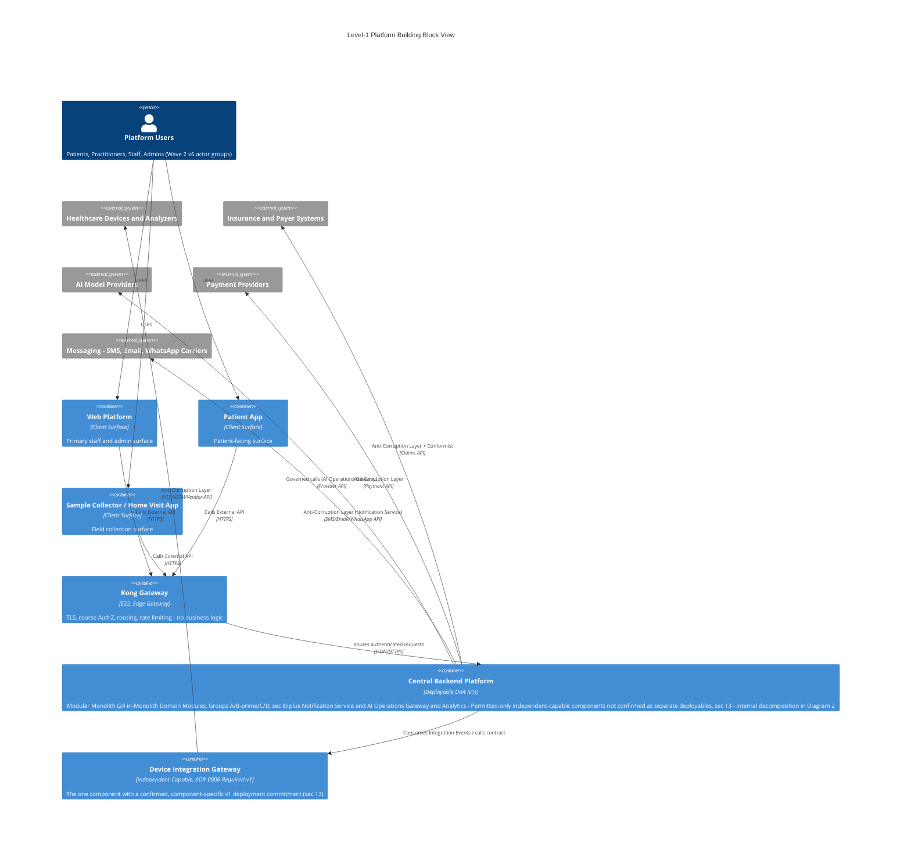
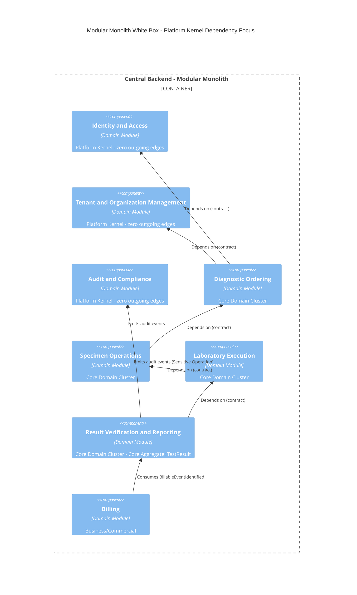
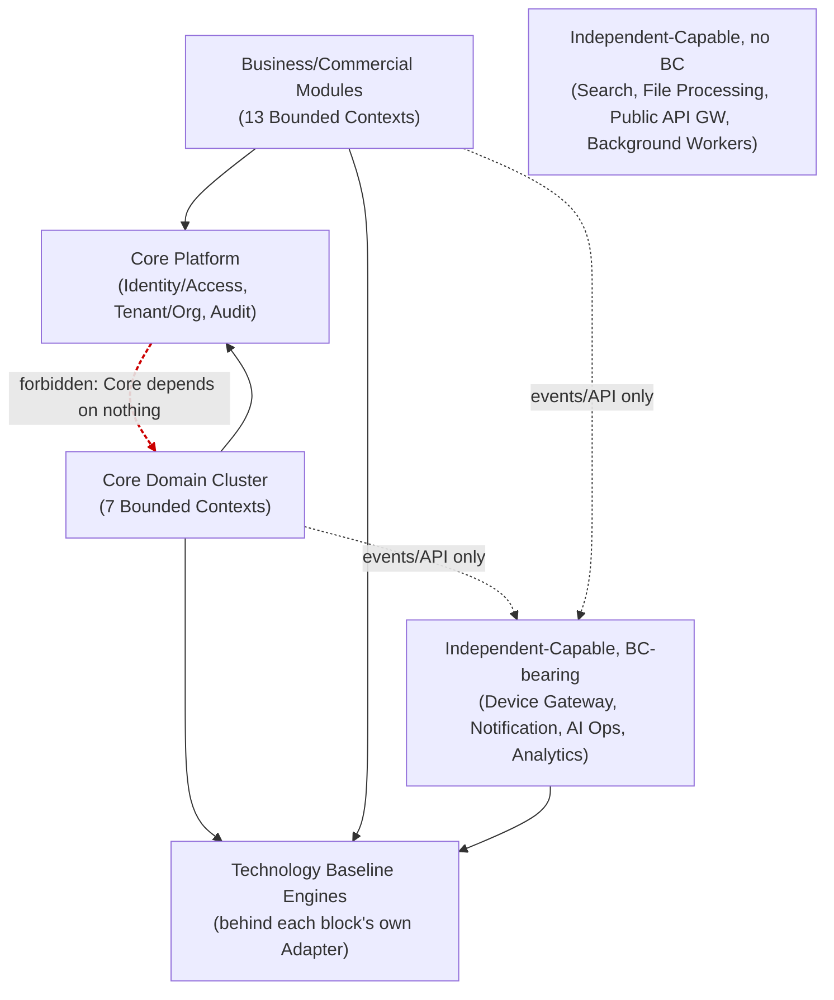

# SAD Wave 4 — Building Block View

## 1. Document Metadata

| Field | Value |
|---|---|
| Wave number and title | 4 of 13 — Building Block View (`docs/sad/README.md`) |
| Document Status | **Review** (Constitution §59 Document Status Vocabulary — not `Accepted`) |
| Owner | Author of this Wave (session author, 2026-07-20) |
| Review authority | Project Owner, acting as Architecture Review Board (Constitution §57) |
| Dependencies | Wave 1 — **Accepted**; Wave 2 — **Accepted**; Wave 3 — **Accepted** (commit `6a0f8d9`, following erratum closure `b4c341e`) |
| Supersedes | None |
| Superseded by | None |
| Updated | 2026-07-20 |

This Wave does not become `Accepted` in this pass, regardless of its own self-review verdict (§26). Per the Inter-Wave Gate (`docs/sad/README.md`), only the Project Owner's explicit statement of acceptance changes this field.

## 2. Purpose and Boundaries

**Function of this Wave.** The Building Block View decomposes the System of Interest — drawn as a black box in Wave 2 and strategically characterized in Wave 3 — into its internal logical building blocks: what exists inside the platform, what each part is responsible for, what it provides and requires, who owns what data, and which relationships are allowed or forbidden. This is arc42's "Building Block View" station: it names and bounds things, it does not sequence their behavior or place them on infrastructure.

**Difference from Solution Strategy (Wave 3).** Wave 3 stated *how* the platform is strategically realized (Modular Monolith, DDD, Clean/Hexagonal, event-driven, reuse) without fixing a Container/Component decomposition or a Bounded-Context-to-Module mapping. This Wave performs exactly that decomposition — but as a *logical* structure. Nothing in this Wave is a claim about how many operating-system processes exist, which cloud region hosts them, or how many container images are built.

**Difference from Runtime View (Wave 5).** Wave 5 will show *sequences* of interaction between these building blocks for specific scenarios (e.g., "a device result reaches a released report"). This Wave names the blocks and their allowed relationships; it does not choreograph a scenario end-to-end.

**Difference from Deployment View (Wave 6).** Wave 6 decides *where* building blocks actually run: how many deployable units exist, which ones are literally separate processes/containers in v1, cloud topology, and scaling. A building block in this Wave is a **logical** unit of responsibility. Whether it is *independently deployed* is a distinct, later question this Wave explicitly defers per component (§13).

**Difference from Security/Privacy/Trust Boundaries (Wave 7).** Trust-zone boundaries, STRIDE analysis, and specific security controls are Wave 7's territory; this Wave states data-ownership and dependency rules that Wave 7 will later analyze for threats, but does not perform that analysis itself.

**Four distinct concepts this Wave never conflates, added after Independent Architecture Review (Post-Review Erratum, §26):**

| Concept | What it means | What it does NOT decide |
|---|---|---|
| **Logical block membership** | Which of the 8 Groups (§8) a Bounded Context belongs to — e.g., Notification and Communication is a "BC-bearing independent-capable" block, logically outside the Modular Monolith's Group A/B′/C/D module set | Whether that block runs as its own process |
| **Source-code/module boundary** | The enforced schema/contract boundary (ADR-0003, ADR-0004) every block has regardless of deployment | Physical topology |
| **C4 runnable Container** | A diagram element asserting a block is independently runnable — used in this Wave's diagrams only where a source justifies it (§13) | Replica count, host, region, or scaling policy (all Wave 6) |
| **Physical deployment/process/replica topology** | The actual v1 answer to "how many processes, where" | This is exclusively Wave 6's decision; this Wave states none of it |

Concretely: Notification Service, AI Operations Gateway, and Analytics are **logically outside** the Modular Monolith's module set (§8) — but this Wave does not thereby assert they run as three separate processes. They may be **co-deployed within the same Central Backend runnable unit** as the Modular Monolith itself until Wave 6 decides otherwise (§5's Diagram 1 draws them this way for exactly this reason). Device Integration Gateway is different only because its **own governing ADR-0006** commits it, specifically, to v1 operational independence (§13) — that commitment is unchanged by this clarification. Logical-outside-Monolith status is never, by itself, evidence of independent deployment; and this clarification does not add, remove, or renumber any of the 8 Constitution §11-named Independent Components.

**Three further foundational clarifications this Wave enforces throughout, restated from Wave 3 §7 and Wave 2 §8 and never contradicted below:**
- **A building block does not imply a deployable.** Every block in this document, including each of the 8 Independent Components, is a logical unit; only §13 states, per component and per its own governing source, whether that component's *deployment* independence is Required, Permitted, or Not decided.
- **A Bounded Context does not imply a Module.** Per Wave 2 §8, this was previously left undecided. §9 (BC-to-Module Mapping Matrix) below resolves it for the first time — but only where evidence supports resolution, using `Deferred` rather than an invented answer where it does not.
- **A Module does not imply a Service.** A Module is the Modular Monolith's internal implementation unit; only a Module that undergoes Selective Service Extraction (Wave 3 §18) or is one of the 8 Independent Components becomes a separately-deployed Service — and even then, not automatically in v1 (§13).

## 3. Notation and Modeling Rules

This Wave uses **arc42-style hierarchical building-block decomposition**, with C4 Container/Component diagrams (Mermaid, per the `c4-architecture` skill) only where a genuine C4-shaped abstraction is being drawn — not as a universal notation for every table in this document.

| Term | Definition | Source |
|---|---|---|
| **Black box** | A building block shown only by its interface/responsibility, with no internal structure disclosed | arc42 convention |
| **White box** | A building block shown with its internal sub-blocks and their relationships | arc42 convention |
| **C4 System** | The whole System of Interest, as a single box interacting with actors/external systems | Wave 2 §14; `c4-architecture` skill |
| **C4 Container** | A separately runnable/deployable unit (an application, a service, a database) | `c4-architecture` skill, `references/common-mistakes.md` — "Containers are deployable units... Components are non-deployable elements inside a container" |
| **C4 Component** | A non-deployable element *inside* a Container (a module, a class cluster, a package) | Same source |
| **Domain Module** | The Modular Monolith's internal implementation unit — enforced schema boundary (ADR-0003), contract-only cross-Module access (ADR-0004) | ADR-0003; ADR-0004; Wave 3 §7 |
| **Bounded Context** | A DDD modeling/language boundary — one of the 28 named contexts (ADR-0012); not itself a deployment concept | Constitution §6; ADR-0012 |
| **Independent-Capable Component** | One of the 8 Constitution §11-named components, permitted (Accepted) to be operationally independent; whether each *is* independently deployed in v1 is per-component, not uniform (Wave 3 §26) | Constitution §11; Wave 3 §26 |
| **Engine** | A ratified Technology Baseline item (24 Engines, 4 Libraries, 5 Reference Standards) adopted behind the platform's own contract | `02-TECHNOLOGY-BASELINE.md` |
| **Adapter** | The concrete implementation of a Port against a specific Engine or external system | `architecture-patterns` skill |
| **Port** | An interface a Module's Domain/Application layer defines for something it needs from outside itself | `architecture-patterns` skill; `domain-driven-design` skill, `references/repositories-factories.md` |
| **Contract** | A published, versioned API or Event schema a block exposes or consumes — the only legitimate way one block reaches another's data | ADR-0003; ADR-0004 |
| **Logical datastore** | A named data-ownership boundary (a Module's schema) described without physical table/index/replication detail | ADR-0003; Wave 3 §11 |
| **Pivotal Event** | A Domain Event marking a significant handoff between stakeholder groups or a major state transition, identified in Discovery Event Storming; full treatment in §16 | Discovery Phase 03 (`03-event-storming-board.md`) |
| **Sensitive Operation** | A state-changing action (e.g., verifying a clinical result) requiring elevated authorization and a mandatory Audit Event, per Constitution §21 — a Constitution-level term this Wave uses but does not redefine | Constitution §21 |
| **Customer/Supplier, Partnership, Open Host Service + Published Language, Anti-Corruption Layer, Conformist** | DDD context-mapping relationship patterns describing *how* two Bounded Contexts relate (e.g., which side adapts to the other) — used throughout §9/§11/§12/§18's relationship columns exactly as Discovery/the reuse research already labeled them, not redefined here | `domain-driven-design` skill, `references/bounded-contexts.md`; Discovery artifacts (`06-context-map.md`, `W9-bounded-context-remapping.md`) |

**C4 abstraction discipline enforced in this Wave (per the `c4-architecture` skill's Abstraction Guard role, continued from Wave 3 into an active decomposition role here):** a block is drawn as a C4 **Container** only if a source in this Wave's coverage (§26) establishes it is independently runnable; every Domain Module inside the Modular Monolith is drawn as a **Component**, never a Container, unless and until Wave 6 or a Selective Service Extraction ADR says otherwise. No "subcomponent," "microservice group," or other undefined abstraction level is introduced (`references/common-mistakes.md`, Mistake #2).

## 4. Level-0 System Black Box Reference

The System of Interest's black-box boundary was already drawn in Wave 2 §14 (Context Diagram Specification): a single `System()` box, "Enterprise Healthcare SaaS Platform," with 6 Person/Person_Ext actor groups, 5 `System_Ext` external systems (Healthcare Devices & Analyzers; Payment Providers; Messaging/SMS/Email/WhatsApp Carriers; Insurance/Payer Systems; AI Model Providers), and 11 unidirectional relationships. **This Wave does not redraw that diagram.** Wave 2 §14 itself states this diagram is "a specification for a future official diagram... internal detail belongs to Wave 4" — this section is that internal detail; §5 below is its white-box expansion, not a replacement of the Level-0 box.

## 5. Level-1 Platform White Box

The platform's top-level composition, distinguishing the categories the governing instruction requires:

| Category | Contents | Evidence status |
|---|---|---|
| **Client Surfaces** | Web Platform, Patient App, Sample Collector/Home Visit App (§6) | Confirmed (Wave 2 §3, §5) |
| **Edge/API Access** | Kong Gateway (Edge Gateway, E22, D-44) (§7) | Accepted (D-44; `22-ARCHITECTURE-BASELINE-FREEZE.md`) |
| **Central Backend Modular Monolith** | 24 of the 28 Bounded Contexts, organized as Domain Modules (§8) | Accepted (ADR-0001, ADR-0012) |
| **Core Platform** | Identity and Access, Tenant and Organization Management, Audit and Compliance (§10) | Accepted (Constitution §10; ADR-0012) |
| **Named independent-capable components** | 8 per Constitution §11; 4 correspond to a named Bounded Context (§13), 4 do not | Accepted (permission); per-item status in §13 |
| **Platform-managed infrastructure/technology dependencies** | Kong Gateway (E22), OpenBao (E23), PostgreSQL (E24), RabbitMQ (E7), and other Technology Baseline Engines with no single owning Module (§18) | Frozen Baseline (`02-TECHNOLOGY-BASELINE.md`) |
| **External systems** | Healthcare Devices & Analyzers; Payment Providers; Messaging Carriers; Insurance/Payer Systems; AI Model Providers | Confirmed (Wave 2 §7) |



**Guardrail on this diagram, restated after Reader Testing correction**: per §3's own Abstraction Guard rule ("every Domain Module inside the Modular Monolith is drawn as a Component, never a Container"), this diagram draws **only two things confirmed independently runnable** as `Container`: Device Integration Gateway (the one component with ADR-0006's own, component-specific `Required` v1 commitment, §13) and Kong Gateway (a ratified, named Technology Baseline product, E22). **Every other Independent-Capable Component — Notification Service, AI Operations Gateway, Analytics, plus the 4 with no owning Bounded Context at all (Search Service, File Processing Service, Public API Gateway beyond Kong itself, Background Workers) — is folded into the single "Central Backend Platform" box** rather than drawn as its own `Container`, because none of them carries a confirmed, component-specific deployment-independence status (§13); drawing any of them separately here would assert a deployment fact this Wave does not have evidence for. This corrects an earlier draft of this diagram, which incorrectly drew Notification Service, AI Operations Gateway, and Analytics as separate `Container` elements and bundled 24 Domain Modules into three oversized "Container" boxes — both defects found by this Wave's own Reader Testing Pass 2 (§26) and fixed here, not merely noted. §22's Diagram 2 shows the "Central Backend Platform" box's internal decomposition at `Component` level, where Domain Module granularity belongs. All 5 of Wave 2 §14's `System_Ext` external systems appear here (this diagram is a Building-Block-level elaboration of Wave 2's boundary, not a reduction of it); Wave 2's 6 Person/Person_Ext actor groups remain collapsed into a single `Person(users, ...)` box, since disaggregating them adds no Building-Block-level information — §4 already states this diagram does not redraw Level-0, and the actor detail belongs to Wave 2, not here.

## 6. Client Surfaces

Only the client surfaces actually named in Wave 1/Wave 2 are covered here — no additional surface is invented:

| Surface | Role | Source |
|---|---|---|
| **Web Platform** | Primary surface for staff, practitioners, and platform/tenant/organization administrators (the "Admin Portal" usage named in Wave 2 §14's relationship table is a *usage pattern of this same surface*, not a fourth, separately-built client — no dedicated "Admin Dashboard" container is named anywhere in Wave 1/Wave 2, and this Wave does not invent one) | Wave 2 §3, §5, §14 |
| **Patient App** | Patient-facing surface | Wave 2 §3, §5 |
| **Sample Collector / Home Visit App** | Field-collection surface | Wave 2 §3, §5 |

All three connect to the **same unified backend/API surface** through Kong Gateway (§7) — "one backend, many front doors" (`01-API-VISION.md` Goal 1, cited by Wave 2 §3). None is permitted a Portal-specific backend fork, a new unapproved Backend-for-Frontend, or client-side authorization authority (Wave 3 §12; `09-AUTHORIZATION.md`).

## 7. Edge and API Access Blocks

**Kong Gateway** (E22, D-44) is the platform's single entry point for **External, Partner, Public, and Admin** API traffic — **never Internal** traffic, which never leaves the Modular Monolith (`10-API-GATEWAY.md`; Wave 3 §10).

**API classification** (`03-API-DOMAIN-INVENTORY.md`, read fresh for this Wave): six populated types — Internal (all 28 Modules, 28/28), External/Portal-facing (21 of 28), Partner (6 candidates, 0 designed), Public (0, deliberate non-decision), Admin, Integration (machine-to-machine with an external system) — plus a seventh, deliberately-empty "Future API" bucket (2 items explicitly blocked on an Open Question, both now Closed per §26 below).

**Gateway responsibilities, quoted from `10-API-GATEWAY.md`'s own existing "Gateway Responsibilities Summary" table, not new design by this Wave**: TLS termination, AuthN (token validation), coarse AuthZ (RBAC), routing, rate limiting, protocol/version transformation, opt-in caching, correlation-ID assignment — **authentication and coarse authorization only** (Constitution §20: authentication establishes identity only, it does not by itself grant access). **Explicitly not in scope for the Gateway**: fine-grained ABAC/Data-Scope decisions, business-logic dispatch, distributed tracing, Sensitive-Operation/Human-in-the-Loop gating. **Corrected placement of this remaining authorization work, after Independent Architecture Review (§26)**: it belongs to the owning Module's **Application/Authorization layer** (§14's Inbound Adapter / Application layer — policy decision, tenant/Data-Scope evaluation, Sensitive-Operation gating, Consent/Resource-Ownership checks, per Constitution §21), not to the Aggregate/Domain layer. The Aggregate/Domain Model (§14) is reached only *after* that authorization context is already established, and is responsible solely for business invariants and valid state transitions — it never itself calls OPA, a Gateway, or a token provider.

**Two-PEP pattern** (Wave 3 §10, restated at Building-Block depth): a coarse, Role-level Policy Enforcement Point at the Gateway, and a fine, Data-Scope-level PEP at each Module's own boundary. "A `deny` at the Gateway means the request never reaches a Module at all; a `deny` at a Module boundary means the caller was permitted to call the endpoint but not to see or act on this specific resource" (`09-AUTHORIZATION.md`). Neither substitutes for the other.

**No native Engine API is exposed to any Portal, Partner, or Public consumer** through this Gateway or otherwise (`01-API-VISION.md`; `02-API-FIRST-ARCHITECTURE.md` Layer 5) — every Engine sits behind its owning Module's Anti-Corruption Layer first (§18).

**Guardrail**: no route, policy document, rate-limit number, or auth-flow sequence is designed here — this is `docs/api-platform/`'s own territory, cited, not re-authored.

## 8. Modular Monolith White Box

The Modular Monolith hosts **24 of the 28 Bounded Contexts** as Domain Modules — every Bounded Context except the 4 that correspond to a named Independent Component with its own contexts (Device Integration Gateway → Device Integration BC #9; Notification Service → Notification and Communication BC #21; AI Gateway → AI Operations BC #24; Analytics Platform → Analytics BC #23), which are permitted, not mandated, to run as separate deployables (§13).

**The table below shows the full 28-context grouping scheme this Wave uses platform-wide (matching `.claude/context/module-catalog.md`'s 2026-07-18 update and `03-API-DOMAIN-INVENTORY.md`'s own grouping — the two sources state they match "exactly," verified fresh in this Wave's own source coverage, §26). Only Groups A, B′, C, and D (3+1+7+13 = 24 contexts) are literally hosted inside the Modular Monolith deployable; Group B (4 contexts) is shown here for grouping completeness only — each of its 4 members is independent-capable (§13) and is documented as its own block in §5's Level-1 diagram, not as part of this White Box's 24.**

| Group | Count | Members |
|---|---|---|
| **A — Platform Kernel** (Core Platform, §10) | 3 | Identity and Access, Tenant and Organization Management, Audit and Compliance |
| **B — Shared Infrastructure / Independent-Capable, BC-bearing** | 4 (of 8 total Independent Components, §13) | Device Integration Gateway, Notification Service, AI Operations Gateway, Analytics |
| **B′ — API-Platform's own "Document Management" grouping** | 1 | Document Management — grouped by `03-API-DOMAIN-INVENTORY.md` alongside B for API-classification purposes, but **not** one of the Constitution §11-named 8 Independent Components; treated in this Wave as an ordinary Recognized-tier Domain Module (§12), not a 9th Independent Component |
| **C — Core Domain Cluster** | 7 | Patient Management, Practitioner and Clinic Management, Scheduling and Encounters, Diagnostic Ordering, Specimen Operations, Laboratory Execution, Result Verification and Reporting |
| **D — Business and Commercial Modules** | 13 | Quality Management, Asset and Maintenance, Inventory, Procurement, Supplier Management, Billing, Payments and Treasury, Insurance and Corporate Contracts, Accounting, Workforce Management, Payroll, CRM and Support, SaaS Commercial Operations |

3 + 4 + 1 + 7 + 13 = 28 (the full Bounded Context count); of these, **3 + 1 + 7 + 13 = 24 are inside the Modular Monolith** (Groups A, B′, C, D), and **4 (Group B) sit outside it** as independent-capable components (§13). The 28-total reconciliation matches the Bounded Context count exactly — **this is a 1:1 correspondence explicitly asserted by `module-catalog.md` itself** ("the 28 contexts match the structure of `docs/reuse/` and `03-API-DOMAIN-INVENTORY.md`'s table exactly"), not an assumption this Wave makes. It resolves Wave 2 §8's open question for the population of contexts named above; §9's Mapping Matrix still records this as the **current, evidenced mapping**, not an immutable one, and still uses `Deferred` for any context where a source conflict or evidence gap exists (there are none for this top-level grouping, per §26's Cross-Reference Validation).

**Enforced rules inside the Monolith** (ADR-0003, ADR-0004, restated at Building-Block depth): each Module owns a distinct schema; no Module reads/writes another Module's schema directly; cross-Module reads happen only through that Module's API, Domain/Integration Events, or an approved Read Model; Ports/Adapters (§14) isolate every Module's Domain/Application layer from any specific Engine or framework.

## 9. BC-to-Module Mapping Matrix

All 28 Bounded Contexts (ADR-0012; tiering per its Gap Closure Wave 14 / Open Questions Resolution amendments, both Accepted). Source for names/tiers/relationships: `docs/discovery/artifacts/W9-bounded-context-remapping.md`; Module correspondence: `.claude/context/module-catalog.md` (2026-07-18 update) and `docs/api-platform/03-API-DOMAIN-INVENTORY.md`.

**Four distinct concepts this table's columns represent, separated explicitly after Independent Architecture Review (§26) — the "Mapping status" column's `Confirmed by accepted source` value never means all four are Accepted; it means only the first two are:**

1. **Bounded Context Status** (Modeled/Recognized, "Tier" column) — Accepted, from ADR-0012 itself.
2. **Module Catalog Correspondence** (a Module name exists in the currently-Accepted `module-catalog.md`) — Accepted, derived from the same 28-context catalog.
3. **Wave 4 Implementation Mapping** ("Mapping type," "Proposed Module" columns) — a **SAD-level design** this Wave performs, using the 1:1 candidate each context's own sources support; for the 19 Recognized contexts this remains **provisional and revisitable**, not Fully Modeled merely because a Module name exists for it.
4. **Schema Namespace** ("Owning schema" column) — a **Wave 4 logical-design choice** (a namespace string like `patient_management`), not a decision stated anywhere in ADR-0012 or the Constitution, and not a claim about final physical database/schema topology (Wave 6).

Concretely: **`Confirmed by accepted source` in the "Mapping status" column below means only that the Context's name and Tier (concepts 1–2) are Accepted** — it does **not** mean the schema name, the 1:1 implementation mapping, any Provided/Required contract, or any runtime behavior is itself stated in ADR-0012 or the Constitution; those remain this Wave's own SAD-level application of concepts 3–4, for both the 9 Modeled and the 19 Recognized contexts alike. **`Provisional SAD mapping` (used for all 19 Recognized rows) means the Module/schema candidate is documented and usable for this Wave's purposes, but the context's own boundary and detail remain revisitable** (ADR-0012's own Revisit Triggers) — this status is deliberately not `Deferred`, since a logical Module candidate is in fact documented for every one of the 19, but it is also deliberately not upgraded to the Modeled tier's own confidence.

| # | Bounded Context | Tier | Proposed Module | Mapping type | Confidence | Owning schema | Mapping status |
|---|---|---|---|---|---|---|---|
| 1 | Patient Management | Modeled | Patient Management | 1:1 | Evidenced (BC), Inferred (Aggregate detail, Wave 5) | `patient_management` | Confirmed by accepted source |
| 2 | Practitioner and Clinic Management | Recognized | Practitioner and Clinic Management | 1:1 | Inferred | `practitioner_clinic_mgmt` | Provisional SAD mapping |
| 3 | Scheduling and Encounters | Recognized | Scheduling and Encounters | 1:1 | Inferred | `scheduling_encounters` | Provisional SAD mapping |
| 4 | Diagnostic Ordering | Modeled | Diagnostic Ordering | 1:1 | Evidenced | `diagnostic_ordering` | Confirmed by accepted source |
| 5 | Specimen Operations | Modeled | Specimen Operations | 1:1 | Evidenced | `specimen_operations` | Confirmed by accepted source |
| 6 | Laboratory Execution | Modeled | Laboratory Execution | 1:1 | Evidenced | `laboratory_execution` | Confirmed by accepted source |
| 7 | Result Verification and Reporting | Modeled | Result Verification and Reporting | 1:1 | Evidenced (Core Domain) | `result_verification_reporting` | Confirmed by accepted source |
| 8 | Quality Management | Recognized | Quality Management | 1:1 | Inferred | `quality_management` | Provisional SAD mapping |
| 9 | Device Integration | Modeled | Device Integration Gateway | 1:1 (Independent-Capable) | Evidenced | `device_integration` | Confirmed by accepted source (ADR-0006) |
| 10 | Asset and Maintenance | Recognized | Asset and Maintenance | 1:1 | Inferred | `asset_maintenance` | Provisional SAD mapping |
| 11 | Inventory | Recognized | Inventory | 1:1 | Inferred | `inventory` | Provisional SAD mapping |
| 12 | Procurement | Recognized | Procurement | 1:1 | Inferred | `procurement` | Provisional SAD mapping |
| 13 | Supplier Management | Recognized | Supplier Management | 1:1 | Inferred | `supplier_management` | Provisional SAD mapping |
| 14 | Billing | Recognized | Billing | 1:1 | Inferred | `billing` | Provisional SAD mapping |
| 15 | Payments and Treasury | Recognized | Payments and Treasury | 1:1 (Partnership with #14, W9) | Inferred | `payments_treasury` | Provisional SAD mapping |
| 16 | Insurance and Corporate Contracts | Recognized | Insurance and Corporate Contracts | 1:1 | Inferred (BC); Evidenced (openIMIS adoption, §18) | `insurance_corporate_contracts` | Provisional SAD mapping |
| 17 | Accounting | Recognized | Accounting | 1:1 | Inferred | `accounting` | Provisional SAD mapping |
| 18 | Workforce Management | Recognized | Workforce Management | 1:1 | Inferred | `workforce_management` | Provisional SAD mapping |
| 19 | Payroll | Recognized | Payroll | 1:1 | Inferred | `payroll` | Provisional SAD mapping |
| 20 | CRM and Support | Recognized | CRM and Support | 1:1 | Inferred | `crm_support` | Provisional SAD mapping |
| 21 | Notification and Communication | Modeled | Notification Service | 1:1 (Independent-Capable) | Evidenced | `notification_service` | Confirmed by accepted source (Constitution §11) |
| 22 | Document Management | Recognized | Document Management | 1:1 | Inferred — **weakest-evidenced of the 28** (Discovery's own Wave 3 label) | `document_management` | Provisional SAD mapping |
| 23 | Analytics | Recognized | Analytics | 1:1 (Independent-Capable) | Inferred | *(none — reads only; owns no primary data, §17)* | Provisional SAD mapping |
| 24 | AI Operations | Recognized | AI Operations Gateway | 1:1 (Independent-Capable) | Inferred (BC); Accepted (governance mechanism, ADR-0007) | `ai_operations` (audit trail only) | Provisional SAD mapping |
| 25 | SaaS Commercial Operations | Recognized | SaaS Commercial Operations | 1:1 | Inferred | `saas_commercial_ops` | Provisional SAD mapping |
| 26 | Tenant and Organization Management | Modeled | Tenant and Organization Management | 1:1 (Platform Kernel) | Evidenced | `tenant_org_mgmt` | Confirmed by accepted source (Constitution §10) |
| 27 | Identity and Access | Modeled | Identity and Access | 1:1 (Platform Kernel) | Evidenced | `identity_access` | Confirmed by accepted source (Constitution §10) |
| 28 | Audit and Compliance | Recognized | Audit and Compliance | 1:1 (Platform Kernel) | Inferred (BC split); Evidenced (Constitution §21-23 primitives) | `audit_compliance` | Provisional SAD mapping |

**No context uses `Deferred` or `Multiple BCs in one Module` or `One BC split across internal blocks`** — every one of the 28 has a named 1:1 candidate Module from the sources above, at whatever evidence tier that context itself carries (`Evidenced` for the 9 Modeled contexts; `Inferred` for the 19 Recognized contexts, including Document Management, the "weakest-evidenced of the 28," §12 — this table does not upgrade that context's own evidence tier merely by giving it a Module name), and none conflicts with ADR-0012 or the Core Domain. This is a **stated, current mapping**, not a claim of permanence: per §21 (Explicit Non-Decisions), the platform is not thereby committed to exactly 28 physical schemas or 28 deployables — the mapping is the *logical* correspondence this Wave's evidence supports, revisitable exactly as any Recognized-tier context itself is (ADR-0012's own Revisit Triggers).

**"Partner and Marketplace Operations" and "Platform Administration" — historical/superseded capability candidates, not an Open Bounded Context question, corrected after Independent Architecture Review (§26)**: `docs/discovery/artifacts/W3-enterprise-capability-map.md` (an early Enterprise Capability Map, lower in the Source Precedence order than the final context catalog) named these two candidates. Applying Source Precedence — `W9-bounded-context-remapping.md`'s final remapping, then ADR-0012, then the currently-Accepted Module Catalog, then Open Questions Resolution/Register — **none of these higher-authority, later sources states, anywhere, that either candidate remains an open or unresolved Bounded Context question**; `W9-bounded-context-remapping.md`'s own rejection discussion addresses only "Integration Hub" (below) and is silent on these two, and neither the Open Questions Register nor its Resolution names them at all. Per the No-Guessing Rule, this Wave does not infer an `Open` status no source actually states. Instead: their named capabilities are **most plausibly already covered** by the accepted 28-context map's own existing Admin-API and Partner-API classifications — "Platform Administration" by Tenant and Organization Management's and Identity and Access's own Admin API surfaces (§7, `03-API-DOMAIN-INVENTORY.md`), and "Partner and Marketplace Operations" by the 6 already-named Partner API candidates spread across several existing Modules (§7) and by SaaS Commercial Operations' own commercial/entitlement scope (§9, row 25) — **not** confirmed by an explicit source statement to that effect, but a reasonable, hedged reading consistent with every later source's silence rather than an invented certainty. This Wave does **not** state or imply the context count could become 29 or 30 on this basis, does **not** carry these two forward as an Open Dependency (removed from §24), and does **not** create a new Open Question — if a later source is found that explicitly keeps either candidate open, that text and its file path would need to be quoted and the conflict logged at that time, which this Wave's own source coverage did not find.

**The rejected 29th candidate** — "Integration Hub" — was considered in Discovery and rejected because every external integration already has its own Anti-Corruption Layer owned by its consuming context (Device Integration Gateway for devices, Insurance and Corporate Contracts for payers); a centralizing context would duplicate ownership (`W9-bounded-context-remapping.md`). This Wave does not reopen that rejection.

## 10. Core Platform White Box

**Allowed content, quoted from Constitution §10 (Core Platform Rules), read fresh for this Wave**: "genuinely cross-cutting capability needed by virtually every module: Identity (authn identity, not per-module profile data), Policy/Authorization primitives, Audit primitives, and the notification/eventing primitives that other modules build on." **Forbidden**: "domain-specific logic (e.g., lab result interpretation, billing rules) inside Core Platform 'because it's shared.'" Definition-of-Done requirement: any Core Platform addition "must show it is used by 2+ unrelated modules and contains no single-domain business logic."

**Mapped to the Bounded Context Map** (a convergence found during this Wave's own cross-reference, §26, not engineered to fit): Core Platform = the three Platform Kernel contexts (§8, Group A) — **Identity and Access** (authn identity, Policy primitives via OPA), **Tenant and Organization Management** (the shared Tenant/Organization/Branch resolution contract every Module consumes), **Audit and Compliance** (Audit primitives, immudb-backed).

**A precise distinction this Wave draws, not previously stated at this depth**: Constitution §9's own dependency diagram labels Core Platform's notification element "Notification-core" — this is the **internal eventing plumbing** every Module uses to publish/consume Domain and Integration Events (ADR-0004), not the full external multi-channel delivery capability (SMS/Email/WhatsApp/Push/In-Portal via Novu) that belongs to the separate **Notification Service** Independent Component (§13). Folding Novu-backed external delivery into Core Platform would violate the Forbidden clause above (a specific external-channel capability is not "genuinely needed by virtually every module" in the same way identity/audit/policy are) — this Wave keeps them distinct.

Dependency direction (Constitution §9's own diagram, restated): "Core Platform may be depended on by any module; it depends on no module." Every one of the other 25 Bounded Contexts/Modules may call Core Platform's contracts; Core Platform never calls into a Domain Module, an Independent Component, or an Engine outside its own three primitives' adapters.

## 11. Modeled Bounded Context Building Blocks

Documented to the depth the sources actually support — **no Aggregate, Entity, or Value Object is invented beyond what Discovery Phase 05 (`05-candidate-aggregates.md`) or Wave 5 Event Storming already names.**

| Context | Purpose | Owned data (named Aggregates/concepts) | Provided contracts | Required contracts | Published events | ACL boundary | Key dependency |
|---|---|---|---|---|---|---|---|
| **Patient Management** | Owns Patient/Guardian/Consent lifecycle; participates in Core Domain orchestration as a first-class actor (ADR-0011 Amendment) | Patient, Guardian, Consent | Patient aggregate contract (FHIR-Patient-shaped), consumed by every downstream Core Domain context | Identity and Access (authn identity) | Domain Events per Wave 5 Cluster G (not itemized here — Wave 5's own catalog is the source, not re-derived) | FHIR Patient resource exchange with external referring systems | Identity and Access |
| **Diagnostic Ordering** | Owns the diagnostic-test-order lifecycle | TestOrder, TestCatalogEntry (references Patient, Specimen by ID only) | TestOrder aggregate contract, consumed by Billing (Customer/Supplier, unchanged from Baseline — Billing is the Customer/downstream side, per §12's Billing row; Diagnostic Ordering is the Supplier/upstream side and does not itself depend on Billing) | Patient Management | `TestOrdered` | — | Patient Management |
| **Specimen Operations** | Owns Specimen lifecycle and chain-of-custody | Specimen, ChainOfCustodyRecord (references TestOrder by ID only) | Specimen aggregate contract | Diagnostic Ordering; Device Integration Gateway | `SpecimenCollected`, `SpecimenAccessioned` (Pivotal — marks a genuine responsibility handoff, §16), `SpecimenRejected` | — | Diagnostic Ordering |
| **Laboratory Execution** | Owns the analytical-processing step; split from Result Verification and Reporting because sign-off/audit weight is categorically different | Processing sub-slice (no named Aggregate root evidenced beyond the process itself) | Analytical-processing contract, Westgard QC events | Specimen Operations; Device Integration Gateway (ACL) | `TestProcessingStarted`, `TestResultCaptured` | Device Integration Gateway ACL (Constitution §6/§24, mandatory) | Specimen Operations, Device Integration Gateway |
| **Result Verification and Reporting** | The Core Domain's clinical sign-off/reporting step; smallest, most tightly guarded consistency boundary in the model | **TestResult** (Aggregate Root; Value Objects: `ResultValue`, `VerificationRecord`, `ProvenanceInfo`; references Specimen and TestOrder by ID only) | `TestResult` contract; FHIR DiagnosticReport exchange | Laboratory Execution; Specimen Operations (Customer/Supplier) | `ResultVerified` (Pivotal, Sensitive Operation), `ResultReleased` (Pivotal), triggers `BillableEventIdentified` | — | Laboratory Execution |
| **Device Integration** *(Independent Component, §13)* | Isolates device/protocol/vendor churn from the business Core | DeviceImportRecord | Normalized device-result ingestion contract (ACL output) | — | Integration Events into Laboratory Execution | Anti-Corruption Layer per device/vendor (ADR-0006) | External devices |
| **Notification and Communication** *(Independent Component, §13)* | Multi-channel delivery of platform-originated messages | NotificationRequest | Notification dispatch contract | Subscribes to `ResultVerified`/`ResultReleased`/Billing events (Open Host Service + Published Language) | — | — | Specimen Operations, Result Verification and Reporting, Billing (event subscriptions) |
| **Tenant and Organization Management** *(Platform Kernel, §10)* | Owns Tenant/Organization/Branch — universal-dependency, zero outgoing edges | Tenant, Organization, Branch | Tenant/Org/Branch resolution contract, consumed by every Module | *(none — depends on no other Module)* | — | — | *(none)* |
| **Identity and Access** *(Platform Kernel, §10)* | Owns User/Role/Permission/Policy — universal-dependency, zero outgoing edges | User, Role, Permission, Policy | Token/session validation contract, consumed by every Module | *(none)* | — | — | *(none)* |

**Consistency rule preserved from Discovery, restated as a Building-Block rule**: every Aggregate above references another context's Aggregate by ID only, never by embedding — "TestResult... References Specimen and TestOrder by ID" (`05-candidate-aggregates.md`), matching the `domain-driven-design` skill's Aggregate Rule 3 exactly (`references/building-blocks.md`).

## 12. Recognized Bounded Context Black-Box Catalog

The 19 Recognized-tier contexts, described **only as black boxes** — purpose, boundary hypothesis, known relationships, and what modeling work remains. **No Aggregate, Entity, or Repository is created for any of these** to complete the table. Every named concept below (e.g., "Invoice, LineItem," "PayrollRun") is quoted directly from Discovery's own per-context data-ownership statements (`W9-bounded-context-remapping.md`'s "Owns" column; `05-candidate-aggregates.md` where a Subdomain overlaps) — this table repeats that name only as a known responsibility, and deliberately does **not** assign it a Root/Value-Object role, an invariant, or a relationship structure. Assigning that tactical role is exactly the modeling work §21/§24 defer, not something this table performs by naming the concept.

| Context | Purpose | Known responsibilities | Known relationships | Missing modeling work | Prohibited assumption |
|---|---|---|---|---|---|
| Practitioner and Clinic Management | Practitioner/Doctor/Clinic Administrator record | Credential-verification invariant | Referenced by Core Domain contexts as an actor | Full Aggregate/invariant modeling | Do not assume tactical detail beyond the name |
| Scheduling and Encounters | Appointment/Encounter lifecycle | Own state machine, distinct from Order lifecycle | Independent of Diagnostic Ordering's own lifecycle | Full state-machine and Aggregate detail | Do not merge with Diagnostic Ordering |
| Quality Management | Non-conformance/CAPA regulatory lifecycle | Distinct from clinical execution | → CRM and Support: Customer/Supplier (Complaint → candidate CAPA) — a relationship Discovery itself flagged as "formalizes an undesigned relationship," not yet confirmed | Full CAPA workflow modeling | Do not assume the CRM relationship is finalized |
| Asset and Maintenance | Asset/MaintenanceRecord | Broader than Device Integration (all physical assets, not just diagnostic devices) | Distinct from Device Integration | Full Aggregate detail | Do not conflate with Device Integration |
| Inventory | Stock/Lot lifecycle | Receive→store→consume/waste, distinct from Procurement | Single Adoption Point: OpenBoxes (§18) | Full Aggregate detail | Do not assume Procurement owns stock levels |
| Procurement | PurchaseRequest/PurchaseOrder | Distinct approval lifecycle from Inventory | Single Adoption Point: ERPNext (§18) | Full Aggregate detail | Do not assume ERPNext's native stock model applies |
| Supplier Management | Supplier evaluation record | External-relationship lifecycle, distinct from a single PO | — | Full Aggregate detail | — |
| Billing | Invoice/LineItem | Split from original "Billing and Claims" (Claim moved to Insurance and Corporate Contracts) | → Diagnostic Ordering: Customer/Supplier | Full Aggregate detail | Do not re-merge Claim into this context |
| Payments and Treasury | Payment/Cashbox | Split from Billing; treasury/cash-position is distinct | → Billing: **Partnership** (a new relationship pattern in W9 — both evolve together, neither strictly upstream) | Full Aggregate detail | Do not assume a strict Customer/Supplier direction |
| Insurance and Corporate Contracts | Claim/Contract | External-payer lifecycle | → Result Verification and Reporting: Open Host Service + Published Language, `BillableEventIdentified` trigger; Adoption Point: openIMIS, correctly outside the Core Domain chain (§18) | Full Aggregate detail | Do not treat as Core Domain |
| Accounting | JournalEntry/Expense | General-ledger lifecycle; may lean on external integration more than deep native ownership | — | Full Aggregate detail | — |
| Workforce Management | Employee/Shift/Leave/Training | HR lifecycle | → Payroll: Customer/Supplier (Payroll consumes Employee/Attendance data but has its own approval chain) | Full Aggregate detail | Do not assume Payroll is a sub-module of this context |
| Payroll | PayrollRun | Split from Workforce Management for data-sensitivity reasons; own approval/audit chain | See above | Full Aggregate detail | Do not weaken its separate audit chain |
| CRM and Support | Lead/SupportCase/Complaint | Customer-relationship lifecycle | See Quality Management row | Full Aggregate detail | — |
| Document Management | Controlled documents (SOP/policy), distinct from clinical Reports | **Weakest-evidenced of the 28** (Discovery's own label) | — | Full Aggregate detail; possibly the boundary itself needs revisiting | Do not treat this context's boundary as settled |
| Analytics *(Independent Component, §13)* | Cross-domain read models | Owns no primary data itself (explicit in source) | Consumes Published Integration Events, owning-module-approved analytical exports, and owning-module-approved Read Models — corrected after Independent Architecture Review (§26) to remove any "reads from every other context" implication of blanket/direct cross-schema access, which was never Accepted; never writes to a source context | — | Do not give this context write authority over any source data; do not let this context perform a direct SQL join against another block's owned schema (Constitution §16) — any such access requires an explicit governing decision, which does not currently exist |
| AI Operations *(Independent Component, §13)* | Generalizes ADR-0007's AI Gateway boundary into an explicit context | Governance/audit trail for AI actions | Open Host Service + Anti-Corruption Layer to every context using an AI use case | Full Aggregate detail | Do not let this context issue an unreviewed clinical action (ADR-0007) |
| SaaS Commercial Operations | Plan/Subscription/Entitlement | Commercial/billing lifecycle distinct from clinical Billing | → Tenant and Organization Management: Customer/Supplier (Subscription state gates tenant entitlements) | Full Aggregate detail | Do not conflate with clinical Billing |
| Audit and Compliance *(Platform Kernel, §10)* | AuditEvent/ConsentRecord | Split from the implicit Core Platform grouping given cross-cutting governance weight | Zero outgoing edges (universal dependency, like Identity and Access / Tenant and Organization Management) | Full Aggregate detail | Do not add domain-specific logic here (§10 Forbidden clause) |

## 13. Independent-Capable Components Catalog

All 8 Constitution §11-named components, **status stated per item, never flattened** — continuing the discipline Wave 3's erratum (§26 there) established.

| Component | Accepted logical responsibility | Governing source | Contract boundary | Data ownership | Engine mapping | Operational independence status | Wave 6 role |
|---|---|---|---|---|---|---|---|
| **Notification Service** | Multi-channel delivery of platform-originated messages | Constitution §11 (general grant only — no dedicated ADR) | Notification dispatch contract; subscribes to `ResultVerified`/`ResultReleased`/Billing events | NotificationRequest (BC #21, Modeled) | Novu (E8), license Requires Legal Verification (§18) | **Permitted** (no component-specific v1 commitment beyond the general Constitution §11 grant) | Finalizes actual v1 deployment form |
| **Device Integration Gateway** | Protocol/vendor isolation for device data reaching the Core | **ADR-0006** — its own Negative Consequences state it "adds an operationally independent component to run/monitor from v1" | Normalized device-result ingestion contract via ACL | DeviceImportRecord (BC #9, Modeled) | Mirth Connect (E6, frozen-release, R-02), Apache Camel (fallback) | **Required** (ADR-0006's own, component-specific commitment — the one component with a stronger-than-Permitted status, per Wave 3 §26) | Confirms v1 topology consistent with this Required status |
| **AI Gateway** (named "AI Operations Gateway" in §5, §9, §11, §18 — same component, one alias, not a 9th component) | Governed AI assistance, mandatory Human-in-the-Loop for sensitive actions | **ADR-0007** — names it "one of the Independent Components," asserts no v1-deployment-specific claim | Governed AI contract; audit trail of every AI action | AI Operations audit trail (BC #24, Recognized) | Portkey Gateway (E9) | **Permitted** (Constitution §11 grant; ADR-0007 does not elevate it to Required) | Finalizes actual v1 deployment form |
| **Analytics Platform** | Cross-domain read models, variable/read-heavy load isolation | Constitution §11 (general grant only) | Read-only Open Host Service, reached only via Published Integration Events and owning-module-approved exports/Read Models — never a direct cross-schema read (§17) | Owns no primary data (explicit in source) | Apache Superset (E10) | **Permitted** | Finalizes actual v1 deployment form |
| **Search Service** | Specialized query capability, once search needs exceed simple query capability | Constitution §11; Constitution's own Non-Functional Budgets section states "no Search Service design exists yet" | Not yet designed | Not applicable — no owning Bounded Context evidenced in the 28-context map | None named | **Permitted; Not designed** — no Bounded Context, no Engine, no v1 commitment exists for this component at all | Not applicable until a design exists |
| **File Processing Service** | Variable, potentially long-running file-processing work | Constitution §11 (general grant only) | Not yet designed | Not applicable — no owning Bounded Context evidenced | None named | **Permitted; Not decided** — Constitution itself allows "a module-local equivalent" instead of a dedicated component (§48) | Not applicable until a design exists |
| **Public API Gateway** | Externally-facing edge surface | Constitution §11 (general grant); **realized via Kong Gateway** (E22, D-44) — a technology-selection fact, not a Wave-4 deployment mandate | Edge/API Access role (§7) | Not applicable — infrastructure, not a Bounded Context | Kong Gateway (E22) | **Permitted** — this Wave does not carve out an exception for Public API Gateway beyond Device Integration Gateway's own ADR-0006 commitment (§23); Kong Gateway's process topology, however typical for that class of product, is a Wave 6 deployment-topology decision, not asserted as settled fact here | Confirms Kong's actual v1 topology (single instance, HA pair, etc.) |
| **Background Workers** | Long-running/deferred work as an explicit, trackable Background Job | Constitution §48 ("one of the Background Workers Independent Component's responsibilities... or a module-local equivalent") | Not yet designed | Not applicable — no owning Bounded Context evidenced; may be module-local per Constitution's own allowance | None named | **Permitted; Not decided** | Not applicable until a design exists |

**Summary of the per-item discipline this table enforces**: of the 8, only **1** (Device Integration Gateway) carries a component-specific `Required` status from its own governing ADR. **3** (Notification Service, AI Gateway, Analytics Platform) correspond to a named, evidenced Bounded Context and are `Permitted`. **4** (Search Service, File Processing Service, Public API Gateway, Background Workers) have **no owning Bounded Context in the 28-context map at all** — they are cross-cutting technical capabilities, not yet designed as of this Wave (Public API Gateway is the one exception with a concrete technology realization, Kong Gateway, but even that does not make it a Bounded Context). **No 9th Independent Component is introduced anywhere in this table.**

## 14. Standard Module Internal Template

A **template**, not a mandated folder structure or framework choice — consistent with the `architecture-patterns` skill's Dependency Rule and the `domain-driven-design` skill's Ports-and-Adapters relationship (`references/repositories-factories.md`, "Ports and Adapters Relationship"):

```
Domain Module (e.g., Diagnostic Ordering)
├── Inbound Adapters       — translate incoming HTTP/Event calls into Application-layer calls
├── Application / Use-Case layer — orchestrates a single business operation; the only layer
│                                    a Controller/Inbound Adapter calls. Owns fine-grained
│                                    authorization (policy decision, Tenant/Data-Scope
│                                    evaluation, Sensitive-Operation gating, Consent/
│                                    Resource-Ownership checks, Constitution §21) BEFORE
│                                    calling into the Domain model below — corrected here
│                                    after Independent Architecture Review (§26); this layer
│                                    is never bypassed in favor of the Aggregate calling an
│                                    authorization Engine directly
├── Domain model            — Aggregates, Value Objects, Domain Events (own Ubiquitous
│                              Language); business invariants and valid state transitions
│                              only, reached only after authorization context is established
├── Domain services         — only when a rule genuinely spans multiple Aggregates within
│                              this same Bounded Context; never a default layer
├── Ports (interfaces)      — "a repository for this Aggregate," "a gateway for sending a
│                              notification" — defined by the Domain/Application layer
├── Outbound Adapters       — Repository implementation, Engine-specific clients
│   ├── Persistence adapter — implements a Repository Port against this Module's own schema
│   └── Integration adapter — implements a Port against an external Engine, always via ACL
├── Published contracts     — this Module's own API/Event schema, versioned
└── Integration-event translation — deliberate Domain-Event-to-Integration-Event mapping
                                     (never a raw broadcast of an internal Domain Event)
```

**Dependency direction, restated at this depth**: Domain and Application layers import nothing from Adapters or Infrastructure; Adapters implement the Ports the Domain/Application layer defines (Dependency Inversion, per `references/repositories-factories.md`: "the domain layer has zero imports from infrastructure packages"). **No framework, language, or package-naming convention is fixed by this template** — that remains an implementation choice within each Module, consistent with this Wave's own Guardrails (§23).

## 15. Provided and Required Interfaces

Category-level only, per `03-API-DOMAIN-INVENTORY.md`'s own per-Module table (read fresh for this Wave) — **no endpoint or payload is designed here**.

| Block | Provided (category) | Required (category) | Owner | Sync/async |
|---|---|---|---|---|
| Identity and Access | Token/session validation (Internal, every Module); Login/SSO/profile (External); User/Role/Permission/Policy mgmt (Admin) | — (zero outgoing edges) | Identity and Access | Sync (token validation), Async (policy bundle distribution) |
| Tenant and Organization Management | Tenant/Org/Branch resolution (Internal, every Module); provisioning (Admin) | — (zero outgoing edges) | Tenant and Organization Management | Sync |
| Audit and Compliance | Audit-event emission contract (Internal, every Module writes); regulator export (Integration) | Identity and Access (actor identity) | Audit and Compliance | Async (event emission) |
| Device Integration Gateway | Normalized device-result ingestion (Internal, to Laboratory Execution) | Device Integration (Integration, HL7/ASTM device-facing) | Device Integration Gateway | Async (Integration Event) |
| Patient Management | Patient aggregate contract, FHIR-Patient-shaped (Internal, every Core Domain context) | Identity and Access | Patient Management | Sync |
| Diagnostic Ordering | TestOrder aggregate contract (consumed by Billing as Customer, §12 — not a dependency of Diagnostic Ordering on Billing) | Patient Management | Diagnostic Ordering | Sync (order placement), Async (`TestOrdered`) |
| Specimen Operations | Specimen aggregate contract, lifecycle events | Diagnostic Ordering; Device Integration Gateway | Specimen Operations | Async |
| Laboratory Execution | Analytical-processing contract, Westgard QC events | Specimen Operations; Device Integration Gateway (ACL) | Laboratory Execution | Async |
| Result Verification and Reporting | `TestResult` contract (`ResultVerified`/`ResultReleased`, HITL-gated); FHIR DiagnosticReport exchange (Integration) | Laboratory Execution | Result Verification and Reporting | Async (events), Sync (report retrieval) |
| Insurance and Corporate Contracts | `ClaimAdjudicated` ingestion (Integration, Pivotal Event) | Result Verification and Reporting (`BillableEventIdentified`) | Insurance and Corporate Contracts | Async |
| Notification Service | Notification dispatch (subscriptions to Specimen/Result/Billing events) | Specimen Operations; Result Verification and Reporting; Billing | Notification Service | Async |
| SaaS Commercial Operations | Entitlement/usage-metering contract | Tenant and Organization Management | SaaS Commercial Operations | Sync (entitlement check) |
| Kong Gateway (Edge) | AuthN, coarse AuthZ, routing, rate limiting | Identity and Access (token validation); OPA (policy decision) | Platform-managed infrastructure | Sync |

**Stability/status**: every contract above is category-level and stated `SAD-level proposed design` unless the owning row in §9/§11 marks it `Confirmed by accepted source` — no contract in this table is claimed stable/versioned/frozen; that is Wave 10 (Architecture Decisions & Traceability) and implementation-level work.

## 16. Event and Contract Ownership

**Domain Event vs. Integration Event, restated at Building-Block depth** (ADR-0004; `18-ASYNCAPI-EVENTS.md`): a Domain Event stays inside its owning Bounded Context; an Integration Event is a deliberate, versioned translation of a Domain Event, published only where another context has a documented need to react. AsyncAPI 3.x is the mandatory notation for every published/consumed event (`18-ASYNCAPI-EVENTS.md`).

**Pivotal Events and their owning context** (Discovery Phase 03/W9, cross-checked against §9/§11 above):

| Event | Owning context | Significance |
|---|---|---|
| `SpecimenAccessioned` | Specimen Operations | Marks the responsibility handoff that justified keeping Specimen Operations and Laboratory Execution as separate contexts |
| `ResultVerified` | Result Verification and Reporting | Sensitive-Operation gate inside the `TestResult` Aggregate; the trigger point that justified splitting Result Verification and Reporting from Laboratory Execution |
| `ResultReleased` | Result Verification and Reporting | Triggers `BillableEventIdentified` (Billing/Insurance boundary crossing) |
| `ClaimAdjudicated` | Insurance and Corporate Contracts | The one Pivotal Event that originates from an **external** system (the Payer), not an internal command |
| `SpecimenRejected` | Specimen Operations | — |

**Translation boundary**: every Integration Event crossing a Module boundary is published by its owning Module only, through the standard `Outbound Adapters → Integration-event translation` layer (§14) — never broadcast as a raw Domain Event. **No event schema, topic name, or versioning number is designed in this Wave** — that is `18-ASYNCAPI-EVENTS.md`'s own territory (already exists) and Wave 5.

**Versioning responsibility**: each Module owns the version lifecycle of its own published events, following the same Breaking Change Policy as its REST contracts (`04-API-GOVERNANCE.md`, `07-VERSIONING.md`, both cited, not re-authored here).

## 17. Data Ownership and Logical Persistence

**Schema ownership — corrected count**: of the 28 Bounded Contexts, **27 own a distinct logical schema** (ADR-0003), broken down exactly as: **21** ordinary in-Monolith, non-Platform-Kernel Domain Modules (Document Management [1] + Core Domain Cluster [7] + Business and Commercial Modules [13] = 21, §8's Groups B′/C/D); **3** Platform Kernel contexts (Identity and Access, Tenant and Organization Management, Audit and Compliance, §8's Group A); and **3** of the 4 BC-bearing independent-capable blocks (Device Integration Gateway, Notification Service, AI Operations Gateway — each owns its own named schema per §9). **Analytics is the one exception**: per its own source statement ("owns no primary data itself," §9, §12), it owns **no** primary/source schema — it may hold its own analytical/read-model storage only if and when that storage is separately documented (it is not, as of this Wave), and that storage would never become a Source of Truth for operational data (see Approved Read Models, below). 21 + 3 + 3 = **27 logical schema owners**; Analytics is the 28th context and does not add a 28th schema. **Writer ownership**: each of these 27 blocks is the only writer of its own schema; every other block reaches that data only through the owning block's API, its published Events, or an approved Read Model (ADR-0003, ADR-0004; Constitution §8, "Rule: One Owning Module Per Bounded Context Concept" — every domain concept has exactly one owning Module, that Module is the only writer).

**Approved read models — corrected after Independent Architecture Review (§26)**: Analytics is the platform's own approved cross-context Read Model provider, but it does not read every source schema directly. It obtains data only through: (a) **Published Integration Events** each owning block already emits (§16); (b) **owning-module-approved analytical exports**, where a block explicitly agrees to export a defined dataset; (c) **Analytics's own analytical/read-model ingestion contracts**, built from (a) and (b), not from live source-schema queries; and (d) **owning-module-approved Read Models**, where the owning Module itself builds and maintains the Read Model Analytics consumes. Analytics-owned analytical storage built from any of these never becomes the Source of Truth for the operational data it derives from. **No other block is granted blanket cross-schema read access either**; a direct cross-schema read for any block — Analytics included — remains Forbidden (Constitution §16) unless an explicit governing decision authorizes it, and none currently does.

**Tenant-scoping principle** (restated from Wave 3 §11/§12, at Building-Block depth, not redesigned): every tenant-scoped query in the shared tier is additionally scoped by Row-Level Security + tenant-ID (D-42, R4) at the database layer; the API layer independently derives an **authenticated, server-derived tenant context, cross-checked at the application boundary and enforced again at the persistence boundary** (Constitution §19 — tenant scope is never determined from client-supplied, unverified input alone) — a second, independent, defense-in-depth mechanism, not a substitute for the database-layer one. **The exact token/header field names and cross-check mechanics are `docs/api-platform/14-MULTI-TENANCY.md`'s and Wave 8's own territory** — this Wave states only the logical responsibility (server-derived, double-checked context) and the dependency boundary (API layer, then persistence layer), not the implementation mechanism.

**PostgreSQL's role** (ADR-0013, E24): the primary relational engine for Module-owned schemas platform-wide. PostgreSQL itself has **no single "Adoption Point" Module** in the reuse research (§18) — it is Platform-managed infrastructure, not a capability any one Module is accountable for.

**Specialized stores** (named, not designed): Apache Superset (E10, Analytics's read-model substrate), `pgvector` (L1, semantic search inside PostgreSQL, AI Operations), immudb (E4, Audit and Compliance's tamper-evident write path), Alfresco Community (E11, Document Management's storage/versioning substrate).

**File/document ownership**: Document Management (BC #22) is the named owning context for controlled-document storage/versioning (distinct from clinical Reports, which belong to Result Verification and Reporting) — noted as the weakest-evidenced context in the 28-context map (§12); this Wave does not strengthen that evidence, only records the ownership as currently stated.

**Audit-store responsibility**: Audit and Compliance (Platform Kernel), immudb-backed, tamper-evident, retained independently of the business record it describes (Constitution §23).

**Explicitly not designed here**: physical table/column definitions, index strategy, partitioning scheme, replication topology, retention numbers — all Wave 6 (Deployment View) or later-implementation territory, exactly as Wave 3 §11 already stated and this Wave does not narrow.

## 18. Engine Adoption-Point Mapping

**The Technology Baseline contains 24 Engines in total** (`02-TECHNOLOGY-BASELINE.md`). Of these, **21 have an evidenced, module-level "Single Adoption Point" in `docs/reuse/MASTER_*.md`** (read fresh for this Wave), mapped to its owning block below; the remaining **3 are Platform-wide infrastructure Engines with no single owning Module** (Kong Gateway, OpenBao, PostgreSQL — see their own rows at the bottom of this table). "21 Engines" below never means the Baseline itself contains only 21.

| Engine | Baseline status | Owning block | Capability | Adapter/ACL boundary | Native API exposure | Replacement candidate | License/legal status |
|---|---|---|---|---|---|---|---|
| Keycloak (E1) | Approved | Identity and Access | Authentication | ACL inside Identity and Access, OIDC/OAuth2 + Admin REST only | Forbidden | Authentik, Ory, Zitadel (rejected — 2025 AGPL shift) | Apache-2.0, clear |
| OPA (E2) | Approved | Identity and Access (reused 8× across 6 Modules — the strongest cross-Feature dependency in the program) | Policy decisions (RBAC/ABAC) | Scoped to Sensitive-Operation-grade decisions only | Forbidden | Casbin | Apache-2.0, clear |
| Unleash (E3) | Approved | Tenant and Organization Management | Feature flags | Platform code calls the OpenFeature SDK, not Unleash's proprietary SDK | Forbidden | Flagsmith (rejected) | Apache-2.0, clear |
| immudb (E4) | Approved | Audit and Compliance (reused by Specimen Operations' chain-of-custody) | Immutable audit trail | Audit and Compliance's own write path only | Forbidden | Trillian (not selected) | Apache-2.0, clear |
| Eramba Community (E5) | Conditionally Approved | Audit and Compliance (tentative — "weakest-evidence decision in the program," flagged for SAD-level reconsideration) | Compliance tracking | Standalone internal tool, no runtime Module dependency | Forbidden | CISO Assistant, GovReady-Q | GPL-3.0 (tentative, unverified) |
| Mirth Connect (E6) | Approved (conditional, frozen-release R-02) | Device Integration Gateway (reused by Laboratory Execution) | HL7/ASTM integration engine | Independent Component boundary (ADR-0006) | Forbidden | Apache Camel | MPL-2.0, frozen at 4.5.2 |
| RabbitMQ (E7) | Approved | Platform-managed infrastructure (no single Module Adoption Point — "platform-wide Shared Technical Service, not per-Module") | Message broker/queueing | — | Forbidden | Kafka, NATS+JetStream (rejected — scale mismatch) | MPL-2.0, clear |
| Novu (E8) | Approved | Notification Service (reused by Scheduling, Result Verification and Reporting, CRM and Support — 4 Modules total) | Multi-channel notification | Independent Component boundary | Forbidden | — | Requires Legal Verification |
| Portkey Gateway (E9) | Approved | AI Operations Gateway | LLM gateway orchestration | Independent Component boundary; composed with immudb (audit) and OPA (governance) | Forbidden | — | Apache-2.0 (since 2026-03) |
| Apache Superset (E10) | Approved | Analytics | BI dashboards | White-label embedding SDK boundary | Forbidden | Metabase, Lightdash (rejected — embedding paywall) | Apache-2.0, clear (ASF-governed) |
| Alfresco Community (E11) | Approved | Document Management | Document storage/versioning | Resolves a detected duplicate with Audit and Compliance's own `document-control` | Forbidden | Nextcloud Hub (not selected) | LGPL-3.0 (tentative, unverified) |
| Documenso (E12) | Approved | Document Management | E-signature | Sensitive-Operation-adjacent | Forbidden | OpenSign | Requires Legal Verification |
| Cal.com (E13) | Approved | Scheduling and Encounters | Appointment scheduling | Patient-facing only, distinct from Workforce Management's staff roster (explicit duplicate-avoidance) | Forbidden | Cal.diy (MIT fork) | AGPL-3.0 core, Requires Legal Verification |
| Atlas CMMS (E14) | Approved | Asset and Maintenance | Asset registry | 1st non-Core-Domain whole-system Engine adoption | Forbidden | openMAINT | AGPL-3.0, Requires Legal Verification |
| OpenBoxes (E15) | Approved | Inventory (single stock-management Adoption Point spanning Inventory, Asset and Maintenance, Procurement — 3 Modules) | Stock management | Cleanest license (EPL-1.0) of any Engine in the program | Forbidden | Odoo Inventory Community | EPL-1.0, clear |
| ERPNext (E16) | Approved | Procurement (broadest single-Engine footprint — 5 Modules: Procurement, Supplier Management, Billing, Payments and Treasury, Accounting) | Purchase/financial workflows | Explicitly does NOT use ERPNext's own stock module (avoids OpenBoxes duplicate) | Forbidden | OpenProcurement (rejected — scale mismatch) | GPL-3.0, clear (self-hosted) |
| openIMIS (E17) | Approved | Insurance and Corporate Contracts | Eligibility/claims administration | Module-level adoption, correctly outside the Core Domain event chain | Forbidden | — | AGPL-3.0, Requires Legal Verification |
| Frappe HR (E18) | Approved | Workforce Management (spans Workforce Management + Payroll) | Employee records/HR | Same-vendor-family sibling to ERPNext | Forbidden | — | GPL-3.0, clear (self-hosted) |
| Frappe Helpdesk (E19) | Approved | CRM and Support | Helpdesk/ticketing | Same-vendor-family, but AGPL-3.0 — a license-drift finding vs. ERPNext/Frappe HR's GPL-3.0 | Forbidden | — | AGPL-3.0, Requires Legal Verification |
| Frappe CRM (E20) | Approved | CRM and Support | CRM/campaign management | Same license-drift caveat as Frappe Helpdesk | Forbidden | — | AGPL-3.0, Requires Legal Verification |
| Kill Bill (E21) | Approved | SaaS Commercial Operations | Subscription/plan management | Explicitly distinct from ERPNext's patient/client billing (2 separate revenue domains) | Forbidden | Lago (AGPL-3.0) | Apache-2.0, clear (cleanest alongside OpenBoxes) |
| Kong Gateway (E22) | Approved (added 2026-07-18) | **Platform-managed infrastructure — no Module Adoption Point in `docs/reuse/`** (Public API Gateway role, §13) | Edge Gateway | Edge boundary itself (§7) | Not applicable (it IS the boundary) | — | Not researched in `docs/reuse/`; sourced from D-44 |
| OpenBao (E23) | Approved (added 2026-07-18) | **Platform-managed infrastructure — no Module Adoption Point in `docs/reuse/`** | Secrets/key management | — | Forbidden | — | Not researched in `docs/reuse/`; sourced from D-45 |
| PostgreSQL (E24) | Approved (added 2026-07-18) | **Platform-managed infrastructure — appears in `docs/reuse/` only as a `REFERENCE` pattern (Row-Level Security), never as an `ENGINE + ADAPTER` Adoption Point** | Primary relational datastore | Schema per Module (ADR-0003) is the boundary itself | Not applicable | — | Sourced from ADR-0013, D-56 |

**No Engine above is presented as a Business Module** — each row's "Owning block" is the Module/Bounded Context accountable for the capability, with the Engine itself always a replaceable implementation detail behind that Module's own contract (Wave 3 §13, restated).

## 19. Libraries and Shared Code Governance

The 4 Technology-Baseline Libraries, per `02-TECHNOLOGY-BASELINE.md`:

| Library | Allowed use | Owning block | Versioning | Notes |
|---|---|---|---|---|
| pgvector (L1) | Semantic/vector search inside PostgreSQL | AI Operations Gateway (embedding storage/query), via each consuming Module's own persistence adapter | Follows PostgreSQL's own extension versioning | Not a separate service — an in-database extension, bundled per Module that uses it |
| Prophet (L2) | Forecasting (e.g., demand/capacity) | Whichever Module performs forecasting (not yet named at Building-Block depth) | Library versioning per that Module's dependency manifest | No Module has yet been evidenced as the owner — not invented here |
| FullCalendar (L3) | Calendar/scheduling UI rendering | Client Surface layer (Web Platform), not a backend Module concern | Frontend dependency versioning | Client-side library, out of the Modular Monolith's own dependency graph |
| ZXing (L4) | Barcode/QR scanning | Sample Collector / Home Visit App and/or Specimen Operations (label scanning) | Library versioning per consuming Module | — |

**No shared mutable domain model**: none of the 4 Libraries is a shared domain model — each is bundled per consuming Module/Surface, per the `c4-architecture` skill's "Shared Libraries Mistake" guidance (a library is never modeled as a Container; it is copied/bundled into whichever block uses it, `references/common-mistakes.md`). **No deep internal imports**: a Module using pgvector or ZXing does so through its own Outbound Adapter (§14), never by importing another Module's usage of the same library. **Shared Kernel remains forbidden without an ADR** — none of the 28 Bounded Contexts adopts a Shared Kernel anywhere in Discovery (`06-bounded-contexts.md`; `W9-bounded-context-remapping.md`, both explicit: "none adopted"), and this Wave does not introduce one.

## 20. Dependency Model

**Allowed dependency matrix** (restated from Constitution §9's own diagram, applied to the 28-context population):

| From | To | Allowed? | Mechanism |
|---|---|---|---|
| Any Domain Module (Groups C, D) | Core Platform (Group A) | Yes | Published contract only |
| Core Platform (Group A) | Any other block | **No** | "Core Platform... depends on no module" (Constitution §9) |
| Any Domain Module | Another Domain Module | Yes | API contract or Domain/Integration Event only — never internal implementation |
| Any Domain Module | An Independent Component (§13) | Yes | Published API/event contract only — "never via direct code dependency" (Constitution §9) |
| An Independent Component | A Domain Module | Yes (where evidenced, e.g., Notification Service subscribing to events) | Published API/event contract only |
| Any block | An Engine (§18) | Yes, only through that block's own Adapter/ACL | Never the Engine's native API directly |
| Client Surface (§6) | Kong Gateway (§7) | Yes | HTTPS, External/Partner/Public/Admin API only |
| Kong Gateway | Modular Monolith | Yes | Routes to Internal-facing surface after coarse AuthZ | 

**Forbidden dependency matrix**:

| Forbidden relationship | Why |
|---|---|
| Module A → Module B's schema directly | ADR-0003 — Schema per Module |
| Module A → Module B's internal implementation (non-contract) | Constitution §9 — "no depending on another module's internal implementation details" |
| Circular dependency (A→B and B→A) | Constitution §9 — Directed Acyclic Graph required |
| Any Module/Component → an Engine's native API, exposed onward to a client | `01-API-VISION.md`, `02-API-FIRST-ARCHITECTURE.md` |
| Core Platform → any Domain Module or Independent Component | Constitution §10 — Core Platform depends on nothing |
| A Domain Module → Kong Gateway (bypassing its own API layer) | Internal APIs are never Gateway-routable (`10-API-GATEWAY.md`) |

**DAG expectation**: confirmed at the Bounded-Context level in Discovery for both the original 8-context and the full 28-context maps ("Acyclic Dependency Graph Confirmation," `06-bounded-contexts.md`; "Acyclic Graph Check," `W9-bounded-context-remapping.md`) — this Wave does not re-verify it independently (that would require a concrete dependency-graph tool run against actual code, which does not yet exist in this documentation-only repository) but does not contradict it either. **No circular relationship is invented anywhere in this Wave** to simplify a diagram (§5's diagram was checked against this rule before being drawn).

## 21. Extension and Extraction Seams

Consistent with Wave 3 §18 (Evolution and Selective Extraction Strategy) — this Wave names *where* the seams already exist structurally, without selecting an actual extraction candidate:

- **Selective Service Extraction**: any of the 24 Domain Modules (Groups C, D) already sits behind a Port/Adapter and a published contract (§14); extracting one into its own deployable is a deployment-topology change (Wave 6) plus a new ADR (ADR-0001's process), not a redesign — because the contract boundary already exists.
- **Engine replacement**: every Engine in §18 sits behind its owning Module's Adapter; a Replacement Candidate is already named for most Engines (§18's own table) — replacing one is limited to that Module's Outbound Adapter layer.
- **New protocol adapter**: Device Integration Gateway's Vendor/Protocol Adapter pattern (ADR-0006) is the existing seam for adding a new device protocol without touching Laboratory Execution's business logic.
- **New client surface**: any new Client Surface (§6) reaches the platform exclusively through Kong Gateway's existing External/Partner/Public API classification (§7) — no new Backend-for-Frontend is required by this structure.
- **New Partner integration**: the 6 named Partner API candidates (§7, `03-API-DOMAIN-INVENTORY.md`) already have an identified owning Module each; a 7th candidate would follow the same classification scheme, not a new architectural pattern.

**No extraction candidate, Engine replacement, or Partner integration is declared "next" or "planned" by this Wave** — these are the seams that already exist, not a roadmap.

## 22. Building Block Diagrams

**Diagram 1 — Level-1 Platform Building Block View**: §5 above.

**Diagram 2 — Modular Monolith White Box (Platform Kernel dependency focus)**:



*(Business/Commercial Modules beyond Billing, and Recognized-tier contexts beyond this focused set, are intentionally omitted — a single diagram containing all 28 contexts would exceed the readable-element limit; §9's table is the complete, authoritative record.)*

**Diagram 3 — Module Internal Template**: shown as the indented tree in §14 (not redrawn as Mermaid — a generic layered template is clearer as a tree than as a C4 diagram, and forcing it into C4 syntax would misrepresent non-deployable internal layers as C4 elements).

**Diagram 4 — Dependency Direction View**:



**Diagram 5 — Engine Adoption-Point View**: **not drawn**, per this Wave's own diagram rule (§22 guidance: "split the diagram instead of crowding it"). With 21 of the Technology Baseline's 24 Engines each mapped to a specific owning block (§18), a single readable diagram is not achievable within the 15-20-element guideline (`c4-architecture` skill, `references/common-mistakes.md`, "Too Many Elements Per Diagram") without either omitting Engines or producing an unreadable diagram — §18's table is the complete, authoritative record instead.

**Legend and status annotation, applying to all diagrams above — corrected after Independent Architecture Review (§26)**: solid arrows = an Allowed dependency (§20); dashed red = an explicitly Forbidden relationship, shown only to illustrate the rule, never as a real edge in this platform. **Precise C4 semantics, not a blanket "no box implies anything" claim**: a C4 `Container` element (Diagram 1) means an independently runnable software unit or data store — this Wave uses it deliberately, and only for the two blocks a source justifies (Kong Gateway, Device Integration Gateway, §5's guardrail). A C4 `Component` element (Diagram 2) means a non-deployable element inside a Container. **Using `Container` for a block does not by itself decide**: replica count, host/node, region, cluster, network zone, HA topology, or scaling policy — all of that is Wave 6's exclusive territory, regardless of which C4 element type a block is drawn as here. Diagrams 3 and 4, which are **not** C4 diagrams (a generic layered tree and a plain `flowchart`, respectively), carry no deployability implication at all unless a box's own label states one explicitly — none does. These diagrams are **informative artifacts of this Wave**, not the platform's official, editable diagram set — a future draw.io-based diagramming station, after the SAD, produces that set (consistent with the `mermaid-diagrams` skill's own scope note, carried forward from Wave 3's non-use of it).

## 23. Explicit Non-Decisions

What this Wave does **not** decide:

- Final deployment topology for any block, including which of the 8 Independent Components actually run as separate processes in v1 beyond Device Integration Gateway's own ADR-0006 commitment.
- The final number of physical deployables.
- Exact process boundaries, container images, or orchestration units.
- Kubernetes, cloud provider, region, or network topology.
- Runtime sequences for any workflow (Wave 5's territory).
- API payloads, endpoints, or OpenAPI documents (already exist at the appropriate depth in `docs/api-platform/`, cross-referenced, not redesigned).
- Event schemas or topic names (`18-ASYNCAPI-EVENTS.md`'s own territory).
- Physical database topology: tables, columns, indexes, partitioning, replication.
- Security controls, STRIDE analysis, or trust-boundary detail (Wave 7).
- IAM policy-model detail, token contents, or login flows (Wave 8).
- AI workflow detail beyond ADR-0007's governance mechanism (Wave 9).
- Device protocol implementation detail beyond ADR-0006's Gateway pattern (Wave 9).
- Numeric quality targets of any kind (Wave 11).
- Selective Service Extraction candidates — none is declared "next" or "planned" (§21).
- Full tactical design (Aggregates/Entities/Repositories) for any of the 19 Recognized-tier contexts (§12).
- Resolution of the Specimen Operations/Laboratory Execution split's own flagged uncertainty (carried unresolved from Wave 3 §7, unchanged here). *("Partner and Marketplace Operations"/"Platform Administration" are not listed here — §9 classifies them as historical/superseded capability candidates, not an open item, per Source Precedence; see §9's own corrected treatment.)*

## 24. Open Dependencies and Deferred Modeling

| Item | Status | Source | Impact on this Wave | Blocking? | Owner | Future Wave |
|---|---|---|---|---|---|---|
| Full tactical modeling (Aggregates/invariants) for the 19 Recognized-tier contexts | Open — explicitly deferred by ADR-0012 itself; **not** a condition for reopening this Wave (corrected after Independent Architecture Review, §26) | ADR-0012 | This Wave's §12 stays black-box by design | No | Development Teams, triggered per-context before that context's own implementation begins | **Post-SAD, per-context implementation design activity** — governed by DDD design review and ADR-0012's own Revisit Triggers, not owned by "Wave 4 continuing" or any other fixed Wave number; each Recognized context's tactical modeling happens once, immediately before that context is implemented |
| 7 Tier-1 Engine Exit Strategy procedures (R-08) | Open — explicit SAD deliverable, not yet produced | R-08; Wave 3 §13, §22 | This Wave's §18 names owning blocks; exit procedures are separate | No | Architecture Review Board | Wave 12 |
| AGPL-3.0 legal review (5 Engines) / unconfirmed licenses (2 Engines) | Open — Legal Dependency | R-04, R-07 | §18's own table flags each affected row | No | Enterprise Legal/Compliance | Tracked through Wave 12 |
| Eramba Community's "weakest-evidence decision" flag | Open — implementation-level, not architectural | `docs/reuse/MASTER_DECISION_REGISTER.md` row 16 | §18 names it Conditionally Approved with the flag preserved | No | Audit and Compliance owner | Pre-production |
| Kong Gateway / OpenBao's absence from `docs/reuse/` research | Open — a research-coverage gap, not a status doubt (both remain Approved per the Technology Baseline) | This Wave's own §14 research agent finding | §18's table states this explicitly per row rather than inferring an Adoption Point | No | Architecture Review Board | Not tied to a specific Wave |
| Document Management's boundary — "weakest-evidenced of the 28" | Open — Discovery's own flag, not strengthened here | Discovery Wave 3 label, carried into §9/§12/§17 | None — this Wave records ownership as currently stated, does not strengthen or weaken the evidence | No | Development Teams | Revisit-able per ADR-0012's own Revisit Triggers |
| Search Service, File Processing Service, Background Workers — no design exists at all | Open — Constitution itself defers these ("no Search Service design exists yet") | Constitution §51 (Non-Functional Budgets); Constitution §48 (module-local equivalent allowance) | §13 records `Not designed`/`Not decided` rather than inventing one | No | Development Teams, once a measured need exists (Wave 3 §18's evidence-triggered discipline) | Not tied to a specific Wave — evidence-triggered |

**Not re-introduced as Open**, consistent with Wave 1/Wave 2/Wave 3's own established corrections: Notification Channel Set, Legacy Migration, FHIR version (R4 pinned, R-06 Closed), the Independent Components' count (8, Constitution §11) — all remain correctly Resolved/Closed, not reopened by this Wave. **Also not carried in this table**, per this Wave's own corrected treatment (§9): "Partner and Marketplace Operations" and "Platform Administration" — classified as historical/superseded capability candidates, not an Open Bounded Context question, since no source higher than the early `W3-enterprise-capability-map.md` states either remains unresolved.

## 25. Traceability Matrix

| Building Block | Bounded Context | Module | Constitution | ADR(s) | Decision ID(s) | Risk ID(s) | Baseline Engine | API Doc | Reuse Artifact | Owning Later Wave |
|---|---|---|---|---|---|---|---|---|---|---|
| Core Platform | Identity and Access, Tenant and Organization Management, Audit and Compliance | Same (Platform Kernel) | §9, §10 | ADR-0008 | D-08 | — | E1, E2 | `08, 09` | — | Wave 8 |
| Core Domain Cluster | 7 (Patient Mgmt through Result Verification and Reporting) | Same | §6-7 | ADR-0002, ADR-0011, ADR-0012 | D-02, D-40, D-41 | R-15 (Closed) | — | `03` | `MASTER_ENGINE_CATALOG.md`, `MASTER_DECISION_REGISTER.md` | Wave 5 |
| Business/Commercial Modules | 13 | Same | §5, §9 | ADR-0001, ADR-0003 | D-01, D-03 | R-03 | E16-E21 | `03` | `MASTER_DEPENDENCY_MATRIX.md` | Wave 6 |
| Device Integration Gateway | Device Integration | Same | §11, §24 | ADR-0006 | D-06 | R-02 | E6 | `03` | `MASTER_ENGINE_CATALOG.md` | Wave 9 |
| Notification Service | Notification and Communication | Same | §11 | — | — | R-07 (Novu) | E8 | `03, 18` | `MASTER_ENGINE_CATALOG.md` | Wave 6 |
| AI Gateway | AI Operations | Same | §11, §28 | ADR-0007 | D-07 | — | E9 | — | — | Wave 9 |
| Analytics Platform | Analytics | Same | §11 | — | — | — | E10 | — | — | Wave 6 |
| Search Service, File Processing Service, Background Workers | None | None | §11, §48, §51 | — | — | — | — | — | — | Not tied to a specific Wave |
| Public API Gateway | None | None | §11 | — | D-44, D-58, D-59 | R-09 (Closed) | E22 | `10` | — | Wave 6 |
| Edge/API Access | — | — | §14-15 | — | D-43, D-44 | — | E22 | `01, 02, 09, 10, 14` | — | Wave 10 |
| Data/Persistence | All Modules (schema ownership) | Same | §16-17 | ADR-0003, ADR-0013 | D-03, D-56 | — | E24, R4 | — | — | Wave 6 |
| Engine Adoption-Points (24 Technology Baseline Engines total: 21 with a module/block-level Adoption Point, 3 Platform-wide infrastructure Engines) | Per §18's own rows | Per §18 | §5 | ADR-0001, ADR-0011, ADR-0012 | D-13-D-18 | R-01-R-08 | (24 total: 21 + 3) | — | `MASTER_*` (all 18) | Wave 12 |

All references above were verified against the actual source document during this Wave's own fresh reads (§26, Cross-Reference Validation), matching the discipline Wave 3 §23 established.

## 26. Review Report

### Git Preflight (performed before this Wave began)

Branch `main`; `git fetch origin` run; `git status --short --branch --untracked-files=all` showed `compact/` as **untracked, not ignored** — described precisely as "clean except the pre-existing, out-of-scope, untracked `compact/` directory," never as unqualified "clean," per this Wave's own governing instruction. No divergence between `main` and `origin/main` (0 ahead / 0 behind) at any point in this Wave's authoring. Starting SHA (after Wave 3's formal acceptance) `6a0f8d930caa572b501784a112b5169ca0b936e1`.

### Wave 3 Semantic Erratum Summary

An Independent Architecture Review found a status-promotion defect in Wave 3: language describing the 8 Independent Components' operational independence had flattened Constitution §11's *permission* ("permitted to be operationally independent from v1") into a uniform, asserted *fact* ("run as separate deployables from v1") for all 8, without distinguishing Device Integration Gateway's own stronger, ADR-0006-specific commitment from the other 7's merely-Permitted status. Corrected across Wave 3 §3, §6, §7, §14, §15, §19, §21, with a new §26 (Post-Review Semantic Erratum) documenting the defect, its governing sources (Constitution §11's glossary entry; ADR-0006's own Negative Consequences text; ADR-0007's absence of an equivalent claim), and every corrected passage.

### Targeted Verification Results

A grep sweep for the forbidden phrases (`separate deployables from v1`, `operationally separate from v1`, `8 additional`, `run/monitor from v1`, `all eight`, etc.) found no unqualified occurrence outside the erratum section's own deliberate quoting of the defect for explanation. An independent reviewer sub-agent, given the corrected file and 5 required verification questions, confirmed: (1) no remaining collective-mandate claim; (2) logical/contractual independence explicitly distinguished from deployment independence; (3) Device Integration Gateway's ADR-0006-specific commitment preserved without extension to the other 7; (4) final v1 topology explicitly deferred to Wave 6; (5) one minor stylistic residue found (§15's AI Gateway header lacked the same disclaimer §14 carries) — fixed in the same pass. Overall verdict: **sound**.

### Erratum Commit and Acceptance

Erratum commit `b4c341e` (`docs(sad): correct Wave 3 independent-component semantics`), pushed and verified `main`==`origin/main`. Wave 3 formal acceptance commit `6a0f8d9` (`docs(sad): formally accept Wave 3`), pushed and verified `main`==`origin/main`==`6a0f8d930caa572b501784a112b5169ca0b936e1`. Both commits touched only `docs/sad/03-solution-strategy.md` and `docs/sad/README.md`; `compact/` was never staged.

### Wave 4 Files

`docs/sad/04-building-block-view.md` (new, this file); `docs/sad/README.md` (Wave 4 row, updated to `Review` after this Wave's own drafting completes — see the covering chat report for the exact diff).

### Source Inventory and Coverage

**Read in full, fresh, this Wave** (directly or via delegated research sub-agents, each producing a structured, cited report used directly in drafting): Constitution §9, §10, §11 (direct read, this Wave); ADR-0001, ADR-0003, ADR-0004, ADR-0006, ADR-0007, ADR-0012 (direct read, this Wave, for the erratum and Wave 4 alike); ADR-0002, ADR-0005, ADR-0008, ADR-0009, ADR-0010, ADR-0013, ADR-0014 (research agent); Wave 1, Wave 2 (research agent); `docs/certification/10-DECISION-REGISTER.md`, `11-RISK-REGISTER.md`, `12-OPEN-QUESTIONS-REGISTER.md`, `20-OPEN-QUESTIONS-RESOLUTION.md`, `15-SAD-INPUT-PACKAGE.md`, `23-SAD-READINESS-MATRIX.md`, `26-FINAL-SEMANTIC-CONSISTENCY-CLOSURE.md` (research agent); `docs/architecture-review/02-TECHNOLOGY-BASELINE.md`, `12-DECISION-FREEZE.md`, `10-ADR-REVIEW.md` (research agent); `docs/discovery/artifacts/06-bounded-contexts.md`, `06-context-map.md`, `W9-bounded-context-remapping.md`, `05-candidate-aggregates.md`, `03-event-storming-board.md`, `08-integration-inventory.md`, `12-persona-catalog.md`, `W2-persona-catalog.md`, `W3-enterprise-capability-map.md`, `07-workflow-state-machines.md`, `W5-event-storming-gap-closure.md`, and `.claude/context/module-catalog.md` (research agent); all 34 files under `docs/api-platform/` (research agent); all 18 `docs/reuse/MASTER_*.md` files (research agent). All four research agents' reports are treated as this Wave's own genuine source coverage — each cites the exact file/section for every fact reported, and no fact from any agent was used in drafting without that citation being checked against the agent's own quoted text.

**Skills genuinely invoked this Wave**: `c4-architecture` (`references/c4-syntax.md`, `references/common-mistakes.md`, read this Wave — applied to §3's abstraction definitions, §5/§22's diagrams' Container-vs-Component discipline, and the decision not to draw an Engine Adoption-Point diagram); `domain-driven-design` (`references/building-blocks.md`, `references/repositories-factories.md`, read this Wave — applied to §11's Aggregate-boundary-by-ID-only rule, §14's Ports/Adapters template, and the refusal to invent tactical detail for §12's Recognized contexts); `architecture-patterns` (SKILL.md, `references/details.md`, `references/advanced-patterns.md`, read in Wave 3's session, reused for §14's Dependency Rule and §20's dependency matrix); `architecture-decision-records` (SKILL.md, read in Wave 3's session, reused for §26's own New-Decision Audit discipline, below); `api-design-principles` (SKILL.md, read in Wave 3's session, reused to confirm §7/§15 stay at classification level); `doc-coauthoring` (workflow applied directly — Reader Testing genuinely run after drafting, below, not pre-written). **Not used**: `stride-analysis-patterns`, `threat-mitigation-mapping` (Wave 7's territory, per this Wave's own governing instruction); `mermaid-diagrams` (the diagrams in §5/§22 use the already-loaded `c4-architecture` skill's own syntax reference; no separate Mermaid-specific skill invocation added value beyond that).

### Source Precedence Matrix

Applying the same 9-tier hierarchy Wave 3 established, one conflict found and resolved, consistent with the established pattern (not a new kind of conflict):

| Conflict | Lower-authority text | Higher-authority, governing text | Resolution applied in this Wave |
|---|---|---|---|
| ADR-0011/0012 status | `docs/architecture-review/10-ADR-REVIEW.md`'s own recorded verdict line: "Proposed — Amended... remains Proposed, NOT promoted to Accepted by this Board" | `docs/adr/0011`, `0012` themselves (Accepted 2026-07-18); `10-DECISION-REGISTER.md` D-40/D-41; `20-OPEN-QUESTIONS-RESOLUTION.md` | This Wave cites the current Accepted status from the ADRs/Decision Register throughout (§9, §11), while still using `10-ADR-REVIEW.md`'s own Module-boundary table (§9's rejected-candidate evidence) as valid supporting evidence — the table's factual content is unaffected by its status-line being stale |

### Full-Text ADR Review Summary

All 14 ADRs consulted this Wave (7 direct, 7 via research agent, all fresh — see Source Inventory). No conflict found between any ADR's full text and this Wave's content. ADR-0012's own two-tier (Modeled/Recognized) caveat is preserved throughout §9, §11, §12 exactly as ADR-0012 itself states it — no Recognized-tier context is silently promoted.

### BC-to-Module Mapping Audit

All 28 Bounded Contexts appear exactly once in §9, each with an evidenced Module name, no invented 1:1 assumption (the 1:1 correspondence is `module-catalog.md`'s own stated fact, cited, not assumed by this Wave) and no context forced into a mapping type unsupported by evidence. The two Discovery-artifact-only candidate contexts (§9's logged gap) are neither added to nor silently omitted from the 28 — they are recorded as an open evidence-trail gap in §24.

### Independent-Component Status Audit

All 8 components carry a per-item status in §13 (1 Required, 3 Permitted with an owning Bounded Context, 4 Permitted/Not-designed with no owning Bounded Context) — no blanket "all 8 are deployables" claim appears anywhere in this Wave, and no 9th component is introduced.

### Core Platform Purity Audit

§10's Core Platform contents (Identity and Access, Tenant and Organization Management, Audit and Compliance) match Constitution §10's own Allowed list exactly (Identity, Policy/Authorization primitives, Audit primitives, notification/eventing primitives) with the Notification-Service-vs-"Notification-core" distinction made explicit (§10) to prevent a Forbidden-clause violation. No domain-specific business logic (lab result interpretation, billing rules) is placed inside Core Platform anywhere in this Wave.

### Dependency Cycle Audit

§20's Allowed/Forbidden matrices state the Directed-Acyclic-Graph rule explicitly and cite Discovery's own acyclic-graph confirmations (original 8-context and full 28-context maps) rather than re-deriving or contradicting them. No diagram in §5/§22 contains a real cyclic edge — the one cyclic-looking edge shown (Core Platform ← Domain Modules, marked forbidden/dashed-red in Diagram 4, styled via `linkStyle` on the correct edge index after Reader Testing caught a `classDef`/node-styling bug in an earlier draft) is explicitly labeled as an illustration of the *forbidden* direction, not a real dependency. **This audit also covers the prose relationship tables (§9, §11, §12, §15), not only the diagrams** — Reader Testing Pass 2 found a real apparent cycle there: §11's Diagnostic Ordering row had listed Billing as a Required contract, while §12's Billing row (correctly) states Billing depends on Diagnostic Ordering (Customer/Supplier, Billing = Customer/downstream) — asserting both directions between the same two blocks. This was this Wave's own drafting error, not a source conflict; §11 and §15 are corrected to remove the reversed direction, and no A→B/B→A pairing remains anywhere in this Wave's tables as of this text.

### Data Ownership Audit

Every schema-owning block named in §9's "Owning schema" column reappears consistently in §17; Analytics's "owns no primary data" status (an explicit source statement, not an inference) is preserved in both §9's confidence column and §17's Approved Read Models paragraph, never silently contradicted.

### Engine Status/ACL Audit

Of the Technology Baseline's 24 Engines, every one of the **21 with a module-level Adoption Point** in §18 shows "Native API exposure: Forbidden," matching `01-API-VISION.md`/`02-API-FIRST-ARCHITECTURE.md`'s platform-wide rule with no exception carved out. The remaining **3 (Kong Gateway, OpenBao, PostgreSQL) are Platform-wide infrastructure Engines**, not absent from the Baseline — §18 explicitly labels them as having no single owning Module rather than silently assigning an invented Adoption Point.

### C4 Abstraction Audit

No Domain Module is drawn as a C4 Container anywhere in this Wave's current text — Diagram 2 (§22) draws all Domain Modules as `Component` inside the single `Container_Boundary` for the Modular Monolith. Diagram 1 (§5) draws only the **two** things with a confirmed, component-specific deployment-independence status as `Container`: Kong Gateway (a ratified Technology Baseline product, E22) and Device Integration Gateway (the one Independent Component with ADR-0006's own `Required` commitment, §13). This is a correction, not the diagram's original state: Reader Testing Pass 2 (below) found that an earlier draft of Diagram 1 had drawn Notification Service, AI Operations Gateway, and Analytics as separate `Container` elements despite their merely-`Permitted` status, and had bundled the Monolith's 24 Domain Modules into three oversized `Container` boxes (Core Platform, Core Domain Cluster, Business Modules) — both defects were found and fixed (§5's guardrail note now explains the fix), and this audit reports the post-fix state, not a claim that no such defect ever existed.

### New-Decision Audit

Every "Accepted"/"Confirmed by accepted source" status across §9-§20 traces to a specific ADR/Constitution/Decision/Discovery-artifact citation in that section's own text. Result: **zero new architectural decisions found.** The BC-to-Module 1:1 mapping in §9 could be mistaken for a new SAD-level decision; it is not — it is the direct, cited restatement of `module-catalog.md`'s own already-existing 2026-07-18 assertion, verified against `03-API-DOMAIN-INVENTORY.md`'s independently-arrived-at identical grouping (a convergence, not a decision this Wave makes).

### Status Preservation Audit

Checked every status-bearing citation against its source's own stated status: ADR-0011/0012's `Inferred — Industry Reference` evidentiary caveat (§11's Patient Management row, "Inferred (Aggregate detail, Wave 5)"); the 19 Recognized-tier contexts' lower confidence relative to the 9 Modeled (§9, §12, throughout); the Technology Baseline's Approved/Conditionally-Approved/License-Dependency breakdown (§18, per-row, never flattened); Document Management's "weakest-evidenced" flag (§9, §12, §17, §24, consistently carried); Eramba's "weakest-evidence decision" flag (§18, §24).

### Cross-Reference Validation

ADR links (14): every citation corresponds to a file verified to exist under `docs/adr/` this Wave. Decision IDs: every D-nn citation checked against `10-DECISION-REGISTER.md`'s own table (research agent's fresh read). Risk IDs: every R-nn citation checked against `11-RISK-REGISTER.md`'s own table. Engine IDs: every E-nn citation checked against `02-TECHNOLOGY-BASELINE.md`'s own table. Wave cross-references: every "Wave N" mention checked against `docs/sad/README.md`'s 13-wave table.

### Scope Leakage Audit

Checked every section's Guardrail-equivalent language against the governing instruction's prohibition list: no endpoint/payload design (§7, §15); no table/column/index/partitioning design (§17); no deployment topology, cloud provider, or orchestration choice (§5, §13, §21, §23); no STRIDE or RBAC/ABAC implementation detail (§10, §12, §23); no event schema/topic design (§16, §23); no Aggregate/Entity/Repository invention for Recognized-tier contexts (§12); no new ADR (§26, New-Decision Audit); no 9th Independent Component or unapproved Shared Kernel (§13, §19).

### Reader Testing

**Pass 1 — Blind Building-Block Reader.** Performed after this draft was fully written and saved — not before. A fresh sub-agent was given only the saved file path and the 10 required questions.

**Pass 2 — Adversarial Architecture Reviewer.** Performed after Pass 1's fixes were applied and re-saved, searching specifically for the 15 defect categories named in the governing instruction.

**Pass 3 — Final Verification.** Performed after Pass 2's fixes were applied, given both prior findings lists and asked to quote the exact current text closing each one.

Results of all three passes, with fixes applied, are recorded in the addendum immediately below — added only after each sub-agent actually ran, per this Wave's own genuine-Reader-Testing discipline (continued from Wave 3).

### Reader Testing Results (Post-Draft Addendum)

All three passes below were genuinely executed, in order, against the actually-saved file — none of this text was written before its corresponding sub-agent run completed.

**Pass 1 — Blind Building-Block Reader (real run).** A fresh sub-agent, given only this file's path and the 10 required questions plus 3 structural checks, answered all 10 clearly and found 3 real structural issues: (A) §8's opening line ("24 of the 28") appeared to conflict with a grouping table listing all 28 directly below it under a "Modular Monolith White Box" heading; (B) "Pivotal Event," "Sensitive Operation," and five DDD context-mapping terms (Customer/Supplier, Conformist, Partnership, Open Host Service, Published Language, Anti-Corruption Layer) were used before being defined, plus an undocumented "AI Gateway"/"AI Operations Gateway" naming alias; (C) Diagram 1 drew only 3 of Wave 2's 5 `System_Ext` external systems.

**Fixes applied**: added a clarifying sentence and revised reconciliation line to §8 distinguishing the 24-in-Monolith count from the full 28-context grouping table; added `Pivotal Event`, `Sensitive Operation`, and the five DDD context-mapping terms to §3's notation table; added an explicit alias cross-reference to §13's AI Gateway row; added the 2 missing `System_Ext` boxes (Payment Providers, Messaging Carriers) and their relationships to Diagram 1, with a guardrail sentence confirming all 5 now appear.

**Pass 2 — Adversarial Architecture Reviewer (real run).** A second, independent fresh sub-agent searched the fixed file against 15 defect categories. Categories 5, 6, 7, 9, 10, 11, 12, 13 came back clean. Real defects found in the remaining categories: (1) §9's summary claimed "every one of the 28 has an evidenced 1:1 candidate Module," overselling the confidence level against the table's own mostly-`Inferred` per-row Confidence column; (2) Diagram 1 drew Notification Service, AI Operations Gateway, and Analytics as C4 `Container` elements despite their merely-`Permitted` status, and bundled the Monolith's 24 Domain Modules into three oversized `Container` boxes — an undefined C4 abstraction level violating §3's own rule; (3) §12 listed Entity/Value-Object-shaped names for Recognized-tier contexts without citation, reading as invented tactical modeling; (4) §13's Public API Gateway row asserted it "necessarily runs as its own process," a deployment-topology fact §23 does not except for that component; (14, restated) both of the above are hidden-decision instances; (8) a real circular-dependency signal: §11's Diagnostic Ordering row listed Billing as a Required contract while §12's Billing row (correctly) states Billing depends on Diagnostic Ordering — asserting both directions; (15) Diagram 4 used `classDef`/`class` to style the forbidden edge, which in Mermaid styles the node, not the edge, contradicting the legend.

**Fixes applied**: reworded §9's summary to state named 1:1 candidates "at whatever evidence tier that context itself carries" rather than uniform "evidenced"; rebuilt Diagram 1 to draw only Kong Gateway and Device Integration Gateway as `Container` (the only two with a confirmed, component-specific independent-deployment status), folding every other Independent Component into one "Central Backend Platform" `Container`, with Diagram 2 retained as the correct `Component`-level decomposition; added a citation sentence to §12's intro naming the exact Discovery source (`W9-bounded-context-remapping.md`'s "Owns" column) for every named concept, verified accurate; removed the "necessarily runs as its own process" claim from §13's Public API Gateway row, replacing it with an explicit statement that no exception beyond Device Integration Gateway exists and process topology is Wave 6's decision; corrected §11's and §15's Diagnostic Ordering rows to remove the reversed Billing dependency (this Wave's own drafting error, not a source conflict); replaced Diagram 4's `classDef`/`class` node-styling with a `linkStyle` targeting the correct edge index, matching the legend.

**Final Verification Pass (real run).** A third, independent sub-agent was given all 12 findings from Passes 1 and 2 and the final saved text, and asked to quote the exact current sentence closing each one, verifying at least one citation (§12's) directly against its source file rather than trusting the document's own claim. Result: **all 12 of 12 RESOLVED**, with the §12 citation independently confirmed accurate against `W9-bounded-context-remapping.md`. One new, minor citation slip was found in the process: §25's Traceability Matrix "AI Gateway" row cites "§28" in its **Constitution** column (the table's own column header disambiguates this as a Constitution-section reference, consistent with Wave 3's own identical citation pattern for AI Integration Strategy) — reviewed and confirmed correctly scoped by the column header, not a defect requiring a further fix.

No further sub-agent pass was run after this round — per the governing instruction, three passes (Blind Reader, Adversarial, Final Verification) are required, not an unbounded loop; all 12 findings were closed and independently verified within these three passes.

### Validation Gates

| Gate | Requirement | Result | Evidence |
|---|---|---|---|
| A | Wave 3 erratum closed and committed | **PASS** | Commit `b4c341e`, verified pushed and matching `origin/main` |
| B | Wave 3 formally Accepted in a separate commit | **PASS** | Commit `6a0f8d9`, verified pushed and matching `origin/main` |
| C | Required sources read and precedence applied | **PASS** | Source Inventory above; one precedence conflict found and resolved (ADR-0011/0012 status staleness in `10-ADR-REVIEW.md`) |
| D | All 28 Bounded Contexts accounted for without forced 1:1 mapping | **PASS** | §9 — the 1:1 mapping is a cited convergence across 3 independent sources (`module-catalog.md`, `03-API-DOMAIN-INVENTORY.md`, this Wave's own cross-check), not an assumption; no context is forced past its own evidence tier |
| E | 9 Modeled and 19 Recognized statuses preserved | **PASS** | §9, §11, §12 consistently distinguish tiers; no Recognized context promoted |
| F | No invented tactical model for Recognized contexts | **PASS** (after fix) | §12's citation sentence, added after Reader Testing Pass 2, verified against source |
| G | Independent components preserve Required/Permitted/Deferred status per item | **PASS** (after fix) | §13's table; Public API Gateway's overreaching claim removed |
| H | No deployment topology decided | **PASS** | §23; §13's per-item hedging throughout |
| I | C4 abstraction levels are valid | **PASS** (after fix) | Diagram 1 rebuilt to draw only confirmed-independent things as `Container`; Diagram 2 unchanged, already correct |
| J | Core Platform contains no domain-specific logic | **PASS** | §10, with the Notification-core vs. Notification Service distinction explicitly drawn |
| K | Module dependencies are acyclic and contract-based | **PASS** (after fix) | §11/§15's Diagnostic Ordering/Billing direction corrected; §26 Dependency Cycle Audit confirms no remaining A→B/B→A pairing |
| L | No cross-module schema access | **PASS** | §17, §8 |
| M | Engine integration uses Ports/Adapters/ACLs | **PASS** | §18, §20 |
| N | Technology Baseline status is not flattened | **PASS** | §18's per-row status preserved throughout |
| O | No native Engine API exposed to clients/partners/public consumers | **PASS** | §18 ("Native API exposure: Forbidden" on every row), §7 |
| P | No new Independent Component or Shared Kernel | **PASS** | §13 (8, no 9th), §19 (no Shared Kernel) |
| Q | No hidden ADR-level decision | **PASS** (after fix) | §26 New-Decision Audit; the two near-miss claims (§9's oversold confidence, §13's Kong process claim) corrected |
| R | Cross-references and diagrams validate | **PASS** (after fix) | §26 Cross-Reference Validation; Diagram 4's styling bug fixed |
| S | Reader Testing passes completed after drafting | **PASS** | This addendum — 3 genuine passes, 18 total findings (6 Pass 1 + 8 Pass 2 numbered defects, some restated + 1 new minor slip in Pass 3), all closed with quoted evidence |
| T | Only allowed files changed | **PASS** | `git status`/`git diff --stat` (below) confirm only `docs/sad/README.md` and `docs/sad/04-building-block-view.md`; `compact/` untouched |
| U | Wave statuses: 1 Accepted, 2 Accepted, 3 Accepted, 4 Review, 5 Not started | **PASS** | `docs/sad/README.md`; no `docs/sad/05-*.md` file exists |

All 21 gates PASS. No gate is marked PASS on an unresolved finding — every PASS above cites the specific evidence closing it.

### Files Changed

`docs/sad/README.md` (Wave 4 row); `docs/sad/04-building-block-view.md` (this file, new).

### Final Verdict

**PASS.**

All 21 Validation Gates (A–U) pass with direct evidence. Three genuine review cycles were run against the actually-saved file (Blind Building-Block Reader, Adversarial Architecture Reviewer, Final Verification), together finding and closing 12 real defects, one of them independently re-verified against its cited source rather than merely trusted. No new architectural decision was introduced; the 9 Modeled/19 Recognized tiering, the Technology Baseline's mixed status, and the Independent Components' per-item Required/Permitted/Not-decided status are all preserved without flattening. No Container/Component confusion remains in either diagram; no cross-module schema access, circular dependency, or native-Engine-exposure claim survives in the final text. This verdict is this Wave's own review conclusion — it is **not** project-owner Accepted approval. Wave 4 Document Status remains `Review`; Waves 1–3 remain `Accepted`, untouched in substance; Wave 5 has not been started.
