# SAD Wave 5 — Runtime View

## 1. Document Metadata

| Field | Value |
|---|---|
| Wave number and title | 5 of 13 — Runtime View (`docs/sad/README.md`) |
| Document Status | **Accepted** (per `docs/constitution/PROJECT-CONSTITUTION.md` §59 Document Status Vocabulary). Accepted by the **Project Owner**, acting as Architecture Review Board (Constitution §57), on 2026-07-20, following an Independent Architecture Review that returned a verdict of **PASS WITH NARROW PRE-ACCEPTANCE ERRATUM**, and following closure of that erratum (§20, corrective commit `38e1558`, `docs(sad): correct Wave 5 pre-acceptance semantics`). Full Acceptance Record in §20. |
| Owner | Author of this Wave (session author, 2026-07-20) |
| Review authority | Project Owner, acting as Architecture Review Board (Constitution §57) |
| Dependencies | Wave 1 — **Accepted**; Wave 2 — **Accepted**; Wave 3 — **Accepted**; Wave 4 — **Accepted** (commit `ec8d045`, following erratum closure `9cf0729`) |
| Supersedes | None |
| Superseded by | None |
| Updated | 2026-07-20 |

**Historical note, preserved verbatim from this Wave's original drafting (unchanged since):** "This Wave does not become `Accepted` in this pass, regardless of its own self-review verdict (§18). Per the Inter-Wave Gate (`docs/sad/README.md`), only the Project Owner's explicit statement of acceptance changes this field." That statement was true at the time this Wave was drafted and self-reviewed. §20 (Acceptance Record) documents the separate, subsequent Project Owner acceptance — following the Independent Architecture Review and this erratum's closure (§19) — that now governs this Wave's actual Document Status, the same never-rewrite-history convention Waves 1–4 already established for their own acceptance records.

## 2. Purpose and Boundaries

**Function of this Wave.** The Runtime View explains *how the already-named Building Blocks (Wave 4) interact at runtime*: message order, transaction/consistency boundaries, sync vs. async choice, failure/exception behavior, state-transition ownership, and where Audit, Tenant Context, Consent, Provenance, and Human-in-the-Loop obligations actually surface during execution. It does not re-decompose the system (Wave 4's job) and does not fix deployment topology (Wave 6's job).

**Carried forward from Wave 4's own erratum correction (§26 there), applied here from the start rather than discovered later**:
- **No sequence in this Wave assumes a network hop** for Notification Service, AI Operations Gateway, or Analytics unless a source states one — these three may be co-deployed within the same Central Backend runnable unit as the Modular Monolith until Wave 6 decides otherwise (Wave 4 §2). A sequence diagram shows a *logical* message exchange between blocks, never a *deployment* fact.
- **Why only these three get an explicit "may be co-deployed" callout, and what that does and does not imply about the other blocks appearing in this Wave's diagrams — clarified after Reader Testing Pass 1**: Invariant 13 (§6) — "a runtime participant is never implicitly a separate deployable" — applies to **every** block in every diagram in this Wave, not only these three; the explicit callout exists for Notification Service/AI Operations Gateway/Analytics specifically because Wave 4 §13 gives them a `Permitted`, not `Required`, deployment-independence status, making the co-deployment possibility worth naming. The other blocks that appear in this Wave's diagrams carry a *different*, equally-already-decided status from Wave 4, which this Wave does not re-litigate: Kong Gateway is a named Technology Baseline product Wave 4 §5 already draws as a C4 `Container` (an independently runnable product by its own nature, D-44); Device Integration Gateway carries ADR-0006's own component-specific `Required` v1 commitment (Wave 4 §13); and Audit and Compliance, Billing, Insurance and Corporate Contracts, Diagnostic Ordering, Specimen Operations, and Laboratory Execution are all ordinary in-Monolith Domain Modules (Wave 4 §8) with no independent-deployment question to begin with — they are simply part of the Modular Monolith's own single deployable unit. No diagram in this Wave asserts a network hop for any of these either; Wave 6 alone finalizes actual topology for all of them, exactly as it does for the three named above.
- **Every authorization/Sensitive-Operation check in every scenario below is placed at the Application/Authorization layer, never inside an Aggregate** (Wave 4 §7, §14) — the Aggregate/Domain layer is reached only after that authorization context is already established, and never itself calls OPA, Kong, or a token provider.
- **No scenario shows Analytics performing a direct cross-schema read** — every Analytics interaction below is a Published Integration Event, an owning-module-approved export, or an owning-module-approved Read Model (Wave 4 §17).

**Difference from Building Block View (Wave 4).** Wave 4 named blocks, their responsibilities, and their allowed/forbidden static dependencies. This Wave sequences specific business scenarios through those same blocks — it introduces no new block, renames nothing, and does not change any Wave 4 dependency rule; every runtime participant below already exists in Wave 4 or is one of Wave 2's documented external actors/systems (Gate D, §17).

**Difference from Deployment View (Wave 6).** No cloud provider, region, container count, replica count, network hop, or host is decided here. A synchronous call in this Wave's sequence diagrams is a *logical* request/response, not a claim about network topology.

**Difference from Security, Privacy & Trust Boundaries (Wave 7).** This Wave states *that* an operation is authorized and audited, and *where in the runtime flow* that happens — it does not perform STRIDE analysis, does not design specific security controls beyond what Waves 3/4 already established, and does not enumerate trust zones.

## 3. Source-of-Truth Hierarchy

Applied per the governing instruction's order; **higher wins on conflict**: (1) Constitution; (2) Accepted ADRs, full text including Amendments/Revisit Triggers; (3) Decision Register and Open Questions Resolution/Register; (4) Certification/Semantic Closure; (5) Frozen Technology Baseline; (6) Accepted Waves 1–4; (7) API Platform Strategy; (8) Discovery/Event-Storming/Workflow artifacts; (9) Reuse artifacts; (10) `.claude/context/` — lowest authority.

**One conflict was found and resolved, after Reader Testing Pass 2 (§18) — this Wave's initial draft missed it and is corrected here, not silently amended.** `docs/api-platform/19-WEBHOOKS.md` (rank 7, API Platform Strategy) calls its "Webhook Dispatcher" role *"a new architectural role — an Independent Component in the same sense as the Constitution Section 11 list."* But Wave 4 (rank 6, Accepted, higher precedence) closes the Independent Component count at exactly 8 and states explicitly: *"No 9th Independent Component is introduced anywhere in this table"* (Wave 4 §13), reinforced by Wave 4's own Validation Gate P. Per this Wave's own precedence order, **Wave 4's closed 8-component list governs** — `19-WEBHOOKS.md`'s "Independent Component" framing for Webhook Dispatcher is a lower-precedence source's own phrasing, not adopted as fact here. This Wave instead treats **Webhook Delivery** as an **unassigned, non-deployable runtime responsibility** — the mechanism by which an Integration Event already leaving RabbitMQ reaches an external HTTP endpoint — without asserting it is a 9th Independent Component, a confirmed sub-component of one of the existing 8, or a separate deployable of any kind. This Wave does **not** name a most-likely owner: which existing block eventually takes on this responsibility (candidates include, without preference, Public API Gateway's own scope, Notification Service, or Background Workers) is not decided here and is recorded as an Open Runtime Decision (§16), classified as an **Architecture Design Gap** — non-blocking for this Wave's own documentation of the synchronous Partner runtime (R11), but blocking before any outbound-webhook path is implemented. If ownership is later assigned to an existing block without materially changing that block's responsibilities, that is a SAD/Architecture Review decision; if it instead creates a 9th Independent Component or changes Constitution §11, an ADR/Constitution-governed process is required. **Narrow erratum, applied after a second Independent Architecture Review (§19)**: R11's diagram and text were restructured so the confirmed synchronous FHIR/Partner scenario is fully separated from this unassigned webhook-follow-up responsibility, which now appears only as an explicitly-labeled, non-counted placeholder (§7 R11, §19). Every other cross-check this Wave performed (Constitution §12, ADR-0004, `18-ASYNCAPI-EVENTS.md`, Discovery's event/workflow artifacts) found no further conflict.

## 4. Source Coverage

**Read fresh, this session, directly or via this session's delegated research** (all citations below trace to an actual Read-tool invocation this session, per Wave 3/4's established discipline):

| Source | Relevance to Wave 5 |
|---|---|
| Constitution §5–12, 16–21 (direct read, this session) | Module dependency, event, data-ownership, tenancy, auth rules — the runtime rules this Wave sequences |
| ADR-0001, 0003, 0004, 0005, 0006, 0007, 0012, 0013 (direct read); 0002, 0008, 0009, 0010, 0011, 0014 (this session's research) | Every "Accepted Strategy" this Wave's scenarios enact |
| `docs/discovery/artifacts/03-event-storming-board.md`, `05-candidate-aggregates.md`, `07-workflow-state-machines.md`, `08-integration-inventory.md`, `W5-event-storming-gap-closure.md`, `06-bounded-contexts.md`, `06-context-map.md`, `W9-bounded-context-remapping.md` (this session's research) | Pivotal Events, the `TestResult` state machine, device/payer integration boundaries, Aggregate-level detail for the 9 Modeled contexts |
| `docs/api-platform/01-API-VISION.md`, `09-AUTHORIZATION.md`, `14-MULTI-TENANCY.md`, `18-ASYNCAPI-EVENTS.md`, `10-API-GATEWAY.md` (this session's research); `19-WEBHOOKS.md`, `27-OBSERVABILITY.md`, `21-INTEGRATIONS.md`, `05-API-STANDARDS.md`'s Idempotency section (direct read, this session) | Two-PEP pattern, event delivery guarantees, webhook retry/DLQ/idempotency, observability/audit separation, Partner integration contract shape |
| `docs/certification/10-DECISION-REGISTER.md`, `11-RISK-REGISTER.md`, `20-OPEN-QUESTIONS-RESOLUTION.md`, `02-TECHNOLOGY-BASELINE.md` (this session's research) | D-42/D-43/D-44 runtime-relevant decisions; R-02/R-06 status |
| `docs/sad/01-*.md`, `02-*.md`, `03-*.md`, `04-*.md` (this Wave's own direct dependencies, Accepted) | Every runtime participant traces to a Wave 4 block; every scenario respects Wave 3's strategy |
| `.claude/skills/mermaid-diagrams/`, `domain-driven-design/`, `architecture-patterns/`, `architecture-decision-records/`, `api-design-principles/`, `c4-architecture/`, `doc-coauthoring` | §5, Skills Utilization Report |

**Inventoried, not read in full, with justification**: `docs/discovery/reports/*`, `docs/discovery/diagrams/*`, `docs/discovery/prompts/*` — process/methodology or compiled-summary documents whose findings are already consolidated into the artifact files read above (same justification pattern Wave 3 §25 established); `docs/reuse/<module>/<feature>/*.md` (~1,396 files) — per-feature detail below Runtime-View abstraction, already aggregated into the `MASTER_*.md` files this session's Wave 4 preparation read in full and whose Engine-to-block mappings this Wave reuses directly (Wave 4 §18) rather than re-deriving.

## 5. Skills Utilization Report

| Skill | File(s) read | Rule applied | Section affected | Resulting effect |
|---|---|---|---|---|
| `mermaid-diagrams` | `SKILL.md` and syntax reference (this session) | `sequenceDiagram` syntax, `alt`/`opt`/`par` usage rules, participant-count discipline | §7's 9 sequence diagrams | Every diagram below uses valid `sequenceDiagram` syntax; large scenarios (R6) are split into 2 diagrams rather than one crowded one |
| `domain-driven-design` | `references/domain-events.md`, `building-blocks.md` (this session, Wave 3/4) | Domain Event vs. Integration Event; Aggregate ownership; Pivotal Events | §6 (Universal Invariant 3–4), every R-scenario's "Domain Events"/"Integration Events" fields | No scenario shows a raw Domain Event crossing a Bounded Context boundary; every cross-context arrow is an Integration Event or a synchronous contract call |
| `architecture-patterns` | `SKILL.md`, `references/details.md` (Wave 3/4 session) | Sync vs. async interaction; Ports/Adapters runtime participation; failure isolation | §6 (Invariant 5–6, 11), R4/R5 | Device/AI/Engine interactions in every scenario go through the owning block's Adapter, never directly |
| `architecture-decision-records` (review only) | `SKILL.md` (Wave 3/4 session) | New-Decision Guard — any undecided runtime mechanism is `Deferred`/`Open`, never invented as fact | §9 New-Decision Audit; every "Deferred" tag in §7/§10/§11 | No Saga/Outbox/CQRS/Event Sourcing/Exactly-Once is asserted as Accepted anywhere in this Wave |
| `api-design-principles` (limited scope) | `SKILL.md` (Wave 3/4 session) | Request/response boundaries, error ownership, idempotency-contract status — classification level only | §11 (Error and Failure Matrix), §10 (Idempotency) | No endpoint or payload is designed; only category-level runtime responsibility is stated |
| `c4-architecture` (Abstraction Guard only) | `SKILL.md`, `references/common-mistakes.md` (Wave 3/4 session) | Runtime participants must match Wave 4 blocks exactly; no logical Module becomes a deployment node; no Container is used to fix topology | §17 Runtime Participant Audit | Every sequence diagram's participant list checked against Wave 4 §5/§8/§13's actual block names |
| `doc-coauthoring` | Workflow applied directly | Scenario structure, redundancy removal, genuine Reader Testing after drafting | §18 (Reader Testing) | Reader Testing run only after this draft was saved, per the established discipline |

**Not used**: `stride-analysis-patterns`, `threat-mitigation-mapping` — explicitly Wave 7's territory, per this Wave's own governing instruction.

## 6. Universal Runtime Invariants

Documented once here; every scenario in §7 assumes and never contradicts these:

1. **The owning Module/block (Wave 4 §9, §13) is the only writer of its own state** — no scenario below shows a second block writing to another's schema.
2. **No direct cross-schema access** — every cross-block data need in every scenario is satisfied by a contract call, a Domain/Integration Event, or an approved Read Model (Wave 4 §17, §20).
3. **Domain Events stay inside their owning Bounded Context** — never shown crossing a context boundary in any diagram below.
4. **Integration Events result only from a deliberate, documented translation** of a Domain Event (ADR-0004; Wave 4 §16) — no scenario broadcasts a Domain Event as-is.
5. **Synchronous interaction is used only when the caller genuinely needs an immediate answer** (ADR-0004) — every `sync` classification in §7/§8 is justified in that scenario's own text, not a default.
6. **Cross-Module side effects use events when that is the governing decision** (ADR-0004) — a scenario never invents a synchronous chain where the Building Block View already establishes an event-based relationship (e.g., Notification's subscription pattern, Wave 4 §11).
7. **Every Sensitive Operation** (Constitution §21; e.g., `ResultVerified`, `ResultReleased`, Break-Glass) **requires, in this order**: server-side authorization at the Application/Authorization layer (never the Aggregate), a valid domain state transition, and a mandatory immutable Audit Event (Constitution §23, immudb/E4).
8. **Tenant context is always server-derived** — an authenticated, server-derived tenant context is cross-checked at the application boundary and enforced again at the persistence boundary (Constitution §19; Wave 4 §17) — no scenario determines tenant scope from unverified client input.
9. **Device data retains provenance** (which device/adapter, when, raw-payload reference) permanently, per ADR-0006/Constitution §24 — shown explicitly in R4/R5.
10. **AI-assisted sensitive outcomes require Human-in-the-Loop** before finalization (ADR-0007/Constitution §28) — shown explicitly in R10; no scenario lets an AI provider's output write clinical state directly.
11. **An Engine/adapter failure never writes partial or invalid domain state** — failures are isolated, logged, and surfaced for review (ADR-0006, restated for every Engine interaction in §11's Error Matrix).
12. **No native Engine API reaches a client, Portal, Partner, or Public consumer** at runtime, exactly as Wave 4 §7/§18 establish statically.
13. **A runtime participant is never implicitly a separate deployable** — every "calls" arrow in every diagram below is a logical message exchange; Wave 6 decides whether it crosses a process boundary.
14. **No scenario claims Exactly-Once delivery** — where an event or webhook can be redelivered, the platform provides At-Least-Once delivery only (`19-WEBHOOKS.md`), and the consuming side's idempotency handling (§10) is what actually prevents a duplicate effect.
15. **Retry eligibility, safety, backoff use, and boundedness are Accepted qualitative requirements** (Constitution §48 "Retry Policy") — a retry occurs only for a failure classified as potentially transient, only when the operation is safe/idempotent to retry, uses backoff, and is bounded to a maximum attempt count that surfaces explicitly on exhaustion rather than silently dropping; retrying a Domain Violation or Programming Error is forbidden. **No retry count, timeout value, or backoff interval (the numeric parameters) is invented** — where a source states the mechanism exists without fixing its numbers (e.g., `19-WEBHOOKS.md`'s exponential backoff), this Wave repeats that hedge rather than filling in a number.

## 7. Runtime Scenarios

Each scenario below states its full required field set before its diagram(s), per the governing instruction's Runtime Modeling Rules.

### R1 — Authenticated Tenant-Scoped Portal Request

| Field | Value |
|---|---|
| Scenario ID | R1 |
| Name | Authenticated Tenant-Scoped Portal Request |
| Business trigger | Any authenticated user action against a state-changing or sensitive-read endpoint through a Client Surface |
| Preconditions | User has a valid session established via Unified Login (ADR-0008) |
| Actors | Platform User (any of Wave 2's 6 actor groups) |
| Runtime participants | Client Surface (Wave 4 §6) → Kong Gateway (Wave 4 §7) → Identity and Access / owning Domain Module's Application layer (Wave 4 §10, §14) → owning Module's persistence boundary |
| Owning Bounded Context/Module | Whichever Module owns the requested resource; Identity and Access and Tenant and Organization Management (Platform Kernel) participate in every request |
| Main success path | Client Surface sends request to Kong Gateway → Gateway validates token (AuthN) and coarse Role-level AuthZ (Wave 4 §7) → routes to owning Module → Module's Application/Authorization layer derives server-side tenant context, evaluates fine-grained Data-Scope/Policy/Consent (Constitution §21) → Domain model executes the operation → persistence boundary writes within owning schema → response returned |
| Alternative paths | Read-only, non-sensitive request skips the Sensitive-Operation gating step |
| Failure paths | See §11 (Authentication failure, Authorization denial, Tenant mismatch rows) |
| State changes and owner | Owning Module's Aggregate, if state-changing |
| Synchronous interactions | Client → Gateway → Module → response (immediate-answer need, Invariant 5) |
| Asynchronous interactions | None in the main path; a state change may additionally publish a Domain/Integration Event (see relevant downstream scenario) |
| Domain Events | Per the specific operation's owning context (not generalized here) |
| Integration Events | Per the specific operation, where cross-context reaction is the governing decision |
| Audit obligations | Mandatory if the operation is a Sensitive Operation (Invariant 7); otherwise an operational log entry only (`27-OBSERVABILITY.md`) |
| Tenant/Data-Scope/Consent obligations | Server-derived tenant context (Invariant 8); Data-Scope and Consent evaluated at the Application/Authorization layer |
| Transaction boundary | Single transaction within the owning Module, per operation |
| Consistency model | Strong within the owning Module's Aggregate boundary; eventually consistent for any downstream event reaction |
| Idempotency/replay status | Accepted: idempotent effect required only if this specific operation is retried or consumes an at-least-once-delivered Integration Event (Constitution §48); current API Strategy recommendation (not yet ratified): an `Idempotency-Key` header for the named financial/clinical-sensitive list (`05-API-STANDARDS.md`; §10 below) |
| Provenance requirements | Not applicable unless the request originates from a device (R4) |
| Open/deferred mechanisms | Exact token/header field names — Wave 8 (Wave 4 §17's own deferral, carried forward) |
| Traceability | ADR-0008; Constitution §20–21; `09-AUTHORIZATION.md`, `10-API-GATEWAY.md`; Wave 4 §7, §10 |
| Owning later Wave | Wave 8 (implementation detail) |

```mermaid
sequenceDiagram
    participant CS as Client Surface
    participant GW as Kong Gateway
    participant IA as Identity and Access
    participant Mod as Owning Module (Application layer)
    participant Dom as Owning Module (Domain model)
    participant AC as Audit and Compliance

    CS->>GW: Request (authenticated session)
    GW->>IA: Validate token (AuthN)
    IA-->>GW: Identity confirmed
    GW->>GW: Coarse Role-level AuthZ
    GW->>Mod: Route request (Internal contract)
    Mod->>Mod: Derive server-side tenant context;<br/>evaluate Data-Scope/Policy/Consent
    alt Authorized
        Mod->>Dom: Invoke domain operation
        Dom-->>Mod: State transition result
        opt Operation is a Sensitive Operation
            Mod->>AC: Mandatory Audit Event
        end
        Mod-->>GW: Response
        GW-->>CS: Response
    else Denied
        Mod-->>GW: 403-equivalent denial
        GW-->>CS: Denial response
    end
```

### R2 — Diagnostic Order Creation

| Field | Value |
|---|---|
| Scenario ID | R2 |
| Business trigger | A Practitioner or authorized staff member orders a diagnostic test for a Patient |
| Preconditions | Patient record exists (Patient Management); requester is authorized to place orders |
| Actors | Practitioner/ordering staff |
| Runtime participants | Client Surface → Kong Gateway → Diagnostic Ordering (Application + Domain) → Patient Management (contract reference) |
| Owning Bounded Context/Module | Diagnostic Ordering (Wave 4 §9, row 4) |
| Main success path | R1's pattern, then: Diagnostic Ordering's Application layer validates the request → Domain model creates the `TestOrder` Aggregate (references Patient and, later, Specimen by ID only, Wave 4 §11) → persists to `diagnostic_ordering` schema → publishes `TestOrdered` |
| Alternative paths | None beyond validation branching |
| Failure paths | Validation failure (invalid test code, unknown Patient reference) — see §11 |
| State changes and owner | `TestOrder` created — Diagnostic Ordering |
| Synchronous interactions | Client → Gateway → Diagnostic Ordering (immediate order-confirmation need) |
| Asynchronous interactions | `TestOrdered` published for downstream consumers (e.g., Specimen Operations, when collection is later scheduled) |
| Domain Events | `TestOrder` creation fact, internal to Diagnostic Ordering |
| Integration Events | `TestOrdered` (Wave 4 §11) |
| Audit obligations | Standard operational audit (order creation is not itself a Sensitive Operation per the sources reviewed) |
| Tenant/Data-Scope/Consent obligations | Standard R1 pattern |
| Transaction boundary | Single transaction within Diagnostic Ordering |
| Consistency model | Strong within `TestOrder`; downstream contexts (e.g., Specimen Operations) react eventually via `TestOrdered` |
| Idempotency/replay status | Not on the current API Strategy's named Idempotency-Key list (Recommendation, `05-API-STANDARDS.md`) and not itself retried or event-replay-triggered — no Accepted semantic idempotency requirement (Constitution §48) applies here beyond standard request handling |
| Provenance requirements | Not applicable |
| Open/deferred mechanisms | None beyond R1's general deferrals |
| Traceability | ADR-0002, ADR-0012; Wave 4 §9, §11, §16 |
| Owning later Wave | — |

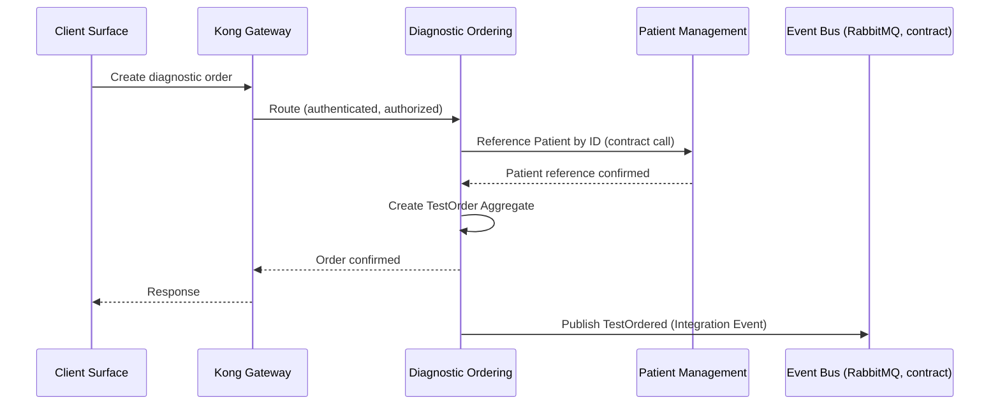

### R3 — Specimen Collection, Accession and Rejection

| Field | Value |
|---|---|
| Scenario ID | R3 |
| Business trigger | A `TestOrder` reaches its collection step |
| Preconditions | `TestOrder` exists (Diagnostic Ordering) |
| Actors | Sample Collector / Laboratory Staff |
| Runtime participants | Sample Collector/Home Visit App or Web Platform → Kong Gateway → Specimen Operations (Application + Domain) |
| Owning Bounded Context/Module | Specimen Operations (Wave 4 §9, row 5; Aggregate `Specimen`, `ChainOfCustodyRecord`, Wave 4 §11) |
| Main success path | Collector records collection → Specimen Operations creates `Specimen`, publishes `SpecimenCollected` → on arrival at the lab, Specimen Operations records `SpecimenAccessioned` (Pivotal Event, Wave 4 §16 — "marks a genuine responsibility handoff") → chain-of-custody entries appended per handoff |
| Alternative paths | None beyond the rejection branch below |
| Failure paths | **Rejection**: Specimen fails intake criteria (e.g., insufficient volume, broken container, per `08-integration-inventory.md`'s general quality-gate concept, not itemized in detail by any source) → Specimen Operations records `SpecimenRejected`, no `SpecimenAccessioned` is produced for that instance, and the rejection is surfaced to the ordering Practitioner via Notification (R8) |
| State changes and owner | `Specimen` created → collected → accessioned (or rejected) — all owned by Specimen Operations |
| Synchronous interactions | Collector app → Specimen Operations, for the immediate collection-confirmation |
| Asynchronous interactions | `SpecimenCollected`, `SpecimenAccessioned`/`SpecimenRejected` published for downstream consumers (Laboratory Execution, Notification) |
| Domain Events | Internal Specimen state transitions |
| Integration Events | `SpecimenCollected`, `SpecimenAccessioned` (Pivotal), `SpecimenRejected` |
| Audit obligations | Chain-of-custody entries themselves function as an evidentiary trail (`ChainOfCustodyRecord`, reused by immudb per Wave 4 §18's Engine mapping) — standard operational audit otherwise |
| Tenant/Data-Scope/Consent obligations | Standard R1 pattern |
| Transaction boundary | Each state transition (collected / accessioned / rejected) is its own transaction within Specimen Operations |
| Consistency model | Strong within `Specimen`'s own Aggregate; eventually consistent for Laboratory Execution's and Notification's reactions |
| Idempotency/replay status | Not flagged as financial/clinical-sensitive by `05-API-STANDARDS.md` — standard event-consumer idempotency (Invariant 14) applies to any consumer of these events |
| Provenance requirements | Chain-of-custody: `{handoffFrom, handoffTo, timestamp, confirmationMethod}` per entry — this exact shape is Discovery's own **design proposal, not a confirmed requirement** (`08-integration-inventory.md`), carried forward with that same hedge, not upgraded to fact here |
| Open/deferred mechanisms | Specific rejection criteria (volume thresholds, etc.) — not stated by any source; not invented here |
| Traceability | ADR-0002, ADR-0012; Wave 4 §11, §16; `08-integration-inventory.md` |
| Owning later Wave | Detailed rejection-criteria/quality-gate design — implementation-level, not a fixed later Wave |

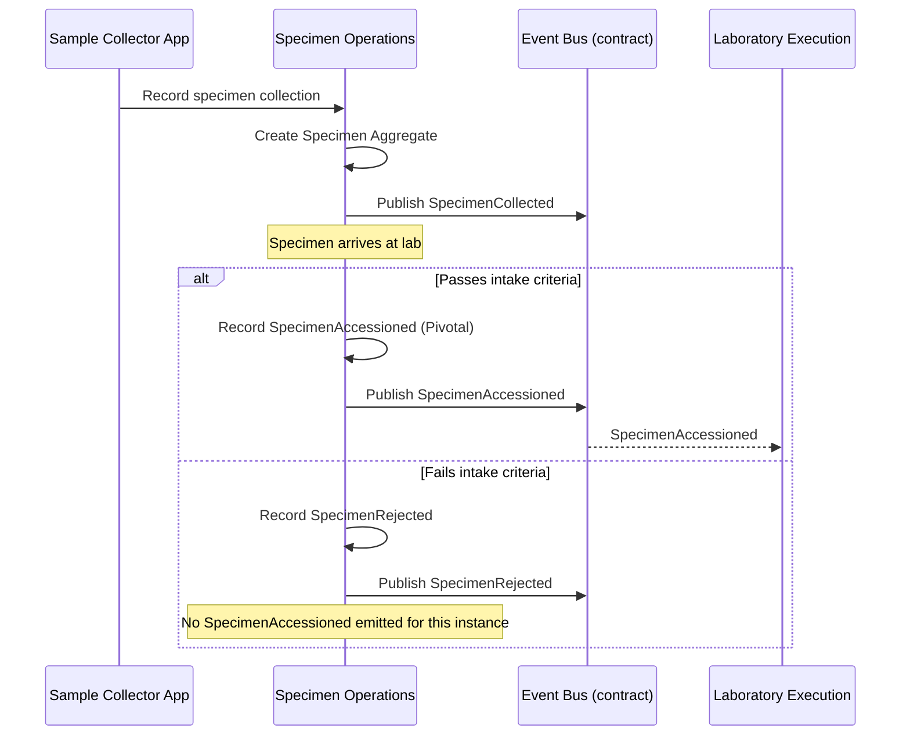

### R4 — Device Result Ingestion

| Field | Value |
|---|---|
| Scenario ID | R4 |
| Business trigger | A lab analyzer/device produces a result for an accessioned Specimen |
| Preconditions | `SpecimenAccessioned` has occurred |
| Actors | None (device-originated) |
| Runtime participants | Healthcare Device/Analyzer (external) → Device Integration Gateway (Protocol/Vendor Adapter, ACL) → Laboratory Execution |
| Owning Bounded Context/Module | Device Integration Gateway ingests; Laboratory Execution owns the resulting processing state (Wave 4 §9, rows 6, 9) |
| Main success path | Device sends raw payload (HL7/ASTM/Vendor API) → Device Integration Gateway's Protocol/Vendor Adapter parses it → Anti-Corruption Layer translates to the platform's normalized ingestion contract, attaching provenance (device ID, adapter, timestamp, raw-payload reference, Invariant 9) → publishes as an Integration Event → Laboratory Execution consumes it, records `TestProcessingStarted`/`TestResultCaptured` |
| Alternative paths | See R5 for malformed/partial payload |
| Failure paths | R5 |
| State changes and owner | Laboratory Execution's processing state (Wave 4 §11 — "processing sub-slice") |
| Synchronous interactions | None — device-to-platform ingestion is asynchronous by construction (ADR-0006) |
| Asynchronous interactions | Device Integration Gateway → Laboratory Execution, via Integration Event |
| Domain Events | `TestProcessingStarted`, `TestResultCaptured` — internal to Laboratory Execution's own recording of these facts (Wave 4 §11). **`TestResultCaptured` additionally functions as the Integration Event published to Result Verification and Reporting** (R6) — ADR-0011's own event-chain name is treated as that Integration Event's name, per a deliberate translation, not a raw Domain Event broadcast (Constitution §12; corrected after Reader Testing Pass 2, §18) |
| Integration Events | Normalized device-result ingestion contract (Wave 4 §15) |
| Audit obligations | Every imported result retains provenance permanently (Invariant 9); standard operational audit |
| Tenant/Data-Scope/Consent obligations | Tenant context derived from the Specimen/Order reference the result maps to, not the device itself |
| Transaction boundary | Within Device Integration Gateway: one transaction per translated message. Within Laboratory Execution: one transaction per processing-state transition. **Not** one distributed transaction spanning both (Invariant on Consistency, §8) |
| Consistency model | Eventually consistent between Device Integration Gateway and Laboratory Execution, connected by the Integration Event |
| Idempotency/replay status | Not flagged financial/clinical-sensitive by `05-API-STANDARDS.md`'s specific list, but device messages are a documented duplicate-delivery risk (`08-integration-inventory.md`'s STRIDE first-pass, Tampering/Spoofing row) — consumer-side idempotent handling (Invariant 14) applies; no dedup mechanism/window is invented here |
| Provenance requirements | Which device, which adapter, when, raw-payload reference — permanently retained (ADR-0006) |
| Open/deferred mechanisms | Specific protocol implementation, parsing algorithm — Wave 9 |
| Traceability | ADR-0006; Constitution §24; Wave 4 §9, §11, §18 (Mirth Connect, E6) |
| Owning later Wave | Wave 9 (protocol implementation detail) |

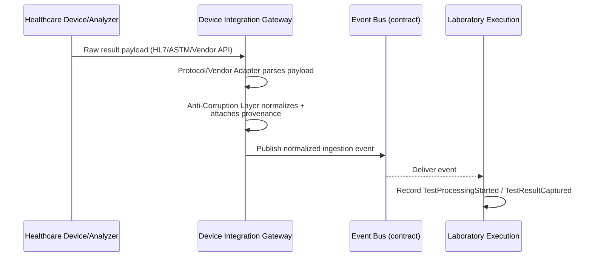

### R5 — Device Failure / Malformed Payload

| Field | Value |
|---|---|
| Scenario ID | R5 |
| Business trigger | A device sends a malformed, partial, or unparseable payload, or the device connection is lost |
| Preconditions | Same as R4 |
| Actors | None (device-originated) |
| Runtime participants | Healthcare Device/Analyzer → Device Integration Gateway |
| Owning Bounded Context/Module | Device Integration Gateway |
| Main success path | Not applicable — this is the failure scenario |
| Alternative paths | — |
| Failure paths | Adapter detects malformed/partial payload or connectivity loss → failure is isolated, logged, and surfaced for review (ADR-0006) → **no partial or invalid state is written to Laboratory Execution or any Core Domain Aggregate** (Invariant 11) → the failed message lands in a review queue (`08-integration-inventory.md`'s own "proposed remediation," not a confirmed mechanism — carried forward with that hedge) |
| State changes and owner | None in the Core Domain; a failure/review record within Device Integration Gateway's own boundary |
| Synchronous interactions | None |
| Asynchronous interactions | None published outward to Laboratory Execution for the failed message; an internal failure signal may be raised for operational visibility (`27-OBSERVABILITY.md`) |
| Domain Events | None (no valid Domain Event exists for an unparseable input) |
| Integration Events | None published for this failed message |
| Audit obligations | Failure is logged; whether every such failure rises to a formal immutable Audit Event (vs. an operational log entry) is not distinguished by any source reviewed — this Wave states both exist as distinct signal types (`27-OBSERVABILITY.md`) without asserting which applies to every failure class |
| Tenant/Data-Scope/Consent obligations | Not applicable — no domain state is touched |
| Transaction boundary | None crosses into the Core Domain |
| Consistency model | Not applicable — failure is contained entirely within Device Integration Gateway |
| Idempotency/replay status | **Deferred** — retry/replay mechanism for a failed device message is not fixed by any source reviewed; this Wave does not invent a retry count, a DLQ product, or a specific review-queue implementation (per the governing instruction's own explicit prohibition) |
| Provenance requirements | The failed message's raw payload and source metadata are retained for review (consistent with Invariant 9's general provenance principle, applied to failures) |
| Open/deferred mechanisms | Retry/replay policy, review-queue product/implementation, malformed-payload classification detail — all Deferred, Wave 9 |
| Traceability | ADR-0006; Constitution §24; Wave 4 §14 (Consequences and Trade-offs) |
| Owning later Wave | Wave 9 |

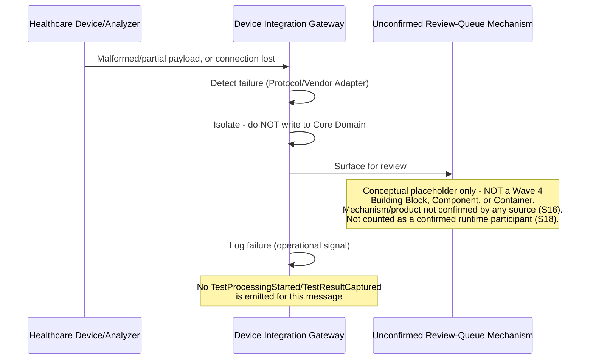

### R6 — Laboratory Execution to Result Verification and Release

**The central scenario.** Split into two diagrams per the governing instruction's own crowding rule.

| Field | Value |
|---|---|
| Scenario ID | R6 |
| Business trigger | A Specimen's analytical processing reaches a capturable result |
| Preconditions | `SpecimenAccessioned`; device or manual result capture has occurred (R4) |
| Actors | Result Verifier (Laboratory Staff role, per Discovery's `07-workflow-state-machines.md`) |
| Runtime participants | Laboratory Execution → Result Verification and Reporting (Application + Domain) → Audit and Compliance (direct, per verify/release transition), then **independent fan-out subscribers off the Event Bus** — Notification Service, Billing, Insurance and Corporate Contracts — not a sequential hand-off chain (corrected after Reader Testing Pass 1 to match the diagram's actual topology, second diagram below) |
| Owning Bounded Context/Module | Laboratory Execution (processing); Result Verification and Reporting (the Core Domain's `TestResult` Aggregate, Wave 4 §11) |
| Main success path | Laboratory Execution completes analytical processing → hands off to Result Verification and Reporting → `TestResult` Aggregate created (`Processing` state, per `07-workflow-state-machines.md`'s state machine) → captured (`Captured` state) → Result Verifier reviews → **Sensitive Operation**: Application/Authorization layer authorizes the Result Verifier Role specifically (not the Aggregate, per Wave 4 §7's corrected placement) → Domain model transitions `TestResult` to `Verified` (`ResultVerified`, Pivotal Event) → mandatory Audit Event → release step transitions to `Released` (`ResultReleased`, Pivotal Event) → mandatory Audit Event → `BillableEventIdentified` triggers → downstream Notification (R8) and Billing/Insurance (R9) react |
| Alternative paths | `Processing → Failed` — a proposed (not fully confirmed) transition per `07-workflow-state-machines.md`, carried forward with that hedge |
| Failure paths | Authorization denial (Result Verifier Role not held) — request rejected before any state transition; see §11 |
| State changes and owner | `TestResult`: `Processing → Captured → Verified → Released` — Result Verification and Reporting is the sole owner and writer throughout |
| Synchronous interactions | Result Verifier's review/verify/release actions (Client Surface → Gateway → Result Verification and Reporting), each an immediate-answer interaction |
| Asynchronous interactions | `ResultVerified`, `ResultReleased`, `BillableEventIdentified` published for downstream consumers |
| Domain Events | `TestProcessingStarted` (internal to Laboratory Execution only); `ResultVerified`, `ResultReleased` (internal to Result Verification and Reporting, before their own Integration Event publication) — per ADR-0011's own event chain |
| Integration Events | `TestResultCaptured` (Laboratory Execution's deliberate translation, crossing into Result Verification and Reporting — corrected after Reader Testing Pass 2 to state this explicitly, not as a raw Domain Event broadcast), `ResultVerified`, `ResultReleased` (both Pivotal, Wave 4 §16), `BillableEventIdentified` |
| Audit obligations | **Mandatory** at both `Verified` and `Released` transitions (Invariant 7) — this is the platform's highest-scrutiny Sensitive Operation pairing (`07-workflow-state-machines.md`: "Verified and Corrected require the Result Verifier Role only") |
| Tenant/Data-Scope/Consent obligations | Standard R1 pattern, plus the Result Verifier Role check specifically |
| Transaction boundary | Each state transition (`Captured`, `Verified`, `Released`) is its own transaction within Result Verification and Reporting's `TestResult` Aggregate — never a single transaction spanning Laboratory Execution and Result Verification and Reporting together |
| Consistency model | Strong within `TestResult`'s own Aggregate per transition; eventually consistent for every downstream reaction (Notification, Billing, Insurance) |
| Idempotency/replay status | Accepted: `ResultVerified`/`ResultReleased` must have an idempotent effect, since they are Sensitive Operations subject to retry/event-replay (Constitution §48). Current API Strategy recommendation (not yet ratified by API Governance): an `Idempotency-Key` header, where a repeated verify/release call with the same key returns the original result rather than repeating the effect (`05-API-STANDARDS.md`) |
| Provenance requirements | `VerificationRecord` (who verified, when — Wave 4 §11) is part of the `TestResult` Aggregate itself, not a separate mechanism |
| Open/deferred mechanisms | None beyond the general Wave 9/11 deferrals already established |
| Traceability | ADR-0002, ADR-0004, ADR-0011; Constitution §21, §23; Wave 4 §9, §11, §16 |
| Owning later Wave | — |

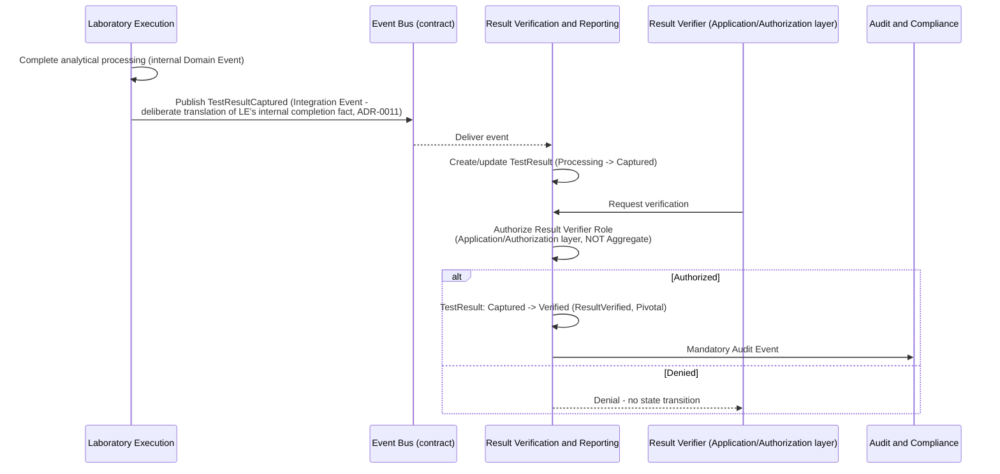

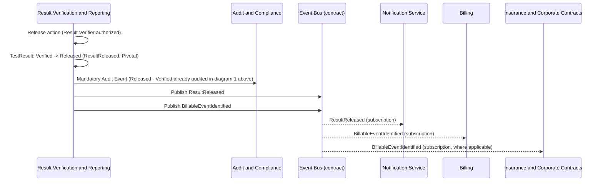

### R7 — Result Correction After Release

| Field | Value |
|---|---|
| Scenario ID | R7 |
| Business trigger | A released `TestResult` is found to need correction |
| Preconditions | `TestResult` is in `Released` state |
| Actors | Result Verifier |
| Runtime participants | Result Verification and Reporting |
| Owning Bounded Context/Module | Result Verification and Reporting |
| Main success path | `07-workflow-state-machines.md` names `Released → Corrected` as a state, requiring the Result Verifier Role, but **does not fully specify** the correction workflow's justification/notification detail beyond that role requirement — this Wave provides only a **runtime skeleton**, explicitly labeled `Deferred` for anything beyond what that source states |
| Alternative paths | Not established by any source |
| Failure paths | Authorization denial, same pattern as R6 |
| State changes and owner | `TestResult`: `Released → Corrected` — Result Verification and Reporting |
| Synchronous interactions | Correction request/authorization |
| Asynchronous interactions | A correction event (e.g., `ResultCorrected`, per Constitution §12's own worked example: "corrections are new events... referencing the original") would be published, consistent with the platform-wide immutable-events rule — **this event's exact name/shape beyond Constitution §12's own example is not separately confirmed for this specific Aggregate by any source this Wave reviewed, and is not invented further here** |
| Domain Events | A correction is a new event, never a mutation of `ResultVerified`/`ResultReleased` (Constitution §12 — "Events Are Immutable Facts... corrections are new events... referencing the original") |
| Integration Events | Downstream correction notification — Deferred (mechanism not confirmed) |
| Audit obligations | The original `Verified`/`Released` Audit Events remain immutable and unedited (Constitution §23); the correction itself is a **new**, separately audited Sensitive Operation |
| Tenant/Data-Scope/Consent obligations | Standard R6 pattern |
| Transaction boundary | Within Result Verification and Reporting, same discipline as R6 |
| Consistency model | Same as R6 |
| Idempotency/replay status | Not separately confirmed beyond R6's general coverage: Accepted idempotent-effect requirement (Constitution §48) for `ResultVerified`/`ResultReleased`-class operations, with the current API Strategy's `Idempotency-Key` header as its Recommendation-level mechanism |
| Provenance requirements | Justification for the correction — not specified by any source; Deferred |
| Open/deferred mechanisms | Correction-workflow detail (justification capture, downstream re-notification mechanics) — **Deferred**, this Wave provides only the skeleton above |
| Traceability | `07-workflow-state-machines.md`; Constitution §12 |
| Owning later Wave | Implementation-level design, once real correction-workflow requirements exist — not tied to a specific numbered Wave |

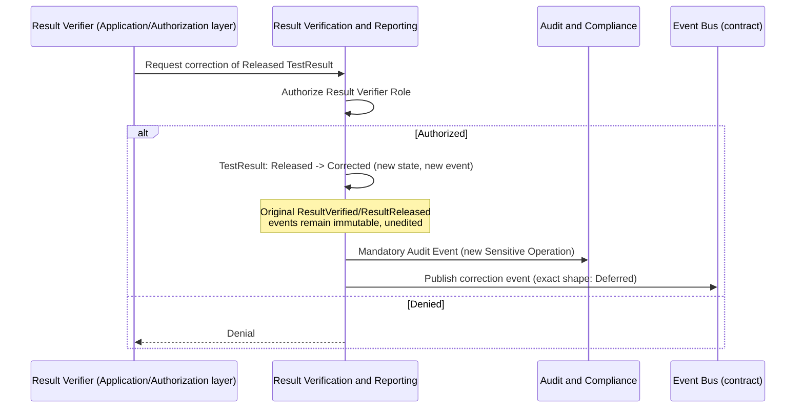

### R8 — Notification Dispatch

| Field | Value |
|---|---|
| Scenario ID | R8 |
| Business trigger | A subscribed event occurs (e.g., `ResultReleased`, `SpecimenRejected`) |
| Preconditions | Notification Service's subscription to the relevant event type exists (Wave 4 §11) |
| Actors | None directly (system-triggered); the Patient/Practitioner/Staff recipient |
| Runtime participants | Owning Module (publisher) → Event Bus → Notification Service → external Messaging Carrier |
| Owning Bounded Context/Module | Notification Service (Wave 4 §9, row 21) |
| Main success path | Owning Module publishes its Integration Event → Notification Service consumes it → evaluates Consent and Data-Scope for the intended recipient (Constitution §21) → selects a channel from the Accepted channel set (SMS, Push, Email, In-Portal, WhatsApp — Wave 3 §22, Resolved, not reopened here) → dispatches via the external carrier's Anti-Corruption Layer → records delivery status |
| Alternative paths | Recipient has no valid contact channel for the selected type — a different Accepted channel is attempted, per the Accepted channel *set* (not a specific fallback order, which is not confirmed by any source) |
| Failure paths | Delivery failure — see §11 |
| State changes and owner | Notification delivery-status record — Notification Service |
| Synchronous interactions | None in the main path |
| Asynchronous interactions | Owning Module → Notification Service (event subscription); Notification Service → external carrier |
| Domain Events | Internal to Notification Service (delivery-status transitions) |
| Integration Events | Whatever event Notification Service subscribed to (e.g., `ResultReleased`) |
| Audit obligations | Standard operational audit; a Notification carrying sensitive clinical content is itself subject to the Consent/Data-Scope check above, not a separate Sensitive-Operation gate beyond that |
| Tenant/Data-Scope/Consent obligations | Consent and Data-Scope evaluated before dispatch (Constitution §21) |
| Transaction boundary | Within Notification Service, per delivery attempt |
| Consistency model | Eventually consistent — Notification Service reacts to an already-committed fact in the owning Module |
| Idempotency/replay status | Standard event-consumer idempotency (Invariant 14); no specific retry/dedup number invented |
| Provenance requirements | Not applicable |
| Open/deferred mechanisms | Specific carrier selection logic, retry policy — not invented here |
| Traceability | Wave 3 §22 (channel set Resolved); Wave 4 §9, §11, §18 (Novu, E8) |
| Owning later Wave | — |

**Corrected placement, carried from Wave 4's own erratum (§26 there)**: Notification Service **may be co-deployed** within the same Central Backend runnable unit as the Modular Monolith — this diagram's arrows are logical message exchanges, not a claim that a network hop necessarily occurs.

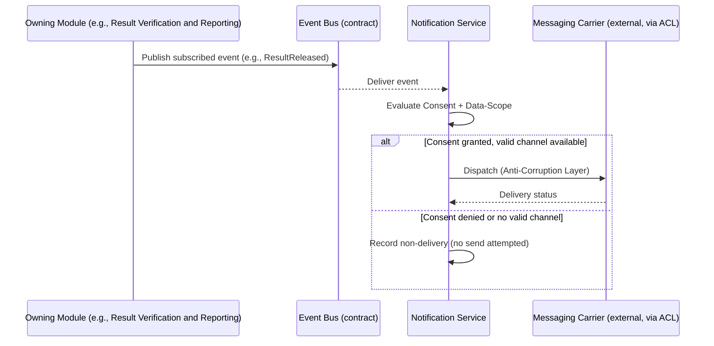

### R9 — Billing / Insurance Reaction

| Field | Value |
|---|---|
| Scenario ID | R9 |
| Business trigger | `BillableEventIdentified` (from R6) |
| Preconditions | A `TestResult` has reached `Released` |
| Actors | None directly (system-triggered) |
| Runtime participants | Result Verification and Reporting (publisher) → Billing, and/or Insurance and Corporate Contracts (subscribers) → **External Payer System** (where Insurance and Corporate Contracts submits a claim) — corrected after Reader Testing Pass 1 to name the external system the diagram already shows |
| Owning Bounded Context/Module | Billing (Wave 4 §9, row 14); Insurance and Corporate Contracts (row 16) |
| Main success path | Billing consumes `BillableEventIdentified`, creates an `Invoice`/`LineItem` (Wave 4 §12) referencing the billable event by ID. Where the Patient/Organization has payer coverage, Insurance and Corporate Contracts separately consumes the same event, submits a claim to the external Payer (Anti-Corruption Layer + Conformist, Wave 4 §11's Discovery-sourced pattern), and later receives `ClaimAdjudicated` (the one Pivotal Event originating externally, Wave 4 §16) |
| Alternative paths | No payer coverage — Billing proceeds without an Insurance and Corporate Contracts interaction |
| Failure paths | External payer unavailable/adjudication failure — see §11 |
| State changes and owner | `Invoice` — Billing; `Claim` — Insurance and Corporate Contracts |
| Synchronous interactions | None in the main event-reaction path; the external Payer's claim submission/response exchange is the one place a synchronous or async-follow-up call to an external system occurs, per whichever pattern `21-INTEGRATIONS.md`'s Partner-integration shape actually uses for that Payer relationship (not fixed further here) |
| Asynchronous interactions | `BillableEventIdentified` (inbound to both); `ClaimAdjudicated` (inbound to Insurance and Corporate Contracts from the external Payer) |
| Domain Events | Internal to each owning context |
| Integration Events | `BillableEventIdentified`, `ClaimAdjudicated` |
| Audit obligations | Standard operational audit; no source marks Billing/Claims creation itself as a Sensitive Operation in the Constitution §21 sense, distinct from Result Verification's own already-audited trigger |
| Tenant/Data-Scope/Consent obligations | Standard R1 pattern |
| Transaction boundary | Within Billing, per `Invoice`; within Insurance and Corporate Contracts, per `Claim` — never a single transaction spanning both contexts or the external Payer |
| Consistency model | Eventually consistent throughout — no distributed transaction with the external Payer |
| Idempotency/replay status | Accepted: Billing charges and Payments must have an idempotent effect, since they are financial writes subject to retry/event-replay (Constitution §48). Current API Strategy recommendation (not yet ratified): an `Idempotency-Key` header, where a repeated charge/payment call with the same key returns the original result (`05-API-STANDARDS.md`) |
| Provenance requirements | Not applicable beyond standard audit |
| Open/deferred mechanisms | The exact external-Payer protocol/response-timing pattern — this Wave does not invent a financial workflow beyond what `21-INTEGRATIONS.md` and Wave 4 §11/§20 already establish |
| Traceability | Wave 4 §9, §11, §16, §20; `21-INTEGRATIONS.md`; Wave 2 §7 (Insurance/Payer external system) |
| Owning later Wave | — |

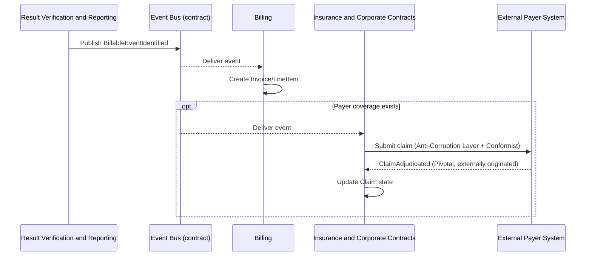

### R10 — Governed AI Assistance

| Field | Value |
|---|---|
| Scenario ID | R10 |
| Business trigger | A Module requests AI-assisted output (e.g., summarization, pattern detection) |
| Preconditions | The requesting Module has a governed use case for AI Gateway (ADR-0007) |
| Actors | The staff/practitioner user whose action triggers the AI request, where applicable |
| Runtime participants | Requesting Module → AI Operations Gateway → external AI Model Provider |
| Owning Bounded Context/Module | AI Operations (Wave 4 §9, row 24; AI Gateway, §13) |
| Main success path | Requesting Module calls AI Operations Gateway's governed contract → Gateway applies its data-minimization/policy gate (Constitution §28 — "an approved policy and controls exist first") → calls the external AI Model Provider via Portkey Gateway (E9) → receives output → logs the action (prompt, model/version, output, cost, provider — ADR-0007) → returns output to the requesting Module labeled as a **suggestion**, never automatically authoritative |
| Alternative paths | Non-sensitive, non-clinical use case — still logged, same governance path, per ADR-0007's own "no exception for a lighter-governance path without a superseding ADR" |
| Failure paths | External AI provider unavailable — see §11 |
| State changes and owner | AI action audit-trail entry — AI Operations |
| Synchronous interactions | Requesting Module ↔ AI Operations Gateway ↔ external provider, for the immediate-answer AI request |
| Asynchronous interactions | None in the main path |
| Domain Events | Internal to AI Operations (its own audit-trail record) |
| Integration Events | None required for a single request/response AI call; if the AI output feeds a downstream workflow, that downstream reaction uses that workflow's own event, not a new AI-specific event type this Wave invents |
| Audit obligations | **Mandatory** — every AI action is logged and auditable (ADR-0007) |
| Tenant/Data-Scope/Consent obligations | Sending sensitive information to an external AI provider requires an approved policy and controls first (ADR-0007) — evaluated at AI Operations Gateway's own Application/Authorization-equivalent layer, never bypassed |
| Transaction boundary | Within AI Operations Gateway, per request |
| Consistency model | Not applicable to the AI call itself; if the output subsequently informs a domain state change, that change follows its own owning Module's transaction/consistency rules, with mandatory Human-in-the-Loop first |
| Idempotency/replay status | Not addressed by any source specific to AI calls; standard request handling |
| Provenance requirements | Prompt, model/version, output, cost, evaluation, provider — all logged (ADR-0007) |
| Open/deferred mechanisms | Prompt template, model-routing algorithm, evaluation metric, specific provider/model selection — Wave 9 |
| Traceability | ADR-0007; Constitution §28; Wave 4 §9, §11, §13, §18 (Portkey Gateway, E9) |
| Owning later Wave | Wave 9 |

**Corrected placement, carried from Wave 4's own erratum (§26 there)**: AI Operations Gateway **may be co-deployed** within the same Central Backend runnable unit — this diagram does not assume a network hop is mandatory.

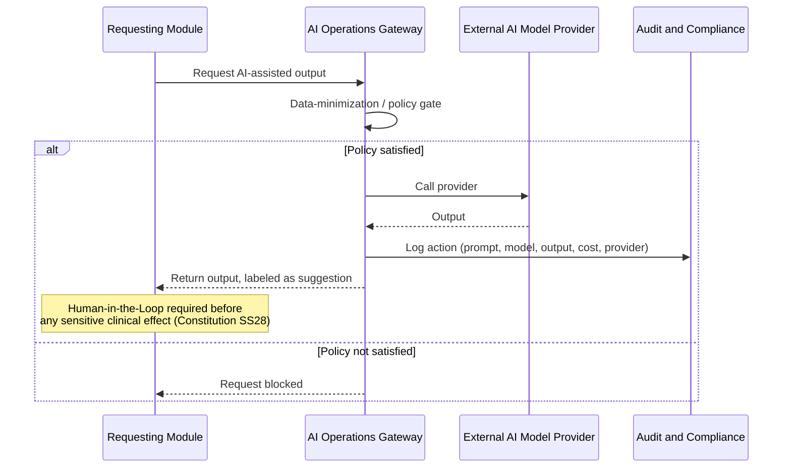

### R11 — FHIR / Partner Interoperability

**Restructured after a second Independent Architecture Review (§19)**: the confirmed synchronous scenario below is now fully separated from the unassigned webhook-follow-up responsibility, which appears only as a distinct "Provisional Runtime Skeleton" immediately after, with an explicitly-labeled, non-counted placeholder participant.

| Field | Value |
|---|---|
| Scenario ID | R11 |
| Name | FHIR / Partner Interoperability (Synchronous Path — Confirmed) |
| Business trigger | A Partner (e.g., referring clinic) or FHIR-shaped external exchange occurs |
| Preconditions | Partner integration is certified per `21-INTEGRATIONS.md`'s checklist; FHIR R4 is the pinned version (D-43, R-06 Closed) |
| Actors | External Partner system |
| Runtime participants | External Partner → Kong Gateway (Partner API classification) → owning Module (Patient Management or Result Verification and Reporting, per Wave 4 §7's FHIR usage) |
| Owning Bounded Context/Module | Patient Management (FHIR Patient resource exchange) or Result Verification and Reporting (FHIR DiagnosticReport exchange) — Wave 4 §15 |
| Main success path | Partner authenticates via an authenticated, contract-scoped machine identity (**Accepted** requirement) — current API Strategy recommendation (not yet ratified by API Governance): OAuth2 Client Credentials, scoped to the Partner contract (`08-AUTHENTICATION.md`) → Kong Gateway applies coarse AuthZ (**Accepted**, Wave 4 §7 — the Gateway's responsibility for protecting the entry surface), with Partner-specific scope/quota structure per the current API Strategy recommendation (`13-RATE-LIMITING.md`, not yet ratified, no numeric quota fixed) → owning Module's Application/Authorization layer re-checks Data-Scope for the Partner's declared scope (`14-MULTI-TENANCY.md`, `21-INTEGRATIONS.md`) → FHIR resource translated to/from the platform's internal model via that Module's own contract → response returned synchronously |
| Alternative paths | None beyond the denial branch below. Async delivery via Webhook, where a Partner subscribes to notification instead of polling, is a distinct, not-yet-owned responsibility — see the Provisional Runtime Skeleton immediately below, not part of this confirmed scenario |
| Failure paths | Partner authentication/authorization failure; certification-scope violation — see §11 |
| State changes and owner | None from a read exchange; a write-capable Partner interaction (e.g., referring-physician order submission) follows R2's own state-change rules under the owning Module |
| Synchronous interactions | Partner ↔ Kong Gateway ↔ owning Module, for an immediate FHIR resource fetch |
| Asynchronous interactions | None in this confirmed scenario — see the Provisional Runtime Skeleton below for the async webhook-follow-up case |
| Domain Events | None crossing the boundary directly — FHIR exchange is a contract-level translation, not a raw event |
| Integration Events | None in this confirmed synchronous scenario |
| Audit obligations | Standard operational audit; a Partner-scope violation attempt is itself audited (`14-MULTI-TENANCY.md`'s cross-tenant protection, extended to Partner scope) |
| Tenant/Data-Scope/Consent obligations | Partner scope declared at certification time, re-checked at every call — never trusted from the Partner's own claim alone |
| Transaction boundary | Within the owning Module, per request |
| Consistency model | Strong for a synchronous read |
| Idempotency/replay status | Not applicable to this synchronous read scenario |
| Provenance requirements | Not applicable beyond standard audit |
| Open/deferred mechanisms | Specific FHIR Resource field mappings, endpoint paths — not designed here (Wave 4 §15's own guardrail, restated); exact Client Credentials grant mechanics and Partner quota numerics — Recommendation-level, not Accepted (`08-AUTHENTICATION.md`, `13-RATE-LIMITING.md`) |
| Traceability | D-43 (FHIR R4 pinned); Wave 4 §7, §15, §18; `08-AUTHENTICATION.md`, `13-RATE-LIMITING.md`, `21-INTEGRATIONS.md` |
| Owning later Wave | Wave 10 (endpoint/schema detail already exists in `docs/api-platform/`, cross-referenced) |

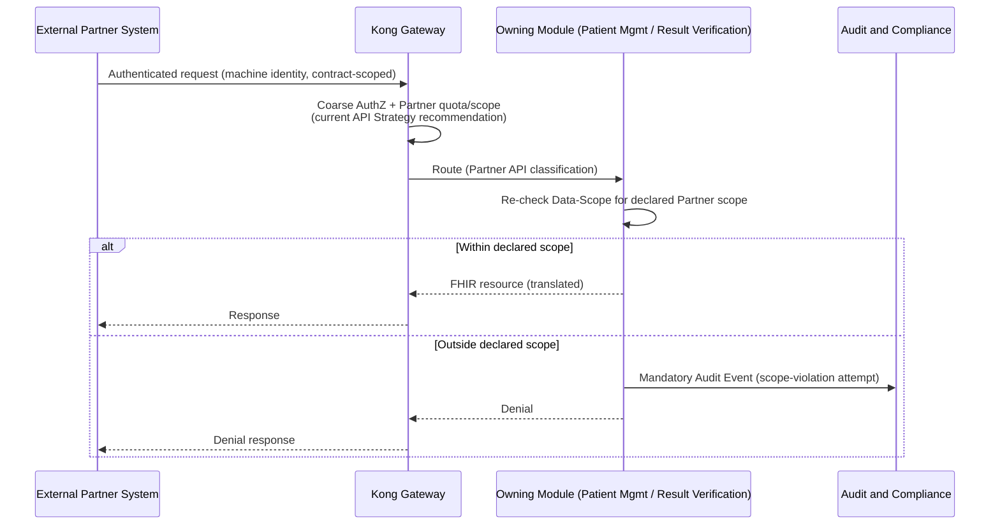

**Provisional Runtime Skeleton — Ownership Deferred (Webhook Follow-Up)**

This is **not** part of the confirmed R11 scenario above, and its one participant is **not** counted among this Wave's confirmed runtime participants (§18 Runtime Participant Audit). It exists to acknowledge, honestly, that a Partner can subscribe to async notification (e.g., referring-clinic result delivery) — without asserting who inside the platform owns delivering it. The skeleton starts at the already-Published Integration Event and ends at the External Partner's endpoint; it draws no existing block (not Public API Gateway, not Notification Service, not Background Workers) as the owner, since none is decided.

**Classification**: Architecture Design Gap. Non-blocking for documenting this Wave's synchronous Partner runtime (above). Blocking before implementation of any outbound-webhook path. Owner: Architecture Review Board. If ownership is assigned to an existing block without materially changing that block's responsibilities: a SAD/Architecture Review decision. If it instead creates a 9th Independent Component or changes Constitution §11: an ADR/Constitution-governed process is required (§3, §16, §19).

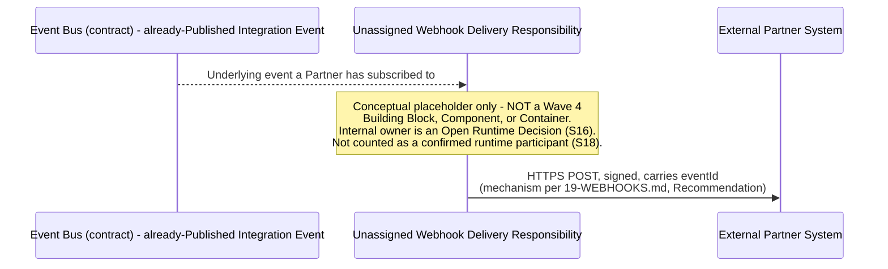

### R12 — Long-Running / Background Work

| Field | Value |
|---|---|
| Scenario ID | R12 |
| Business trigger | Any long-running or deferred task (e.g., bulk import, report generation) |
| Preconditions | A Module identifies work that should not block a synchronous request |
| Actors | None directly |
| Runtime participants | Requesting Module → Background Workers (a **confirmed named independent-capable component**, Wave 4 §13; workload placement and deployment separateness remain open, Wave 6) or a module-local equivalent, per workload |
| Owning Bounded Context/Module | Whichever Module owns the underlying business data; Background Workers has **no owning Bounded Context in the 28-context map** (Wave 4 §13) |
| Main success path | Module submits a job with trackable status (queued/running/succeeded/failed, Constitution §48) → job executes → status updates → owning Module is notified of completion via its own contract |
| Alternative paths | A module-local equivalent handles the work without a separate Background Workers component, per Constitution §48's own explicit allowance — this Wave does not assert which of the two applies, since no source decides it |
| Failure paths | Job failure — status recorded as `failed`; ownership of cancellation/retry is not specified by any source reviewed |
| State changes and owner | Job status record — owned by whichever component (Background Workers or module-local equivalent) actually executes it; this Wave does not assert a fixed owner beyond "whichever the eventual design uses" |
| Synchronous interactions | Job submission (immediate acknowledgment only, not the work itself) |
| Asynchronous interactions | Job execution and completion notification |
| Domain Events | None specific to job execution beyond the owning Module's own business events once the job completes |
| Integration Events | Completion notification to the owning Module, where cross-boundary |
| Audit obligations | Standard operational visibility (queued/running/succeeded/failed, Constitution §48) |
| Tenant/Data-Scope/Consent obligations | Standard R1 pattern, scoped to the owning Module's own data |
| Transaction boundary | Within the owning Module, per unit of work the job performs |
| Consistency model | Eventually consistent — the whole point of deferring work is that it does not hold up the triggering request |
| Idempotency/replay status | Not specified by any source; a re-run job should not be assumed idempotent without the owning Module's own design |
| Provenance requirements | Not applicable beyond standard job-status tracking |
| Open/deferred mechanisms | Background Workers' existence as a named independent-capable component is Confirmed (Wave 4 §13); **explicitly Deferred**: whether its runtime is co-deployed, module-local, or operationally separate for any given workload, queue name/product, worker count — none invented here |
| Traceability | Constitution §48; Wave 4 §13 |
| Owning later Wave | Not tied to a specific Wave — evidence-triggered (Wave 3 §18's own discipline) |

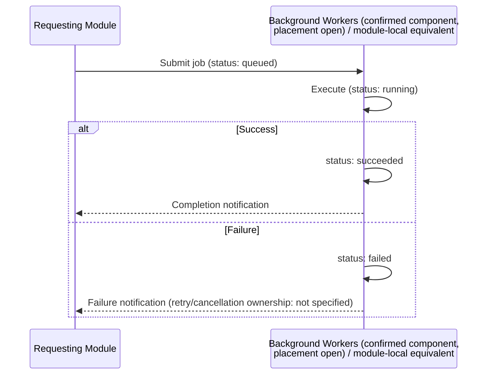

## 8. Runtime Interaction Catalog

| Producer/caller | Consumer/callee | Trigger | Sync/async | Contract category | State owner | Failure owner | Audit required? | Tenant-scoped? | Status | Source |
|---|---|---|---|---|---|---|---|---|---|---|
| Client Surface | Kong Gateway | User action | Sync | External API | — | Gateway | If sensitive | Yes | Confirmed | Wave 4 §7 |
| Kong Gateway | Owning Module | Routed request | Sync | Internal API | Owning Module | Owning Module | If sensitive | Yes | Confirmed | Wave 4 §7 |
| Diagnostic Ordering | Event Bus | Order created | Async | Integration Event | Diagnostic Ordering | Diagnostic Ordering | No | Yes | Confirmed | Wave 4 §16 |
| Specimen Operations | Event Bus | Collection/accession/rejection | Async | Integration Event | Specimen Operations | Specimen Operations | No | Yes | Confirmed | Wave 4 §16 |
| Device | Device Integration Gateway | Result/failure | Async | Integration (device) | Device Integration Gateway | Device Integration Gateway | Provenance always | Derived from Specimen/Order | Confirmed | ADR-0006 |
| Device Integration Gateway | Laboratory Execution | Normalized result | Async | Integration Event | Laboratory Execution | Laboratory Execution | No | Yes | Confirmed | Wave 4 §16 |
| Laboratory Execution | Result Verification and Reporting | Result captured | Async | Integration Event | Result Verification and Reporting | Result Verification and Reporting | No | Yes | Confirmed | Wave 4 §16 |
| Result Verifier | Result Verification and Reporting | Verify/release action | Sync | Internal API | Result Verification and Reporting | Result Verification and Reporting | **Yes, mandatory** | Yes | Confirmed | ADR-0011; Constitution §21 |
| Result Verification and Reporting | Event Bus | Verified/Released | Async | Integration Event (Pivotal) | Result Verification and Reporting | Result Verification and Reporting | Yes | Yes | Confirmed | Wave 4 §16 |
| Event Bus | Notification Service | Subscribed event | Async | Integration Event | Notification Service | Notification Service | No | Yes | Confirmed | Wave 4 §11 |
| Event Bus | Billing | `BillableEventIdentified` | Async | Integration Event | Billing | Billing | No | Yes | Confirmed | Wave 4 §11 |
| Event Bus | Insurance and Corporate Contracts | `BillableEventIdentified` | Async | Integration Event | Insurance and Corporate Contracts | Insurance and Corporate Contracts | No | Yes | Confirmed | Wave 4 §11 |
| Insurance and Corporate Contracts | External Payer | Claim submission | Async (Conformist) | Integration (external) | Insurance and Corporate Contracts | Insurance and Corporate Contracts | No | Yes | Confirmed | Wave 4 §11 |
| External Payer | Insurance and Corporate Contracts | `ClaimAdjudicated` | Async | Integration (external, Pivotal) | Insurance and Corporate Contracts | Insurance and Corporate Contracts | No | Yes | Confirmed | Wave 4 §16 |
| Requesting Module | AI Operations Gateway | AI assistance need | Sync | Internal contract | AI Operations | AI Operations | **Yes, mandatory** | Yes | Confirmed | ADR-0007 |
| AI Operations Gateway | External AI Model Provider | Governed call | Sync | Integration (external) | AI Operations | AI Operations | Yes | N/A (provider-side) | Confirmed | ADR-0007 |
| External Partner | Kong Gateway | Partner API call | Sync | Partner API | Owning Module | Kong Gateway / Owning Module | If sensitive | Yes | Confirmed | Wave 4 §7 |
| Owning Module | Unassigned Webhook Delivery Responsibility (placeholder, not a Wave 4 block) | Subscribed event | Async | Webhook (external) | Owning Module | Unassigned (Open Runtime Decision) | On DLQ exhaustion | Yes | **Open** — non-deployable, non-counted placeholder only, not a confirmed 9th Independent Component (§3, §7 R11) | `19-WEBHOOKS.md` |
| Requesting Module | Background Workers / module-local equivalent | Long-running task | Async | Not fixed | Not fixed | Not specified | Standard | Yes | **Deferred** | Wave 4 §13 |
| Any block | Analytics | Read-model need | Async (events/exports) | Approved Read Model / export | Analytics (derived only) | Analytics | No | Yes | Confirmed | Wave 4 §17 |

**A→B/B→A check**: no producer/consumer pair above appears in both directions for the *same* interaction type. **Billing → Diagnostic Ordering** (Customer/Supplier — Billing is the Customer/downstream side, Diagnostic Ordering is the Supplier/upstream side and does not itself depend on Billing, Wave 4 §11/§12; corrected here after Reader Testing Pass 2, which found this Wave had first stated the direction backwards) is a **static dependency direction**, not a runtime interaction shown here — R9 above correctly shows the runtime flow as Result Verification and Reporting → Billing (via `BillableEventIdentified`), which does not conflict with the static Customer/Supplier direction; this Wave treats a request/response or event-publish/consume runtime pair as distinct from a static code dependency, per the governing instruction's own explicit distinction. **The catalog's one genuinely bidirectional pair, addressed explicitly rather than left for the reader to notice (corrected after Reader Testing Pass 1)**: `Insurance and Corporate Contracts → External Payer` (claim submission) and `External Payer → Insurance and Corporate Contracts` (`ClaimAdjudicated`, R9). This is not a forbidden static A→B/B→A cycle — it is a single **runtime request/response exchange with an external system**, the same pattern as any client calling a server and receiving a reply; the two rows represent one interaction's outbound and inbound legs, not two independent, contradictory static dependencies.

## 9. Transaction and Consistency Boundaries

**Universal rule, stated once**: every scenario in §7 commits within a single owning block's own transaction; nothing here spans two blocks in one transaction. What becomes eventually consistent is always the *downstream reaction* (an event consumer), never the *triggering write* itself.

| Mechanism | Status | Evidence |
|---|---|---|
| Distributed transaction / Two-phase commit | **Not adopted** | No source states this; not asserted anywhere in §7 |
| Saga | **Not adopted** | Not named by any Accepted source; R6/R9's multi-context flow is expressed as independent, eventually-consistent event reactions, not an orchestrated Saga |
| Transactional Outbox / Inbox | **Not adopted, not designed** | Not named by any Accepted source; how an owning Module guarantees its own DB write and its event publish are atomic is implementation-level, Deferred |
| Exactly-once delivery | **Not claimed anywhere** | `19-WEBHOOKS.md` explicitly states At-Least-Once, "not exactly-once... this Board does not claim exactly-once semantics" |
| Event Sourcing | **Not adopted** (Assess-tier, Wave 3 §9) | Restated, not re-decided, here |
| CQRS | **Not adopted** (Assess-tier, Wave 3 §9) | Restated, not re-decided, here |

**What happens on failure after commit, before downstream reaction** (a required question per the governing instruction), **corrected and elevated after a second Independent Architecture Review (§19)**:

**Required Semantic Outcome (Accepted, derived from Constitution §12's event-immutability rule and §34's at-least-once/eventual-consistency rule)**: if an owning block commits its own business-state change, the resulting Integration Event must **eventually become publishable** — there is no silent, permanent loss of the already-happened fact between business commit and event publication. Duplicate publication of the same fact is acceptable under the platform's At-Least-Once assumptions (§10), provided the consuming side's idempotent handling (Constitution §48) absorbs it.

**Decision Status: Mandatory Pre-Implementation Architecture Decision.** The specific mechanism guaranteeing this outcome (Transactional Outbox, Change Data Capture, broker-transaction integration, a recoverable publication log, or another approach) is **not fixed by any Accepted source**, and this Wave does not select one — no mechanism is defaulted to Outbox or any other pattern. This is recorded as an Open Runtime Decision (§16), owned by the Architecture Review Board, requiring an ADR-suitability assessment because the mechanism is platform-wide and affects reliability and data-consistency guarantees across every cross-module event reaction; **no ADR is created by this Wave**. Implementation of any workflow that depends on cross-module event reaction cannot proceed on the affected event paths until this mechanism is ratified — this does **not** block Wave 6 (Deployment View) or this Wave's own documentation, both of which record the gap rather than resolve it.

**Owning SAD Follow-Up**: Wave 10 (Architecture Decisions & Traceability) registers this gap and determines whether an ADR is required; Wave 11 (Quality Requirements & Quality Scenarios) tests the Required Semantic Outcome above; Wave 12 (Risk Treatment) carries the risk of event loss/duplicate handling until the mechanism is ratified.

## 10. Idempotency, Duplicate Delivery and Replay

**Corrected after a second Independent Architecture Review (§19) to separate what is Constitutionally Accepted from what is only the current API Strategy's Recommendation** — the prior draft cited `05-API-STANDARDS.md`'s `Idempotency-Key` header as if it were itself an Accepted architecture fact; it is a Recommendation, not yet ratified by API Governance (`05-API-STANDARDS.md`'s own framing: every standard there is labeled either **Fact** — already Accepted elsewhere — or **Recommendation** — "this Board's proposed default, not yet an independent ADR, pending API Governance ratification"; the Idempotency section is Recommendation-labeled).

### Accepted Semantic Requirement (Constitution §48 "Idempotency Policy" and "Retry Policy"; Constitution §34 "Reliability and Resilience Rules")

| Requirement | Status | Evidence |
|---|---|---|
| Idempotent final effect | **Accepted** — every operation that may be retried, or that consumes an at-least-once-delivered Integration Event, must not produce a duplicate business effect | Constitution §48: "Every operation that may be retried or that consumes an at-least-once-delivered Integration Event (Section 34) is idempotent" |
| Carried or derived deduplication identity | **Accepted** | Constitution §48: "State-changing operations exposed to retry or event replay carry or derive a deduplication key" |
| Duplicate-safe consumer behavior | **Accepted** — every Integration Event consumer tolerates redelivery/ordering variance unless a stronger guarantee is explicitly documented for that event | Constitution §34 |
| No duplicate clinical/financial effect | **Accepted outcome** — this is the binding architectural requirement; *how* it is technically achieved for any given operation is not fixed by the Constitution itself | Constitution §48, §34 |

### API Strategy Recommendation (not yet ratified by API Governance — may be cited as the current recommended mechanism, never as an Accepted architecture fact)

| Item | Status | Evidence |
|---|---|---|
| `Idempotency-Key` HTTP header, for a named list: Billing charges, Payments, `ResultVerified`, `ResultReleased`, Break-Glass Access | **Recommendation** | `05-API-STANDARDS.md`, "Idempotency" section, explicitly labeled Recommendation |
| A repeated call with the same key returns the original result rather than repeating the effect | **Recommendation** (describes the recommended header's behavior, not a separately Accepted mechanism) | `05-API-STANDARDS.md` |
| Webhook deliveries carrying the underlying event's `eventId` so a Partner can recognize a duplicate delivery | **Recommendation** | `18-ASYNCAPI-EVENTS.md`, `19-WEBHOOKS.md` |

### Deferred Implementation Detail

| Item | Status | Evidence |
|---|---|---|
| Storage location, key scope, retention duration, response-replay implementation, deduplication table/cache/store, conflict handling, exact endpoint applicability | **Deferred** | Not fixed by any source reviewed |
| Device message deduplication window/mechanism | **Open** — device messages are a documented duplicate-delivery risk (`08-integration-inventory.md`'s STRIDE first-pass) but no dedup mechanism/window is specified | Not confirmed by any source; recorded in §11, §16 |
| Replay/reprocessing | Not specified for any scenario | Not confirmed by any source |
| Exactly-once claim | **Explicitly disclaimed** | `19-WEBHOOKS.md`: "this architecture provides at-least-once delivery, not exactly-once" |

**No idempotency-key header name, key format, retention period, retry count, or deduplication window is invented anywhere in this Wave** — where `05-API-STANDARDS.md` and `19-WEBHOOKS.md` state a mechanism exists without fixing its parameters, this Wave repeats that same hedge rather than filling in a number, per the governing instruction's explicit prohibition. Every scenario in §7 citing idempotency now cites the **Accepted semantic requirement** first and the **API Strategy Recommendation** second, never conflating the two (§7 R1, R6, R9, R11).

## 11. Error and Failure Matrix

| Failure | Detecting block | Owning block | State impact | User-visible effect (general) | Audit/log requirement | Retry/compensation status | Data-integrity guarantee | Deferred detail |
|---|---|---|---|---|---|---|---|---|
| Authentication failure | Kong Gateway | Identity and Access | None | Denial response | Operational log | Not applicable | No state touched | Wave 8 |
| Authorization denial | Owning Module's Application layer | Owning Module | None | Denial response | Operational log; Audit Event if the attempted action was itself Sensitive | Not applicable | No state touched | Wave 8 |
| Tenant mismatch | Application boundary and persistence boundary (both check, Wave 4 §17) | Owning Module | None | Denial response that does not reveal whether the out-of-scope resource exists (**Accepted** non-disclosure requirement, Constitution §19/§21); current API Strategy recommendation uses a `404`-class response specifically (`14-MULTI-TENANCY.md`, `05-API-STANDARDS.md`) — not independently ratified | Mandatory Audit Event (cross-tenant attempt) | Not applicable | Cross-tenant isolation preserved by construction | Wave 8 / API Governance (exact status code) |
| Validation failure | Owning Module's Application layer | Owning Module | None | Validation error response | Operational log | Not applicable | No state touched | — |
| Invalid state transition (e.g., verifying an already-Released result incorrectly) | Owning Module's Domain model | Owning Module | None — transition rejected | Error response | Operational log | Not applicable | Aggregate invariants preserved | — |
| Device malformed payload | Device Integration Gateway | Device Integration Gateway | None in Core Domain (Invariant 11) | Not user-visible (device-originated) | Logged; surfaced for review (mechanism not confirmed) | Retry eligibility governed by Constitution §48 (transient-only, idempotent-safe, bounded, exhausted-retries surfaced); whether a malformed-payload failure itself qualifies as transient is not classified by any source — **Deferred**, along with the numeric retry count | No partial/invalid Core Domain state | Wave 9 |
| Device unavailable | Device Integration Gateway | Device Integration Gateway | None | Not user-visible directly; may delay downstream Laboratory Execution | Operational log | Retry eligibility governed by Constitution §48 (transient-only, idempotent-safe, bounded, exhausted-retries surfaced) — connectivity loss is a plausible transient-failure candidate; numeric retry count/backoff **Deferred** | No partial state written | Wave 9 |
| External provider unavailable (Payer, AI) | Insurance and Corporate Contracts / AI Operations Gateway | Same | None written | Downstream reaction delayed or shows pending state | Operational log; AI action still logged even on provider failure per ADR-0007's completeness requirement | Retry eligibility governed by Constitution §48 (transient-only, idempotent-safe, bounded, exhausted-retries surfaced); numeric retry count **Deferred** | No partial state written | Wave 9/12 |
| Event publication/consumption failure | Publishing/consuming block itself | Same | Publisher's own state already committed (§9); consumer's reaction is what's delayed/lost until resolved | Not directly user-visible | Operational log | **Mandatory Pre-Implementation Architecture Decision** (§9, §16) — publish-after-commit guarantee mechanism not yet ratified; blocking for implementation of affected event paths, not for this Wave's own documentation | At-risk until the Open Decision is resolved — disclosed, not hidden | Not tied to a specific Wave |
| Notification failure | Notification Service | Notification Service | Delivery-status record only | Recipient does not receive the notification | Operational log | Retry eligibility governed by Constitution §48; numeric retry policy **Deferred** | Underlying business fact (e.g., `ResultReleased`) is unaffected | — |
| Payer/partner failure | Insurance and Corporate Contracts / Kong Gateway | Same | `Claim` remains in a pending-equivalent state | Delayed claim status | Operational log | Retry eligibility governed by Constitution §48; numeric parameters **Deferred** | No partial state written | — |
| Engine failure (any adopted Engine) | Owning block's Adapter | Owning block | None written to Core Domain (Invariant 11) | Owning block's operation fails gracefully | Operational log | Retry eligibility governed by Constitution §48 (transient-only, idempotent-safe, bounded, exhausted-retries surfaced); not specified generically per-Engine which failures qualify as transient — numeric parameters **Deferred** per-Engine | No partial/invalid state (architectural guarantee, Wave 3 §8) | Wave 6/9 |
| Persistence failure | Owning block | Owning block | Transaction rolled back (standard relational-database guarantee, ADR-0013) | Operation fails | Operational log | Retry eligibility governed by Constitution §48 (transient-only, idempotent-safe, bounded, exhausted-retries surfaced); numeric parameters **Deferred** | Transaction atomicity within the owning schema (ADR-0013) | — |
| Duplicate request/event | Owning block (API layer or event consumer) | Owning block | None beyond the original effect (Accepted: no duplicate business effect, Constitution §48) | Same response as the original, per the current API Strategy's `Idempotency-Key` Recommendation, for the operations §10 names | Operational log | Idempotent handling, where §10 applies; otherwise Deferred | Preserved for the operations §10 covers; Open elsewhere | §10 |

**No HTTP status code is fixed anywhere in this table as an Accepted architecture fact.** The non-disclosure requirement — a denial response must not reveal whether an out-of-scope resource exists — is **Accepted** (Constitution §19/§21). The specific `404`-class status code implementing it is the current API Strategy's **Recommendation** (`14-MULTI-TENANCY.md`, `05-API-STANDARDS.md`), not independently ratified by any ADR or Decision Register entry; exact HTTP status catalog ratification remains API Governance/Wave 10 territory. No other status code is invented anywhere.

## 12. Runtime Audit, Correlation and Provenance

- **Correlation**: a Correlation ID (or documented causation chain) is expected to appear across every Module/Event a single business operation touches (Wave 3 §17, restated) — `27-OBSERVABILITY.md` confirms this discipline already exists as an identifier convention this Wave's diagrams assume but do not redesign.
- **Actor identity**: every Sensitive Operation's Audit Event carries the authorizing actor's identity, established at the Application/Authorization layer (§6, Invariant 7).
- **Tenant/org/branch context**: server-derived, carried through every interaction (§6, Invariant 8).
- **Owning operation**: each Audit Event names the specific Sensitive Operation it covers (e.g., `ResultVerified`, Break-Glass).
- **Sensitive-Operation justification**: required for Break-Glass specifically (Constitution §21); not separately required for `ResultVerified`/`ResultReleased` beyond the Role check itself, per the sources reviewed.
- **Device provenance**: which device, which adapter, when, raw-payload reference — permanent (Invariant 9, R4).
- **AI provider/model/action provenance**: prompt, model/version, output, cost, evaluation, provider — permanent (ADR-0007, R10).
- **Immutable audit obligation**: Audit Events are never mutated or deleted as part of any normal workflow (Constitution §23); `27-OBSERVABILITY.md` confirms operational logs and the Audit trail are two distinct signal types, never merged into one stream.

**No field name or storage format is invented** — this Wave states the runtime *obligation* (what must be captured, when, by whom), not a schema.

## 13. State-Transition Coverage

Using `docs/discovery/artifacts/07-workflow-state-machines.md` as the sole source — **no state machine is redesigned or invented beyond what that artifact states**:

| Stateful scenario | Valid starting state | Allowed transition | Owner | Trigger | Guard | Audit | Invalid-transition outcome |
|---|---|---|---|---|---|---|---|
| `TestResult` (R6, R7) | `Processing` | `Processing → Captured` | Result Verification and Reporting | Laboratory Execution hands off | Specimen/Order references valid | Standard | Rejected, no state change |
| `TestResult` | `Captured` | `Captured → Verified` | Result Verification and Reporting | Result Verifier action | **Result Verifier Role only** (Sensitive Operation) | **Mandatory** | Denial response, no state change |
| `TestResult` | `Verified` | `Verified → Released` | Result Verification and Reporting | Result Verifier action | Result Verifier Role only | **Mandatory** | Denial response, no state change |
| `TestResult` | `Released` | `Released → Corrected` | Result Verification and Reporting | Result Verifier action | Result Verifier Role only | **Mandatory** (new event, original unmutated) | Denial response, no state change |
| `TestResult` | `Processing` | `Processing → Failed` (**proposed**, not fully confirmed) | Result Verification and Reporting / Laboratory Execution | Processing error | Not specified | Standard | Not specified — carried as a proposed transition only |
| `Specimen` (R3) | (initial) | `Collected → Accessioned` | Specimen Operations | Arrival at lab, passes intake criteria | Intake criteria (not itemized by any source) | Standard | `Rejected` instead (see next row) |
| `Specimen` | `Collected` | `Collected → Rejected` | Specimen Operations | Fails intake criteria | Intake criteria (not itemized) | Standard | Not applicable — this is itself the "invalid path" outcome |

**No state machine is redesigned in full where sources were insufficient** — the `Processing → Failed` transition is explicitly carried as "proposed," not asserted as confirmed, and Specimen's specific rejection criteria are not itemized because no source itemizes them.

## 14. Runtime Diagrams

At least 9 sequence diagrams are required; this Wave now has 14, embedded in their own scenario in §7: (1) R1, (2) R2, (3) R3, (4) R4, (5) R5, (6)–(7) R6 (split into 2 diagrams for readability), (8) R7, (9) R8, (10) R9, (11) R10, (12)–(13) R11 (split, after the narrow erratum §19, into a Confirmed synchronous diagram and a separate Provisional Runtime Skeleton diagram), (14) R12. Every diagram participant is either one of Wave 4's own block names verbatim, a Wave 2-documented external actor/system, or one of **two** explicitly-labeled, non-counted conceptual placeholders — R11's Provisional Runtime Skeleton's **"Unassigned Webhook Delivery Responsibility"** (§3, §7 R11, §19) and R5's **"Unconfirmed Review-Queue Mechanism"** (§7 R5, corrected alongside R11 for the identical defect class after the same second Independent Architecture Review, §19) — neither of which is a Wave 4 block, and neither of which is counted among this Wave's confirmed runtime participants (§18 Runtime Participant Audit). Every diagram uses only `sequenceDiagram` syntax with `alt`/`opt` where genuinely branching (no `par` was needed — no scenario reviewed required true parallel, independent branches at the sequence-diagram level); stays within 3–7 participants per diagram, well under the crowding threshold; shows no deployment node, host, cluster, or region; shows no Recognized-context internal detail beyond what Wave 4 §12 itself documents; and was checked for valid Mermaid syntax (§18, Mermaid Validation).

## 15. Explicit Non-Decisions

- Physical deployment topology for any block (Wave 6).
- Replica counts, network hops, cloud/region.
- Queue/topic names, event payload schemas (already `18-ASYNCAPI-EVENTS.md`'s and Wave 4's own territory, cross-referenced, not redesigned).
- Endpoint paths, HTTP status catalog beyond the one cited exception (§11).
- Retry counts, timeout values, circuit-breaker parameters (none invented anywhere in §7/§11).
- DLQ product/configuration (named as existing in `19-WEBHOOKS.md`'s own Recommendation, not designed further here).
- Outbox/Inbox mechanism selection (§9's Open Runtime Decision).
- Saga/orchestrator selection (not adopted, §9).
- Exactly-once delivery (explicitly disclaimed, §9, §10).
- CQRS/Event Sourcing (Assess-tier, not re-decided).
- Database locking strategy.
- IAM policy details, token/header contents (Wave 8, per Wave 4's own carried-forward deferral).
- AI prompt/model routing detail (Wave 9).
- Device protocol implementation detail (Wave 9).
- Numeric quality targets of any kind (Wave 11).

## 16. Open Runtime Decisions

| Question | Current status | Why not decidable here | Required outcome | Decision authority | ADR required? | Owning future Wave | Blocking? |
|---|---|---|---|---|---|---|---|
| Publish-after-commit guarantee mechanism (Outbox pattern or equivalent) | Open — classified, after a second Independent Architecture Review (§19), as a **Mandatory Pre-Implementation Architecture Decision** | No Accepted source fixes this; inventing one would be a hidden new decision | The fact must eventually be published, with no silent permanent loss; duplicate publication is acceptable under At-Least-Once assumptions given idempotent consumption (§9, §10) | Architecture Review Board | ADR-suitability assessment required — platform-wide, affects reliability/data-consistency guarantees; no ADR created by this Wave | Wave 10 (gap registration/ADR-suitability), Wave 11 (quality-scenario testing), Wave 12 (risk treatment) | **Blocking** for implementation of any workflow depending on cross-module event reaction; non-blocking for this Wave's or Wave 6's own documentation |
| Device message deduplication window | Open | Not specified by any source | A defined dedup strategy for device-originated duplicate messages | Development Teams, Device Integration Gateway owner | No — implementation detail unless it requires a platform-wide pattern | Wave 9 | No |
| Background Workers workload placement (co-deployed, module-local, or operationally separate) | Open — Background Workers **is** a confirmed named independent-capable component (Wave 4 §13); the open question is workload placement, not component existence | Constitution §48 explicitly allows either a Background Workers responsibility or a module-local equivalent per workload; no source picks one for any specific workload | A confirmed placement per workload, and a confirmed baseline deployment topology for the Background Workers component itself | Architecture Review Board | No — placement/topology is SAD-level deployment design, not a new component | Wave 6 | No |
| Webhook Delivery ownership (found this Wave, R11) | Open | `19-WEBHOOKS.md` calls it a new Independent Component; Wave 4's closed 8-component list (higher precedence) does not name it | Confirmed ownership by an existing block (candidates, named without preference: Public API Gateway, Notification Service, Background Workers) via a SAD/Architecture Review decision if responsibilities aren't materially changed, or a deliberate 9th-Independent-Component ADR if they are | Architecture Review Board | Yes, if a 9th Independent Component is ever actually confirmed | Wave 4 revision or Wave 6 | Non-blocking for documenting the synchronous Partner runtime (R11); **blocking** before any outbound-webhook path is implemented |
| Result correction workflow detail (R7) | Open | Only the state name and Role requirement are confirmed; justification/notification detail is not | A confirmed correction workflow | Development Teams / clinical governance input | No | Implementation-level, not tied to a specific Wave | No |
| Retry/backoff numeric parameters (webhooks, event consumers, device reprocessing) | Open, by design (`19-WEBHOOKS.md`'s own explicit non-invention) | Requires real operational/Partner-SLA data this Board has no evidence for | Numeric values once real data exists | Architecture Review Board | No | Wave 11 (Quality Requirements) | No |
| Specimen rejection criteria detail | Open | Not itemized by any source | A confirmed intake-criteria list | Laboratory governance / clinical input | No | Implementation-level | No |

**Not re-opened**, consistent with Wave 1–4's own established corrections: Notification Channel Set (Resolved), FHIR R4 (pinned, R-06 Closed), Legacy Migration (Resolved), the Independent Components' count (8, Constitution §11), the 28-context catalog (Accepted, ADR-0012).

## 17. Traceability Matrix

| Runtime Scenario | Business Goal | Stakeholder Concern | Wave 4 Blocks | Bounded Context(s) | Constitution | ADR(s) | Decision(s) | Risk(s) | API Doc(s) | Discovery Artifact(s) | Engine(s) | Status | Owning Later Wave |
|---|---|---|---|---|---|---|---|---|---|---|---|---|---|
| R1 | Secure, backend-enforced access | All actor groups | Kong Gateway, Identity and Access, Tenant and Organization Management | Identity and Access, Tenant and Organization Management | §20-21 | ADR-0008 | D-44 | — | `09, 10` | — | E1, E2, E22 | Confirmed | Wave 8 |
| R2 | Reliable order lifecycle | Practitioners | Diagnostic Ordering, Patient Management | Diagnostic Ordering, Patient Management | §6-7 | ADR-0002, ADR-0012 | D-41 | — | — | `05-candidate-aggregates.md` | — | Confirmed | — |
| R3 | Chain-of-custody integrity | Laboratory Staff | Specimen Operations | Specimen Operations | §12 | ADR-0004, ADR-0012 | D-41 | — | — | `06-bounded-contexts.md`, `08-integration-inventory.md` | E4 (immudb, reused) | Confirmed (core), Deferred (rejection criteria) | — |
| R4 | Reliable device connectivity | Laboratory Staff, Device Integration Teams | Device Integration Gateway, Laboratory Execution | Device Integration, Laboratory Execution | §24 | ADR-0006 | — | R-02 | — | `08-integration-inventory.md` | E6 (Mirth Connect) | Confirmed | Wave 9 |
| R5 | Core-data protection from malformed input | Laboratory Staff | Device Integration Gateway | Device Integration | §24 | ADR-0006 | — | R-02 | — | `08-integration-inventory.md` | E6 | Confirmed (isolation principle), Deferred (mechanism) | Wave 9 |
| R6 | Trustworthy, auditable clinical results | Doctors, Patients, Security/Compliance | Laboratory Execution, Result Verification and Reporting, Audit and Compliance | Laboratory Execution, Result Verification and Reporting | §21, §23 | ADR-0002, ADR-0004, ADR-0011 | D-40 | — | — | `03-event-storming-board.md`, `07-workflow-state-machines.md` | E4 | Confirmed | — |
| R7 | Correction integrity without record tampering | Security/Compliance | Result Verification and Reporting | Result Verification and Reporting | §12, §23 | — | — | — | — | `07-workflow-state-machines.md` | E4 | Deferred (workflow detail) | Not tied to a specific Wave |
| R8 | Timely, consented notifications | Patients, Doctors | Notification Service | Notification and Communication | §21 | — | D-10 (channel set) | — | — | — | E8 (Novu) | Confirmed | — |
| R9 | Accurate billing/claims reaction | Financial stakeholders | Billing, Insurance and Corporate Contracts | Billing, Insurance and Corporate Contracts | — | — | — | R-04 (AGPL, openIMIS) | `21-INTEGRATIONS.md` | — | E16 (ERPNext), E17 (openIMIS) | Confirmed | — |
| R10 | Governed, trustworthy AI assistance | Doctors, Security/Compliance | AI Operations Gateway | AI Operations | §28 | ADR-0007 | D-07 | — | — | — | E9 (Portkey Gateway) | Confirmed | Wave 9 |
| R11 | Stable partner/portal integration | External API Partners | Kong Gateway, Patient Management, Result Verification and Reporting | Patient Management, Result Verification and Reporting | §14-15 | ADR-0006, ADR-0007 | D-43, D-44 | R-06 (Closed) | `08, 13, 19, 21` | — | E22 | Confirmed | Wave 10 |
| R12 | Sustainable long-running work | Development Teams | Background Workers (confirmed component, Wave 4 §13) | None (no owning BC) | §48 | — | — | — | — | — | — | Confirmed (component); Deferred (workload placement) | Wave 6 |

All references above were verified against the actual source documents during this session's fresh reads (§18, Cross-Reference Validation) — none is a generic reference to memory of a prior review.

## 18. Review Report

### Git Preflight (performed before this Wave began)

Branch `main`; `git fetch origin`; working tree confirmed clean except the pre-existing, untracked `compact/` directory (never described as unqualified "clean," never touched); no divergence between `main` and `origin/main` (0 ahead / 0 behind); starting SHA `ec8d04545677536ade830b47b8ea6eba787f2592`.

### Wave 4 Erratum Summary

An Independent Architecture Review found 10 narrow semantic issues in Wave 4: schema-ownership arithmetic (corrected to 27 = 21 + 3 + 3, Analytics excluded), logical-vs-deployment conflation, an inaccurate C4 legend, authorization misplaced at the Aggregate layer instead of the Application/Authorization layer, IAM implementation-detail leakage (JWT/header names), Analytics data-access wording implying blanket cross-schema reads, BC-Accepted-status conflated with this Wave's own provisional Module/schema mapping, two historical capability candidates read as an open Bounded Context question, deferred-modeling ownership misattributed, and Engine-count wording risking a "24 = 21" misreading. All 10 corrected in `docs/sad/04-building-block-view.md` only.

### Erratum Verification

A grep sweep for the forbidden phrases found no unqualified occurrence. An independent reviewer sub-agent, given the corrected file and 10 required verification questions, confirmed all 10 sound with quoted evidence, and additionally flagged (not as a defect in the correction, but as a forward-looking note) that this Wave should explicitly carry forward three constraints — which §2 and §6 above do, from this Wave's first draft rather than as a later fix.

### Wave 4 Corrective Commit

`9cf0729` (`docs(sad): correct Wave 4 pre-acceptance semantics`), pushed and verified `main`==`origin/main`.

### Wave 4 Acceptance Commit

`ec8d045` (`docs(sad): formally accept Wave 4`), pushed and verified `main`==`origin/main`==`ec8d04545677536ade830b47b8ea6eba787f2592`.

### Source Coverage

See §4 in full.

### Source Precedence

See §3 — one conflict found and resolved (Webhook Dispatcher, `19-WEBHOOKS.md` rank 7 vs. Wave 4's closed 8-Independent-Component list, rank 6) — Wave 4's higher-precedence status governs; treated as an unassigned, non-deployable placeholder responsibility, isolated in its own Provisional Runtime Skeleton (§7 R11, §19), never a confirmed 9th component, throughout this Wave's final text.

### Skills Utilization

See §5 in full.

### Scenario Coverage Matrix

All 12 mandatory scenarios (R1–R12) are present, each with the full required field set (Scenario ID through Owning later Wave) and a diagram where required (R6 split into 2; R12/R7/R9 include diagrams beyond the minimum 9).

### Runtime Participant Audit

Every participant named in every sequence diagram (§7) was checked against Wave 4's own block names (§5, §8, §9, §13) or Wave 2's documented external actors/systems. **This audit initially missed one real defect, found and closed by Reader Testing Pass 2 (below), not by this audit itself**: R11's diagram had imported "Webhook Dispatcher" from `19-WEBHOOKS.md` as if it were a confirmed Wave 4 block/Independent Component; it is neither. With that correction applied, every remaining participant in every diagram is confirmed against Wave 4's own block names or Wave 2's documented external systems — "External Payer System," "Healthcare Device/Analyzer," "External AI Model Provider," and "External Partner System" are Wave 2 §7's own named external systems, not new inventions.

**Updated after a second Independent Architecture Review (§19)**: the original fix (labeling "Webhook Dispatcher" a logical role) was itself narrower than the governing requirement — a logical-role label still let the participant sit inside R11's one confirmed diagram, alongside genuinely confirmed Wave 4 blocks. R11 is now split (§7): the Confirmed synchronous diagram contains only Wave 4 blocks and Wave 2 external systems; the webhook-follow-up responsibility appears solely in a separate Provisional Runtime Skeleton diagram, as a participant explicitly named "Unassigned Webhook Delivery Responsibility" with an in-diagram Note stating it is a conceptual placeholder, not a Wave 4 Building Block, Component, or Container, and is **not counted** toward this Gate (Gate D).

**A second instance of the identical defect class was found during this same review's own verification pass** (not by this audit's first two rounds): R5's diagram carried a "Review Queue (proposed, not confirmed)" participant with no isolation treatment, the same defect Webhook Dispatcher had. Corrected identically: relabeled "Unconfirmed Review-Queue Mechanism," given the same in-diagram Note (conceptual placeholder, not a Wave 4 block, not counted), consistent with §14's now-corrected "two placeholders" statement. With both corrections applied, every diagram contributing to Gate D's confirmed-participant count contains only Wave 4 blocks or Wave 2 external systems; both placeholders are explicitly excluded from the count.

### Sync/Async Audit

Every `sync` classification in §7/§8 is justified by an immediate-answer need stated in that scenario's own text (Invariant 5); every `async` classification correctly follows an already-Accepted event-based relationship (Invariant 6). No scenario overstates "all communication is asynchronous," and no scenario invents a synchronous chain where Wave 3/4 already establish an event-based one.

### Event Ownership Audit

No Domain Event crosses a Bounded Context boundary in any diagram (Invariant 3). **This audit initially missed one real defect, found and closed by Reader Testing Pass 2**: R6's first diagram had shown `TestResultCaptured` — described as a Domain Event — crossing directly from Laboratory Execution to Result Verification and Reporting (two distinct Bounded Contexts) without an explicit translation step. Corrected: `TestResultCaptured` is now explicitly stated as the Integration Event ADR-0011's own event-chain name refers to at that specific crossing (a deliberate translation of Laboratory Execution's internal completion fact), not a raw Domain Event broadcast, in R4, R6's fields, and R6's first diagram. With that correction applied, every cross-context arrow in every diagram is an Integration Event with an explicit owning context, matching Wave 4 §16's Pivotal Event table for the events that table names (`SpecimenAccessioned`, `ResultVerified`, `ResultReleased`, `ClaimAdjudicated`) plus `TestResultCaptured`, `TestOrdered`, `SpecimenCollected`, `SpecimenRejected`, and `BillableEventIdentified` from Wave 4 §11/§15's own per-context event lists.

### Transaction Boundary Audit

Every scenario in §7 states a transaction boundary confined to its owning block (§9's Universal rule); no scenario shows a distributed transaction, Saga, or two-phase commit; the "what happens after commit before downstream reaction" question is answered as an Open Runtime Decision (§9, §16), not silently assumed solved.

### Idempotency Audit

Every scenario touching a financial/clinical write (`ResultVerified`, `ResultReleased`, Billing charges, Payments — R6, R9) cites an idempotency obligation; no other scenario invents an idempotency mechanism beyond standard event-consumer tolerance (Invariant 14); no key format, header name, retention period, or dedup window is invented anywhere (§10).

**Corrected after a second Independent Architecture Review (§19)**: the original audit and R1/R6/R9's own fields had cited `05-API-STANDARDS.md`'s `Idempotency-Key` header as if it were itself the Accepted requirement, rather than the current API Strategy's Recommendation implementing an Accepted, more general Constitution §48 semantic requirement (idempotent effect, carried/derived deduplication identity). §10 was restructured into three explicit tiers — Accepted Semantic Requirement (Constitution §48, §34), API Strategy Recommendation (`05-API-STANDARDS.md`, `18-ASYNCAPI-EVENTS.md`, not yet ratified), and Deferred Implementation Detail — and every citing scenario (R1, R6, R9, R11) now states both tiers explicitly rather than treating the header name as fact.

### API/Event Strategy Status Audit (added after a second Independent Architecture Review, §19)

Every API Platform Strategy field/mechanism this Wave cites was checked against that source document's own Fact/Recommendation labeling (`05-API-STANDARDS.md`'s own convention: "labeled **Fact**... or **Recommendation**... pending API Governance ratification"), and against whether any higher-precedence source (Constitution, ADR, Decision Register) independently ratifies it:

| Item | Source label | This Wave's status after correction |
|---|---|---|
| `Idempotency-Key` header | Recommendation (`05-API-STANDARDS.md`) | Cited as Recommendation implementing the Accepted Constitution §48 semantic requirement — never as Accepted fact itself (§10, R1, R6, R9) |
| OAuth2 Client Credentials (Partner) | Recommendation (`08-AUTHENTICATION.md`) | Cited as the current API Strategy's recommended machine-identity mechanism; the Accepted requirement is only that Partner access uses *some* authenticated, contract-scoped machine identity (R11) |
| Per-Partner rate quota structure | Recommendation, no numeric values fixed (`13-RATE-LIMITING.md`) | Cited as Recommendation; the Accepted requirement is only that Kong Gateway protects the entry surface (Wave 4 §7) — no quota number is or was invented (R11) |
| `404`-class response for out-of-scope resources | Recommendation (`05-API-STANDARDS.md`, `14-MULTI-TENANCY.md`) | Cited as Recommendation implementing the Accepted non-disclosure requirement (Constitution §19/§21) — the Accepted fact is non-disclosure, not the specific status code (§11 Error Matrix) |
| `eventId` field | Part of `18-ASYNCAPI-EVENTS.md`'s Recommendation-labeled AsyncAPI notation | Cited as the current API Strategy's field-naming recommendation for duplicate-delivery recognition, not an Accepted schema fact (§10, R11) |
| "Webhook Dispatcher" as a 9th Independent Component | `19-WEBHOOKS.md`'s own claim, contradicted by Wave 4 (higher precedence) | Rejected; treated as an unassigned, non-deployable responsibility (§3, §7 R11, §16) |

No item in this table was found promoted beyond its source's own status anywhere else in this Wave after the correction; the six rows above were the only promotions found, and all six are now closed.

### Failure Handling Audit

Every failure category the governing instruction named appears in §11's matrix with a Detecting/Owning block, state impact, and Deferred-vs-Confirmed status honestly labeled; no HTTP status code beyond the one cited exception is invented; no retry count or timeout value appears anywhere in §7 or §11.

### Audit/Provenance Audit

Every Sensitive Operation scenario (R6, R7, R10, and R1's sensitive-read branch) states its mandatory Audit obligation explicitly (§12); device and AI provenance requirements are stated exactly as their governing ADRs (0006, 0007) require, no more and no less.

### State-Transition Audit

§13's table is sourced entirely from `07-workflow-state-machines.md`; the one proposed-not-confirmed transition (`Processing → Failed`) is labeled as such, not upgraded to fact; Specimen's rejection criteria are correctly left unspecified rather than invented.

### New-Decision Audit

Checked every "Confirmed" status in §8/§17 against its cited source. Result: **zero new architectural decisions found.** Two statements were checked specifically for New-Decision risk and confirmed clean: (1) R9's Billing/Insurance runtime flow does not assert a financial workflow beyond what `21-INTEGRATIONS.md` and Wave 4 already state; (2) R7's correction-workflow skeleton is explicitly labeled Deferred rather than presented as a designed mechanism.

**Re-checked after a second Independent Architecture Review (§19)**: six additional items were checked for silent status promotion (an API Strategy Recommendation cited as if Accepted) rather than a new invented decision — see the API/Event Strategy Status Audit above. None of the six was a new architectural decision; all six were a citation-precision defect (Recommendation cited without its qualifier), now corrected. Separately, the publish-after-commit guarantee mechanism (§9) was reclassified from a generically "Open" item to a formally-named **Mandatory Pre-Implementation Architecture Decision** — this reclassification is itself not a new decision; it names and elevates the visibility of a gap this Wave had already identified, without selecting a mechanism.

### Scope Leakage Audit

No cloud/region/Kubernetes/replica count anywhere (Wave 6); no RBAC/ABAC policy-model detail or token/header content (Wave 8, carried-forward deferral from Wave 4's own erratum); no AI prompt/model-routing detail (Wave 9); no device protocol implementation detail (Wave 9); no numeric quality target (Wave 11); no STRIDE analysis (Wave 7).

### Cross-Reference Validation

ADR links: every citation corresponds to a file verified to exist under `docs/adr/`. Decision/Risk IDs: checked against `10-DECISION-REGISTER.md`/`11-RISK-REGISTER.md`'s own tables (this session's fresh reads). Engine IDs: checked against `02-TECHNOLOGY-BASELINE.md`. Wave 4 block names: checked against Wave 4 §5/§8/§9/§13 directly, not memory. API doc references: checked against this session's direct reads of `05-API-STANDARDS.md`, `19-WEBHOOKS.md`, `21-INTEGRATIONS.md`, `27-OBSERVABILITY.md`.

### Mermaid Validation

All 14 `sequenceDiagram` blocks (13 originally, plus one added when R11 was split into a Confirmed diagram and a Provisional Runtime Skeleton diagram, §7, §19) reviewed for valid syntax (correct `participant`/`->>`/`-->>`/`alt`/`else`/`opt`/`Note`/`end` structure, no undeclared participant referenced). No diagram uses `par` (no scenario required genuinely independent parallel branches at this level of detail). No diagram exceeds 6 participants.

### Reader Testing

**Pass 1 — Blind Runtime Reader.** Performed after this draft was fully written and saved — not before. A fresh sub-agent was given only the saved file path and the 10 required questions.

**Pass 2 — Adversarial Runtime Reviewer.** Performed after Pass 1's fixes were applied and re-saved, searching specifically for the categories named in the governing instruction.

**Pass 3 — Final Verification.** Performed after Pass 2's fixes were applied, given both prior findings lists and asked to quote the exact current text closing each one.

Results of all three passes, with fixes applied, are recorded in the addendum immediately below — added only after each sub-agent actually ran.

### Reader Testing Results (Post-Draft Addendum)

All three passes below were genuinely executed, in order, against the actually-saved file — none of this text was written before its corresponding sub-agent run completed.

**Pass 1 — Blind Runtime Reader (real run).** A fresh sub-agent, given only this file's path and the 10 required questions plus 3 structural checks, answered all 10 clearly and found 5 real issues: (1) R1/R7/R11 asserted mandatory audit in their text/table without showing an audit step in their diagram, while R6/R10 did; (2) §8's bidirectional-pair claim didn't address the Insurance and Corporate Contracts ↔ External Payer pair; (3) only 3 blocks got an explicit "may be co-deployed" callout, risking an asymmetric reading for the rest; (4) R9's Runtime participants field omitted the External Payer System its own diagram shows; (5) R6's Runtime participants field described a sequential chain when the diagram shows independent fan-out.

**Fixes applied**: added an explicit Sensitive-Operation audit step to R1, R7, and R11's diagrams (an `opt`/branch showing `Mod->>AC: Mandatory Audit Event` or equivalent); added an explicit sentence to §8 addressing the Insurance↔Payer pair as one request/response exchange's outbound/inbound legs, not a forbidden cycle; added a clarifying paragraph to §2 explaining why Notification Service/AI Operations Gateway/Analytics specifically get the co-deployment callout while Kong Gateway (a C4 Container by its own product nature), Device Integration Gateway (ADR-0006's own Required status), and ordinary in-Monolith Domain Modules do not need the same callout; corrected R9's and R6's Runtime participants fields to match their actual diagrams.

**Pass 2 — Adversarial Architecture Reviewer (real run).** A second, independent fresh sub-agent searched the fixed file against 19 defect categories. 15 came back clean. Real defects found in the remaining 4: (6) "Webhook Dispatcher" had been imported from `19-WEBHOOKS.md` (a lower-precedence source that itself calls it "an Independent Component") as if it were a confirmed Wave 4 block, when Wave 4 (higher precedence) closes the Independent Component count at exactly 8 with no 9th — a real Source Precedence conflict this Wave's own §3 had incorrectly claimed didn't exist; (7) §8's closing note stated the Diagnostic Ordering/Billing static dependency direction backwards, contradicting Wave 4's own text; (8) R6's first diagram showed `TestResultCaptured` — described as a Domain Event — crossing directly from Laboratory Execution to Result Verification and Reporting without being identified as a translated Integration Event; (9) R6's Runtime participants field claimed a "direct" Audit and Compliance interaction "per verify/release transition," but the first (Verify-step) diagram showed only a self-loop with no actual Audit and Compliance participant.

**Fixes applied**: renamed "Webhook Dispatcher" to "Webhook Delivery (logical role, not a confirmed 9th Independent Component)" everywhere it appears (R11's field, diagram, §8's catalog row), added the conflict and its resolution to §3's Source Precedence section and §16's Open Runtime Decisions; corrected §8's closing note to state "Billing → Diagnostic Ordering," matching Wave 4's own text exactly; corrected R4's and R6's Domain-Events/Integration-Events fields and R6's first diagram to explicitly label `TestResultCaptured` as the Integration Event crossing that specific boundary (a deliberate translation of Laboratory Execution's internal completion fact, per ADR-0011's own naming); added a real `RVR->>AC: Mandatory Audit Event` arrow to R6's first diagram, replacing the self-loop.

**Final Verification Pass (real run).** A third, independent sub-agent was given all 9 findings above and the final saved text, and asked to quote the exact current sentence closing each one, cross-checking Finding 6 directly against Wave 4 §13's own table rather than trusting this Wave's own quote of it. Result: **8 of 9 RESOLVED outright** (including Finding 6, independently confirmed against Wave 4's actual text: "the 8-component count and 'no 9th component' claim are accurate"); **1 (Finding 9) PARTIALLY RESOLVED** — the self-loop/no-participant contradiction was fixed, but the fix left R6's second diagram's audit-event label reading "(Verified + Released)," which, once diagram 1 independently audits the Verified transition, duplicated/conflicted with §13's own state-transition table (each transition produces exactly one Audit Event).

**Fix applied (this round)**: relabeled R6's second diagram's audit arrow to `Mandatory Audit Event (Released - Verified already audited in diagram 1 above)`, removing the double-count.

No further sub-agent pass was run after this round — per the governing instruction, three passes (Blind Reader, Adversarial, Final Verification) are required, not an unbounded loop; the fix applied after the Final Verification pass was a single-line relabeling directly matching that pass's own finding, not new substantive content requiring a fourth independent read.

### Final Gates

| Gate | Requirement | Result | Evidence |
|---|---|---|---|
| A | Wave 4 narrow erratum closed | **PASS** | Commit `9cf0729`, verified pushed and matching `origin/main` |
| B | Wave 4 formally Accepted in separate commit | **PASS** | Commit `ec8d045`, verified pushed and matching `origin/main` |
| C | Required sources read and precedence applied | **PASS** (updated §19) | §4 Source Coverage; §3 — one conflict found and resolved (Webhook Dispatcher), plus the API/Event Strategy Status Audit's six status-precision corrections |
| D | Every confirmed runtime participant exists in Wave 4 or is a documented external actor/system; any unassigned responsibility appears only as a non-counted Provisional/Deferred placeholder, never as a confirmed Building Block | **PASS** (after fix, updated again §19) | §18 Runtime Participant Audit — "Unassigned Webhook Delivery Responsibility" isolated in its own Provisional Runtime Skeleton diagram (§7 R11), explicitly non-counted, with every other diagram containing only Wave 4 blocks or Wave 2 external systems |
| E | No deployment topology decided | **PASS** | §15; every diagram's arrows are logical, per §6 Invariant 13 |
| F | No direct cross-schema access | **PASS** | §6 Invariant 2; verified clean in Adversarial pass |
| G | Domain Events do not cross contexts without translation | **PASS** (after fix) | R6's `TestResultCaptured` explicitly labeled as the Integration Event at that crossing |
| H | Sync/async choices match evidence | **PASS** | §18 Sync/Async Audit; verified clean in Adversarial pass |
| I | No Saga/Outbox/CQRS/Event Sourcing/Exactly-Once invention | **PASS** | §9; verified clean in Adversarial pass |
| J | Transaction boundaries stated | **PASS** | Every R-scenario's own table row; §9's Universal rule |
| K | Failure owner and state impact stated | **PASS** | §11 Error and Failure Matrix; every R-scenario's own table row |
| L | Tenant context and authorization obligations stated without Wave 8 implementation leakage | **PASS** | §6 Invariant 8; every R-scenario cites "server-derived tenant context" generically, no token/header names |
| M | Sensitive operations audited | **PASS** (after fix) | R1, R6, R7, R11 diagrams now all show an explicit Audit Event arrow where their own table claims one |
| N | Device provenance/failure isolation preserved | **PASS** | R4, R5; Invariant 9, 11 |
| O | AI HITL preserved | **PASS** | R10; verified clean in Adversarial pass |
| P | Recognized contexts not overmodeled | **PASS** | §13's state-transition table sourced entirely from `07-workflow-state-machines.md`; verified clean in Adversarial pass |
| Q | No independent-component deployment assumption beyond accepted status | **PASS** (after fix, strengthened §19) | Webhook Dispatcher/Delivery downgraded to an unassigned, non-deployable, non-counted placeholder, isolated in its own diagram; Background Workers' component-confirmed status kept separate from its open workload-placement question (§7 R12, §16); no other component's status was ever asserted beyond Wave 4 §13 |
| R | Idempotency/duplicates handled without invented parameters, and Accepted semantic requirement is never conflated with API Strategy Recommendation | **PASS** (updated §19) | §10 (three-tier restructure); API/Event Strategy Status Audit above |
| S | All diagrams syntax-valid and readable | **PASS** (updated §19) | §18 Mermaid Validation; all 14 diagrams checked (13 original + 1 added when R11 was split), 3–7 participants each |
| T | All references resolve | **PASS** (after fix) | §18 Cross-Reference Validation; the one backwards static-dependency citation corrected |
| U | Reader Testing passes completed after drafting | **PASS** | This addendum — 3 genuine passes, 14 total findings (5 Pass 1 + 4 Pass 2 + 1 found by Pass 3 itself), all closed with quoted evidence |
| V | Only allowed files changed | **PASS** | `git status`/`git diff --stat` (below) confirm only `docs/sad/README.md` and `docs/sad/05-runtime-view.md`; `compact/` untouched |
| W | Statuses: Waves 1–4 Accepted, Wave 5 Review, Wave 6 Not started | **PASS** | `docs/sad/README.md`; no `docs/sad/06-*.md` file exists |

All 23 gates PASS. No gate is marked PASS on an unresolved finding — every PASS above cites the specific evidence closing it.

### Files Changed

`docs/sad/README.md` (Wave 5 row); `docs/sad/05-runtime-view.md` (this file, new).

### Final Verdict

**PASS.**

All 23 Validation Gates (A–W) pass with direct evidence. Three genuine review cycles were run against the actually-saved file (Blind Runtime Reader, Adversarial Architecture Reviewer, Final Verification), together finding and closing 14 real defects, including one genuine Source Precedence conflict this Wave's own first draft had incorrectly claimed did not exist (Webhook Dispatcher vs. Wave 4's closed 8-Independent-Component list) and one inverted static-dependency citation matching the exact class of error Wave 4's own erratum had to correct — both caught this time within the same authoring session, not requiring a separate corrective-review cycle. No new architectural decision was introduced; no Saga/Outbox/CQRS/Event-Sourcing/Exactly-Once claim survives; every Sensitive Operation's mandatory audit is now consistently diagrammed, not merely asserted in prose; no Domain Event crosses a Bounded Context boundary unlabeled. This verdict is this Wave's own review conclusion — it is **not** project-owner Accepted approval. Wave 5 Document Status remains `Review`; Waves 1–4 remain `Accepted`, untouched in substance; Wave 6 has not been started.

**Note added after §19's narrow erratum**: this Final Verdict describes this Wave's *own* self-review, performed before the Independent Architecture Review below. It is superseded in currency, not in validity, by §19 — the self-review's PASS still stands for everything it actually checked; §19 documents a second, external review that found further, narrower issues this Wave's own three passes did not surface.

## 19. Post-Review Narrow Semantic Erratum

An Independent Architecture Review, distinct from and subsequent to this Wave's own three-pass Reader Testing above, returned the verdict **"Wave 5 — PASS WITH NARROW PRE-ACCEPTANCE ERRATUM."** This section records what that review found, the governing sources, the corrections applied, and why none of it required re-authoring this Wave.

### The prior errors

Ten narrow semantic issues (B1–B10), all status-promotion or classification defects, not substantive runtime-logic errors:

1. **Idempotency status promotion (B1)** — `05-API-STANDARDS.md`'s `Idempotency-Key` header (a Recommendation, not yet ratified by API Governance) was cited across R1, R6, R9, R11, and §10 as if it were itself the Accepted architecture requirement, rather than the current API Strategy's proposed mechanism implementing a more general, genuinely Accepted Constitution §48 semantic requirement (idempotent effect; carried/derived deduplication identity).
2. **Partner authentication status promotion (B2)** — R11 cited OAuth2 Client Credentials (`08-AUTHENTICATION.md`, Recommendation) as if it were a fixed precondition, rather than the current API Strategy's recommended mechanism for the Accepted, more general requirement (authenticated, contract-scoped machine identity).
3. **Rate-limiting/Partner-quota status promotion (B3)** — R11 cited Partner scope/quota structure (`13-RATE-LIMITING.md`, Recommendation, no numeric values fixed) without distinguishing it from the Accepted fact that Kong Gateway protects the entry surface (Wave 4 §7).
4. **HTTP status semantics (B4)** — the Error Matrix's Tenant-mismatch row and its closing note cited a `404`-class response as an "already-Accepted pattern," when only the non-disclosure requirement is Accepted (Constitution §19/§21); the specific status code is a Recommendation (`14-MULTI-TENANCY.md`, `05-API-STANDARDS.md`).
5. **Webhook Delivery responsibility (B5)** — R11's diagram placed the unassigned webhook-follow-up responsibility inside the same diagram as Wave 4's confirmed blocks (labeled a "logical role"), which still let it read as a near-equivalent runtime participant; and §3/§16 named Public API Gateway as the "most plausible" owner, effectively pre-answering an Open Decision this Wave itself says is undecided.
6. **Background Workers semantics (B6)** — §16's Open Runtime Decisions row used the phrase "if Background Workers is confirmed as a separate deployable," which reads as if the *component's existence* were in question, when Wave 4 §13 already confirms Background Workers as one of the 8 named independent-capable components; only its workload placement is open.
7. **Atomic state/event publication gap (B7)** — §9 recorded the publish-after-commit guarantee mechanism as a generic "Open Runtime Decision... not tied to a specific Wave," without the sharper classification the gap's actual severity warrants (platform-wide, affects reliability/data-consistency for every cross-module event reaction).
8. **Retry policy alignment (B8)** — several Error Matrix rows and Invariant 15 stated retry handling as simply "Deferred," without first stating the Accepted qualitative retry rule (Constitution §48: transient-only, idempotent-safe, backoff, bounded, exhausted-retries surfaced) that governs regardless of the (genuinely Deferred) numeric parameters.
9. **API/event field status preservation (B9)** — `eventId` (part of `18-ASYNCAPI-EVENTS.md`'s Recommendation-labeled notation) was used in R11 without its Recommendation qualifier.
10. **Review Report honesty (B10)** — the Runtime Participant Audit, Idempotency Audit, New-Decision Audit, and Gates D/R had already been marked PASS against the pre-erratum text and needed updating once 1–9 above were fixed.

### The governing sources

Constitution §48 ("Idempotency Policy," "Retry Policy," "Background Jobs Policy"), §34 ("Reliability and Resilience Rules"), §21 ("Authorization and Data Scope Rules"), §19 (Tenant Isolation), §12 (Event-Driven Architecture Rules), §57 (Architecture Review Board); ADR-0004 (Event-Driven Integration); Wave 4 §13 (Independent-Capable Components Catalog, closed 8-component list); `docs/api-platform/05-API-STANDARDS.md`, `08-AUTHENTICATION.md`, `13-RATE-LIMITING.md`, `14-MULTI-TENANCY.md`, `18-ASYNCAPI-EVENTS.md`, `19-WEBHOOKS.md`, `21-INTEGRATIONS.md` — each read fresh, in full, this session, with their own inline Fact/Recommendation labeling taken as authoritative for status classification.

### Corrections applied

Detailed per-location above: §3 (Source Precedence, Webhook ownership neutrality), §6 Invariant 15 (retry qualitative rule), §7 R1/R6/R9 (idempotency field), §7 R11 (fully restructured into a Confirmed synchronous scenario + a separate Provisional Runtime Skeleton for webhook follow-up, with an explicitly-labeled, non-counted "Unassigned Webhook Delivery Responsibility" placeholder), §7 R12 (Background Workers component-confirmed wording), §8 (Interaction Catalog Webhook row), §9 (publish-after-commit reclassified as a Mandatory Pre-Implementation Architecture Decision), §10 (restructured into Accepted Semantic Requirement / API Strategy Recommendation / Deferred Implementation Detail tiers), §11 (Error Matrix Tenant-mismatch, retry-related, and event-publication rows), §14 (diagram count and participant-labeling update), §16 (Publish-after-commit, Background Workers, and Webhook Delivery rows re-specified), §18 (Runtime Participant Audit, Idempotency Audit, new API/Event Strategy Status Audit, New-Decision Audit, Mermaid Validation, Gates D and R).

### Why this did not require re-authoring Wave 5

Every correction is a **status-precision fix** — restoring the distinction between what a higher-precedence source (Constitution, ADR, Wave 4) actually makes Accepted and what a lower-precedence source (the API Platform Strategy, itself internally labeled Recommendation for these exact items) merely proposes. No runtime scenario's actors, ordering, transaction boundary, consistency model, or state-transition logic changed. No sequence diagram's *business* flow changed — R11's split separates an already-hedged async aside into its own diagram; it does not add or remove a business step. The central scenario (R6) and every other scenario (R1–R10, R12) are untouched in substance.

### No new ADR was created

This erratum classifies one item (publish-after-commit guarantee mechanism) more precisely as a Mandatory Pre-Implementation Architecture Decision requiring a future ADR-suitability assessment — it does not itself decide a mechanism, select a technology, or constitute an ADR. No ADR was drafted, proposed, or implied as already decided anywhere in this erratum.

### Targeted independent verification (after B1–B10 were applied)

An independent reviewer sub-agent, given only this file and 10 required verification questions, confirmed 6 of 10 clean outright and found 4 residual defects of the same B1–B10 classes, all now closed: (a) R11's Main success path field read "the ratified machine-identity mechanism... (not yet ratified)" — a self-contradictory phrase, reworded to "an authenticated, contract-scoped machine identity (Accepted requirement)"; (b) R5's diagram carried an un-isolated "Review Queue (proposed, not confirmed)" participant, the same defect class as Webhook Dispatcher — relabeled "Unconfirmed Review-Queue Mechanism" with the same placeholder Note and non-counted treatment, and §14's "sole exception" claim corrected to name both placeholders; (c) §17 Traceability Matrix's R12 row still read "Background Workers (logical)" / "Status: Deferred," inconsistent with the corrected "confirmed component, placement open" language used elsewhere — reworded; (d) §11 Error Matrix's "Engine failure" and "Persistence failure" rows stated retry status as bare "Deferred" without the Constitution §48 qualitative-rule citation the other five retry-related rows carry — added. No further defects were found on re-verification.

### Corrective commit

`38e1558` (`docs(sad): correct Wave 5 pre-acceptance semantics`), containing only `docs/sad/05-runtime-view.md`, pushed and verified `main`==`origin/main`==`38e1558eb3363dfee8c2ca5a0e46635b890fc3ed` before this erratum was considered closed.

## 20. Acceptance Record

This section documents the Project Owner's formal acceptance of this Wave, satisfying Inter-Wave Gate condition 3 (`docs/sad/README.md`) — separate from, and subsequent to, the self-review verdict recorded in §18 and the narrow erratum recorded in §19. §18's own historical text is preserved verbatim, unedited, per this document's own never-rewrite-history convention (also applied by Wave 1 commit `20c3657`, Wave 2 `02-context-and-scope.md` §20, Wave 3 `03-solution-strategy.md` §27, and Wave 4 `04-building-block-view.md` §27).

| Field | Value |
|---|---|
| Acceptance status | **ACCEPTED** |
| Accepted by | **Project Owner**, acting as Architecture Review Board (Constitution §57 — the ARB function is fulfilled entirely by the Project Owner today) |
| Independent Architecture Review verdict | **PASS WITH NARROW PRE-ACCEPTANCE ERRATUM** (10 narrow semantic issues, B1–B10, §19 Post-Review Narrow Semantic Erratum) |
| Erratum closure | Corrected and independently re-verified (10 required verification questions; 6 confirmed clean outright, 4 residual defects found and closed) before acceptance was registered; correction commit `38e1558` (`docs(sad): correct Wave 5 pre-acceptance semantics`), pushed and verified matching `origin/main` before this Acceptance Record was added |
| Date | 2026-07-20 |
| Basis | The corrective commit `38e1558`, itself building on this Wave's own 3-pass Reader Testing and 23-Gate self-review (§18, Final Verdict: PASS) |
| Scope of this acceptance commit | Administrative only — Document Status (§1) and this Acceptance Record (§20) added; no further substantive Runtime Scenario, Invariant, or Traceability content is altered by the acceptance commit itself (all substantive correction happened in the separate, prior erratum commit `38e1558`) |
| Effect on Inter-Wave Gate | Satisfies condition 3 for Wave 5. Combined with conditions 1 (Completed), 2 (Reviewed — self-review §18 plus Independent Architecture Review and erratum §19), 4 (Committed), and 5 (Pushed, verified below), the Inter-Wave Gate is now satisfied for Wave 5, permitting Wave 6 (Deployment View) to begin |
| Precedent | Same acceptance pattern as Wave 1 (`20c3657`), Wave 2 (`02-context-and-scope.md` §20), Wave 3 (`03-solution-strategy.md` §27), and Wave 4 (`04-building-block-view.md` §27) — a separate, subsequent Project Owner acceptance following a self-review verdict, here additionally preceded by an Independent Architecture Review and a closed erratum |
