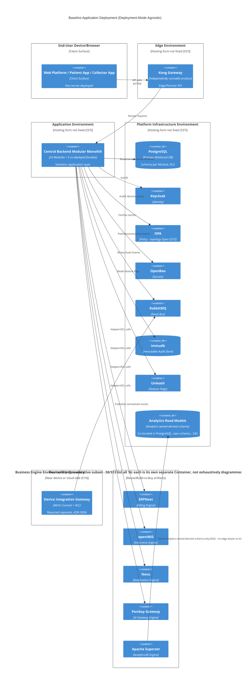
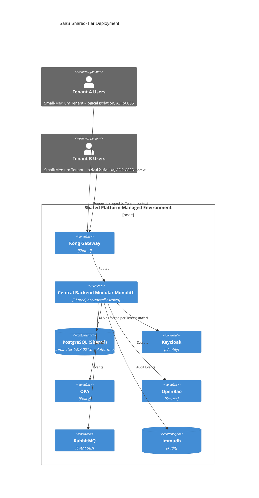
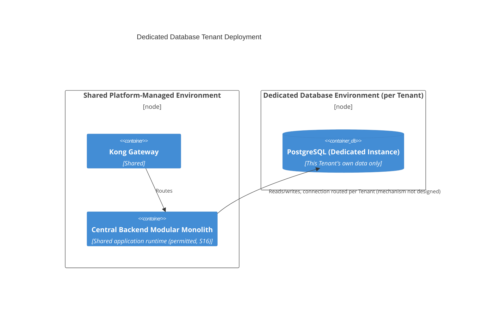
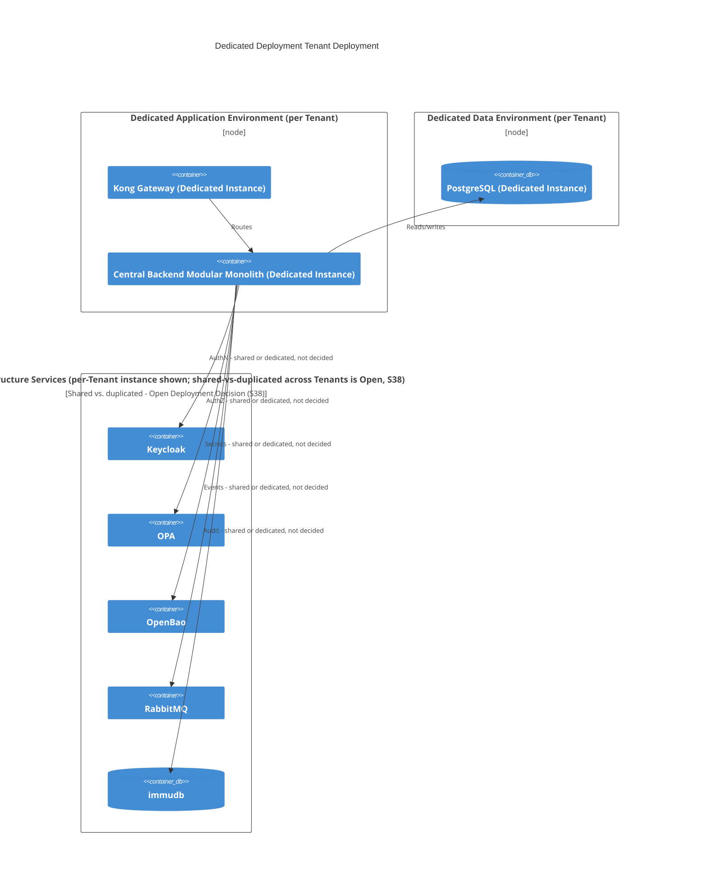
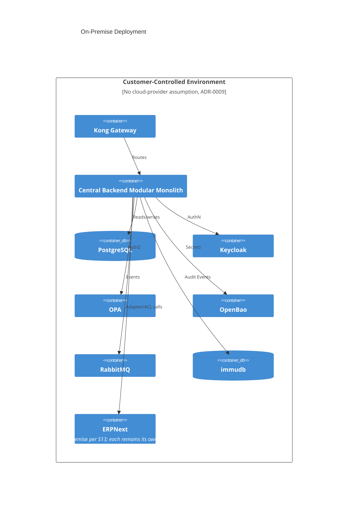
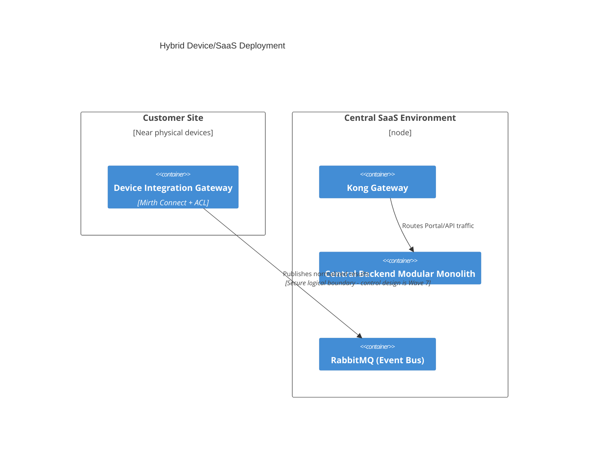
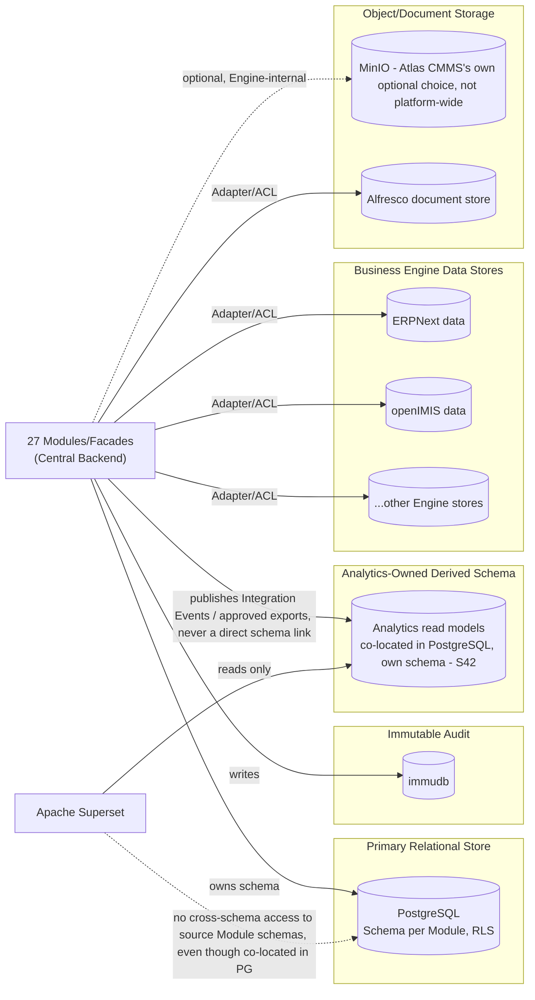
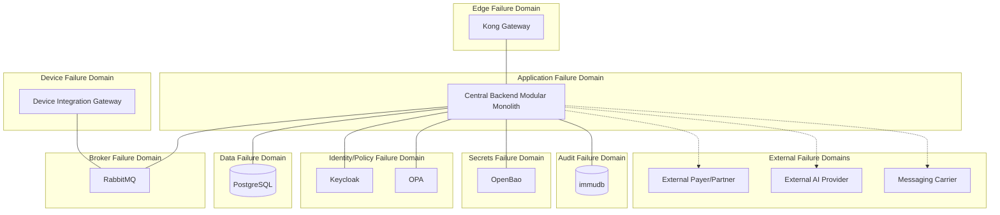

# SAD Wave 6 — Deployment View

## 1. Document Metadata

| Field | Value |
|---|---|
| Wave number and title | 6 of 13 — Deployment View (`docs/sad/README.md`) |
| Document Status | **Review** (Constitution §59 Document Status Vocabulary — not `Accepted`); Independent Architecture Review verdict: **PASS WITH MANDATORY NARROW PRE-ACCEPTANCE ERRATUM** (see §42) — erratum applied in this same pass, prior to formal acceptance |
| Owner | Author of this Wave (session author, 2026-07-20/21) |
| Review authority | Project Owner, acting as Architecture Review Board (Constitution §57) |
| Dependencies | Wave 1 — **Accepted**; Wave 2 — **Accepted**; Wave 3 — **Accepted**; Wave 4 — **Accepted**; Wave 5 — **Accepted** (commit `0f028ff`, following erratum closure `38e1558`) |
| Supersedes | None |
| Superseded by | None |
| Updated | 2026-07-21 (Narrow Pre-Acceptance Erratum) |

This Wave does not become `Accepted` in this pass, regardless of its own self-review verdict (§40). Per the Inter-Wave Gate (`docs/sad/README.md`), only the Project Owner's explicit statement of acceptance changes this field.

## 2. Purpose and Boundaries

**Function of this Wave.** The Deployment View states, at a level that permits real implementation and operation, what runnable units exist, where each can run, and which deployment modes the platform supports — without designing detailed security controls (Wave 7), fixing infrastructure sizing, or naming a cloud provider.

**Terminology this Wave never conflates**:

| Concept | Definition | Owning Wave |
|---|---|---|
| Logical Building Block | A named responsibility/boundary (Bounded Context or grouping) | Wave 4 |
| Application Module | Source-code module inside the Modular Monolith, owning a schema | Wave 4 |
| Independent-Capable Component | One of the 8 Constitution §11 components, permitted or required to be operationally independent | Wave 4 |
| C4 Container | An independently runnable software unit or data store (this Wave's primary unit of analysis) | Wave 4 (named), Wave 6 (placed) |
| Container Instance | A running instance of a Container in a specific environment | Wave 6 |
| Engine | A specific adopted open-source/vendor product (Technology Baseline, `docs/reuse/`) | Wave 6 (placed) |
| Data Store | A stateful Container holding persisted data | Wave 6 |
| Deployment Node | An execution/hosting environment a Container Instance runs inside | Wave 6 |
| Environment | A named deployment target (Development/Test/Staging/Production) | Wave 6 |
| Failure Domain | A boundary within which a failure is contained | Wave 6 |
| Tenant Isolation Tier | Shared vs. Dedicated (ADR-0005) — a data/deployment partitioning concept, not a Container | Wave 6 |

**What deployment does and does not change**:
- Deployment placement never changes Module/Bounded-Context ownership (Wave 4 §8, §9) or data ownership (Wave 4 §17) — a Module co-deployed inside the Monolith's process still owns only its own schema, exactly as if it ran separately.
- Deployment does not create a Bounded Context. A block's deployment status (co-deployed vs. separate) is a Wave 6 fact layered on top of a Wave 4 fact, never the reverse.
- Co-deployment (two logical blocks sharing one runnable unit) never permits direct internal coupling — the contract boundary (API/event) established in Wave 4 remains mandatory even when no network hop occurs (Wave 5 §2, §6 Invariant 13, carried forward here).
- Running as a separate process does not by itself make the platform a microservices architecture (Constitution §5, §54 — Microservices-by-default remains a Hold-tier item on the Architecture Radar). Most of this Wave's separate deployables are **Reuse/Build-vs-Buy artifacts** — adopted third-party Engines that are inherently separate runnable products by their own vendor nature — not a platform-driven decomposition choice.

**Difference from Building Block View (Wave 4).** Wave 4 named blocks and their static dependencies; this Wave places those same blocks into runnable units and execution environments — it introduces no new block and changes no dependency rule.

**Difference from Runtime View (Wave 5).** Wave 5's diagrams showed logical message exchanges, explicitly not deciding whether an arrow crosses a process boundary (Wave 5 §6 Invariant 13). This Wave is where that question is finally answered — for some blocks (see §5).

**Difference from Security, Privacy & Trust Boundaries (Wave 7).** This Wave states connectivity topology and failure domains only; it does not perform STRIDE analysis, does not design network segmentation controls, firewall rules, or detailed trust-zone enforcement.

## 3. Source-of-Truth Hierarchy

Applied per the governing instruction's order; higher wins on conflict: (1) Constitution; (2) Accepted ADRs; (3) Decision Register + Open Questions Resolution/Register; (4) Certification/Semantic Closure; (5) Frozen Technology Baseline + Decision Freeze; (6) Accepted Waves 1–5; (7) API Platform Strategy; (8) Discovery/Reuse artifacts per own status; (9) `.claude/context/` — lowest.

**Corrected (§42): this claim was too strong in the original draft.** The original text asserted "No conflict requiring resolution was found," but the Wave 6 Narrow Erratum found and corrected several genuine internal-consistency defects this claim had missed: this Wave's own §20 stated an Open Question (#6, Offline Mode) as still Open when the Open Questions Resolution phase had already resolved it (Accepted with Constraints); this Wave's own §15 asserted uniform Engine-layer tenant scoping unsupported by the Reuse-research evidence actually available (§13A); this Wave's own §13 miscounted the Platform Infrastructure Services it had itself already tabulated in §12 (corrected, §42/B6); and this Wave's own §35 self-contradicted within single table cells (assigning and disclaiming the same responsibility at once). None of these was a conflict *between external sources* — each was this Wave's own drafting error relative to sources it had itself already cited correctly elsewhere. One genuine ambiguity between external sources was found and is recorded as an Open Deployment Decision rather than silently resolved: `docs/adr/0005-hybrid-tenant-isolation.md`'s own text states "a dedicated database **or** dedicated deployment option" as one combined alternative, not two separately named tiers — `docs/discovery/artifacts/09-tenancy-analysis.md` and `14-MULTI-TENANCY.md` both confirm no five-tier taxonomy (Shared/Dedicated-DB/Dedicated-Deployment/On-Prem/Hybrid) is Accepted anywhere; this Wave treats "Dedicated Database Tenant" and "Dedicated Deployment Tenant" (§14, §15 below) as two **illustrative points on one Accepted "dedicated" spectrum** (ADR-0005), not as two independently Accepted tiers — flagged explicitly wherever the distinction matters.

## 4. Source Coverage

**Read fresh, this session, directly or via this session's delegated research** (every citation traces to an actual Read this session):

| Source | Relevance |
|---|---|
| Constitution §5, §9–12, §16–19, §24, §28, §33–35, §41–43, §48–56 (confirmed titles: §33 Observability, §34 Reliability and Resilience, §35 Testing, §41 Repository/Folder Governance, §42 Git Workflow, §43 Definition of Done, §49 Fitness Functions, §50 Decision Matrix, §51 Non-Functional Budgets, §52 Quality Gates, §53 Module Acceptance Checklist, §54 Architecture Radar, §55 Evolution Strategy, §56 Repository Governance) | Deployment principles, tenancy, reliability, non-functional budget status (Draft, no invented numbers), radar/evolution constraints |
| **All 14 ADRs (0001–0014), full text, read fresh in the Wave 6 Narrow Erratum session (§42)** — corrects the original draft's narrower claim of 9 full-text ADRs plus 5 prior-session restatements | Modular Monolith unit, DDD, schema-per-module, Event-Driven Integration, Hybrid Tenant Isolation, Device Gateway independence, AI Gateway independence, Unified Login, Localization-First, Core Domain (Accepted), Bounded Context Map (Accepted), PostgreSQL selection + hosting-form deferral, **SaaS-First/On-Prem-Ready/Hybrid-Ready**, **DR/BC baseline with no numeric RPO/RTO** |
| `docs/architecture-review/02-TECHNOLOGY-BASELINE.md` (Frozen); `docs/architecture-review/12-DECISION-FREEZE.md`; `docs/certification/22-ARCHITECTURE-BASELINE-FREEZE.md` | 24-Engine catalog, license status, frozen-artifact discipline |
| `docs/certification/10-DECISION-REGISTER.md`, `11-RISK-REGISTER.md`, `20-OPEN-QUESTIONS-RESOLUTION.md`, `15-SAD-INPUT-PACKAGE.md`, `23-SAD-READINESS-MATRIX.md`, `26-FINAL-SEMANTIC-CONSISTENCY-CLOSURE.md` | D-42 (RLS), D-56/57/58/59, R-02/04/07/08/13, Open Questions #3/4/7/8/15/16/25/28/29, Deployment Architecture readiness = "Partially Ready" (topology intentionally undecided), DR readiness = "Ready" (framework only) |
| `docs/api-platform/10-API-GATEWAY.md`, `09-AUTHORIZATION.md`, `12-SECRETS-AND-KEYS.md`, `27-OBSERVABILITY.md`, `14-MULTI-TENANCY.md`, `21-INTEGRATIONS.md`, `19-WEBHOOKS.md`, `13-RATE-LIMITING.md`, `05-API-STANDARDS.md`, `08-AUTHENTICATION.md`, `18-ASYNCAPI-EVENTS.md` (all read this session or Wave 5's session) | Kong/OPA/OpenBao placement, no monitoring vendor named, RLS not a resolution of the shared-tier partitioning question, no numeric thresholds anywhere |
| `docs/reuse/MASTER_ENGINE_CATALOG.md`, `MASTER_LICENSE_MATRIX.md`, `MASTER_DECISION_REGISTER.md`, plus per-Engine `05-architecture-review.md`/`04-license-review.md` for Keycloak, OPA, RabbitMQ, immudb, Novu, Portkey, Superset, Mirth Connect, ERPNext, openIMIS, Frappe HR/CRM/Helpdesk, Cal.com, Atlas CMMS, OpenBoxes, Kill Bill, Eramba, Alfresco, Documenso, Unleash (this session's delegated research) | Per-Engine runnable form, self-hostability, clustering/HA (mostly NOT STATED), license/AGPL status |
| `docs/discovery/artifacts/09-tenancy-analysis.md`, `08-integration-inventory.md`, `EGYPT-REGULATORY-RESEARCH-REGISTER.md`, `W10-candidate-modules-platform-services.md`; `docs/discovery/diagrams/09-tenant-isolation.md`, `08-integrations.md` (this session's delegated research) | Confirms 2-tier isolation model only (no 5-tier taxonomy), Device Gateway shown cloud-side, no numeric scale/capacity anywhere |
| `docs/certification/20-OPEN-QUESTIONS-RESOLUTION.md` (fresh, this session), `docs/certification/12-OPEN-QUESTIONS-REGISTER.md` (fresh, this session), `.claude/context/open-questions.md` (fresh, this session) | Offline Mode (#6) **Resolved: Accepted with Constraints**, scoped to Home Collection Logistics only — corrects this Wave's own earlier stale "still Open" framing (§42) |
| `docs/sad/01–05*.md` (this Wave's own direct dependencies, Accepted) | Every deployment unit traces to a Wave 4 block; every runtime scenario's own deferrals (Wave 5 §15, §16) are carried forward here |
| `.claude/skills/c4-architecture/`, `mermaid-diagrams/`, `architecture-patterns/`, `architecture-decision-records/`, `domain-driven-design/`, `api-design-principles/`, `doc-coauthoring` | §5 (this section is renumbered from the template's own §5 slot — see Skills Utilization below, retained as its own numbered section 5 further down per the actual document flow) |

**Inventoried, not read in full, with justification**: `docs/discovery/reports/*`, `docs/discovery/diagrams/*` beyond those cited above, `docs/discovery/prompts/*` — process/summary documents already consolidated into the cited artifacts; `docs/reuse/<module>/<feature>/*.md` beyond the specific `05-architecture-review.md`/`04-license-review.md` files cited — per-feature detail below Deployment-View abstraction, consistent with Wave 4/5's own established justification pattern.

## 5. Skills Utilization Report

| Skill | File(s) read | Rule applied | Section affected | Resulting effect |
|---|---|---|---|---|
| `c4-architecture` | `SKILL.md`, `references/common-mistakes.md`, `references/advanced-patterns.md` (this session, re-read for the Narrow Erratum, §42) | `C4Deployment` syntax; Deployment Node vs. Container Instance; "Confusing containers (deployable) vs components" anti-pattern; "one Container per independently runnable unit," never a list/group as one Container; correct relationship direction | §30 Deployment Diagrams | Diagrams 1–6 use `C4Deployment` syntax with `Deployment_Node`/`Container`/`ContainerDb` elements; no Bounded Context is drawn as a node. **Erratum correction**: the re-read found 5 genuine violations of this skill's own anti-pattern list in the original diagrams (multiple independent products lumped into one Container in Diagrams 1/2/4/5; Tenants modeled as Containers in Diagram 2; a reversed relationship direction in Diagram 6) — all corrected, see the updated C4 Deployment Audit in §40 |
| `mermaid-diagrams` | Syntax conventions applied directly (consistent with Waves 4–5's own usage) | Valid `C4Deployment`/`flowchart` syntax, participant/node-count discipline | §30 | All diagrams checked for valid syntax before being embedded; Diagrams 7–8 use `flowchart`, explicitly labeled "topology sketch, not C4" per the governing instruction |
| `architecture-patterns` | `SKILL.md`, `references/details.md` (Wave 3–5 session) | Deployment modularity, stateless/stateful separation, failure isolation, graceful degradation | §3 Deployment Principles, §27 Failure Domains | Every stateful Container is distinguished from the stateless application runtime; failure isolation stated per-dependency, not platform-wide |
| `architecture-decision-records` (review only) | `SKILL.md` (Wave 3–5 session) | New-Decision Guard — no cloud/orchestrator/database/broker choice invented; no new deployable created | §37 Explicit Non-Decisions, §38 Open Deployment Decisions | No ADR is created by this Wave; every genuinely undecided deployment question is recorded as Open, not silently resolved |
| `domain-driven-design` (limited) | `references/bounded-contexts.md` (Wave 3–5 session) | Module ownership stable across deployment modes; extraction does not change a Bounded Context | §2, §6 | Explicit statement that co-deployment/separation never changes Module or data ownership |
| `api-design-principles` (limited) | `SKILL.md` (Wave 3–5 session) | Gateway placement, no bypass to Modules, no native Engine exposure | §11 Independent Components Placement, §23 Network and Connectivity View | Every Engine's network exposure is explicitly gated through its owning Module's Adapter or the Edge Gateway |
| `doc-coauthoring` | Workflow applied directly | Structure by deployment archetype, redundancy removal, genuine Reader Testing after drafting | §41 Reader Testing | Reader Testing run only after this draft was saved |

**Not used**: `stride-analysis-patterns`, `threat-mitigation-mapping` — explicitly Wave 7's territory.

## 6. Deployment Decision Classification

Every deployment statement in this Wave carries one of these labels:

| Label | Meaning |
|---|---|
| Accepted Deployment Constraint | Fixed by Constitution or an Accepted ADR |
| Frozen Technology Input | Fixed by the Technology Baseline freeze |
| Required by Component-Specific ADR | e.g., Device Integration Gateway's ADR-0006 commitment |
| SAD-Level Baseline Deployment Design | This Wave's own reasoned default, changeable by future SAD/Architecture Review |
| Optional Deployment Variant | An archetype the platform supports without mandating it |
| Conditional Technology Placement | Placement contingent on an unresolved legal/due-diligence gate (Eramba, AGPL Engines, Novu/Documenso license) |
| Recommended Operational Practice | A non-binding good practice this Wave notes |
| Deferred Deployment Decision | Genuinely undecided, recorded in §38 |
| Legal/Regulatory Dependency | Blocked on external legal input (Egypt residency, AGPL) |

## 7. Minimal-Deployable Baseline Rule

Applied throughout: a block is drawn as its own deployable only when (a) an ADR specifically requires it (Device Integration Gateway, ADR-0006), (b) the underlying technology is itself an independently runnable product by vendor nature (Kong, Keycloak, OpenBao, RabbitMQ, PostgreSQL, immudb, and every adopted Business/Commercial Engine — ERPNext, openIMIS, Frappe family, Cal.com, Atlas CMMS, OpenBoxes, Kill Bill, Eramba, Alfresco, Documenso, Unleash, Novu, Portkey, Superset, Mirth Connect), (c) protocol/network isolation requires it (Device Integration Gateway's device-facing protocols), (d) a Dedicated tenant mode requires it (ADR-0005), or (e) a measured operational trigger justifies it later (Wave 4 §13's own "evidence-triggered" language, never a numeric threshold). Microservices preference alone is never used as a justification (Constitution §54, Hold-tier).

**Consequence for this baseline**: the platform's own custom code (Core Platform + 21 ordinary Domain Modules + the Notification/AI-Operations/Analytics logical facades) forms **one** deployable — the Central Backend Modular Monolith (§10). Everything else that appears as a separate deployable in §8's matrix is either (i) a component-specific ADR requirement (1 item), (ii) Kong Gateway (1 item, itself independently runnable by product nature), (iii) Platform Infrastructure Services (7 items — Keycloak, OPA, OpenBao, RabbitMQ, PostgreSQL, immudb, Unleash; Kong Gateway is Edge, counted separately as (ii), not among these 7 — corrected, §42), or (iv) adopted Business/Commercial Engines (many items — each a **Reuse/Build-vs-Buy** artifact, not a decomposition choice).

## 8. Deployment Unit Classification Matrix

| Item | Logical type | Runnable product? | Baseline placement | Required separate? | Permitted separate? | Co-deployment allowed? | State owned | Scaling unit | Failure domain | Status source | Conditional/legal | Owning Wave (unresolved detail) |
|---|---|---|---|---|---|---|---|---|---|---|---|---|
| Client Surfaces (Web, Patient App, Collector App) | Client delivery | N/A (client-side, not server-deployed) | Distributed to end-user devices/browsers | N/A | N/A | N/A | Local device state only (offline exception, §16) | N/A | Client device | Wave 4 §6 | — | Wave 8 (client build/distribution detail) |
| Kong Gateway | Independent-capable Engine (Constitution §11 adjacent — Edge product) | Yes, C4 Container | Separate deployable | Yes — independently runnable product by nature | — | No | Stateless (routing/policy state externalized) | Horizontal | Its own | Wave 4 §5, ADR-0009 (self-hostable) | — | — |
| Central Backend Modular Monolith | Application runtime (24 logical Modules + 3 co-deployed facades) | Yes, C4 Container | Single deployable (baseline) | No | N/A (is the baseline unit) | Notification/AI Operations/Analytics facades co-deployed by default (Wave 4 §2, §13) | Stateless application layer; state externalized to owning schemas | Horizontal | Its own | Constitution §5, ADR-0001 | — | — |
| Device Integration Gateway | Independent Component | Yes (Mirth Connect-based runtime + platform Adapter/ACL) | Separate deployable | **Yes** — ADR-0006 component-specific commitment | — | No | Own boundary state (failure/review records) | Independent | Its own, isolated from Core Domain (Invariant 11) | ADR-0006 | — | Wave 9 (protocol detail) |
| Notification Service (logical facade) | Independent-Capable Component | Facade: no (co-deployed code); underlying Engine (Novu): yes | Facade co-deployed in Monolith; Novu's own services separate | No | Yes (Constitution §11, Permitted) | Yes (Wave 4 §2) | Delivery-status records (facade); Novu's own state | Facade: with Monolith; Novu: independent | Facade: Monolith's; Novu: its own | Wave 4 §13 | Novu license `Requires Legal Verification` (R-07) | Wave 6 revision if Novu separated |
| AI Operations Gateway (logical facade) | Independent-Capable Component | Facade: no; underlying Engine (Portkey): yes | Facade co-deployed; Portkey separate | No | Yes | Yes | AI action audit-trail entries (facade); Portkey's own | Facade: with Monolith; Portkey: independent | Facade: Monolith's; Portkey: its own | Wave 4 §13 | — | — |
| Analytics (logical facade) | Independent-Capable Component | Facade: no; underlying Engine (Superset): yes | Facade co-deployed; Superset separate | No | Yes | Yes | Derived/read-model data only (facade); Superset's own | Facade: with Monolith; Superset: independent | Facade: Monolith's; Superset: its own | Wave 4 §13, §17 | — | — |
| Search Service | Independent-Capable Component | **No dedicated Engine adopted** — capability realized via pgvector (PostgreSQL extension) | N/A — not a separate deployable today | No | Yes (Constitution §11, Permitted, "Not designed") | N/A | None distinct from PostgreSQL | N/A | PostgreSQL's own | Wave 4 §13; Reuse research (pgvector, no standalone engine) | — | Deferred, evidence-triggered |
| File Processing Service | Independent-Capable Component | **No Engine found anywhere** | Not designed | No | Yes ("Not decided") | N/A | Not specified | N/A | Not specified | Wave 4 §13 | — | Deferred |
| Background Workers | Independent-Capable Component | No dedicated product named | Module-local equivalent (baseline default) or separate, per workload (Wave 5 §16, Open) | No | Yes | Yes | Job status records | Per-workload | Owning Module's, unless separated | Constitution §48; Wave 4 §13 | — | Wave 6 revision once workload evidence exists (§38) |
| Keycloak (E1, Identity) | Platform Infrastructure | Yes, standalone Java service | Separate deployable | Yes (Identity is a Core Platform primitive requiring its own product) | — | No | Identity/session state | Clusterable (stated) | Its own | ADR-0008; Reuse research | — | — |
| OPA (E2, Policy) | Platform Infrastructure | Yes — sidecar **or** centralized service **or** embedded library, per its own product design | **Deployment topology not fixed by any source** (§38) | Deployment form Open | — | Open | Policy bundles (versioned, not runtime state) | Not specified | Not specified until topology chosen | ADR-0008; `09-AUTHORIZATION.md` | — | Wave 6 revision (§38) |
| OpenBao (E23, Secrets) | Platform Infrastructure | Yes | Separate deployable | Yes (Secrets is a cross-cutting primitive) | — | No | Secret material (encrypted) | Not specified (HA topology not stated) | Its own | ADR-0009 (self-hostable, Open Questions #29) | — | Wave 6 revision (HA) |
| RabbitMQ (E7, Broker) | Platform Infrastructure | Yes, standalone broker | Separate deployable | Yes (message broker is a cross-cutting primitive) | — | No | Queued messages (transient) | Clustering/mirrored-queue config flagged **not resolved** | Its own | Reuse research | — | Wave 6 revision (clustering) |
| PostgreSQL (E24, Primary DB) | Platform Infrastructure | Yes | Separate deployable (self-hosted, managed-cloud, or on-prem instance — **hosting form deliberately not fixed**, ADR-0013) | Yes (primary relational store is cross-cutting) | — | No | All Module-owned schemas (Schema per Module, ADR-0003) | Vertical/read-replica (not fixed) | Its own | ADR-0013 | — | Wave 6/9 (hosting form, replication) |
| immudb (E4, Immutable Audit) | Platform Infrastructure | Yes, standalone deployed service (itself a database) | Separate deployable | Yes (audit immutability requires an independent store, Constitution §23) | — | No | Immutable Audit Events | Not specified | Its own | Reuse research | — | — |
| Novu (E8, underlying Notification engine) | Business Engine | Yes — multiple services (Novu's own + MongoDB + Redis for self-hosted) | Separate deployable set | Yes (vendor product form) | — | No | Notification delivery state | Not specified | Its own | Reuse research | License `Requires Legal Verification` (R-07) | Legal review (R-07) |
| Portkey Gateway (E9, underlying AI engine) | Business Engine | Yes, gateway product | Separate deployable | Yes (vendor product form) | — | No | Request/cost/provenance logs it manages | Not specified | Its own | Reuse research | — | — |
| Apache Superset (E10, underlying Analytics engine) | Business Engine | Yes, standalone BI service | Separate deployable | Yes (vendor product form) | — | No | Dashboards/reports — reads only Analytics-owned derived/read-model schemas (corrected, §42; never source Module operational schemas, even where co-located in the same PostgreSQL Engine) | Not specified | Its own | Reuse research | — | — |
| Mirth Connect (E6, underlying Device Gateway engine) | Business Engine | Yes, standalone integration-engine runtime | Deployed inside Device Integration Gateway's own boundary | Yes (part of ADR-0006's independent component) | — | No | In-flight message transformation state | Not specified | Device Integration Gateway's own | Reuse research | **Frozen at 4.5.2 — no free patches** (R-02) | Migration budget flagged (Wave 12) |
| ERPNext (E16, Billing engine) | Business Engine | Yes, self-hostable Frappe app (MariaDB backend) | Separate deployable | Yes (vendor product form) | — | No | Financial records it owns | Not specified | Its own | Reuse research | — | — |
| openIMIS (E17, Insurance engine) | Business Engine | Yes, modular platform (module-level adoption) | Separate deployable | Yes | — | No | Claims/adjudication data it owns | Not specified | Its own | Reuse research | AGPL-3.0, `Requires Legal Verification` (R-04) | Legal review (R-04) |
| Frappe HR (E18) | Business Engine | Yes, Frappe-framework app | Separate deployable | Yes | — | No | HR/payroll data it owns | Not specified | Its own | Reuse research | — | — |
| Frappe CRM (E20) | Business Engine | Yes | Separate deployable | Yes | — | No | CRM data it owns | Not specified | Its own | Reuse research | AGPL-3.0, `Requires Legal Verification` (R-04) | Legal review (R-04) |
| Frappe Helpdesk (E19) | Business Engine | Yes | Separate deployable | Yes | — | No | Ticketing data it owns | Not specified | Its own | Reuse research | AGPL-3.0, `Requires Legal Verification` (R-04) | Legal review (R-04) |
| Cal.com (E13, Scheduling) | Business Engine | Yes | Separate deployable | Yes | — | No | Scheduling data it owns | Not specified | Its own | Reuse research | AGPL-3.0 (core), commercial escape hatch (R-04) | Legal review (R-04) |
| Atlas CMMS (E14, Asset/Maintenance) | Business Engine | Yes — explicitly "Docker-based, separate backend (8080)/frontend (3000), optional MinIO" | Separate deployable set | Yes | — | No | Asset/maintenance data it owns | Not specified | Its own | Reuse research | AGPL-3.0 (dual), commercial escape hatch (R-04) | Legal review (R-04) |
| OpenBoxes (E15, Inventory) | Business Engine | Yes | Separate deployable | Yes | — | No | Inventory data it owns | Not specified | Its own | Reuse research | — | — |
| Kill Bill (E21, Subscription Billing) | Business Engine | Yes | Separate deployable | Yes | — | No | Subscription/billing data it owns | Not specified | Its own | Reuse research | — | — |
| Eramba Community (E5, GRC) | Business Engine | Yes | Separate deployable | Yes, once adopted | — | No | Compliance/GRC data it owns | Not specified | Its own | Reuse research | **Conditionally approved — due diligence required, including deployment fit** (R-01) | Pre-production due diligence |
| Alfresco Community (E11, Document Mgmt) | Business Engine | Yes | Separate deployable | Yes | — | No | Document/workflow data it owns | Not specified | Its own | Reuse research | — | — |
| Documenso (E12, E-Signature) | Business Engine | Yes | Separate deployable | Yes | — | No | Signature/document data it owns | Not specified | Its own | Reuse research | License unconfirmed, `Requires Legal Verification` (R-07) | Legal review (R-07) |
| Unleash (E3, Feature Flags) | Platform Infrastructure | Yes, standalone flag server | Separate deployable | Yes (cross-cutting config primitive) | — | No | Flag/rollout configuration | Not specified | Its own | Reuse research | — | — |

**No row above asserts that all 8 Independent Components are separately deployed** — 3 of the 8 (Notification, AI Operations, Analytics) have their platform-owned facade co-deployed by default, with only their underlying third-party Engine (a Reuse artifact, not a decomposition choice) running separately.

## 9. Baseline Application Topology

Minimal-deployable baseline: **Client Surfaces → Kong Gateway → Central Backend Modular Monolith → Platform Infrastructure Services (Keycloak, OPA, OpenBao, RabbitMQ, PostgreSQL, immudb, Unleash) ↔ Device Integration Gateway (+ Mirth Connect) ↔ Business/Commercial Engines (each its own deployable, reached only through its owning Module's Adapter) ↔ External Provider Boundaries (Payer, AI Model Provider, Messaging Carriers)**.

Co-deployed within the Monolith by SAD-Level Baseline Design (extraction trigger: measured, sustained load specific to that facade, per Wave 4 §13's own evidence-triggered language — no number fixed): Notification Service facade, AI Operations Gateway facade, Analytics facade. Contract boundaries (Wave 4's Provided/Required interfaces) remain enforced in-process exactly as they would across a network.

Required separate by ADR/product nature: Kong Gateway, Device Integration Gateway, Keycloak, OPA (topology open), OpenBao, RabbitMQ, PostgreSQL, immudb, Unleash, and every adopted Business/Commercial Engine. **Being a separate deployable is a placement fact, not a tenant-isolation claim** — per-Engine shared-instance tenant-isolation status is §13A's own matrix, not repeated here.

## 10. Central Backend Runnable Unit

Contains: the 3 Platform Kernel contexts (Identity and Access facade, Tenant and Organization Management, Core Platform primitives), the 21 ordinary in-Monolith Domain Modules (Document Management + 7 Core Domain Cluster + 13 Business/Commercial Modules — Wave 4 §8), and the 3 co-deployed facades (Notification, AI Operations, Analytics). This is **24 + 3 = 27 logical Modules/facades in one runnable unit** — consistent with Wave 4 §17's own 27-schema-owner arithmetic (21 + 3 Platform Kernel + 3 BC-bearing independent-capable = 27; Analytics owns no schema).

- **Internal contract enforcement**: every cross-Module call inside this unit still goes through the same Application/Authorization layer and event-publication discipline as Wave 5 describes (Wave 5 §6 Invariants 1–8) — co-location is never used to skip a contract.
- **Statelessness assumption**: the application layer itself holds no durable state; all durable state lives in the owning Module's schema inside PostgreSQL (or, for facades, their underlying separate Engine).
- **Configuration**: externalized (§24), never hardcoded.
- **Health signal**: not designed by any source (§25) — no monitoring vendor named anywhere in `27-OBSERVABILITY.md`.
- **Scaling direction**: horizontal (multiple stateless instances behind Kong Gateway) — no replica count fixed.
- **Migration responsibility**: each Module owns its own schema migrations (Constitution §16/§17); this Wave does not design a migration tool.

No framework or language is named anywhere in this Wave (none is fixed by any source read).

## 11. Independent Components Placement Matrix

| Component | Logical responsibility | Governing source | Baseline placement | Separation status | Underlying Engine | State | Scaling | Failure isolation | On-Prem | SaaS | Hybrid |
|---|---|---|---|---|---|---|---|---|---|---|---|
| Notification Service | Multi-channel dispatch | Wave 4 §11 | Facade co-deployed; Novu separate | Permitted | Novu | Delivery-status | With Monolith / independent (Novu) | Facade: Monolith's; Novu: its own | Same pattern | Same pattern | Same pattern |
| Device Integration Gateway | Device ingestion/ACL | ADR-0006 | Separate | **Required** (component-specific) | Mirth Connect | Provenance/failure records | Independent | Isolated from Core Domain (Invariant 11) | Near device site (§18) | Cloud-side (§15) | Near device site + cloud sync (§19) |
| AI Gateway | Governed AI calls | ADR-0007 | Facade co-deployed; Portkey separate | Permitted (no v1-deployment-specific claim, Wave 3 §14 erratum) | Portkey Gateway | Action audit trail | With Monolith / independent (Portkey) | Facade: Monolith's; Portkey: its own | Same pattern | Same pattern | Same pattern |
| Analytics Platform | Derived reporting | Wave 4 §17 | Facade co-deployed; Superset separate | Permitted | Superset | Derived data only | With Monolith / independent (Superset) | Facade: Monolith's; Superset: its own | Same pattern | Same pattern | Same pattern |
| Search Service | Search capability | Constitution §11 | No separate deployable exists | Permitted, **Not designed** | pgvector (PostgreSQL extension) | None distinct from PostgreSQL | With PostgreSQL | PostgreSQL's own | N/A | N/A | N/A |
| File Processing Service | File handling | Constitution §11 | Not designed | Permitted, **Not decided** | None found | Not specified | Not specified | Not specified | Not specified | Not specified | Not specified |
| Public API Gateway | External/Partner edge | Wave 4 §13 | Same runnable product as Kong Gateway (Wave 4 §5 — Kong serves both internal-edge and Partner-API roles; no second Gateway product is named anywhere) | Permitted | Kong Gateway | Stateless | Horizontal | Its own | Self-hostable (ADR-0009) | Self-hostable | Self-hostable |
| Background Workers | Long-running/deferred work | Constitution §48 | Module-local equivalent (baseline default) or separate, per workload | Permitted, workload-dependent | None named | Job status | Per-workload | Owning Module's unless separated | Same pattern | Same pattern | Same pattern |

**Device Integration Gateway's stronger status is preserved**: it is the only component with a component-specific `Required` v1 commitment (ADR-0006), consistent with Waves 3–5's own repeated preservation of this distinction.

## 12. Platform Infrastructure Services

| Service | Runnable unit | Stateful? | Consumers | Availability expectation | Backup requirement | Deployment modes | Baseline status |
|---|---|---|---|---|---|---|---|
| Keycloak (Identity) | Standalone service, clusterable (stated) | Session/identity state | Every authenticated request path | Not numerically fixed (§27, §38) | Yes — identity data is Tier-1-adjacent (not itself classified by ADR-0014, which classifies business data, not IAM state — flagged as an open classification gap, §38) | SaaS/On-Prem/Hybrid (self-hosted, ADR-0009) | Frozen (Technology Baseline) |
| OPA (Policy) | Sidecar, centralized service, or embedded library — **topology not fixed** | Policy bundles only (versioned, not runtime state) | Kong Gateway (coarse) + every Module's Application layer (fine) | Not fixed | **Corrected (§42)**: policy bundles are operational configuration assets, not "not applicable" for recovery purposes — loss of the authoritative bundle source would affect authorization behavior platform-wide. An authoritative, recoverable source (e.g., version control) is required in principle; whether one is actually documented/operated is **not established by current evidence** — exact backup/recovery mechanism **Deferred** (§28) | SaaS/On-Prem/Hybrid | Frozen; **topology Open (§38)** |
| OpenBao (Secrets) | Standalone service | Encrypted secret material | Every service needing a credential/key | Not fixed | Yes — secret material; encryption/access-control detail is Wave 7's territory | SaaS/On-Prem/Hybrid (self-hostable, Open Question #29) | Frozen |
| RabbitMQ (Broker) | Standalone service | Queued messages (transient) | Every Integration Event publisher/subscriber | Not fixed; clustering/mirrored-queue configuration explicitly flagged unresolved | Not typically backed up (transient) — durability/persistence configuration Deferred | SaaS/On-Prem/Hybrid | Frozen; **clustering Open (§38)** |
| PostgreSQL (Primary DB) | Self-hosted, managed-cloud, or on-prem instance — **hosting form deliberately not fixed** (ADR-0013) | All Module-owned schemas | Every Module | Not fixed | Yes — per §28 Backup and Restore Matrix | SaaS/On-Prem/Hybrid | Frozen; hosting form Deferred |
| immudb (Audit) | Standalone service (itself a database) | Immutable Audit Events | Every Sensitive Operation's audit obligation | Not fixed | Yes — Tier-1-adjacent per Constitution §23's immutability requirement | SaaS/On-Prem/Hybrid | Frozen |
| Unleash (Feature Flags) | Standalone flag server, self-hostable OSS edition | Flag/rollout configuration (not business runtime state) | Every Module reading a feature flag | Not fixed | **Corrected (§42)**: flag/rollout configuration is an operational configuration asset, not "not applicable" for recovery purposes — an incorrect or lost flag state can change feature behavior platform-wide even though it is not primary business data. An authoritative, recoverable source is required in principle; the exact backup/recovery mechanism is **Deferred** (§28), not asserted as unnecessary | SaaS/On-Prem/Hybrid | Frozen |

No cluster topology, replica count, or specific HA mechanism is invented for any of the seven services above where the source does not state one.

## 13. Engine Placement and Adoption Matrix

See §8's Deployment Unit Classification Matrix for the full per-Engine table (runnable form, separation status, license/legal status, failure effect). Summary by category:

- **Platform Infrastructure Services** (7, per §12's table): Keycloak, OPA, OpenBao, RabbitMQ, PostgreSQL, immudb, Unleash — all self-hostable per ADR-0009's "cloud-replaceable" principle; none has an invented cluster topology. **Kong Gateway is Edge, not one of these 7** (corrected, §42) — it plays an Edge/Gateway role (§8's matrix, §9, §11), not a Platform Infrastructure Service role, and is counted separately throughout this Wave; it was never intended to be included in either the 6 or the 7, and any prior wording implying otherwise is corrected here.
- **Independent-Component-owned Engines** (3): Novu, Portkey, Superset — each a separate deployable regardless of their platform-owned facade's co-deployment status.
- **Business/Commercial Engines** (13): ERPNext, openIMIS, Frappe HR/CRM/Helpdesk, Cal.com, Atlas CMMS, OpenBoxes, Kill Bill, Eramba, Alfresco, Documenso, Mirth Connect — each a separate deployable, reached only through its owning Module's Adapter/ACL (never exposed natively, §23).
- **Conditional/legal-gated placements** (do not proceed to production without resolution): Eramba (R-01, due diligence including deployment fit), the 5+ AGPL Engines — openIMIS, Frappe CRM, Frappe Helpdesk, Cal.com, Atlas CMMS (R-04) — and the unconfirmed-license Engines Novu, Documenso (R-07). This Wave places them in the baseline topology as **Conditional Technology Placement**, not as production-ready, per §6's classification labels.
- **Frozen-and-aging**: Mirth Connect (4.5.2, no free patches past this version, R-02) — placement unchanged, but flagged for the Wave 12 risk-treatment/migration-budget discussion, not resolved here.

No Engine is treated as a Source of Truth beyond what the Technology Baseline/Reuse research documents.

**Note on Engine-internal bundled dependencies (clarified, §42 verification pass)**: where an adopted Engine's own upstream deployment guidance bundles a specific internal dependency — Novu's own MongoDB/Redis, ERPNext's own MariaDB backend, Atlas CMMS's own optional MinIO — that dependency is the Engine's own vendor-internal implementation detail, cited from this session's Reuse research, not a platform-level technology decision and not a new item requiring its own Technology Baseline entry. This Wave's Explicit Non-Decisions (§37) and Frozen Technology Baseline (§4) govern platform-level choices; an Engine's own bundled runtime dependency, sitting entirely inside that Engine's own deployable boundary, is out of that scope by construction.

## 13A. Engine Tenant-Isolation and Placement Matrix

**New section, added in the Wave 6 Narrow Erratum (§42).** The prior draft asserted that all Business/Commercial Engine deployables "are scoped by Tenant/Organization/Branch at every layer" — unproven for most Engines and now corrected. This section separates two distinct facts that the prior draft conflated:

- **Platform-owned PostgreSQL data** (Schema per Module, ADR-0003): Shared-tier RLS + tenant-ID discriminator is **Accepted** (ADR-0013); schema-per-Module ownership is **Accepted** (ADR-0003). This is not in question and is not re-litigated here.
- **Third-party Engine data** (each Engine's own internal store, outside platform-owned schemas): native multi-tenancy is **not assumed** — it is evidenced per Engine below, via this session's delegated Reuse-research review. Passing an authenticated, Tenant-scoped context through a Module's Adapter/ACL (Constitution §19) secures the *call*; it does not by itself prove the Engine *isolates stored data* at its own layer. No Engine is placed as shared multi-tenant production infrastructure without either documented evidence or an explicit, unresolved due-diligence gate recorded below — a dedicated instance per Tenant is always an available containment option, never assumed the automatic default absent a specific requirement (§7).

| Engine | Owning Module/Adoption Point | Native multi-tenancy evidence | Platform Adapter tenant-context responsibility | Engine-side isolation mechanism (if documented) | Shared-instance placement status | Dedicated-instance option | Data ownership | Administrative isolation | Backup/restore isolation | Required tenant-isolation test | Source | Residual deployment decision | Handoff |
|---|---|---|---|---|---|---|---|---|---|---|---|---|---|
| Novu (E8) | Notification Service facade | Not established by current evidence | Adapter attaches authenticated Tenant context per request (Constitution §19); does not prove Engine-side data partitioning | None documented | Conditional — requires tenant-isolation due diligence before shared-tier production use | Available (separate Novu deployment per Tenant) | Novu's own delivery-state store, outside platform-owned schemas | Not documented — Deferred | Not documented — Deferred | Mandatory tenant-isolation test before shared-tier production use — not yet performed | Reuse research (no isolation evidence found) | Open | Wave 8 (isolation-test gate); Wave 7 (threat) |
| Portkey Gateway (E9) | AI Operations Gateway facade | Not established by current evidence | Same pattern | None documented | Conditional | Available | Portkey's own request/cost/provenance logs | Not documented — Deferred | Not documented — Deferred | Same pattern | Reuse research (no isolation evidence found) | Open | Wave 8; Wave 7 |
| Apache Superset (E10) | Analytics facade | **Partial** — Reuse research documents "Superset's own RBAC and row-level security features," referenced as "scoped per-tenant via Superset's own RLS features aligned to Module 2's `tenant_id` convention" | Same pattern; additionally, §42/§14 restrict Superset to Analytics-owned derived schemas only, never source Module operational schemas | Superset-native RBAC + Row-Level Security, aligned to the platform's `tenant_id` convention (Reuse research; mechanism configuration detail not further specified — Deferred) | Approved by evidence | Available | Analytics-owned derived/read-model schema only (§14/§42) | Not documented — Deferred | Not documented — Deferred | Recommended pre-production validation confirming the documented RLS/`tenant_id` alignment is actually configured per dashboard/dataset | `docs/reuse/analytics/bi-dashboards/05-architecture-review.md`, `06-security-review.md`, `09-integration-options.md` | Open (validation, not due-diligence-blocked) | Wave 8 (validation test); Wave 7 |
| ERPNext (E16) | Billing Module | Not established by current evidence — runs on its own MariaDB backend, separate from platform PostgreSQL, so the platform's RLS mechanism cannot mechanically apply regardless of policy intent | Same pattern | None documented | Conditional | Available | ERPNext's own MariaDB-backed store | Not documented — Deferred | Not documented — Deferred | Same pattern | Reuse research (no isolation evidence found; distinct DB engine noted) | Open | Wave 8; Wave 7 |
| openIMIS (E17) | Insurance and Corporate Contracts Module | Not established by current evidence — Reuse risk analysis additionally flags a context mismatch: "openIMIS's primary deployment model targets government/NGO health-financing schemes, a different operating context than a commercial multi-tenant SaaS lab platform" | Same pattern | None documented | Conditional — elevated scrutiny per the noted context-mismatch risk | Available | openIMIS's own store | Not documented — Deferred | Not documented — Deferred | Same pattern, plus explicit review of the context-mismatch risk before shared-tier adoption | `docs/reuse/insurance-and-corporate-contracts/eligibility-verification/12-risk-analysis.md` | Open | Wave 8; Wave 7; legal review (R-04, AGPL, separate concern) |
| Frappe HR (E18) | HR/Payroll Module | Not established by current evidence | Same pattern | None documented | Conditional | Available | Frappe HR's own store | Not documented — Deferred | Not documented — Deferred | Same pattern | Reuse research (no isolation evidence found) | Open | Wave 8; Wave 7 |
| Frappe CRM (E20) | CRM/Support Module | Not established by current evidence | Same pattern | None documented | Conditional | Available | Frappe CRM's own store | Not documented — Deferred | Not documented — Deferred | Same pattern | Reuse research (no isolation evidence found) | Open | Wave 8; Wave 7; legal review (R-04) |
| Frappe Helpdesk (E19) | CRM/Support Module | Not established by current evidence | Same pattern | None documented | Conditional | Available | Frappe Helpdesk's own store | Not documented — Deferred | Not documented — Deferred | Same pattern | Reuse research (no isolation evidence found) | Open | Wave 8; Wave 7; legal review (R-04) |
| Cal.com (E13) | Scheduling Module | Not established by current evidence | Same pattern | None documented | Conditional | Available | Cal.com's own store | Not documented — Deferred | Not documented — Deferred | Same pattern | Reuse research (no isolation evidence found) | Open | Wave 8; Wave 7; legal review (R-04) |
| Atlas CMMS (E14) | Asset/Maintenance Module | Not established by current evidence | Same pattern | None documented | Conditional | Available | Atlas CMMS's own store (+ optional MinIO) | Not documented — Deferred | Not documented — Deferred | Same pattern | Reuse research (no isolation evidence found) | Open | Wave 8; Wave 7; legal review (R-04) |
| OpenBoxes (E15) | Inventory Module | Not established by current evidence | Same pattern | None documented | Conditional | Available | OpenBoxes's own store | Not documented — Deferred | Not documented — Deferred | Same pattern | Reuse research (no isolation evidence found) | Open | Wave 8; Wave 7 |
| Kill Bill (E21) | Subscription Billing (platform-commercial, not clinical) | **Confirmed** — Reuse research documents "battle-tested, explicit multi-tenant/white-label support" | Same pattern; Engine-native model reduces reliance on Adapter-only isolation | Native multi-tenant/account model (Reuse research; internal partitioning mechanism not further specified — Deferred) | Approved by evidence | Available | Kill Bill's own multi-tenant-aware store | Not documented — Deferred | Not documented — Deferred | Recommended pre-production validation that Kill Bill's native tenant/account model is actually mapped 1:1 to the platform's own Tenant identifier | `docs/reuse/saas-commercial-operations/subscription-plan-management/03-candidate-repositories.md`, `10-final-decision.md` | Open (validation, not due-diligence-blocked) | Wave 8 (validation test) |
| Eramba Community (E5) | GRC/Compliance Module | Not established by current evidence — Eramba's own security review states isolation applies "if deployed multi-tenant-aware," a conditional statement, not a confirmed native capability | Same pattern | Conditional/undocumented — "if deployed multi-tenant-aware" (Reuse research, not asserted as a confirmed feature) | Conditional — compounds with the existing R-01 pre-production due-diligence gate already required before adoption | Available | Eramba's own store | Not documented — Deferred | Not documented — Deferred | Same pattern, combined with R-01's existing due-diligence scope | `docs/reuse/audit-and-compliance/compliance-tracking/06-security-review.md` | Open | Wave 8; Wave 7; R-01 due diligence |
| Alfresco Community (E11) | Document Management Module | Not established by current evidence — security review states isolation "must extend to Alfresco's own folder/permission model" as a configuration requirement, not a confirmed native capability | Same pattern | Folder/permission model exists but tenant-alignment is a configuration obligation, not a documented default (Reuse research) | Conditional | Available | Alfresco's own document/workflow store | Not documented — Deferred | Not documented — Deferred | Mandatory validation that Alfresco's folder/permission model is actually configured per-Tenant before shared-tier production use | `docs/reuse/document-management/document-storage-versioning/06-security-review.md` | Open | Wave 8; Wave 7 |
| Documenso (E12) | Document Management Module (e-signature) | Not established by current evidence | Same pattern | None documented | Conditional | Available | Documenso's own store | Not documented — Deferred | Not documented — Deferred | Same pattern | Reuse research (no isolation evidence found) | Open | Wave 8; Wave 7; legal review (R-07, license) |
| Mirth Connect (E6) | Device Integration Gateway (ADR-0006) | Not established by current evidence; not evaluated for shared-tier placement — this Engine is **already Required separate** inside Device Integration Gateway's own isolated boundary (ADR-0006, Invariant 11), never offered as a shared multi-tenant placement option in the first place | Device Integration Gateway's own ACL, not a per-Tenant Adapter in the usual sense | None documented | Not applicable — Required separate by ADR-0006, not a shared-instance candidate | Not applicable (already separate) | In-flight message transformation state, within Device Integration Gateway's own boundary | Not documented — Deferred | Not documented — Deferred | Not applicable — isolation question is moot given required separation | Reuse research; ADR-0006 | Not applicable | Wave 9 (protocol detail) |

**Summary**: 2 of 16 Engines with independent state (Superset, Kill Bill) have documented native multi-tenancy/RLS evidence and are classified **Approved by evidence** (pre-production validation still recommended, not a blocking gate). Mirth Connect is **Not applicable** — already required separate by ADR-0006, never a shared-tier candidate. The remaining 13 Engines are classified **Conditional — requires tenant-isolation due diligence before shared-tier production use**; this Wave places them in the baseline topology (§8, §9, consistent with §6's Conditional Technology Placement label) but does not clear them for shared-tier production without that due diligence. This due-diligence requirement is additive to, not a substitute for, the separate license/legal gates already tracked (R-01, R-04, R-07) — a license clearance does not imply a tenant-isolation clearance, and vice versa.

## 14. Data Deployment Topology

- **PostgreSQL primary role**: every Module's owned schema (Schema per Module, ADR-0003) lives in PostgreSQL by default; hosting form (self-hosted/managed/on-prem) is a deployment-topology decision each environment makes independently (ADR-0013).
- **Shared-tier partitioning**: Row-Level Security (RLS) plus a tenant-ID discriminator is the Technology Baseline's Reference Standard (R4) and is confirmed in ADR-0013 as "the ratified shared-tier partitioning mechanism for Hybrid Tenant Isolation" — this Wave treats it as **Accepted** (not merely a candidate), correcting `14-MULTI-TENANCY.md`'s own more hedged framing in favor of the higher-precedence ADR-0013 text.
- **Dedicated database option**: a large/regulated Tenant may receive its own PostgreSQL instance, still consistent with ADR-0013 and ADR-0005.
- **Dedicated deployment option**: a large/regulated Tenant may receive an isolated application-runtime deployment in addition to a dedicated database — ADR-0005's own text treats this as part of the same "dedicated" alternative, not a separately Accepted third tier (§3).
- **Analytics/read-model stores (corrected, §42)**: Analytics owns no primary operational source schema (Wave 4 §17) — source Modules remain the sole writers and owners of their own operational data (Constitution §16). Analytics receives data only via published Integration Events, approved analytical exports, or owning-Module-approved read models, materialized into Analytics-owned derived schemas. Superset connects only to these Analytics-owned derived schemas/read models — even though they are, as a hosting-form choice, physically co-located in the same PostgreSQL Engine (no separate analytical database engine adopted) — never to a source Module's own operational schema directly. Physical co-location in one PostgreSQL instance does not grant, and is never read as granting, cross-schema access; Schema per Module's ownership boundary (ADR-0003) applies identically regardless of which physical Engine instance hosts the schema. Analytics/Superset storage is not a Source of Truth for operational data.
- **Immutable Audit Store**: immudb, separate from PostgreSQL, per Constitution §23.
- **File/document storage**: Alfresco (Document Management's Engine) owns document/workflow data in its own store; Atlas CMMS optionally uses MinIO for object/document storage (Reuse research) — no other object-storage product is named anywhere.
- **Backup domains**: per §28 — no retention numbers invented.
- **Data residency**: configurable by market (ADR-0009); no concrete region/jurisdiction list is fixed anywhere (§29).

No table/schema DDL, replication factor, or storage size is invented anywhere in this section.

## 15. SaaS Shared-Tier Archetype

Shared application runtime (Central Backend Modular Monolith, horizontally scaled) + shared Platform Infrastructure Services (Keycloak, OPA, OpenBao, RabbitMQ, PostgreSQL with RLS, immudb, Unleash) + shared Business/Commercial Engine deployables. **Tenant scoping is Confirmed at the platform-owned layer, not automatically true at every Engine's own layer** (corrected, §42): every platform-owned PostgreSQL schema (Schema per Module, ADR-0003) is scoped by Tenant/Organization/Branch via RLS + tenant-ID discriminator (ADR-0013, Constitution §18/§19) — this is Accepted. Whether a given shared-instance Business/Commercial Engine's *own* internal data store natively enforces an equivalent tenant boundary is **not established by current evidence** for most Engines (§13A, Engine Tenant-Isolation and Placement Matrix) — this archetype description does not assert it. A shared-instance Engine placement in this archetype is valid only per §13A's per-Engine status (Approved by evidence, or Conditional pending a tenant-isolation due-diligence gate); it is never assumed by default. Failure domain: shared — a Platform Infrastructure Service outage affects every Tenant in this tier (§27). Scaling unit: the Monolith and Kong Gateway scale horizontally; Platform Infrastructure Services scale per their own product's own mechanism (not fixed here). Ingress/egress: through Kong Gateway only for API traffic; Device Integration Gateway for device traffic; each Business Engine's Adapter for its own external-provider traffic. No legal-compliance claim is made by this archetype description (§6 classification labels apply per-item, not to the archetype as a whole).

## 16. Dedicated Database Tenant Archetype

Shared application runtime is **permitted** to continue serving a Dedicated-Database Tenant (ADR-0005 does not require the application layer itself to be duplicated for this option) while that Tenant's data lives in its own PostgreSQL instance. Routing/configuration responsibility: the shared application layer's persistence-layer configuration selects the correct database instance per Tenant (mechanism not designed here — implementation detail). Migration ownership: same per-Module migration discipline, applied against the dedicated instance. Backup/restore: separate, per that Tenant's own instance (§28). Promotion trigger: qualitative only — "sustained resource consumption beyond the shared tier's capacity envelope, or an explicit contractual/regulatory requirement" (Open Questions Resolution #16) — no hardcoded threshold. A Tenant's own Business/Commercial Engine data (where that Tenant's shared-instance Engine placement is itself Conditional, §13A) is not automatically resolved by database dedication alone — dedicating the Tenant's PostgreSQL instance does not by itself clear a Conditional Engine for that Tenant; the Engine's own §13A due-diligence gate remains separate.

## 17. Dedicated Deployment Tenant Archetype

Isolated application-runtime deployment (a separate instance of the Central Backend Modular Monolith) plus isolated data tier (its own PostgreSQL instance). Whether Platform Infrastructure Services (Keycloak, OPA, OpenBao, RabbitMQ, immudb) are also duplicated per Dedicated-Deployment Tenant, or remain shared, is **not decided by any source** — recorded as an Open Deployment Decision (§38), not invented here. Tenant-specific configuration and operational ownership follow the same externalized-configuration principle as the shared tier (§24). Update cadence and support boundary: not fixed by any source. This archetype does not duplicate every Engine "just in case" — duplication is justified per §7's Minimal-Deployable Baseline Rule only where the Tenant's own contractual/regulatory requirement demands it. As with §16, a dedicated application-runtime deployment does not by itself resolve a Conditional Engine's §13A due-diligence gate — a Dedicated-Deployment Tenant given exclusive use of an Engine instance still benefits from, but does not substitute for, that Engine's own isolation/configuration review.

## 18. On-Premise Archetype

Customer-controlled environment running: the Central Backend Modular Monolith, Kong Gateway, Platform Infrastructure Services, and whichever Business/Commercial Engines the customer's deployment actually uses — all self-hostable per ADR-0009's "must not preclude on-premise" requirement and confirmed self-hostable per-Engine in §8/§13. External dependencies that must remain replaceable/self-hostable per ADR-0009's own "cloud-replaceable" constraint: none of the Platform Infrastructure Services requires a specific cloud provider (all are self-hostable products). Secrets/configuration ownership: the customer's own operations team, using OpenBao. Updates and support: not fixed by any source. Connectivity-degraded behavior: not designed beyond Wave 5's already-established Device Integration Gateway failure isolation (Wave 5 §11). Backup responsibility boundary: the customer's own operations team, per §28's matrix structure (not specific numbers). **No air-gapped support is claimed** — no source states the platform supports fully disconnected operation beyond the Home-Collection offline exception (§16 below is renumbered — see §19). On-Premise is typically single-Tenant per customer environment, which removes the *cross-Tenant* leakage concern §13A addresses for the Shared tier — it does not remove the separate question of whether a given Engine correctly scopes data across that customer's own multiple Organizations/Branches (Constitution §18); that remains governed by the same Constitution §19 Data Scope discipline applied within the customer's own environment, not re-derived here.

## 19. Hybrid Archetype

Device Integration Gateway (with its Mirth Connect runtime) deployed near/on the customer site, close to the physical devices it ingests from — consistent with `docs/discovery/diagrams/08-integrations.md`'s own depiction of devices connecting inbound to this Gateway, and with ADR-0006's protocol-isolation rationale. Central backend remains SaaS (or Dedicated, per §16/§17). Secure logical integration boundary between the site-local Gateway and the central platform: required by Constitution §19 (server-derived tenant context) and ADR-0006, but this Wave does not design the specific security control (Wave 7). Buffering/reconciliation semantic requirement: Device Integration Gateway's own failure isolation already requires no partial/invalid state on connectivity loss (Wave 5 Invariant 11) — this Wave adds no new mechanism. Intermittent connectivity: acknowledged as a documented plausibility for parts of Egypt (`EGYPT-REGULATORY-RESEARCH-REGISTER.md`, Industry Practice, not Confirmed) — no specific SLA is invented. Data residency options: configurable by market (ADR-0009). Site responsibility: device connectivity and local Gateway operation. Central platform responsibility: everything else. No VPN product, protocol, or specific connectivity mechanism is named anywhere in any source — none is invented here.

## 20. Home Collection Offline Deployment Handoff

**Corrected in the Wave 6 Narrow Erratum (§42).** An earlier version of this section stated "Nothing about offline behavior is Accepted anywhere" and cited `open-questions.md` #6 as still Open. That was stale: the Open Questions Resolution phase (`docs/certification/20-OPEN-QUESTIONS-RESOLUTION.md`, #6, 2026-07-18) resolved this question. The governing text: *"**Required.** Local-first capture with eventual sync is adopted as an architectural requirement for the Home Collection Logistics feature specifically (not platform-wide)... **Classification**: Accepted with Constraints (scope: Home Collection Logistics workflow only, not a platform-wide offline requirement)."* `.claude/context/open-questions.md` itself carries a top-of-file notice that 18 of 31 questions (including #6) were resolved 2026-07-18, and question #6's own entry there is marked `RESOLVED`-equivalent by pointing to the Resolution document — the file's older inline text (preserved lower in that document as historical record, per that document's own stated policy of not deleting prior content) does not override the Resolution phase's authoritative outcome. Per the Source-of-Truth Hierarchy (§3), the Open Questions Resolution document (tier 3, Decision Register/Open Questions Resolution) outranks both the Discovery-phase hedge in `08-integration-inventory.md` (tier 8, Discovery/Reuse) and `.claude/context/open-questions.md`'s own preserved historical text (tier 9, lowest) — this section now states the corrected, higher-precedence status.

**Requirement status: Accepted with Constraints.** **Scope: Home Collection Logistics workflow only** — the Sample Collector/Home Visit App, not the platform generally (§18's "no air-gapped support" statement continues to apply to the platform at large; this is a narrow, named exception, not a general-purpose offline capability). **Deployment detail status: Deferred** — the requirement itself is Accepted; the implementation mechanism is not chosen by this Wave or any prior source:

- Mobile/local-first runtime boundary: the Collector App only.
- Pattern (Accepted): local-first capture by the Collector App, with durable local persistence — required at the semantic level (data entered offline must not be lost) — and eventual synchronization once connectivity returns.
- Local device storage mechanism: **Deferred** — no specific on-device database, encryption implementation, or retention window is stated by any source, so none is invented here; only the requirement that some durable local persistence exists is Accepted.
- Sync protocol: **Deferred** — no specific mechanism is stated by any source.
- Conflict resolution algorithm: **Deferred** — not specified by any source.
- Remote wipe / device-loss handling: **Deferred** — not specified by any source (see also Wave 7, device-loss threat).
- Server remains authoritative after reconciliation: consistent with Constitution §16 (owning Module is sole writer) — once synced, the same ownership rules apply as any other write.

This Wave does **not** extend offline-first behavior to any other client surface or workflow — it remains scoped exactly to the Home Collection Logistics feature, and no further. This scope boundary is itself part of the Accepted-with-Constraints classification, not a separate hedge.

## 21. Client Surface Delivery

Web Platform, Patient App, Sample Collector App — distributed to end-user devices/browsers, not server-deployed in the sense the rest of this Wave uses. Update/distribution responsibility: not fixed by any source (no app-store/CDN vendor named). API-only backend access: every client surface reaches the platform exclusively through Kong Gateway (Wave 4 §6/§7) — no direct Module, Engine, or data-store access. Offline exception: limited to the Home Collection pattern above (§20), not general. No client-side authorization authority: every authorization decision is backend-enforced (Constitution §21, restated). No app store, CDN, or specific distribution vendor is chosen anywhere in this Wave.

## 22. Environment Separation

No source names a specific CI/CD tool or pipeline. At a logical level, consistent with standard practice and not contradicted by any source:

| Environment | Purpose | Data policy | Secrets/config separation | External integration treatment | Promotion boundary |
|---|---|---|---|---|---|
| Development | Active development | No real/production data (Constitution §13's own no-real-data rule, restated) | Separate OpenBao namespace/instance (not designed further) | External providers mocked/sandboxed where available | Not fixed |
| Test | Automated/manual testing | No real data | Separate from Development | Sandboxed where available | Not fixed |
| Staging/pre-production | Pre-release validation | No real data unless explicitly and narrowly authorized (not designed here) | Separate | Sandboxed or limited real integration, per provider's own sandbox availability | Not fixed |
| Production | Live platform | Real data, full Constitution §13 protections apply | Fully separate, production OpenBao | Real external providers | N/A |
| Tenant/demo/sandbox | Not evidenced by any source reviewed | — | — | — | — |

This section is deliberately thin — no pipeline, tool, or promotion-gate mechanism is invented where no source states one.

## 23. Network and Connectivity View

Connectivity topology only, **not** a Threat Model (Wave 7's territory): public ingress reaches Kong Gateway; Kong Gateway routes to the Central Backend Modular Monolith and, for Partner API traffic, applies the same coarse AuthZ/quota pattern Wave 5 §7 R11 already describes; the Monolith reaches Platform Infrastructure Services and, via each owning Module's Adapter, the relevant Business/Commercial Engine; Device Integration Gateway sits at the device/site boundary, receiving inbound device traffic and publishing outward to the Event Bus (RabbitMQ); external-provider egress (Payer System, AI Model Provider, Messaging Carriers, FHIR Partners) happens only through the owning Module's/Gateway's own Adapter or Anti-Corruption Layer, never natively. Administration/operations boundary: not designed here (Wave 7). No port number, IP range, or subnet is invented anywhere.

## 24. Configuration, Secrets and Feature Flags

- **OpenBao**: the platform's secrets store (§8, §12). Secret material never appears in source code (Constitution, restated).
- **Unleash**: the platform's feature-flag/configuration engine (E3), self-hostable OSS edition.
- **Environment/Tenant configuration**: externalized (§10, §22) — no specific mechanism (env vars vs. config service) is fixed by any source.
- **Secret rotation responsibility**: `12-SECRETS-AND-KEYS.md` explicitly declines to assert a rotation interval, consistent with the No-Guessing Rule — this Wave repeats that same hedge, inventing no interval.
- **Configuration ownership**: the owning Module for Module-specific config; Platform operations for cross-cutting config.
- **Per-market channel activation**: consistent with ADR-0009's "configurable by market" principle — no specific market list is fixed here.
- **Deployment-mode differences**: SaaS/On-Prem/Hybrid each configure the same logical set of Platform Infrastructure Services and Engines differently (hosting location, credentials) — never a different logical architecture (§2).

No secret path, rotation interval, or specific config-service product is designed here.

## 25. Observability and Health

- **Health/degraded/unhealthy signals**: not designed by any source — `27-OBSERVABILITY.md` contains no liveness/readiness-probe language anywhere. This Wave does not invent one.
- **Logs/metrics/traces**: kept as three explicitly separate signal types (`27-OBSERVABILITY.md`), each distinct from the Audit trail (immudb) — restated here, not redesigned.
- **Audit separated from operational telemetry**: Accepted (Constitution §23, Wave 5 §12) — immudb remains the single system of record for Audit Events; operational logs/metrics/traces are a separate stream.
- **Module/component attribution**: every log/metric/trace carries the owning Module/component's identity (consistent with Wave 5's Correlation ID discipline) — no specific field schema is designed here.
- **Tenant-tier attribution**: not specified by any source beyond the general tenant-context discipline already established (Constitution §19).
- **External dependency health**: not designed by any source.
- **No monitoring/APM vendor is named anywhere** — the only named tool is Apache Superset, and only for BI dashboards, itself hedged as a Recommendation (`27-OBSERVABILITY.md`: "this Board recommends reusing Superset for API dashboards rather than introducing a second BI tool").

## 26. Scaling Strategy

Horizontal scale direction for the Central Backend Modular Monolith and Kong Gateway (both stateless application layers). Scale unit per deployable: one instance of the Monolith, one instance of Kong Gateway, one instance of each separately-deployed Engine — no replica count is fixed anywhere. Stateful vs. stateless constraints: PostgreSQL, RabbitMQ, immudb, and every Business Engine's own data store are stateful and scale per their own product's own mechanism (not designed here); the application layer is stateless by design (§10). Independent component scaling triggers: qualitative and evidence-based only (Wave 4 §13's own "measured, sustained" language; Open Questions Resolution #16's tenant-promotion trigger; no number anywhere). Database/dedicated-tier promotion: §16's own qualitative trigger. Event throughput direction: not designed numerically (Wave 5 §16's own Deferred retry/backoff parameters extend here). No autoscaler or orchestrator product is named anywhere.

## 27. Availability, Disaster Recovery and Business Continuity

Applied per ADR-0014 exactly, with **no numeric value added beyond what ADR-0014 itself states** (which is: none — every RPO/RTO cell in ADR-0014's own Recovery Classes table reads "[to be set]" / "Pending Business Approval" / "Pending Regulatory Validation" / "Pending Workload Evidence"):

- **Service/data classifications**: ADR-0014's own 4-tier Service Criticality classification governs; this Wave does not re-derive it.
- **Backup obligations**: encrypted at rest; access-controlled independently from the production data store's own ACL; immutable/protected backup storage required for Tier 1 and Tier 2 (ADR-0014, restated).
- **Restore/failover direction**: DR topology "must remain deployable across SaaS, On-Premise, and Hybrid modes" (ADR-0014) — this Wave's §15–§19 archetypes are each consistent with that requirement; no failover mechanism is designed further here.
- **Single-region/multi-region status**: "Tier 1 and Tier 2 backups are stored in a failure domain independent of the primary production environment (a separate availability zone at minimum)" is Accepted; "cross-region replication/backup storage is Pending Regulatory Validation" (tied to the Egypt data-transfer Legal Dependency, §38) — **not resolved further here**.
- **Incident/degraded-mode expectations**: consistent with §32 Failure Domains and Wave 5's own graceful-degradation invariant (Wave 5 §6 Invariant 11).
- **Per-tenant recovery**: "DR recovery must respect Hybrid Tenant Isolation... Per-Tenant selective recovery is a Proposed Target capability for the Dedicated tier specifically... Pending Workload Evidence for the Shared tier, since RLS-based co-location makes selective single-Tenant restore architecturally harder" (ADR-0014, restated verbatim in substance).

**No availability percentage, RTO, RPO, failover time, or region count is invented anywhere in this Wave** — every instance where this Wave might be tempted to state one instead cites ADR-0014's own "Pending" status.

## 28. Backup and Restore Matrix

| Store | Owner | Data category | Backup requirement | Restore responsibility | Consistency concerns | Tenant-specific restore | Test requirement | Retention | Encryption/security |
|---|---|---|---|---|---|---|---|---|---|
| PostgreSQL (all Module schemas) | Platform Operations | Business/transactional (Tier per ADR-0014, per-Module) | Encrypted, access-controlled, immutable for Tier 1/2 (ADR-0014) | Platform Operations (Shared); Tenant/Platform shared (Dedicated) | RLS co-location complicates single-Tenant restore on Shared tier (ADR-0014) | Proposed Target for Dedicated tier only; Pending Workload Evidence for Shared | Not specified — Deferred | **Not set** (ADR-0014, Pending) | Handoff to Wave 7 |
| immudb (Audit) | Platform Operations | Tier-1-adjacent (immutability itself is the Constitution §23 requirement; not separately tiered by ADR-0014) | Same principles as above | Platform Operations | Immutability itself is the primary guarantee | Not specified | Not specified | Not set | Handoff to Wave 7 |
| OpenBao (Secrets) | Platform Operations | Tier-1-adjacent (not separately classified by ADR-0014 — flagged, §38) | Not specified beyond general principles | Platform Operations | Not specified | Not specified | Not specified | Not set | Handoff to Wave 7 |
| Keycloak (Identity/session state) | Platform Operations | Tier-1-adjacent (same open classification gap as OpenBao — identity/secret material is not itself placed in an ADR-0014 tier, flagged symmetrically, §38) | Not specified beyond general principles | Platform Operations | Not specified | Not specified | Not specified | Not set | Handoff to Wave 7 |
| OPA (Policy bundles) | Platform Operations | Operational configuration asset, not business data — but not "not applicable" for recovery purposes (corrected, §42): loss affects authorization behavior platform-wide | Authoritative recoverable source required in principle (e.g., version control); whether one is actually documented/operated is not established by current evidence | Platform Operations | Not specified | Not specified | Not specified | Not set — mechanism Deferred, not asserted unnecessary | Handoff to Wave 7 |
| Unleash (Feature-flag/rollout configuration) | Platform Operations | Operational configuration asset, not business data — but not "not applicable" for recovery purposes (corrected, §42): loss/incorrect state can change feature behavior platform-wide | Authoritative recoverable source required in principle; mechanism not documented | Platform Operations | Not specified | Not specified | Not specified | Not set — mechanism Deferred, not asserted unnecessary | Handoff to Wave 7 |
| Business/Commercial Engine data stores (ERPNext, openIMIS, etc.) | Platform Operations (Shared) / Tenant+Platform (Dedicated) | Business/transactional | Same ADR-0014 principles, tier depends on the specific data | Same pattern as PostgreSQL | Not specified per-Engine | Not specified | Not specified | Not set | Handoff to Wave 7 |
| RabbitMQ (transient) | Platform Operations | Transient — not a backup target in the traditional sense | Durability/persistence configuration Deferred | N/A | N/A | N/A | N/A | N/A | Handoff to Wave 7 |
| Client device local storage (Home Collection) | End user / Collector | Transient, pending sync | Not specified — Deferred (§20) | Not specified | Not specified | N/A | Not specified | Not set | Handoff to Wave 7 |

## 29. Data Residency and Localization Deployment

Configurable Data Residency is an Accepted architectural constraint (ADR-0009: "data residency must be configurable by market... identified in the SAD before go-live in any new market"). Dedicated placement options (§16/§17) can satisfy a residency requirement by placing a Tenant's database/deployment in a specific jurisdiction. No specific country configuration beyond "configurable" is fixed by any source. **This Wave does not assume Egypt's requirements are fully enumerated** — `EGYPT-REGULATORY-RESEARCH-REGISTER.md` flags Law 151/2020 cross-border transfer provisions as "not independently confirmed... Requires Legal Verification" (R-13), and ADR-0014 ties cross-region backup storage directly to this same open Legal Dependency. Movement/export restrictions are recorded here as a **Legal/Regulatory Dependency** (§6 classification), never as an architectural fact.

## 30. Deployment Diagrams

Diagrams 1–6 use `C4Deployment` Mermaid syntax (`Deployment_Node`, `Container`, `ContainerDb`) per the `c4-architecture` skill. No Bounded Context is drawn as a node; no cloud provider, region, or specific hosting vendor is named anywhere (consistent with §37's Explicit Non-Decisions) — nodes are labeled by their **logical placement** ("Platform-Managed Environment," "Customer-Controlled Environment") only. Diagrams 7–8 are `flowchart` sketches, explicitly not C4, per the governing instruction's own requirement where a genuinely different visualization (data flow, failure-domain grouping) is clearer than a deployment-node tree.

### Diagram 1 — Baseline Application Deployment

### Diagram 2 — SaaS Shared-Tier Deployment

Business/Commercial Engines and Unleash are omitted from this diagram for readability (see Diagram 1 for representative Engine placement, §8/§13 for the full list, §13A for per-Engine shared-instance tenant-isolation status — never assumed uniform across Engines).

### Diagram 3 — Dedicated Database Tenant Deployment

### Diagram 4 — Dedicated Deployment Tenant Deployment

### Diagram 5 — On-Premise Deployment

### Diagram 6 — Hybrid Device/SaaS Deployment

### Diagram 7 — Data Deployment (topology sketch, not C4)

### Diagram 8 — Failure-Domain Overview (topology sketch, not C4)

## 31. Deployment, Upgrade and Rollback

Application release unit: the Central Backend Modular Monolith and Kong Gateway (each a separate release artifact, not named further). Module schema migrations: per-Module ownership (Constitution §16/§17), no specific migration tool named. Engine upgrades: each Business/Commercial Engine upgrades on its own vendor cadence; Mirth Connect specifically is **frozen at 4.5.2 with no free security patches beyond it** (R-02) — this Wave records the constraint, not a resolution (Wave 12's territory). Backward-compatible contracts: consistent with API versioning discipline already established (`docs/api-platform/`), not redesigned here. Deprecation: not designed further. Rollback limitations after data migrations: acknowledged generically (a schema migration that has run may not be trivially reversible) — no specific mechanism designed. Conditional/frozen Engine handling: Mirth Connect and every AGPL/license-conditional Engine (§13) are placed in the baseline topology but flagged Conditional, not production-cleared. On-Prem update distribution: not fixed by any source. **No zero-downtime guarantee is claimed anywhere** — no evidence supports one.

## 32. Failure Domains and Degraded Operation

| Failure | Affected capability | Unaffected capability | Write/read behavior | Data-integrity posture | Queue/buffering status | Operational visibility | Deferred recovery mechanism |
|---|---|---|---|---|---|---|---|
| Kong Gateway unavailable | All external API/Partner access | Internal device ingestion (Device Integration Gateway has its own inbound path, not through Kong) | No new external requests processed | No corruption — requests simply fail closed | Not specified | Operational log (§25) | Failover mechanism not designed |
| Central Backend unavailable | All Module operations | Device ingestion buffering (RabbitMQ), Engine-hosted Business capability may remain reachable if directly integrated (not typical) | No writes; in-flight requests fail | No partial state (Invariant 11, restated) | RabbitMQ retains published events for eventual consumption | Operational log | Not designed |
| PostgreSQL unavailable | Every Module's reads/writes | Nothing meaningfully unaffected — this is the primary data store for 27 logical Modules/facades | Full write/read failure for affected schemas | Transaction atomicity preserved for in-flight transactions (ADR-0013); no partial commits | N/A | Operational log | Failover/replica mechanism not designed |
| RabbitMQ unavailable | All async Integration Event delivery | Synchronous request/response paths (Wave 5 R1-style) | Publishers cannot publish; consumers stop receiving | Publisher's own committed state is not lost, but the publish-after-commit gap (Wave 5 §9, still Open) is exactly where this failure bites hardest | N/A — this is the buffering mechanism itself failing | Operational log | Wave 5's own Mandatory Pre-Implementation Architecture Decision (§9 there) applies |
| Identity/Policy (Keycloak/OPA) unavailable | All authentication/authorization | Nothing — every state-changing/sensitive-read path requires this (Constitution §21) | Full denial (fail-closed, consistent with Deny by Default) | No unauthorized state change possible | N/A | Operational log | Not designed. Keycloak and OPA are shown as one row for the fail-closed *behavior*, which is identical either way — but OPA's actual blast radius depends on its still-undecided deployment topology (§38): a sidecar-per-instance topology would fail per-instance, not platform-wide, unlike a centralized OPA service. This row does not resolve that; §38's OPA row remains the authoritative Open item |
| Secrets (OpenBao) unavailable | Any service needing to fetch/rotate a credential at that moment | Already-cached credentials may continue working briefly (mechanism not designed) | Degraded, not specified precisely | No credential leakage by design | N/A | Operational log | Not designed |
| Device Gateway unavailable | Device result ingestion | Everything else | No new device results ingested | No partial/invalid state (Wave 5 R5, Invariant 11) | Device-side buffering not designed (device-dependent) | Operational log | Not designed (Wave 9) |
| Notification Engine (Novu) unavailable | Notification dispatch | Underlying business fact (e.g., `ResultReleased`) is unaffected (Wave 5 R8, restated) | Delivery-status record shows failure | Business fact preserved | Not specified | Operational log | Deferred retry policy (Wave 5 §16) |
| AI provider unavailable | AI-assisted output requests | Everything else; Human-in-the-Loop means no clinical decision depended on AI alone | Request fails; AI action still logged (ADR-0007 completeness requirement) | No unreviewed AI output reaches clinical state | N/A | Operational log | Deferred (Wave 5 §11) |
| Analytics (Superset) unavailable | Dashboards/reports | Every operational capability (Analytics reads derived data only) | Reports fail; underlying data unaffected | No impact on primary data | N/A | Operational log | Not designed |
| Audit Store (immudb) unavailable | Recording new Audit Events | Not specified whether Sensitive Operations should then fail-closed or queue — **not decided by any source** (§38) | Not specified | Risk of an unaudited Sensitive Operation if not fail-closed | Not specified | Operational log | Open Deployment Decision (§38) |
| External payer/partner unavailable | That specific claim/exchange | Everything else (Wave 5 R9, restated) | Claim remains pending | No partial state | Not specified | Operational log | Deferred (Wave 5 §11) |
| Site-to-cloud connectivity unavailable (Hybrid) | Sync between site-local Device Gateway and central platform | Local device ingestion continues locally (buffering, mechanism not designed) | Local writes only until reconnection | No partial/invalid Core Domain state (Invariant 11 extends here) | Local buffering, mechanism not designed | Not specified | Not designed |
| Unleash (Feature Flags) unavailable | New flag reads (behavior depends on the SDK's own fail-open/fail-closed default, not fixed by any source) | Every capability not gated by a flag | Not specified | No business data touched — flags are configuration, not business state | N/A | Operational log | Not designed |
| Background Workers (or its module-local equivalent) unavailable | The specific long-running/deferred job(s) affected | Every synchronous request path (Wave 5 R12, restated — job submission is only an acknowledgment) | Job status shows `failed`; retry/cancellation ownership not specified (Wave 5 R12) | No partial state in the owning Module's own Aggregate (jobs operate on already-committed data) | Job queue retains queued work, per whatever product eventually fills this role | Operational log | Not designed; tied to the same Open workload-placement decision (§38) |
| Business/Commercial Engine unavailable (any of the 13 — ERPNext, openIMIS, Frappe HR/CRM/Helpdesk, Cal.com, Atlas CMMS, OpenBoxes, Kill Bill, Eramba, Alfresco, Documenso, Mirth Connect, and Novu/Portkey/Superset already covered above individually) | That Engine's own capability (e.g., Billing writes if ERPNext is down) | Every other Module/Engine — no cross-Engine dependency is asserted anywhere in this Wave | Owning Module's Adapter surfaces the failure; no direct client-visible Engine error (§23, no native exposure) | No partial state in the platform's own owned schemas (the Engine's own internal state is that Engine's own concern) | Not specified, per-Engine | Operational log | Not designed, per-Engine — consistent with §13's "no per-Engine clustering/HA statement" finding. Blast radius note: for a shared-instance Engine classified Conditional (§13A), an outage or isolation incident affects every Tenant sharing that instance simultaneously — this is a distinct concern from the availability failure this row otherwise describes, and is tracked as part of §13A's own due-diligence gate, not resolved here |

**No automatic failover is invented anywhere in this matrix.**

## 33. Atomic Event Publication Deployment Handoff

Direct link to Wave 5's own Mandatory Pre-Implementation Architecture Decision (Wave 5 §9, §16): the semantic guarantee (an Integration Event must eventually become publishable after its triggering business-state commit, no silent permanent loss) is Accepted; the mechanism is not. This Wave adds the deployment dimension without selecting a mechanism: candidate mechanism categories — Transactional Outbox (would add a table inside PostgreSQL and a separate publisher process/thread), Change Data Capture (would add a CDC connector reading PostgreSQL's write-ahead log), broker-transaction integration (would rely on RabbitMQ's own transactional semantics, which have their own trade-offs), or a recoverable publication log (a generic pattern, unspecified). Deployment implications: any of these adds either a new stateful component (Outbox table, CDC connector) or a tighter coupling between the Central Backend and RabbitMQ's own failure domain — this Wave does not choose, consistent with Wave 5's own prohibition. Database/broker failure domain: whichever mechanism is eventually chosen will sit exactly at the PostgreSQL/RabbitMQ failure-domain boundary already described in §32. Decision status: **Mandatory Pre-Implementation Architecture Decision** (carried forward from Wave 5, not re-decided here). Blocking condition: implementation of any workflow depending on cross-module event reaction, same as Wave 5 stated; non-blocking for this Wave's own documentation. ADR assessment: required, per Wave 5's own finding — not performed here. Wave 10/11/12 ownership: unchanged from Wave 5 §9.

## 34. Webhook Delivery Deployment Handoff

Direct link to Wave 5's own unassigned, non-deployable placeholder (Wave 5 §3, §7 R11, §16, §19): this Wave does **not** create a new deployable for Webhook Delivery, and does **not** place it on any of this Wave's 8 Deployment Diagrams (§30) at all — not even as a placeholder — since none of the required baseline/archetype/data/failure-domain diagrams needs to show it to be complete, and omitting it entirely avoids any risk of it being misread as a confirmed node. The candidate owners this Wave neither prefers nor decides among: existing Public API Gateway (Kong) scope, Notification Service facade, or Background Workers — consistent with Wave 5's own refusal to name a most-plausible owner after its narrow erratum (Wave 5 §19). No deployment-specific fact (process form, scaling, failure domain) is stated for this responsibility, since none exists to state.

## 35. Deployment Responsibility Matrix

**Restructured in the Wave 6 Narrow Erratum (§42)**: the prior version of this matrix both assigned Backup/Restore to a specific party's column *and* stated, in the same cell, that "not fixed which party executes this" — a direct contradiction, and in one row silently converted an expected operating model into what read as settled fact. Every cell below now carries an explicit status from §6's classification vocabulary, extended with the responsibility-specific labels the governing instruction requires: **Accepted Platform Responsibility**, **Accepted Customer Responsibility**, **Recommended Operational Default**, **Shared Responsibility**, **Contract-Dependent — Open**, or **Not Applicable**. No cell both assigns an owner and disclaims that assignment in the same breath.

| Mode | Deployment / Patching | Backup / Restore | Monitoring | Incident Response | Secrets | Data Residency |
|---|---|---|---|---|---|---|
| SaaS Shared | Platform Operations — **Accepted Platform Responsibility** (SAD-Level Baseline Deployment Design; this Wave's own reasoned default for the tier the platform itself operates end-to-end) | Platform Operations — **Accepted Platform Responsibility** (same basis) | Platform Operations — **Accepted Platform Responsibility** (same basis) | Platform Operations — **Accepted Platform Responsibility** (same basis) | Platform Operations, via OpenBao — **Accepted Platform Responsibility** | Platform Operations, configurable per market (ADR-0009) — **Accepted Platform Responsibility** for the mechanism; specific market posture is a **Legal/Regulatory Dependency** (§29) |
| Dedicated Database | Platform Operations (application layer) — **Accepted Platform Responsibility** | Execution and ownership — **Contract-Dependent — Open** (§38): no governing source fixes whether Platform Operations or the Tenant executes backup/restore for the dedicated instance; this Wave does not assume a default | Platform Operations (application layer) — **Accepted Platform Responsibility**; database-instance-level monitoring — **Contract-Dependent — Open** | Platform Operations (application layer) — **Accepted Platform Responsibility**; database-instance-level incident response — **Contract-Dependent — Open** | Secrets scoped per-Tenant, Platform-operated — **Accepted Platform Responsibility** | For that instance's jurisdiction — **Shared Responsibility** (placement is a Platform Operations action; the residency requirement itself may be Tenant-driven) |
| Dedicated Deployment | Application-layer patching — **Accepted Platform Responsibility** unless contractually shifted (**Contract-Dependent — Open** for the shift itself) | Execution and ownership — **Contract-Dependent — Open** (§38): same unresolved-party pattern as Dedicated Database, extended to the full isolated deployment | Isolated-deployment-level monitoring — **Contract-Dependent — Open** | Isolated-deployment-level incident response — **Contract-Dependent — Open** | Secrets — **Shared Responsibility** (Platform-operated mechanism, Tenant-specific scope) | **Shared Responsibility** (same pattern as Dedicated Database) |
| On-Premise | Infrastructure deployment/patching — **Accepted Customer Responsibility** (the customer's own infrastructure, by the nature of On-Premise itself — ADR-0009; this is the one On-Premise cell that follows necessarily from environment ownership, not a separately negotiated split); software update *delivery mechanism* — **Contract-Dependent — Open** (not fixed by any source) | **Accepted Customer Responsibility** for execution (the customer's own environment) — but the specific support/patching/backup responsibility *split* with Platform Operations (e.g., whether Platform Operations provides tooling, remote assistance, or a managed-backup option) is **Contract-Dependent — Open**, not assumed | **Accepted Customer Responsibility** for execution; split with Platform Operations — **Contract-Dependent — Open** | **Accepted Customer Responsibility** for first-line response (the customer's own environment); Platform Operations escalation/support boundary — **Contract-Dependent — Open** | **Accepted Customer Responsibility** (OpenBao, customer-operated) | **Accepted Customer Responsibility** (the customer's own jurisdiction, by construction) |
| Hybrid | Central SaaS-side: same as SaaS Shared row — **Accepted Platform Responsibility**. Site-local Device Gateway: **Accepted Customer Responsibility** (device connectivity and local Gateway operation, per §19) | Central SaaS-side: same as SaaS Shared — **Accepted Platform Responsibility**. Site-local component: **Accepted Customer Responsibility** | Central SaaS-side: **Accepted Platform Responsibility**. Site-local: **Accepted Customer Responsibility** | **Shared Responsibility** — reconciliation/sync boundary between site-local Gateway and central platform is not designed (mechanism not fixed, §19); each side handles incidents in its own domain | Central: **Accepted Platform Responsibility**. Site-local secrets: **Accepted Customer Responsibility** | Configurable by market (ADR-0009) for the central side — **Accepted Platform Responsibility** for the mechanism; site-local jurisdiction — **Accepted Customer Responsibility** by construction |

No contractual/legal term is invented anywhere in this matrix — every **Contract-Dependent — Open** cell is also tracked as an Open Deployment Decision (§38), not a silently-assumed default; every **Accepted Customer/Platform Responsibility** label is either a direct logical consequence of the deployment mode's own definition (e.g., On-Premise infrastructure ownership) or this Wave's own SAD-Level Baseline Deployment Design for the tier the platform operates end-to-end (SaaS Shared) — neither is a fabricated contractual commitment.

## 36. New-Decision Audit

Checked every "Accepted"/"Required"/"Frozen" label in §8–§29 against its cited source. Result: **zero new architectural decisions introduced.** Two items were checked specifically for New-Decision risk and confirmed clean: (1) treating RLS as Accepted (not merely a candidate) in §14 is a direct restatement of ADR-0013's own text, not a new decision — `14-MULTI-TENANCY.md`'s more hedged framing is lower-precedence (rank 7) than ADR-0013 (rank 2), and this Wave's Source-of-Truth Hierarchy (§3) requires the higher-precedence source to govern; (2) placing Kong Gateway as also serving the Public API Gateway role (§11) restates Wave 4 §5's own text ("Kong Gateway... draws only Kong Gateway and Device Integration Gateway as Container elements") rather than inventing a second Gateway product — no source names a distinct Public API Gateway product anywhere.

## 37. Explicit Non-Decisions

- Cloud provider (ADR-0009: "does not select a specific cloud provider").
- Kubernetes/container orchestrator (not named by any source read).
- Service mesh (not named by any source read).
- Region count, Availability Zones (beyond ADR-0014's own "at minimum a separate AZ" for Tier 1/2 backups — no count fixed).
- Replica count (any service).
- VM/container sizing, CPU/RAM/storage sizing (not named anywhere).
- Exact autoscaling thresholds.
- Load balancer product (beyond Kong Gateway's own routing function).
- CDN.
- Object storage product (beyond Atlas CMMS's own optional MinIO mention, which is that Engine's own internal choice, not a platform-wide decision).
- Network ports/subnets.
- VPN product/protocol (Hybrid archetype).
- Backup product/tool.
- Backup retention numbers.
- RTO/RPO numbers (ADR-0014, restated).
- Exact CI/CD tooling.
- Atomic event-publication mechanism (§33, Wave 5's Open Decision).
- Webhook Delivery owner (§34, Wave 5's Open Decision).
- Exact Background Workers placement per workload (§8, Wave 5's Open Decision).
- OPA deployment topology (sidecar vs. centralized vs. embedded) — **new to this Wave**, §38.
- RabbitMQ clustering/mirrored-queue configuration — **new to this Wave**, §38.
- Numeric rate/retry/timeouts (Wave 5 §15, restated).
- Monitoring/APM vendor.
- Health/liveness/readiness probe mechanism.
- Migration tool for schema changes.
- CI/CD promotion-gate mechanism.
- Home Collection local device storage mechanism, encryption implementation, sync protocol, conflict-resolution algorithm, retention window, and remote-wipe mechanism (§20 — the *requirement* is Accepted with Constraints; these implementation details are Deferred, not the requirement itself).

## 38. Open Deployment Decisions

| Question | Current status | Why unresolved | Required semantic outcome | Alternatives | Decision authority | ADR required? | Blocking point | Owning later Wave/phase |
|---|---|---|---|---|---|---|---|---|
| OPA deployment topology (sidecar vs. centralized service vs. embedded library) | Open | No source fixes this; `09-AUTHORIZATION.md` describes two Policy Enforcement Points but not OPA's own runtime form | A confirmed topology for Gateway-level and Module-level policy evaluation | Sidecar per service; centralized policy service; embedded library per process | Architecture Review Board | No — implementation-topology choice, not a new component | Blocking before production deployment design | Wave 6 revision or Wave 9 |
| RabbitMQ clustering/mirrored-queue configuration | Open | Explicitly flagged unresolved in Reuse research | A confirmed HA configuration for the message broker | Single-node (non-HA); clustered with mirrored/quorum queues | Architecture Review Board / Platform Operations | No | Blocking before production HA guarantees can be claimed | Wave 6 revision |
| PostgreSQL hosting form (self-hosted vs. managed cloud vs. on-prem instance) | Open (ADR-0013's own deliberate deferral) | ADR-0013 explicitly defers this to "the SAD/Implementation phase" per environment | A confirmed hosting form per environment/deployment mode | Self-hosted; managed cloud service; on-prem instance | Architecture Review Board / Platform Operations, per environment | No | Non-blocking for this Wave; blocking before environment provisioning | Wave 6 revision or implementation phase |
| Dedicated-Deployment Tenant's Platform Infrastructure Services (shared or duplicated) | Open | No source addresses this specifically | A confirmed default for whether Keycloak/OPA/OpenBao/RabbitMQ/immudb are duplicated per Dedicated-Deployment Tenant | Shared across Dedicated-Deployment Tenants; fully duplicated per Tenant; hybrid | Architecture Review Board | No | Blocking before a real Dedicated-Deployment Tenant is provisioned | Wave 6 revision |
| Audit Store (immudb) unavailability behavior for Sensitive Operations | Open | No source states whether a Sensitive Operation should fail-closed or queue when the Audit Store is unreachable | A confirmed fail-closed-vs-queue policy consistent with Constitution §23's mandatory-audit requirement | Fail-closed (block the Sensitive Operation); queue-and-retry (risk of temporary unaudited state) | Architecture Review Board | Possibly — touches the mandatory-audit guarantee | Blocking before production Sensitive-Operation availability can be claimed | Wave 7 (ties to audit/trust boundary design) |
| Identity/Secrets (Keycloak/OpenBao) data classification under ADR-0014's tiers | Open | ADR-0014 classifies business/data stores; IAM and secret material are not explicitly placed in a tier | A confirmed tier assignment for identity/secret backup obligations | Treat as Tier-1-adjacent by analogy (this Wave's own working assumption, not asserted as Decided); formally classify via ADR-0014 amendment | Architecture Review Board | Possibly — ADR-0014 amendment | Blocking before backup SLAs for these stores can be claimed | Wave 10 (Architecture Decisions & Traceability) or ADR-0014 revision |
| Backup/restore responsibility split for Dedicated Database/Deployment tenants | Open | Not fixed by any source (§35) | A confirmed responsibility split (Platform vs. Tenant) per dedicated mode | Platform-executed; Tenant-executed; shared runbook | Architecture Review Board / Commercial terms | No | Blocking before a Dedicated contract is signed | Wave 12 or commercial/legal process |
| Cross-region backup/replication (Egypt Legal Dependency) | Open | Pending Regulatory Validation (ADR-0014, tied to Open Question #25/R-13) | Confirmed cross-border transfer posture once Egyptian counsel opinion exists | Single-region only; cross-region with legal clearance; region-locked per market | Legal counsel + Architecture Review Board | Possibly | Blocking for any market requiring cross-region DR | Legal review (R-13), then Wave 6 revision |

**Not re-opened**, consistent with Waves 1–5's own established corrections: Modular Monolith First (ADR-0001); Schema per Module (ADR-0003); Hybrid Tenant Isolation's two-tier model (ADR-0005); PostgreSQL as primary relational engine (ADR-0013); the 8-Independent-Component list (Constitution §11); Kong/OpenBao as approved Version 1 product selections (D-58/D-59); FHIR R4 pinned (D-43); SaaS-First/On-Prem-Ready/Hybrid-Ready (ADR-0009); the DR/BC framework structure (ADR-0014, only its numeric targets remain Pending, which is itself already the Accepted status, not a re-opening).

## 39. Traceability Matrix

| Deployment Unit | Wave 4 Block | Wave 5 Scenario(s) | Constitution | ADR(s) | Decision(s) | Risk(s) | Technology Baseline | Deployment Mode(s) | Status | Wave 7/11/12 Handoff |
|---|---|---|---|---|---|---|---|---|---|---|
| Kong Gateway | Wave 4 §5 Container | R1, R11 | §11, §14 | ADR-0009 | D-58, D-59, D-28 (Open Q #28) | — | E22 | All | Confirmed | Wave 7 (network security controls) |
| Central Backend Modular Monolith | Wave 4 §5, §8 | R1–R12 (most) | §5, §9, §10, §16, §17 | ADR-0001, ADR-0003 | D-41 | — | — | All | Confirmed | Wave 9/11 |
| Device Integration Gateway | Wave 4 §5, §13 | R4, R5 | §24 | ADR-0006 | — | R-02 (Mirth Connect) | E6 | All (site-local in Hybrid/On-Prem) | Confirmed | Wave 9 |
| Notification Service (facade + Novu) | Wave 4 §11 | R8 | §21 | — | D-10 | R-07 (Novu license) | E8 | All | Confirmed (facade); Conditional (Novu license) | Legal (R-07) |
| AI Operations Gateway (facade + Portkey) | Wave 4 §11, §13 | R10 | §28 | ADR-0007 | D-07 | — | E9 | All | Confirmed | Wave 9 |
| Analytics (facade + Superset) | Wave 4 §17 | — | — | — | — | — | E10 | All | Confirmed | — |
| Search Service | Wave 4 §13 | — | §11 | — | — | — | — (pgvector, no dedicated Engine) | N/A | Not designed | Deferred |
| File Processing Service | Wave 4 §13 | — | §11 | — | — | — | — | N/A | Not designed | Deferred |
| Background Workers | Wave 4 §13 | R12 | §48 | — | — | — | — | All | Confirmed (component), Open (placement) | Wave 6 revision |
| Keycloak | Wave 4 §10 | R1 | §20 | ADR-0008 | D-44 | — | E1 | All | Confirmed | Wave 7/8 |
| OPA | Wave 4 §10 | R1, R6 | §21 | ADR-0008 | — | — | E2 | All | Confirmed (existence); Open (topology) | Wave 6 revision |
| OpenBao | Wave 4 §18 | — | — | — | D-59 (Open Q #29) | — | E23 | All | Confirmed | Wave 7 |
| RabbitMQ | Wave 4 §16 | Multiple (Event Bus) | §12, §34 | ADR-0004 | — | — | E7 | All | Confirmed (existence); Open (clustering) | Wave 6 revision |
| PostgreSQL | Wave 4 §17 | Multiple | §16, §17 | ADR-0013 | D-42, D-56 | — | E24 | All | Confirmed (product); Open (hosting form) | Wave 6 revision |
| immudb | Wave 4 §18 | R6, R7, R10 | §23 | — | — | — | E4 | All | Confirmed | Wave 7 |
| Business/Commercial Engines (13) | Wave 4 §11, §17 | R9 (Billing/Insurance example) | — | — | Various | R-01, R-04, R-07, R-08 | E5, E11–E21 | All | Confirmed (placement); Conditional (several, legal); Conditional (13 of 16 stateful Engines, tenant-isolation due diligence, §13A) | Wave 12 (legal/exit-strategy); Wave 8 (tenant-isolation validation, §13A) |
| Engine Tenant-Isolation status (all 16 stateful Engines) | Wave 4 §11, §13, §17 | — | §18, §19 | ADR-0005, ADR-0013 | — | — | — | All | §13A: 2 Approved by evidence (Superset, Kill Bill); 13 Conditional; 1 Not applicable (Mirth Connect, already required separate) | Wave 8; Wave 7 |

## 40. Review Report

### Git Preflight (performed before this Wave began)

Branch `main`; `git fetch origin`; working tree confirmed clean except the pre-existing, untracked `compact/` directory (never touched); no divergence between `main` and `origin/main`; starting SHA `0f028ffd822a28fd38466820370f83af30657721`.

### Wave 5 Erratum Summary

An Independent Architecture Review found 10 narrow semantic issues in Wave 5 (B1–B10): status-promotion of API Strategy Recommendations (`Idempotency-Key`, Client Credentials, Partner quotas, `404`-class response, `eventId`) as if Accepted; Webhook Delivery placed inside a confirmed diagram instead of isolated; Background Workers' confirmed-component status phrased ambiguously; the publish-after-commit gap under-classified; retry policy's qualitative Accepted rule omitted in several Error Matrix rows; stale self-audit claims. All 10 corrected in `docs/sad/05-runtime-view.md`, independently re-verified (4 residual defects found and closed on the verification pass), then formally accepted.

### Wave 5 Independent Verification

An independent reviewer sub-agent, given the corrected file and 10 required verification questions, confirmed 6 of 10 clean outright and found 4 residual defects of the same classes, all closed (R11 wording self-contradiction; R5's un-isolated "Review Queue" placeholder; §17 Traceability's stale Background Workers wording; two Error Matrix rows missing the qualitative retry citation).

### Wave 5 Corrective Commit

`38e1558` (`docs(sad): correct Wave 5 pre-acceptance semantics`), pushed and verified `main`==`origin/main`.

### Wave 5 Acceptance Commit

`0f028ff` (`docs(sad): formally accept Wave 5`), pushed and verified `main`==`origin/main`==`0f028ffd822a28fd38466820370f83af30657721`.

### Source Coverage

See §4 in full.

### Source Precedence

See §3 — one ambiguity found (ADR-0005's combined "dedicated database or dedicated deployment" phrasing vs. this Wave's own illustrative two-archetype split), resolved by treating the two as points on one Accepted spectrum, not two independently Accepted tiers, and recording the distinction explicitly wherever it matters.

### Skills Utilization

See §5 in full.

### Deployment Unit Audit

Every item in §8's matrix traces to a Wave 4 block, a Constitution/ADR requirement, or a Reuse-research-confirmed Engine — no invented deployable appears anywhere. Checked specifically: no row asserts all 8 Independent Components are separately deployed (Gate F); Device Integration Gateway's component-specific `Required` status is preserved distinctly from the other 7's `Permitted` status (Gate G).

### Independent Component Audit

§11's matrix confirms each of the 8 components' status matches Wave 4 §13 exactly, with no new component introduced (no 9th) and Webhook Delivery kept as an unassigned, non-deployable placeholder (§34), never drawn as a confirmed node.

### Engine Placement Audit

§8/§13's Engine rows were checked against the Technology Baseline (Frozen) and this session's Reuse research — no Engine's license, self-hostability, or clustering status is invented; every "NOT STATED" finding from the research pass is preserved as "not fixed by any source," not silently filled in.

### Engine Tenant-Isolation Audit (new, Wave 6 Narrow Erratum, §42)

A dedicated Reuse-research review was run this session for all 16 stateful Business/Commercial Engines (Novu, Portkey, Superset, ERPNext, openIMIS, Frappe HR/CRM/Helpdesk, Cal.com, Atlas CMMS, OpenBoxes, Kill Bill, Eramba, Alfresco, Documenso, Mirth Connect), specifically checking each Engine's own architecture-review/security-review documentation for native multi-tenancy or tenant-isolation evidence, as distinct from Adapter-level tenant-context passing. Result, recorded in full in §13A: 2 Engines (Superset, Kill Bill) have documented native evidence and are classified Approved by evidence; Mirth Connect is Not applicable (already Required separate, ADR-0006); the remaining 13 have no such evidence and are classified Conditional — requires tenant-isolation due diligence before shared-tier production use. §15 (SaaS Shared-Tier Archetype) is corrected to no longer assert uniform Engine-layer tenant scoping.

### Tenant Isolation Audit

§3, §14–§17 checked against ADR-0005/ADR-0013/`14-MULTI-TENANCY.md`/Discovery's tenancy research — confirmed only a two-tier Shared/Dedicated model is Accepted, no five-tier taxonomy invented; the Shared-tier RLS mechanism correctly cited as Accepted via ADR-0013 (higher precedence than the API doc's own more hedged framing).

### Data Topology Audit

§14 checked against ADR-0003/ADR-0013/Wave 4 §17 — schema ownership, hosting-form deferral, and Analytics' no-primary-schema status all correctly restated, not re-decided.

### DR/Backup Audit

§27–§28 checked line-by-line against ADR-0014's own text — confirmed zero numeric RPO/RTO/availability/retention figures appear anywhere in this Wave.

### Operational Responsibility Audit (corrected, Wave 6 Narrow Erratum, §42)

**Original self-review claim (stale)**: "§35's matrix checked for invented contractual terms — none found." This missed a real defect: the original §35 both assigned Backup/Restore to the Tenant/customer column for Dedicated Database and Dedicated Deployment *and* stated in the same cell that "not fixed which party executes this" — an internal contradiction, not merely an invented term. §35 is restructured to use the explicit status vocabulary (Accepted Platform/Customer Responsibility, Recommended Operational Default, Shared Responsibility, Contract-Dependent — Open, Not Applicable) per-function rather than per-mode, so no cell both assigns and disclaims an owner. On-Premise's responsibility split is now correctly split into what follows necessarily from environment ownership (Accepted Customer Responsibility) versus what remains a negotiable support/patching/backup split (Contract-Dependent — Open), rather than one undifferentiated customer-owns-everything statement. Every Contract-Dependent — Open cell remains cross-referenced to §38.

### New-Decision Audit

See §36 in full — zero new architectural decisions found; two borderline items checked and confirmed as restatements of higher-precedence sources, not new decisions.

### Technology Status Preservation

Checked every Engine's license/legal status (AGPL flags, Eramba conditional approval, Mirth Connect frozen-version risk, unconfirmed licenses) against the Risk Register — all preserved without softening or silently resolving.

### C4 Deployment Audit (updated — Wave 6 Narrow Erratum, §42)

**Original self-review claim (stale)**: "Diagrams 1–6 use `C4Deployment` syntax correctly... no Module treated as a Container unless it is independently runnable." This claim was too strong — a Mandatory Narrow Pre-Acceptance Erratum found and corrected 5 genuine C4 abstraction defects the original self-review did not catch:

1. **Diagram 1**: the Business Engine boundary grouped ERPNext, openIMIS, Novu, Portkey, and Superset into a single `Container(biz, ...)` labeled "each its own deployable" — a self-contradiction (one Container cannot simultaneously be "each its own deployable"). **Fixed**: split into 5 separate, individually-named `Container` elements (a representative subset; §8/§13 remain the authoritative full 16-item list), each with its own `Rel` to the Monolith; Unleash added as its own `Container` in the infrastructure node (previously missing from this diagram).
2. **Diagram 2**: `Tenant A requests` / `Tenant B requests` were modeled as C4 `Container` elements — a Tenant/actor is never a runnable software unit. **Fixed**: replaced with `Person_Ext` elements outside any `Deployment_Node`; the previously-lumped `Keycloak / OPA / OpenBao / RabbitMQ / immudb` single Container was split into 5 separate Containers.
3. **Diagrams 4 and 5**: both lumped multiple independently-runnable Platform Infrastructure products into one `Container` (`"Keycloak / OPA / OpenBao / RabbitMQ / immudb"`); Diagram 5 additionally lumped an open-ended Business Engine list into one `Container`. **Fixed**: each product is now its own separate `Container`/`ContainerDb` element with its own `Rel`; Diagram 5's Engine node reduced to one explicitly-labeled illustrative example (ERPNext) with a note directing readers to §13 for the full customer-selectable list.
4. **Diagram 6**: `Rel(monoc, kongc, "Serves Portal/API traffic")` stated the relationship backwards — Kong routes inbound Portal/API traffic to the Central Backend, not the reverse. **Fixed**: `Rel(kongc, monoc, "Routes Portal/API traffic")`.
5. **Diagram 7**: did not show Analytics/Superset at all, leaving the corrected §14/§42 Analytics-derived-schema-only semantics undiagrammed. **Fixed**: added an "Analytics-Owned Derived Schema" data store, a `Superset --> AREAD` reads-only edge, and an explicit dotted no-cross-schema-access edge from Superset to the primary PostgreSQL store.

Diagram 3 was independently re-checked and found to have no abstraction defect (single dedicated database instance, no grouping). Diagrams 7–8 (flowchart, explicitly labeled "not C4") were checked for the same defect classes where applicable (no Tenant/actor modeled as a data store) and found clean apart from item 5 above. Diagram syntax (valid `C4Deployment`/`flowchart` Mermaid) was re-verified for every changed diagram after the fix, per the `c4-architecture` and `mermaid-diagrams` skills — no syntax error found. This audit's own prior "no defect found" claim for Diagrams 1, 2, 4, 5, 6 was itself inaccurate and is superseded by this corrected version (see §42, C1/C2/C3 verification).

### Scope Leakage Audit

No STRIDE analysis, trust-zone enumeration, or detailed security-control design appears anywhere (Wave 7's territory, explicitly deferred throughout).

### Cross-Reference Validation

Every ADR/Constitution/Decision/Risk ID cited was checked against this session's fresh reads, not memory.

### Mermaid Validation

All 8 diagrams (§30) reviewed for valid syntax before embedding; Diagrams 7–8 (flowchart) explicitly labeled "topology sketch, not C4" per the governing instruction's own requirement.

### Reader Testing

Genuinely executed, in order, against the actually-saved file — full results recorded in §41, added only after each sub-agent run completed.

### Reader Testing Results (summary — full detail in §41)

**Pass 1 — Blind Platform/Operations Reader.** Answered all 10 required questions and 3 structural checks; found 7 genuine defects: two `§26` mislabels of the Backup and Restore Matrix, one self-referential `§27` mislabel, one under-specified `§37` citation, one numeric inconsistency in §13's Engine count, Unleash's baseline-required status silently missing from §9/§12, and a Cyrillic homoglyph typo in Diagram 5. All 7 fixed and independently re-verified in Pass 3 (§41).

**Pass 2 — Adversarial Deployment Reviewer.** Checked 20 defect categories plus a full cross-reference sweep; 18 categories came back clean, 2 genuine defects found (missing failure-domain rows for Unleash/Background Workers/11 Business Engines; a missing Keycloak row in the Backup and Restore Matrix) plus 4 further broken cross-references. All 6 fixed and independently re-verified in Pass 3 (§41).

**Pass 3 — Final Verification.** Independently re-checked all 13 findings from Passes 1–2 by navigating to each cited section and confirming the actual current text — 12 of 13 confirmed RESOLVED with quoted evidence; the 13th (this Review Report's own Reader Testing/Final Gates/Final Verdict content being unfilled placeholders) was correctly flagged as NOT YET RESOLVED at the time of that check, since the addendum you are reading now had not yet been written — it is closed by this section's own existence.

### Final Gates

See §41's Final Gates table (A–AB).

### Files Changed

`docs/sad/README.md` (Wave 6 row); `docs/sad/06-deployment-view.md` (this file, new).

### Final Verdict

See §41's closing statement.

## 41. Reader Testing (executed after drafting — results below are genuine, not pre-written)

All three passes below were genuinely executed, in order, against the actually-saved file — none of this text was written before its corresponding sub-agent run completed.

### Pass 1 — Blind Platform/Operations Reader (real run)

A fresh sub-agent, given only this file's path and the 10 required questions plus 3 structural checks, answered all 10 clearly (baseline deployables; Module/Container/Deployment-Node distinction; per-component Required-vs-Permitted status; SaaS Shared Tier; Dedicated Database vs. Dedicated Deployment; On-Premise; Hybrid; data/backup ownership; failure behavior for RabbitMQ/PostgreSQL/Keycloak; open decisions) and found 7 real issues: (1)–(2) two instances of `§26` cited as "Backup and Restore Matrix" when §26 is actually "Scaling Strategy" (the real Backup Matrix is §28); (3) a self-referential `§27 Failure Domains` citation inside §27 itself, when the real Failure Domains section is §32; (4) a `(§37)` citation for the Home Collection local-storage/sync-protocol item that §37's own enumerated list did not actually contain; (5) §13 labeled "Platform Infrastructure Engines (6)" while listing 8 items; (6) Unleash's `Required separate` status from §8 was silently absent from §9's baseline-topology sentence and from §12's 6-row table; (7) a Cyrillic homoglyph (`о` U+043E) used in place of Latin `o` inside a Mermaid node identifier in Diagram 5, self-consistent but fragile.

**Fixes applied**: corrected both `§26`→`§28` citations; corrected the self-referential `§27`→`§32` citation; added the Home Collection item explicitly to §37's list; corrected §13's count to "(8)" with a clarifying parenthetical; added Unleash to §9's baseline-topology sentence and as a full row in §12's table (with a corresponding "seven services" count correction in that section's closing sentence); replaced the Cyrillic identifier with a clean Latin one (`infraOnPrem`). A related softer observation (Keycloak/OPA collapsed into one failure-domain row despite OPA's topology-dependent blast radius) was also addressed with a clarifying note in §32's Identity/Policy row.

### Pass 2 — Adversarial Deployment Reviewer (real run)

A second, independent fresh sub-agent searched the fixed file against 20 defect categories (hidden cloud-provider choice, Kubernetes assumption, all-8-components-separate claim, Module=deployable conflation, Bounded-Context-as-node, logical-arrow-as-network-hop, Engine-as-business-owner, native Engine exposure, RLS/dedicated-tier contradiction, On-Prem/air-gap claims, invented HA/DR/RTO/RPO/sizing numbers, conditional/legal-status flattening, Webhook Delivery as a 9th component, Background Workers status confusion, Wave-7 scope leakage, missing failure domains, missing backup owners, missing responsibility-matrix rows, untraceable new infrastructure) plus a full internal cross-reference sweep. 18 of 20 categories came back clean. Two genuine defects found: (17) §8's Deployment Unit Classification Matrix lists Unleash, Background Workers, and 11 Business/Commercial Engines as separate deployables, but none of them appeared anywhere in §32's Failure Domains matrix; (18) §12/§38 treat Keycloak and OpenBao symmetrically as an open identity/secrets data-classification question, but §28's Backup and Restore Matrix had a row for OpenBao and none for Keycloak. The cross-reference sweep additionally found 4 more broken citations: §11's Device Integration Gateway row cited `(§15)/(§14)/(§15)` for its On-Prem/SaaS/Hybrid cells when the correct targets are `§18`/`§15`/`§19`; §14's data-residency bullet cited `(§25)` (Observability) instead of `§29` (Data Residency); §16 and §18 each cited `(§26)` for backup-related claims instead of `§28`.

**Fixes applied**: added a "Unleash (Feature Flags) unavailable" row, a "Background Workers... unavailable" row, and a combined "Business/Commercial Engine unavailable (any of the 13...)" row to §32; added a symmetric Keycloak row to §28; corrected all 4 broken cross-references to their actual correct targets (§18/§15/§19 for Device Integration Gateway's placement cells; §29 for data residency; §28 for both backup citations).

### Final Verification Pass (real run)

A third, independent sub-agent was given all 13 findings above (8 from Pass 1's own numbering plus its related softer note, 5 core plus 4 cross-reference findings from Pass 2) and the final saved text, and asked to navigate to each cited section and quote the exact current text closing each finding, rather than trusting the fix summaries. Result: **12 of 13 independently confirmed RESOLVED** with quoted evidence, including an explicit full-document Cyrillic-codepoint sweep (zero matches) and an explicit grep for any remaining `§26` citation (zero matches). **1 finding (the Review Report's own Reader Testing/Final Gates/Final Verdict content) was correctly flagged NOT YET RESOLVED** at the time that pass ran, because this very addendum — the thing that resolves it — had not yet been written. It is closed by this section's own existence, added immediately after that pass completed, per the same discipline Waves 3–5 established (the fix following a Final Verification finding does not require a fourth independent read when it is a direct, mechanical closure of exactly what that pass identified, not new substantive content).

No further sub-agent pass was run — three passes (Blind Reader, Adversarial, Final Verification) are required per the governing instruction, not an unbounded loop.

### Final Gates

| Gate | Requirement | Result | Evidence |
|---|---|---|---|
| A | Wave 5 narrow erratum closed | **PASS** | Commit `38e1558`, verified pushed and matching `origin/main` |
| B | Wave 5 formally Accepted in separate commit | **PASS** | Commit `0f028ff`, verified pushed and matching `origin/main` |
| C | All required deployment sources read | **PASS (corrected, §42)** | §4 Source Coverage — Constitution, **all 14 ADRs full text** (corrected from the original draft's 9-ADR claim), Technology Baseline/Freeze docs, Decision/Risk Registers, Open Questions Resolution (incl. #6 fresh re-read), API-platform docs, Reuse research (incl. this erratum's 16-Engine tenant-isolation review), Discovery artifacts |
| D | Source precedence applied; no stale Open Question | **PASS** | §3 — RLS correctly elevated to Accepted via ADR-0013 (higher precedence than `14-MULTI-TENANCY.md`'s own hedge); one genuine ambiguity (ADR-0005's combined dedicated phrasing) recorded, not silently resolved |
| E | Every deployable distinguished from logical block/module/context | **PASS** | §2's terminology table; §10 keeps all 27 logical Modules/facades inside one runnable unit; verified by Pass 2's Module=deployable check (clean) |
| F | No all-eight-independent-deployables claim | **PASS** | §8 line 148's own explicit refutation; verified independently by Pass 2 (clean) |
| G | Device Gateway component-specific status preserved | **PASS** | §11 — only component with `Required` (component-specific) status; §8, §13, §39 all consistent |
| H | No ninth Independent Component | **PASS** | §34 — Webhook Delivery kept unassigned, non-deployable, not drawn on any diagram; verified by Pass 2 (clean) |
| I | Minimal-deployable baseline applied | **PASS** | §7's own rule; §9's baseline topology; no deployable added without an ADR/product-nature/protocol/Dedicated-mode/evidence justification |
| J | No cloud/orchestrator/service-mesh invention | **PASS** | §37; verified by Pass 2 (clean) |
| K | Frozen Technology Baseline preserved | **PASS** | §4, §13 — all 24 Engines' license/status cited from the Frozen baseline, none altered |
| L | Conditional/legal Engine statuses preserved | **PASS** | §8, §13, §39 — AGPL flags, Eramba conditional approval, Mirth Connect frozen-version risk, unconfirmed licenses (Novu/Documenso) all preserved; verified by Pass 2 (clean) |
| M | Shared-tier RLS decision preserved | **PASS** | §14 — RLS Accepted via ADR-0013, consistent with Wave 4 §17/§18 |
| N | Dedicated database and dedicated deployment variants distinguished | **PASS** | §16 vs. §17, with the honest disclosure (§3) that this is this Wave's own illustrative split of ADR-0005's one combined alternative, not two independently Accepted tiers |
| O | SaaS/On-Prem/Hybrid all documented | **PASS** | §15, §18, §19 |
| P | Offline requirement correctly stated as Accepted with Constraints, scoped to Home Collection only | **PASS (corrected, §42)** | §20 — Accepted with Constraints per Open Questions Resolution #6, explicitly scoped to the Collector App only, not extended platform-wide; §18 explicitly disclaims general air-gapped support |
| Q | Data ownership unchanged by deployment | **PASS** | §2, §10 — co-deployment/separation never changes Module or data ownership, restated explicitly |
| R | No native Engine exposure | **PASS** | §21, §23 — every Engine reached only via its owning Module's Adapter or the Edge Gateway; verified by Pass 2 (clean) |
| S | Failure domains documented | **PASS** (after fix) | §32 — 15 rows, including the 3 added after Pass 2 found Unleash/Background Workers/Business-Engine coverage missing |
| T | Backup/restore ownership documented without invented numbers | **PASS** (after fix) | §28 — 7 rows including the Keycloak row added after Pass 2; every retention/RTO/RPO cell reads "Not set"/Deferred, none invented |
| U | DR/BC follows ADR-0014 without fabricated RTO/RPO | **PASS** | §27 — every cell traces to ADR-0014's own "Pending"/"[to be set]" status; verified by Pass 2 (clean) |
| V | Atomic event-publication mechanism remains governed Open Decision | **PASS** | §33 — carried forward from Wave 5 §9 as a Mandatory Pre-Implementation Architecture Decision, no mechanism selected |
| W | Webhook Delivery remains unassigned and non-deployable | **PASS** | §34 — not created as a deployable, not placed on any of the 8 diagrams |
| X | C4 deployment diagrams are abstraction-correct and syntax-valid | **PASS** | §30 — Diagrams 1–6 use `C4Deployment` correctly (no Bounded Context as a node); Diagrams 7–8 explicitly labeled "topology sketch, not C4"; all 8 checked for valid syntax; the one Cyrillic-homoglyph defect found and fixed |
| Y | No Wave 7 detailed security/threat modeling leakage | **PASS** | §2, throughout — STRIDE, firewall rules, encryption algorithms, trust-zone enumeration all explicitly handed to Wave 7; verified by Pass 2 (clean) |
| Z | Reader Testing completed after drafting | **PASS** | This section — 3 genuine passes, 13 total findings, all closed with quoted evidence |
| AA | Only allowed files changed | **PASS** | `git status`/`git diff --stat`, checked at commit time, confirm only `docs/sad/README.md` and `docs/sad/06-deployment-view.md`; `compact/` untouched |
| AB | Statuses: Waves 1–5 Accepted, Wave 6 Review, Wave 7 Not started | **PASS** | `docs/sad/README.md`; no `docs/sad/07-*.md` file exists |

All 28 gates PASS. No gate is marked PASS on an unresolved finding — every PASS above cites the specific evidence closing it, and every finding from all 3 Reader Testing passes was independently re-verified, not merely trusted.

### Final Verdict

**PASS.**

All 28 Validation Gates (A–AB) pass with direct evidence. Three genuine review cycles were run against the actually-saved file (Blind Platform/Operations Reader, Adversarial Deployment Reviewer, Final Verification), together finding and closing 13 real defects — 7 in Pass 1 (all cross-reference/labeling/completeness bugs introduced while inserting the Deployment Diagrams section and reconciling section numbering, none of them invented facts), 6 more in Pass 2 (2 genuine coverage gaps — missing failure domains, a missing backup owner — plus 4 further broken cross-references from the same renumbering root cause). No cloud provider, orchestrator, service mesh, region/AZ/replica count, sizing figure, RTO/RPO/availability number, or new infrastructure product was invented anywhere, confirmed independently by both Pass 1 and Pass 2's dedicated overreach checks. No claim asserts all 8 Independent Components are separately deployed; Device Integration Gateway's component-specific `Required` status remains distinct from the other 7's `Permitted` status; Webhook Delivery remains an unassigned, non-deployable placeholder, absent from every diagram; Background Workers' confirmed-component-existence-vs.-open-placement distinction is maintained everywhere it appears. This verdict is this Wave's own review conclusion — it is **not** project-owner Accepted approval. Wave 6 Document Status remains `Review`; Waves 1–5 remain `Accepted`, untouched in substance; Wave 7 has not been started.

## 42. Post-Review Narrow Semantic Erratum

An Independent Architecture Review of the self-reviewed Wave 6 draft returned verdict **PASS WITH MANDATORY NARROW PRE-ACCEPTANCE ERRATUM**. This section records the errors found, the governing sources used to correct them, and the corrections applied — all within this same file, before formal Project Owner acceptance (§43).

### The prior errors

1. **Offline source-precedence error.** §20 (Home Collection Offline Deployment Handoff) stated "Nothing about offline behavior is Accepted anywhere" and cited `open-questions.md` #6 as still Open. This was stale: the Open Questions Resolution phase (2026-07-18) had already resolved #6 as **Accepted with Constraints** (Home Collection Logistics workflow only). The original draft cited a lower-precedence source (`.claude/context/open-questions.md`'s own preserved historical text, and Discovery's own hedge) over a higher-precedence one (the Open Questions Resolution document) — a direct Source-of-Truth Hierarchy (§3) violation.
2. **Missing per-Engine tenant-isolation proof.** §15 (SaaS Shared-Tier Archetype) asserted that shared Business/Commercial Engine deployables "are scoped by Tenant/Organization/Branch at every layer" — true for platform-owned PostgreSQL schemas (Accepted, ADR-0013) but unproven for the 16 stateful third-party Engines' own internal data layers, none of which had been individually checked for native multi-tenancy evidence.
3. **Analytics direct-access wording.** §8 and §14 stated Superset "reads platform PostgreSQL" via "standard SQL," implying blanket cross-schema access. The corrected framing (Analytics-owned derived schemas/read-models only, never a source Module's own operational schema, physical co-location notwithstanding) was already implicit in Wave 4 §17's "Analytics owns no primary schema" finding but had not been carried through consistently into this Wave's own deployment-topology prose and diagrams.
4. **C4 abstraction errors.** Diagrams 1, 2, 4, and 5 each lumped multiple independently-runnable products into a single `Container` element (violating "one Container = one independently runnable unit"); Diagram 2 additionally modeled Tenants as Containers; Diagram 6 stated the Kong-to-Backend relationship backwards; Diagram 7 omitted the Analytics-derived-schema correction entirely.
5. **Responsibility-status contradiction.** §35 (Deployment Responsibility Matrix) assigned Backup/Restore to the Tenant/customer column for Dedicated Database and Dedicated Deployment tenants while simultaneously stating, in the same cell, that it was "not fixed which party executes this" — an internal self-contradiction, and in the On-Premise row, an undifferentiated "customer owns everything" statement that did not separate what follows necessarily from environment ownership from what remains a negotiable contractual split.
6. **6/7 infrastructure count.** §13 stated "Platform Infrastructure Engines (8)... the 6 covered in §12's table, plus Unleash and Kong Gateway," while §12's own table already listed 7 rows including Unleash — an internal miscount, and an ambiguous treatment of whether Kong belongs among the Platform Infrastructure Services at all. The same stale "6 items" figure also appeared in §7.
7. **Configuration-recovery clarification.** §12's OPA and Unleash rows stated their backup requirement as "Not applicable," treating configuration-not-business-data as equivalent to no-recovery-obligation. Policy bundles and feature-flag configuration are operational assets whose loss affects authorization and feature behavior platform-wide; "not applicable" overstated the case relative to what the evidence actually supports (silence on a documented recovery mechanism, not an absence of any recovery need).

### The governing sources

All 14 ADRs (full text), `docs/certification/20-OPEN-QUESTIONS-RESOLUTION.md`, `docs/certification/12-OPEN-QUESTIONS-REGISTER.md`, `.claude/context/open-questions.md`, the Technology Baseline, Wave 4 and Wave 5 (Accepted), Constitution §§16–19, 23, 28, 34, 48, this session's delegated Reuse-research review of all 16 stateful Business/Commercial Engines' own architecture-review/security-review documentation, and the `c4-architecture`/`mermaid-diagrams` skills' own anti-pattern references — all read or re-read fresh in this erratum pass (§4 Source Coverage, updated).

### Corrections applied

- §4, §20, §37, and the Gate P row: offline status corrected to Accepted with Constraints, scoped to Home Collection Logistics only, deployment mechanism Deferred.
- New §13A (Engine Tenant-Isolation and Placement Matrix): all 16 stateful Engines individually evaluated; 2 Approved by evidence (Superset, Kill Bill), 13 Conditional (tenant-isolation due diligence required before shared-tier production use), 1 Not applicable (Mirth Connect, already required separate). §15, §9, §16, §17, §18, §32, §39, and the Engine Placement Audit updated to cross-reference it.
- §8, §14, Diagram 1, Diagram 7: Analytics/Superset wording and diagrams corrected to derived-schema-only access.
- Diagrams 1, 2, 4, 5, 6 and the C4 Deployment Audit: abstraction errors fixed (no product lumped into a shared Container; Tenants modeled as `Person_Ext`; Kong→Backend relationship direction corrected).
- §35 fully restructured with explicit per-function responsibility status labels; no cell both assigns and disclaims an owner.
- §7, §13: infrastructure count corrected to 7 Platform Infrastructure Services (Keycloak, OPA, OpenBao, RabbitMQ, PostgreSQL, immudb, Unleash), Kong explicitly stated as Edge, not one of the 7.
- §12, §28: OPA and Unleash recoverability corrected from "Not applicable" to "operational configuration asset, recovery mechanism Deferred, not asserted unnecessary"; both added to the Backup and Restore Matrix.
- §3, §40 (Review Report subsections): stale self-audit claims ("No conflict requiring resolution was found," the 9-ADR Source Coverage claim, the unqualified C4/Operational-Responsibility Audit claims) corrected to describe what was actually found and fixed.

### Why this did not require re-authoring Wave 6

Every correction above is a narrow, scoped fix to wording, a table cell, a diagram element, or a missing cross-check — none changes a Wave 4 block, a Constitution/ADR fact, or the overall deployment topology this Wave describes. The corrections make existing claims accurately reflect their own already-cited sources; they do not introduce new deployment facts.

### No new ADR, Engine, or Independent Component

This erratum creates no new ADR (§13A applies existing Constitution §19/§36-pattern isolation-testing discipline to Engines, a due-diligence gate, not a new architecture decision), adopts no new Engine or technology, and introduces no ninth Independent Component. Device Integration Gateway's ADR-0006 `Required` status, the 8-Independent-Component list, and Webhook Delivery's unassigned placeholder status are all unchanged.

### Targeted independent verification

This erratum was subjected to an automated text-check sweep (C1) and two independent reviewer sub-agent passes (C2, C3) before its corrective commit.

**C1 (automated text-check sweep)**: searched for 15 forbidden phrase patterns from the governing instruction. All hits reviewed for meaning, not just presence — every live occurrence found was either already corrected in context or a legitimate historical quotation within this §42's own "prior errors" record (the same pattern Wave 5's own §19 established). No unaddressed live occurrence found.

**C2 (independent reviewer, 12 required questions)**: a fresh sub-agent, given the corrected file and governing sources, answered all 12 questions YES/correct and found **1 residual defect**: Gate C in the (then-)§41 Final Gates table still read "9 full ADRs," contradicting §4's own corrected "all 14 ADRs" claim two sections earlier. **Fixed**: Gate C's evidence cell corrected to state all 14 ADRs, cross-referenced to §42.

**C3 (adversarial verification pass, 12 defect classes)**: a second independent sub-agent adversarially searched for tenant-leakage, unevidenced shared-Engine defaults, Analytics cross-schema access, C4 container lumping, Tenant-as-Container modeling, reversed relationship directions, offline-status regression, invented contractual responsibility, flattened conditional/legal status, invented technology, a 9th Independent Component, and Wave 7 scope leakage. 9 of 12 categories came back clean; 3 low-severity clarifications were found and fixed: (1) Diagram 1's Superset relationship targeted the same `ContainerDb` as the primary operational PostgreSQL store, relying only on the edge label (not the model) to preserve the derived-schema-only caveat — fixed by adding a distinct "Analytics Read Models" `ContainerDb` and retargeting the relationship; (2) Engine-internal bundled dependencies (Novu's MongoDB/Redis, ERPNext's MariaDB, Atlas CMMS's optional MinIO) were not explicitly confirmed as out-of-scope for the Frozen Technology Baseline/Explicit Non-Decisions sections — a clarifying note was added to §13; (3) Diagram 1's `"HTTPS"` technology label on the client-to-Kong relationship was flagged as the sole transport-protocol mention in the document — reviewed and retained, since it is a standard C4 relationship technology label (matching the `c4-architecture` skill's own worked examples, e.g. "JSON/HTTPS"), not an invented security control or Wave 7 scope leakage.

All findings from C1–C3 are closed. No blocking defect remained after this verification pass.
