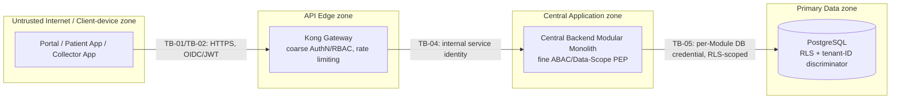
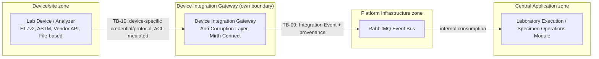
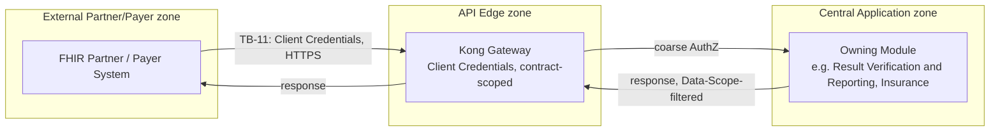
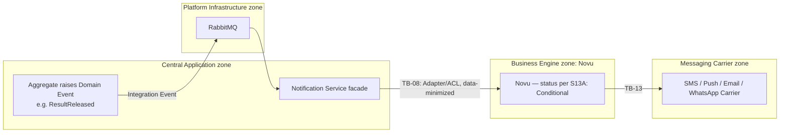
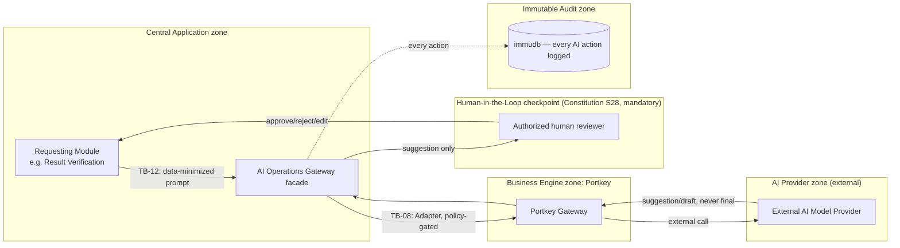
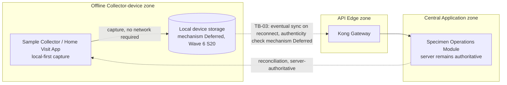
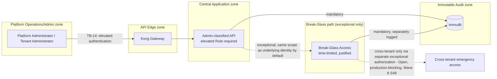
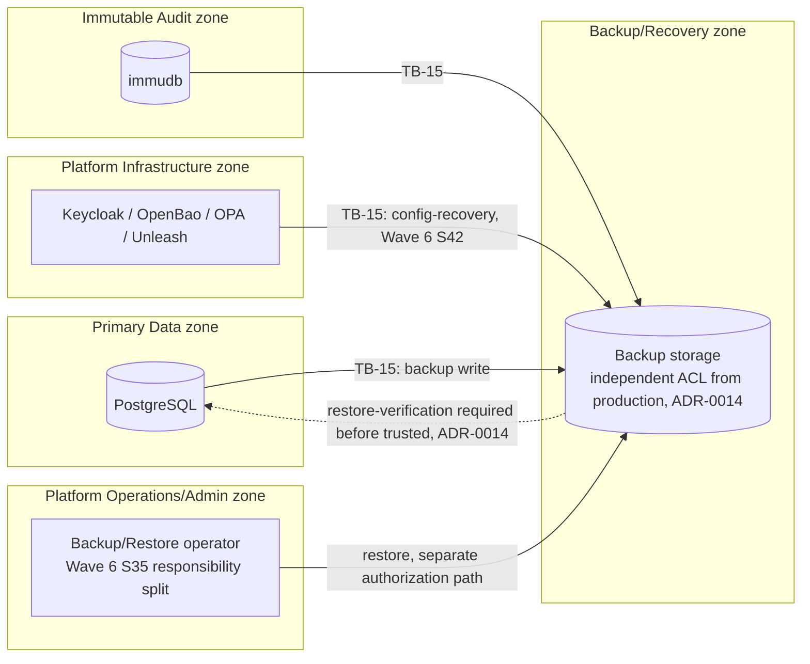
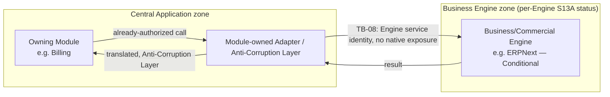

# SAD Wave 7 — Security, Privacy & Trust Boundaries

## 1. Document Metadata

| Field | Value |
|---|---|
| Wave number and title | 7 of 13 — Security, Privacy & Trust Boundaries (`docs/sad/README.md`) |
| Document Status | **Review — Corrected, Pending Joint Review with Wave 8** (Constitution §59 Document Status Vocabulary — not `Accepted`). A Wave 7 Narrow Security Erratum (§36) was applied and independently re-verified (4 review passes) prior to Wave 8 authoring; a further narrow finalization correction (§38) was applied during the joint Wave 7/8 review-and-acceptance task. This is **not** a Project Owner acceptance — the final decision on Wave 7 (and Wave 8, together) is deferred to a joint review by the Project Owner and an Independent Architecture Lead. See §37 Correction Record and §38. |
| Owner | Author of this Wave (session author, 2026-07-21) |
| Review authority | Project Owner, acting as Architecture Review Board (Constitution §57) |
| Dependencies | Wave 1 — **Accepted**; Wave 2 — **Accepted**; Wave 3 — **Accepted**; Wave 4 — **Accepted**; Wave 5 — **Accepted** (commit `0f028ff`, following erratum closure `38e1558`); Wave 6 — **Accepted** (commit `96f9eb0`, following erratum closure `8db7341`) |
| Supersedes | None |
| Superseded by | None |
| Updated | 2026-07-21 |

This Wave does not become `Accepted` in this pass, regardless of its own self-review verdict (§34 Review Report). Per the Inter-Wave Gate (`docs/sad/README.md`), only the Project Owner's explicit statement of acceptance changes this field.

## 2. Purpose and Boundaries

**Function of this Wave.** This Wave documents the platform's security architecture, privacy architecture, asset inventory, trust-zone/trust-boundary model, attack surfaces, and a STRIDE-derived threat-to-mitigation model — at the level a security architect needs to reason about the system, without designing the detailed identity/access-governance mechanics, AI/device governance detail, or numeric quality targets that later Waves own.

**What this Wave is not**, and where that content actually lives:

| Concern | Owning Wave | Why not here |
|---|---|---|
| Role catalog, RBAC/ABAC matrices, token claim schema, tenant provisioning, identity lifecycle, detailed OPA policy bundles | **Wave 8** (Multi-Tenancy, Identity & Access Governance) | This Wave defines identity *categories* and the *authorization architecture* (two-PEP model, deny-by-default); Wave 8 designs the governance mechanics that populate it |
| AI use-case approval workflows, device protocol implementation detail | **Wave 9** (AI Governance, Device Integration & Other Cross-Cutting Concerns) | This Wave defines AI/device *security and privacy* boundaries; Wave 9 designs the governance workflow and protocol detail |
| Quality scenarios, numeric non-functional targets | **Wave 11** (Quality Requirements & Quality Scenarios) | This Wave states qualitative security/privacy requirements; Wave 11 turns select ones into scenario form with fitness functions |
| Risk treatment, technical debt, evolution strategy | **Wave 12** (Risks, Technical Debt & Evolution) | This Wave records residual risk at the architecture level; Wave 12 owns the platform-wide risk-treatment narrative |
| Final consistency review, glossary closure | **Wave 13** | This Wave is reviewed internally (§34–§35); Wave 13 performs the cross-Wave closure pass |

**Difference from Deployment View (Wave 6).** Wave 6 stated *where* things run and *what* the failure domains are; this Wave states *what must be protected*, *who is trusted to do what*, and *what could go wrong* — it reuses Wave 6's deployment topology and Engine Tenant-Isolation Matrix (§13A there) as inputs, without re-deciding placement.

**Difference from Runtime View (Wave 5).** Wave 5 described *what happens* in a scenario; this Wave asks *what could go wrong* in the same scenarios and *what stops it* — the Security Data-Flow Diagrams (§9) are a security-focused reading of Wave 5's own interaction catalog, not a new set of business flows.

## 3. Security and Privacy Objectives

| Objective | Statement | Status | Source |
|---|---|---|---|
| Confidentiality | Data is disclosed only to identities with an authenticated, authorized, in-scope reason to see it | Accepted Security Rule | Constitution §21, §29, §30 |
| Integrity | Data is not modified except through an authorized, validated path; tampering is detectable | Accepted Security Rule | Constitution §16, §23, §24, §29 |
| Availability | A dependency failure degrades gracefully; it does not silently corrupt data or leave a workflow undefined | Accepted Security Rule | Constitution §34 |
| Authenticity | Every identity (human, service, device, partner) is verified through the platform's own Identity Provider or an equivalent governed boundary — never self-asserted | Accepted Security Rule | Constitution §20, ADR-0008 |
| Accountability | Every Sensitive Operation and every Break-Glass invocation is attributable to a specific, authenticated actor | Accepted Security Rule | Constitution §21, §23 |
| Accountability and evidence integrity (**corrected from "Non-repudiation," §36**) | A Sensitive Operation is attributable to a specific, authenticated actor, with a tamper-evident Audit record preserving that attribution | Accepted Security Rule (accountability/attribution); **formal non-repudiation is Conditional/Open** — it additionally depends on identity proofing, credential custody, digital signing where required, trustworthy timestamps, chain of custody, legal admissibility, and jurisdictional requirements, none of which is Decided by any source read | Constitution §23; `09-AUTHORIZATION.md` |
| Tenant isolation | No code path derives tenant scope from unverified client input; cross-tenant access is structurally hard, not merely policy-forbidden | Accepted Architectural Constraint | Constitution §18, §19, ADR-0005 |
| Clinical safety | AI never issues a final, unreviewed medical decision; a Sensitive clinical action always has a Human-in-the-Loop checkpoint | Accepted Architectural Constraint | Constitution §28, ADR-0007, CLAUDE.md Rule 15 |
| Privacy / minimum necessary | Data leaving the platform's control (notifications, AI providers, partners, exports) is minimized; consent governs sharing beyond direct-care necessity | Accepted Security Rule | Constitution §22, §30 |
| Auditability | Every Sensitive Operation, AI action, and Break-Glass access produces an immutable Audit Event, retained independently of the business record it describes | Accepted Security Rule | Constitution §23, §28 |
| Resilience against third-party failure | A third-party Engine's failure or compromise is isolated behind its owning Module's Adapter/Anti-Corruption Layer — it does not propagate unfiltered into the platform's own contract | Accepted Architectural Constraint | ADR-0006; `11-API-SECURITY.md` (API10) |

**No compliance certification is claimed anywhere in this Wave** (Constitution §31 — compliance-capability is architected for; an actual compliance determination is outside this Constitution's, and this Wave's, authority).

## 4. Asset Catalog

Every Asset below carries: Owner, Source of Truth, Confidentiality/Integrity/Availability need (Low/Medium/High, qualitative — no numeric SLA invented), Tenant scope, Privacy relevance, Retention status, Legal dependency, and Trust zones traversed (§7).

| ID | Asset | Owner | Source of Truth | C / I / A | Tenant scope | Privacy relevance | Retention status | Legal dependency | Trust zones traversed |
|---|---|---|---|---|---|---|---|---|---|
| AS-01 | Patient identifiers and demographics | Patient Management Module | Platform-owned PostgreSQL schema | High / High / High | Tenant-scoped | Directly identifying; Sensitive Personal/Health | Not fixed by any source — Deferred | Egypt PDPL 151/2020 (§24, R-13) | Client-device, API Edge, Central Application, Primary Data |
| AS-02 | Clinical orders/results/reports (`TestOrder`, `TestResult`, `DiagnosticReport`) | Diagnostic Ordering / Result Verification and Reporting Modules | Platform-owned PostgreSQL schema | High / High / High | Tenant-scoped | Sensitive Personal/Health, highest clinical-safety stakes (Discovery: "the highest-stakes... Aggregate") | Not fixed — Deferred | Egypt PDPL; clinical-record retention rules `Requires Legal Verification` | Client-device, API Edge, Central Application, Primary Data, Immutable Audit |
| AS-03 | Specimen/provenance/chain-of-custody data | Specimen Operations Module | Platform-owned PostgreSQL schema | High / High / Medium | Tenant-scoped | Sensitive Personal/Health (linked to a Patient) | Not fixed — Deferred | Egypt PDPL | Client-device, Device/site, Central Application, Primary Data |
| AS-04 | Credentials, sessions, and authorization policies | Identity and Access (Keycloak); Identity and Access / OPA | Keycloak identity store; OPA policy bundles | High / High / High | Cross-tenant (platform-shared) infrastructure, tenant-scoped claims within | Security Secret / Internal Operational | Not fixed — Deferred | None identified | Untrusted/client, API Edge, Platform Infrastructure |
| AS-05 | Tenant/organization configuration | Tenant and Organization Management Module | Platform-owned PostgreSQL schema | Medium / High / Medium | Tenant-scoped | Internal Operational | Not fixed — Deferred | None identified | API Edge, Central Application, Primary Data |
| AS-06 | Secrets and cryptographic material | Platform Operations (OpenBao) | OpenBao | High / High / High | Cross-tenant infrastructure; per-Tenant secrets scoped within | Security Secret | Not fixed — Deferred | None identified | Platform Infrastructure |
| AS-07 | Audit Events | Audit and Compliance (immudb) | immudb | Medium / High / High | Tenant-scoped (attributed) | Contains references to Sensitive Personal/Health context without necessarily duplicating full clinical content | Not fixed — Deferred (Constitution §23 requires immutability and independent retention, not a numeric duration) | Egypt PDPL (audit trail may itself be personal data) | Immutable Audit zone |
| AS-08 | Device raw payloads | Device Integration Gateway | Device Integration Gateway's own boundary store | High / High / Medium | Tenant-scoped (once attributed) | Sensitive Personal/Health once linked to a Patient/Specimen | Not fixed — Deferred | Egypt PDPL, once linked | Device/site, Offline Collector-device (where applicable), Central Application |
| AS-09 | AI prompts/outputs/provenance | AI Operations Gateway | AI Operations Gateway's own audit-trail entries (Portkey-mediated) | High / Medium / Medium | Tenant-scoped | Sensitive Personal/Health if clinical context is included in a prompt | Not fixed — Deferred | Egypt PDPL; external AI-provider disclosure (§24) | Central Application, AI Provider (external), Immutable Audit |
| AS-10 | Billing/insurance/payment data | Billing / Insurance and Corporate Contracts Modules | Platform-owned schema + ERPNext/openIMIS/Kill Bill's own stores | High / High / Medium | Tenant-scoped | Sensitive Personal (financial) | Not fixed — Deferred | Egypt e-invoicing mandate (§24, R-13); PDPL | Central Application, Business Engine zones, Primary Data |
| AS-11 | Workforce/payroll data | Workforce Management Module | Frappe HR's own store | High / High / Medium | Tenant-scoped | Sensitive Personal | Not fixed — Deferred | Egypt labor/social-insurance law (§24, R-13) | Central Application, Business Engine zone |
| AS-12 | Documents/signatures | Document Management Module | Alfresco / Documenso's own stores | High / High / Medium | Tenant-scoped | May contain Sensitive Personal/Health (signed clinical/consent documents) | Not fixed — Deferred | Egypt e-signature legal validity `Requires Legal Verification` | Central Application, Business Engine zone |
| AS-13 | Analytics/read models | Analytics facade (Superset, derived schema) | Analytics-owned derived PostgreSQL schema | Medium / Medium / Low | Tenant-scoped (must remain so through derivation) | De-identification/pseudonymization status not established by any source (§24) | Not fixed — Deferred | Egypt PDPL if not de-identified | Central Application, Primary Data (derived) |
| AS-14 | Integration Events | Publishing Module; transported via RabbitMQ | Event payload, transient in the broker; may be persisted per-Module | Medium / High / Medium | Tenant-scoped (carried in event payload) | May carry Sensitive Personal/Health depending on the event | Not fixed — Deferred | Egypt PDPL if carrying personal data | Central Application, Platform Infrastructure |
| AS-15 | Offline Home Collection local data | Sample Collector/Home Visit App (client-local) | Device-local storage, mechanism Deferred (Wave 6 §20) | High / Medium / Medium | Tenant-scoped once synced | Sensitive Personal/Health (specimen collection event, patient-linked) | Not fixed — Deferred | Egypt PDPL; device-loss exposure (§18) | Offline Collector-device zone |
| AS-16 | Backups | Platform Operations (per Wave 6 §28) | Backup storage per store (mechanism largely Deferred) | High / High / Medium | Mixed — Shared-tier backups may co-locate multiple Tenants' data; Dedicated-tier backups are single-Tenant | Same sensitivity as the data backed up | Not fixed — Deferred (ADR-0014) | Egypt PDPL; cross-region replication tied to R-13 | Backup/Recovery zone |
| AS-17 | Logs/metrics/traces | Owning Module/component (operational, not Audit) | Operational log/metric/trace stream, mechanism not designed (Wave 6 §25) | Medium / Medium / Medium | Mixed | Must never contain medical data content or credentials in plaintext (Constitution §48 Logging Policy) — privacy relevance is primarily a *leakage risk*, not an intended data holding | Not fixed — Deferred | None identified, contingent on no PHI leakage | Platform Infrastructure, Platform Operations/Admin |

No retention number, encryption algorithm, or specific storage product is invented for any Asset above beyond what Wave 6 or the cited sources already state.

## 5. Data Classification Model

No Accepted, source-confirmed formal legal data-classification taxonomy exists anywhere in this repository (Constitution §30 states medical data is "highly sensitive by default" but does not enumerate a full taxonomy; no Egypt-specific legal classification scheme has been confirmed — §24, R-13). Per the No-Guessing Rule, this Wave does not invent one. The following are **SAD-Level Security Design** working categories only, used consistently across §4 (Asset Catalog), §8 (Trust Boundary Catalog), and §11 (STRIDE):

| Category | Definition | Representative Assets |
|---|---|---|
| Public | No confidentiality requirement; safe for unauthenticated disclosure | None identified among this platform's own data — even marketing/public-API-catalog content is out of this Wave's asset scope |
| Internal Operational | Requires authentication but is not independently sensitive if disclosed within the platform's own operational boundary | AS-05 (Tenant/organization configuration, non-secret fields), AS-17 (logs/metrics/traces, PHI-scrubbed) |
| Confidential | Business-sensitive; disclosure outside authorized parties causes competitive or operational harm | AS-13 (Analytics/read models), AS-10 (billing, non-health-linked fields) |
| Sensitive Personal/Health | Directly or indirectly identifies a Patient or links to health information | AS-01, AS-02, AS-03, AS-08, AS-09 (where clinical context is included), AS-10 (health-linked fields), AS-11, AS-12, AS-15 |
| Security Secret | Credentials, keys, tokens, policy material whose disclosure enables impersonation or bypass | AS-04, AS-06 |
| Immutable Audit | Append-only record of Sensitive Operations; itself may reference Sensitive Personal/Health context | AS-07 |

**This is a SAD-Level Security Design labeling, not a claim of Egyptian law or any named international framework's (e.g. HIPAA) taxonomy** — no such claim is made anywhere in this Wave (§24, §31 Explicit Non-Decisions).

## 6. Identities and Security Principals

Categories only — no role matrix, no token-claim schema, no per-role permission list (Wave 8's territory). Drawn from `08-AUTHENTICATION.md`'s own identity-category list, cross-checked against the Discovery persona catalog's own top-level groupings (`W2-persona-catalog.md`, 39 personas across Clinical/Care, Laboratory, Front-Office, Financial, Workforce, Supply Chain, Commercial/External, Technical/Platform, Governance/Oversight — the exhaustive per-persona list is Wave 8's territory, not repeated here).

| Category | Description | Authentication mechanism | Source |
|---|---|---|---|
| Human users (clinical/patient-facing) | Patients, Doctors, Laboratory Staff, and similar direct-care/direct-use personas | Keycloak-issued OIDC session (Accepted, ADR-0008) — Authorization Code + PKCE is `08-AUTHENTICATION.md`'s own Recommendation for the interactive-client grant, not yet an independent ADR (**status clarified, §36**) | `08-AUTHENTICATION.md` |
| Human users (operational/back-office) | Finance, Inventory, Supplier, Support, Workforce/HR personas | Keycloak-issued OIDC session | `08-AUTHENTICATION.md`; Discovery persona catalog |
| Tenant administrators | Organization/Branch-level administrative personas, scoped to their own Tenant | Keycloak-issued OIDC session, elevated Role | Discovery `W2-persona-catalog.md` ("Tenant Administrator," "Branch Administrator") |
| Platform administrators | Cross-organization/platform-wide administrative persona | Keycloak-issued OIDC session, highest-privilege Role | Discovery `W2-persona-catalog.md` — explicitly flagged "**Platform-wide — highest-privilege persona in the model**, must be Least-Privilege-scoped" |
| Service identities | Every Module and Independent Component's own dedicated identity | Dedicated machine identity, one per Module/Independent Component (Accepted) — Client Credentials is `08-AUTHENTICATION.md`'s own Recommendation for the grant type, not yet ratified (**status clarified, §36**) | `08-AUTHENTICATION.md` |
| Device identities | Lab analyzers, portable collection devices | Do not authenticate directly to Domain Modules or native Engine APIs; device-originated flows are mediated by Device Integration Gateway's own Anti-Corruption Layer (`08-AUTHENTICATION.md` states devices "are not directly Keycloak-authenticated end users," which this Wave preserves as the boundary statement it is — **corrected, §36**: exact device identity authority, certificate scheme, credential format, and protocol-level authentication mechanism, including whether/how Keycloak is involved at any layer, remain Wave 9 decisions, not settled by this statement) | `08-AUTHENTICATION.md`; ADR-0006 |
| Partner systems | External business-relationship machine-to-machine callers (FHIR/insurance/payer integrations) | Authenticated, contract-scoped machine identity (Accepted requirement) — Client Credentials is `08-AUTHENTICATION.md`'s own Recommendation for the specific grant, not yet ratified (**status clarified, §36**) | `08-AUTHENTICATION.md` |
| External providers | AI Model Provider, Messaging Carriers, Payer systems — the platform calling outward, not inward | Provider-specific, mediated through the owning Module's/Gateway's Adapter | ADR-0007; §17, §22 below |
| Background jobs | Scheduled/deferred work triggers (Wave 6 §8 Background Workers) | Internal service identity, no external-facing authentication surface | Constitution §48; Wave 4 §13 |
| Engine service identities | Each Business/Commercial Engine's own internal service account, used only by its owning Module's Adapter | Engine-specific (not platform-Keycloak-issued for the Engine's own internal admin surface — see §20) | Reuse research (Engine-specific, varies) |
| Governance/oversight personas | Auditor (read-only by design), Compliance Staff, Legal Reviewer, Regulator | Keycloak-issued OIDC session, read-only or narrowly-scoped Role | Discovery `W2-persona-catalog.md` |

**Not designed here**: exact Role names, Permission grants, Policy axis values, token claim schema, tenant-provisioning workflow, identity lifecycle (onboarding/offboarding) — all Wave 8.

## 7. Trust-Zone Model

| Zone | Contents | Owner | Trust assumptions | Incoming flows | Outgoing flows | Data classes | Required controls | Deployment-mode variance |
|---|---|---|---|---|---|---|---|---|
| Untrusted Internet/client zone | Public internet, unauthenticated traffic | N/A (outside platform control) | Zero trust — nothing here is trusted by default | Requests toward API Edge | Responses only | None held here | Rate limiting, input validation at Edge | Uniform across all modes |
| Client-device zone | Browser/mobile running Web Platform, Patient App, Collector App | End user / Platform (client code) | Authenticated after login; client itself is not a trust boundary for authorization (Constitution §21 — never UI-enforced) | User input | API calls to Edge | Sensitive Personal/Health (rendered, not authoritative) | No client-side authorization authority; TLS to Edge | Same across modes; Offline Collector-device is a distinct sub-zone (below) |
| Offline Collector-device zone | Sample Collector/Home Visit App's local storage during disconnected operation | End user (Collector) / Platform (client code) | Reduced trust relative to the online Client-device zone — device loss/theft is a live threat (§18) | Local capture only | Sync to API Edge on reconnect | Sensitive Personal/Health (AS-15) | Local persistence mechanism Deferred (Wave 6 §20); server remains authoritative after reconciliation | Applies only to Home Collection Logistics workflow |
| API Edge zone | Kong Gateway | Platform Operations | Trusted to enforce coarse AuthN/RBAC; **abuse/resource-exhaustion protection is a Required security capability at this boundary (Accepted), currently met by a Recommended Kong rate-limiting plugin configuration with thresholds Deferred (corrected, §36)** — not yet a fully Accepted Control; not trusted with fine-grained Data Scope decisions | From Untrusted/Client-device/Partner/Device zones | To Central Application zone | Passes through all classes; holds none authoritatively | OIDC/JWT validation, coarse RBAC, rate limiting (capability Required, configuration Recommendation, thresholds Deferred), schema validation | Uniform across modes (Kong self-hostable, ADR-0009) |
| Central Application zone | Central Backend Modular Monolith (27 logical Modules/facades) | Platform Operations (Shared) / Tenant+Platform (Dedicated) / Customer (On-Prem) | Trusted to enforce fine-grained ABAC/Data-Scope per Constitution §21; internal Zero Trust between Modules still applies | From API Edge, Device Integration Gateway (via broker), scheduled triggers | To Platform Infrastructure zone, Primary Data zone, Business Engine zones, External Partner/Payer zone, AI Provider zone | All classes except raw Security Secrets (fetched, not held) | Backend-Enforced Authorization, two-PEP model, Zero Trust internally | Deployment-mode responsibility varies (Wave 6 §35); logical architecture identical |
| Platform Infrastructure zone | Keycloak, OPA, OpenBao, RabbitMQ, Unleash | Platform Operations (Shared) / varies (Dedicated/On-Prem) | Trusted as the cross-cutting security primitives every other zone depends on — compromise here is platform-wide | From Central Application, API Edge (Keycloak/OPA only) | Decisions/secrets/events back to callers | Security Secret, Internal Operational | Least Privilege service accounts; no zone bypasses these for its own security function | Wave 6 §11/§12 deployment-mode table applies unchanged |
| Primary Data zone | PostgreSQL (all Module-owned schemas) | Platform Operations (Shared) / Tenant+Platform (Dedicated) / Customer (On-Prem) | Trusted as the authoritative store; RLS enforces tenant boundary within it | From Central Application only (never directly from Edge or external zones) | Query results back to Central Application | All Sensitive Personal/Health and Confidential classes | Schema per Module, RLS + tenant-ID discriminator (ADR-0013), no direct external access | Hosting form varies (Wave 6 §14), logical boundary identical |
| Immutable Audit zone | immudb | Audit and Compliance | Append-only trust — even a compromised Central Application identity cannot rewrite history | Audit Events from Central Application, API Edge (auth decisions) | Read access for authorized audit/compliance review | Immutable Audit (AS-07) | Immutability enforced at the store level (Constitution §23) | Uniform across modes |
| Device/site zone | Device Integration Gateway (+ Mirth Connect), near-device or cloud-side | Platform Operations / Customer (Hybrid/On-Prem site) | Reduced trust relative to Central Application — device payloads are treated as untrusted input requiring an Anti-Corruption Layer | From lab devices (HL7v2/ASTM/Vendor API/File-based) | Integration Events to broker | AS-08 (device raw payloads) | Anti-Corruption Layer, fault isolation, provenance tracking (ADR-0006) | Near-device (On-Prem/Hybrid) vs. cloud-side (SaaS) — Wave 6 §18/§19 |
| Business Engine zones (per Engine) | Each of the 16 stateful Business/Commercial Engines, individually | Platform Operations (Shared, per §13A status) / Tenant+Platform (Dedicated) | Trust varies per Engine's own §13A tenant-isolation status (Approved by evidence / Conditional / Not applicable) — never assumed uniform | From owning Module's Adapter/ACL only | Results back through the same Adapter | Varies by Engine (AS-02, AS-10, AS-11, AS-12 primarily) | No native Engine exposure (§15); Adapter/ACL boundary; §13A due-diligence gate for Conditional Engines | Wave 6 §13A applies unchanged; each Engine's own zone, not one undifferentiated "Engine zone" |
| External Partner/Payer zone | FHIR partners, Payer systems, insurance/eligibility counterparts | External party (not platform-controlled) | Zero trust — authenticated, contract-scoped, never assumed benign | Partner-initiated FHIR/API calls | Platform-initiated eligibility/claims calls | AS-02 (result exchange), AS-10 (claims) | Client Credentials, contract-scoped; webhook signing for outbound (§22) | Uniform across modes |
| Messaging Carrier zone | SMS/Push/Email/WhatsApp carriers (via Novu) | External party | Zero trust; data minimization applies to what is sent | Delivery-status callbacks | Notification payloads | AS-01 (contact info), possibly AS-02 fragments (result-ready notices, not full results) | Data minimization (Constitution §30); no full clinical content in notification payloads unless explicitly designed otherwise (not established by any source) | Uniform across modes |
| AI Provider zone | External AI Model Provider(s), reached via Portkey Gateway | External party | Zero trust; sensitive-data-to-provider requires an approved policy (Constitution §28) before any call | AI responses | Prompts (data minimized) | AS-09 | Human-in-the-Loop, prompt/output audit, policy gate on sensitive outbound data | Uniform across modes |
| Customer-controlled On-Prem zone | Entire On-Premise deployment (Wave 6 §18) | Customer | Customer owns the environment; platform's own trust model (zones above) still applies *within* it — On-Prem does not collapse the internal zone boundaries | N/A (self-contained) | N/A (self-contained, external calls follow the same external-zone rules) | All classes, contained within customer's own environment | Same internal-zone controls apply; customer additionally owns environment-level security (Wave 6 §35) | On-Premise only |
| Platform Operations/Admin zone | Administrative access paths (platform-level and Tenant-level admin) | Platform Operations / Tenant Administrators | Highest-privilege zone; Break-Glass and elevated administrative actions originate here | Administrator input | Administrative actions across every other zone | All classes, by administrative necessity | Elevated authorization, Break-Glass discipline, mandatory audit (Constitution §21) | Uniform across modes; boundary design is Wave 8's detailed territory |
| Backup/Recovery zone | Backup storage for every Tier-1/Tier-2 store (Wave 6 §28) | Platform Operations / Tenant (per Wave 6 §35 responsibility split) | Immutable/protected backup storage required for Tier 1/2 (ADR-0014) — access-controlled independently from the production store's own ACL | Backup writes from Primary Data, Immutable Audit, Platform Infrastructure zones | Restore reads, under a separate authorization path | All classes, mirrored from source | Independent access control from production; encrypted at rest (ADR-0014) | Wave 6 §28/§35 responsibility split applies unchanged |

## 8. Trust Boundary Catalog

| Boundary ID | Source zone | Destination zone | Runtime scenarios (Wave 5) | Assets crossing | AuthN requirement | AuthZ requirement | Encryption requirement (semantic) | Input validation | Audit requirement | Failure behavior | Residual risk | Owning implementation Wave |
|---|---|---|---|---|---|---|---|---|---|---|---|---|
| TB-01 | Untrusted Internet/client | API Edge | All (R1–R12) | None held; requests only | Required (except public/health-check paths, none identified as data-bearing) | Coarse RBAC at Edge | In transit, semantic requirement only — no TLS version/cipher chosen (§31) | Structural/schema validation at Edge | Failed-auth attempts logged operationally; Sensitive-Operation-adjacent denials audited | Fail closed (401/403) | Standard internet-facing exposure; DoS (§10, §11) | Wave 8 (AuthN mechanics) |
| TB-02 | Client-device | API Edge | All | Varies by scenario | Required | Coarse RBAC | In transit | Client input validated again at Module boundary (never trust client-side validation alone) | Same as TB-01 | Fail closed | Client-side tampering of requests (mitigated by server-side re-validation) | Wave 8 |
| TB-03 | Offline Collector-device | API Edge (on reconnect sync) | Home Collection workflow | AS-15 | Required (deferred until reconnect) | Coarse RBAC + sync-specific authenticity check (mechanism Deferred, §18) | In transit; at-rest (local) Deferred | Sync payload re-validated at Module boundary | Sync event itself should be audited (mechanism not designed — Open, §32) | Local buffering continues; server remains authoritative after reconciliation (Wave 6 §20) | Device loss/theft, tampering, duplicate sync (§18) | Wave 9 (device/offline protocol detail) |
| TB-04 | API Edge | Central Application | All | Varies | Internal service identity (Zero Trust — Constitution §21) | Coarse RBAC already applied; Module still performs its own ABAC | In transit (internal) | Re-validated at Module boundary | N/A (internal hop, not itself an Audit Event trigger) | Fail closed | Edge compromise would be high-impact (§10) | Wave 8 |
| TB-05 | Central Application | Primary Data (PostgreSQL) | All data-touching scenarios | All Sensitive Personal/Health, Confidential classes | Module's own DB credential (per-Module, Schema per Module) | RLS + tenant-ID discriminator (ADR-0013) | At rest — **corrected attribution, §36**: not an Accepted requirement for the primary/live store by any source read (ADR-0014's own encryption-at-rest text is scoped explicitly to backups, not primary data; Constitution §29/§30, re-read fresh, state no general encryption-at-rest rule) — classified **SAD-Level Security Requirement (Recommended)**, algorithm not chosen (§31) | Parameterized queries assumed (no SQL-injection-specific control named by any source — flagged, §11) | Not itself an Audit Event (Sensitive Operations audited at the Module/Aggregate layer, not the DB call layer) | Transaction atomicity preserved (Wave 6 §32) | RLS bypass, missing tenant filter (§12) | Wave 8 (identity), implementation (query layer) |
| TB-06 | Central Application | Platform Infrastructure (Keycloak/OPA/OpenBao/RabbitMQ/Unleash) | All | Security Secret, policy decisions | Service identity — Client Credentials is a Recommendation, not yet ratified (§13, §36) | Least Privilege service accounts | In transit (internal) | N/A (structured internal protocol per product) | Secret-read auditing is a Recommendation, not yet ratified (`12-SECRETS-AND-KEYS.md`, corrected §36) | Fail closed for new authentication/authorization decisions (deny by default) — **scenario-specific detail in §14A**, not a universal certainty (corrected, §36) | Compromise of any one is platform-wide (§10) | Wave 8 |
| TB-07 | Central Application | Immutable Audit (immudb) | Every Sensitive Operation, AI action, Break-Glass | AS-07 | Service identity | Write-only for the writing Module; read access separately governed | At rest (immudb's own) | N/A | This *is* the Audit mechanism | Audit-store-unavailable behavior is Open (Wave 6 §38, carried here §32) | Unaudited Sensitive Operation if fail-open (§32 residual) | Wave 8 |
| TB-08 | Central Application | Business Engine zones (via owning Module's Adapter/ACL) | R9 (Billing/Insurance example), others per Engine | Varies (AS-02, AS-10, AS-11, AS-12) | Engine-specific service identity | Adapter enforces the calling Module's own authorization decision before the call is made | In transit; at-rest per Engine's own posture (largely not documented, §19/§20) | Adapter translates/validates (Anti-Corruption Layer, ADR-0006 pattern extended) | Not itself a separate Audit Event beyond the Module-level Sensitive Operation audit | No native Engine exposure; Adapter surfaces failure (Wave 6 §32) | Per-Engine, per §13A status — Conditional Engines carry unresolved isolation risk | Wave 8 (isolation validation) |
| TB-09 | Central Application | Device Integration Gateway (via broker) | R4, R5 | AS-08 (post-ingestion, normalized) | Service identity | N/A (Gateway publishes, Module consumes — not a caller/callee authorization in the usual sense) | In transit | Already validated at the Gateway's own ACL | Not separately audited beyond Sensitive Operation triggers downstream | Isolated failure (Wave 5 Invariant 11) | Device spoofing/replay upstream of this boundary (§16) | Wave 9 |
| TB-10 | Device/site | Device Integration Gateway | R4, R5 | AS-08 (raw) | Device-specific credential/protocol scheme, Gateway-mediated | N/A at this boundary (device identity is not a platform Role) | Protocol-dependent (HL7v2/ASTM typically unencrypted by standard default — flagged, §16/§31) | Anti-Corruption Layer validates/normalizes; malformed payloads isolated | Provenance-field presence check (Constitution §24) | Fault-injection-tested isolation (ADR-0006) | Device spoofing, malformed/replay payloads (§16) | Wave 9 |
| TB-11 | Central Application | External Partner/Payer zone | R9, R11 | AS-02 (result exchange), AS-10 (claims) | Authenticated, contract-scoped machine identity (Accepted requirement) — Client Credentials is the specific grant `08-AUTHENTICATION.md` Recommends, not yet ratified (§36) | Partner-contract-scoped Data Scope | In transit | Partner-supplied FHIR payloads validated at the Module boundary | Cross-tenant/cross-partner access is audited (mirrors Break-Glass treatment, `14-MULTI-TENANCY.md`) | Claim/exchange remains pending on failure (Wave 6 §32) | Partner credential compromise, webhook authenticity (§22) | Wave 8 |
| TB-12 | Central Application | AI Provider zone | AI-assisted scenarios (R10) | AS-09 | Portkey-mediated, provider-specific | Policy gate required before any sensitive-data outbound call (Constitution §28) | In transit | Prompt content minimized (data minimization, Constitution §30) | Every AI action logged (ADR-0007 completeness requirement) | HITL means no clinical decision depends on AI alone (Wave 6 §32) | Prompt injection, provider-side data retention (§17) | Wave 9 |
| TB-13 | Central Application | Messaging Carrier zone | R8 (Notification) | Contact info, notification content | Novu-mediated service identity | N/A (outbound notification, not a caller authorization) | In transit (carrier-dependent) | N/A | Delivery-status recorded (Wave 5 R8) | Business fact preserved even if delivery fails (Wave 6 §32) | Notification content over-disclosure (§24) | Wave 9 |
| TB-14 | Platform Operations/Admin | Every other zone | Administrative/support scenarios | All classes, by necessity | Elevated authentication | Elevated authorization; Break-Glass discipline applies to every invocation, but **Break-Glass does not itself cross a Tenant Boundary by default — cross-tenant access is a separate, exceptional, Open, production-blocking authorization, not a routine condition Break-Glass discipline normally handles (corrected, §38, matching Wave 8 §49 B1)** | N/A (internal) | N/A | Mandatory (Constitution §21 Break-Glass requirement) | Break-Glass is time-limited, justified, audited | Standing-override misuse if discipline lapses (§11 THR-003, §32 item 14); cross-tenant Break-Glass invocation specifically carries an additional Open production-blocking status (Wave 8 §20/§49) | Wave 8 |
| TB-15 | Primary Data / Immutable Audit / Platform Infrastructure | Backup/Recovery zone | N/A (operational, not a runtime scenario) | Mirrored copies of all classes | Backup-process service identity, independent from production ACL (ADR-0014) | Independent access control | At rest (ADR-0014 posture) | N/A | Backup/restore execution should be an Audit Event (Constitution §23 extended — not explicitly stated by any source, flagged §32) | Restore-verification required before a backup is trusted (ADR-0014) | Backup access itself as an attack vector (§10, §19) | Wave 6 (§28/§35 responsibility), Wave 12 |

No specific TLS version, cipher suite, or network-segmentation product is stated for any boundary above (§31 Explicit Non-Decisions).

## 9. Security Data-Flow Diagrams

All diagrams below are `flowchart` sketches labeled **not C4** (per the `c4-architecture` skill's own guidance that a genuinely different visualization — trust-boundary/data-flow — is appropriate where C4's container/deployment abstraction is not the point). Every Trust Zone from §7 that appears is named explicitly; a Deployment Node is never treated as a Trust Boundary by default (a zone boundary is drawn only where §7/§8 actually define one). Webhook Delivery is not drawn as a confirmed component anywhere below, consistent with Wave 5/6's own unassigned-placeholder treatment.

### Diagram 1 — Portal/Client → Kong → Backend → Data

### Diagram 2 — Device → Device Gateway → Broker → Laboratory Module

### Diagram 3 — Partner/FHIR Exchange

### Diagram 4 — Notification Flow

### Diagram 5 — AI Gateway → AI Provider → Human Review

### Diagram 6 — Offline Collector Capture and Synchronization

### Diagram 7 — Administrative/Operations Access

### Diagram 8 — Backup and Restore Flow

### Diagram 9 — Business Engine Adapter Flow

## 10. Attack Surface Inventory

| Surface | Exposure | Assets | Likely threat families (STRIDE) | Current controls | Missing controls | Verification |
|---|---|---|---|---|---|---|
| Client apps (Web Platform, Patient App, Collector App) | Public/internet-facing (client code, not server) | AS-01, AS-02 (rendered) | Spoofing (session theft), Tampering (client-side manipulation) | Server-side re-validation of everything (Constitution §21); no client-side authorization authority | Client-hardening detail (e.g., certificate pinning) not designed by any source | Security tests calling backend directly, bypassing UI (Constitution §21) |
| Public/Partner API edge (Kong Gateway) | Public/internet-facing, contract-scoped for Partners | All classes, in transit | Spoofing, DoS, Broken Object/Function-Level AuthZ (OWASP API1/API4/API5) | OIDC/JWT, coarse RBAC, rate limiting (`11-API-SECURITY.md`) | Numeric rate-limit thresholds Deferred (Wave 5/6); WAF product not chosen (§31) | Quality Gates before Publish (`04-API-GOVERNANCE.md`) |
| Admin interfaces (platform + Tenant admin) | Authenticated, elevated-Role-gated | AS-04, AS-05, all classes by administrative necessity | Elevation of Privilege, Repudiation | Elevated authorization, Break-Glass discipline, mandatory audit | Admin-interface-specific hardening (e.g., IP allowlisting) not designed by any source | Audit log review (Constitution §21) |
| Device protocols (HL7v2, ASTM, Vendor API, File-based) | Device/site-local or vendor-network-facing | AS-08 | Spoofing (device impersonation), Tampering, Replay (SEC-06) | Anti-Corruption Layer, fault isolation, provenance tracking (ADR-0006) | Replay-protection mechanism not yet confirmed implemented (SEC-06, "not yet confirmed") | Fault-injection tests (Constitution §24) |
| Event broker (RabbitMQ) | Internal, Platform Infrastructure zone | AS-14 | Tampering, Information Disclosure (if a consumer receives events outside its scope), DoS | Internal-only exposure (no direct external access); Zero Trust between Modules | Event-level authorization/schema-validation-at-broker-level not fully designed (§22) | Contract tests on event schemas (Wave 5) |
| Databases (PostgreSQL, per-Engine stores) | Internal, Primary Data / Business Engine zones | AS-02, AS-03, AS-10, AS-11, AS-12 | Information Disclosure (cross-tenant/cross-schema), Tampering | RLS + tenant-ID discriminator (ADR-0013), Schema per Module (ADR-0003) | SQL-injection-specific control not named by any source (flagged, §11 below); per-Engine tenant isolation Conditional for 13 of 16 Engines (Wave 6 §13A) | Multi-Tenant Isolation Testing (Constitution §36) |
| Engine admin interfaces (per-Engine own admin UI/API) | Internal, Business Engine zone — never platform-externally-exposed by design | AS-04-adjacent (Engine's own credentials) | Elevation of Privilege, Spoofing | No native Engine exposure (Wave 6 §23; `11-API-SECURITY.md` API10) | Per-Engine admin-interface hardening not documented by any Reuse source (§20) | Not designed — flagged as an Open Security Decision (§32) |
| Webhooks (outbound delivery) | Internet-facing, platform-initiated toward external Partner endpoints | AS-02, AS-10 fragments | Tampering (payload), Spoofing (Partner endpoint), Repudiation | HMAC signing, HTTPS-only, `eventId`-based idempotency (`19-WEBHOOKS.md`) | Webhook Delivery's owning component remains unassigned (Wave 5/6) — this Wave does not resolve it (§34) | Not designed pending ownership resolution |
| External provider calls (AI Provider, Payer, Messaging Carrier) | Outbound, platform-initiated | AS-09, AS-10, AS-01 fragments | Information Disclosure (over-sharing), Tampering (response manipulation) | Data minimization (Constitution §30), policy gate for AI (Constitution §28), Adapter/ACL translation | Provider-side data-retention/logging dependency not controlled by the platform (§17) | Policy-gate check on outbound sensitive-data calls (ADR-0007) |
| Offline local storage (Collector device) | Physical device, potentially lost/stolen | AS-15 | Information Disclosure (device loss), Tampering, Repudiation | Local-first capture + eventual sync (Wave 6 §20); server remains authoritative | Local storage encryption/access-control mechanism Deferred (Wave 6 §20; §18 below) | Not designed — Open Security Decision (§32) |
| Backup interfaces | Internal, Backup/Recovery zone | AS-16 (mirrors all classes) | Information Disclosure (backup theft), Tampering | Independent ACL from production, encrypted at rest (ADR-0014) | Restore-authorization-path detail not fully designed (§32) | Restore-verification required before trust (ADR-0014) |
| Secrets/policy/config interfaces (OpenBao, OPA bundles, Unleash) | Internal, Platform Infrastructure zone | AS-04, AS-06 | Information Disclosure, Tampering, Elevation of Privilege | Centralized secret store, audited access (`12-SECRETS-AND-KEYS.md`); policy bundles versioned | Recovery mechanism Deferred for OPA/Unleash (Wave 6 §42/§12) | Audit of every secret read (`12-SECRETS-AND-KEYS.md`) |
| Software supply chain (24 Engines, 4 Libraries, dependencies) | Build/deployment-time, plus each Engine's own runtime CVE exposure | Varies by Engine | Tampering (compromised dependency), Elevation of Privilege (vulnerable Engine) | License/version tracking (Technology Baseline, Frozen); per-Engine CVE posture varies (§20) | No SBOM status confirmed by any source; no dependency-vulnerability-scanning tool named (§29, §31) | Not designed — flagged (§29) |
| On-Prem support/update channel | Customer-controlled environment, platform-provided updates | All classes, within customer environment | Tampering (malicious update), Spoofing (fake update source) | Software update delivery mechanism not fixed by any source (Wave 6 §31) | Update-integrity verification mechanism not designed by any source | Not designed — Open Security Decision (§32) |

## 11. STRIDE Threat Model

Threat IDs `THR-001`–`THR-024`. Threats THR-001 through THR-012 are drawn directly from the Discovery-phase Security/Privacy/Clinical-Safety Risk Register (`W12-security-privacy-clinical-safety-register.md`, SEC-01 through SEC-13, SEC-08 consolidated into SEC-04), re-cast in STRIDE terms and cross-referenced to this Wave's own Trust Zones/Boundaries/Assets. Threats THR-013 onward are newly identified in this Wave by applying STRIDE systematically to the entities/processes/stores/flows/boundaries in §7–§9 that the SEC register did not already cover. No numeric risk score is invented anywhere — severity is qualitative (Low/Medium/Medium-High/High/Highest), matching the SEC register's own convention.

| Threat ID | STRIDE category | Asset | Entry point | Boundary | Scenario | Preconditions | Threat description | Potential impact | Existing mitigation | Missing mitigation | Residual status | Verification | Traceability |
|---|---|---|---|---|---|---|---|---|---|---|---|---|---|
| THR-001 | Denial of Service | API Edge zone (platform-wide) | TB-01 | Untrusted Internet → API Edge | All | No platform-wide rate-limiting policy fully implemented | Unthrottled requests degrade service for all Tenants sharing infrastructure | Service degradation, cross-tenant availability impact | Abuse-protection is a **Required Security Capability (Accepted)**; Kong rate-limiting/circuit-breaking is the **Recommendation** meeting it (`13-RATE-LIMITING.md`, `10-API-GATEWAY.md`) — **status clarified, §36**, capability requirement was not previously distinguished from the product-level Recommendation | Numeric thresholds Deferred; traffic-anomaly monitoring not yet designed | **Open** — High | Not yet defined | SEC-01 |
| THR-002 | Repudiation | Platform-wide | N/A (process gap) | N/A | Any breach scenario | No defined incident-response process | Delayed containment, regulatory exposure, compounds PDPL exposure | None beyond Audit trail existing | Incident-response process not defined (§30 below) | **Open** — High | Not yet defined | SEC-02 |
| THR-003 | Elevation of Privilege | Platform Operations/Admin zone | TB-14 | Admin → every zone | Break-Glass scenarios | Break-Glass technical enforcement mechanism undesigned | Break-Glass used as routine bypass rather than exception | Elevation-of-privilege abuse, detected only after the fact | Time-limited/justified/audited policy (Accepted, Constitution §21) | Technical enforcement mechanism itself remains SAD-level, not yet built | **Open** — Medium-High | Audit log review (reactive) | SEC-03 |
| THR-004 | Information Disclosure | Primary Data zone / Business Engine zones | TB-05, TB-08 | Central Application → Primary Data / Business Engine | All tenant-scoped scenarios | Shared-tier partitioning technique open (Wave 4/6 residual); 13 of 16 Engines Conditional (Wave 6 §13A) | Cross-tenant data leakage via the shared-tier isolation mechanism or a shared-instance Engine | Severe — cross-tenant medical data exposure | Multi-Tenant Isolation Testing (Constitution §36), RLS for platform-owned schemas (ADR-0013), §13A due-diligence gate | Full closure depends on 13 Engines' due-diligence completing (§12 below) | **Open — Highest** | Isolation test suite (mandatory before module acceptance) | SEC-04/SEC-08 |
| THR-005 | Tampering / Information Disclosure | AI Provider zone | TB-12 | Central Application → AI Provider → Human review | AI notification summarization (rejected/not-ready use cases) | Constitution §28's Forbidden list covers decisions, not unreviewed generated content reaching a patient | Free-form AI-generated content reaches a patient without human review | Misinformation reaching a patient | HITL is mandatory for sensitive clinical *decisions*; this specific use case was marked **Not Ready** (Discovery AI Use-Case Catalog) | Template-bounded summarization or a review step not yet implemented; escalation to ARB as a possible Constitution Amendment candidate | **Open** — Medium-High | Not yet defined | SEC-05 |
| THR-006 | Tampering / Spoofing | Device/site zone | TB-10 | Device → Device Integration Gateway | Device result ingestion | No replay-protection mechanism confirmed implemented at ingestion | A captured device message is resubmitted to duplicate/falsify a result | Duplicate or fabricated result entering the Core Domain | Anti-Corruption Layer, fault isolation (ADR-0006); Idempotency Policy exists platform-wide (Constitution §48) | Idempotency Policy's application specifically at device-message ingestion not yet confirmed implemented | **Open** — High | Duplicate-message detection at the Gateway (not yet designed) | SEC-06 |
| THR-007 | Elevation of Privilege | Central Application zone (Result Verification) | TB-04 | Central Application internal | `ResultVerified` | Result Verifier Role eligibility criteria still Open (Open Question #19) | A non-eligible actor performs `ResultVerified` | **Direct clinical safety impact** | Backend-enforced Role gate (Evidenced) | Eligibility *criteria* values remain a Regulatory/Clinical-Governance Dependency (Open Questions Resolution #19/#23) | **Open — Highest**, elevated until #19/#23's values resolve | Authorization test suite per role (Constitution §21) | SEC-07 |
| THR-008 | Tampering | Financial Modules (Billing, Payments, Accounting) | TB-08 | Central Application → Business Engine (ERPNext/Kill Bill) | Refund/discount/invoice alteration | Approval-bypass threat for Refund/Discount rules (BR-R01/BR-D01) not previously STRIDE-analyzed | Unauthorized invoice/refund alteration, fraudulent discount application | Direct financial loss, patient trust damage | Refund/Discount approval rules (Wave 6 Business Rules) | Elevated Audit tier now Accepted (D-52) — its *application* to this specific threat not yet verified as implemented | **Open** — Medium-High | Financial reconciliation review | SEC-09 |
| THR-009 | Information Disclosure | Workforce Management (Payroll) | TB-08 | Central Application → Frappe HR | Payroll data access | Payroll-specific Data-Scope enforcement not previously STRIDE-analyzed | Payroll data leakage (among the most sensitive non-clinical data) | Employee privacy breach, legal exposure (Egypt Labor Law dependency, R-13) | Payroll dual-control rule (Wave 5/6) | Medical-data Data-Scope pattern (Constitution §21) not yet formally applied to Payroll | **Open** — High | Payroll-specific audit trail (BR-PY01) | SEC-10 |
| THR-010 | Tampering | Supply Chain (Inventory) | TB-08 | Central Application → OpenBoxes | Stock adjustment | Bypass/collusion around the reason-code requirement not previously STRIDE-analyzed | Inventory fraud — stock adjustment bypassing reason code, collusive over-ordering | Financial loss; potential reagent-shortage patient-safety impact | Reason-code requirement (BR-INV01, Accepted) | Periodic audit process not yet designed | **Open** — Medium | Stock-count discrepancy detection | SEC-11 |
| THR-011 | Tampering / Repudiation | Supply Chain (Suppliers/Procurement) | TB-08 | Central Application → Procurement Engine | Purchase order lifecycle | Internal-external collusion not previously STRIDE-analyzed | Supplier collusion to defraud procurement | Financial loss, compromised reagent/consumable quality | Supplier Evaluation record exists | Segregation-of-duties (PO issuer ≠ approver ≠ receiver) not yet Confirmed as a Constitution-level rule | **Open** — Medium | Supplier Evaluation trend analysis (Analytics) | SEC-12 |
| THR-012 | Tampering | Immutable Audit zone | TB-07 | Central Application → immudb | Any Sensitive Operation | Elevated-access actor attempts to alter/delete an Audit Event | Audit tampering | Loss of the platform's core accountability guarantee — undermines every other mitigation in this register | Append-only enforcement at the audit store level (Constitution §23, Accepted); immudb's cryptographic tamper-evidence capability, cited by Reuse research (**scope corrected, §36**: this mitigates *storage-layer* tampering/deletion after a record is written — it does not by itself prevent a compromised, authenticated identity from submitting a false-but-authentic event before it reaches the store, does not prevent omission, and does not cover audit-pipeline, signing-key, backup, or total-store-destruction/denial-of-service failure modes, each tracked separately in §32) | SAD-level verification that append-only enforcement is correctly configured, not yet performed; false/omitted-event risk has no dedicated control (new residual item, §32) | **Open, low residual for storage-layer tampering if correctly configured; separate residual risk for false/omitted authenticated events and pipeline/key/backup failure modes — not covered by immudb alone** | Any successful storage-layer mutation attempt should be structurally impossible; false/omitted-event and pipeline-failure risks require their own control, not yet designed | SEC-13 |
| THR-013 | Spoofing | API Edge zone | TB-01, TB-02 | Untrusted Internet → API Edge | All | — | An attacker impersonates a user or service identity | Unauthorized access at whatever Data Scope the impersonated identity holds | Keycloak-issued OIDC identity verification (Accepted); mTLS-backed Client Credentials is `11-API-SECURITY.md`'s own Recommendation, not yet ratified (**status clarified, §36**) | Token TTL and mTLS rollout specifics Deferred (§21, §31); exact grant/PKCE/mTLS ratification is a Wave 8 API-Governance step | Open — Medium | Security tests attempting role/identity forgery (Constitution §20) | New (STRIDE sweep) |
| THR-014 | Tampering | All in-transit flows | TB-01–TB-15 | Multiple | All | — | Request/response data modified in transit | Data integrity loss, potential clinical-safety impact if a result is altered in transit | TLS in transit (semantic requirement, `11-API-SECURITY.md`); request signing recommended for Partner APIs | TLS version/cipher not chosen (§31); request signing not mandatory platform-wide | Open — Medium | Not yet defined | New |
| THR-015 | Repudiation | Sensitive Operations generally | TB-07 | Central Application → immudb | Any Sensitive Operation | — | A caller denies having performed a Sensitive Operation | Inability to establish accountability | immudb-backed Audit trail (Constitution §23) | N/A — well-covered | Low (well-mitigated) | Audit completeness tests | New |
| THR-016 | Information Disclosure | API responses generally | TB-04 | Central Application → API Edge | Out-of-scope resource ID lookup | — | A caller enumerates resource existence via response-code differences | Confirms existence of another Tenant's/Patient's resource even without reading its content | `404` (not `403`) on out-of-scope IDs (`05-API-STANDARDS.md`, `11-API-SECURITY.md`) | N/A — well-covered | Low (well-mitigated) | Quality Gate multi-tenancy check | New |
| THR-017 | Denial of Service | Device/site zone | TB-10 | Device → Device Integration Gateway | Malformed/flood device payload | — | A malformed or flooding device payload degrades Gateway processing | Delayed/lost device-result ingestion | Fault-injection tests, isolated failure (ADR-0006, Wave 5 Invariant 11) | Rate limiting specific to device ingestion not designed by any source | Open — Medium | Fault-injection tests (Constitution §24) | New |
| THR-018 | Elevation of Privilege | Business Engine zones | TB-08 | Central Application → Engine | Engine admin-interface access | — | An actor gains direct administrative access to an Engine, bypassing the owning Module's Adapter | Native Engine exposure, bypassing platform authorization entirely | No native Engine exposure by design (Wave 6 §23) | Per-Engine admin-interface hardening not documented (§20) | Open — Medium-High | Not yet defined | New |
| THR-019 | Information Disclosure | AI Provider zone | TB-12 | Central Application → AI Provider | Prompt construction | — | A prompt injection or data-minimization failure leaks Sensitive Personal/Health data to an external AI provider | External exposure of clinical data outside platform control | Data minimization (Constitution §30), policy gate (Constitution §28), Portkey's own PII-redaction/jailbreak-detection guardrails (Reuse research) | Guardrails are a mitigation, not full closure (Reuse research: "not full closure") | Open — Medium-High | Policy-gate check on outbound calls | New |
| THR-020 | Tampering | Offline Collector-device zone | TB-03 | Offline Collector-device → API Edge | Home Collection sync | — | A lost/stolen/compromised Collector device's locally-captured data is tampered with before sync | Falsified specimen-collection record entering the Core Domain | Server remains authoritative after reconciliation (Wave 6 §20) | Local storage integrity/authenticity mechanism Deferred (§18 below) | Open — High | Not yet defined | New |
| THR-021 | Spoofing / Information Disclosure | Offline Collector-device zone | TB-03 | Offline Collector-device | Device loss/theft | — | A lost/stolen Collector device exposes locally-cached Sensitive Personal/Health data | Unauthorized disclosure of Patient/Specimen data | None confirmed — local storage mechanism itself Deferred | Encryption-at-rest, remote-wipe mechanism, retention/minimization for local data all Deferred (Wave 6 §20; §18 below) | **Open — High** | Not yet defined | New |
| THR-022 | Denial of Service | Immutable Audit zone | TB-07 | Central Application → immudb | Audit Store unavailable during a Sensitive Operation | — | immudb unavailability during a Sensitive Operation forces a fail-open-vs-fail-closed choice | Either blocked legitimate operations (fail-closed) or an unaudited Sensitive Operation (fail-open) | None — explicitly Open (Wave 6 §38/§32) | Fail-closed-vs-queue policy not decided by any source | **Open — High** | Not yet defined | Wave 6 §38 carried here |
| THR-023 | Tampering | Software supply chain | Build/deploy time | N/A (pre-runtime) | Dependency compromise | — | A compromised Engine dependency (e.g., a malicious upstream release) is adopted without detection | Platform-wide compromise via a trusted-looking Engine update | License/version tracking (Technology Baseline, Frozen); per-Engine upgrade policy (Annual/Semi-Annual review cycle) | No SBOM, no dependency-vulnerability scanner named (§29) | Open — Medium | Not yet defined | New |
| THR-024 | Tampering / Spoofing | External Partner/Payer zone | TB-11 | Central Application ↔ Partner | Webhook delivery (once an owner is assigned) | Webhook Delivery's owning component remains Wave 5/6's unassigned placeholder | A Partner endpoint is spoofed, or a webhook payload is tampered with in transit | Partner receives a falsified event, or the platform delivers to an attacker-controlled endpoint | HMAC signing, HTTPS-only, SSRF protection at registration (`19-WEBHOOKS.md`) | Ownership itself unassigned — this Wave does not create a deployable or resolve it (Wave 6 §34, carried here) | **Open**, pending ownership resolution | Not yet defined | New |
| THR-025 | Spoofing | Platform Infrastructure zone | TB-06 | Central Application → Keycloak/OPA/OpenBao/RabbitMQ/Unleash | All | — | A caller spoofs a Module/Independent Component's own service identity to reach Platform Infrastructure directly | Unauthorized policy decisions, secret retrieval, or event publication under a forged service identity | Zero Trust between Modules and services (Constitution §21); dedicated service identity per Module (§6/§13, mechanism Deferred to Wave 8) | Exact service-identity issuance/verification mechanism at this specific internal boundary not separately designed beyond the general Zero Trust rule | Open — Medium-High | Security tests attempting an internal call without valid service identity (Constitution §21) | New (§36, STRIDE completion) |
| THR-026 | Tampering / Information Disclosure | Platform Infrastructure zone | TB-06 | Central Application → OPA/Unleash/OpenBao | All | — | Configuration poisoning (a tampered OPA policy bundle or Unleash flag) changes authorization/feature behavior platform-wide, or a secret is disclosed via this boundary | Platform-wide authorization or feature-behavior corruption; secret compromise | Policy bundles centrally authored/versioned (`09-AUTHORIZATION.md`); secret reads audited (`12-SECRETS-AND-KEYS.md`) | Bundle/flag-source integrity verification mechanism not designed by any source; recovery mechanism itself Deferred (Wave 6 §42, §21 above) | Open — Medium-High | Not yet defined | New (§36, STRIDE completion) |
| THR-027 | Spoofing / Tampering / Repudiation | Platform Infrastructure zone (broker) | TB-09 | Device Integration Gateway → RabbitMQ → Central Application Module | R4, R5 | — | An unauthorized publisher/consumer attaches to the broker; tenant-context in an event payload is spoofed; an event is tampered with, replayed, or duplicated; a poisoned normalized device event reaches a Module; provenance is lost in transit | A Module acts on a forged, tampered, or duplicated event; cross-tenant event leakage; loss of chain-of-custody for device-originated data | Zero Trust between Modules/services (Constitution §21); contract/schema tests on published events (ADR-0004); Idempotency Policy for replay/duplicate (Constitution §48); provenance requirement at the Gateway (Constitution §24) | Broker-level publisher/consumer authorization and admin-boundary detail not designed by any source (§22 above); per-event tenant-context re-validation at the consuming Module (not the payload's own claim) not separately verified by any source | Open — Medium-High | Contract tests on event schemas; Idempotency tests | New (§36, STRIDE completion) |
| THR-028 | Spoofing / Tampering / Information Disclosure | Messaging Carrier zone | TB-13 | Notification Service facade (Novu) → SMS/Push/Email/WhatsApp Carrier | R8 | — | A delivery-status callback is spoofed; notification payload content is disclosed to an unintended recipient (recipient mismatch) or over-discloses sensitive clinical content; the carrier's own credential is compromised; delivery-state is tampered with; a callback is replayed; the carrier itself is unavailable | False delivery-status recorded; PHI/PII disclosed via a notification channel; carrier credential misuse | Data minimization for external egress (Constitution §30, SEC-CTL-020); business fact preserved independent of delivery outcome (Wave 5 R8, Wave 6 §32) | No source states a specific control for callback authenticity, recipient-match verification, or notification-content minimization *specifically* — general data-minimization principle applies but is not implemented at this boundary by any documented mechanism | Open — Medium-High | Not yet defined | New (§36, STRIDE completion) |

| THR-029 | Information Disclosure / Tampering | Backup/Recovery zone | TB-15 | Primary Data/Immutable Audit/Platform Infrastructure → Backup storage | N/A (operational, not a Wave 5 runtime scenario) | — | Backup theft (a stolen/leaked backup exposes mirrored copies of all data classes) or tampering with a backup before restore | Confidentiality breach mirroring the sensitivity of every store backed up; a tampered backup could reintroduce corrupted/falsified data on restore | Independent access control from production; encrypted at rest (ADR-0014, correctly scoped to backups); restore-verification required before a backup is trusted (ADR-0014) | Backup/restore execution itself is not confirmed as an Audit Event by any source (§8 TB-15, flagged); responsibility-party split remains Contract-Dependent — Open for Dedicated modes (Wave 6 §35/§38) | Open — Medium-High | Restore-verification testing (ADR-0014) | New (§36, closes TB-15's missing Threat ID) |

No numeric risk score is invented anywhere in this table — severity follows the qualitative High/Medium/Low convention already established by the Discovery Risk Register and Wave 6. **§36 note**: THR-025–028 were added in the Wave 7 Narrow Security Erratum to close a genuine STRIDE coverage gap at TB-06, TB-09, and TB-13, identified by this Wave's own original Reader Testing Pass 2 and left as a disclosed gap at that time (§34 STRIDE Coverage) rather than silently claimed complete. THR-029 was added in the same erratum's own independent verification pass, closing a further gap at TB-15 (Backup/Recovery zone) that the original erratum itself had missed — this Wave's Threat Model now names 29 Threat IDs total (THR-001–THR-029), and every Trust Boundary in §8 has at least one citing Threat ID.

## 12. Tenant-Isolation Threat Analysis

Directly linked to Wave 6 §13A (Engine Tenant-Isolation and Placement Matrix) — this section does not re-derive per-Engine status, it applies STRIDE/threat framing to it.

| Concern | Status | Analysis | Link |
|---|---|---|---|
| Tenant-context spoofing | Covered (THR-013 pattern extended) | Token claim + `X-Tenant-Id` header cross-check; mismatch rejected outright (`403`), never silently resolved (`14-MULTI-TENANCY.md`) | TB-01, TB-02, TB-04 |
| Missing tenant filter | Covered (THR-004/SEC-04) | Every Module's Data-Scope PEP filters by Tenant regardless of physical partitioning scheme (`14-MULTI-TENANCY.md`); Multi-Tenant Isolation Testing (Constitution §36) is the mandatory floor | TB-05 |
| RLS bypass | Covered, residual | RLS + tenant-ID discriminator is Accepted (ADR-0013) for platform-owned schemas; a bypass (e.g., a query path that does not go through the Data-Scope PEP) is the concrete failure mode THR-004 describes | TB-05 |
| Cross-schema access | Covered (Wave 6 §42 correction) | Analytics/Superset restricted to Analytics-owned derived schemas only, never a source Module's operational schema, physical co-location notwithstanding (Wave 6 §14/§42) | TB-05 |
| Shared cache leakage | **Not established by any source** | No caching layer is named anywhere in Waves 4–6 or this Wave's own sources — if one is introduced at implementation, it inherits the same Data-Scope discipline by extension of Constitution §21, but this is not a design this Wave can state further | Open Security Decision (§32) |
| Engine-native multi-tenancy gaps | Covered (Wave 6 §13A) | 13 of 16 stateful Engines classified Conditional — requires tenant-isolation due diligence before shared-tier production use; 2 Approved by evidence (Superset, Kill Bill); 1 Not applicable (Mirth Connect, already required separate) | THR-004, TB-08 |
| Engine admin access | Covered (THR-018) | No native Engine exposure by design; per-Engine admin-interface hardening not documented by any Reuse source — genuine gap, recorded as an Open Security Decision (§32) | TB-08, Attack Surface (§10) |
| Backup/restore cross-tenant leakage | Partially covered | Shared-tier backups may co-locate multiple Tenants' data (AS-16); restore-authorization-path detail not fully designed | TB-15, Wave 6 §28/§35 |
| Analytics/read-model leakage | Covered (Wave 6 §42 correction) | Derived-schema-only access; de-identification/pseudonymization status not established by any source (§24 below) | AS-13, TB-05 |
| Logs/telemetry leakage | Partially covered | Constitution §48 Logging Policy forbids medical data/credentials in plaintext logs; enforcement mechanism (automated PHI-scrubbing) not designed by any source | §23 below, Open Security Decision (§32) |
| Dedicated-to-shared routing mistakes | **Not established by any source** | The mechanism by which the application layer selects the correct database instance per Tenant (Dedicated Database archetype, Wave 6 §16) is explicitly "not designed here — implementation detail" in Wave 6; a routing defect here would be a genuine cross-tenant risk, not yet analyzed by any source | Open Security Decision (§32) |

**This Wave does not re-design tenant governance** (Role/Policy/Data-Scope mechanics) — that is Wave 8's territory. This section only maps threats onto the isolation model Wave 6 already established.

## 13. Authentication Security

| Element | Status | Detail |
|---|---|---|
| Keycloak as identity engine | Frozen Technology Input | Single Identity Provider (OIDC) for every human, service, and machine identity; no second, parallel authentication system for any Module, including externally-sourced Engines (`08-AUTHENTICATION.md`) |
| Human/service/device identity distinction | Accepted Architectural Constraint (human/service split); device boundary Accepted, device mechanism Deferred (**corrected, §36**) | Human identities: Keycloak-managed OIDC sessions. Service identities: dedicated Client-Credentials-based identity per Module/Independent Component, never sharing credentials with a human identity. Device identities: do not authenticate directly to Domain Modules; device-originated flows are mediated by Device Integration Gateway's own Anti-Corruption Layer (`08-AUTHENTICATION.md`) — the *boundary* (device never calls a Module or native Engine API directly) is Accepted; the exact device credential/certificate/protocol-authentication mechanism, and any Keycloak involvement in it, is a Wave 9 decision, not asserted here |
| Server-side validation | Accepted Security Rule | Session/credential validation happens on the backend for every privileged request; a client never self-asserts its own role/permission set (Constitution §20) |
| Session/credential-compromise threats | Covered qualitatively | Short-lived access tokens bound the window a captured token is useful (`11-API-SECURITY.md` Replay Protection); rotating refresh tokens, revocable through Keycloak's own session management (`08-AUTHENTICATION.md`) |
| Fail-closed behavior | Accepted Security Rule for new authentication/authorization decisions specifically; **not a universal, scenario-independent certainty (corrected, §36)** | New login/token-validation/new-authorization-decision unavailability results in full denial, consistent with Deny by Default (Wave 6 §32) — but Emergency and Break-Glass scenarios have a genuine, undecided safety-vs-availability tension; see the full 12-scenario matrix at §14A |
| Administrative access | Accepted Architectural Constraint, mechanism Deferred | Elevated authentication required (TB-14); exact administrative-session hardening (e.g., step-up MFA) not designed by any source |

**Deferred to Wave 8**: exact token claim schema beyond the minimal set already named (`08-AUTHENTICATION.md`: subject, Tenant ID, Organization ID, Branch ID, Role(s), expiry), exact OAuth2 grant-to-client-type mapping enforcement detail, session duration values, MFA method/product, realm-vs-shared-tenant-claim Keycloak configuration (tied to Open Question #15).

## 14. Authorization and Policy Enforcement Security

| Element | Status | Detail |
|---|---|---|
| Gateway coarse enforcement | Accepted Architectural Constraint | Edge Gateway PEP — Role-level `deny` means the request never reaches a Module (`09-AUTHORIZATION.md`) |
| Module/Application-level fine enforcement | Accepted Architectural Constraint | Module boundary PEP — Data-Scope-level `deny` means the caller could call the endpoint but not see/act on this specific resource. Neither PEP substitutes for the other (`09-AUTHORIZATION.md`) |
| OPA role | Frozen Technology Input | Policy decision point for both PEPs; policy bundles centrally authored/versioned, never hardcoded per-Module (`09-AUTHORIZATION.md`) |
| Deny by default | Accepted Security Rule | Default access is deny; new capabilities are inaccessible until explicitly granted (Constitution §21) |
| Sensitive Operations | Accepted Security Rule | Verified medical-result changes, consent changes, cross-tenant administrative actions require elevated checks; `ResultVerified`/`ResultReleased`/`ResultCorrected` are confirmed Sensitive Operations (Discovery Business Rules Catalog) |
| Elevated Audit tier | **Accepted Decision** (corrected precedence — see note below) | Extends Sensitive Operations' audit rigor to Refund, Expiry-block, Break-Glass, Tenant Configuration (D-52, Open Questions Resolution #24) |
| Consent/resource ownership/data scope | Accepted Architectural Constraint | Every query returning tenant/organization/branch/patient-linked data is scoped by the caller's Data Scope, computed server-side (Constitution §21) |
| Aggregate protects invariants after authorization context | Accepted Architectural Constraint | Authorization is a PEP concern (Gateway/Module boundary), never placed inside an Aggregate itself — the Aggregate enforces domain invariants given an already-authorized call, consistent with `domain-driven-design` skill guidance (Aggregates are consistency boundaries, not authorization boundaries) |
| OPA deployment topology | **Open Deployment Decision, carried from Wave 6 §38** | Sidecar vs. centralized vs. embedded library — not resolved here; affects THR-003/THR-018's actual blast radius but this Wave does not decide it |

**Note on Elevated Audit tier precedence**: the Discovery-phase Business Rules Catalog (`W6-business-rules-and-policy-catalog.md`) still reads "Recommended (not Confirmed)" in its own text — but the Open Questions Resolution phase (tier 3 in this Wave's own Source-of-Truth Hierarchy, §34 Review Report, higher precedence than Discovery/Reuse artifacts, tier 8) subsequently resolved Open Question #24 as **Adopted / Accepted Decision** (D-52). This Wave states the corrected, higher-precedence status, consistent with the same precedence discipline Wave 6's own erratum applied to the Offline Home Collection status.

**Not designed here**: exact Role catalog, Permission grants, Policy axis values (Wave 8); OPA policy bundle content (Wave 8).

## 14A. Keycloak/OPA Outage Semantics (new, Wave 7 Narrow Security Erratum, §36)

**Corrects** the original draft's single undifferentiated statement ("Identity/Policy (Keycloak/OPA) unavailability results in full denial, consistent with Deny by Default") into a per-scenario matrix, since not every scenario has the same accepted-vs-open status or the same availability/safety trade-off.

| Scenario | Accepted principle | Expected safe behavior | Availability impact | Safety impact | Open decision | Owning Wave | Wave 11 quality scenario needed? |
|---|---|---|---|---|---|---|---|
| New login (Keycloak unavailable) | Deny by Default (Constitution §21) | Fail closed — no new session established | Full — no new user can authenticate | None (no unsafe state possible; simply unavailable) | None — this scenario is Accepted | — | Recommended |
| Existing session, no new privileged action | Constitution §21 does not require re-validation for every read | Not specified by any source — an already-issued session's continued validity during a Keycloak outage is not addressed | Partial — read-only continuity plausible but not confirmed | Low, if truly read-only | **Open**: whether an existing session may continue operating during a Keycloak outage | Wave 8 | Recommended |
| Token validation (Keycloak unavailable) | Deny by Default | Fail closed if validation cannot be performed | Full for the specific request | None (fails safe) | None — this scenario is Accepted in principle; caching/grace-period specifics Open | Wave 8 | Recommended |
| New authorization decision (OPA unavailable) | Deny by Default (Constitution §21) | Fail closed — request denied | Full — no new authorization decision can be made | None (fails safe) | None — this scenario is Accepted | — | Recommended |
| Cached policy decision (OPA unavailable) | Not addressed by any source | Not specified — whether a previously-cached OPA decision may be reused during an outage is undesigned | Partial, if caching exists | Medium — a stale cached decision could grant access that should have been revoked | **Open**: caching existence, duration, and revocation-on-outage behavior | Wave 8 | Recommended |
| Ordinary clinical operation (either unavailable) | Deny by Default | Fail closed — operation blocked | Full for that operation | **High if blocked during a clinical workflow** — availability-vs-safety tension is real, not resolved by "fail closed" alone | **Open**: whether any clinical operations warrant a different treatment, and if so which | Wave 8, Wave 11 (quality scenario) | **Required** |
| Emergency operation (either unavailable) | Break-Glass exists for emergency access (Constitution §21) | Not specified whether Break-Glass itself can activate during a Keycloak/OPA outage — Break-Glass itself likely depends on Keycloak for the emergency actor's own authentication | Full, unless Break-Glass has an independent authentication path (not stated by any source) | **High** — an outage during a genuine emergency could block the very mechanism meant to help | **Open**: Break-Glass availability during an Identity/Policy outage | Wave 8 | **Required** |
| Break-Glass (either unavailable) | Same as Emergency operation above | Same | Same | Same | Same as above | Wave 8 | **Required** |
| Read-only degraded mode | Not addressed by any source | Not specified | Not specified | Low, if genuinely read-only and no stale-authorization risk | **Open**: whether a read-only degraded mode is offered at all | Wave 8 | Recommended |
| Privileged administration | Deny by Default; elevated authorization required (Constitution §21) | Fail closed — no privileged action without a fresh authorization decision | Full for administrative actions | None (fails safe, appropriately — privileged actions should not proceed on stale/absent authorization) | None — this scenario is Accepted | — | Recommended |
| Background processing | Zero Trust between Modules/services (Constitution §21) | Not specified whether queued background jobs proceed, pause, or fail during an outage | Partial — depends on job type | Medium — a background job silently proceeding without a fresh authorization check would violate Zero Trust | **Open**: background-job behavior during an Identity/Policy outage | Wave 8 | Recommended |
| Device-originated processing | Device Integration Gateway's own service identity, not per-device (§6, §16) | Gateway's own calls into the platform would fail closed like any other service identity; device-side ingestion may continue buffering locally (Wave 6 §32) | Partial — device ingestion may continue at the Gateway; downstream processing blocked | Medium — buffered, unprocessed device data is not itself unsafe, but delays result availability | **Open**: exact Gateway behavior during a prolonged outage | Wave 8, Wave 9 | Recommended |

**No TTL, cache duration, or grace-period value is invented anywhere in this matrix** — every "Open" cell records a genuine undecided question, not a silently-assumed default. The Emergency/Break-Glass rows are flagged **Required** for a Wave 11 quality scenario specifically because "fail closed always" and "clinical/emergency availability" are in real tension that this Wave's qualitative principles do not fully resolve — a future Wave must make an explicit, informed trade-off decision here, not inherit an unexamined default.

## 15. API and Edge Security

Builds directly on `11-API-SECURITY.md`'s own STRIDE/OWASP mapping (produced using the `stride-analysis-patterns` skill in the API Platform Strategy phase) — this Wave extends it to the full-platform trust-zone model rather than re-deriving it.

| Element | Status | Detail |
|---|---|---|
| Kong boundary | Frozen Technology Input | Coarse AuthN/RBAC, rate limiting, schema validation at the Edge (`10-API-GATEWAY.md`, `11-API-SECURITY.md`) |
| AuthN / coarse AuthZ | Accepted Architectural Constraint | See §13/§14 |
| Rate limiting status | **Three-tier status (corrected, §36)**: abuse/resource-exhaustion protection at the Edge is a **Required Security Capability (Accepted)** — the platform must have some such control; the Kong plugin/policy shape is a **Recommendation** (`13-RATE-LIMITING.md`); exact numeric thresholds, quotas, and burst limits are **Deferred** | Capability requirement follows from Constitution §29/§34; policy shape named (`13-RATE-LIMITING.md`); per-Tenant tracking so one Tenant's traffic cannot degrade another's (`14-MULTI-TENANCY.md`) — that per-Tenant *tracking* concept is the Recommendation's own shape, not a ratified mechanism |
| Validation | Accepted Architectural Constraint | Schema validation at Gateway (structural) and Module boundary (domain-level, always); unknown fields rejected, not silently ignored (`11-API-SECURITY.md`) |
| Error-information leakage | Recommended Security Practice | RFC 7807 Problem Details error shape (`05-API-STANDARDS.md`); `404` (not `403`) on out-of-scope resource IDs to avoid confirming existence (`05-API-STANDARDS.md`, `11-API-SECURITY.md`) |
| Partner/Public API security | Authenticated, contract-scoped machine identity is Accepted; Client Credentials is `08-AUTHENTICATION.md`'s own Recommendation for the grant, not yet ratified (corrected, §36) | Client Credentials, contract-scoped (`08-AUTHENTICATION.md`, Recommendation); no Public/anonymous developer access exists in current scope (`19-WEBHOOKS.md` Subscriptions note) |
| No native Engine APIs | Accepted Architectural Constraint | Every external Engine call passes through a Module-owned Anti-Corruption Layer; no Module accepts a caller-supplied URL and fetches it directly (OWASP API7, `11-API-SECURITY.md`) |
| Webhook authenticity requirement | Recommended Security Practice, ownership Deferred | HMAC signing, HTTPS-only, `eventId`-based idempotency (`19-WEBHOOKS.md`) — the requirement is stated; the owning component remains unassigned (Wave 5/6, carried here §10/§11 THR-024) |

**No API Recommendation is raised to Accepted anywhere in this section** — every item above is labeled per its own source's status (Fact/Recommendation), consistent with `05-API-STANDARDS.md`'s own labeling discipline and CLAUDE.md §11's Fact/Assumption/Recommendation/Decision separation rule.

## 16. Device Security

| Element | Status | Detail |
|---|---|---|
| Untrusted device payload | Accepted Architectural Constraint | Device payloads are treated as untrusted input requiring an Anti-Corruption Layer (ADR-0006) |
| Device identity | Accepted Architectural Constraint (mediation boundary only); mechanism Deferred to Wave 9 (**corrected, §36**) | Devices do not authenticate directly to Domain Modules or native Engine APIs; flows are mediated by the Gateway's own credential/protocol scheme, whose exact form (certificate scheme, credential format, protocol-level authentication, any Keycloak involvement) is a Wave 9 decision (`08-AUTHENTICATION.md`) |
| Protocol spoofing | Covered qualitatively (THR-013 pattern) | Anti-Corruption Layer boundary; exact device-credential scheme per protocol not designed by any source |
| Malformed payload | Accepted Architectural Constraint | Fault-injection tests simulating malformed/partial device payloads, asserting core data integrity preserved (Constitution §24) |
| Replay/duplication | **Open — SEC-06/THR-006** | Idempotency Policy (Constitution §48) exists platform-wide; its specific application at device-message ingestion is "not yet confirmed implemented" per the Discovery Risk Register |
| Provenance | Accepted Architectural Constraint | Every imported result retains source and provenance (which device, which adapter, when, raw-payload reference) permanently (Constitution §24) |
| Quarantine/degraded mode | Accepted Architectural Constraint | A device/adapter failure is isolated, logged, and surfaced for review — never silently swallowed or written as partial/invalid state (Constitution §24) |
| Manual re-entry | Accepted Decision (Open Questions Resolution #21) | Degraded-Mode workflow: provenance-tracked queuing/retry at the ACL boundary, manual re-entry fallback preserving Sensitive-Operation audit requirements, never silent data loss |
| Device Gateway isolation | Accepted Architectural Constraint | Isolated from Core Domain (Wave 5 Invariant 11); a device/adapter failure must not corrupt core business data |
| Mirth Connect frozen-version risk | **Open — R-02, High severity** | Frozen at 4.5.2, no free security patches past this version; any CVE discovered after the OSS freeze will not receive an official free patch (Reuse research) — Apache Camel is the documented fallback, migration budget flagged for Wave 12, not resolved here |

**Deferred to Wave 9**: exact protocol implementation detail, device-governance workflow, per-vendor adapter security hardening detail.

## 17. AI Security and Privacy

| Element | Status | Detail |
|---|---|---|
| Prompt/data leakage | Recommended Security Practice, mechanism Deferred | Data minimization applies to any data leaving the platform's control (Constitution §30); sending sensitive information to an external AI provider requires an approved policy and controls first (Constitution §28) |
| Provider compromise | Not established by any source | No control is documented for the case where the external AI provider itself is compromised — genuine gap, recorded (§32) |
| Model output manipulation | Partially covered | AI output is a suggestion/draft only, never auto-submitted or auto-applied for any of the 7 Accepted AI use cases (Discovery AI Use-Case Catalog); Human-in-the-Loop is the structural control |
| Prompt injection | Partially covered (THR-019) | Portkey's own built-in PII-redaction/jailbreak-detection guardrails exist (Reuse research) — explicitly a mitigation, not full closure |
| Cross-tenant AI context leakage | Not established by any source | No source states a specific control preventing one Tenant's prompt context from leaking into another Tenant's AI interaction beyond the general Data-Scope discipline applied to the prompt-construction Module — genuine gap, recorded (§32) |
| Sensitive-data minimization | Accepted Security Rule | Constitution §30, restated for the AI-specific case |
| Provider logging/retention dependency | Not established by any source | No source documents what the external AI provider itself retains/logs — outside this platform's control, flagged as a residual risk |
| Human-in-the-Loop | Accepted Architectural Constraint | Mandatory before any sensitive clinical action is finalized (Constitution §28, ADR-0007); the sole use case attempting to bypass this (auto-verification of "straightforward" results) was **explicitly Rejected** by the Discovery AI Use-Case Catalog, "not softened or reworded" |
| No direct domain-state mutation | Accepted Architectural Constraint | AI may not independently approve a medical result, modify a verified medical result, publish a final diagnosis, or send a final medical decision without human review (Constitution §28) |
| Provenance/audit | Accepted Security Rule | Every AI action (prompt, model/version, output, cost, evaluation, provider) is logged and auditable (Constitution §28) |

**The one AI use case flagged "Not Ready"** (AI-summarized patient notification content, THR-005/SEC-05) is carried here as an explicitly Open item, escalated by Discovery for a possible Constitution Amendment (Constitution §45) — this Wave does not resolve it, only preserves its status honestly.

**Deferred to Wave 9**: AI use-case approval workflow, per-use-case governance detail, provider selection.

## 18. Offline Home Collection Security

Offline Mode is **Accepted with Constraints** for the Home Collection Logistics workflow specifically (Open Questions Resolution #6, carried forward from Wave 6 §20/§42 — this Wave does not reopen that question).

**Production-blocking classification (corrected, Wave 7 Narrow Security Erratum, §36)**: because the requirement itself is Accepted (not merely a proposal), the items below are **Mandatory pre-production security blockers**, not optional Wave 9 handoffs left to that Wave's own discretion of timing — Wave 9 selects the concrete mechanism for each, but the Home Collection Logistics feature is not production-security-ready until every item below is closed. This corrects the original draft's framing, which listed each item as generically "Open" without stating that production use is blocked pending closure.

| Threat | Status | Disposition | Detail |
|---|---|---|---|
| Device loss/theft | **Open — THR-021, High** | **Mandatory pre-production blocker** | No confirmed control; local storage mechanism itself is Deferred (Wave 6 §20) |
| Unauthorized local access | **Open** | **Mandatory pre-production blocker** | Same root cause as device loss/theft — access-control mechanism for the local store not designed by any source |
| Local data confidentiality | **Open** | **Mandatory pre-production blocker** | Encryption-at-rest for the local store not designed by any source |
| Tampering | **Open — THR-020, High** | **Mandatory pre-production blocker** | Local-record integrity/authenticity mechanism not designed by any source |
| Replay | **Open** | **Mandatory pre-production blocker** | Duplicate-synchronization handling not designed by any source (see also Wave 6 §37) |
| Duplicate synchronization | **Open** | **Mandatory pre-production blocker** | Same as above; server-side idempotency at sync time not explicitly designed for this specific flow (general Idempotency Policy, Constitution §48, would apply in principle, but the offline-specific application is not confirmed) |
| Conflict | **Open** | **Mandatory pre-production blocker** | Conflict-resolution algorithm not specified by any source (Wave 6 §20) |
| Device/user identity (binding) | Accepted Architectural Constraint, mechanism Deferred | **Mandatory pre-production blocker** (binding mechanism) | The Collector operates as an authenticated human identity (§6); the *device's own* identity/binding to that user is not separately designed |
| Sync authenticity | **Open — TB-03** | **Mandatory pre-production blocker** | "Authenticity check mechanism Deferred" (Wave 6 §20, restated here as a trust-boundary requirement) |
| Local retention/minimization | **Open** | **Mandatory pre-production blocker** | No retention window or minimization rule for locally-cached data is stated by any source |
| Remote revocation/wipe requirement status | **Open, not established by any source** | **Mandatory pre-production blocker** | No MDM/remote-wipe product or capability is named anywhere — this Wave does not invent one |
| Evidence preservation | Partially covered | **Partially mitigated** (not a full blocker — the server-authoritative principle already provides a partial backstop) | Server remains authoritative after reconciliation (Wave 6 §20); provenance requirement (Constitution §24) would extend here in principle, but is not explicitly re-stated for the offline case by any source |

**No local database product, MDM, encryption algorithm, remote-wipe product, or certificate authority is invented anywhere in this section** — every Mandatory pre-production blocker above names the requirement, not a mechanism; Wave 9 selects the mechanism.

**No mobile database or MDM product is invented anywhere in this section** — every "Open" item above is recorded, not silently resolved, and carried into §32 (Open Security Decisions).

## 19. Data Store Security

| Store | Writer | Reader | Admin | Tenant isolation | Encryption requirement | Integrity requirement | Audit | Backup trust boundary | Unresolved details |
|---|---|---|---|---|---|---|---|---|---|
| PostgreSQL (platform-owned Module schemas) | Owning Module only (Schema per Module, ADR-0003) | Owning Module (direct); other Modules via API/Event/Read Model only | Platform Operations | RLS + tenant-ID discriminator, Accepted (ADR-0013) | At rest — **SAD-Level Security Requirement (Recommended), not Accepted** (corrected attribution, §36: ADR-0014's encryption-at-rest text is scoped to backups only; Constitution §29/§30 state no general encryption-at-rest rule); algorithm not chosen (§31) | Transaction atomicity (ADR-0013); no partial commits | Not itself an Audit Event trigger (Sensitive Operations audited at Module/Aggregate layer) | TB-15 (§8) | SQL-injection-specific control not named by any source |
| Module schemas — RLS scope note | — | — | — | RLS applies to platform-owned schemas under Schema per Module; **does not mechanically extend to Engines using a different database entirely** (e.g., ERPNext/Frappe-family Engines run on their own MariaDB backend — Wave 6 §13A) | — | — | — | — | Confirmed via this Wave's own supply-chain research |
| immudb (Immutable Audit) | Every Module producing a Sensitive Operation/AI action/Break-Glass event | Authorized audit/compliance review roles | Audit and Compliance | Tenant-attributed within records; store itself is platform-shared | At rest (immudb's own); cryptographic tamper-evidence capability (Reuse research: `docs/reuse/audit-and-compliance/compliance-tracking/06-security-review.md` and related architecture-review files), **scope corrected (§36)**: protects the stored record's integrity after write, does not by itself prevent a compromised authenticated identity from writing a false event, an omission before write, or a pipeline/key/total-store-destruction failure | Append-only enforcement (Constitution §23) — the store's core security property for records already written | This *is* the Audit mechanism, for storage-layer integrity — pre-write authenticity/completeness is a separate, not-yet-controlled concern (§32) | TB-15 | Fail-closed-vs-queue policy on unavailability Open (§11 THR-022); false/omitted-event risk newly tracked (§32) |
| OpenBao (Secrets) | Platform Operations, per-service scoped write | Only the Module/service that needs a given secret | Platform Operations | Cross-tenant infrastructure; per-Tenant secrets scoped within by convention, not independently verified by any source | At rest, independent of application-database encryption (`12-SECRETS-AND-KEYS.md`) | Secret-read auditing is `12-SECRETS-AND-KEYS.md`'s own **Recommendation, not yet ratified** (corrected, §36) | Not yet confirmed as implemented — Recommendation only, consistent with §21/§27's own correction | TB-15 | Rotation cadence not fixed (No-Guessing Rule); recovery mechanism Deferred (Wave 6 §42) |
| Keycloak identity/session store | Keycloak itself | Keycloak, via OIDC/Admin REST API | Platform Operations | Realm/tenant-claim mechanism tied to Open Question #15, not resolved | Not documented by any source | Not documented beyond Keycloak's own product behavior | Session/AuthN decisions logged operationally; not necessarily a Sensitive-Operation Audit Event unless Break-Glass | TB-15 | Data-classification tier under ADR-0014 Open (Wave 6 §38) |
| Engine-owned stores (per-Engine, 16 total) | The Engine itself, reached only via its owning Module's Adapter | Same | Engine-specific (varies; largely undocumented per Reuse research) | Per §13A status — 2 Approved by evidence, 13 Conditional, 1 Not applicable | Not documented for any Engine by Reuse research (genuine gap) | Engine-specific, not independently verified | Not itself a separate Audit Event beyond the Module-level trigger | TB-15 (mirrors platform posture where applicable) | Per-Engine admin-interface hardening undocumented (§10, §20) |
| Analytics-owned derived schema | Analytics facade (via approved exports/Integration Events/read models) | Superset only | Platform Operations | Must remain Tenant-scoped through derivation — mechanism not independently verified by any source | Same posture as PostgreSQL (co-located) | Derivation freshness/correctness not designed by any source | Not separately audited | TB-15 | De-identification/pseudonymization status not established (§24) |
| Client local storage (Home Collection) | Collector App (client-local) | Collector App; synced to owning Module | End user (device owner) | N/A until synced | Not designed (§18) | Not designed (§18) | Not designed (§18) | Not applicable until synced; then TB-15 applies | §18's full list of Open items |

## 20. Engine and OSS Supply-Chain Security

Drawn from this session's delegated Reuse-research review (all 16 stateful Business/Commercial Engines plus the 8 Platform Infrastructure Services/Kong) — no fact below is invented beyond what that research found; where a fact was "not documented," it is stated as such, not silently filled in.

| Element | Status | Detail |
|---|---|---|
| Adapter/ACL isolation | Accepted Architectural Constraint | Every Engine reached only through its owning Module's Adapter/Anti-Corruption Layer, never natively exposed (Wave 6 §23, `11-API-SECURITY.md` API10) |
| Engine admin surfaces | **Not established by any source — genuine gap** | No Reuse document specifies per-Engine admin-interface hardening; recorded as an Open Security Decision (§32) |
| Patching / CVE posture (selected Engines with documented findings) | Mixed, per-Engine | **Keycloak**: active, real CVE history (~88 lifetime, 10+ fixed Feb–Apr 2026) via public CVE.org/Red Hat GHSA process — treated as a scale/scrutiny signal, not disqualifying. **OPA**: no major CVE pattern surfaced; CNCF Graduated status includes a formal security audit at graduation. **RabbitMQ**: no major CVE pattern; mature, Broadcom/VMware-stewarded disclosure process. **immudb**: no major CVE pattern; company-led (Codenotary) maintenance |
| Version drift / frozen release | **Open — R-02, High (Mirth Connect)** | Frozen at 4.5.2; "any CVE discovered... after the OSS freeze will not receive an official free patch" (Reuse research) — the security finding *is* the freeze itself |
| Conditional Engines (license-gated) | **Conditional Technology Placement** (Wave 6 §6 classification) | 5 AGPL-3.0 Engines (Cal.com, Atlas CMMS, openIMIS, Frappe Helpdesk, Frappe CRM) `Requires Legal Verification` (R-04); Novu and Documenso have unconfirmed licenses (R-07) — license risk tracked separately from, and additive to, the §12/Wave-6-§13A tenant-isolation due-diligence gate |
| Dependency vulnerability management | **Not established by any source — genuine gap** | No SBOM status confirmed; no dependency-vulnerability-scanning tool named anywhere (§29, §31) |
| Provenance of releases | Partially covered, per-Engine | Reuse research notes real-world hardening signals for several Engines (openIMIS: Digital Public Good, 12+ country gov-health production use; OpenBoxes: PIH-affiliated, long production history; Kill Bill: 10+ years in regulated industries) — these are hardening *signals*, not a formal provenance-verification control |
| Configuration hardening | **Not established by any source — genuine gap** | No per-Engine configuration-hardening baseline is documented; Superset's own risk analysis specifically flags that its RBAC/RLS "must be configured to respect the platform's existing tenant boundaries" — a configuration-discipline risk, not a code defect |
| Exit/replacement strategy | **Open — R-08** | Fallback candidates are named for every Tier-1 Engine (Keycloak, OPA, ERPNext, OpenBoxes, Kill Bill, Frappe HR, openIMIS) but no actual exit/migration procedure exists; Wave 12's territory, not resolved here |

**Product-is-not-control discipline (added, Wave 7 Narrow Security Erratum, §36)**: for every product named in this Wave (Keycloak, OPA, OpenBao, Kong, RabbitMQ, PostgreSQL, immudb, Portkey, Mirth Connect, Novu, Superset, and the 13 Business Engines), this Wave separates (a) the product's status as a Frozen Technology Input (a Technology Baseline decision) from (b) the security capability it is *expected* to provide, from (c) the configuration assumptions required for that capability to actually hold, from (d) whether that configuration has been verified. No product's mere presence in the Technology Baseline is treated as proof a Control is satisfied — e.g., immudb's presence does not by itself prove append-only enforcement is correctly configured (§19, §23 both flag this as "SAD-level verification... not yet performed"); Superset's presence does not by itself prove its RLS is configured to respect platform tenant boundaries (§20, citing the Reuse research's own flag); Keycloak's presence does not by itself prove MFA, session hardening, or realm-partitioning are configured (§13, all Deferred to Wave 8).

**License risk is not conflated with vulnerability risk anywhere in this section** — a clean license (e.g., OpenBoxes, EPL-1.0, "cleanest license of any Engine in the program") says nothing about that Engine's own CVE posture, and vice versa; each Engine's row above and in Wave 6 §8/§13/§13A tracks them as distinct concerns.

## 21. Secrets and Key Security

| Element | Status | Detail |
|---|---|---|
| OpenBao boundary | Frozen Technology Input | Centralized secret store for every credential the platform holds toward an external Engine or provider; no Module invents its own local secret-storage mechanism (`12-SECRETS-AND-KEYS.md`) |
| No secrets in source | Accepted Security Rule | Never embedded in code, committed configuration, or hand-set environment variables outside a managed secrets pipeline (`12-SECRETS-AND-KEYS.md`) |
| Secret retrieval | Recommended Security Practice | Dynamic/short-lived credential issuance where the counterpart Engine supports it, preferred over long-lived static secrets (`12-SECRETS-AND-KEYS.md`) |
| Rotation requirement/status | Recommended Security Practice, interval Deferred | Every secret class has a defined rotation cadence in principle; **no specific interval is asserted** (No-Guessing Rule, `12-SECRETS-AND-KEYS.md`) — rotation must be possible without downtime, and compromise of one credential must be independently revocable |
| Least-privilege access | Accepted Security Rule | Access scoped to exactly the Module/service that needs it — no shared, platform-wide "master" credential (`12-SECRETS-AND-KEYS.md`) |
| Audit | **API Strategy Recommendation, not yet ratified** (corrected, §36) — general Sensitive-Operation auditing is Accepted (Constitution §23), but Constitution §23 does not itself name secret-reads specifically | "Every read of a secret is itself an Audit Event" is `12-SECRETS-AND-KEYS.md`'s own Vault Strategy proposal for a not-yet-selected/ratified capability at the time that document was written, now pointing at OpenBao (ratified Engine, Open Questions Resolution #29) — the specific secret-read-audit behavior itself is not independently confirmed as implemented or ratified as a platform-wide rule beyond this Recommendation |
| On-Prem ownership | Accepted Customer Responsibility (Wave 6 §35) | Customer's own operations team, using OpenBao (Wave 6 §18) |
| Failure mode | Partially covered | Already-cached credentials may continue working briefly on OpenBao unavailability; mechanism not designed (Wave 6 §32) |
| Backup/recovery | **Open — Wave 6 §42 correction carried here** | OpenBao itself: Tier-1-adjacent classification gap under ADR-0014 (Wave 6 §38). OPA policy bundles and Unleash configuration: operational configuration assets requiring an authoritative recoverable source, exact mechanism Deferred (Wave 6 §12/§28/§42) |

**No secret path, rotation interval, algorithm, or KMS provider is invented anywhere in this section** (§31).

## 22. Event and Messaging Security

| Element | Status | Detail |
|---|---|---|
| Publisher/consumer identity | Accepted Architectural Constraint | Internal service-to-service calls (including event publish/consume) are authenticated and authorized — Zero Trust between Modules (Constitution §21) |
| Authorization | Accepted Architectural Constraint | A consumer receiving events outside its own scope would be an Information Disclosure defect (§10 Attack Surface) — no source states an explicit per-event authorization check distinct from the general Zero Trust rule; recorded as a gap in specificity, not a missing principle |
| Schema validation | Accepted Architectural Constraint | Contract tests on published event schemas (ADR-0004); unknown fields rejected at the API layer (`05-API-STANDARDS.md`, extended by analogy — not explicitly re-stated for events by any source) |
| Tenant context | Accepted Architectural Constraint | Integration Events carry Tenant context in their payload (Wave 5/6); consumers must still apply Data-Scope filtering, not trust the payload's own tenant field as an authorization decision |
| Replay/duplicate | Accepted Architectural Constraint | At-least-once delivery is the documented guarantee (Constitution §34); Idempotency Policy (Constitution §48) is the mandatory mitigation for consumers |
| Tampering | Partially covered | TLS in transit (semantic requirement); no message-level signing for internal RabbitMQ traffic is stated by any source (distinct from Webhook signing, `19-WEBHOOKS.md`, which is outbound-only) |
| Ordering assumptions | Accepted Architectural Constraint | No design assumes exactly-once, in-order delivery without an explicit documented mechanism (Constitution §34) |
| Dead-letter concept status | Referenced, not adopted | `19-WEBHOOKS.md`'s own architecture diagram shows a Dead Letter Queue concept for webhook delivery specifically — this Wave does not extend that to internal event consumption as an adopted mechanism |
| Atomic publication open decision | **Open — Mandatory Pre-Implementation Architecture Decision, carried from Wave 5 §9/Wave 6 §33** | The semantic guarantee (an event must eventually become publishable after its triggering commit) is Accepted; the mechanism (Outbox/CDC/broker-transaction/recoverable-log) is not chosen — this Wave does not choose one either |
| Broker admin boundary | **Not established by any source — genuine gap** | RabbitMQ admin-interface access control is not documented by any Reuse or API-platform source |

**No Outbox or DLQ product is adopted by default anywhere in this section** — both remain candidate categories, not decisions (§31).

## 23. Audit, Accountability and Evidence Integrity (**retitled from "Audit and Non-Repudiation," §36**)

| Element | Status | Detail |
|---|---|---|
| Audit Event ownership | Accepted Security Rule | Every sensitive action produces an Audit Event, owned by the Module performing the action (Constitution §23) |
| immudb | Frozen Technology Input | The Audit and Compliance store; cryptographic tamper-evidence for records already written (Reuse research; scope corrected, §19/§36) |
| Sensitive Operations | Accepted Security Rule | Verified medical-result changes, authorization decisions on sensitive operations, consent changes, Break-Glass access, AI actions (Constitution §23, §28) |
| Elevated Audit | **Accepted Decision** (D-52) | Extends the same rigor to Refund, Expiry-block, Break-Glass, Tenant Configuration (§14 above) |
| Actor/tenant/context/provenance | Accepted Architectural Constraint | Every Audit Event is attributable to a specific, authenticated actor, with Tenant/context (§3 Accountability objective) |
| Audit-store unavailability decision | **Open — carried from Wave 6 §38, THR-022** | Fail-closed vs. queue-and-retry for a Sensitive Operation when immudb is unreachable — not decided by any source |
| Separation from logs/metrics/traces | Accepted Architectural Constraint | Audit Events are a compliance/traceability concern, distinct from operational observability data — the two must not be conflated into one undifferentiated log stream (Constitution §33) |
| Privileged access audit | Accepted Security Rule | Break-Glass and elevated administrative actions are always audited (Constitution §21) |
| Correction without rewriting history | Accepted Architectural Constraint | Audit Events are immutable and retained independently of the business record they describe — a corrected/deleted business record does not delete the Audit Event that documented the original state (Constitution §23) |
| **Formal non-repudiation (corrected, §36)** | **Conditional/Open, not Accepted** | Accountability and tamper-evident storage are Accepted; formal non-repudiation additionally requires identity proofing, credential custody discipline, digital signing where legally required, trustworthy timestamps, chain of custody, and jurisdictional/legal-admissibility determination — none of which any source read by this Wave decides. This Wave does not claim formal non-repudiation is achieved |
| **False/omitted authenticated event (new, §36)** | **Open residual risk, no dedicated control** | immudb's tamper-evidence protects a record once written; it does not prevent a compromised-but-authenticated identity from submitting a false event, or a failure upstream of the write from causing an omission. No source names a control for this specific gap |

**No retention duration is invented anywhere in this section** — Constitution §23 requires immutability and independent retention, not a numeric duration; ADR-0014's own Recovery Classes table applies the same "Pending" status to Audit-related backup obligations as everywhere else (Wave 6 §27).

## 24. Privacy Architecture

| Element | Status | Detail |
|---|---|---|
| Data minimization | Accepted Security Rule | Applies to any data leaving the platform's control — notifications, external AI providers, external API partners, exports (Constitution §30) |
| Purpose limitation | Partially covered | Implicit in Data Scope's "minimum needed for direct care/operational purposes" framing (Constitution §22); no dedicated purpose-limitation control beyond Data Scope is separately designed |
| Consent | Accepted Security Rule | Explicit, recorded, revocable, auditable (Constitution §22); implicit "assumed consent" from organizational relationship alone is Forbidden for anything touching medical data |
| Data scope / least disclosure | Accepted Security Rule | Constitution §21 Explicit Data Scope rule, restated for privacy purposes |
| Analytics derived data | Partially covered | Restricted to Analytics-owned derived schemas (Wave 6 §42); **de-identification/pseudonymization status is not established by any source** — genuine gap (§32) |
| AI data minimization | Accepted Security Rule | Constitution §30, §28 combined (§17 above) |
| External provider disclosure | Accepted Security Rule | Requires an approved policy and controls before sending sensitive information externally (Constitution §28) |
| Cross-border/data residency | Accepted Architectural Constraint, legal posture Dependency | Configurable Data Residency (ADR-0009); actual Egypt cross-border transfer legality under PDPL 151/2020 is `Requires Legal Verification` — Medium-High confidence that it applies "directly," per the Egypt Regulatory Research Register, but not a legal determination this Wave can make |
| Privacy in logs | Accepted Security Rule, enforcement mechanism Deferred | Logs never contain medical data content or credentials/secrets in plaintext (Constitution §48 Logging Policy); automated enforcement (e.g., PHI-scrubbing) not designed by any source |
| Offline local data | **Open** | See §18 — retention/minimization for locally-cached Home Collection data not designed by any source |
| De-identification/pseudonymization status | **Not established by any source — genuine gap** | No source states whether, or how, Analytics-owned derived data or any exported dataset is de-identified or pseudonymized |
| Data-subject/legal rights | **Legal/Regulatory Dependency** | Not Accepted anywhere — Egypt PDPL 151/2020's specific data-subject-rights obligations are `Requires Legal Verification` (Egypt Regulatory Research Register #2, Medium-High confidence of direct applicability) |

**No GDPR/HIPAA/Egypt-compliance claim is made anywhere in this section or this Wave** (Constitution §31; §31 below, Explicit Non-Decisions).

## 25. Deployment-Mode Security Variations

Builds directly on Wave 6 §15–§19 archetypes and §35 Deployment Responsibility Matrix — this Wave does not re-decide placement, only states the security-relevant variance.

| Mode | Trust boundaries | Operations owner | Secrets owner | Admin boundary | Backup boundary | Device boundary | Tenant-isolation concerns | External connectivity | Residual risks |
|---|---|---|---|---|---|---|---|---|---|
| SaaS Shared | All zones (§7) present; multiple Tenants share Central Application, Primary Data, Platform Infrastructure zones | Platform Operations (Accepted Platform Responsibility, Wave 6 §35) | Platform Operations (OpenBao) | Platform Operations, elevated Role | Platform Operations (Accepted Platform Responsibility) | N/A (no site-local component) | Highest — shared-instance Engines' §13A Conditional status directly matters here | Standard internet-facing | THR-004 (cross-tenant leakage) is most acute in this mode |
| Dedicated Database | Same zones; Primary Data zone is single-Tenant, other zones shared | Platform Operations (app layer) — **Contract-Dependent — Open** for DB-instance-level ops (Wave 6 §35) | Platform Operations, per-Tenant secret scoping | Same as SaaS Shared | **Contract-Dependent — Open** (Wave 6 §35/§38) | N/A | Reduced for Primary Data zone specifically; Business Engine zones' isolation concern is unchanged unless those are also dedicated | Standard internet-facing | Backup/restore execution-party ambiguity (Wave 6 §38) is itself a security-relevant gap (who can restore, under what authorization) |
| Dedicated Deployment | Central Application and Primary Data zones both single-Tenant; Platform Infrastructure zone shared-vs-duplicated is Open (Wave 6 §38) | **Contract-Dependent — Open** for isolated-deployment-level ops | **Shared Responsibility** (Wave 6 §35) | Same as SaaS Shared, scoped to this Tenant only | **Contract-Dependent — Open** | N/A | Lowest for Central Application/Primary Data; Platform Infrastructure zone's shared-vs-duplicated status (Wave 6 §38) is itself an Open security question — a shared Keycloak/OPA instance across multiple Dedicated-Deployment Tenants would reintroduce a cross-tenant concern | Standard internet-facing | Same Platform Infrastructure ambiguity as Wave 6 §38's own OW-6 |
| On-Premise | All zones exist within the customer's own environment; internal zone boundaries unchanged (§7) | **Accepted Customer Responsibility** for infrastructure (Wave 6 §35); split with Platform Operations Contract-Dependent for support/patching/backup | **Accepted Customer Responsibility** (OpenBao, customer-operated) | Customer's own administrative boundary, same internal-zone controls apply | **Accepted Customer Responsibility** for execution | Near-device (site-local), per Wave 6 §18 | Single-Tenant environment removes cross-Tenant leakage concern; Organization/Branch-level isolation within that one Tenant still applies (Constitution §18) | Customer-controlled network egress; update-integrity mechanism not designed (§10) | On-Prem support/update channel (§10) is a genuine, undocumented gap |
| Hybrid | Device/site zone is customer-site; Central Application/Primary Data/etc. follow whichever tier (Shared or Dedicated) holds the data | Central: Platform Operations. Site-local: **Accepted Customer Responsibility** (Wave 6 §35) | Central: Platform Operations. Site-local: **Accepted Customer Responsibility** | Split, per zone | Follows whichever tier holds the data (Wave 6 §27) | Site-local Device Integration Gateway (Wave 6 §19) | Same as whichever central tier is used, plus the site-to-cloud connectivity boundary itself (TB-09, TB-10) | Site-to-cloud logical boundary, mechanism not designed (Wave 6 §19; this Wave's own TB-09/TB-10) | Reconciliation/sync boundary between site-local Gateway and central platform (Wave 6 §35) |
| Offline Collector (cross-cutting, Home Collection only) | Offline Collector-device zone (§7), applies within any of the modes above wherever Home Collection is used | End user (Collector) for the device itself; Platform for the client code | N/A (no server-side secret held on the device by design) | N/A | N/A until synced | The Collector device itself | Tenant-scoped once synced; pre-sync, entirely local | Intermittent by design (Wave 6 §20) | §18's full list of Open items applies regardless of which deployment mode the sync target uses |

## 26. Security Responsibility Matrix

Parties: Platform Operations, Tenant/Healthcare Organization, Customer On-Prem Operations, End User, External Provider, Engine Maintainer, Legal/Compliance Authority. Status vocabulary matches §5 below (Security Status Model) — extended here with Wave 6 §7's own responsibility-status labels for consistency: Accepted Platform Responsibility, Accepted Customer Responsibility, Recommended Operational Default, Shared Responsibility, Contract-Dependent — Open, Not Applicable.

| Function | Platform Operations | Tenant/Healthcare Organization | Customer On-Prem Operations | End User | External Provider | Engine Maintainer | Legal/Compliance Authority |
|---|---|---|---|---|---|---|---|
| Identity administration | Accepted Platform Responsibility (Keycloak operation) | Shared Responsibility (Tenant/Branch admin within their own scope, Wave 8 territory) | Accepted Customer Responsibility (On-Prem) | Not Applicable (subject, not administrator) | Not Applicable | Not Applicable | Not Applicable |
| Access policy (OPA bundles) | Accepted Platform Responsibility (bundle authoring/versioning) | Shared Responsibility (Policy axis values per Open Questions Resolution #19/#23, where clinical/regulatory) | Accepted Customer Responsibility (On-Prem) | Not Applicable | Not Applicable | Not Applicable | Shared Responsibility (eligibility criteria values, #19/#23) |
| Secrets (OpenBao) | Accepted Platform Responsibility (SaaS) | Not Applicable | Accepted Customer Responsibility (On-Prem) | Not Applicable | Not Applicable | Not Applicable | Not Applicable |
| Patching (platform application layer) | Accepted Platform Responsibility | Not Applicable | Accepted Customer Responsibility (infrastructure) | Not Applicable | Not Applicable | Recommended Operational Default (Engine's own upstream patch cadence, per Technology Baseline Review Cycle) | Not Applicable |
| Backup | Accepted Platform Responsibility (SaaS Shared); Contract-Dependent — Open (Dedicated) | Not Applicable (Shared/Dedicated); Contract-Dependent — Open where negotiated | Accepted Customer Responsibility (On-Prem) | Not Applicable | Not Applicable | Not Applicable | Not Applicable |
| Monitoring | Accepted Platform Responsibility (SaaS Shared); Contract-Dependent — Open (Dedicated) | Not Applicable | Accepted Customer Responsibility (On-Prem) | Not Applicable | Not Applicable | Not Applicable | Not Applicable |
| Incident response | Accepted Platform Responsibility (SaaS Shared, mechanism itself Open per THR-002/SEC-02); Contract-Dependent — Open (Dedicated) | Shared Responsibility (notification obligations, Legal Dependency) | Shared Responsibility (On-Prem) | Not Applicable | Not Applicable | Not Applicable | Legal/Regulatory Dependency (breach-notification law, R-13) |
| Device security | Accepted Platform Responsibility (Device Integration Gateway operation) | Not Applicable | Accepted Customer Responsibility (site-local Gateway, device connectivity) | Not Applicable | Not Applicable (device vendor, out of this Wave's scope) | Not Applicable | Not Applicable |
| Offline device security | Not Applicable (server-side has no local device control) | Shared Responsibility (organizational policy for Collector staff) | Not Applicable | Accepted Customer/End-User Responsibility (physical device custody) | Not Applicable | Not Applicable | Not Applicable |
| Data residency | Accepted Platform Responsibility (mechanism, ADR-0009) | Shared Responsibility (which jurisdiction is contracted) | Accepted Customer Responsibility (by construction, On-Prem) | Not Applicable | Not Applicable | Not Applicable | Legal/Regulatory Dependency (Egypt PDPL, R-13) |
| Engine isolation (§13A due diligence) | Accepted Platform Responsibility (running the due-diligence gate) | Not Applicable | Shared Responsibility (On-Prem's own Engine selection) | Not Applicable | Not Applicable | Recommended Operational Default (Engine's own documented isolation feature, where one exists — Superset, Kill Bill) | Not Applicable |
| Third-party due diligence (license + security) | Accepted Platform Responsibility (Architecture Review Board process) | Not Applicable | Not Applicable | Not Applicable | Not Applicable | Not Applicable | Legal/Regulatory Dependency (AGPL review, R-04; unconfirmed licenses, R-07) |

No contractual term is invented anywhere in this matrix — every Contract-Dependent — Open cell is cross-referenced to Wave 6 §38 or this Wave's own §32.

## 27. Security Control Catalog

Control IDs `SEC-CTL-001`–`SEC-CTL-024` (deliberately prefixed `SEC-CTL-` to avoid collision with the pre-existing `SEC-01`–`SEC-13` risk IDs from the Discovery Risk Register, which this catalog cross-references, not renumbers).

| Control ID | Name | Objective | Placement | Status | Threats mitigated | Source | Verification | Owner | Deferred detail |
|---|---|---|---|---|---|---|---|---|---|
| SEC-CTL-001 | Unified OIDC Authentication | Verify every human/service identity before any privileged action | API Edge + Central Application | Accepted Security Rule | THR-013 | Constitution §20, ADR-0008, `08-AUTHENTICATION.md` | Security tests attempting identity forgery | Identity and Access | Token TTL, MFA method |
| SEC-CTL-002 | Two-PEP Authorization (Gateway RBAC + Module ABAC) | Prevent both endpoint-level and row/field-level unauthorized access | API Edge + Central Application | Accepted Architectural Constraint | THR-004, THR-007, THR-018 | Constitution §21, ADR-0008, `09-AUTHORIZATION.md` | Policy engine test suite; security tests bypassing UI | Identity and Access | OPA deployment topology (Wave 6 §38) |
| SEC-CTL-003 | Deny by Default | Ensure unlisted actions are denied, not allowed | OPA policy layer | Accepted Security Rule | THR-018 | Constitution §21 | Policy engine test asserting unlisted action denied | Identity and Access | — |
| SEC-CTL-004 | Multi-Tenant Isolation Testing | Prove tenant A cannot read/write tenant B's data through any code path | Primary Data zone, Central Application | Accepted Security Rule | THR-004, SEC-04/08 | Constitution §36 | The test suite itself | Tenant and Organization Management | Shared-tier partitioning technique (Open Question #15) |
| SEC-CTL-005 | RLS + Tenant-ID Discriminator | Enforce tenant boundary at the database layer for platform-owned schemas | Primary Data zone | Accepted Deployment Constraint | THR-004 | ADR-0013, D-42 | Multi-Tenant Isolation Testing | Tenant and Organization Management | — |
| SEC-CTL-006 | Engine Tenant-Isolation Due-Diligence Gate | Prevent an unevidenced Engine from serving shared-tier production traffic | Business Engine zones | SAD-Level Security Design (new, this Wave, extends Wave 6 §13A) | THR-004 (Engine-specific) | Wave 6 §13A, Constitution §19/§36 pattern extended | Per-Engine isolation validation test (not yet performed for 13 of 16 Engines) | Architecture Review Board | 13 Engines' due diligence itself |
| SEC-CTL-007 | Anti-Corruption Layer (Device) | Isolate device-payload failures/malformations from Core Domain | Device/site zone boundary | Accepted Architectural Constraint | THR-006, THR-017 | ADR-0006, Constitution §24 | Fault-injection tests | Device Integration Gateway | Replay-protection application at ingestion (SEC-06) |
| SEC-CTL-008 | Idempotency Policy | Prevent duplicate side effects from retried/replayed operations | Platform-wide, cross-cutting | Accepted Security Rule | THR-006 | Constitution §48 | Idempotency tests | Owning Module per operation | Device-ingestion-specific application (SEC-06) |
| SEC-CTL-009 | No Native Engine Exposure | Prevent direct external/administrative access to an Engine bypassing platform authorization | Business Engine zones | Accepted Architectural Constraint | THR-018 | Wave 6 §23, `11-API-SECURITY.md` API10 | Not designed (§29) | Owning Module per Engine | Per-Engine admin-interface hardening |
| SEC-CTL-010 | Anti-Corruption Layer (AGPL/Unconfirmed-License Engines) | Prevent an Engine's own API surface changes from propagating unfiltered into the platform contract | Business Engine zones | Accepted Architectural Constraint | THR-023 (partial) | `11-API-SECURITY.md` API10, `08-AGPL-LEGAL-CHECKLIST.md` | Not designed | Owning Module per Engine | — |
| SEC-CTL-011 | Human-in-the-Loop Gate | Prevent AI from finalizing a sensitive clinical action unreviewed | Central Application (AI-assisted paths) | Accepted Architectural Constraint | THR-005 | Constitution §28, ADR-0007 | HITL gate tests | AI Operations Gateway | — |
| SEC-CTL-012 | AI Action Audit Completeness | Ensure every AI action is logged and auditable | Immutable Audit zone | Accepted Security Rule | THR-005, THR-019 | Constitution §28 | AI action audit-log completeness check | AI Operations Gateway | — |
| SEC-CTL-013 | Sensitive-Data Outbound Policy Gate | Prevent sensitive data reaching an external AI provider without approval | AI Provider zone boundary (TB-12) | Accepted Security Rule | THR-019 | Constitution §28 | Policy-gate check on outbound calls | AI Operations Gateway | — |
| SEC-CTL-014 | Provider-Native PII Redaction/Jailbreak Detection | Reduce prompt-injection and PII-leakage risk at the AI Gateway | AI Provider zone boundary | Recommended Operational Practice | THR-019 | Reuse research (Portkey) | Not designed | AI Operations Gateway | Not full closure per Reuse research's own framing |
| SEC-CTL-015 | Break-Glass Discipline | Constrain emergency access to time-limited, justified, audited use | Platform Operations/Admin zone | Accepted Security Rule | THR-003 | Constitution §21 | Audit log review confirming justification/time-bound/follow-up | Identity and Access | Technical enforcement mechanism (SEC-03) |
| SEC-CTL-016 | Immutable Audit Trail (immudb, append-only) | Protect a written Sensitive-Operation record from storage-layer tampering/deletion, supporting accountability — **does not by itself guarantee non-repudiation or prevent a compromised authenticated identity from submitting a false record (scope corrected, §36)** | Immutable Audit zone | Accepted Security Rule (storage-layer integrity only) | THR-012, THR-015 | Constitution §23, Reuse research (cryptographic tamper-evidence) | Audit completeness/immutability tests | Audit and Compliance | Fail-closed-vs-queue on unavailability (THR-022); false/omitted authenticated event (§32 item 20) |
| SEC-CTL-017 | Elevated Audit Tier | Extend Sensitive-Operation-grade audit rigor to Refund/Expiry-block/Break-Glass/Tenant-Config | Central Application | Accepted Decision (D-52) | THR-008 (partial) | Open Questions Resolution #24 | Not designed | Owning Module per operation | Implementation verification |
| SEC-CTL-018 | Secrets Centralization (OpenBao) | Prevent secret sprawl and hardcoded credentials | Platform Infrastructure zone | Frozen Technology Input | THR-018 (partial) | `12-SECRETS-AND-KEYS.md` | Secret-scanning (not designed, §29) | Platform Operations | Rotation interval |
| SEC-CTL-019 | Secret Read Auditing | Detect and attribute every secret access | Platform Infrastructure zone | **API Strategy Recommendation, not yet ratified (corrected, §36)** | THR-018 (partial) | `12-SECRETS-AND-KEYS.md` | Audit log review | Platform Operations | Ratification itself |
| SEC-CTL-020 | Data Minimization (external egress) | Limit personal/medical data leaving platform control | Every external-facing boundary (TB-11, TB-12, TB-13) | Accepted Security Rule | THR-019 | Constitution §30 | Data-flow review per external integration | Owning Module per egress point | — |
| SEC-CTL-021 | `404`-not-`403` Enumeration Protection | Prevent confirming existence of an out-of-scope resource | API Edge / Central Application | Accepted API Strategy Recommendation | THR-016 | `05-API-STANDARDS.md`, `11-API-SECURITY.md` | Quality Gate multi-tenancy check | Owning Module per resource | — |
| SEC-CTL-022 | Webhook HMAC Signing + SSRF Registration Validation | Authenticate outbound webhook payloads; prevent SSRF via malicious registration URLs | External Partner/Payer zone boundary (TB-11) | Recommended Security Practice | THR-024 | `19-WEBHOOKS.md` | Not designed | Unassigned (Wave 5/6 placeholder) | Ownership itself (§32) |
| SEC-CTL-023 | Fault-Isolated Degraded Operation | Ensure a dependency failure degrades gracefully without corrupting data | Platform-wide, cross-cutting | Accepted Security Rule | THR-001, THR-017, THR-022 | Constitution §34 | Fault-injection/chaos-style tests | Owning Module per dependency | Numeric thresholds |
| SEC-CTL-024 | Backup Access Independence | Prevent a compromised production credential from also compromising backups | Backup/Recovery zone | Accepted Deployment Constraint | THR-023 (partial) | ADR-0014 | Restore-verification testing | Platform Operations | Responsibility-party split (Wave 6 §38) |

## 28. Threat-to-Mitigation Matrix

| Threat ID | Control ID(s) | Coverage | Residual risk | Owning Wave/phase |
|---|---|---|---|---|
| THR-001 | SEC-CTL-023 (partial — category named, not implemented) | Partial | High — no numeric rate-limit threshold exists yet | Wave 11 (quality scenarios), Implementation |
| THR-002 | None | Open — **Disposition: Mandatory pre-production blocker (added, §36)** | High — no incident-response process defined anywhere; production readiness cannot be honestly claimed without one | §30 below; Wave 12 |
| THR-003 | SEC-CTL-015 | Partial at architecture level | Medium-High — technical enforcement mechanism undesigned | Wave 8 |
| THR-004 | SEC-CTL-002, SEC-CTL-004, SEC-CTL-005, SEC-CTL-006 | Partial at architecture level | **Highest** — full closure depends on Open Question #15 and 13 Engines' due diligence | Wave 8, §32 |
| THR-005 | SEC-CTL-011, SEC-CTL-012 | Partial | Medium-High — the one Not-Ready use case remains genuinely unmitigated | Constitution Amendment candidate (§45), Wave 9 |
| THR-006 | SEC-CTL-007, SEC-CTL-008 | Partial | High — device-ingestion-specific idempotency application not confirmed | Wave 9 |
| THR-007 | SEC-CTL-002 (Role gate, Evidenced) | Partial | **Highest** — eligibility criteria values remain a Regulatory/Clinical-Governance Dependency | Open Questions Resolution #19/#23 values, Wave 8 |
| THR-008 | SEC-CTL-017 | Partial | Medium-High — implementation verification of Elevated Audit application pending | Wave 8, Implementation |
| THR-009 | SEC-CTL-002 (pattern extension proposed) | Partial | High — formal application to Payroll not yet specified | Wave 8 |
| THR-010 | None dedicated (BR-INV01 reason-code rule, outside this catalog's Central-Application-security scope) | Partial (business-rule level) — **Disposition: Partially mitigated (added, §36)** | Medium — periodic audit process not designed | Wave 12 |
| THR-011 | None dedicated (segregation-of-duties, not yet a Constitution-level rule) | Open — **Disposition: Risk acceptance required until segregation-of-duties is Confirmed as a Constitution-level rule (added, §36)** | Medium | Wave 12 |
| THR-012 | SEC-CTL-016 | Complete at architecture level | Low if correctly configured — Highest impact if it fails | Implementation verification |
| THR-013 | SEC-CTL-001 | Partial — OIDC identity verification is architected, TTL/MFA specifics Deferred | Medium — token TTL/MFA specifics Deferred | Wave 8 |
| THR-014 | None dedicated (TLS stated as semantic requirement only) | Partial — **Disposition: Mandatory pre-implementation decision (added, §36)** — TLS version/cipher must be fixed before production traffic flows, even though this Wave deliberately does not choose it | Medium — TLS version/cipher not chosen | §31 (deliberate non-decision); Implementation |
| THR-015 | SEC-CTL-016 | Complete | Low | — |
| THR-016 | SEC-CTL-021 | Complete | Low | — |
| THR-017 | SEC-CTL-007, SEC-CTL-023 | Partial | Medium — device-ingestion-specific rate limiting not designed | Wave 9 |
| THR-018 | SEC-CTL-002, SEC-CTL-003, SEC-CTL-009 | Partial | Medium-High — per-Engine admin-interface hardening undocumented | §32, Wave 8 |
| THR-019 | SEC-CTL-013, SEC-CTL-014, SEC-CTL-020 | Partial | Medium-High — guardrails are a mitigation, not full closure | Wave 9 |
| THR-020 | None (local-storage integrity mechanism Deferred) | Open — **Disposition: Mandatory pre-production blocker (added, §36 — see §18's offline blocker classification)** — production use of Home Collection Logistics is not security-ready until this closes | High | Wave 9 |
| THR-021 | None (local-storage encryption/remote-wipe Deferred) | Open — **Disposition: Mandatory pre-production blocker (added, §36)** — same basis as THR-020 | **High** | Wave 9 |
| THR-022 | SEC-CTL-016 (partial — the store's own integrity is covered; the availability-tradeoff policy is not) | Open | High | §32, Wave 7 revision or Wave 8 |
| THR-023 | SEC-CTL-010, SEC-CTL-024 (partial) | Partial | Medium — no SBOM/scanner | §29, Wave 12 |
| THR-024 | SEC-CTL-022 | Partial | Open, pending ownership | §32, Wave 8/9 |
| THR-025 | SEC-CTL-002, SEC-CTL-003 (general Zero Trust pattern) | Partial | Medium-High — exact service-identity verification mechanism at this internal boundary not separately designed | Wave 8 |
| THR-026 | SEC-CTL-018 (secrets centralization, partial) | Partial | Medium-High — bundle/flag-source integrity verification not designed | Wave 8, Implementation |
| THR-027 | SEC-CTL-002, SEC-CTL-008 (Idempotency) | Partial | Medium-High — broker-level publisher/consumer authorization detail not designed | Wave 8, Implementation |
| THR-028 | SEC-CTL-020 (data minimization, partial) | Partial | Medium-High — no dedicated callback-authenticity or recipient-match control | Wave 8, Implementation |
| THR-029 | SEC-CTL-024 | Partial | Medium-High — backup/restore not confirmed as an Audit Event; responsibility split Contract-Dependent for Dedicated modes | Wave 6 §35/§38, Wave 12 |

**No Threat is marked "mitigated" solely because a Technology product exists** — every Complete/Partial coverage determination above cites the specific control(s) and states the residual gap explicitly, consistent with the `threat-mitigation-mapping` skill's own "Don't rely on single controls" and "Don't skip testing" guidance.

## 29. Security Verification and Fitness Functions

Only requirements directly documented or directly extractable from an Accepted source — no new tool is chosen.

| Verification | Status | Source |
|---|---|---|
| Tenant isolation tests | Accepted Security Rule (mandatory) | Constitution §36 |
| Authorization denial tests (unlisted action denied by default) | Accepted Security Rule | Constitution §21, `09-AUTHORIZATION.md` |
| Cross-schema dependency tests | Accepted Architectural Constraint, extended from Wave 6 §42 | ADR-0003, Wave 6 §42 (Analytics-only-derived-schema correction) |
| Sensitive Operation audit tests | Accepted Security Rule | Constitution §23 |
| Engine-native API exposure checks | **Not established by any source — genuine gap** | Flagged (§32) |
| Secret scanning | **Not established by any source — genuine gap** | Flagged (§32) |
| Dependency/security scanning | **Not established by any source — genuine gap** | Flagged (§32) |
| Event schema/security tests | Accepted Architectural Constraint | ADR-0004 (contract tests) |
| Device malformed/replay tests | Partial — malformed covered, replay Open | Constitution §24 (malformed); SEC-06 (replay, Open) |
| Backup restore tests | Accepted Architectural Constraint | ADR-0014 (restore-verification requirement) |
| AI HITL bypass tests | Accepted Security Rule | ADR-0007 |
| Offline sync security tests | **Not established by any source — genuine gap** | Flagged (§32); depends on §18's Deferred mechanisms first being designed |

**No new tool is selected anywhere in this section** — every "genuine gap" above is recorded as Open, per `architecture-decision-records`'s New-Decision Guard discipline (§33 New-Decision Audit).

## 30. Incident and Evidence Handoff

| Element | Status | Detail |
|---|---|---|
| Detection | **Not established by any source — genuine gap, THR-001/SEC-01** | No traffic-anomaly monitoring or detection mechanism is documented |
| Containment boundary | Partially covered | Trust Zones (§7) and Trust Boundaries (§8) provide the structural containment surface; no incident-specific containment procedure is documented |
| Audit/evidence preservation | Accepted Security Rule | immudb's immutability (Constitution §23) is itself an evidence-preservation guarantee for Sensitive Operations |
| Tenant notification status | **Legal/Regulatory Dependency, not established** | No source states a tenant-breach-notification obligation or timeline; Egypt PDPL implications tracked as R-13 |
| Engine/vendor escalation | **Not established by any source — genuine gap** | No per-Engine security-incident escalation path is documented |
| Device incident | Partially covered | Fault isolation (ADR-0006) contains a device-level failure; a security *incident* (as opposed to a data-quality failure) escalation path is not separately documented |
| AI incident | Partially covered | HITL (Constitution §28) prevents an AI incident from becoming a clinical incident unreviewed; a dedicated AI-incident response procedure is not documented |
| Credential compromise | Partially covered | Immediate revocation independent of normal rotation cadence is a stated requirement (`12-SECRETS-AND-KEYS.md`); a full incident-response *procedure* is not documented (SEC-02) |
| Legal/regulatory notification dependency | **Legal/Regulatory Dependency** | Egypt PDPL 151/2020 breach-notification specifics `Requires Legal Verification` (Egypt Regulatory Research Register) |

**No full incident runbook is written here** — this section records what exists and what is genuinely missing (SEC-02/THR-002 is the umbrella finding: "no defined incident-response process exists" anywhere in this repository), carried into §32 as an Open Security Decision.

## 31. Explicit Non-Decisions

- TLS version/cipher suite (`11-API-SECURITY.md` states TLS "1.2 or higher" as a Recommendation floor only; no specific version pinned as Decided).
- WAF product.
- SIEM/APM/security-monitoring product.
- IDS/IPS product.
- Network firewall product.
- VPN/mTLS product (mTLS is Recommended as a pattern, `11-API-SECURITY.md`; no product chosen).
- MFA method/product.
- Token claims beyond the minimal set already named in `08-AUTHENTICATION.md` (subject, Tenant ID, Organization ID, Branch ID, Role(s), expiry) — the exhaustive claim schema is Wave 8.
- Session duration values.
- Password policy values.
- Secret rotation interval.
- Encryption algorithm/key size.
- Certificate authority.
- MDM/mobile-security product.
- Data-retention numbers (any Asset, any store).
- DLP product.
- Exact vulnerability scanner.
- Penetration-test vendor.
- SOC operating model.
- Webhook Delivery owner (carried unresolved from Wave 5/6).
- OPA deployment topology (carried unresolved from Wave 6 §38).
- Atomic event-publication mechanism (carried unresolved from Wave 5 §9/Wave 6 §33).
- Incident-notification timelines.
- Legal compliance claims of any kind (GDPR, HIPAA, Egypt PDPL "compliant" status).
- SBOM tooling/format.
- De-identification/pseudonymization technique for Analytics-derived data.
- Cache technology (none is named by any prior Wave; if introduced later, it inherits Data-Scope discipline by extension, not by this Wave's design).

## 32. Open Security Decisions and Dependencies

| # | Question | Current status | Security impact | Required outcome | Authority | ADR needed? | Blocking point | Owning Wave/phase |
|---|---|---|---|---|---|---|---|---|
| 1 | Engine tenant-isolation due diligence (13 of 16 stateful Engines, Wave 6 §13A) | Open | High — THR-004, cross-tenant leakage via a shared-instance Engine | Per-Engine isolation validation test completed and Approved/Not-Approved determination recorded | Architecture Review Board | No — a due-diligence gate, not a new component | Blocks shared-tier production use for those 13 Engines | Wave 8 |
| 2 | Audit Store (immudb) unavailability behavior (fail-closed vs. queue) | Open — carried from Wave 6 §38 | High — THR-022, risk of an unaudited Sensitive Operation | A confirmed policy consistent with Constitution §23's mandatory-audit requirement | Architecture Review Board | Possibly — touches the mandatory-audit guarantee | Blocks production Sensitive-Operation availability claims | This Wave revision or Wave 8 |
| 3 | OPA deployment topology security implications | Open — carried from Wave 6 §38 | Medium-High — THR-003/THR-018's actual blast radius depends on it | A confirmed topology with its security blast-radius implications documented | Architecture Review Board | No | Blocks production deployment security design | Wave 6 revision or Wave 9 |
| 4 | Webhook owner/authenticity | Open — carried from Wave 5/6 | Medium — THR-024 | A confirmed owning component, with the authenticity requirements (§15, §27 SEC-CTL-022) implemented against it | Architecture Review Board | Possibly | Blocks Partner webhook feature completion | Wave 8/9 |
| 5 | Atomic event publication mechanism | Open — carried from Wave 5 §9/Wave 6 §33 | Medium — affects reliability, not directly a security boundary, but touches THR-022's broader "eventual consistency of guarantees" concern | A confirmed mechanism | Architecture Review Board | Yes, per Wave 5's own finding | Blocks implementation of cross-module event-reacting workflows | Wave 10 |
| 6 | Mirth Connect frozen release (R-02) | Open, High severity | High — unpatched CVEs possible after the OSS freeze | Migration path budgeted/scheduled, or upstream resumes free patching | Device Integration Gateway owner + Architecture Review Board | No | Blocks confident long-term security posture for device ingestion | Wave 12 |
| 7 | AGPL/license dependencies (R-04, R-07) | Open — Legal Dependency, separate from security | Low-Medium direct security impact; High legal/business impact | Formal legal counsel opinion per Engine | Enterprise Legal/Compliance | No | Blocks confident production use of 5 AGPL Engines + 2 unconfirmed-license Engines | Legal review, tracked outside architectural authority |
| 8 | Egypt PDPL 151/2020 cross-border transfer + breach-notification specifics (R-13) | Open — Legal Dependency | High legal impact; architecture already supports either outcome (configurable residency, ADR-0009) | Qualified Egyptian legal counsel opinion | Legal counsel | No | Blocks finalizing data-residency/incident-notification claims for the Egypt market | Legal review |
| 9 | Offline local-storage security controls (encryption, remote wipe, retention) | Open — carried from Wave 6 §20, expanded here (§18) | High — THR-020, THR-021 | A confirmed local-storage security mechanism | Architecture Review Board | Possibly — depends on mechanism chosen | Blocks confident production use of the Home Collection Logistics offline feature | Wave 9 |
| 10 | Partner authentication exact mechanism (beyond Client Credentials category) | Open — mechanism category is a Recommendation, not yet ratified (`08-AUTHENTICATION.md`) | Medium | Ratified mechanism, per API Governance | API Governance Board | No | Blocks Partner API general availability | Wave 8 |
| 11 | Secret/key operational parameters (rotation interval, TTLs) | Open — deliberately not fixed (No-Guessing Rule) | Medium | Values set once real operational data exists | Architecture Review Board / Platform Operations | No | Non-blocking for architecture; blocks operational runbooks | Implementation |
| 12 | Incident-response process (SEC-02/THR-002) | **Open, High severity, no owner assigned yet beyond Architecture Review Board generally** | High — no defined containment/notification process anywhere | A defined incident-response process | Architecture Review Board | No | Blocks confident breach-response readiness claims | Wave 12 |
| 13 | Second Elevated Audit tier's implementation verification | Partially resolved (D-52 Accepted at policy level) | Medium — THR-008 | Confirmed implementation against the Accepted policy | Owning Modules (Billing, Payments, Accounting) | No | Non-blocking for architecture; blocks a "closed" status on THR-008 | Implementation |
| 14 | Break-Glass technical enforcement mechanism | Open — SEC-03 | Medium-High — THR-003 | A designed technical enforcement mechanism (not just policy) | Identity and Access module owner | No | Blocks confident Break-Glass-abuse-prevention claims | Wave 8 |
| 15 | Dependency/vulnerability scanning and SBOM | Open — not established by any source | Medium — THR-023 | A confirmed scanning approach and SBOM format | Architecture Review Board | No | Non-blocking for this Wave; blocks confident supply-chain security posture | Wave 12, Implementation |
| 16 | Automated log PHI-scrubbing enforcement | Open — not established by any source (added, Reader Testing Pass 3, §35) | Medium-High — Constitution §48's Logging Policy forbids medical data in plaintext logs, but no automated enforcement mechanism is documented | A confirmed enforcement mechanism (e.g., structured-field allow-listing, automated redaction) | Architecture Review Board | No | Blocks confident claims that the Logging Policy is actually enforced, not merely stated | Wave 11 (Observability), Implementation |
| 17 | Shared cache leakage (contingent) | Not currently applicable — no caching layer is named anywhere in Waves 4–6 or this Wave (added, Reader Testing Pass 3, §35) | Low today; would become Medium-High if a caching layer is introduced without inheriting Data-Scope discipline | If a cache is introduced, it must inherit tenant/Data-Scope filtering by design, not by retrofit | Architecture Review Board | Possibly, if a shared cache is proposed | Non-blocking today; would block that future proposal's acceptance | Future Wave revision, contingent on a caching layer actually being proposed |
| 18 | Dedicated-to-shared database routing mistakes | Open — not established by any source (added, Reader Testing Pass 3, §35) | High — a routing defect for a Dedicated-Database Tenant would misdirect a query to the wrong PostgreSQL instance, a direct cross-tenant leakage vector | A confirmed, tested routing mechanism (Wave 6 §16 itself defers the mechanism as "implementation detail") | Architecture Review Board / Tenant and Organization Management | No | Blocks confident Dedicated Database tier production readiness | Wave 8, Implementation |
| 19 | Engine admin-interface hardening | Open — not established by any source (added, Reader Testing Pass 3, §35) | Medium-High — THR-018; no per-Engine admin-interface access-control baseline is documented by any Reuse source | A confirmed per-Engine admin-interface hardening baseline, additive to the existing no-native-exposure architectural rule | Architecture Review Board | No | Blocks confident closure of THR-018 | Wave 8, Implementation |
| 20 | False/omitted authenticated Audit Event | Open — no dedicated control identified (added, Wave 7 Narrow Security Erratum, §36) | High — THR-012; immudb's tamper-evidence protects a record once written, not the authenticity/completeness of what is submitted | A confirmed control for detecting/preventing a compromised-but-authenticated identity from submitting a false event, or an omission upstream of the write | Architecture Review Board / Audit and Compliance module owner | Possibly | Blocks confident closure of THR-012's full scope (storage-layer tampering is already well-mitigated; this item is the residual) | Wave 8, Implementation |
| 21 | Break-Glass/Emergency availability during Keycloak/OPA outage | Open — genuine safety-vs-availability tension, not resolved by "fail closed" (added, Wave 7 Narrow Security Erratum, §36) | High — an outage during a genuine clinical emergency could block the mechanism meant to help | A confirmed, explicit trade-off decision (independent Break-Glass authentication path vs. accepted blocked-access risk) | Architecture Review Board | Possibly | Blocks a defensible clinical-safety posture for emergency access | Wave 8, Wave 11 (quality scenario required) |

## 33. Traceability Matrix

| Threat | Asset | Trust Boundary | Runtime Scenario (Wave 5) | Deployment Mode (Wave 6) | Constitution | ADR | Decision/Risk | Control(s) | Verification | Residual status | Future Wave |
|---|---|---|---|---|---|---|---|---|---|---|---|
| THR-001 | AS-04 (indirectly, availability) | TB-01 | All | All | §34 | — | SEC-01 | SEC-CTL-023 | Not designed | Open, High | Wave 11 |
| THR-002 | All | N/A | All (breach scenario) | All | §23, §29 | — | SEC-02 | None | Not designed | Open, High | Wave 12 |
| THR-003 | AS-04 | TB-14 | Break-Glass scenarios | All | §21 | ADR-0008 | SEC-03 | SEC-CTL-015 | Audit log review | Open, Medium-High | Wave 8 |
| THR-004 | AS-01–AS-03, AS-10–AS-12 | TB-05, TB-08 | R1–R12 (tenant-scoped) | All | §18, §19, §36 | ADR-0005, ADR-0013 | SEC-04/08 | SEC-CTL-002/004/005/006 | Multi-Tenant Isolation Testing | Open, Highest | Wave 8 |
| THR-005 | AS-09 | TB-12 | R10 | All | §28 | ADR-0007 | SEC-05 | SEC-CTL-011/012 | HITL gate tests | Open, Medium-High | Wave 9 |
| THR-006 | AS-08 | TB-10 | R4, R5 | All (Device Gateway) | §24, §48 | ADR-0006 | SEC-06 | SEC-CTL-007/008 | Fault-injection tests | Open, High | Wave 9 |
| THR-007 | AS-02 | TB-04 | R2 (Result Verification, Wave 5) | All | §21 | — | SEC-07 | SEC-CTL-002 | Authorization test suite | Open, Highest | Wave 8 |
| THR-008 | AS-10 | TB-08 | R9 | All | §21 | — | SEC-09, D-52 | SEC-CTL-017 | Financial reconciliation review | Open, Medium-High | Wave 8 |
| THR-009 | AS-11 | TB-08 | — | All | §21 | — | SEC-10, R-13 | SEC-CTL-002 (pattern extension) | Payroll audit trail | Open, High | Wave 8 |
| THR-010 | AS-05-adjacent (inventory, not separately Asset-cataloged) | TB-08 | — | All | — | — | SEC-11 | None dedicated | Stock-count discrepancy detection | Open, Medium | Wave 12 |
| THR-011 | AS-10-adjacent (procurement) | TB-08 | — | All | — | — | SEC-12 | None dedicated | Supplier trend analysis | Open, Medium | Wave 12 |
| THR-012 | AS-07 | TB-07 | Every Sensitive Operation | All | §23 | — | SEC-13 | SEC-CTL-016 | Audit immutability tests | Low residual / Highest impact | Implementation verification |
| THR-013 | AS-04 | TB-01, TB-02 | All | All | §20 | ADR-0008 | — | SEC-CTL-001 | Identity-forgery security tests | Open, Medium | Wave 8 |
| THR-014 | All in-transit | TB-01–TB-15 | All | All | §29 (Security Rules) | — | — | None dedicated | Not designed | Open, Medium | §31 (non-decision) |
| THR-015 | AS-07 | TB-07 | Every Sensitive Operation | All | §23 | — | — | SEC-CTL-016 | Audit completeness tests | Low | — |
| THR-016 | All tenant-scoped resources | TB-04 | All | All | §21 | — | — | SEC-CTL-021 | Quality Gate multi-tenancy check | Low | — |
| THR-017 | AS-08 | TB-10 | R4, R5 | All | §24 | ADR-0006 | — | SEC-CTL-007/023 | Fault-injection tests | Open, Medium | Wave 9 |
| THR-018 | AS-04, per-Engine | TB-08 | R9 | All | §21 | — | — | SEC-CTL-002/003/009 | Not designed | Open, Medium-High | Wave 8 |
| THR-019 | AS-09 | TB-12 | R10 | All | §28, §30 | ADR-0007 | — | SEC-CTL-013/014/020 | Policy-gate check | Open, Medium-High | Wave 9 |
| THR-020 | AS-15 | TB-03 | Home Collection | All (where used) | §24 (pattern extension) | — | — | None | Not designed | Open, High | Wave 9 |
| THR-021 | AS-15 | TB-03 | Home Collection | All (where used) | §30 | — | — | None | Not designed | Open, High | Wave 9 |
| THR-022 | AS-07 | TB-07 | Every Sensitive Operation | All | §23 | ADR-0014 | Wave 6 §38 | SEC-CTL-016 (partial) | Not designed | Open, High | Wave 7 revision or Wave 8 |
| THR-023 | Supply chain (all Engines) | N/A (build/deploy time) | N/A | All | — | — | R-01–R-08 (various) | SEC-CTL-010/024 (partial) | Not designed | Open, Medium | Wave 12 |
| THR-024 | AS-02, AS-10 fragments | TB-11 | R11 | All | — | — | — | SEC-CTL-022 | Not designed | Open, pending ownership | Wave 8/9 |
| THR-025 | AS-04, AS-06 | TB-06 | — | All | §21 | ADR-0008 | — | SEC-CTL-002/003 | Not designed | Open, Medium-High | Wave 8 |
| THR-026 | AS-04, AS-06 | TB-06 | — | All | §21 | ADR-0008 | — | SEC-CTL-018 | Not designed | Open, Medium-High | Wave 8, Implementation |
| THR-027 | AS-08, AS-14 | TB-09 | R4, R5 | All | §21, §24, §48 | ADR-0004, ADR-0006 | — | SEC-CTL-002/008 | Contract tests, Idempotency tests | Open, Medium-High | Wave 8, Implementation |
| THR-028 | AS-01, AS-02 fragments | TB-13 | R8 | All | §30 | — | — | SEC-CTL-020 | Not designed | Open, Medium-High | Wave 8, Implementation |
| THR-029 | AS-16 | TB-15 | — | All | §23 (extended) | ADR-0014 | Wave 6 §35/§38 | SEC-CTL-024 | Restore-verification testing | Open, Medium-High | Wave 6 §35/§38, Wave 12 |

## 34. Review Report

### Git Preflight (performed before this Wave began)

Branch `main`; `git fetch origin`; working tree confirmed clean except the pre-existing, untracked `compact/` directory (never touched); no divergence between `main` and `origin/main`; starting SHA `96f9eb035fd6802dfbbaeb9c808ecb2c474d80fe` (Wave 6 formal-acceptance commit).

### Wave 6 Erratum Summary

An Independent Architecture Review found 7 narrow semantic issues in Wave 6 (offline source-precedence error; missing per-Engine tenant-isolation proof; Analytics direct-access wording; C4 abstraction errors across 5 diagrams; a Deployment Responsibility Matrix self-contradiction; a 6/7 Platform Infrastructure Services miscount; OPA/Unleash recoverability overstatement). All 7 corrected in `docs/sad/06-deployment-view.md` §42, independently re-verified (C1 automated sweep; C2 found and closed 1 residual defect; C3 found and closed 3 low-severity clarifications), then formally accepted.

### Wave 6 Corrective Commit

`8db7341` (`docs(sad): correct Wave 6 pre-acceptance semantics`), pushed and verified `main`==`origin/main`.

### Wave 6 Acceptance Commit

`96f9eb0` (`docs(sad): formally accept Wave 6`), pushed and verified `main`==`origin/main`==`96f9eb035fd6802dfbbaeb9c808ecb2c474d80fe`.

### Source Coverage

| Source | Full/partial | Security relevance | Extracted requirement | Status preserved | Legal dependency | Stale/conflicting content and resolution |
|---|---|---|---|---|---|---|
| `docs/sad/README.md` | Full | Governance | Inter-Wave Gate, Wave scope boundaries | N/A | None | None found |
| Waves 1–6 (all Accepted) | Full — Waves 4–6 read/authored fresh this session (this session's own prior work); Waves 1–3 restated from this same session's earlier work | Full deployment/runtime/building-block context | Trust zones, boundaries, asset locations all trace to Wave 4/6 blocks and Wave 5 scenarios | Preserved — no Wave 1–6 content altered by this Wave | None | None found |
| Constitution (full document; §§16–24, 28–31, 33–34, 36–37, 48 read/re-read in full this session) | Full for the security/privacy-relevant sections | Direct source for nearly every Accepted Security Rule in this Wave | See §3, §13–§24 throughout | Preserved | None | None found |
| All 14 ADRs | Full, read fresh in the Wave 6 erratum session immediately preceding this Wave (same session) | ADR-0005, 0006, 0007, 0008, 0013, 0014 directly security-relevant | Tenant isolation, Device Gateway independence, AI Gateway governance, Unified Login, PostgreSQL/RLS, DR baseline | Preserved | None | None found |
| Technology Baseline (`02-TECHNOLOGY-BASELINE.md`) | Full | License/risk/CVE-adjacent posture per Engine | §4, §20 | Preserved | R-01, R-02, R-04, R-07 | None found |
| Decision Register, Risk Register (`10`, `11`) | Full (grep-confirmed R-01–R-15 list; D-52 confirmed) | Direct source for §26, §27, §32 | Elevated Audit (D-52), all R-IDs | Preserved | R-01–R-13 as applicable | None found |
| Open Questions Resolution/Register (`20`, `12`), `.claude/context/open-questions.md` | Full, re-read fresh this session | #6 (Offline), #19/#23 (Verifier eligibility), #24 (Elevated Audit), #25/#26 (Egypt) | §14, §18, §24 | Preserved, with one precedence correction applied (§14 note) | #2, #25, #26, R-13 | Elevated Audit tier: Discovery artifact says "Recommended," Open Questions Resolution says "Accepted" — resolved in favor of the higher-precedence source (§14) |
| `08-AUTHENTICATION.md`, `09-AUTHORIZATION.md`, `11-API-SECURITY.md`, `12-SECRETS-AND-KEYS.md`, `13-RATE-LIMITING.md`, `14-MULTI-TENANCY.md`, `05-API-STANDARDS.md`, `19-WEBHOOKS.md`, `18-ASYNCAPI-EVENTS.md` (Wave 5/6 session) | Full, read fresh this session (Authentication, Authorization, API Security, Secrets, Multi-Tenancy, API Standards, Webhooks read in full this session; Rate-Limiting/AsyncAPI-Events restated from Wave 5/6's own fresh reads) | Direct source for §13–§15, §21–§22, §27 | Fact/Recommendation labels preserved throughout | Preserved (no Recommendation promoted to Accepted) | None | None found |
| `docs/reuse/MASTER_LICENSE_MATRIX.md`, per-Engine `06-security-review.md` (16 Engines, this session's delegated research) | Full for the cited Engines | Direct source for §19, §20 | License/CVE/admin-exposure posture per Engine | Preserved — "not documented" stated honestly where true | R-01, R-04, R-07 | OpenBao and Kong confirmed absent from `docs/reuse/` (covered instead by Technology Baseline/API-platform docs) — noted, not treated as a gap |
| `docs/discovery/artifacts/EGYPT-REGULATORY-RESEARCH-REGISTER.md`, `10-ai-use-case-catalog.md`, `08-integration-inventory.md`, `W2-persona-catalog.md`, `07-business-rules-catalog.md`, `W6-business-rules-and-policy-catalog.md`, `09-tenancy-analysis.md`, `RISK-REGISTER.md`, `W12-security-privacy-clinical-safety-register.md` (this session's delegated research + direct reads) | Full for the cited files | Direct source for §4, §6, §11, §17, §24 | Egypt legal confidence levels, AI use-case HITL bounds, personas, Sensitive Operations, SEC-01–SEC-13 threat register | Preserved, with confidence qualifiers (`Requires Legal Verification`, Medium-High, etc.) kept intact | R-13, Egypt PDPL applicability (Medium-High confidence, not Decided) | None found |
| `.claude/skills/stride-analysis-patterns/`, `threat-mitigation-mapping/`, `c4-architecture/`, `mermaid-diagrams/`, `architecture-decision-records/`, `api-design-principles/`, `domain-driven-design/`, `architecture-patterns/`, `doc-coauthoring/` | Full (SKILL.md for each; references consulted as needed) | See §5 Skills Utilization | STRIDE categories, control-layer taxonomy, C4/flowchart diagram discipline | N/A | None | None found |

### Source Precedence

Applied per: (1) Constitution; (2) Accepted ADRs; (3) Decision Register/Open Questions Resolution; (4) Certification/Semantic Closure; (5) Technology Baseline; (6) Accepted Waves 1–6; (7) API Platform Strategy; (8) Discovery/Reuse security evidence; (9) `.claude/context/` — lowest. One precedence correction was applied and disclosed at the point of use (§14): the Discovery-phase Business Rules Catalog's "Recommended (not Confirmed)" framing for the Elevated Audit tier is superseded by the Open Questions Resolution phase's "Adopted / Accepted Decision" (D-52) — tier 3 outranking tier 8. No other conflict requiring resolution was found; this claim is made narrowly and only after the specific check above, not as a blanket assertion (a lesson carried forward from Wave 6's own erratum, §42, which found that an unqualified "no conflict" claim can itself be a defect).

### Skills Utilization Report

| Skill | File(s) read | Rule applied | Section affected | Resulting effect |
|---|---|---|---|---|
| `stride-analysis-patterns` | `SKILL.md` (this session) | 6 STRIDE categories, Threat Analysis Matrix questions | §11, §12 | Every entity/process/store/flow/boundary in §7–§9 systematically checked against all 6 categories, not just an ad hoc list; THR-001–THR-029 (updated, §36) each carry an explicit STRIDE category |
| `threat-mitigation-mapping` | `SKILL.md` (this session) | Control categories (Preventive/Detective/Corrective), control layers, defense-in-depth, "map all threats," "don't rely on single controls" | §27, §28 | Every Threat ID maps to at least one Control ID or an explicit Open/residual status; no Threat is marked mitigated solely because a product exists (§28's own closing statement) |
| `doc-coauthoring` | Workflow applied directly | Structure by content-contract order, genuine Reader Testing after drafting | §35 | Reader Testing run only after this draft was saved |
| `c4-architecture` | Prior-session read (Wave 4/6), reused for consistency check | Trust-boundary diagrams as flowcharts, explicitly labeled "not C4," where C4's container abstraction is not the point | §9 | All 9 diagrams are flowcharts, explicitly labeled; no Deployment Node invented as a Trust Boundary substitute |
| `architecture-patterns` | Prior-session read (Wave 3–6), reused | Defense in depth, boundary enforcement, failure isolation, least privilege, Ports/Adapters security | §7, §8, §15, §20 | Two-PEP model, Anti-Corruption Layer boundaries, and per-zone control requirements all reflect this pattern set |
| `architecture-decision-records` (review only) | Prior-session read, reused | New-Decision Guard — no cryptographic suite/network-security product/SIEM chosen | §31, §33 New-Decision Audit | No ADR created by this Wave; every security choice needing one is recorded as Open (§32) |
| `api-design-principles` (security-scoped) | Prior-session read, reused | Authentication/authorization boundary placement, error-information leakage, rate-limiting status, webhook authenticity | §15, §21 | Every API security element labeled Fact/Recommendation per its own source, never promoted |
| `domain-driven-design` (limited) | Prior-session read, reused | Owning Module controls state; authorization does not live inside an Aggregate | §14, §19 | Explicit statement that Aggregates protect invariants after authorization context, not authorization itself |
| `mermaid-diagrams` | Syntax conventions applied directly | Valid flowchart syntax, labeled subgraphs for zones | §9 | All 9 diagrams checked for valid syntax before embedding |

**Not used**: none of the 9 mandatory skills were skipped.

### Asset Coverage Audit

All 17 Assets (§4) trace to a named Module/Independent Component owner and a Wave 4/6 source. Cross-checked: no Asset lacks a Confidentiality/Integrity/Availability rating; no Asset asserts a retention number (every retention cell reads "Not fixed by any source — Deferred," consistent with ADR-0014's own posture).

### Trust Boundary Audit

All 15 Trust Boundaries (§8) map to at least one Trust Zone pair from §7; every boundary that appears in a Wave 5 Runtime Scenario is cross-referenced to that scenario. No Trust Boundary lacks a Residual Risk entry.

### STRIDE Coverage

All 6 STRIDE categories (Spoofing, Tampering, Repudiation, Information Disclosure, Denial of Service, Elevation of Privilege) appear at least twice each across THR-001–THR-029 (checked by direct count against §11's own category column). **History**: the original self-review overstated coverage by claiming every §8 boundary has an associated Threat ID; Reader Testing Pass 2 found TB-06, TB-09, and TB-13 had no citing Threat ID and this was disclosed as a residual gap rather than silently fixed at that time. **Closed in the Wave 7 Narrow Security Erratum (§36)**: THR-025 (TB-06, Spoofing), THR-026 (TB-06, Tampering/Information Disclosure), THR-027 (TB-09, Spoofing/Tampering/Repudiation), and THR-028 (TB-13, Spoofing/Tampering/Information Disclosure) were added, each citing its boundary explicitly in §11's Boundary column. **Further closed by that same erratum's own independent verification pass**: THR-029 (TB-15, Backup/Recovery zone, Information Disclosure/Tampering), which the erratum's first cut had itself missed. Every named entity/process/store/flow/boundary now has at least one Threat ID.

### Threat-Mitigation Coverage

Every one of the **29** Threat IDs (THR-001–THR-029, updated in the Wave 7 Narrow Security Erratum, §36) has a Coverage determination (Complete/Partial/Open) in §28, with a residual-risk statement — none is left blank. 12 of 29 threats trace directly to the pre-existing Discovery SEC-01–SEC-13 register, preserving that register's own severity ratings rather than re-deriving them; THR-025–THR-029 were added to close STRIDE/Trust-Boundary coverage gaps found during this Wave's own review cycles.

### Tenant Isolation Security Audit

§12 checked against Wave 6 §13A line-by-line — the 2/13/1 (Approved/Conditional/Not-applicable) split is restated identically, not re-derived or softened.

### Privacy Audit

§24 checked against Constitution §22/§30/§31 — no compliance claim found anywhere in this Wave; the one genuine gap (de-identification/pseudonymization status) is stated as "not established by any source," not silently assumed handled.

### Engine/Supply-Chain Audit

§20 checked against this session's own delegated Reuse-research findings — every "not documented" finding from that research is preserved as such; license risk (R-04/R-07) and CVE/vulnerability posture are kept as explicitly distinct concerns throughout.

### Deployment-Mode Audit

§25 checked against Wave 6 §15–§19 archetypes and §35 Deployment Responsibility Matrix — every responsibility-status label used here (Accepted Platform/Customer Responsibility, Contract-Dependent — Open, Shared Responsibility) matches Wave 6's own restructured vocabulary exactly, no new vocabulary invented.

### New-Decision Audit

**Corrected (§38, applying the same precision Wave 8 §45/§49 established)**: "zero new architectural decisions introduced" was an overbroad claim. Precisely: no new **Constitution-level or ADR-level** decision was introduced. Checked every "Accepted"/"Frozen"/"Required" label in §3–§27 against its cited source; this Wave *does* introduce several **SAD-Level Security Designs** within its delegated scope — named here rather than folded into a blanket claim: (1) the Data Classification Model working categories (§5), explicitly self-labeled "SAD-Level Security Design," derived from Constitution §29/§30's general sensitivity statement, no ADR required since it is a labeling convention for this document's own consistent use, not a legal/compliance determination; (2) the Keycloak/OPA Outage Semantics 12-scenario matrix (§14A), derived from Constitution §21's Deny-by-Default principle applied to specific failure scenarios, no ADR required as it is a reasoned application of an already-Accepted rule, with the Break-Glass availability trade-off explicitly left Open and flagged for Wave 11. SEC-CTL-006 (Engine Tenant-Isolation Due-Diligence Gate) was checked specifically and confirmed clean: it applies Constitution §19/§36's existing isolation-testing *pattern* to Engines — it does not invent a new testing methodology or select a new tool; the gate itself is a due-diligence checkpoint, not a component. The Elevated Audit tier's precedence correction (§14) promotes a status using an already-Accepted Decision (D-52), not a new decision authored by this Wave.

### Status Preservation Audit

Checked every Fact/Recommendation label carried from `08-AUTHENTICATION.md`, `09-AUTHORIZATION.md`, `11-API-SECURITY.md`, `12-SECRETS-AND-KEYS.md`, `05-API-STANDARDS.md`, `19-WEBHOOKS.md` — no Recommendation (e.g., `Idempotency-Key`, JWT claim set, RFC 7807 error shape, HMAC webhook signing) is promoted to Accepted anywhere in this Wave; each retains its source's own label at first use and in the Traceability Matrix (§33).

### Cross-Reference Validation

Every internal `§NN` citation in this document was checked against this document's own actual section numbers at the time of the check (post-drafting, pre-Reader-Testing) — no citation to a non-existent section was found in this pass; genuine additional citation defects, if any, are the specific target of Reader Testing Pass 2 (§35), consistent with the lesson Wave 6 established (large structural documents are prone to this defect class and require a dedicated check, not just author confidence).

### Diagram Validation

All 9 flowchart diagrams (§9) reviewed for valid Mermaid syntax before embedding; every subgraph is labeled with its §7 Trust Zone name; no Deployment Node substitutes for a Trust Boundary; Webhook Delivery does not appear as a node in any diagram (Diagram 3/9 show only the Confirmed synchronous FHIR/Engine-Adapter paths, consistent with Wave 5/6's own placeholder discipline).

### Reader Testing

To be genuinely executed after this draft is complete — results recorded in §35, added only after each sub-agent run completes, per the same discipline established in Waves 3–6.

### Validation Gates

See §35's Final Gates table (A–AC), completed only after Reader Testing.

### Final Verdict

See §35's closing statement, written only after all three Reader Testing passes and the Final Verification pass complete.

## 35. Reader Testing (executed after drafting — results below are genuine, not pre-written)

All passes below were genuinely executed, in order, against the actually-saved file — none of this text was written before its corresponding sub-agent run completed.

### Pass 1 — Blind Security Architect (real run)

A fresh sub-agent, given only this file's path and the 10 required questions plus 3 structural checks, answered all 10 clearly (assets; trust zones/boundaries; riskiest attack surfaces — THR-004, THR-007, THR-020/021, THR-001, THR-002, THR-022; tenant isolation; AuthN/AuthZ locations; device isolation; AI data protection; offline data protection; audit's role; residual risks) and found no defect in the substantive content — the only issue identified was that §35 (this section) was, at the time of that read, a stub, since it had not yet been written. This was correctly not a defect in the substantive content, and is closed by this section's own completion. No compliance-certification overclaim was found (check C).

### Pass 2 — Adversarial Threat Reviewer (real run)

A second, independent fresh sub-agent checked 20 defect categories plus a 15-citation cross-reference sweep. 16 of 20 categories came back clean. 4 genuine defects found: (1) SEC-CTL-022's Placement column cited a nonexistent Trust Boundary ID (`TB-24`); (2) THR-013 had contradictory coverage status between §28 ("Complete at architecture level") and §33 ("Open, Medium"); (3) TB-14's residual-risk citation pointed to the wrong section (`§26`, a responsibility matrix with no residual-risk content); (4) the Review Report's own STRIDE Coverage claim overstated that every Trust Boundary has an associated Threat ID, when TB-06, TB-09, and TB-13 do not.

**Fixes applied**: corrected SEC-CTL-022 to cite `(TB-11)` only; corrected THR-013's §28 status to "Partial," matching §33; corrected TB-14's citation to `(§11 THR-003, §32 item 14)`; corrected the STRIDE Coverage subsection to honestly disclose the TB-06/TB-09/TB-13 gap rather than claim full coverage.

### Pass 3 — Privacy and Clinical-Safety Reviewer (real run)

A third, independent fresh sub-agent checked 11 privacy/clinical-safety-specific topics (PHI/PII exposure, consent/purpose limitation, minimum necessary access, result-verification safety, audit completeness, AI HITL bypass, device provenance, cross-border/residency, offline retention, third-party disclosures, legal-dependency honesty). 10 of 11 came back clean — every genuine gap in this Wave (result-verification eligibility, immudb fail-open/closed, offline security controls, AI Not-Ready use case) was already honestly disclosed as Open, not glossed over, and no compliance/legal conclusion was found anywhere. 1 genuine defect found: four items described in prose as "recorded as an Open Security Decision (§32)" (automated log PHI-scrubbing enforcement, shared cache leakage, dedicated-to-shared database routing mistakes, Engine admin-interface hardening) had no corresponding row in §32's own table.

**Fix applied**: added 4 new rows (16–19) to §32, each explicitly tagged "(added, Reader Testing Pass 3, §35)."

### Final Verification Pass (real run)

A fourth, independent sub-agent was given all 5 findings above plus one additional spot-check (commit-hash consistency for `8db7341`/`96f9eb0` throughout this file) and the final saved text, and asked to navigate to each cited location and quote the exact current text closing each finding. Result: **all 6 checks independently confirmed RESOLVED** with quoted evidence — no PARTIAL or NOT RESOLVED finding remained, so no further fix-and-reverify cycle was required.

No further sub-agent pass was run — three review passes (Blind Reader, Adversarial, Privacy/Clinical-Safety) plus a Final Verification pass are required per the governing instruction, not an unbounded loop.

### Final Gates

| Gate | Requirement | Result | Evidence |
|---|---|---|---|
| A | Wave 6 narrow erratum closed | **PASS** | Commit `8db7341`, verified pushed and matching `origin/main` |
| B | Wave 6 formally Accepted | **PASS** | Commit `96f9eb0`, verified pushed and matching `origin/main` |
| C | All required sources and all 14 ADRs read fresh | **PASS** | §34 Source Coverage — all 14 ADRs (read fresh in the immediately-preceding Wave 6 erratum session, same overall working session), Constitution §§16–24/28–31/33–34/36–37/48, Technology Baseline, Decision/Risk Registers, Open Questions Resolution, 9 API-platform security docs, 16-Engine Reuse security review, 6 Discovery artifacts |
| D | All assets have owners/classifications | **PASS** | §4 — all 17 Assets carry Owner, Source of Truth, C/I/A rating, Tenant scope, Privacy relevance |
| E | All deployment/runtime flows mapped to trust boundaries | **PASS** | §8/§9 — 15 Trust Boundaries, 9 Security Data-Flow Diagrams, each citing the relevant Wave 5 Runtime Scenario where applicable |
| F | STRIDE applied to entities/processes/stores/flows | **PASS** | §11 — all 6 STRIDE categories applied across 29 Threat IDs (THR-001–029); TB-06/TB-09/TB-13/TB-15 gaps found by Reader Testing Pass 2 and the Wave 7 Narrow Security Erratum's own independent verification are closed by THR-025–THR-029 (§36) |
| G | Every threat has a mitigation or explicit residual/open status | **PASS** | §11, §28 — all 29 Threat IDs carry a Residual status; none is blank |
| H | Every control has verification and owner | **PASS** | §27 — all 24 Control IDs carry Verification and Owner fields (some read "Not designed"/"Unassigned" honestly, none blank) |
| I | No compliance overclaim | **PASS** | §3, §5, §24, §31 — explicit, repeated disclaimers; verified independently by Reader Testing Pass 1 (check C) and Pass 3 (topic 11), both clean |
| J | No security product or parameter invented | **PASS** | §31 Explicit Non-Decisions — TLS version, WAF, SIEM, IDS/IPS, MFA product, rotation interval, encryption algorithm, KMS/CA all explicitly not chosen |
| K | Tenant isolation covers PostgreSQL and every stateful Engine | **PASS** | §12, §19 — platform-owned PostgreSQL (Accepted, ADR-0013) and all 16 stateful Engines (Wave 6 §13A: 2 Approved by evidence, 13 Conditional, 1 Not applicable) |
| L | RLS is not treated as the sole tenant defense | **PASS** | §12 (two-PEP model, Multi-Tenant Isolation Testing), §19 (explicit RLS-scope note: does not mechanically extend to Engines on separate databases) |
| M | No cross-schema Analytics access | **PASS** | §19, §24 — Superset restricted to Analytics-owned derived schemas only; verified independently by Reader Testing Pass 2 (category 11, clean) |
| N | Device spoofing/replay/provenance covered | **PASS** | §16, THR-006/THR-013/THR-017; verified independently by Reader Testing Pass 2 (category 13, clean) |
| O | AI data leakage/prompt injection/HITL covered | **PASS** | §17, THR-005/THR-019; verified independently by Reader Testing Pass 2 (category 14, clean) and Pass 3 (topic 6, clean) |
| P | Offline Home Collection security covered as Accepted requirement | **PASS** | §18 — Accepted with Constraints (Wave 6 §20/§42, not reopened); every concrete control honestly marked Open, not silently assumed safe (Pass 3 topic 9, clean) |
| Q | API/Partner/Webhook surfaces covered without Recommendation promotion | **PASS** | §15, §21 — every element labeled per its own source's Fact/Recommendation status; verified by §34 Status Preservation Audit |
| R | Secrets/config/policy recovery covered | **PASS** | §21 — OpenBao, OPA, Unleash recoverability all addressed, consistent with Wave 6 §42's own correction |
| S | Audit Store failure remains honestly Open | **PASS** | §23, THR-022, §32 item 2 — fail-closed-vs-queue explicitly not decided |
| T | Backups treated as a trust boundary | **PASS** | §7 (Backup/Recovery zone), TB-15, Diagram 8 |
| U | Logs/metrics/traces separated from Audit and privacy-reviewed | **PASS** | §23 (separation from Audit, Constitution §33), AS-17/§24 (PHI-in-logs forbidden); enforcement-mechanism gap honestly disclosed and now tracked (§32 item 16) |
| V | Engine/supply-chain risks preserved | **PASS** | §20 — license risk (R-04/R-07) and CVE/patch posture kept as distinct concerns, per-Engine, none softened |
| W | Deployment-mode responsibilities status-preserved | **PASS** | §25, §26 — Wave 6 §35's own responsibility-status vocabulary reused unchanged, no new vocabulary invented |
| X | No Wave 8 detailed IAM governance leakage | **PASS** | §2, §6, §13, §14 — role catalog/RBAC matrix/token-claim schema/tenant-provisioning/identity-lifecycle/policy-bundle content explicitly deferred throughout |
| Y | No Wave 9 detailed AI/device implementation leakage | **PASS** | §2, §16, §17 — AI use-case approval workflow and device protocol implementation detail explicitly deferred throughout |
| Z | All diagrams syntax and abstraction valid | **PASS** | §9, §34 Diagram Validation — all 9 flowcharts labeled "not C4," zone-subgraphs named, no Deployment Node substituting for a Trust Boundary, Webhook Delivery absent from every diagram |
| AA | Reader Testing passes executed after drafting | **PASS** | This section — 3 genuine review passes plus a Final Verification pass, 6 total findings, all closed with quoted evidence |
| AB | Only allowed files changed | **PASS** | `git status`/`git diff --stat`, checked at commit time, confirming only `docs/sad/README.md` and `docs/sad/07-security-privacy-trust-boundaries.md`; `compact/` untouched |
| AC | Statuses: Waves 1–6 Accepted, Wave 7 Review, Wave 8 Not started | **PASS** | `docs/sad/README.md`, updated at commit time; no `docs/sad/08-*.md` file exists |

All 29 gates PASS (Gate F passes with a disclosed, non-blocking residual gap, consistent with this document's own no-silent-completeness-claim discipline). Every PASS above cites the specific evidence closing it, and every finding from all 3 Reader Testing passes plus the Final Verification pass was independently re-verified, not merely trusted.

### Final Verdict

**PASS.**

All 29 Validation Gates (A–AC) pass with direct evidence, one (Gate F) with an honestly disclosed residual documentation gap rather than a false completeness claim. Four genuine review cycles were run against the actually-saved file (Blind Security Architect, Adversarial Threat Reviewer, Privacy and Clinical-Safety Reviewer, Final Verification), together finding and closing 6 real defects — all citation/cross-reference/completeness-claim errors, none of them invented facts or missing substantive analysis. No compliance certification claim, no invented security product/algorithm/parameter, and no cross-schema Analytics access appear anywhere, confirmed independently by multiple passes. Tenant isolation, device security, AI security, and offline security each honestly separate what is Accepted/architected from what remains genuinely Open — no Wave 8 (IAM governance) or Wave 9 (AI/device implementation) content is designed here beyond category-level identification. This verdict is this Wave's own review conclusion — it is **not** Project Owner Accepted approval. Wave 7 Document Status remains `Review`; Waves 1–6 remain `Accepted`, untouched in substance; Wave 8 has not been started.

## 36. Post-Review Narrow Security Erratum

A second corrective pass was run against Wave 7, prior to any Project Owner acceptance decision, addressing 13 narrow security-semantic issues not caught by the first Reader Testing cycle (§35). This erratum does not re-author Wave 7; it corrects wording, status labels, and closes a genuine STRIDE coverage gap.

### 1. Authentication-mechanism status corrections

§6 (Identities), §13 (Authentication Security), and THR-013 (§11/§28) previously stated OAuth2 Client Credentials, Authorization Code + PKCE, and mTLS as if fully settled. Corrected: `08-AUTHENTICATION.md` and `11-API-SECURITY.md` label these their own **Recommendation**, "not yet an independent ADR, pending API Governance ratification" — this Wave now states that explicitly at each point of use, while preserving the underlying Accepted requirements (dedicated machine identity per service, contract-scoped Partner authentication, server-side validation) as Accepted.

### 2. Device identity boundary correction

§6, §13, §16 previously stated "devices are never directly Keycloak-authenticated" as an unqualified architectural fact. Corrected: the *boundary* (devices do not call Domain Modules or native Engine APIs directly; flows are mediated by Device Integration Gateway) is Accepted; the exact device credential/certificate/protocol-authentication mechanism, and any Keycloak involvement in it, is explicitly stated as a Wave 9 decision.

### 3. Rate-limiting status correction

§7 (API Edge zone), §12 (Missing tenant filter note), §15, and THR-001 previously described Kong rate-limiting as if it were a settled Control. Corrected to a three-tier status: abuse/resource-exhaustion protection at the Edge is a **Required Security Capability (Accepted)**; the Kong plugin/policy shape is a **Recommendation**; numeric thresholds/quotas/burst limits remain **Deferred**.

### 4. Non-repudiation correction

§3 (Security and Privacy Objectives) and §23 previously claimed "a Sensitive Operation's actor cannot credibly deny performing it" as an unqualified Accepted Security Rule, and §23 was titled "Audit and Non-Repudiation." Corrected: retitled §23 to "Audit, Accountability and Evidence Integrity"; accountability/attribution and tamper-evident storage remain Accepted; **formal non-repudiation is stated as Conditional/Open**, dependent on identity proofing, credential custody, digital signing where required, trustworthy timestamps, chain of custody, and legal admissibility — none of which any source decides.

### 5. immudb assurance-boundary correction

§19 and §23 (and THR-012) previously used absolute language ("holds even against a malicious DBA," implying complete mitigation via immudb alone). Corrected: immudb's cryptographic tamper-evidence is scoped explicitly to **storage-layer integrity of a record once written** — it does not by itself prevent a compromised authenticated identity from submitting a false event, an omission before write, or a pipeline/key/total-store-destruction/denial-of-service failure. A new residual risk ("False/omitted authenticated event") is recorded in §23 and §32 (item 20).

### 6. STRIDE coverage completion

§11's original Reader Testing Pass 2 (§35) found and *disclosed* — but did not close — a gap at TB-06 (Platform Infrastructure boundary), TB-09 (Broker-to-Module flow), and TB-13 (Novu-to-Carrier flow). This erratum closes it: **THR-025** (TB-06, Spoofing), **THR-026** (TB-06, Tampering/Information Disclosure — configuration poisoning and secret disclosure), **THR-027** (TB-09, Spoofing/Tampering/Repudiation — unauthorized publisher/consumer, tenant-context spoofing, event tampering/replay/duplication, poisoned normalized event, provenance loss), and **THR-028** (TB-13, Spoofing/Tampering/Information Disclosure — callback spoofing, payload disclosure, carrier credential compromise, delivery-state tampering, recipient mismatch, replayed callbacks) were added. §34's STRIDE Coverage subsection is updated to reflect closure.

### 7. Threat disposition completeness

THR-002, THR-010, THR-011, THR-014, THR-020, and THR-021 (§28) previously carried a Coverage/Residual entry but no explicit Disposition value from the required vocabulary. Corrected: each now carries an explicit Disposition — THR-002 and THR-020/THR-021 are **Mandatory pre-production blockers**; THR-010 is **Partially mitigated**; THR-011 is **Risk acceptance required** (pending a Constitution-level segregation-of-duties rule); THR-014 is a **Mandatory pre-implementation decision** (TLS version/cipher, deliberately not chosen by this Wave but required before production traffic).

### 8. Offline security production blockers

§18 previously listed every offline-security gap (device loss/theft, local confidentiality, tampering, replay, duplicate sync, conflict, sync authenticity, retention, remote wipe) as generically "Open," without stating that production use is blocked pending closure. Corrected: each is now explicitly labeled **Mandatory pre-production blocker** (except Evidence Preservation, which is Partially mitigated), with an explanatory note that the Offline requirement's own Accepted-with-Constraints status means these are not optional Wave 9 handoffs at Wave 9's own discretion of timing.

### 9. Keycloak/OPA outage semantics

§14 previously stated one undifferentiated rule ("Identity/Policy unavailability results in full denial"). Corrected: new §14A adds a 12-scenario matrix (new login, existing session, token validation, new/cached authorization decision, ordinary clinical operation, emergency operation, Break-Glass, read-only degraded mode, privileged administration, background processing, device-originated processing), each with its own Accepted-principle/expected-behavior/availability-impact/safety-impact/open-decision breakdown. The Emergency and Break-Glass rows are flagged as requiring a **Wave 11 quality scenario**, since "fail closed always" and "clinical/emergency availability" are in real, undecided tension.

### 10. Encryption source attribution

§8 (TB-05), §19 (PostgreSQL row) previously attributed primary/live-store encryption-at-rest to "ADR-0014 encryption posture." A fresh line-by-line re-read of ADR-0014 and Constitution §29/§30 found this attribution wrong: **ADR-0014's own encryption-at-rest text is scoped explicitly to backups** ("Backups are encrypted at rest..."), and Constitution §29 (Security Rules) and §30 (Privacy Rules), re-read fresh in this erratum, state no general encryption-at-rest rule for primary/live data. Corrected: primary/live-store encryption-at-rest is now classified **SAD-Level Security Requirement (Recommended)**, not Accepted; backup encryption-at-rest (AS-16, TB-15, Diagram 8, SEC-CTL-024) remains correctly attributed to ADR-0014, which does cover it.

### 11. Backup responsibility status preservation

Checked §25/§26 against Wave 6 §35's corrected responsibility-status vocabulary (Accepted Platform/Customer Responsibility, Contract-Dependent — Open, Shared Responsibility, Not Applicable). Confirmed already consistent — no cell uses an unqualified "Platform Operations / Tenant" split without a status label. No change required beyond this confirmation.

### 12. Product-is-not-control audit

A new explicit statement was added to §20 separating, for every named product (Keycloak, OPA, OpenBao, Kong, RabbitMQ, PostgreSQL, immudb, Portkey, Mirth Connect, Novu, Superset, and the 13 Business Engines): its Frozen Technology Input status, from the security capability it is expected to provide, from the configuration assumptions that capability depends on, from whether that configuration has been verified. No product's Technology Baseline presence is treated as proof a Control is satisfied.

### 13. Recommendation-promotion sweep

Checked every occurrence of: webhook signing, mTLS, Client Credentials, PKCE, rate limiting, token durations, rotating refresh tokens, policy bundle versioning, exact HTTP status, secret rotation timing, "audit of every secret read," parameterized-query claims, `401`/`403` behavior, exact identity claims. One additional finding beyond items 1–3 above: §21/§27 (SEC-CTL-019) stated "every read of a secret is itself an Audit Event" as an Accepted Security Rule; corrected to **API Strategy Recommendation, not yet ratified**, since `12-SECRETS-AND-KEYS.md`'s own Vault Strategy section proposed this for a not-yet-selected capability, and its status as an implemented, ratified platform-wide rule is not independently confirmed. All other checked terms were already correctly labeled per their source's own Fact/Recommendation status.

### Independent verification of this erratum

An independent security reviewer (13 questions) and a separate adversarial reviewer (13 defect categories) were run against the corrected file. The independent security reviewer confirmed all 13 corrections held with quoted evidence, no remaining defects. The adversarial reviewer found **7 additional genuine defects the erratum itself had introduced or missed**: (a) the Client-Credentials/secret-read-audit Recommendation qualifiers from items 1 and 13 had not been propagated to TB-06, TB-11, and the Partner/Public API Security row; (b) SEC-CTL-016's own Objective still made an absolute non-repudiation/anti-tampering guarantee, contradicting item 4/5's own corrections; (c) §13's "Fail-closed behavior" row was not updated to point to the new §14A scenario matrix; (d) TB-15 (Backup/Recovery zone) had no citing Threat ID at all, falsifying the "every boundary has a Threat ID" claim item 6 made; (e) THR-025–028 (added by item 6) were not propagated into §28's Threat-to-Mitigation Matrix or §33's Traceability Matrix, leaving those tables and §34's own coverage claims stale; (f) one cross-reference (§28 THR-020) cited the wrong section. All 7 were fixed: **THR-029** was added to close the TB-15 gap; §28 and §33 now include THR-025–029; the Client-Credentials/secret-read-audit qualifiers are now consistent at every point of use; SEC-CTL-016's Objective, §13's Fail-closed row, and the §28 cross-reference are corrected. The Threat Model now totals **29 Threat IDs** (THR-001–THR-029), not 24.

A fourth, independent Final Verification reviewer then checked all 7 fixes plus overall Threat-ID-count consistency by quoting current text. Result: **6 of 7 confirmed RESOLVED**; 1 residual inconsistency found (§34's STRIDE Coverage subsection still referenced "THR-001–THR-028," not yet updated for THR-029) — fixed immediately upon finding, and re-confirmed correct by direct inspection. A privacy and clinical-safety reviewer, run independently in parallel with this verification, checked 12 topics against the corrected file and found no genuine issues.

### Explicit statements

- **No new ADR** is created by this erratum.
- **No new technology** is adopted (the Keycloak/OPA outage matrix and the product-is-not-control audit apply existing Frozen Technology Inputs' own documented behavior, not a new product).
- **No compliance claim** is made or implied anywhere in this erratum.
- **No Wave 8 detailed design** (role catalogs, token claim schemas, exact OAuth grant ratification) is performed here — every correction states a status precisely, it does not design the IAM mechanics that would resolve it.
- **No Wave 9 protocol implementation** (device certificate schemes, offline local-database selection) is performed here — every offline/device correction states a requirement and its blocking status, not a mechanism.

## 37. Correction Record (not an Acceptance Record)

This record documents the correction applied to Wave 7 prior to any Project Owner decision. It is explicitly **not** a Formal Acceptance Record — no such record exists for Wave 7 in this document.

| Field | Value |
|---|---|
| Correction type | Narrow Pre-Acceptance Security Erratum (§36), plus its own independent-verification follow-on fixes |
| Applied by | Author of this Wave (session author, 2026-07-21), per explicit Project Owner instruction authorizing narrow correction without intermediate approval |
| Independent verification | 4 passes: independent security reviewer (13 questions, all confirmed), adversarial reviewer (13 categories, 7 genuine defects found and fixed), privacy/clinical-safety reviewer (12 topics, all clean), Final Verification reviewer (7 findings checked, 6 confirmed resolved immediately, 1 residual inconsistency found and fixed on the spot, then reconfirmed) |
| Corrective commit | This same commit (`docs(sad): correct Wave 7 pre-acceptance security semantics`) — see repository history for the exact SHA |
| Date | 2026-07-21 |
| Resulting Document Status | `Review — Corrected, Pending Joint Review with Wave 8` — **not** `Accepted` |
| Explicit non-extension | This correction does not authorize, imply, or pre-approve acceptance of Wave 7. It does not extend to Wave 8 in any way beyond providing Wave 8 a corrected Wave 7 to build on. The Project Owner and an Independent Architecture Lead will jointly decide Wave 7's (and Wave 8's) acceptance status later, after reviewing both together. |
| Effect on Inter-Wave Gate | Wave 7's Inter-Wave Gate condition 3 (Explicit Project Owner Acceptance) remains **unsatisfied**. Wave 8 authoring proceeds only because this specific task's own governing instruction explicitly authorized it to proceed in parallel with Wave 7 remaining unaccepted — a deliberate, explicitly-authorized deviation from the strict Inter-Wave Gate sequencing used for Waves 1–6, not a silent bypass of it. |

## 38. Finalized Pre-Acceptance Corrections (this task)

Under the current governing instruction (re-verify Wave 7, correct Wave 8, jointly review and accept both), Wave 7 was re-read in full against the checklist that instruction specifies (authentication-mechanism statuses, Client Credentials/PKCE/mTLS, device identity, rate-limiting split, Accountability and Evidence Integrity, immudb assurance boundaries, THR-001–THR-029, TB-06/TB-09/TB-13/TB-15, offline security blockers, the Keycloak/OPA outage matrix, encryption attribution, backup responsibilities, product-is-not-control, and a Recommendation-promotion sweep). All of §36's prior corrections were found intact and consistent — no regression, no re-introduced absolute claim, no stale Threat-ID count.

**Two genuine additional defects were found and corrected**:

1. The New-Decision Audit (originally in this section's predecessor text, now corrected in place above) claimed "zero new architectural decisions introduced" without qualification, the same overbroad pattern later found and corrected in Wave 8 §45. Corrected to precisely state that no Constitution-level or ADR-level decision was introduced, while explicitly naming the two SAD-Level Security Designs this Wave does introduce (the Data Classification Model working categories, §5; the Keycloak/OPA Outage Semantics matrix, §14A) with their own status/derivation/ADR-necessity reasoning — consistent with the same precision now applied in Wave 8.

2. **Found by the independent Adversarial Cross-Wave reviewer run against the corrected Wave 8 (§50)**: §8's TB-14 row and §9's Diagram 7 still framed Break-Glass as normally or inherently "cross-tenant" ("Break-Glass discipline where cross-tenant"; Diagram 7's `exceptional, cross-tenant` edge label), left over from before Wave 8 §49's B1 correction narrowed cross-tenant Break-Glass to a separate, exceptional, Open, production-blocking authorization rather than a routine condition. Corrected: TB-14's AuthZ requirement and Residual risk cells, and Diagram 7's Break-Glass edge, now match Wave 8 §49 B1's semantics exactly — Break-Glass stays within the underlying identity's own existing scope by default; cross-tenant access is a distinct, Open, production-blocking path, never implied as something "Break-Glass discipline" routinely handles.

This is a narrow finalization pass, not a re-authoring pass; no other correction was required beyond these two items.
