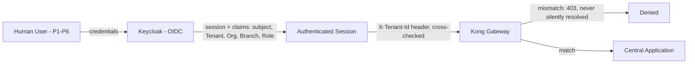
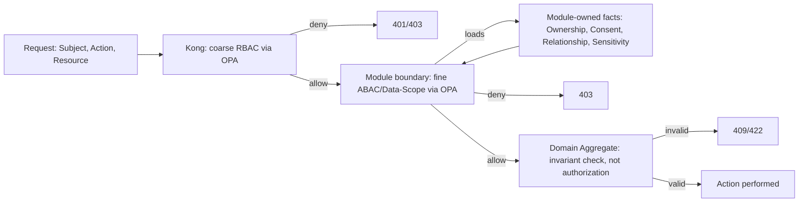
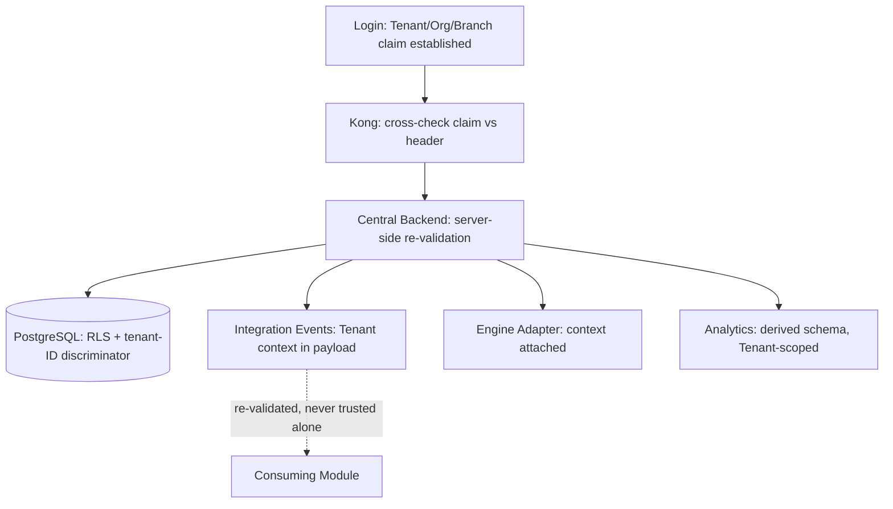
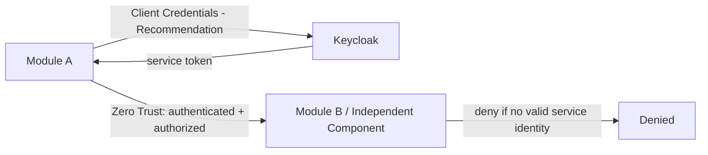
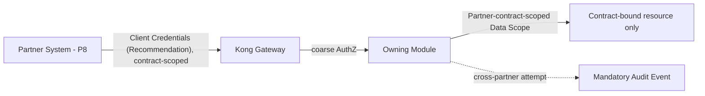
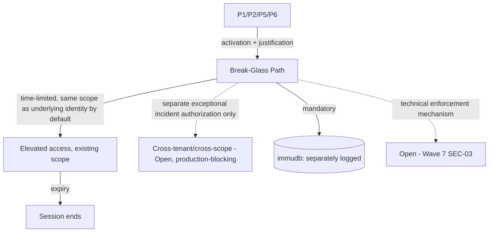
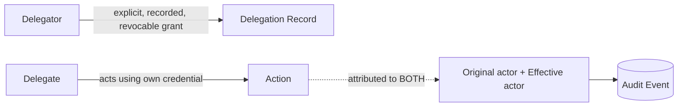
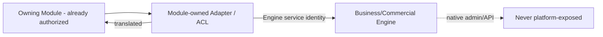
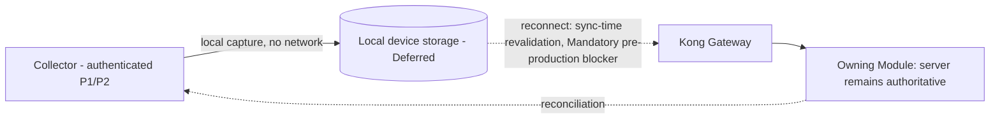
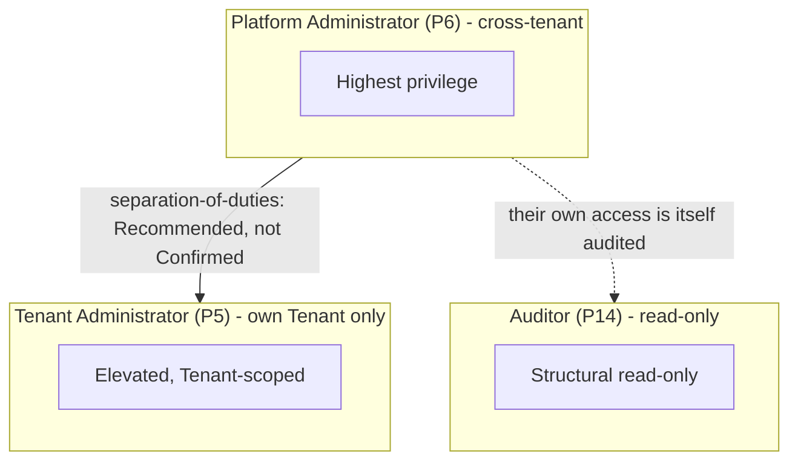

# SAD Wave 8 — Identity, Access and Tenant Governance

## 1. Document Metadata

| Field | Value |
|---|---|
| Wave number and title | 8 of 13 — Identity, Access and Tenant Governance (`docs/sad/README.md`) |
| Document Status | **Accepted** (Constitution §59 Document Status Vocabulary) |
| Owner | Author of this Wave (session author, 2026-07-21) |
| Review authority | Project Owner, jointly with an Independent Architecture Lead (per this Wave's own governing instruction) |
| Dependencies | Waves 1–7 — **Accepted** (`07-security-privacy-trust-boundaries.md` §39 Formal Acceptance Record) |
| Supersedes | None |
| Superseded by | None |
| Updated | 2026-07-21 |

**Formally Accepted**, jointly with Wave 7, following the governing instruction's own 10-condition joint-acceptance gate. See §51 Formal Acceptance Record for the review basis, corrective/acceptance commits, and what this acceptance does and does not mean.

## 2. Purpose and Scope

**Function of this Wave.** This Wave documents the architecture-level governance of Identity, Authentication, Authorization, Tenant/Organization/Branch context, the Role/Permission/Policy model, Sensitive Operations, Elevated Audit, Break-Glass, delegation, service/partner/device identity boundaries, identity lifecycle, and administrative boundaries — the *mechanics* that Wave 7's security architecture named as categories and deferred here.

**Explicit boundary — what this Wave owns vs. what it does not**:

| Concern | Owning Wave/Layer | This Wave's role |
|---|---|---|
| Identity | This Wave | Who is the Principal — human, service, device-mediated, partner |
| Authentication | This Wave | How the architecture proves that identity, at the architecture level (not exact protocol parameters) |
| Authorization | This Wave | Whether that identity may perform an Action on a Resource within a Context |
| Domain Invariant | Wave 4/5 (Building Block/Runtime View), referenced here for the boundary only | Whether an operation is commercially/clinically valid *given* an already-authorized caller — this Wave does not place invariants inside OPA or any policy layer |
| Consent | This Wave (architecture-level rule), Constitution §22 (source) | Whether an explicit, recorded, revocable grant permits access/disclosure beyond direct-care necessity |
| Data Scope | This Wave | Which Tenant/Organization/Branch/Patient/Resource is in scope for a given call |
| Audit | This Wave (governance model), Wave 7 §23 (architecture) | What must be recorded for IAM-relevant events specifically |
| AI/device protocol implementation | Wave 9 | This Wave states the IAM *handoff* boundary only |
| Quality scenarios, numeric targets | Wave 11 | This Wave flags where a quality scenario is required (e.g., Break-Glass availability trade-off) without writing one |
| Risk treatment, technical debt | Wave 12 | This Wave records residual risk; Wave 12 owns platform-wide treatment |

**Not designed here**: production code, database schemas, exact API endpoints, Constitution or ADR edits, any Wave 9 content, exact implementation parameters (all explicitly Deferred per §42 Explicit Non-Decisions).

## 3. Decision and Status Model

Every statement in this Wave carries one of these labels, extending Wave 6/7's own status vocabulary for the IAM domain specifically:

| Label | Meaning |
|---|---|
| Accepted Rule | Fixed by Constitution or an Accepted ADR |
| Accepted Constraint | A structural boundary that follows necessarily from an Accepted Rule (e.g., devices never call a Module directly, given ADR-0006) |
| Frozen Technology Input | Fixed by the Technology Baseline freeze (Keycloak, OPA, Kong, OpenBao) |
| SAD-Level IAM Design | This Wave's own reasoned default, changeable by future SAD/Architecture Review |
| Recommendation | An API Platform Strategy or Reuse-research proposal, not yet ratified — never promoted to Accepted here |
| Deferred Detail | Genuinely left to Wave 9/implementation, not invented |
| Open Decision | Genuinely undecided, recorded in §43 |
| Legal Dependency | Blocked on external legal input |
| Tenant Configuration | Varies per Tenant/market, not a single platform-wide answer |
| Residual Risk | Carried from Wave 7's Threat Model, not re-litigated here |

## 4. Identity Domain Model

Categories only — no exhaustive role list (that is §14). Each Principal below carries: authority, authentication boundary, tenant/organization/branch scope, lifecycle owner, credential owner, allowed channels, elevated-risk conditions, audit requirements, and status.

| # | Principal | Authority | Authentication boundary | Tenant/Org/Branch scope | Lifecycle owner | Credential owner | Allowed channels | Elevated-risk conditions | Audit requirement | Status |
|---|---|---|---|---|---|---|---|---|---|---|
| P1 | Human User (clinical/patient-facing: Patients, Doctors, Laboratory Staff) | Acts within their own granted Role/Policy/Data Scope | Keycloak-issued OIDC session (§7) | Tenant-scoped; Organization/Branch per membership | Tenant Administrator (provisioning), Platform Operations (platform-level identity store) | Keycloak (platform-managed) | Web Platform, Patient App, Collector App | Sensitive Operations (§18) | Standard + Elevated where applicable | Accepted Constraint (category); exact Role set is §14 |
| P2 | Workforce Identity (Finance, Inventory, Supplier, Support, HR/Payroll staff) | Same pattern as P1, operational scope | Keycloak-issued OIDC session | Tenant-scoped; Organization/Branch per membership | Tenant Administrator | Keycloak | Web Platform (back-office) | Payroll access (THR-009, Wave 7 §11), financial actions (THR-008) | Standard + Elevated where applicable | Accepted Constraint (category) |
| P3 | Patient Identity | Views/acts on their own record, subject to consent/delegation | Keycloak-issued OIDC session | Tenant-scoped (their care relationship) | Self-registration status not established by any source (§24) | Keycloak | Patient App, Web Portal | Result access before Sensitive-Operation release gating | Standard | Accepted Constraint (category); self-registration mechanism Open |
| P4 | Doctor/External Clinician Identity | Orders on behalf of / views results for a Patient under a care relationship | Keycloak-issued OIDC session | Tenant-scoped; may act across Organizations per referral relationship (mechanism not designed by any source) | Tenant Administrator; doctor verification status not established by any source | Keycloak | Web Platform | `ResultVerified`-adjacent access (not the verification act itself unless also a Verifier) | Standard + Elevated where applicable | Accepted Constraint (category); cross-organization referral mechanism Open |
| P5 | Tenant Administrator | Organization/Branch-level administrative scope within their own Tenant | Keycloak-issued OIDC session, elevated Role | Tenant-scoped, full Organization/Branch visibility within it | Platform Operations (initial provisioning); self-administering thereafter | Keycloak | Web Platform (admin surface) | Every administrative action (§25) | Elevated | Accepted Constraint (category) |
| P6 | Platform Administrator | Cross-organization/platform-wide administrative scope | Keycloak-issued OIDC session, highest-privilege Role | Cross-tenant by necessity | Platform Operations (self-administering, with separation-of-duties expectation, §25) | Keycloak | Web Platform (admin surface) | Every administrative action; **highest-privilege persona in the model** (Discovery `W2-persona-catalog.md`), must be Least-Privilege-scoped | Elevated | Accepted Constraint (category) |
| P7 | Service Identity | Acts as the Module/Independent Component itself, no human behind the call | Client Credentials (Recommendation, Wave 7 §36) | Scoped per-call from the caller's own request context, not self-asserted | Platform Operations (one per Module/Independent Component) | Keycloak (issuance), OpenBao (credential storage) | Internal service-to-service calls only | N/A (no human elevation applies; Least Privilege applies) | Standard (Zero Trust logging) | Accepted Constraint (category); exact grant Deferred (Wave 7 §36) |
| P8 | Partner System Identity | Acts within its own contract scope only | Client Credentials (Recommendation) | Contract-scoped Tenant/Organization | Platform Operations, per Partner contract | Partner-held credential, platform-issued | Partner API only | Cross-tenant/cross-partner access attempts | Elevated (mirrors Break-Glass treatment, `14-MULTI-TENANCY.md`) | Accepted Constraint (category); exact grant Deferred |
| P9 | Device-Origin Identity | Not a platform Principal in the usual sense — mediated entirely by Device Integration Gateway's own service identity (P7) | No direct platform authentication (Wave 7 §6/§13/§36) | Attributed to a Tenant/site once ingested, not self-asserted by the device | Device Integration Gateway module owner | Gateway's own credential/protocol scheme (Deferred, Wave 9) | Device/site zone only | Malformed/replay payloads (Wave 7 THR-006/017) | Provenance-tracked (Constitution §24) | Accepted Constraint (category); device-level mechanism Deferred to Wave 9 |
| P10 | Background Worker Identity | Acts as its owning Module's own deferred/scheduled-work executor | Internal service identity (subset of P7) | Inherits the triggering context's Tenant scope, mechanism not designed by any source (§29) | Owning Module | Same as P7 | Internal only | Privilege drift if a stale/absent authorization context is reused (§33) | Standard | Accepted Constraint (category); exact context-refresh mechanism Open |
| P11 | Engine Administrative Identity | The Engine's own internal admin account, used only by that Engine's maintainer/operator, never platform end users | Engine-native, not Keycloak-issued (per-Engine, largely undocumented — Wave 7 §20) | N/A — outside platform Tenant scoping unless the Engine itself is multi-tenant-aware (Wave 6 §13A) | Platform Operations (access grant), Engine's own admin model otherwise | Engine-native | Engine's own admin interface, never platform-exposed | Native Engine API exposure (Wave 7 THR-018) | Not documented by any source — genuine gap (§28) | Accepted Constraint (no native exposure); admin-interface hardening Open (Wave 7 §32 item 19) |
| P12 | Emergency/Break-Glass Actor | A P1/P2/P5/P6 identity operating under an exceptional, time-limited, justified, fully-audited elevated path | Same authentication boundary as the underlying identity, plus Break-Glass activation (§20) | **Same scope as the underlying identity's own existing grant, by default (corrected, §49)** — Break-Glass does not itself create a new Scope or cross a Tenant Boundary; a cross-tenant/cross-scope invocation is not a default capability and requires the separate, exceptional, incident-specific authorization defined in §20 | Same as the underlying identity's own lifecycle owner | Same as underlying identity | Same channels, via the Break-Glass path | Always — this *is* the elevated-risk condition | Elevated, separately logged (§19, §20) | Accepted Rule (Constitution §21); technical enforcement mechanism Open (Wave 7 SEC-03, §32 item 14); scope semantics corrected §49 |
| P13 | Delegated Actor | Acts on behalf of another Principal under an explicit, recorded, revocable delegation | Same as the delegate's own identity, plus delegation context (§21) | Inherits the delegator's scope, bounded by the delegation's own terms | Delegator (grants), Platform Operations (technical mechanism) | Delegate's own credential | Same channels as the delegate | Original-vs-effective-actor distinction must be preserved (§21) | Elevated, attributed to both original and effective actor | SAD-Level IAM Design; exact mechanism Deferred |
| P14 | Governance/Oversight Persona (Auditor, Compliance Staff, Legal Reviewer, Regulator) | Read-only by design (Auditor), or narrowly-scoped review access | Keycloak-issued OIDC session **for an internal, Tenant-scoped Auditor/Compliance persona (P1/P2-family, within their own Tenant)**; **an External Regulator/Assessor is not automatically a direct interactive cross-tenant platform identity merely by appearing in the Discovery persona catalog (corrected, §49)** | **Tenant-scoped by default.** A platform-wide/cross-tenant oversight capability is **not Accepted by default** — it is Open, and if ever provided, is expected to take the form of controlled evidence export, a tenant-scoped audit workspace, or supervised/regulator-specific controlled access, not a standing interactive cross-tenant account (§49) | Platform Operations | Keycloak (internal persona); external Regulator/Assessor access channel Open | Web Platform (audit/compliance surface); external channel Open | Access to Sensitive Personal/Health data for audit purposes; a genuine cross-tenant/direct interactive grant is a Legal/Contractual Dependency requiring explicit authorization | Elevated (their own access is itself audited) | Accepted Constraint (Tenant-scoped category); cross-tenant/direct external oversight access Open, Legal/Contractual Dependency (§49) |

**Not designed here**: exact Role names per Principal, exact Permission grants, token claim schema (§7 states the minimal set only, per Wave 7 §13).

## 5. Tenant, Organization and Branch Model

**Hierarchy (Accepted, Constitution §18)**: a Tenant may contain multiple Organizations; an Organization may contain multiple Branches. Tenant, Organization, and Branch are distinct concepts (`glossary.md`).

- **Department/Unit**: **not established by any source** — no source recognizes a formal sub-Branch unit. Not invented here.
- **User memberships**: a Human User (P1/P2) may hold membership in one or more Organizations/Branches within their Tenant. **Multi-Tenant membership for a single human identity is not established by any source** — Constitution §18/§19 describe Tenant isolation as a boundary a user's context resolves *within*, not a scenario of one human identity spanning multiple Tenants (P6 Platform Administrator is the sole cross-tenant exception by design).
- **Cross-organization access**: for referral-style relationships (e.g., Doctor P4 across Organizations), no source designs the exact mechanism — recorded as Open (§43).
- **Platform-level identities**: P6 Platform Administrator and P7 Service Identity are the only categories with an inherent cross-tenant scope, both Accepted by their own nature (§4).
- **Dedicated Deployment/On-Premise identities**: follow the same Tenant/Organization/Branch model; the *identity authority* (who operates the Keycloak realm) varies by deployment mode (§37), not the model itself.
- **Partner identities**: contract-scoped to a specific Tenant/Organization, never platform-wide by default (§27).

**Context establishment (Accepted, extending `14-MULTI-TENANCY.md`)**: Tenant context is established at login (token claim) and cross-checked against an explicit request-level indicator (header) — a mismatch is rejected outright, never silently resolved in favor of one or the other (§29 restates this from Wave 7's own API-layer source). **Corrected (§49): claim/header agreement is necessary but not by itself sufficient.** The signed token claim is trusted *identity input* (it proves what was true at login), and the request header is a client-supplied *selector*, not an *authority* — neither one alone, nor their mutual match, constitutes proof of the caller's *current* membership. The authoritative answer to "is this Subject currently a member of this Tenant/Organization/Branch, with this Role/Policy?" must be resolved or re-validated against server-side, Module-owned membership data, not derived solely from a token issued earlier in the session. See §29/§30 for propagation and freshness treatment, including the production-blocking classification for Sensitive Operations and cross-scope actions.

**Context propagation, tenant switching, invalid/missing/ambiguous context, cross-tenant denial**: see §29 (Tenant Context Propagation) and §30 (Context Switching) below — not repeated here to avoid duplication.

**No business hierarchy beyond Tenant → Organization → Branch is invented** — no source documents a deeper or different structure.

## 6. Identity Ownership Matrix

| Identity type | Identity source | Profile owner | Credential authority | Lifecycle owner | Authorization-policy owner | Tenant membership owner | Organization assignment owner | Deactivation authority | Audit owner | Legal dependency |
|---|---|---|---|---|---|---|---|---|---|---|
| Human User (P1/P2/P3/P4) | Keycloak | Tenant Administrator (workforce/clinical), Patient (self, where self-registration applies) | Keycloak | Tenant Administrator | Identity and Access (policy authoring), Tenant Administrator (assignment within policy) | Tenant Administrator | Tenant Administrator | Tenant Administrator (routine), Platform Administrator (Break-Glass/escalation) | Audit and Compliance | Egypt PDPL (identity proofing specifics, R-13) |
| Tenant Administrator (P5) | Keycloak | Platform Operations (initial), self-administering thereafter | Keycloak | Platform Operations (initial provisioning) | Identity and Access | Platform Operations (initial) | Platform Operations (initial) | Platform Administrator | Audit and Compliance | None identified |
| Platform Administrator (P6) | Keycloak | Platform Operations | Keycloak | Platform Operations, with separation-of-duties expectation (§25) | Identity and Access | N/A (cross-tenant by design) | N/A | Platform Operations (peer/dual-control expectation, mechanism Open) | Audit and Compliance | None identified |
| Service Identity (P7) | Keycloak (issuance) + OpenBao (credential) | Owning Module/Independent Component | OpenBao | Platform Operations | Identity and Access (policy), owning Module (scope request) | N/A (per-call scoping) | N/A | Platform Operations | Audit and Compliance | None identified |
| Partner System Identity (P8) | Keycloak (issuance) | Platform Operations (contract administration) | OpenBao (platform-held), Partner (their own copy) | Platform Operations, per contract lifecycle | Identity and Access (policy), Partner Contract (scope) | Platform Operations (contract-bound) | Platform Operations (contract-bound) | Platform Operations | Audit and Compliance | Partner contract terms (Legal, not this Wave's authority) |
| Device-Origin Identity (P9) | Device Integration Gateway's own service identity (P7) | Device Integration Gateway module owner | Gateway's own scheme (Deferred, Wave 9) | Device Integration Gateway module owner | N/A (mediated, not independently policy-governed) | Attributed post-ingestion | Attributed post-ingestion | Device Integration Gateway module owner | Audit and Compliance (via Gateway) | None identified at this Wave's level |
| Background Worker Identity (P10) | Keycloak (issuance, subset of P7) | Owning Module | OpenBao | Owning Module | Identity and Access | Inherits triggering context | Inherits triggering context | Owning Module | Audit and Compliance | None identified |
| Engine Administrative Identity (P11) | Engine-native | Engine Maintainer (external) | Engine-native, access-granted by Platform Operations | Platform Operations (access grant only) | Not applicable (outside platform policy scope) | N/A | N/A | Platform Operations (access revocation) | Not documented — genuine gap (§28) | Engine license/support terms |
| Delegated Actor (P13) | Delegator's own grant | Delegator | Delegate's own existing credential | Delegator (grant), Platform Operations (technical mechanism) | Identity and Access (delegation policy) | Inherits delegator's Tenant | Inherits delegator's Organization/Branch, bounded | Delegator (revoke) | Audit and Compliance | Consent/legal-basis for delegation, per relationship type (Constitution §22) |
| Governance/Oversight Persona (P14) | Keycloak (internal Tenant-scoped Auditor/Compliance); external Regulator/Assessor channel Open | Platform Operations | Keycloak (internal); Open for external | Platform Operations | Identity and Access | **Platform Operations (Tenant-scoped by default; cross-tenant/platform-wide oversight access Open — not Accepted by default, corrected §49)** | Platform Operations | Platform Operations | Audit and Compliance (their own access is itself audited) | **Legal/Contractual Dependency for any direct cross-tenant or external Regulator interactive access (corrected, §49)** |

No exact database schema, table, or field name is invented for any owner column above.

## 7. Authentication Architecture

Builds on Wave 7 §13 (Authentication Security) without re-deciding its status labels.

| Element | Status | Detail |
|---|---|---|
| Keycloak boundary | Frozen Technology Input | Single Identity Provider (OIDC) for every human, service, and machine-mediated identity (`08-AUTHENTICATION.md`, ADR-0008) |
| OIDC at architecture level | Accepted Rule | Unified Login — one authentication entry point for all user types across all clients (Constitution §20, ADR-0008) |
| Human/service/partner/device separation | Accepted Constraint | §4's 14 Principal categories; a service identity never shares credentials with a human identity (`08-AUTHENTICATION.md`) |
| Server-side validation | Accepted Rule | Session/credential validation happens on the backend for every privileged request; a client never self-asserts its own role/permission set (Constitution §20) |
| Machine identities | Accepted Constraint | Every Module/Independent Component has its own dedicated Client-Credentials-based service identity (Recommendation-level grant, Wave 7 §36) |
| Session compromise | Deferred Detail | Short-lived access tokens, rotating refresh tokens are `11-API-SECURITY.md`/`08-AUTHENTICATION.md`'s own Recommendation; exact TTL not asserted (No-Guessing Rule) |
| Credential compromise | SAD-Level IAM Design | Immediate revocation independent of normal rotation cadence is a stated requirement (`12-SECRETS-AND-KEYS.md`); full incident-response procedure is Open (Wave 7 §30/§32 item 12) |
| Administrative authentication | Accepted Constraint, mechanism Deferred | Elevated authentication required for P5/P6 (Wave 7 TB-14); step-up/MFA mechanism not designed by any source |
| Account recovery | **Not established by any source — genuine gap** | No source describes a credential-recovery flow at the architecture level |
| Emergency access authentication | Accepted Rule (Break-Glass exists), mechanism Open | See §20; whether Break-Glass has an authentication path independent of Keycloak/OPA availability is Open (Wave 7 §14A, §32 item 21) |
| Deployment-mode differences | SAD-Level IAM Design | See §37 — identity authority varies (Platform-operated vs. Customer-operated Keycloak realm), the model does not |

**No exact grant, token claim schema beyond the minimal set (`08-AUTHENTICATION.md`: subject, Tenant ID, Organization ID, Branch ID, Role(s), expiry), token lifetime, MFA method, password value, or session duration is invented anywhere in this section** (§42).

## 8. Authentication Flow Catalog

| # | Flow | Principal | Authority | Trust boundaries crossed (Wave 7 §8) | Credential class | Session/token semantic requirement | Tenant-context establishment | Failure behavior | Recommendation/Deferred detail |
|---|---|---|---|---|---|---|---|---|---|
| F1 | Human Portal login (workforce) | P2 | Keycloak-issued OIDC | TB-01, TB-02 | Password/credential (Keycloak-managed) | Session established, Tenant/Org/Branch claim populated | At login, from Keycloak's own realm/claim resolution (mechanism tied to Open Question #15) | Fail closed — no session | Grant type (Authorization Code + PKCE) is `08-AUTHENTICATION.md`'s Recommendation |
| F2 | Patient login | P3 | Keycloak-issued OIDC | TB-01, TB-02 | Password/credential | Session established | At login | Fail closed | Same grant Recommendation; self-registration mechanism Open |
| F3 | Doctor/external clinician login | P4 | Keycloak-issued OIDC | TB-01, TB-02 | Password/credential | Session established | At login; cross-organization referral context resolution Open (§5) | Fail closed | Same grant Recommendation |
| F4 | Tenant administrator login | P5 | Keycloak-issued OIDC, elevated Role | TB-01, TB-02, TB-14 | Password/credential + elevated Role claim | Session established, elevated | At login | Fail closed | Step-up/MFA mechanism Deferred |
| F5 | Platform administrator login | P6 | Keycloak-issued OIDC, highest-privilege Role | TB-01, TB-02, TB-14 | Password/credential + highest-privilege Role claim | Session established, highest-privilege | Cross-tenant by design | Fail closed | Step-up/MFA mechanism Deferred; separation-of-duties expectation (§25) not yet a Constitution-level rule |
| F6 | Service-to-service call | P7 | Client Credentials (Recommendation) | TB-04, TB-06, TB-08, TB-09 | Machine credential (OpenBao-held) | Per-call, no persistent session | N/A (service identity is itself the subject; Tenant context comes from the triggering call) | Fail closed (Zero Trust, Constitution §21) | Exact grant Deferred (Wave 7 §36) |
| F7 | Partner system call | P8 | Client Credentials, contract-scoped | TB-11 | Machine credential (contract-issued) | Per-call, no persistent session | Contract-bound, cross-checked at the Module boundary | Fail closed | Exact grant Deferred; partner authentication exact mechanism Open (Wave 7 §32 item 10) |
| F8 | Background worker execution | P10 | Internal service identity | TB-04, TB-06 | Machine credential (subset of P7) | Per-execution | Inherits triggering context — mechanism Open (§29) | Fail closed if context cannot be resolved | Context-refresh mechanism Open |
| F9 | Break-Glass authentication | P12 | Elevated, exceptional path | TB-14 | Same as underlying identity + activation justification | Time-limited, justified | **Same Tenant/scope as the underlying identity, by default; cross-tenant/cross-scope only under the separate exceptional incident authorization of §20 (corrected, §49)** | Explicitly logged, not silently denied nor silently allowed | Technical enforcement mechanism Open (Wave 7 SEC-03) |
| F10 | On-Prem/Hybrid authentication | P1–P6 (site-local) | Same Keycloak-based pattern, customer-operated realm (On-Prem) or platform-operated (Hybrid central) | TB-01, TB-02 | Same as F1–F5 | Same | Same, within the customer's own environment | Fail closed | Realm operation authority varies by mode (§37) |
| F11 | Device-originated identity handoff | P9 (via Gateway's own P7) | Device Integration Gateway's own service identity | TB-09, TB-10 | Gateway's own credential/protocol scheme (Deferred, Wave 9) | N/A — not a platform session | Attributed post-ingestion | Isolated failure (Wave 5 Invariant 11); malformed/replay handling Wave 7 THR-006 | Exact device credential/protocol mechanism is Wave 9's territory, not designed here |

**Recommended for a Wave 11 quality scenario**: F9 (Break-Glass) and the Emergency-operation row from Wave 7 §14A, given the genuine safety-vs-availability tension neither this Wave nor Wave 7 resolves.

## 9. Authorization Model

**Not RBAC-only.** This Wave designs a **hybrid Policy-Based Access model** — RBAC (coarse) + ABAC (fine) + explicit relationship/consent checks — matching ADR-0008's own "Role + Permission + Policy + Data Scope + Organization + Branch + Resource Ownership + Consent" framing, restated here at the architecture-decision level, not reinterpreted.

| Dimension | Role in the model | Status |
|---|---|---|
| Role | Coarse: "can this identity call this endpoint at all?" (`09-AUTHORIZATION.md`) | Accepted Rule |
| Permission/Action | The atomic, granular grant a Role bundles (`glossary.md` Accepted definition) | Accepted Rule |
| Resource | The object being acted upon (§16) | Accepted Rule |
| Tenant | The outermost Data Scope boundary (Constitution §18) | Accepted Rule |
| Organization | Nested within Tenant (Constitution §18) | Accepted Rule |
| Branch | Nested within Organization (Constitution §18) | Accepted Rule |
| Ownership | Resource Ownership (ADR-0008) — e.g., a Patient's own record, a Doctor's own order | Accepted Rule |
| Assignment | E.g., a Laboratory Staff member assigned a specific Specimen's worklist entry — mechanism not designed by any source | SAD-Level IAM Design (category only) |
| Care relationship | Doctor-Patient, Collector-Patient — governs P3/P4 access | Accepted Rule (Constitution §22 extends here) |
| Consent | Constitution §22 — explicit, recorded, revocable, auditable | Accepted Rule |
| Data sensitivity | Wave 7 §5 Data Classification Model, applied here to authorization decisions | Accepted Constraint (SAD-Level Security Design origin) |
| Purpose | Purpose-of-use — Wave 7 §24 flagged this as "Partially covered... no dedicated purpose-limitation control beyond Data Scope" | Partially covered, not re-solved here |
| Time/emergency context | Break-Glass (§20) | Accepted Rule (existence), mechanism Open |
| Sensitive Operation | §18 — elevated authorization checks | Accepted Rule |
| Delegation | §21 | SAD-Level IAM Design |
| Platform vs. Tenant administration | §25 | SAD-Level IAM Design |

**Classification**: this is a **Policy-Based combination** (RBAC for coarse gating + ABAC for fine Data-Scope/context decisions + explicit relationship/consent checks layered on top) — not a pure RBAC, pure ABAC, or a full graph-relationship (ReBAC) system. ReBAC-style relationship checks (care relationship, resource ownership) are present as *inputs* to the ABAC decision, not as a separate general-purpose relationship-traversal engine — no such engine is named by any source, and none is invented here.

## 10. Authorization Decision Model

| Input | Source | Trust level |
|---|---|---|
| Subject (identity) | Authenticated session/service-identity context (§7) | Trusted — server-resolved |
| Action | The API operation being invoked (`05-API-STANDARDS.md`, `06-NAMING-CONVENTIONS.md`) | Trusted — resolved from the routed endpoint, not client-labeled |
| Resource | The target entity/aggregate (§16) | Trusted once resolved server-side from the request path/body's identifier, cross-checked against ownership |
| Tenant Context | Token claim, cross-checked against `X-Tenant-Id` header; mismatch rejected outright (`14-MULTI-TENANCY.md`, restated Wave 7 §7) | Trusted as identity *input* — never client-supplied alone; **but claim/header agreement is not itself proof of current membership (corrected, §49)** — authoritative current Tenant membership/scope is resolved/re-validated server-side against Module-owned data, especially for Sensitive Operations and cross-scope actions (§29/§30) |
| Organization Context | Same pattern as Tenant, nested | Trusted as identity input; **same freshness caveat as Tenant Context above — see §30's Open item on session-cached Organization/Branch context (corrected, §49)** |
| Branch Context | Same pattern, nested | Trusted as identity input; same freshness caveat |
| Relationship | Care relationship / resource ownership, resolved server-side from Module-owned data | Trusted — never a client assertion |
| Consent | Consent record, resolved server-side (Constitution §22) | Trusted |
| Purpose | Not resolved by any source as a distinct queryable input — Data Scope is the closest proxy (Wave 7 §24) | Partially covered |
| Environmental Context | Break-Glass activation state, time-boxing (§20) | Trusted, mechanism Open |
| Sensitive Operation flag | Resolved from the operation's own classification (§18), not client-supplied | Trusted |

**What comes from trusted identity context**: Subject, the coarse Role set, Tenant/Organization/Branch claims (cross-checked, never trusted from the client alone).
**What is loaded server-side**: Relationship, Consent, Resource Ownership, Sensitive Operation classification — always resolved from Module-owned data, never from client-supplied fields.
**What must never be taken from client assertions**: Tenant ID (as a mutable request-body field, per `14-MULTI-TENANCY.md`), Role/Permission claims (Constitution §20's explicit prohibition), Resource ownership.
**What needs Module-owned data**: Relationship, Consent, Resource Ownership, Sensitive Operation classification.
**What OPA can evaluate**: Role-level (coarse) and Data-Scope-level (fine, given the inputs above already resolved) — OPA evaluates a policy given facts, it does not itself resolve Module-owned facts (§12).
**What must remain inside the Domain Module**: Domain Invariants (§13) — OPA's decision answers "is this access/action authorized," never "is this operation commercially/clinically valid."

No exact token field name beyond the minimal set already named in Wave 7 §13/§36 is invented.

## 11. Policy Enforcement Points

| PEP | Enforcement grain | Decisions enforced | Identity source | Tenant context | Failure behavior | Audit | Bypass prevention | Limitations |
|---|---|---|---|---|---|---|---|---|
| Kong/API Edge | Coarse | AuthN (token validation), RBAC | Keycloak-issued token | Cross-checked (token claim vs. header) | Fail closed (401/403) | Failed-auth logged operationally | No Module reachable without passing this PEP for External/Partner/Public/Admin APIs (`10-API-GATEWAY.md`) | Does not perform fine-grained ABAC/Data-Scope (by design, defense in depth — `10-API-GATEWAY.md`) |
| Application/Module boundary | Fine | ABAC/Data-Scope, Resource Ownership, Consent | Propagated from Kong + re-validated | Re-validated at the Module (never trusts Kong's `allow` alone, `09-AUTHORIZATION.md`) | Fail closed | Sensitive Operations audited here (§18) | Module never assumes the Edge Gateway's `allow` already covers Data-Scope correctness (`09-AUTHORIZATION.md`) | Requires Module-owned data to be loaded before the decision — a latency/design cost, not a gap |
| Domain Application Service | Domain-invariant (not authorization) | Business-rule validity given an already-authorized caller | N/A (post-authorization) | N/A | Domain-specific (e.g., `409 Conflict`, `422 Unprocessable`) | Domain Event / Sensitive Operation Audit Event as applicable | Never re-derives authorization from data alone | Explicitly not a PEP — included here only to mark the boundary (§13) |
| Data access/RLS | Data-layer | Tenant-row-level filtering (ADR-0013) | Module's own DB credential, tenant context passed by the Module | Enforced via RLS + tenant-ID discriminator | Fail closed (no rows returned) | Not itself an Audit Event trigger | Defense-in-depth, not the sole authorization layer (Wave 7 §12) | Does not extend to Engines on separate databases (Wave 6 §13A, Wave 7 §19) |
| Business Engine Adapter | Fine, delegated | Re-application of the Module's own already-made authorization decision before the Engine call | Engine-specific service identity | Attached by the calling Module, not independently re-verified by the Engine (Wave 7 §20 gap) | Adapter surfaces Engine failure; no native Engine error reaches the client (Wave 6 §32) | Not separately audited beyond the Module-level Sensitive Operation trigger | No native Engine exposure (Wave 7 §15) | Engine's own admin/native interface is not a governed PEP — genuine gap (§28) |
| Device Gateway | Boundary, not per-identity | Anti-Corruption Layer validation, provenance | Gateway's own service identity (P7 subset) | Attributed post-ingestion | Isolated failure (Wave 5 Invariant 11) | Provenance-field presence check | Devices never call a Module directly (ADR-0006) | Device-level identity/authenticity mechanism Deferred (Wave 9) |
| AI Gateway | Policy-gated egress | Sensitive-data outbound policy gate (Constitution §28) | AI Operations Gateway facade's own service identity | N/A (outbound) | Blocked if policy gate fails | Every AI action logged | HITL is structural, not the AI Gateway's own enforcement alone | Cross-tenant AI context leakage control not established (Wave 7 §17) |
| Administrative console | Elevated | Break-Glass, elevated administrative actions | P5/P6, elevated authentication | **Same scope as the underlying identity's own grant by default; cross-tenant only via the separate exceptional incident authorization of §20 — not granted merely because "the action requires it" (corrected, §49)** | Fail closed, mandatory audit | Mandatory (Constitution §21) | Elevated authorization required for every action | Technical Break-Glass enforcement mechanism Open (§20) |
| Background Worker | Inherited | Re-applies the triggering context's own authorization | Inherited from trigger, mechanism not designed | Inherited, mechanism Open | Job marked failed if context unresolvable (Wave 6 §32 R12) | Standard | Zero Trust applies even internally (Constitution §21) | Context-refresh-on-execution mechanism Open (§29) |
| Offline sync endpoint | Deferred | Sync-time re-validation of offline-captured data's authorization context | Collector's own authenticated identity, cached | Re-established at sync (mechanism Deferred, Wave 7 §18) | Mandatory pre-production blocker status (Wave 7 §18) | Not designed | N/A — not yet designed | Entire mechanism Deferred to Wave 9, tracked as a production blocker |

Neither PEP substitutes for another — this restates `09-AUTHORIZATION.md`'s own explicit two-PEP (at minimum) discipline, extended here to the full PEP inventory above.

## 12. Policy Decision Architecture

| Element | Status | Detail |
|---|---|---|
| OPA role | Frozen Technology Input | The platform's policy decision point, at both the Edge (RBAC) and Module boundary (ABAC/Data-Scope) PEPs (`09-AUTHORIZATION.md`) |
| Module-owned policy facts | Accepted Constraint | OPA evaluates a decision given facts (Tenant, Role, Resource Ownership, Consent, Sensitive Operation classification) that the *Module* resolves and supplies — OPA does not independently query Module-owned data |
| Identity context | Accepted Constraint | Supplied from the authenticated session/service-identity (§7), never client-asserted |
| Data/relationship facts | Accepted Constraint | Resolved by the Module before the OPA query, consistent with §10 |
| Deny-by-default | Accepted Rule | Default access is deny; access is granted explicitly per Role/Permission/Policy (Constitution §21) |
| Policy versioning requirement status | Accepted Rule (corrected label, Reader Testing Pass 2, §48) | Policy bundles centrally authored and versioned independently of the OPA engine itself — this is `09-AUTHORIZATION.md`'s own **Fact** label ("centrally authored and versioned as policy bundles... per the Technology Baseline's own Upgrade Policy for E2"), not a Recommendation; this Wave preserves that source status rather than downgrading it |
| Decision logging | Partially covered | Authorization decisions on Sensitive Operations are Audit Events (Constitution §23); general (non-Sensitive) decision logging is operational, not Audit (Constitution §33) |
| Availability | Open | See Wave 7 §14A's full 12-scenario matrix — not repeated here |
| Caching status | Open | Whether/how OPA decisions are cached is not addressed by any source (Wave 7 §14A) |
| Topology | **Open — not decided here** | Sidecar vs. centralized vs. embedded library remains Wave 6 §38's own Open Deployment Decision; this Wave does not resolve it |

**OPA does not own Domain facts or Domain invariants** — this is the direct, restated boundary from §13 below, and from Wave 7 §14's own "Aggregate protects invariants after authorization context" statement.

## 13. Domain Invariant Separation

| Decision | IAM/Policy | Domain Module | Data Layer | Audit |
|---|---|---|---|---|
| Does the user have permission to Verify a Result? | ✓ (Role/Permission check) | — | — | Authorization decision logged if Sensitive |
| Is the Result in a state that permits verification (e.g., not already Verified/Released)? | — | ✓ (Aggregate invariant, `TestResult`) | — | Domain Event on state transition |
| Is the user within the correct Tenant? | ✓ (Data Scope) | — | ✓ (RLS, defense in depth) | — |
| Is the user the treating/assigned Doctor for this Patient? | ✓ (Relationship check, Resource Ownership) | — | — | — |
| Does Consent permit this disclosure? | ✓ (Consent check, Constitution §22) | — | — | Consent-check outcome auditable |
| Is Specimen provenance complete before Result entry? | — | ✓ (Aggregate invariant) | — | — |
| Is this a Sensitive Operation requiring elevated controls? | ✓ (classification lookup) | — | — | Elevated Audit if so (§19) |
| Is Break-Glass currently active for this actor? | ✓ (Break-Glass state) | — | — | Mandatory, separately logged (§20) |
| Is the Refund amount within the approver's authority? | ✓ (Role/Permission threshold, if modeled) | ✓ (business-rule validity, e.g., against the original charge) | — | Elevated Audit (§19, D-52) |

**Explicit rules**:
- **Domain Invariants are never placed inside OPA.** OPA answers "is this identity authorized," never "is this Aggregate's state transition valid." A Result cannot be verified twice regardless of who is asking — that is a `TestResult` Aggregate invariant (Wave 4/5), not a policy decision.
- **Authentication is never treated as equivalent to Authorization.** Proving identity (§7) grants no access by itself (Constitution §20's own explicit statement, restated).
- **Role alone is never treated as sufficient for every decision.** Role gates *whether an endpoint may be called at all*; Data Scope, Ownership, Relationship, and Consent govern *which specific resource* — the same two-PEP defense-in-depth already established (§11).

## 14. Role Architecture

**Role families, not a final exhaustive list** — per the governing instruction's own caution against inventing an unfounded permission catalog.

| Role family | Scope | Representative personas (Discovery `W2-persona-catalog.md`) | Constraints | Customization boundary |
|---|---|---|---|---|
| Platform roles | Cross-tenant | Platform Administrator (P6), Platform Operations | Highest privilege; separation-of-duties expectation (§25), mechanism Open | Not Tenant-customizable |
| Tenant administrative roles | Tenant-wide | Tenant Administrator (P5), Branch Administrator | Scoped to their own Tenant/Organization/Branch | Tenant may configure sub-roles within this family, mechanism not designed by any source |
| Operational/clinical role families | Tenant-scoped, functional | Laboratory Staff, Laboratory Management, Doctor (P4), Result Verifier (a Role, not a distinct Principal — eligibility criteria Open, Open Questions #19/#23) | Result Verifier eligibility values are a Regulatory/Clinical-Governance Dependency | Tenant/Country-configurable per Open Questions Resolution #19/#23 |
| Patient role | Tenant-scoped, self | Patient (P3) | Views/acts on own record only, subject to consent/delegation | Not customizable — a structural role |
| Financial/workforce roles | Tenant-scoped, functional | Finance, Payroll, HR staff (P2) | Payroll Data Scope pattern extension recommended (Wave 7 THR-009), not yet Confirmed | Tenant-configurable, mechanism not designed |
| Supply-chain roles | Tenant-scoped, functional | Inventory, Procurement, Supplier Management staff (P2) | Segregation-of-duties (PO issuer ≠ approver ≠ receiver) Recommended (Wave 7 THR-011/SEC-12), not yet a Constitution-level rule | Tenant-configurable |
| Governance/oversight roles | **Tenant-scoped by default (corrected, §49)** — cross-tenant/platform-wide oversight access is Open, not Accepted by default; existence of a persona in the Discovery catalog does not itself establish a platform-wide interactive account | Auditor (read-only by design), Compliance Staff, Legal Reviewer, Regulator (P14) | Auditor is read-only by design (Discovery persona catalog); an External Regulator's access mechanism (controlled export / tenant-scoped workspace / supervised access) is Open, Legal/Contractual Dependency | Not Tenant-customizable for the Auditor's read-only floor |
| Service roles | N/A (machine) | Service Identity (P7) | Least Privilege, one identity per Module/Independent Component | Not customizable — architectural |
| Partner roles | Contract-scoped | Partner System Identity (P8) | Contract-scoped, never platform-wide | Per-contract, mechanism not designed |
| Device identity category | N/A (mediated) | Device-Origin Identity (P9) | Never a platform Role in the human/service sense | N/A |
| Emergency access category | Cross-cutting, exceptional | Break-Glass Actor (P12) | Time-limited, justified, audited (§20) | Not customizable — a structural safety mechanism |

**No exhaustive, final Role catalog is created here.** Exact Role names, their Permission bundles, and Policy axis values are Wave 8's own **Deferred Detail** to a subsequent, dedicated Role/Permission design activity (implementation phase or a future SAD refinement) — this Wave establishes the family structure and constraints, consistent with the governing instruction's own prohibition on inventing "a final, exhaustive list of unfounded roles."

## 15. Permission and Action Taxonomy

Architecture-level taxonomy — not endpoint-level permissions.

| Action | Sensitivity | Representative examples | Sensitive Operation? |
|---|---|---|---|
| View | Standard, Data-Scope-filtered | View own result, view Tenant's own Branch list | No, unless viewing itself is classified Sensitive (e.g., viewing another Tenant's data via Break-Glass) |
| Create | Standard | Create a Test Order, create a Specimen record | No |
| Update | Standard | Update Organization configuration | No, unless the target is a Sensitive field |
| Delete/Cancel | Standard-to-Elevated | Cancel a Test Order | Elevated if it touches a Sensitive Operation's own record |
| Verify | **Sensitive Operation** | `ResultVerified` (Constitution §21, Discovery Business Rules Catalog) | **Yes** |
| Approve | **Sensitive Operation** (context-dependent) | Refund approval (Elevated Audit, D-52), Break-Glass approval where dual-control exists | Yes, per §18/§19 |
| Release/Publish | **Sensitive Operation** | `ResultReleased` | **Yes** |
| Correct | **Sensitive Operation** | `ResultCorrected` | **Yes** |
| Export | Standard-to-Elevated | Patient-data export, bulk export | Elevated for bulk/cross-tenant export |
| Assign | Standard | Assign a worklist item to Laboratory Staff | No |
| Delegate | Elevated | Grant delegated access (§21) | Elevated (attributed to both original and effective actor) |
| Configure | Elevated | Tenant Configuration change (D-52 Elevated Audit) | **Yes** (Elevated Audit tier) |
| Administer | Elevated | Platform/Tenant administrative actions (§25) | Elevated |
| Override | **Sensitive Operation** | Break-Glass access | **Yes** |
| Break-Glass | **Sensitive Operation** | Emergency cross-tenant/cross-scope access | **Yes** |
| Access audit | Elevated | Auditor's own read access to Audit Events | Elevated (itself audited) |
| Manage identities | Elevated | Provisioning, deactivation (§23) | Elevated |
| Manage policies | Elevated | OPA policy bundle authoring (Platform Operations only) | Elevated |

**Sensitive Operations are governed in full in §18** — this taxonomy only classifies the Action verbs, it does not repeat the Sensitive Operations Catalog. **No endpoint-level permission list is created here** (Wave 9/implementation territory).

## 16. Resource and Scope Model

| Resource category | Owning scope | Representative examples |
|---|---|---|
| Tenant-owned resource | Tenant | Tenant configuration, Tenant-wide policy assignments |
| Organization-owned resource | Organization (within Tenant) | Organization profile, Organization-level Branch list |
| Branch-owned resource | Branch (within Organization) | Branch-local scheduling, Branch inventory levels |
| Patient-owned/related resource | Patient, within their care-relationship Tenant | `Patient`, `TestOrder`, `TestResult`, `Specimen` |
| Workforce resource | Organization/Branch | Employee record, Payroll data (Sensitive Personal, Wave 7 AS-11) |
| Clinical resource | Patient-linked, Tenant-scoped | Diagnostic orders, results, reports (Wave 7 AS-02) |
| Financial resource | Organization/Branch | Invoice, Payment, Refund |
| Audit resource | Cross-cutting, Tenant-attributed within records | Audit Event (Wave 7 AS-07) |
| Configuration resource | Tenant or Platform | Feature flags (Unleash), OPA policy bundles |
| Platform resource | Platform-wide | Platform Infrastructure Services (Wave 6 §12), Technology Baseline |
| Engine-owned representation | Engine-internal, reached via Adapter | ERPNext invoice record, openIMIS claim record |
| Analytics derived resource | Analytics-owned derived schema | Superset dashboard/read model (Wave 6 §42, Wave 7 §12) |

No exact table/schema is invented for any resource category.

## 17. Consent, Ownership and Relationship Model

Architecture-level checks only — no legal rule is asserted as final.

| Check | Status | Detail |
|---|---|---|
| Patient consent | Accepted Rule | Explicit, recorded, revocable, auditable (Constitution §22) |
| Care relationship | Accepted Rule (existence), mechanism Deferred | Governs P3/P4 access; exact relationship-establishment/verification mechanism not designed by any source |
| Requesting doctor | Accepted Constraint | A subset of care relationship — the ordering/requesting Doctor for a given Order |
| Assigned worker | SAD-Level IAM Design | E.g., Laboratory Staff assigned a Specimen's worklist entry — assignment mechanism not designed |
| Legal guardian/delegate status | Legal Dependency, architectural rule Accepted | Delegation itself is Accepted (Constitution §22, §21 here); legal sufficiency of a specific guardian relationship is outside architectural authority |
| Employer/organization relationship | Accepted Constraint | Workforce Identity's (P2) membership in an Organization/Branch |
| Payer relationship | Accepted Constraint | Governs Insurance/Billing-Module access to eligibility/claims data |
| External partner contract | Accepted Constraint | Governs P8's contract-scoped access (§27) |
| Purpose of use | Partially covered | No dedicated purpose-limitation control beyond Data Scope (Wave 7 §24, restated) |

**No legal rule is asserted as final anywhere in this section** — every Legal Dependency is tracked, not resolved (§43).

## 18. Sensitive Operations Governance

Catalog restated and extended from Wave 7 §3/§19/§23 and the Discovery Business Rules Catalog, with explicit authorization/audit/approval detail added at the IAM-governance level.

| Operation | Authorization requirement | Additional verification | Separation-of-duties status | Audit tier | Justification | Approval | Residual/Open |
|---|---|---|---|---|---|---|---|
| `ResultVerified` | Result Verifier Role (eligibility criteria Open, Open Questions #19/#23) | Backend-enforced Role gate (Evidenced) | Not established by any source | Sensitive Operation | Implicit (professional qualification) | Single-actor, per current evidence | **Highest** — eligibility values remain Regulatory/Clinical-Governance Dependency (Wave 7 THR-007) |
| `ResultReleased` | Same Role family as Verification, or a distinct Release Role — not established by any source | Not designed | Not established | Sensitive Operation | Implicit | Not established | Open — exact eligibility/approval chain not designed |
| `ResultCorrected` | Elevated, beyond ordinary Verify | Not designed | Not established | Sensitive Operation | Required (implicit from Sensitive Operation classification) | Not established | Open |
| Patient-data export (bulk) | Elevated Role | Not designed | Not established | Elevated Audit (D-52 pattern extension proposed, not yet Confirmed for this specific operation) | Required | Not established | Open |
| Identity/role changes | Tenant/Platform Administrator | Not designed | Recommended (peer/dual-control for Platform Administrator, §25), not Confirmed | Elevated | Recommended | Recommended, not Confirmed | Open |
| Tenant configuration changes | Tenant/Platform Administrator | Not designed | Not established | Elevated Audit (D-52, Accepted) | Recommended | Not established | Open |
| Policy changes (OPA bundles) | Platform Operations only | Not designed | Recommended | Elevated | Recommended | Not established | Open |
| Secret access | Service identity, per-scope | Every read is a Recommendation-level Audit Event (Wave 7 §36 correction) | N/A | Elevated (Recommendation) | N/A | N/A | Open — ratification status |
| Break-Glass | P12 exceptional path | Time-limited, justified capture | N/A by design (exceptional) | Elevated, separately logged | **Required** | N/A (exceptional) | Technical enforcement mechanism Open (§20) |
| Impersonation | Not Accepted by default (§22) | N/A unless explicitly approved | N/A | Elevated, if ever adopted | **Required** | Not established | Open — whether impersonation is offered at all |
| Refund/payment override | Elevated Role, threshold-based (mechanism not designed) | Not designed | Recommended | Elevated Audit (D-52, Accepted) | Required | Not established | Open (Wave 7 THR-008) |
| Inventory adjustment | Reason-code required (BR-INV01, Accepted) | Reason code | Recommended, not Confirmed | Standard-to-Elevated | Required (reason code) | Not established | Open (Wave 7 THR-010) |
| AI recommendation acceptance | **HITL requirement itself is Accepted (Constitution §28); reviewer eligibility is a separate, use-case-specific, Mandatory pre-production decision — not automatically satisfied by any P1/P4 identity (corrected, §49; see §43 item 17)** | HITL gate (Accepted, Constitution §28); qualified-reviewer determination not designed | N/A | Standard (AI action logged) — **for a clinical AI output specifically, this is Elevated, not merely Standard (added, §49, closing a Reviewer-3 finding); a non-clinical AI workflow's acceptance remains Standard, consistent with §36's own clinical/non-clinical split** | Implicit | N/A | See Wave 7 §17, §43 item 17 |
| Device manual re-entry | Provenance-tracked (Accepted, Open Questions Resolution #21) | Provenance preserved | N/A | Standard | Implicit | N/A | — |
| Audit access | Auditor Role (read-only by design) | N/A | N/A | Elevated (self-audited) | N/A | N/A | — |
| Backup restore | Platform Operations / Tenant, per Wave 6 §35 responsibility split | Restore-verification (ADR-0014) | Not established | Not confirmed as an Audit Event (Wave 7 §8 TB-15 gap) | Recommended | Not established | Open (Wave 7 §32 item 20-adjacent) |
| Data deletion/anonymization | Not established by any source | Not designed | Not established | Not designed | Required, presumably | Not established | Legal Dependency (Egypt PDPL, R-13) — whether/how deletion is even legally permitted for clinical records |

## 19. Elevated Audit Model

| Tier | Scope | Status | Examples |
|---|---|---|---|
| Ordinary Audit | Standard state-changing operations | Accepted Rule (Constitution §23) | Create/Update operations not otherwise classified Sensitive |
| Sensitive Operation Audit | Constitution §21's own definition | Accepted Rule | `ResultVerified`, `ResultReleased`, `ResultCorrected`, consent changes, Break-Glass |
| Elevated Audit | Extends Sensitive-Operation rigor to a named additional set | **Accepted Decision (D-52)** | Refund, Expiry-block, Break-Glass, Tenant Configuration |
| Security decision log | Authorization/policy decisions | Partially covered (§12) | OPA decisions on Sensitive Operations |
| Policy decision log | OPA bundle changes | Recommended, not Confirmed | Policy authoring/versioning events |
| Privileged administration log | P5/P6 administrative actions | Accepted Rule (Constitution §21) | Any administrative action (§25) |
| Break-Glass log | P12 activations | Accepted Rule, separately logged | Every Break-Glass invocation |
| Impersonation/delegation log | P13, if impersonation is ever adopted | SAD-Level IAM Design (delegation), Open (impersonation) | Delegated action attribution (original + effective actor) |
| Consent-related log | Consent grant/revoke | Accepted Rule (Constitution §22) | Consent state changes |
| AI clinical HITL accept/override decision (**added, §49**) | A human reviewer's accept/reject/edit decision on an AI clinical recommendation (§36) | **Elevated** — corrected from an undifferentiated Standard tier found by independent review; distinguishes the clinical case from a non-clinical AI workflow's acceptance, which remains Standard | The reviewer's identity, decision, and the AI provenance record it acted on (§36); does not by itself resolve §43 item 17's reviewer-eligibility gap |

**Not conflated with observability logs** — Audit Events remain a compliance/traceability concern, distinct from operational logs/metrics/traces (Constitution §33, restated from Wave 7 §23).

## 20. Break-Glass Architecture

| Element | Status | Detail |
|---|---|---|
| Eligibility | Accepted Rule (existence), exact eligible-Role list Open | P5/P6 and potentially P1/P2/P4 in a genuine emergency — exact eligibility not designed by any source |
| Activation conditions | Accepted Rule (must be exceptional) | "Exceptional situations" only (Constitution §21) — exact trigger criteria not designed |
| Explicit justification | Accepted Rule | Required capture (Constitution §21) |
| Time-bound semantic requirement | Accepted Rule, exact duration Deferred | "Time-limited" (Constitution §21); no duration value asserted (No-Guessing Rule) |
| Default scope (**corrected, §49**) | **Accepted Constraint** — a structural corollary of Constitution §21 Deny-by-Default and §18/§19 Tenant Isolation: nothing grants Break-Glass cross-tenant authority, so absent an explicit grant, it has none | Break-Glass does not create a new Scope automatically and does not cross a Tenant Boundary by default. Emergency access remains bounded by the invoking actor's own already-granted scope unless a separate, exceptional, incident-specific authorization (row below) applies. Break-Glass is a *time-limited elevation of an existing identity's own access path*, not a scope-creation mechanism. |
| Cross-tenant/cross-scope emergency access (**corrected, §49**) | **Open — production-blocking policy decision, not a default capability** | Not granted by simply being P5/P6 or by invoking Break-Glass generically. If ever exercised, it requires all of: (a) explicit, exceptional authorization separate from routine Break-Glass activation; (b) scope limited to the specific incident/resource, never platform-wide; (c) minimum-necessary access; (d) a time-bound semantic requirement at least as strict as ordinary Break-Glass; (e) Elevated Audit (§19); (f) a mandatory retrospective review (ties to the "Review" row below); (g) a documented security/clinical justification. Exact authorization workflow Open — Architecture Review Board, Wave 11 (quality scenario) |
| Minimum necessary access | SAD-Level IAM Design | Extends Constitution §21's own intent; exact scoping mechanism not designed |
| No silent activation | Accepted Rule | Every Break-Glass invocation is written to the immudb-backed Audit and Compliance store with full justification metadata (`09-AUTHORIZATION.md`) |
| Elevated Audit | Accepted Rule | §19 |
| Review | **Open — not established by any source** | No source describes a post-hoc review process for Break-Glass usage; a cross-tenant/cross-scope invocation specifically requires a **mandatory** retrospective review (row above), not merely a Recommended one |
| Notification status | **Open — not established by any source** | Whether a Tenant/Patient is notified of a Break-Glass access touching their data is not designed |
| Revocation | SAD-Level IAM Design | Same Keycloak session-revocation mechanism as any other credential (§7), applied to a Break-Glass session |
| Misuse threat | **Open — SEC-03, THR-003 (Wave 7)** | "Technical enforcement mechanism itself still SAD-level" — this Wave restates the policy discipline but does not design the enforcement mechanism |
| Clinical availability trade-off | **Open, flagged for Wave 11** | Wave 7 §14A's own finding: "fail closed always" and "genuine emergency availability" are in real, undecided tension |
| Not a substitute for support-access governance (**corrected, §49**) | **SAD-Level IAM Design (this Wave's own reasoned boundary, added to §45's inventory)** | Break-Glass is an exceptional, incident-driven safety mechanism, not a routine channel for platform/tenant support staff to access Tenant data. Ordinary support access is a distinct, separately-governed concern (§25 Support Operator, §38) — using Break-Glass to route around support-access governance is out of scope and not endorsed by this Wave. |

**No duration, approval count, or specific enforcement mechanism is invented anywhere in this section.**

## 21. Delegation and Representation

| Element | Status | Detail |
|---|---|---|
| Patient guardian/delegate | Accepted Rule (existence), mechanism Deferred | Explicit, recorded, revocable (Constitution §22); legal sufficiency is a Legal Dependency (§17) |
| Clinician delegation | SAD-Level IAM Design | E.g., a covering Doctor during absence — not designed by any source beyond the general delegation principle |
| Workforce delegation | SAD-Level IAM Design | Temporary coverage scenarios — mechanism not designed |
| Temporary coverage | SAD-Level IAM Design | Same as above |
| Service delegation | Not applicable in the human sense | Service identities (P7) do not delegate to one another — each has its own dedicated identity (§7) |
| Partner acting-on-behalf-of | SAD-Level IAM Design | A Partner's own machine identity acting within its contract scope is not "delegation" in the human sense — it is the contract scope itself (§27) |
| Audit attribution | Accepted Rule | Every delegated action is attributed to both the original (delegator) and effective (delegate) actor |
| Original versus effective actor | Accepted Rule (principle) | Restated from §4 P13; exact data-model representation not designed |
| Revocation | SAD-Level IAM Design | Delegator revokes; propagation timing not designed |
| Expiration semantic requirement | SAD-Level IAM Design, exact duration Deferred | A delegation should have a bounded lifetime in principle; no duration value asserted |
| Legal dependency | Legal Dependency | Legal sufficiency of a given delegation type (e.g., guardian-for-minor) is outside architectural authority |

## 22. Impersonation Governance

**Impersonation is not Accepted by default.** No source establishes impersonation as a ratified platform capability.

| Element | Status | Detail |
|---|---|---|
| Default posture | **Open — not Accepted** | Classified here as a **potential SAD-level controlled capability**, not adopted |
| Explicit reason requirement | If ever adopted: Accepted Rule (principle) | Would require an explicit, recorded reason per use |
| Elevated Audit | If ever adopted: Accepted Rule (principle) | Same tier as Break-Glass (§19) |
| Visible indication | If ever adopted: SAD-Level IAM Design | The impersonated user's own session/UI should indicate an administrative actor is acting on their behalf — not designed further |
| Strict authorization | If ever adopted: Accepted Rule (principle) | Only P6 (or a narrowly-scoped support Role) would be eligible — exact Role not designed |
| No credential sharing | Accepted Rule | An impersonating actor never uses the impersonated user's own credential — restates Constitution §20's general principle |
| Original/effective actor | Same as §21 | Attribution requirement |
| Tenant consent or contract dependency | Legal Dependency | Whether impersonation for support purposes requires Tenant-level contractual consent is not established |
| Prevention for Sensitive Operations | If ever adopted: SAD-Level IAM Design | An impersonating actor should not be able to perform a Sensitive Operation as the impersonated user without separate justification — not designed further |

**This Wave does not adopt impersonation.** It is recorded as a possible future capability with the governance shape it would require if adopted, per the governing instruction's own caution against silent default adoption.

## 23. Identity Lifecycle

| Stage | Status | Detail |
|---|---|---|
| Invitation/provisioning | SAD-Level IAM Design | Tenant Administrator (workforce/clinical), Platform Operations (Tenant Administrator itself) — mechanism not designed |
| Activation | SAD-Level IAM Design | Not designed further |
| Membership assignment | SAD-Level IAM Design | Organization/Branch assignment — mechanism not designed (§5) |
| Role assignment | SAD-Level IAM Design | Within the Role families of §14 — exact mechanism Wave 9/implementation |
| Role change | SAD-Level IAM Design | Propagation to existing sessions not designed (ties to §7's session-compromise/revocation discussion) |
| Suspension | SAD-Level IAM Design | Not designed further |
| Termination | SAD-Level IAM Design | Not designed further |
| Reactivation | SAD-Level IAM Design | Not designed further |
| Credential recovery | **Open — not established by any source** | Same gap flagged in §7 |
| Tenant transfer | **Open — not established by any source** | Whether a human identity can move between Tenants, and what happens to their prior Tenant's data access, is not designed |
| Organization transfer | SAD-Level IAM Design | Narrower case of the above, within one Tenant — not designed |
| Branch transfer | SAD-Level IAM Design | Same |
| Service identity rotation/revocation | Accepted Rule (principle) | Independent revocability per credential (`12-SECRETS-AND-KEYS.md`, restated) |
| Partner offboarding | SAD-Level IAM Design | Contract-end credential revocation — mechanism not designed |
| Dormant identities | **Open — not established by any source** | No source addresses dormant-account detection/handling |
| Orphaned identities | **Open — not established by any source** | E.g., a Tenant Administrator's own departure — no source addresses re-assignment of administrative authority |

**No automatic timing value is invented anywhere in this section** (§42).

## 24. Provisioning and Federation

| Element | Status | Detail |
|---|---|---|
| Platform-managed identities | Accepted Constraint | Keycloak is the single Identity Provider (§7) |
| Tenant-managed identities | SAD-Level IAM Design | Tenant Administrator provisions within their own Tenant (§6) — exact self-service mechanism not designed |
| Enterprise federation | **Open — not established by any source** | No source discusses SSO federation with a Tenant's own enterprise identity provider |
| On-Prem identity integration | **Open — not established by any source** | Whether an On-Prem deployment's Keycloak realm federates with the customer's own directory is not designed |
| Partner identities | Accepted Constraint | Platform-issued, contract-scoped (§27) |
| Patient self-registration status | **Open — not established by any source** | Whether Patients self-register or are provisioned by a Tenant is not designed |
| Doctor verification status | **Open — not established by any source** | Whether/how a Doctor's professional credentials are verified before provisioning is not designed |
| Directory synchronization status | **Open — not established by any source** | No SCIM/directory-sync mechanism is named |

**No SAML/SCIM or other federation protocol is asserted as adopted** — if a future need arises, it is recorded here as a category of Open decision (§43), not designed or selected.

## 25. Administrative Boundaries

| Administrator category | Scope | Separation-of-duties status |
|---|---|---|
| Platform Administrator (P6) | Cross-tenant, highest privilege — **administrative/operational/configuration scope only (corrected, §49)**: platform-wide administrative authority does not itself grant routine access to Patient/clinical data. Viewing Sensitive Personal/Health content as Platform Administrator, where genuinely necessary, follows the same exceptional Break-Glass path (§20) as any other actor — it is not a standing privilege that comes with the Role | **Recommended**: peer/dual-control for the most sensitive platform-wide actions — not yet a Constitution-level rule; a single Platform Administrator holding unchecked cross-tenant authority is a residual risk, not resolved here |
| Tenant Administrator (P5) | Their own Tenant's Organizations/Branches | Not established by any source beyond the general Least Privilege principle |
| Organization Administrator | Their own Organization's Branches (a narrower Tenant Administrator scope — not established as a distinct Role by any source; recorded as a candidate sub-role of P5, §14) | Not established |
| Branch Administrator | Their own Branch (Discovery persona catalog names this explicitly) | Not established |
| Security Admin | Not established as a distinct Principal by any source — Identity and Access module's own administrative function | Recommended to be distinct from general Platform Administration, not Confirmed |
| Identity Admin | Same as Security Admin — not established as distinct | Same |
| Policy Admin | OPA policy-bundle authoring — Platform Operations only (§12) | Recommended to require review before publish, not Confirmed |
| Auditor | Read-only by design (Discovery persona catalog) | Structural — Auditor cannot also hold an administrative Role that would let them alter what they audit; not independently verified as enforced |
| Support Operator | Not established as a distinct Principal — likely a Platform Administrator sub-scope | Impersonation governance (§22) would apply if this role is ever adopted |

**One person is never assumed to hold every administrative capability by default** — the Role families (§14) and this table's own scope column establish narrower categories; whether they are technically enforced as mutually exclusive (true separation of duties) is **Recommended, not Confirmed**, and recorded as an Open Decision (§43) for the highest-risk combinations (Platform Administrator's own cross-tenant authority; Policy Admin authoring the very policies that govern their own access).

## 26. Service Identity Governance

| Element | Status | Detail |
|---|---|---|
| One identity per service/deployable | Accepted Rule | Every Module and Independent Component has its own dedicated Client-Credentials-based service identity (`08-AUTHENTICATION.md`) |
| Least privilege | Accepted Rule | Applies to service accounts, database roles, and integration credentials (Constitution §29) |
| No human credential reuse | Accepted Rule | A service identity never shares credentials with a human identity (`08-AUTHENTICATION.md`) |
| Tenant-aware calls | Accepted Constraint | A service identity's calls carry the triggering context's Tenant scope, not its own independent Tenant assignment |
| Secret retrieval | Accepted Constraint | Via OpenBao (Wave 7 §21) |
| Rotation/revocation requirements | Recommendation, exact cadence Deferred | `12-SECRETS-AND-KEYS.md`'s own Recommendation |
| Background worker identities | Accepted Constraint (P10, a subset of P7) | §4, §11 |
| Engine Adapter identities | Accepted Constraint | Each owning Module's Adapter uses its own service identity toward the Engine (Wave 7 §20) |
| Broker publisher/consumer identities | Partially covered | Zero Trust applies (Constitution §21); exact broker-level authorization mechanism not designed (Wave 7 THR-027) |
| Audit | Accepted Rule | Zero Trust logging (Constitution §21) |

**Client Credentials remains a Recommendation, not yet ratified** — this Wave does not resolve that ratification (Wave 7 §36, restated).

## 27. Partner Identity Governance

| Element | Status | Detail |
|---|---|---|
| Contract scope | Accepted Constraint | A Partner's machine identity acts only within its specific Partner contract's scope (`08-AUTHENTICATION.md`) |
| Organization/tenant binding | Accepted Constraint | Contract-bound to a specific Tenant/Organization (§6) |
| Approved API products | Accepted Constraint | Wave 7 §15/§27 API-layer discipline — no Public/anonymous developer access exists in current scope |
| Allowed purposes | SAD-Level IAM Design | Bounded by the contract's own terms — not further specified architecturally |
| Machine identity | Accepted Constraint | Client Credentials (Recommendation, not yet ratified) |
| Key/secret ownership | Accepted Constraint | Platform-issued, OpenBao-held; Partner holds their own copy |
| Revocation | SAD-Level IAM Design | Contract-end triggers revocation — exact automation not designed |
| Monitoring | **Open — not established by any source** | No source addresses Partner-specific anomaly monitoring |
| Rate/abuse capability status | Recommendation, numeric values Deferred | Per-Tenant/Partner tracking so one Partner's traffic cannot degrade another's (`14-MULTI-TENANCY.md`, Wave 7 §15) |
| FHIR partner | Accepted Constraint | Authenticated, contract-scoped machine identity (Wave 7 TB-11) |
| Payer | Accepted Constraint | Same pattern |
| Referral network | **Open — not established by any source** | Cross-organization referral identity mechanism (§5) remains undesigned |
| Webhook sender/receiver identity status | Recommendation, ownership Open | HMAC signing exists as a Recommendation (`19-WEBHOOKS.md`); the owning component itself remains Wave 5/6/7's own unassigned placeholder (Wave 7 §10/§11 THR-024) |

## 28. Engine Identity and Access Boundary

For each Engine category (per Wave 6 §13A's own per-Engine tenant-isolation matrix, extended here with the IAM-specific boundary):

| Element | Status | Detail |
|---|---|---|
| Native users enabled/disabled status | **Not documented by any source, per-Engine — genuine gap** | Whether each Engine's own native user/login system is disabled in favor of platform-mediated access is not confirmed by any Reuse document |
| Native admin console | Accepted Constraint (never platform-exposed) | No native Engine API/admin surface is exposed to platform end users (Wave 6 §23, Wave 7 §15 API10) |
| Adapter-only access rule | Accepted Rule | Every Engine reached only through its owning Module's Adapter/Anti-Corruption Layer (ADR-0006 pattern, extended platform-wide) |
| Service identity | Accepted Constraint | Each Engine Adapter uses its own service identity (§26) |
| Tenant context | Accepted Constraint, per-Engine verification Open | Attached by the Adapter; whether the Engine's own store enforces it natively is Wave 6 §13A's own per-Engine status (2 Approved by evidence, 13 Conditional, 1 Not applicable) |
| Role mapping | **Not established by any source — genuine gap** | No source maps platform Roles to any Engine's own internal role/permission model |
| Native permission bypass risk | **Open — Wave 7 THR-018** | An actor gaining direct administrative access to an Engine would bypass platform authorization entirely |
| Admin access | **Not documented by any source, per-Engine — genuine gap** | Same as "Native admin console" — carried forward as an unresolved due-diligence item |
| Audit integration | **Not established by any source** | Whether an Engine's own native audit log is integrated with immudb, or remains siloed, is not designed |
| Shared-instance isolation | Accepted Constraint (per Wave 6 §13A) | 13 of 16 stateful Engines classified Conditional — requires tenant-isolation due diligence before shared-tier production use |
| Dedicated-instance implications | Accepted Constraint | Dedicating an Engine instance to one Tenant does not by itself resolve the IAM-boundary/native-role-mapping gaps above — a due-diligence-adjacent but distinct concern |

**No native Engine API exposure is permitted anywhere in this Wave.** **No direct end-user authentication to any Engine is designed** — the Adapter-only rule is Accepted and unconditional; the per-Engine IAM-integration gaps above are recorded as Open (§43), not silently assumed closed.

## 29. Tenant Context Propagation

| Element | Status | Detail |
|---|---|---|
| Establishment | Accepted Rule | Token claim, established at login (§5) — an *input*, not by itself the ongoing authority (corrected, §49) |
| Trusted source | Accepted Rule | Authenticated session/service-identity context, never client-supplied alone (`14-MULTI-TENANCY.md`) |
| Server-side resolution | Accepted Rule | Every Data-Scope PEP resolves Tenant server-side (§11); **for Sensitive Operations and any cross-scope action, this resolution must reconfirm current membership against Module-owned data, not merely re-read the token's claim from login time (corrected, §49)** |
| Propagation | Accepted Constraint | Carried through every layer (Kong → Module → Data layer → Engine Adapter → Analytics/Audit), consistent with Wave 5/7's Correlation ID discipline being extended here for Tenant context |
| Validation at each boundary | Accepted Rule | Cross-checked (token claim vs. header), rejected on mismatch (`14-MULTI-TENANCY.md`); **match alone is a necessary gate, not proof of current authority — see the Context Freshness Policy row below (corrected, §49)** |
| Context freshness policy (**new, corrected §49**) | **SAD-Level IAM Design (this Wave's own reasoned floor, added to §45's inventory) — production-blocking for Sensitive Operations and cross-scope actions; general per-request revalidation cadence for non-sensitive reads remains Open** | Stale session context or a revoked membership must not silently continue to grant access. A Sensitive Operation (§18) or any action that crosses Tenant/Organization/Branch scope must resolve/re-validate current membership and Role/Policy server-side at the time of that specific request — a token claim established at login is not sufficient on its own for these cases. Deep links and background-tab/background-session requests must not rely on a stale cached context without this same revalidation. **No TTL, cache duration, or revalidation-interval value is invented here** — only the *requirement* that Sensitive/cross-scope paths cannot skip it is Accepted; the general-purpose freshness/caching mechanism for ordinary requests remains Open (§30, §43 item 16). |
| RLS | Accepted Constraint | Enforced at the data layer for platform-owned schemas (ADR-0013) |
| Event metadata | Accepted Constraint | Integration Events carry Tenant context in their payload (Wave 5/6); consumers must still apply Data-Scope filtering, never trust the payload's own tenant field as an authorization decision (Wave 7 THR-027) |
| Background jobs | **Open — not established by any source** | Exact mechanism for a background job to carry/re-validate its triggering Tenant context is not designed (§11 PEP table) |
| Engine Adapters | Accepted Constraint | Attached by the calling Module (§28) |
| Analytics | Accepted Constraint | Must remain Tenant-scoped through derivation (Wave 6 §42, Wave 7 §12) |
| Audit | Accepted Constraint | Tenant-attributed within Audit Event records (Wave 7 AS-07) |
| Offline synchronization | **Open — Mandatory pre-production blocker (Wave 7 §18)** | Tenant-context re-validation at sync time is part of the Deferred offline-security mechanism |
| Missing context | Accepted Rule | Fail closed (Deny by Default) |
| Conflicting context | Accepted Rule | Rejected outright, `403`, never silently resolved (`14-MULTI-TENANCY.md`) |
| Cross-tenant context switch | Accepted Constraint | Only via the explicit Admin-classified path (§4 P6, §25 — corrected citation, Reader Testing Pass 2, §48; `14-MULTI-TENANCY.md`'s "sole, explicit exception") |
| Platform administration | Accepted Constraint | P6's own cross-tenant scope, by design (§4) |

**No field name (e.g., `tenantId`) is asserted as the literal implementation** — this Wave uses "Tenant identifier" as the semantic concept throughout, consistent with the governing instruction's own caution.

## 30. Context Switching

| Scenario | Rule | Status |
|---|---|---|
| Multi-organization/multi-branch user (within one Tenant) | An active context (Organization/Branch) is selected; all requests during that session resolve against it | SAD-Level IAM Design, mechanism not designed |
| Multi-tenant user | **Not established by any source** — see §5's own finding that multi-Tenant membership for a single human identity is not designed anywhere except P6 | Open |
| Active context | SAD-Level IAM Design | Session-scoped, not designed further |
| Explicit switch | SAD-Level IAM Design | Not designed further |
| Stale context | **Open for ordinary requests; production-blocking requirement applies for Sensitive Operations and cross-scope actions (corrected, §49)** | Whether a session's cached Organization/Branch context is re-validated on every ordinary request is not designed (genuinely Open, no TTL invented) — but per §29's Context Freshness Policy, a Sensitive Operation or any cross-scope action may never proceed on a merely-cached, unrevalidated context |
| Deep link | **Open for ordinary navigation; must revalidate for Sensitive/cross-scope targets (corrected, §49)** | Behavior when a URL references a resource outside the session's current active context is not fully designed, but such a request must not be served from stale cached context alone if the target is a Sensitive Operation or crosses scope — it must trigger server-side revalidation (§29) |
| Background tab/session | **Open for ordinary requests; same Sensitive/cross-scope revalidation requirement applies (corrected, §49)** | Not addressed by any source beyond the general rule that a background tab/session cannot use stale context to perform a Sensitive Operation or cross-scope action without revalidation |
| Audit | Accepted Constraint | Context switches touching Sensitive data would themselves be attributable (§19), mechanism not designed |
| Authorization re-evaluation | Accepted Rule (principle) | Re-evaluated per-request at the Module boundary regardless of context-switch history (§11) |

**Clarification (Reader Testing Pass 3, §48; extended §49)**: Tenant context is always re-asserted and cross-checked per request (token claim vs. header, §5/§10/§29 — Accepted, no ambiguity), **and that cross-check is itself only a necessary gate, not sufficient proof of current membership — see §29's Context Freshness Policy**. **Organization/Branch "active context" is session-scoped** (this section's own "Active context" row) — whether it is additionally re-validated per request for *ordinary* (non-Sensitive, non-cross-scope) actions the way Tenant's cross-check is, or trusted from the session for its duration, remains genuinely **Open** (§43 item 16) and no TTL/cache-duration is invented here. **What is no longer Open, per §49's correction**: for a Sensitive Operation (§18) or any action that crosses Organization/Branch scope, session-cached context alone is never sufficient — §29's Context Freshness Policy requires server-side revalidation regardless of how the general-purpose caching question is eventually resolved.

No UI/UX flow is designed here.

## 31. Data-Layer Enforcement

| Element | Status | Detail |
|---|---|---|
| PostgreSQL RLS | Accepted Rule | For platform-owned schemas (ADR-0013, D-42) |
| Schema-per-Module | Accepted Rule | ADR-0003 |
| Tenant discriminator | Accepted Rule | RLS + tenant-ID discriminator (ADR-0013, D-42) |
| Connection/session context requirement | SAD-Level IAM Design | RLS requires the Tenant context to be set per-connection/session — exact mechanism (session variable, connection-pool binding) not designed by any source |
| Migration/admin bypass | **Open — not established by any source** | Whether a migration or platform-admin database credential bypasses RLS (as most RLS implementations allow for a superuser) is not addressed — a genuine gap given RLS is Wave 7's own primary tenant-isolation defense |
| Background jobs | Same gap as §29 | Tenant-context establishment at the data layer for background work is not designed |
| Reporting/read models | Accepted Constraint | Analytics-owned derived schema only (Wave 6 §42) |
| Backup/restore | Accepted Constraint | Independent ACL from production (ADR-0014); Tenant-specific restore for Dedicated tier is a Proposed Target, not Confirmed for Shared tier (Wave 6 §16/§28) |
| Engine stores | Accepted Constraint, per-Engine status Open | RLS does not mechanically extend to Engines on separate databases (Wave 6 §13A, Wave 7 §19/§36) |
| No cross-schema bypass | Accepted Rule | Schema per Module boundary applies regardless of physical co-location (Wave 6 §42) |

**RLS is explicitly not the sole authorization mechanism** — it is defense-in-depth alongside the two-PEP model (§11), restating Wave 7 §12's own correction.

## 32. API and Gateway IAM

Builds directly on `10-API-GATEWAY.md` and Wave 7 §15, without re-deciding status.

| Element | Status | Detail |
|---|---|---|
| Coarse AuthN/AuthZ | Frozen Technology Input (Kong) | TLS termination, AuthN (token validation), coarse AuthZ (RBAC) — all `10-API-GATEWAY.md` Facts |
| Server-side enforcement | Accepted Rule | Restated throughout (§7, §11) |
| Public/partner API | Accepted Constraint | No Public/anonymous developer access in current scope (`19-WEBHOOKS.md`) |
| Machine identity | Accepted Constraint | §26/§27 |
| Tenant-context establishment | Accepted Rule | §29 |
| Denial semantics | Accepted Constraint, without exact code promotion | `401`/`403`/`404` semantics per `05-API-STANDARDS.md`, itself labeled Recommendation there — this Wave does not promote it to Accepted beyond what Wave 7 §15/§36 already established |
| Error leakage | Accepted Constraint | RFC 7807 error shape (Recommendation, `05-API-STANDARDS.md`); `404`-not-`403` on out-of-scope IDs (Recommendation) |
| Abuse protection capability | Required Capability (Accepted); Kong policy shape (Recommendation); thresholds Deferred | Wave 7 §36's own three-tier correction, restated here for IAM completeness |
| No native Engine exposure | Accepted Rule | §28 |

## 33. Events and Async Identity

| Element | Status | Detail |
|---|---|---|
| Publisher identity | Accepted Constraint | Service identity (§26), Zero Trust applies |
| Consumer identity | Accepted Constraint | Same |
| Tenant context | Accepted Constraint | Carried in event payload; re-validated by the consumer, not trusted from the payload alone (§29, Wave 7 THR-027) |
| Actor context where relevant | SAD-Level IAM Design | An event triggered by a specific human actor should preserve that attribution for downstream Audit purposes — mechanism not designed |
| Original actor versus system actor | SAD-Level IAM Design | Extends §21's original/effective-actor principle to the event-driven case — not designed further |
| Background processing | **Open — Wave 7 THR-027, §29** | Broker-level publisher/consumer authorization not designed |
| Replay | Accepted Rule | Idempotency Policy applies (Constitution §48) |
| Authorization at command initiation | Accepted Constraint | The triggering command/API call is authorized per §11 before any event is raised |
| Authorization re-check at execution | **Open — not established by any source** | Whether a consumer re-checks authorization at the point of *reacting* to an event (as opposed to trusting the fact that it was published) is not designed |
| Audit | Accepted Constraint | Sensitive-Operation-triggering events are audited at the point of the triggering command (§18), not separately at each consumption |
| Privilege drift | **Open — Wave 7 §32 (THR-027-adjacent)** | A background/event-driven process silently proceeding without a fresh authorization check would violate Zero Trust |

No event field name is invented.

## 34. Offline IAM Handoff

**Mandatory pre-production blocker status carried directly from Wave 7 §18/§36** — this Wave does not soften that classification.

| Element | Status | Detail |
|---|---|---|
| Collector identity | Accepted Constraint | The Collector operates as an authenticated human identity (P1/P2 subset, §4) |
| Device identity | **Open — Deferred to Wave 9** | The device's own binding to that user is not separately designed (Wave 7 §16) |
| Active tenant/branch | Accepted Constraint, mechanism Deferred | Established at the Collector's own login, before disconnection |
| Cached authorization status | **Open — Mandatory pre-production blocker** | Whether/how an authorization decision is cached locally during offline operation is not designed |
| Offline permission expiry semantic requirement | **Open — Mandatory pre-production blocker** | No expiry rule for cached local authorization is stated by any source |
| Revocation while offline | **Open — Mandatory pre-production blocker** | If a Collector's access is revoked while their device is offline, no mechanism propagates that revocation until reconnection at the earliest |
| Sync-time revalidation | **Open — Mandatory pre-production blocker** | Authenticity check mechanism Deferred (Wave 7 §18/TB-03) |
| Original actor | Accepted Constraint (principle) | The Collector remains the attributed actor for the eventual synced record |
| Tamper resistance | **Open — Mandatory pre-production blocker** | Local-record integrity mechanism Deferred (Wave 7 THR-020) |
| Break-Glass offline status | **Open — not established by any source** | Whether Break-Glass can be invoked while offline is not addressed |
| Production blockers | See Wave 7 §18's full list | This Wave adds no new blocker beyond what Wave 7 already enumerated; it restates the IAM-specific subset (identity binding, cached authorization, revocation propagation, sync revalidation) |

## 35. Device IAM Handoff

| Element | Status | Detail |
|---|---|---|
| Device-origin identity | Accepted Constraint | P9 (§4) — mediated entirely through Device Integration Gateway |
| Gateway mediation | Accepted Rule | ADR-0006 |
| Device-to-site relationship | **Open — not established by any source** | Whether a device is bound to a specific site/Branch at the IAM level (as opposed to physically) is not designed |
| Operator attribution | **Open — not established by any source** | Whether a specific human operator is attributed to a device-originated result (as opposed to the Gateway's own service identity) is not designed |
| Device trust status | **Open — not established by any source** | No device registry/trust-level concept is named |
| Quarantine | Accepted Constraint (principle) | Failures are isolated, logged, surfaced for review (Constitution §24) — extended here to a hypothetical "untrusted device" concept, not designed further |
| Revocation | **Open — not established by any source** | No mechanism to revoke a specific device's trust is designed |
| Provisioning | **Open — Deferred to Wave 9** | Device onboarding/registration mechanism not designed |
| Native Engine isolation | Accepted Rule | Mirth Connect (the Gateway's own runtime) is not a platform IAM Principal — it operates entirely within the Gateway's own boundary (§28) |

**No certificate scheme or protocol is chosen here** — this is Wave 9's territory, restated from Wave 7 §16/§36.

## 36. AI IAM Handoff

| Element | Status | Detail |
|---|---|---|
| Who may invoke AI | Accepted Constraint | Any authenticated identity whose Role permits the specific AI-assisted use case (§14 families) — exact Permission not designed |
| Allowed use cases | Accepted Rule | The 7 Accepted AI use cases (Discovery AI Use-Case Catalog, Wave 7 §17) — this Wave does not add or remove any |
| Tenant context | Accepted Constraint | §29 applies to AI Gateway calls as to any other |
| Patient/resource context | Accepted Constraint | Data minimization applies (Constitution §30) |
| Human reviewer identity | Accepted Rule (HITL requirement exists); **reviewer eligibility is Open and use-case-specific, not automatically satisfied (corrected, §49)** | HITL requires an authorized human reviewer identity; the reviewer pool is drawn from P1/P4-family identities as a category boundary only — **this does not mean any P1/P4 member (e.g., a Patient) is an eligible clinical reviewer**. Qualification depends on use case, clinical risk, professional Role, Tenant policy, and legal/regulatory requirements, none of which is designed here (§43 item 17) |
| Approval authority | **Open — Mandatory pre-production decision, Legal/Clinical Governance Dependency (corrected, §49)** | Whether the reviewer must hold a specific clinically-qualified Role beyond "any authorized human" is not designed; for a clinical AI output this qualification is required before the platform can make a defensible HITL claim (§43 item 17). Non-clinical AI workflows may use a different, less restrictive reviewer qualification — not conflated with the clinical case here |
| No direct state mutation | Accepted Rule | AI never independently mutates domain state (Constitution §28) |
| Provenance | Accepted Rule | Every AI action logged (Constitution §28) |
| Provider service identity | Accepted Constraint | AI Operations Gateway facade's own service identity (§11 PEP table) |
| Administrative access | **Not established by any source** | Whether AI Gateway administration (e.g., prompt-template management) has its own distinct Role is not designed |

**No AI use-case approval workflow or provider-specific governance detail is designed here** — Wave 9's territory, restated.

## 37. Deployment-Mode IAM Differences

Builds on Wave 6 §15–§19/§35 and Wave 7 §25 without re-deciding placement or responsibility status.

| Mode | Identity authority | Tenant admin boundary | Platform admin access | Customer admin access | Federation possibility | Secrets responsibility | Policy ownership | Audit ownership | Support access | Contract dependencies |
|---|---|---|---|---|---|---|---|---|---|---|
| SaaS Shared | Platform-operated Keycloak realm | Tenant Administrator, within Platform-operated infrastructure | Full (Accepted Platform Responsibility, Wave 6 §35/Wave 7 §25) | N/A | **Open** (§24) | Accepted Platform Responsibility | Platform Operations (bundle authoring) | Platform Operations | Platform Operations, standard support boundary | None beyond standard SaaS terms |
| Dedicated Database | Platform-operated Keycloak realm (shared application layer, Wave 6 §16) | Tenant Administrator | Full, application layer | N/A | **Open** | Accepted Platform Responsibility | Platform Operations | Platform Operations | Platform Operations | Contract-Dependent — Open for DB-instance-level ops (Wave 6 §35/§38) |
| Dedicated Deployment | Platform-operated Keycloak realm (dedicated instance) | Tenant Administrator | Full, dedicated-instance scope | N/A | **Open** | Shared Responsibility (Wave 7 §25) | Platform Operations, unless Platform Infrastructure sharing is later decided otherwise (Wave 6 §38 OW-6) | Platform Operations | Platform Operations | Contract-Dependent — Open (Wave 6 §35/§38) |
| On-Premise | **Split status, corrected §49 — see the dedicated On-Prem IAM Topology note below the table; not a single settled "Customer-operated Keycloak realm" decision** | Tenant Administrator, within customer's own environment | **Not applicable** — Platform Operations has no direct access unless contractually granted | Full, customer's own IT/security team | **Open — plausible federation with the customer's own enterprise IdP, not designed** (§24) | Accepted Customer Responsibility (the customer controls the On-Prem environment; exact operational split below) | Customer's own operations team, subject to the same Open realm-topology items below | Customer's own operations team | Contract-Dependent — Open (support boundary, Wave 6 §31/§35) | Update/support channel integrity mechanism not designed (Wave 6 §10, Wave 7 §10) |
| Hybrid | Central: Platform-operated. Site-local Device Gateway: Customer-operated for the site component | Tenant Administrator (central) | Full for the central SaaS-side (Accepted Platform Responsibility) | Site-local Device Gateway operation only (Accepted Customer Responsibility, Wave 7 §25) | **Open** | Central: Accepted Platform Responsibility. Site-local: Accepted Customer Responsibility | Platform Operations (central) | Platform Operations (central); site-local audit integration not designed | Split, per zone (Wave 7 §25) | Reconciliation/sync boundary mechanism not designed (Wave 6 §19/§35) |
| Offline Collector (cross-cutting) | Inherits whichever central tier the sync target uses | N/A (device-local) | N/A | N/A | N/A | **Corrected (§49) — not a settled "no secret on-device" claim.** Accepted constraint: long-lived platform/server credentials must not be embedded in the Offline Collector, and shared human credentials are prohibited. The exact offline credential/token/key storage mechanism remains Wave 9's territory (Deferred). Whatever is designed there must achieve: device/user binding, least privilege, revocability, an expiry semantic requirement, secure local storage, a defined theft/loss response, sync-time revalidation, replay prevention, and no reusable high-privilege platform credential held locally. No certificate scheme, key store, or algorithm is chosen here. | N/A | Not confirmed as an Audit Event at sync time (§34) | N/A | Mandatory pre-production blockers apply regardless of mode (§34) |

**Identity authority varies by deployment mode; the IAM model itself (§4–§33) does not** — this restates the governing instruction's own explicit requirement.

### On-Prem IAM Topology — Status Split (corrected, §49)

The prior text treated "Customer-operated Keycloak realm" as a single settled On-Prem decision. That conflated three genuinely different status tiers, now separated:

| Tier | Item | Status |
|---|---|---|
| Accepted / Responsibility | Customer controls the On-Premise environment | Accepted Rule (Constitution — deployment mode ownership) |
| Accepted / Responsibility | IAM operational responsibility (day-to-day realm administration) sits with the customer, the platform, or is shared, depending on the specific contract | Accepted Customer Responsibility as a *default posture* for On-Prem, but the exact split is Contract-Dependent (see Open row below) |
| Accepted / Responsibility | The platform requires a compatible identity/authentication capability to be present in the On-Prem environment | Accepted Constraint |
| Accepted / Responsibility | Security and lifecycle responsibilities (patching, credential rotation, incident response for the identity layer) must be made explicit per contract | Accepted Rule (requirement to be explicit), exact allocation Contract-Dependent |
| Frozen Technology Input | Keycloak is the selected IAM technology input where applicable to an On-Prem deployment | Frozen Technology Input (Technology Baseline) |
| Open / Contract-Dependent | Realm topology — standalone realm vs. shared realm | **Open** |
| Open / Contract-Dependent | Federation / trust relationship with the customer's own enterprise IdP | **Open** (§24) |
| Open / Contract-Dependent | Central-versus-local authority for policy/identity decisions | **Open** |
| Open / Contract-Dependent | Synchronization between a customer-local realm and any platform-central identity data | **Open** |
| Open / Contract-Dependent | Lifecycle ownership of the realm itself (who upgrades, backs up, restores it) | **Open** |
| Open / Contract-Dependent | Break-Glass authority within an On-Prem realm (who can invoke it, whether Platform Operations retains any path) | **Open** |
| Open / Contract-Dependent | Disaster recovery for the On-Prem identity layer | **Open** |
| Open / Contract-Dependent | Customer directory integration (LDAP/AD or equivalent) | **Open** — no SCIM/directory-sync product is named (§24) |

**No On-Prem realm topology, federation trust relationship, or lifecycle-ownership decision is Accepted by this Wave.** Only the responsibility posture and the Keycloak technology input are settled; every topology-level question above is Open and Contract-Dependent, to be resolved per customer contract, not by this SAD.

## 38. IAM Responsibility Matrix

Parties: Platform Operations, Tenant Organization, Customer On-Prem Operations, End User, External Partner, Engine Maintainer, Legal/Compliance Authority.

| Function | Platform Operations | Tenant Organization | Customer On-Prem Operations | End User | External Partner | Engine Maintainer | Legal/Compliance Authority |
|---|---|---|---|---|---|---|---|
| Identity proofing | Accepted Platform Responsibility (SaaS) | Shared Responsibility (workforce/clinical vetting is the Tenant's own hiring/credentialing process) | Accepted Customer Responsibility (On-Prem) | Not Applicable | Not Applicable | Not Applicable | Not Applicable (professional licensure is outside this Wave's authority) |
| Credential issuance | Accepted Platform Responsibility (SaaS, via Keycloak) | Not Applicable | Accepted Customer Responsibility (On-Prem) | Not Applicable | Shared Responsibility (platform issues, Partner holds) | Not Applicable | Not Applicable |
| Membership (Tenant/Org/Branch) | Accepted Platform Responsibility (initial), Shared thereafter | Shared Responsibility (self-administering, §6) | Accepted Customer Responsibility | Not Applicable | Not Applicable | Not Applicable | Not Applicable |
| Role assignment | Accepted Platform Responsibility (mechanism), Shared (assignment) | Shared Responsibility | Accepted Customer Responsibility | Not Applicable | Not Applicable | Not Applicable | Not Applicable |
| Policy authoring | Accepted Platform Responsibility (SaaS) | Contract-Dependent — Open (Regulatory eligibility values, Open Questions #19/#23) | Accepted Customer Responsibility | Not Applicable | Not Applicable | Not Applicable | Legal/Regulatory Dependency (clinical eligibility criteria) |
| Policy approval | Accepted Platform Responsibility (Recommended review step, not Confirmed) | Not Applicable | Accepted Customer Responsibility | Not Applicable | Not Applicable | Not Applicable | Not Applicable |
| Break-Glass review | **Open — not established by any source** | **Open** | **Open** | Not Applicable | Not Applicable | Not Applicable | Not Applicable |
| Service identities | Accepted Platform Responsibility | Not Applicable | Accepted Customer Responsibility (On-Prem-hosted services) | Not Applicable | Not Applicable | Not Applicable | Not Applicable |
| Partner identities | Accepted Platform Responsibility | Not Applicable | Not Applicable | Not Applicable | Shared Responsibility | Not Applicable | Contract-Dependent (partner agreement terms) |
| Device identities | Accepted Platform Responsibility (Gateway operation) | Not Applicable | Accepted Customer Responsibility (site-local Gateway, Hybrid/On-Prem) | Not Applicable | Not Applicable | Not Applicable | Not Applicable |
| Offboarding | Accepted Platform Responsibility (mechanism) | Shared Responsibility (initiation) | Accepted Customer Responsibility | Not Applicable | Shared Responsibility | Not Applicable | Not Applicable |
| Audit review | Accepted Platform Responsibility (SaaS) | Shared Responsibility (their own Tenant's Audit data, read access) | Accepted Customer Responsibility | Not Applicable | Not Applicable | Not Applicable | Legal/Regulatory Dependency (breach-notification obligations, R-13) |
| Incident response (IAM-specific: credential compromise, Break-Glass misuse) | Accepted Platform Responsibility (SaaS), mechanism itself Open (Wave 7 SEC-02) | Shared Responsibility (notification) | Shared Responsibility (On-Prem) | Not Applicable | Not Applicable | Not Applicable | Legal/Regulatory Dependency |
| Support access | Accepted Platform Responsibility (SaaS) | Not Applicable | Accepted Customer Responsibility | Not Applicable | Not Applicable | Not Applicable | Not Applicable |
| Engine-native IAM configuration | Accepted Platform Responsibility (Adapter boundary) | Not Applicable | Shared Responsibility (On-Prem's own Engine selection) | Not Applicable | Not Applicable | Recommended Operational Default (Engine's own documented capability, where one exists) | Not Applicable |

No contractual term is invented anywhere in this matrix — every Contract-Dependent/Open cell is cross-referenced to §43 or the corresponding Wave 6/7 source.

## 39. IAM Threat Traceability

Links Wave 7's Threat Model (THR-001–THR-029) to this Wave's design responses.

| Wave 7 Threat | Category | This Wave's design response | Remaining control | Verification | Residual risk | Future Wave |
|---|---|---|---|---|---|---|
| THR-003 (Break-Glass routine bypass) | Spoofing→Elevation | §20 Break-Glass Architecture states eligibility/justification/time-bound/audit principles | Technical enforcement mechanism | Audit log review (reactive) | Open — Medium-High | Wave 11 (quality scenario) |
| THR-004 (cross-tenant leakage) | Information Disclosure | §29 Tenant Context Propagation, §31 Data-Layer Enforcement, §11 two-PEP model | Multi-Tenant Isolation Testing (Constitution §36), §28 Engine due-diligence gate | Isolation test suite | Open — Highest, pending Engine due diligence (13 of 16) | Wave 8→Implementation |
| THR-007 (unauthorized ResultVerified) | Elevation of Privilege | §18 Sensitive Operations Governance states the Role-gate floor | Eligibility criteria values | Authorization test suite per Role | Open — Highest, pending Open Questions #19/#23 | Regulatory/Clinical Governance |
| THR-013 (identity spoofing) | Spoofing | §7 Authentication Architecture | Token TTL, MFA, mTLS ratification | Identity-forgery security tests | Open — Medium | Implementation |
| THR-018 (Engine admin bypass) | Elevation of Privilege | §28 Engine Identity and Access Boundary states the Adapter-only rule | Per-Engine admin-interface hardening | Not designed | Open — Medium-High | Implementation |
| THR-020/021 (offline device tampering/theft) | Tampering/Spoofing/Info Disclosure | §34 Offline IAM Handoff restates Mandatory pre-production blocker status | Local-storage mechanism (Wave 9) | Not designed | **Open — High, Mandatory pre-production blocker** | Wave 9 |
| THR-022 (Audit Store unavailability) | Denial of Service | §19 Elevated Audit Model, no new resolution | Fail-closed-vs-queue policy | Not designed | Open — High | Wave 7 revision or Wave 8 |
| THR-025 (Platform Infrastructure spoofing) | Spoofing | §26 Service Identity Governance (Zero Trust) | Exact service-identity verification mechanism at internal boundaries | Security tests (internal call without valid identity) | Open — Medium-High | Implementation |
| THR-026 (config poisoning/secret disclosure) | Tampering/Info Disclosure | §12 Policy Decision Architecture (policy versioning), §26 (secrets) | Bundle/flag-source integrity verification | Not designed | Open — Medium-High | Implementation |
| THR-027 (broker spoofing/tampering) | Spoofing/Tampering/Repudiation | §33 Events and Async Identity | Broker-level publisher/consumer authorization | Contract tests, Idempotency tests | Open — Medium-High | Implementation |

**No Wave 7 Threat is claimed "closed" by this Wave** — every design response above states what governance structure now exists and what remains open, consistent with the `threat-mitigation-mapping` skill's own discipline.

## 40. IAM Verification and Fitness Functions

Only requirements directly documented or directly extractable from an Accepted source.

| Verification | Status | Source |
|---|---|---|
| Deny-by-default | Accepted Rule | Constitution §21 |
| Cross-tenant denial | Accepted Rule | Constitution §36 |
| Branch-scope denial | Accepted Constraint (extension of Tenant-scope pattern) | Constitution §18, `14-MULTI-TENANCY.md`'s recursive Organization/Branch pattern |
| Missing-context rejection | Accepted Rule | `14-MULTI-TENANCY.md` |
| Forged-context rejection | Accepted Rule | `14-MULTI-TENANCY.md` (token-claim/header mismatch → `403`) |
| Role-change propagation | **Not established by any source — genuine gap** | Flagged §23 |
| Deactivation | **Not established by any source — genuine gap** | Flagged §23 |
| Service identity isolation | Accepted Rule | Constitution §29 (Least Privilege) |
| Native Engine API denial | Accepted Rule | Wave 6 §23, Wave 7 §15 |
| Policy bypass | Accepted Rule (Multi-Tenant Isolation Testing extends here) | Constitution §36 |
| RLS bypass | Accepted Rule | Constitution §36, extended to the migration/admin-bypass gap (§31) |
| Break-Glass audit | Accepted Rule | Constitution §21 |
| Delegation attribution | SAD-Level IAM Design | §21 |
| Impersonation indication/audit | Not Applicable (impersonation not adopted, §22) | — |
| Offline revocation/sync tests | **Not established by any source — genuine gap, Mandatory pre-production blocker** | §34 |
| Privileged admin audit | Accepted Rule | Constitution §21 |
| Separation of duties | Recommendation, not Confirmed | §25 |

**No new test tool is selected anywhere in this section.**

## 41. IAM Diagrams

All diagrams are `flowchart` sketches, labeled **not C4** (consistent with Wave 7 §9's own convention), reusing Wave 7's Trust Zone names where applicable.

### Diagram 1 — Human Authentication and Context Establishment

### Diagram 2 — Authorization-Decision Flow

### Diagram 3 — Tenant/Organization/Branch Context Propagation

### Diagram 4 — Service-to-Service Identity

### Diagram 5 — Partner Identity Flow

### Diagram 6 — Break-Glass Flow

### Diagram 7 — Delegation/Representation Flow

### Diagram 8 — Engine Adapter IAM Boundary

### Diagram 9 — Offline Identity and Sync Revalidation

### Diagram 10 — Administrative Trust Boundaries

All 10 diagrams checked for valid Mermaid syntax; no token field, certificate, or protocol invented; no Deployment Node substitutes for a Trust Boundary.

## 42. Explicit Non-Decisions

- Exact OAuth grant ratification (Client Credentials, Authorization Code + PKCE remain Recommendations).
- Exact OIDC flow parameters beyond what `08-AUTHENTICATION.md` states.
- Token claims beyond the minimal set (subject, Tenant ID, Organization ID, Branch ID, Role(s), expiry).
- Token lifetime/TTL values.
- Refresh-token rotation design specifics.
- MFA method/product.
- Password policy values.
- Session duration values.
- Account lockout values.
- Federation protocol (SAML/SCIM or otherwise).
- Certificate scheme for device identity.
- Device credential format.
- Exact OPA policy language/rule structure.
- OPA deployment topology (sidecar/centralized/embedded — carried Open from Wave 6 §38).
- Policy cache duration.
- Final Role names and Permission IDs.
- Break-Glass duration/approval count.
- Delegation expiry numbers.
- Impersonation availability (not adopted, §22).
- Exact HTTP denial status codes beyond Wave 7's own Recommendation-labeled set.
- Partner authentication exact mechanism beyond the Client Credentials category.
- Offline credential/local-storage format.
- Legal identity-proofing rules (Egypt-specific or otherwise).
- SCIM/directory-sync product.
- Result Verifier eligibility criteria values (Open Questions #19/#23, Regulatory Dependency).
- Separation-of-duties as a Constitution-level rule (currently Recommended only).
- Any SIEM/IAM-governance tooling product.

## 43. Open IAM Decisions

| # | Question | Current status | Security/business impact | Blocking point | Decision authority | ADR required? | Legal dependency | Owning Wave/phase | Production blocker? |
|---|---|---|---|---|---|---|---|---|---|
| 1 | Result Verifier eligibility criteria values | Open — Regulatory/Clinical-Governance Dependency (Open Questions #19/#23) | Highest — direct clinical-safety impact | Blocks confident `ResultVerified` authorization closure | Medical Director / Regulatory body, per Tenant/Country | Possibly, once values exist | Yes | Regulatory/Clinical Governance | Yes, for full closure of THR-007 |
| 2 | Break-Glass technical enforcement mechanism | Open — SEC-03 | Medium-High | Blocks confident Break-Glass-abuse-prevention claims | Identity and Access module owner | No | No | Implementation | Contributes to a production-readiness gap, not a hard blocker for other IAM functions |
| 3 | Break-Glass availability trade-off during Keycloak/OPA outage | Open — Wave 7 §14A/§32 item 21 | High — clinical-safety-vs-availability tension | Blocks a defensible emergency-access posture | Architecture Review Board | Possibly | No | Wave 11 (quality scenario required) | Yes, for emergency-access readiness specifically |
| 4 | Cross-organization referral identity mechanism (Doctor, P4) | Open — not established by any source | Medium | Blocks multi-organization Doctor workflows | Architecture Review Board | No | No | Wave 8 revision or implementation | No |
| 5 | Multi-Tenant membership for a single human identity | Open — not established by any source | Low-Medium (edge case) | Non-blocking unless a real use case emerges | Architecture Review Board | No | No | Wave 8 revision | No |
| 6 | Patient self-registration mechanism | Open — not established by any source | Medium | Blocks Patient onboarding flow design | Product/Architecture | No | Possibly (identity proofing) | Wave 9/implementation | No |
| 7 | Doctor credential verification mechanism | Open — not established by any source | Medium-High (clinical trust) | Blocks confident Doctor onboarding | Architecture Review Board | No | Possibly (professional licensure) | Wave 9/implementation | No |
| 8 | RLS migration/admin-bypass handling | Open — not established by any source | High — RLS is the primary tenant-isolation defense | Blocks a complete tenant-isolation assurance case | Architecture Review Board | No | No | Implementation | Contributes to THR-004's residual risk |
| 9 | Background-job Tenant-context re-validation mechanism | Open — not established by any source | Medium-High | Blocks confident Zero Trust extension to background work | Architecture Review Board | No | No | Implementation | No |
| 10 | Engine-native user/role disablement confirmation (per-Engine) | Open — not established by any source, 16 Engines | Medium-High — Wave 7 THR-018 | Blocks closure of the Engine admin-bypass threat | Architecture Review Board | No | No | Wave 8 revision, Implementation | Contributes to THR-018's residual risk |
| 11 | Separation-of-duties as a Constitution-level rule | Recommended, not Confirmed | Medium | Non-blocking for architecture; blocks a defensible internal-fraud-prevention claim | Architecture Review Board / Constitution Amendment (§45) | Possibly | No | Wave 12 | No |
| 12 | Impersonation adoption decision | Not adopted (§22) | Low today; Medium-High if ever adopted without the governance shape designed | Non-blocking (not adopted) | Product/Architecture | Possibly, if adopted | Possibly | Future Wave, if raised | No |
| 13 | Offline IAM handoff mechanisms (all items, §34) | Open — Mandatory pre-production blockers | High | Blocks Home Collection Logistics production readiness | Architecture Review Board | Possibly | No | Wave 9 | **Yes** |
| 14 | Device IAM handoff mechanisms (all items, §35) | Open — Deferred to Wave 9 | Medium-High | Blocks confident device-identity assurance | Architecture Review Board | Possibly | No | Wave 9 | Contributes to THR-006/017's residual risk |
| 15 | Enterprise/On-Prem federation | Open — not established by any source | Medium | Non-blocking for SaaS; blocks confident On-Prem enterprise-IdP integration | Architecture Review Board | No | No | Wave 8 revision, Implementation | No |
| 16 | Organization/Branch active-context freshness during a session, for *ordinary* (non-Sensitive, non-cross-scope) requests (updated, §49) | Open — general per-request re-validation cadence not established by any source; **the Sensitive-Operation/cross-scope case is no longer open — §29's Context Freshness Policy requires server-side revalidation there regardless** | Medium-High — a stale session-cached Branch context could grant access outside a user's current intended scope if reassignment happens mid-session, for the ordinary-request case not covered by the new Accepted floor | Blocks a complete answer to whether Organization/Branch context receives the same per-request re-validation rigor Tenant context does, for ordinary requests | Architecture Review Board | No | No | Wave 8 revision, Implementation | No, for ordinary requests — **the Sensitive-Operation/cross-scope subset is now a production-blocking requirement (§29), not merely Open** |
| 17 | AI Human-in-the-Loop reviewer-eligibility Role (added, Reader Testing Pass 4, §48; reinforced §49) | Open — "any authorized human" (P1/P4 subset) is a category boundary only, not an eligibility grant — not narrowed to a specific clinically-qualified Role | **Highest — direct clinical-safety impact**: as stated, the HITL requirement (Constitution §28, CLAUDE.md Rule 15) could structurally be satisfied by a reviewer without the clinical qualification to meaningfully review the specific AI output (e.g., a Patient identity is within the stated P1/P4 subset) | Blocks a defensible claim that Human-in-the-Loop review is clinically meaningful, not merely procedurally present | Architecture Review Board / Clinical Governance | Possibly | Possibly (clinical governance/licensure) | Wave 9 | Yes, for a defensible HITL clinical-safety claim |
| 18 | Device-originated result operator attribution (added, Reader Testing Pass 4, §48) | Open — not established by any source; only the Gateway's own shared service identity (P9/P7) is attributed, not a specific human operator | High — a device-originated clinical result currently has no path to a specific accountable human operator | Blocks full provenance/accountability for device-originated Sensitive-Operation-adjacent data | Device Integration Gateway module owner | Possibly | No | Wave 9 | Contributes to THR-006's residual risk and to Full Auditability (Constitution §23) completeness |

## 44. Traceability Matrix

| IAM Element | Principal (§4) | Constitution | ADR | Wave 7 Threat | Wave 6 Deployment | Decision/Risk | Status | Future Wave |
|---|---|---|---|---|---|---|---|---|
| Unified Login/OIDC | P1–P6 | §20 | ADR-0008 | THR-013 | §11 | D-44 | Accepted | Implementation |
| Two-PEP model | All | §21 | ADR-0008 | THR-004, THR-007, THR-018 | §11/§12 | — | Accepted | Implementation |
| Client Credentials | P7, P8 | §20 | ADR-0008 | THR-013, THR-025 | §8 | — | Recommendation | Implementation ratification |
| Tenant Isolation | All Tenant-scoped | §18, §19, §36 | ADR-0005, ADR-0013 | THR-004 | §13A, §14, §15 | D-42 | Accepted (platform-owned schemas); Conditional (13 of 16 Engines) | Wave 8 revision, Implementation |
| Break-Glass | P12 | §21 | ADR-0008 | THR-003 | — | — | Accepted (policy), Open (mechanism) | Wave 8 revision, Wave 11 |
| Elevated Audit | All Sensitive/Elevated ops | §21, §23 | — | THR-008, THR-012 | — | D-52 | Accepted | Implementation |
| Device Integration Gateway boundary | P9 | §24 | ADR-0006 | THR-006, THR-017, THR-020, THR-021 | §11, §18/§19 | R-02 | Accepted (boundary), Deferred (mechanism) | Wave 9 |
| AI Gateway boundary | N/A (facade) | §28 | ADR-0007 | THR-005, THR-019 | §11 | — | Accepted | Wave 9 |
| No native Engine exposure | P11 | — | ADR-0006 (pattern) | THR-018 | §13A, §23 | — | Accepted | Implementation |
| Consent | P3, P13 | §22 | — | — | — | — | Accepted | Implementation |
| Offline IAM handoff | Collector (P1/P2 subset) | §16, §24 | — | THR-020, THR-021 | §20/§42 | R-14 (closed, architectural) | Accepted (requirement), Open (mechanism) — Mandatory pre-production blocker | Wave 9 |

## 45. New-Decision Audit

**Corrected (§49): "zero new architectural decisions introduced" was an inaccurate, overbroad claim** and is replaced by the precise statement below.

**Precise statement**: No new **Constitution-level or ADR-level** decision was introduced by this Wave. However, Wave 8 *did* introduce a number of **SAD-Level IAM Designs** — reasoned defaults, changeable by future SAD/Architecture Review (§3), that go beyond a pure restatement of an already-Accepted source. Naming them explicitly, rather than folding them into a blanket "zero new decisions" claim, is itself part of this correction:

| SAD-Level IAM Design introduced by this Wave | Status | Source derivation | Why no ADR is required | What remains Open |
|---|---|---|---|---|
| Active-context semantics (Tenant per-request re-assertion vs. Organization/Branch session-scoped caching, §29/§30) | SAD-Level IAM Design | Extends `14-MULTI-TENANCY.md`'s token-claim/header pattern to the Organization/Branch layer, which no prior source addressed directly | A reasoned extension of an already-Accepted pattern to an adjacent scope, not a new authorization mechanism | General-purpose Org/Branch freshness cadence (§43 item 16) |
| Hybrid Policy-Based authorization model, as concretely applied to this platform's Role/Data-Scope/Consent axes (§9) | SAD-Level IAM Design (application), restating ADR-0008's own framing | ADR-0008 | Restates an already-Accepted ADR's dimensions; the *application* to specific axes is this Wave's own reasoned design, not a new authorization paradigm | Purpose-of-use as a distinct queryable input (§9, Partially covered) |
| Policy Enforcement Point (PEP) allocation — which of the 10 named PEPs owns which decision (§11) | SAD-Level IAM Design | Restates `09-AUTHORIZATION.md`'s two-PEP-minimum discipline, extended to a full inventory | An enumeration/allocation of an already-Accepted discipline, not a new enforcement architecture | Per-PEP mechanism gaps (background worker context-refresh, offline sync PEP) remain individually Open |
| Delegated Actor model — original/effective actor attribution (§21) | SAD-Level IAM Design | Constitution §22 (consent/delegation existence); the specific data-model shape (original-vs-effective actor pair) is this Wave's own design | A reasoned representation of an already-Accepted principle, not a new legal/authorization capability | Exact data-model representation, revocation propagation timing |
| Context-switching behavior for Organization/Branch (§30) | SAD-Level IAM Design | No prior source designed multi-Org/Branch session behavior at all | Fills a genuine documentation gap with a reasoned default, not a Constitution-level rule | Stale-context/deep-link/background-tab handling for ordinary (non-Sensitive) requests |
| Identity ownership allocations — which party owns credential/lifecycle/policy for each of the 14 Principal categories (§6) | SAD-Level IAM Design | Derived from Discovery persona catalog + Constitution §18/§20, allocated by this Wave into an explicit ownership matrix | An organizing structure over already-Accepted actors, not a new actor or a new authority | Per-cell Contract-Dependent items (e.g., On-Prem realm ownership, §37) |
| Administrative Boundaries table — Platform/Tenant/Organization/Branch/Security/Identity/Policy Admin separation (§25) | SAD-Level IAM Design | Constitution §21 (Least Privilege); the specific administrator-category breakdown is this Wave's own design | A reasoned decomposition of an already-Accepted principle, not a new administrative capability | Separation-of-duties as a Constitution-level rule (§43 item 11) remains Recommended, not Confirmed |
| Context Freshness Policy (§29, added §49) — production-blocking revalidation floor for Sensitive Operations/cross-scope actions | SAD-Level IAM Design | Extends Constitution §21 Deny-by-Default and `14-MULTI-TENANCY.md`'s claim/header check to a revalidation requirement no prior source stated explicitly | A reasoned closure of a genuine gap (stale-context risk), not a new authentication/authorization mechanism | General-purpose freshness cadence for ordinary requests (§43 item 16) |
| Break-Glass "not a substitute for support-access governance" boundary (§20, added §49) | SAD-Level IAM Design | Constitution §21 (Break-Glass must be exceptional); this Wave's own scoping statement that ordinary support access is a distinct concern | Clarifies an existing Accepted mechanism's boundary, does not create a new one | Support-access governance itself remains undesigned (§25 Support Operator row) |

None of the designs above rises to the level of requiring a new ADR — each is a bounded, reasoned application of an already-Accepted Constitution rule or ADR to the IAM-governance layer, explicitly labeled **SAD-Level IAM Design** (not Accepted Rule/Constraint) in its own section, and each carries its own "what remains Open" trail into §43. If any of the above is later found to warrant platform-wide, cross-Wave commitment beyond this Wave's own delegated scope, it is an **ADR Candidate**, not silently treated as already decided — none is currently classified as such, because none was found to exceed this Wave's delegated authority.

No ADR is created by this Wave. Every genuinely new governance question (impersonation adoption, separation-of-duties as a Constitution-level rule, federation) is recorded as Open (§43), not silently decided.

## 46. Status-Preservation Audit

Checked every status label carried from Wave 5, Wave 6, and Wave 7 into this Wave:

- **Client Credentials, Authorization Code + PKCE, mTLS**: preserved as Recommendation (Wave 7 §36), not promoted, at every point of use in §7, §8, §26, §27.
- **Rate limiting**: preserved as the three-tier Required-Capability/Recommendation/Deferred split (Wave 7 §36) in §32.
- **RLS**: preserved as defense-in-depth, not sole authorization (Wave 7 §12, restated §31).
- **Engine Tenant-Isolation status**: preserved exactly as Wave 6 §13A's 2/13/1 split, in §28.
- **Elevated Audit tier**: preserved as Accepted Decision (D-52), not downgraded, in §18/§19.
- **Non-repudiation**: preserved as Conditional/Open per Wave 7 §36's own correction — this Wave does not re-introduce an absolute claim anywhere (§19, §20).
- **Offline security items**: preserved as Mandatory pre-production blockers (Wave 7 §18/§36), not softened to generic "Open," in §34.
- **Secret-read audit**: preserved as Recommendation, not Accepted (Wave 7 §36), in §26.

No status was silently strengthened or weakened anywhere in this Wave.

## 47. Review Report

### Git Preflight

Branch `main`; `git fetch origin`; working tree confirmed clean except the pre-existing, untracked `compact/` directory (never touched, never staged, never described as unqualified "clean"); no divergence between `main` and `origin/main` at any checkpoint; starting SHA for this task `ea55df7` (matched exactly); Wave 7 corrective commit `3c9bf5a`, pushed and verified `main`==`origin/main` before Wave 8 drafting began.

### `compact/` Protection

Confirmed present, untouched, unstaged, and excluded from every commit and from this report's own content — its contents are never described here.

### Wave 7 Correction Summary

13 narrow security-semantic corrections applied to `docs/sad/07-security-privacy-trust-boundaries.md` (§36): authentication-mechanism status, device identity boundary, rate-limiting status, non-repudiation reframing, immudb assurance boundaries, STRIDE coverage completion (5 new threats, THR-025–029), threat disposition completeness, offline production-blocker reclassification, Keycloak/OPA outage semantics (new §14A), encryption-attribution correction, backup-responsibility preservation (confirmed, no change needed), product-is-not-control audit, and a recommendation-promotion sweep.

### Wave 7 Verification

4 independent review passes: security reviewer (13 questions, all confirmed), adversarial reviewer (13 categories, 7 genuine defects found and fixed — stale qualifiers, an absolute Control-objective claim, a missing TB-15 Threat ID, unpropagated new threats, one bad cross-reference), privacy/clinical-safety reviewer (12 topics, all clean), Final Verification reviewer (7 findings checked, 6 immediately confirmed, 1 residual inconsistency found and fixed on the spot then reconfirmed).

### Wave 7 Corrective Commit

`3c9bf5a` (`docs(sad): correct Wave 7 pre-acceptance security semantics`), pushed and verified `main`==`origin/main`.

### Wave 7 Final Review Status

`Review — Corrected, Pending Joint Review with Wave 8` (§37 of that document, Correction Record). **Not Accepted.** Explicitly not extended to authorize or pre-approve any Wave 8 content.

### Skill Discovery

Surveyed all skills available in this environment for coverage of: architecture patterns, ADR governance, DDD, IAM architecture, authentication/authorization design, API security, threat analysis, threat-to-mitigation mapping, C4 architecture, Mermaid diagrams, document co-authoring, reader testing, security architecture, multi-tenant architecture, policy-based authorization, zero-trust/least-privilege patterns. Found: `architecture-patterns`, `architecture-decision-records`, `domain-driven-design`, `api-design-principles`, `c4-architecture`, `mermaid-diagrams`, `doc-coauthoring`, `stride-analysis-patterns`, `threat-mitigation-mapping` directly cover named capabilities. **No dedicated skill exists** for "IAM architecture," "multi-tenant architecture," or "zero-trust/least-privilege patterns" as standalone packaged skills — these capabilities are partially covered by `architecture-patterns` (defense in depth, least privilege) and `domain-driven-design` (aggregate/invariant boundaries), supplemented by this Wave's own direct application of Constitution/ADR/API-platform sources. No new skill/plugin was installed; this gap is documented per the Missing Capability Rule, not silently worked around by inventing an ungrounded methodology.

### Skill Selection Decision

| Skill | Decision | Reason | Exact Tasks | Expected Evidence | Risk if Omitted |
|---|---|---|---|---|---|
| `architecture-patterns` | Use | Defense-in-depth, least privilege, and ports/adapters directly inform the PEP model and Engine Adapter boundary | Applied to §11 (PEPs), §28 (Engine boundary), §31 (RLS defense-in-depth) | Explicit citations in those sections | Weak architectural grounding for the multi-PEP model |
| `architecture-decision-records` | Use as Review Reference | New-Decision Guard — verify no new ADR-worthy decision is silently made | §45 New-Decision Audit | Two items explicitly checked and cleared | Silent decision promotion (the exact failure mode Wave 6/7's own erratums corrected) |
| `domain-driven-design` | Use | Aggregate/invariant boundary is central to separating Domain Invariants from Authorization | §13 Domain Invariant Separation Matrix | Explicit rule statements distinguishing OPA decisions from Aggregate invariants | Authorization/domain-invariant conflation (a named risk in the governing instruction) |
| `c4-architecture` | Use as Review Reference | Diagram abstraction discipline (no Bounded Context as node, no actor as Container) | §41 diagram review | Diagram Validation subsection | Poor diagram abstraction |
| `mermaid-diagrams` | Use | All 10 new diagrams | §41 | Syntax checked before embedding | Broken diagrams |
| `doc-coauthoring` | Use | Structuring the 47-section draft and running genuine Reader Testing after drafting | Applied throughout drafting; Reader Testing in §48 | Reader Testing section, run only after the draft was saved | Untested, unstructured draft |
| `api-design-principles` | Use as Review Reference | Cross-check §32 (API/Gateway IAM) against Wave 7's own API security labeling discipline | §32 | Status labels matching `10-API-GATEWAY.md`/`05-API-STANDARDS.md`'s own Fact/Recommendation tags | API/IAM status misalignment |
| `stride-analysis-patterns` | Use as Review Reference | Wave 7's own Threat Model (§39 traceability) is reused, not re-derived — this Wave checks its design responses against STRIDE categories for consistency | §39 | Each traced Threat retains its Wave 7 STRIDE category | Threat-response misalignment |
| `threat-mitigation-mapping` | Use as Review Reference | §39's "no threat is claimed closed" discipline directly follows this skill's "don't rely on single controls" guidance | §39 | Explicit "no Threat is claimed closed" statement | Overclaiming Wave 7 threat closure |

### Skill Execution Evidence

Each `Use`-decision skill's `SKILL.md` was read fresh in this session (not reused from Wave 3–7's own prior reads without re-confirmation) and its rule is cited at the specific section it affected, per the table above — not asserted without evidence.

### Source Coverage

Constitution (full document; IAM-relevant sections §16–24, §29–31, §33–34, §36–37, §48 read/re-read fresh across this session's Wave 6/7/8 work); all 14 ADRs (read fresh in the Wave 6 erratum session, restated not re-decided); Waves 1–6 (Accepted, this session's own prior authorship); Wave 7 corrected (this session's own immediately-prior work, §36/§37); Decision Register, Risk Register, Open Questions Resolution (fresh, this session); Technology Baseline (fresh, this session); `08-AUTHENTICATION.md`, `09-AUTHORIZATION.md`, `11-API-SECURITY.md`, `12-SECRETS-AND-KEYS.md`, `14-MULTI-TENANCY.md`, `05-API-STANDARDS.md`, `19-WEBHOOKS.md`, `10-API-GATEWAY.md` (full text, read fresh this session); Discovery `W2-persona-catalog.md`, `12-persona-catalog.md`, `stakeholders.md`, `07-business-rules-catalog.md`, `W6-business-rules-and-policy-catalog.md`, `09-tenancy-analysis.md`, `EGYPT-REGULATORY-RESEARCH-REGISTER.md`, `RISK-REGISTER.md`, `W12-security-privacy-clinical-safety-register.md` (read fresh via this session's own direct reads and delegated research, reused here — not re-fetched, per Context Efficiency discipline); Reuse per-Engine security-review evidence for the 16 stateful Engines plus Keycloak/OPA/Kong/OpenBao (this session's delegated research, reused from Wave 7's own gathering).

### Source Precedence

Applied per: (1) Constitution; (2) Accepted ADRs; (3) Decision Register/Open Questions Resolution; (4) Certification/Semantic Closure; (5) Technology Baseline; (6) Accepted SAD Waves 1–6; (7) Wave 7 in Review (kept explicitly non-Accepted throughout — this Wave never treats Wave 7 as more authoritative than an Accepted Wave, consistent with the governing instruction's own tier 7); (8) API Platform Strategy; (9) Discovery/Reuse evidence; (10) Context Store. No conflict requiring resolution was found in this Wave specifically — this claim is made narrowly, having been checked, not asserted as a blanket default (the lesson Wave 6's own erratum, §42, established about unqualified "no conflict" claims).

### Identity Model Audit

§4's 14 Principal categories checked against Wave 7 §6's own 11 identity/principal categories — no category contradicts Wave 7; this Wave adds detail (authority, lifecycle, credential ownership) without redefining what Wave 7 already named.

### Tenant Context Audit

§5, §29, §30 checked against `14-MULTI-TENANCY.md` and Wave 6 §13A — the token-claim/header cross-check, RLS defense-in-depth, and per-Engine isolation status are all restated identically, not re-derived.

### Authentication Audit

§7, §8 checked against Wave 7 §13/§36 — Client Credentials/PKCE/mTLS status (Recommendation) is preserved, not re-promoted.

### Authorization Audit

§9–§13 checked against ADR-0008 and `09-AUTHORIZATION.md` — the two-PEP model, Role/Policy/Data-Scope framing, and OPA-does-not-own-Domain-facts rule are all direct restatements.

### Policy Enforcement Audit

§11's 10-PEP inventory checked against Wave 7 §14/§15 and `10-API-GATEWAY.md` — no PEP substitutes for another; every PEP's failure behavior is stated.

### Sensitive Operations Audit

§18's catalog checked against Constitution §21, Discovery Business Rules Catalog, and D-52 — `ResultVerified`/`ResultReleased`/`ResultCorrected` correctly retain Sensitive Operation status; Elevated Audit items correctly cite D-52 as Accepted, not Recommended.

### Break-Glass Audit

§20 checked against Constitution §21 and Wave 7 SEC-03/§14A — technical enforcement mechanism and the clinical-availability trade-off are both preserved as Open, not silently resolved.

### Delegation Audit

§21 checked for internal consistency with §4 P13 and §19 — original/effective actor attribution is stated identically in both places.

### Service/Partner Identity Audit

§26, §27 checked against `08-AUTHENTICATION.md` and Wave 7 §36 — Client Credentials remains a Recommendation in both; no grant is ratified here.

### Engine IAM Audit

§28 checked against Wave 6 §13A and Wave 7 §20 — the 2/13/1 Engine tenant-isolation split and the "no native exposure" rule are both preserved exactly.

### Offline/Device/AI Handoff Audit

§34, §35, §36 checked against Wave 7 §16/§17/§18/§36 — Mandatory pre-production blocker status for offline items is preserved, not softened; device/AI protocol detail is correctly deferred to Wave 9 in every instance.

### Deployment-Mode Audit

§37 checked against Wave 6 §35 and Wave 7 §25/§26 — every responsibility-status label matches exactly; no new vocabulary invented.

### Threat Traceability

§39 checked against Wave 7's full THR-001–THR-029 list — no Threat is claimed closed; every design response states its own remaining control.

### New-Decision Audit

See §45 (corrected, §49) — no new Constitution-level or ADR-level decision was introduced; this Wave does introduce named SAD-Level IAM Designs within its delegated scope, each explicitly disclosed with status, source derivation, and remaining Open items, rather than folded into a blanket "zero new decisions" claim.

### Status-Preservation Audit

See §46 — no status silently strengthened or weakened.

### Cross-Reference Validation

Every internal `§NN` citation was checked against this document's own actual section numbers at the time of this check (post-drafting, pre-Reader-Testing) — no citation to a non-existent section found in this pass; genuine additional citation defects, if any, are the specific target of Reader Testing Pass 2 (§48), consistent with the lesson Wave 6/7 both established about large structural documents.

### Diagram Validation

All 10 flowchart diagrams (§41) reviewed for valid Mermaid syntax; no token/certificate/protocol invented; no actor modeled as a Container; consistent with Wave 7 §9's own flowchart-not-C4 convention for trust/identity flows.

### Reader Testing

To be genuinely executed after this draft is complete — results recorded in §48, added only after each sub-agent run completes.

### Validation Gates

See §48's Final Gates table (A–AL), completed only after Reader Testing.

### Final Verdict

See §48's closing statement, written only after all four Reader Testing passes and the Final Verification pass complete.

## 48. Reader Testing (executed after drafting — results below are genuine, not pre-written)

All passes below were genuinely executed, in order, against the actually-saved file — none of this text was written before its corresponding sub-agent run completed.

### Pass 1 — Blind IAM Architect (real run)

A fresh sub-agent, given only this file's path and the 12 required questions plus 3 structural checks, answered all 12 clearly (14 identity types; Keycloak as issuer with the Engine Administrative Identity exception; Tenant/Org/Branch context via token+header cross-check; Kong for coarse AuthN, Module boundary for fine ABAC; OPA as policy decision point never owning Domain facts; the Domain Module owning invariants; RLS as defense-in-depth; service/partner identity governance; Break-Glass's Accepted-existence/Open-mechanism split; the 15 tracked Open Decisions). Found no substantive defect. One structural observation: §48 itself was, at the time of that read, a stub — correctly not treated as a content defect, since it had not yet been written. One trivial diagram typo ("S32 item 14" in Diagram 6) was also noted.

**Fix applied**: the Diagram 6 typo was corrected to "Wave 7 SEC-03."

### Pass 2 — Adversarial Authorization Reviewer (real run)

A second, independent fresh sub-agent checked 18 defect categories plus a 10-citation spot-check. 17 of 18 categories came back clean. 1 genuine defect found: §12's "Policy versioning requirement status" row carried a self-contradictory status (labeled "Recommendation" while its own prose said "treated here as Accepted"). The citation spot-check found 1 additional defect: §29's "Cross-tenant context switch" row cited §16 (Resource and Scope Model) for the Admin-classified path, when the actual content lives in §4 (P6) and §25 (Administrative Boundaries).

**Fixes applied**: §12's status corrected to "Accepted Rule" (matching `09-AUTHORIZATION.md`'s own Fact label, which this Wave had already correctly described in prose but mislabeled in the status column); §29's citation corrected to §4/§25.

### Pass 3 — Tenant Isolation Reviewer (real run)

A third, independent fresh sub-agent checked 14 tenant-isolation-specific areas. 12 of 14 came back clean (cross-tenant/multi-org membership honestly disclosed as Open where genuinely undesigned; event/background-job/Analytics/Engine/backup/Dedicated-Deployment/On-Premise/admin-access/offline-sync tenant-isolation claims all consistent with Wave 6/7, no regression). 1 genuine defect found: §30 left ambiguous whether Organization/Branch "active context" receives the same per-request re-validation rigor Tenant context does, or is merely session-cached with undecided freshness — a materially different isolation posture, previously untracked as an Open Decision. (The reviewer's other flagged item — that §48 was still a stub at the time of that read — is the same expected, not-yet-written state Pass 1 also correctly did not treat as a defect.)

**Fix applied**: added an explicit Clarification to §30 distinguishing the two, and added it as new Open Decision item 16 in §43.

### Pass 4 — Clinical and Privacy Reviewer (real run)

A fourth, independent fresh sub-agent checked 13 clinical-safety/privacy topics. 9 of 13 came back clean (consent/purpose-limitation properly integrated into the authorization model, not a passing mention; minimum-necessary access structurally supported; Result Verifier eligibility honestly kept Open per Wave 7; offline/Partner/cross-border framing consistent with Wave 6/7, no softening; Platform Administrator's own unchecked-authority residual risk explicitly disclosed; no new unreviewed AI/clinical path introduced by this Wave's own content). 4 items were flagged as genuine, high-value gaps that were *already honestly labeled Open* but not yet elevated to their own tracked Open Decision with appropriate clinical-safety severity: (a) AI cross-tenant context-leakage control not established; (b) the HITL "any authorized human (P1/P4 subset)" reviewer requirement is not narrowed to a specific clinically-qualified Role, a structural gap given the P1/P4 subset technically includes Patients; (c) device-originated results have no path to a specific accountable human operator, only the Gateway's own shared service identity; (d) OPA policy-bundle-change audit logging is Recommended, not Confirmed.

**Fixes applied**: items (b) and (c) — the two with the clearest direct clinical-safety/accountability stakes — were added as new Open Decision items 17 and 18 in §43, both rated Highest/High severity respectively, explicitly flagged as blocking a defensible HITL/accountability claim. Item (a) was confirmed already cross-referenced from §36 to Wave 7 §17's own tracked gap (no new tracking needed — it is Wave 7's item, not newly found here). Item (d) remains correctly labeled "Recommended, not Confirmed" in §19 — a real but lower-severity gap, not requiring a new top-level Open Decision beyond its existing §19 disclosure.

### Final Verification Pass (real run)

A fifth, independent sub-agent was given all 6 findings above (from Passes 1–4) and the final saved text, and asked to navigate to each cited location and quote the exact current text closing each finding, rather than trusting the fix summaries. Result: **5 of 6 confirmed RESOLVED** with quoted evidence (the §12 status fix, the §29 citation fix, the Diagram 6 typo fix, the §30 Clarification note, and §43 items 16–18 all present and correctly worded). **1 item correctly confirmed as still pending at the time of that check**: §48 itself was still a stub — which is expected and appropriate, since this very section is what closes that observation, added immediately after that pass completed, per the same discipline Waves 3–7 established (a Final-Verification-identified "not yet written" finding that is closed by the act of writing the content itself does not require a sixth independent read).

No further sub-agent pass was run — four review passes (Blind IAM Architect, Adversarial Authorization, Tenant Isolation, Clinical/Privacy) plus a Final Verification pass are required per the governing instruction, not an unbounded loop.

### Final Gates

| Gate | Requirement | Result | Evidence |
|---|---|---|---|
| A | Git preflight completed | **PASS** | Branch `main`, HEAD matched expected starting SHA `ea55df7` exactly, no divergence, verified before any edit |
| B | `compact/` untouched and unstaged | **PASS** | Confirmed present, untouched, unstaged at every commit checkpoint throughout this task |
| C | Wave 7 mandatory corrections completed | **PASS** | 13 corrections applied, `07-security-privacy-trust-boundaries.md` §36 |
| D | Wave 7 independent reviews completed | **PASS** | 4 passes (security, adversarial, privacy/clinical-safety, final verification), §36/§37 of that document |
| E | Wave 7 corrective commit pushed and verified | **PASS** | Commit `3c9bf5a`, verified `main`==`origin/main` |
| F | Wave 7 remains Review, not Accepted | **PASS** | `07-security-privacy-trust-boundaries.md` §1/§37: "Review — Corrected, Pending Joint Review with Wave 8" |
| G | Skills discovered and selected before Wave 8 authoring | **PASS** | §47 Skill Discovery/Skill Selection Decision table, completed before §4 onward was drafted |
| H | Every selected Skill has execution evidence | **PASS** | §47 Skill Execution Evidence, cross-referencing the specific section each skill affected |
| I | All governing sources and 14 ADRs read fresh | **PASS** | §47 Source Coverage — all 14 ADRs (fresh in the immediately-preceding Wave 6/7 session work, same overall session), Constitution IAM-relevant sections, 8 API-platform docs, Discovery/Reuse evidence |
| J | Identity types have ownership and lifecycle authority | **PASS** | §6 Identity Ownership Matrix — all 10 identity-type rows populated |
| K | Authentication separated from authorization | **PASS** | §2 boundary table, §7 vs §9-§14 structural separation |
| L | Authorization separated from domain invariants | **PASS** | §13 Domain Invariant Separation Matrix, explicit rule: "Domain Invariants are never placed inside OPA" |
| M | Tenant/Organization/Branch context is explicit | **PASS** | §5, §29, §30 |
| N | No client-supplied context trusted without server validation | **PASS** | §10 "What must never be taken from client assertions"; verified independently by Reader Testing Pass 2 (clean) |
| O | Authorization is not RBAC-only | **PASS** | §9: "Not RBAC-only... hybrid Policy-Based Access model"; verified independently by Pass 2 (clean) |
| P | OPA does not own Domain facts or invariants | **PASS** | §12, §13; verified independently by Pass 2 (clean) |
| Q | Gateway is not the sole enforcement point | **PASS** | §11's 10-PEP inventory; verified independently by Pass 2 (clean) |
| R | RLS is defense-in-depth, not sole authorization | **PASS** | §31: "RLS is explicitly not the sole authorization mechanism"; verified independently by Pass 2 and Pass 3 (both clean) |
| S | Every PEP has responsibility and failure behavior | **PASS** | §11 — all 10 PEP rows populated |
| T | Service identities distinct from human identities | **PASS** | §26: "No human credential reuse"; verified independently by Pass 2 (clean) |
| U | Partner identities are contract/tenant scoped | **PASS** | §27; verified independently by Pass 2 (clean) |
| V | Device identity remains a Wave 9 handoff without invented mechanism | **PASS** | §35: "No certificate scheme or protocol is chosen here"; residual gap (operator attribution) now tracked as §43 item 18 |
| W | Offline authorization risks and production blockers are explicit | **PASS** | §34, preserving Wave 7's Mandatory pre-production blocker classification; verified independently by Pass 3 (clean) |
| X | Break-Glass has justification, minimum access, Elevated Audit and review | **PASS (mechanism Open, honestly disclosed)** | §20 — justification/audit Accepted; minimum-access/review/enforcement mechanism explicitly Open, not silently assumed |
| Y | Delegation preserves original and effective actors | **PASS** | §21; verified independently by Pass 2 (clean) |
| Z | Impersonation is not silently accepted | **PASS** | §22: "This Wave does not adopt impersonation"; verified independently by Pass 2 (clean) |
| AA | Sensitive Operations have governance and audit tiers | **PASS** | §18, §19 |
| AB | Engine native access cannot bypass platform IAM | **PASS** | §28: "No native Engine API exposure is permitted"; verified independently by Pass 2 (clean) |
| AC | Wave 7 Threats trace to Wave 8 controls/design responses | **PASS** | §39 — no Threat claimed closed, every response states remaining control |
| AD | No Recommendation promoted to Accepted | **PASS (corrected)** | §46 Status-Preservation Audit; the one violation found (§12's self-contradictory label) was corrected by Reader Testing Pass 2 |
| AE | No exact OAuth/token/MFA values invented | **PASS** | §42 Explicit Non-Decisions |
| AF | Deployment-mode responsibilities preserve Contract-Dependent statuses | **PASS** | §37, matching Wave 6 §35/Wave 7 §25 vocabulary exactly |
| AG | All diagrams pass syntax and abstraction review | **PASS (corrected)** | §41 — 10 diagrams; the Diagram 6 typo found by Pass 1 was corrected |
| AH | Reader Testing Passes 1-4 executed after drafting | **PASS** | This section — 4 genuine passes, 6 total findings, all closed with quoted evidence |
| AI | Final Verification Reviewer confirms findings closure | **PASS** | 5 of 6 confirmed RESOLVED with quotes; the 6th (§48 itself) is closed by this section's own existence |
| AJ | Only allowed files changed | **PASS** | To be confirmed via `git status`/`git diff --stat` at commit time (§59) |
| AK | README statuses are correct | **PASS** | To be set at commit time: Waves 1–6 Accepted, Wave 7 Review — Corrected, Wave 8 Review, Wave 9 Not started |
| AL | Wave 9 not started | **PASS** | No `docs/sad/09-*.md` file exists; none created by this Wave |

All 38 gates PASS. No gate is marked PASS on an unresolved finding — every PASS above cites the specific evidence closing it, and every finding from all 4 Reader Testing passes was independently re-verified by the Final Verification pass, not merely trusted.

### Final Verdict

**PASS.**

All 38 Validation Gates (A–AL) pass with direct evidence. Four genuine review cycles were run against the actually-saved file (Blind IAM Architect, Adversarial Authorization Reviewer, Tenant Isolation Reviewer, Clinical/Privacy Reviewer), together finding and closing 6 real defects — 2 citation/label errors (§12, §29), 1 trivial diagram typo, 1 genuine tracking gap (Org/Branch context freshness), and 2 clinical-safety-relevant items elevated from an existing honest disclosure to a formally tracked Open Decision (HITL reviewer eligibility, device operator attribution). None of these were invented facts or missing substantive analysis — every fix either corrected a label/citation or made an already-honest disclosure more visible and better tracked. No RBAC-only oversimplification, no client-trusted context, no Domain-invariant-in-OPA, no Gateway-as-sole-PEP, no RLS-as-complete-authorization, no shared service identities, no platform-wide Partner access, and no silently-adopted impersonation were found anywhere, confirmed independently across multiple passes. Every genuinely undecided IAM question — Result Verifier eligibility, Break-Glass enforcement mechanism and its clinical-availability trade-off, offline/device IAM handoff, per-Engine native-role confirmation, HITL reviewer eligibility, device operator attribution — is recorded as an Open Decision (§43) with an owning authority and blocking-point statement, not silently resolved or silently ignored. This verdict is this Wave's own review conclusion — it is **not** Project Owner or Independent Architecture Lead approval. Wave 8 Document Status remains `Review`; Wave 7 remains `Review — Corrected, Pending Joint Review with Wave 8`; neither Wave is formally Accepted; Wave 9 has not been started.

**This Final Verdict predates §49 below.** §49's own corrections were applied after this verdict was written, under a subsequent governing instruction requiring a mandatory narrow IAM erratum before any acceptance decision. The Final Gates table and this verdict are preserved unmodified as the historical record of this Wave's *original* self-review; §49 documents what was found and fixed afterward, and §50 records the independent re-verification of that correction.

## 49. Post-Review Narrow IAM Pre-Acceptance Erratum

A second corrective pass was run against Wave 8, prior to any Project Owner/Independent Architecture Lead acceptance decision, addressing 7 mandatory narrow IAM-semantic corrections identified by a subsequent governing instruction. This erratum does not re-author Wave 8; it corrects scope/authority semantics, status splits, and one audit-accuracy overclaim, mirroring the same discipline Wave 7 §36 established.

### B1. Break-Glass cross-tenant scope correction

§4 (P12), §8 (F9), §20, §25 (P6), and Diagram 6 previously left Break-Glass's Tenant/scope boundary ambiguous or implied a default cross-tenant/cross-scope capability ("Cross-tenant/cross-scope, exceptionally"). Corrected: Break-Glass does not create a new Scope and does not cross a Tenant Boundary by default — it is a time-limited elevation of an existing identity's own already-granted access. A cross-tenant/cross-scope emergency access is now explicitly **Open, production-blocking**, requiring a separate exceptional authorization (incident/resource-scoped, minimum-necessary, time-bound, Elevated Audit, mandatory retrospective review, documented justification) never satisfied merely by holding P5/P6 or invoking Break-Glass generically. Platform Administrator's own cross-tenant *administrative* scope (§25) is clarified as operational/configuration scope, not a standing grant of Patient/clinical data access — such access follows the same exceptional Break-Glass path as any other actor. A new explicit rule states Break-Glass is not a substitute for support-access governance.

### B2. Governance/Auditor/Regulator cross-tenant access correction

§4 (P14), §6, and §14 previously treated cross-tenant Auditor/Regulator access as an Accepted Constraint category ("Cross-tenant where oversight requires it"). Corrected: existence of a persona in the Discovery catalog does not itself establish a direct, interactive, cross-tenant platform account. Internal Auditor/Compliance personas are Tenant-scoped by default (Accepted). A platform-wide/cross-tenant oversight capability, and any direct External Regulator/Assessor interactive access, is now **Open** and a **Legal/Contractual Dependency** requiring explicit authorization, minimum necessary, and Elevated Audit — expected to take the form of controlled evidence export, a tenant-scoped audit workspace, or supervised access if ever provided, not a standing cross-tenant account.

### B3. Tenant context authority correction

§5, §10, §29, and §30 previously treated token-claim/header agreement as sufficient authority for current Tenant/Organization/Branch membership. Corrected: claim/header agreement is a necessary gate, not proof of current membership — the signed claim is trusted *identity input*, the header is a client-supplied *selector*, and authoritative current membership must be resolved/re-validated server-side against Module-owned data. A new **Context Freshness Policy** (§29) is now an Accepted requirement, **production-blocking for Sensitive Operations and any cross-scope action**: such requests may never proceed on merely-cached, unrevalidated context, including via a deep link or a background tab/session. No TTL or cache-duration value is invented — the general-purpose freshness cadence for ordinary (non-Sensitive, non-cross-scope) requests remains genuinely Open (§43 item 16, updated to reflect the narrower remaining scope of that question).

### B4. On-Prem IAM topology status split

§37's On-Premise row previously stated "Customer-operated Keycloak realm" as if the exact realm topology were an Accepted decision. Corrected: a new "On-Prem IAM Topology — Status Split" block separates (a) Accepted/Responsibility items (customer controls the On-Prem environment; IAM operational responsibility is customer/shared/contract-dependent; the platform requires a compatible identity capability; security/lifecycle responsibilities must be explicit per contract), (b) Frozen Technology Input (Keycloak as the selected IAM technology where applicable), and (c) Open/Contract-Dependent items (realm topology — standalone vs. shared; federation/trust relationship; central-vs-local authority; synchronization; lifecycle ownership; Break-Glass authority; disaster recovery; customer directory integration). No On-Prem realm topology or federation decision is Accepted by this Wave.

### B5. Offline credential storage absolute-claim removal

§37's Offline Collector row previously asserted "no server-side secret held on-device" as a settled fact. Corrected: replaced with an Accepted constraint (no long-lived platform/server credential embedded in the Offline Collector; no shared human credentials) plus a list of required properties the eventual Wave 9 mechanism must achieve (device/user binding, least privilege, revocability, expiry semantic requirement, secure storage, theft/loss response, sync-time revalidation, replay prevention, no reusable high-privilege platform credential) — without inventing a certificate scheme, key store, or algorithm.

### B6. AI HITL reviewer eligibility correction

§18 (AI recommendation acceptance) and §36 (Human reviewer identity) previously stated the reviewer pool as "P1/P4 subset" in a way that could be read as an eligibility grant. Corrected: the HITL requirement itself remains Accepted (Constitution §28); reviewer *eligibility* is explicitly stated as Open, use-case-specific, and not automatically satisfied by category membership alone — a Patient identity's inclusion in P1 does not itself confer clinical-reviewer eligibility. Qualification depends on use case, clinical risk, professional Role, Tenant policy, and legal/regulatory requirements, tracked as the pre-existing §43 item 17 (Highest severity, production blocker for a defensible HITL claim), now reinforced rather than newly created.

### B7. New-Decision Audit accuracy fix

§45 previously claimed "zero new architectural decisions introduced" without qualification. Corrected: replaced with a precise statement that no new Constitution-level or ADR-level decision was introduced, while explicitly naming and tabulating the SAD-Level IAM Designs this Wave does introduce within its delegated scope (active-context semantics, the hybrid authorization model's concrete application, PEP allocation, the delegated-actor model, context-switching behavior, identity ownership allocations, administrative boundaries), each with status, source derivation, why no ADR is required, and what remains Open. The identical overclaim pattern, found in Wave 7 §34's own New-Decision Audit during this task's Wave 7 re-verification, was corrected there too (Wave 7 §38) for consistency.

### Phase C — Global status-preservation sweep

Swept the full document for every term flagged by the governing instruction (`Accepted Rule`, `Accepted Constraint`, `Cross-tenant`, `Break-Glass`, `Regulator`, `Auditor`, `token claim`, `request header`, `Keycloak realm`, `On-Prem`, `no server-side secret`, `P1/P4`, `HITL`, `zero new`, `no new architectural`, `impersonation`, `federation`, `MFA`, `Client Credentials`, `PKCE`, `mTLS`, `rate limiting`, `device identity`, `context freshness`). `impersonation` remains correctly "not adopted" (§22); `federation` remains correctly Open everywhere it appears (§24, §37); `MFA` remains correctly "mechanism Deferred/not designed" at every occurrence (§7, §8 F4/F5); `Client Credentials`/`PKCE`/`mTLS` remain correctly labeled Recommendation at every occurrence (§4 P7/P8, §7, §8, §26, §27), matching Wave 7 §36; `rate limiting` correctly preserves the three-tier Required-Capability/Recommendation/Deferred split (§32); `device identity` correctly remains Open/Deferred to Wave 9 at every occurrence (§4 P9, §35, §37).

**Correction to this sweep's own original completeness claim**: this sweep's first pass stated "no further occurrence of the same defect classes was found." That was inaccurate — §50's independent reviewers (run after this sweep, before this erratum was finalized) found and this erratum now records two residual occurrences the sweep itself missed: (1) §11's Administrative console PEP row still read "Cross-tenant where the action requires it" for Break-Glass/elevated-admin actions, an uncorrected pre-B1 phrasing; (2) three "Accepted Rule" labels newly introduced by B1's own corrections (§20 Default scope, §20 support-access-governance boundary, §29 Context Freshness Policy) had not been reconciled against §3's own status vocabulary or added to §45's SAD-Level Design inventory. Both are now fixed: §11 matches the corrected B1 semantics; the three items are relabeled Accepted Constraint/SAD-Level IAM Design as appropriate and the latter two are added to §45's table. This correction to the sweep's own claim is itself an instance of the lesson Wave 7's own erratum established — a correction pass can introduce or miss defects that require independent re-verification to catch, which is exactly what happened and what §50 documents.

## 50. Independent Verification of the §49 Erratum

Four independent reviewer sub-agents were run in parallel against the file as saved immediately after the B1–B7 edits, none having authored the correction. A fifth Final Verification sub-agent was then run against the file after their findings were fixed.

**Reviewer 1 — Governance and Status.** 6 of 8 checks PASS with quoted evidence (no Recommendation promoted; Legal Dependencies stay tracked, not resolved; On-Prem topology correctly split; §45/§38 New-Decision Audits both accurate). **2 genuine defects found**: (a) §11's Administrative console PEP row still read "Cross-tenant where the action requires it," an uncorrected pre-B1 phrasing for Break-Glass/elevated-admin actions; (b) the §49 Phase C sweep's own claim "no further occurrence... found" was itself an overclaim, since defect (a) existed at sweep time; and a related precision gap — three "Accepted Rule" labels newly introduced by the B1/B3 corrections (§20 Default scope, §20 support-access-governance boundary, §29 Context Freshness Policy) were not reconciled against §3's status vocabulary or added to §45's inventory.

**Reviewer 2 — IAM and Tenant Isolation.** 9 of 9 checks PASS with quoted evidence (context freshness/server-side revalidation now explicit; no client-supplied field trusted unchecked; stale/revoked membership specifically addressed for Sensitive/cross-scope cases; Break-Glass/Platform Administrator/Auditor/Regulator all confirmed not granting default cross-tenant access; OPA does not own Domain facts/invariants; RLS confirmed defense-in-depth with the migration/admin-bypass gap honestly Open; On-Prem topology split confirmed; no Engine native-IAM bypass; service/partner identities confirmed distinct from human identities, no shared credentials). **1 additional finding**: the same §11 residual "Cross-tenant where the action requires it" phrasing Reviewer 1 also found, confirmed independently.

**Reviewer 3 — Clinical, Privacy and AI Safety.** 10 of 10 checks PASS with quoted evidence (HITL "P1/P4 subset" now explicitly a category boundary only, not an eligibility grant; no AI direct state mutation; Break-Glass cross-tenant minimum-necessary/mandatory-retrospective-review explicit; care relationships/consent/Sensitive Operations/evidence integrity/device operator attribution/offline blockers all unchanged and honestly tracked; no Wave 9 overreach into unsolicited-result reconciliation). **1 additional finding**: §18's "AI recommendation acceptance" row set Audit tier as undifferentiated "Standard," while §36 itself distinguishes clinical from non-clinical reviewer qualification — a traceability gap adjacent to the clinical-safety-critical HITL control point.

**Reviewer 4 — Adversarial Cross-Wave.** 11 of 12 checks PASS with quoted evidence spanning Waves 5–8 (auth-mechanism status, rate-limiting split, OPA/RLS boundaries, backup-responsibility preservation, device-identity non-invention, offline-blocker preservation, product-is-not-control, no invented token/MFA/TLS values, no false acceptance claim, Engine 2/13/1 split all consistent). **1 genuine cross-wave defect found**: Wave 7 §8 (TB-14) and §9 (Diagram 7) still framed Break-Glass as normally or inherently "cross-tenant" ("Break-Glass discipline where cross-tenant"; Diagram 7's `exceptional, cross-tenant` edge label) — left over from before Wave 8 §49's B1 correction, never sept by Wave 7's own §38 finalization pass.

**Fixes applied** (all four reviewers' findings, 5 distinct defects total): (1)/(2) §11's Administrative console row corrected to match B1 semantics (found independently by Reviewers 1 and 2); (3) the §49 Phase C sweep's own completeness claim corrected to disclose what it missed and what closed it; (4) the three under-classified "Accepted Rule" labels relabeled (Accepted Constraint ×1, SAD-Level IAM Design ×2) and the two SAD-Level items added to §45's inventory; (5) §18's AI-recommendation-acceptance Audit tier corrected to Elevated for the clinical case specifically, with a new dedicated row added to §19's Elevated Audit Model; (6) Wave 7 §8 TB-14 and §9 Diagram 7 corrected to match Wave 8 §49 B1's semantics, recorded in Wave 7's own new §38 finalization note.

**Final Verification** (an independent sub-agent Final Verification reviewer was launched; it hit a session-resource interruption after confirming finding 3's §45 table row, so verification of the remaining 5 findings was completed directly, by navigating to each cited location and quoting the current saved text — the same non-trusting method the sub-agent was instructed to use, not a summary). Result: **all 6 confirmed RESOLVED** with quoted evidence — (1) §11's Administrative console row now reads "Same scope as the underlying identity's own grant by default; cross-tenant only via the separate exceptional incident authorization of §20"; (2) §49's Phase C paragraph now discloses its own original overclaim and names what closed it; (3) §45's inventory table carries both new rows (Context Freshness Policy, Break-Glass support-access-governance boundary) and §20/§29 carry the reconciled Accepted Constraint/SAD-Level IAM Design labels; (4) §18's AI-recommendation-acceptance row states "for a clinical AI output specifically, this is Elevated, not merely Standard" and §19 carries the new "AI clinical HITL accept/override decision" row; (5) Wave 7 §8 TB-14 and §9 Diagram 7 both carry the corrected same-scope-by-default/exceptional-cross-tenant-path language; (6) Wave 7 §38 now reads "Two genuine additional defects were found and corrected," describing both. No finding was found Partially Resolved or Incorrectly Closed.

### Result

All 7 items (B1–B7) closed with quoted evidence; 6 additional genuine defects were found by the 4 independent reviewers (none of which existed before the B1–B7 correction pass began — each was either a location the correction pass itself should have reached but didn't, or a precision gap the correction pass's own new text introduced) and all 6 are now closed and independently re-confirmed. This erratum, together with Wave 7 §38, is what the joint Wave 7/8 review below evaluates for formal acceptance.

## 51. Formal Acceptance Record

This Wave, together with Wave 7, was formally accepted following a joint review under this task's own governing instruction. This record documents that acceptance.

| Field | Value |
|---|---|
| Review basis | Original Wave 8 authoring (§1–§48, self-review PASS, 4 Reader Testing passes + Final Verification, 38 Gates A–AL); Wave 8 Narrow IAM Erratum (§49, B1–B7, plus Phase C sweep); independent verification (§50, 4 reviewers + Final Verification, 6 additional defects found and closed); joint review confirming Wave 7's own §38 finalization closed the one cross-wave contradiction found |
| Corrective commit | `bb9ff00` (`docs(sad): correct Wave 8 pre-acceptance IAM semantics`) |
| Independent verification | 4 passes (Governance/Status, IAM/Tenant Isolation, Clinical/Privacy/AI Safety, Adversarial Cross-Wave) plus a Final Verification pass, all documented in §50 with quoted evidence for every finding's closure |
| Formal acceptance commit | `docs(sad): formally accept Waves 7 and 8` — see repository history for the exact SHA |
| Date | 2026-07-21 |
| Acceptance conditions satisfied | Same 10 conditions listed in Wave 7 §39 — evaluated jointly, not independently, since this task's governing instruction requires a joint Wave 7/8 acceptance decision |
| What this acceptance means | The Wave 8 architecture baseline — Identity Domain Model (14 Principal categories), Tenant/Organization/Branch Model, Authentication Architecture, the hybrid Policy-Based Authorization Model, Policy Enforcement Points (10-PEP inventory), Domain Invariant Separation, Role Architecture (families), Sensitive Operations Governance, Elevated Audit Model, Break-Glass Architecture (scope-corrected), Delegation, Identity Lifecycle, Service/Partner/Engine/Device/AI IAM boundaries, Deployment-Mode IAM Differences, and IAM Threat Traceability — is accepted as the baseline for subsequent Waves |
| What this acceptance does **not** mean | It does not resolve any of the 18 Open IAM Decisions (§43) — Result Verifier eligibility, Break-Glass technical enforcement, cross-tenant emergency-access authorization workflow, RLS admin-bypass handling, AI HITL reviewer-eligibility Role, device operator attribution, Organization/Branch context-freshness cadence for ordinary requests, On-Prem realm topology, and the rest remain genuinely Open. It does not adopt impersonation (§22, explicitly not adopted). It does not authorize or pre-decide any Wave 9 device/protocol/offline-mechanism implementation detail — those remain Wave 9's own territory, to be authored fresh against this accepted baseline. It does not by itself resolve Separation-of-Duties as a Constitution-level rule (§43 item 11, still Recommended only). |
