# SAD Wave 9 — AI Governance, Device Integration & Other Cross-Cutting Concerns

## 1. Document Metadata

| Field | Value |
|---|---|
| Wave number and title | 9 of 13 — AI Governance, Device Integration & Other Cross-Cutting Concerns (`docs/sad/README.md`, Approved Wave Structure, adopted 2026-07-20) |
| Document Status | **Review** (Constitution §59 Document Status Vocabulary — not `Accepted`) |
| Owner | Author of this Wave (session author, 2026-07-21) |
| Review authority | Project Owner, jointly with an Independent Architecture Lead (per this task's own governing instruction — final acceptance decision deferred, not performed in this pass) |
| Dependencies | Waves 1–8 — **Accepted** (Wave 7 `07-security-privacy-trust-boundaries.md` §39 Formal Acceptance Record; Wave 8 `08-identity-access-tenant-governance.md` §51 Formal Acceptance Record) |
| Supersedes | None |
| Superseded by | None |
| Updated | 2026-07-21 |
| Governing sources read fresh for this Wave | Project Constitution (`docs/constitution/PROJECT-CONSTITUTION.md`); all 14 Accepted ADRs (`docs/adr/`, especially ADR-0004 Event Bus, ADR-0006 Device Integration Gateway, ADR-0007 AI Operations Gateway, ADR-0009 API Gateway, ADR-0010 Localization); Technology Baseline (`docs/architecture-review/02-TECHNOLOGY-BASELINE.md`); Unified Decision Register (`docs/certification/10-DECISION-REGISTER.md`); Unified Risk Register (`docs/certification/11-RISK-REGISTER.md`); Open Questions Resolution (`docs/certification/20-OPEN-QUESTIONS-RESOLUTION.md`); `docs/api-platform/` (05, 07, 10, 12, 13, 18, 19, 21, 27, 03); `docs/discovery/artifacts/` (08-integration-inventory.md, 10-ai-use-case-catalog.md, W12-security-privacy-clinical-safety-register.md); `docs/discovery/reports/10-ai-discovery-report.md`; relevant `docs/reuse/` final-decision documents (Device Integration Gateway family, AI Operations Gateway family, Notification Service, message-broker-queueing); Waves 5–8 (Accepted/Review-status text as applicable at the time each was read) |

**Acceptance status note**: this Wave does not become `Accepted` in this pass. Per this task's own governing instruction, Wave 9 is authored, corrected, independently reviewed, committed and pushed — but its acceptance decision is not made here; it awaits Project Owner review. Unlike Waves 7 and 8, whose acceptance was deliberately evaluated together as a single joint decision, Wave 9 has no paired Wave — it awaits its own future acceptance review, on its own.

## 2. Purpose, Scope and Exclusions

**Function of this Wave.** This Wave documents the architecture of everything the platform exchanges with the outside world through a channel other than a human browser session: laboratory devices/instruments, external partners (referring clinics, payers, suppliers), the FHIR boundary, webhooks, the AI Operations Gateway, and the Offline Home Collection sync path — plus the cross-cutting integration mechanics (event/broker architecture, contract governance, reliability, error handling, observability) that every one of those channels depends on. It closes the specific "Wave 9" handoffs that Waves 5, 6, 7, and 8 each deliberately deferred here (§4 Handoff Ledger).

**What this Wave owns**:

| Concern | This Wave's role |
|---|---|
| Device Integration Gateway boundary detail | Protocol families, normalization, correlation, device identity/trust lifecycle (architecture level) |
| AI Governance | Provider adapter boundary, use-case governance mechanics, HITL reviewer-eligibility resolution path (not the eligibility values themselves — those remain a Clinical Governance/Legal Dependency, §31/§32) |
| Integration architecture | Event/broker mechanics, FHIR/partner/webhook boundaries, contract governance, synchronous-vs-asynchronous discipline |
| Offline technical architecture | Converts Wave 7/8's Mandatory pre-production blockers into an architecture-level design or an explicit, owned pre-production decision |
| Cross-cutting integration reliability/error/observability | Architecture-level semantics only, no numeric values |

**What this Wave explicitly does not own, and where that content lives**:

| Concern | Owning Wave | Why not here |
|---|---|---|
| Numeric quality targets (latency, throughput, retry counts, cache TTLs) | Wave 11 (Quality Requirements & Quality Scenarios) | This Wave states architecture-level semantic requirements; Wave 11 turns select ones into scenario form with fitness functions |
| Risk treatment, technical-debt narrative, Engine due-diligence scheduling | Wave 12 (Risks, Technical Debt & Evolution) | This Wave records residual risk at the architecture level; Wave 12 owns platform-wide risk-treatment |
| ADR authoring, cross-Wave traceability closure | Wave 10 (Architecture Decisions & Traceability) | This Wave flags ADR Candidates (§32); Wave 10 owns the formal ADR process and the platform-wide traceability closure |
| Final glossary/consistency closure | Wave 13 | This Wave is reviewed internally (§37); Wave 13 performs the cross-Wave closure pass |
| Role/Permission/Policy mechanics, Break-Glass, Tenant Context authority | Wave 8 (Accepted) | This Wave inherits Wave 8's IAM model as-is; it does not re-decide it |
| Trust-Zone/Trust-Boundary/STRIDE threat model | Wave 7 (Accepted) | This Wave extends Wave 7's Threat Model (§28) without re-deriving it |

**No deployment/runtime/quality detail is authored here except as an explicit handoff** to the Wave that owns it (named per item above).

## 3. Decision Status Model

Extends Wave 6/7/8's own status vocabulary, unchanged in meaning:

| Label | Meaning |
|---|---|
| Accepted Rule | Fixed by Constitution or an Accepted ADR |
| Accepted Constraint | A structural boundary following necessarily from an Accepted Rule |
| Frozen Technology Input | Fixed by the Technology Baseline freeze or a Decision Register entry (e.g., D-43 FHIR R4, D-44 Kong, D-45 OpenBao) |
| SAD-Level Design | This Wave's own reasoned default, changeable by future SAD/Architecture Review |
| Recommendation | An API Platform Strategy or Reuse-research proposal, not yet ratified — never promoted to Accepted here |
| Deferred Detail | Genuinely left to implementation, not invented |
| Open Decision | Genuinely undecided, recorded in §32 |
| Legal Dependency | Blocked on external legal input (e.g., AGPL review, license verification) |
| Contract-Dependent | Varies per Partner/customer contract, not a single platform-wide answer |
| Production Blocker | Must be resolved before the dependent feature may run in production |
| Residual Risk | Carried from Wave 7's Threat Model or the Risk Register, not re-litigated here |

## 4. Wave 9 Handoff Ledger

Every item any of Waves 1–8 explicitly assigned to "Wave 9," compiled from a fresh grep of each Wave's own text. No Handoff below is left without a disposition.

| # | Source Wave | Source section | Requirement | Production-blocking? | Decision required? | ADR required? | Disposition (this Wave) |
|---|---|---|---|---|---|---|---|
| H1 | Wave 4 | §5, §13 (Device Integration Gateway) | Protocol implementation detail for the Independent Component | No | Yes (protocol family confirmation) | No | §9 Device Protocol Architecture |
| H2 | Wave 5 | R4/R5 traceability rows | Device connectivity reliability, malformed-input protection mechanism | No | Yes | No | §6 Device Gateway, §22 Reliability |
| H3 | Wave 5 | §8 (Device Gateway unavailable scenario) | Device-side buffering/retry not designed | No | Yes | No | §21 Integration Security / §22 Reliability |
| H4 | Wave 5 | R10 traceability row | AI prompt/model routing detail | No | Yes | No | §20 AI Integration Architecture |
| H5 | Wave 5 | §11 (Open/deferred mechanisms) | Device message deduplication window | No | Yes | No | §10 Correlation, §22 Reliability (kept Open — no numeric window invented) |
| H6 | Wave 6 | §11 (Independent Component table) | Device Integration Gateway protocol detail | No | Yes | No | §9 |
| H7 | Wave 6 | §20 (offline local storage mechanism) | Offline local-storage mechanism | **Yes** | Yes | No | §19 Offline Architecture |
| H8 | Wave 7 | §6, §13, §16, §36 | Device identity/certificate/credential mechanism | Contributes to THR-006/THR-017/THR-020/THR-021 | Yes | No | §8 Device Identity and Trust Model |
| H9 | Wave 7 | §2, §17, §36 | AI use-case approval workflow, per-use-case governance detail | Contributes to THR-005/THR-019 | Yes | No | §20 |
| H10 | Wave 7 | §8 (TB-09, TB-10, TB-12, TB-13) | Owning-Wave boundary detail for Broker-to-Module, Device/site-to-Gateway, AI-Provider, Messaging-Carrier trust boundaries | No | Yes | No | §13 Event Architecture, §9, §20, §17 (Notification carrier remains largely Wave 5/6's own placeholder — not re-opened here beyond the webhook/carrier security boundary already Accepted) |
| H11 | Wave 7 | §18, §32, §36 | Offline local-storage security controls (encryption, remote wipe, retention) — Mandatory pre-production blockers | **Yes** | Yes | No | §19 |
| H12 | Wave 8 | §4 P9, §6, §11, §35 | Device-Origin Identity's own credential/protocol scheme | Contributes to THR-006/017 | Yes | No | §8 |
| H13 | Wave 8 | §8 F11 | Device-originated identity handoff exact mechanism | No | Yes | No | §8 |
| H14 | Wave 8 | §11, §34, §43 item 13 | Offline sync endpoint — entire authorization-context revalidation mechanism | **Yes (Mandatory pre-production blocker)** | Yes | No | §19 |
| H15 | Wave 8 | §35, §43 item 14, item 18 | Device-to-site relationship, operator attribution, device trust status, revocation, provisioning | No (contributes to residual risk) | Yes | No | §8 |
| H16 | Wave 8 | §36, §43 item 17 | AI HITL reviewer-eligibility Role (**Highest** severity, production blocker for a defensible HITL claim) | **Yes** | Yes | Possibly (clinical governance/licensure) | §20 (this Wave designs the governance *path*, not the eligibility values themselves — those remain a Clinical Governance/Legal Dependency, §31) |
| H17 | Wave 7/8 (both) | Multiple | Rate-limiting numeric thresholds | No | Yes | No | Out of this Wave's scope — remains Wave 11 (numeric quality target); this Wave restates the three-tier status only where device/partner-specific (§21) |
| H18 | Wave 5/6/7 | Multiple | Webhook Delivery's owning component (unassigned architectural placeholder) | Blocking before any outbound-webhook path is implemented (Wave 5 §11, explicit) | Yes | No | §18 Webhook Architecture — this Wave proposes resolution |

**No Handoff above is out of Wave 9's official scope.** All 18 belong to "AI Governance, Device Integration & Other Cross-Cutting Concerns" per the README's own title; none required redirection to a different Wave.

## 5. Integration Landscape

| Integration | Owner (Module/Component) | Direction | Data class | Tenant context | Protocol status | Trust boundary (Wave 7) | Status |
|---|---|---|---|---|---|---|---|
| Lab Analyzer Device | Device Integration Gateway | Inbound (results), Outbound (orders, where supported) | AS-08 (device raw payloads) → AS-02 once normalized | Attributed post-ingestion (Wave 8 §4 P9) | HL7 v2, ASTM, Vendor API — Accepted at architecture level (Open Question #5) | TB-10 (Device/site → Gateway), TB-09 (Gateway → Central Application) | Confirmed protocol families; specific device models Deferred (implementation) |
| Portable Collection Device (Home Visit) | Device Integration Gateway | Inbound (specimen-collection events) | AS-15 (Offline local data) | Attributed post-ingestion, tenant established at Collector login (Wave 8 §34) | Vendor API (real-time), File-Based (batch sync) — Draft-sourced, not independently re-confirmed by a higher-tier source | TB-03 (Offline Collector-device → API Edge) | Protocol category candidates only, not fully Confirmed — see §31 |
| FHIR Partner | Owning Module (Result Verification and Reporting, Insurance and Corporate Contracts, Patient Management) | Bidirectional | AS-02 (results), AS-10 (claims) | Contract-scoped (Wave 8 §27) | FHIR R4 — Frozen Technology Input (D-43, Accepted) | TB-11 (Central Application → External Partner/Payer) | R4 pinned; specific resource-level partner integrations 0-of-6 designed (§16) |
| Insurer/Payer System | Insurance and Corporate Contracts Module | Bidirectional (`ClaimSubmitted` out, `ClaimAdjudicated`/`ClaimDenied` in) | AS-10 | Contract-scoped | FHIR `Claim`/`ClaimResponse` (openIMIS-backed Engine) | TB-11 | Engine selection Accepted (ENGINE+ADAPTER); AGPL-3.0 license Legal Dependency (R-04, Open) |
| Referring Clinic / Practitioner | Practitioner and Clinic Management, Diagnostic Ordering Modules | Bidirectional | AS-01, AS-02 | Contract-scoped, cross-organization referral mechanism Open (Wave 8 §5) | Not designed — one of the 6 undesigned Partner API candidates | TB-11 | Open (§16) |
| Supplier | Procurement, Supplier Management Modules | Bidirectional | AS-10-adjacent (PO/RFQ, non-clinical) | Contract-scoped | Not designed | TB-11 | Open (§16) |
| Messaging Carrier (SMS/Push/Email/In-Portal/WhatsApp) | Notification Service (Novu-backed) | Outbound | AS-01 fragments, AS-02 fragments (result-ready notices only) | Data-minimized, no full clinical content by default (Wave 7 §24) | Channel set Accepted at architecture level; no specific carrier named | TB-13 (Central Application → Messaging Carrier) | Novu ENGINE+ADAPTER, license Requires Legal Verification (R-07) |
| AI Model Provider | AI Operations Gateway (Portkey-mediated) | Bidirectional (data-minimized prompt out, suggestion in) | AS-09 | Tenant-scoped (Wave 8 §36) | Portkey Gateway — Frozen Technology Input (Engine selection Accepted) | TB-12 (Central Application → AI Provider) | Provider/model not named (§31); HITL mandatory (§20) |
| Webhook Subscriber (Partner-operated receiver) | Undecided (§18) | Outbound | Varies by subscribed event | Contract-scoped | HMAC-signed, at-least-once, Recommendation-level | Not a named Wave 7 Trust Boundary — extends TB-11's own Partner-egress posture | Owning component unassigned — this Wave proposes resolution (§18) |
| Identity/Policy Infrastructure (Keycloak/OPA) | Identity and Access Module | Internal | AS-04 | N/A | Inherited unchanged from Wave 8 | TB-06 | Accepted (Wave 8), not re-decided here |
| Audit/Evidence Store (immudb) | Audit and Compliance | Internal, write-mostly | AS-07 | Tenant-attributed | Inherited unchanged from Wave 7 | TB-07 | Accepted, not re-decided here |
| Message Broker (RabbitMQ) | Platform Infrastructure | Internal | Varies (event payload) | Carried in event payload (Wave 8 §29) | AsyncAPI 3.x notation (ADR-0004) | TB-09 | Engine selection Accepted (ENGINE+ADAPTER) |
| Offline Collector (client-local) | Sample Collector/Home Visit App | Local capture, eventual sync | AS-15 | Established at login, re-validated at sync (Wave 8 §29/§34) | Local-first capture — Accepted with Constraints (D-48), mechanism Deferred | TB-03 | See §19 |
| Analytics handoff (Superset) | Analytics facade | Internal, derived | AS-13 | Tenant-scoped through derivation | Inherited unchanged from Wave 6/7 | N/A (Primary Data zone, derived) | Not re-decided here |

## 6. Integration Principles

| Principle | Status | Statement |
|---|---|---|
| Adapter/Anti-Corruption Layer at every external boundary | Accepted Rule | Restates ADR-0006's own pattern, extended platform-wide: no external system's model is trusted directly inside a Domain Module |
| No native Engine API exposure | Accepted Rule | Restates Wave 7 §15/Wave 8 §28 — unconditional, not re-decided here |
| Canonical/internal model isolation | Accepted Constraint | A device/partner/AI-provider payload is normalized into the platform's own canonical representation before a Domain Module ever sees it (§9) |
| Tenant-context preservation | Accepted Constraint | Every integration inherits Wave 8 §29's Tenant Context Propagation and Context Freshness Policy unchanged — this Wave does not weaken it for any external channel |
| Provenance preservation | Accepted Rule | Constitution §24, restated: every device/AI/partner-originated fact carries its origin |
| Idempotency | Accepted Constraint | Constitution §48's Idempotency Policy applies to every integration; `Idempotency-Key` is Recommendation-level for unsafe financial/clinical writes (`05-API-STANDARDS.md`) |
| Retry safety | Accepted Constraint | A retried operation must not double-apply an effect (Constitution §48); exact backoff/attempt-count numeric values remain Wave 11 |
| Duplicate handling | Accepted Constraint | Every integration must define its own duplicate-detection behavior (§10, §22) — no integration is exempt |
| Contract/version governance | SAD-Level Design | §14 |
| Least privilege | Accepted Rule | Every integration's service identity is scoped per Wave 8 §26/§27, not re-decided here |
| No direct device-to-Domain access | Accepted Rule | ADR-0006, unconditional |
| No AI direct state mutation | Accepted Rule | Constitution §28, restated — an AI suggestion is never self-executing |
| Synchronous/asynchronous selection discipline | SAD-Level Design | §12 |
| Failure isolation | Accepted Rule | Wave 5 Invariant 11, restated: one integration's failure does not corrupt or block an unrelated one |

## 7. Device Integration Gateway

| Element | Status | Detail |
|---|---|---|
| Boundary ownership | Accepted Rule | Independent Component (Wave 4 §5/§13), owned by the Device Integration Gateway module, Mirth Connect-based runtime + platform Adapter/ACL (ADR-0006) |
| Responsibilities | Accepted Constraint | Protocol adaptation, normalization, provenance tagging, duplicate/replay detection at ingestion, routing to the correct owning Module via Integration Event |
| Prohibited responsibilities | Accepted Rule | Never makes a clinical/business decision (that is a Domain Module's own Aggregate, per Wave 8 §13's Domain Invariant Separation); never exposes a native Engine/device admin surface to platform end users (Wave 8 §28) |
| Protocol adaptation | Accepted Constraint | See §9 |
| Device normalization | Accepted Constraint | See §10 |
| Provenance | Accepted Rule | Constitution §24 — every normalized record carries its originating device/protocol/raw-payload reference |
| Device/site association | Open — Deferred to this Wave, resolved at architecture level (§8) | Attribution mechanism designed here; exact binding data model Deferred to implementation |
| Operator attribution | **Open — Wave 8 §43 item 18, addressed here (§8)** | This Wave designs the attribution *path*; whether it closes fully depends on the device/site binding chosen |
| Quarantine | SAD-Level Design | A malformed/unattributable/failed-validation payload is isolated, logged, and surfaced for manual review — never silently dropped nor silently forwarded (§22) |
| Validation | Accepted Constraint | Every inbound payload is validated against its own protocol's structural rules before normalization (§9) |
| Duplicate detection | SAD-Level Design | §10, §22 |
| Replay handling | SAD-Level Design | §21 |
| Routing | Accepted Constraint | Via Integration Event to the owning Module (§13) — the Gateway never calls a Module's API directly |
| Audit | Accepted Constraint | Ingestion events are logged operationally; a Sensitive-Operation-adjacent outcome (e.g., a result entering `ResultVerified` territory) is audited at the Module layer (Wave 8 §18), not at the Gateway. **Residual gap (found by independent Adversarial Device review, not previously disclosed)**: a *quarantine* decision itself (a payload rejected as malformed/unattributable/suspected-spoofed) is currently only operationally logged, not written to the tamper-evident immudb Audit store at the point of quarantine — only the *later* manual replay/discard decision is Elevated Audited (§22/§25). This weakens forensic reconstruction of an actual spoofing/replay attempt (THR-006), since the original anomalous payload's own quarantine event carries no tamper-evidence guarantee. Recorded as an Open Decision (§32, new item 19) rather than silently left as a gap — whether quarantine events should themselves become Audit Events is not decided by this Wave, since promoting Constitution §23's Audit scope to cover every quarantine event platform-wide would exceed this Wave's own delegated authority |
| Secrets boundary | Accepted Constraint | The Gateway's own device-facing credentials are held via OpenBao (Wave 8 §26), distinct from any platform-facing service identity |
| Tenant context | Accepted Constraint | Attributed post-ingestion (Wave 8 §29) — the Gateway does not itself resolve Tenant scope from device input; that happens once the owning Module receives the normalized event |
| Domain command handoff | Accepted Constraint | The Gateway publishes an Integration Event; it never issues a Domain command directly (§13, restating Wave 8 §13's Domain Invariant Separation for the device path) |
| No business-domain ownership | Accepted Rule | Confirmed — the Gateway holds no clinical/business Aggregate |
| No direct Engine bypass | Accepted Rule | Wave 8 §28, unconditional |

**Engine selection status (restated, not re-decided)**: Mirth Connect 4.5.2 is a **Recommendation (not high-confidence)** — `docs/reuse/device-integration-gateway/hl7-integration-engine/10-final-decision.md` flags it "reconsider at SAD time" given its frozen-OSS-release status; Apache Camel is documented as a credible, actively-maintained fallback. This Wave does not resolve that ratification — it is carried forward as **R-02** (Open, High severity, `docs/certification/11-RISK-REGISTER.md`), owned by the Device Integration Gateway module owner, resolution gate: "an Apache Camel migration path is budgeted and scheduled, or upstream Mirth Connect resumes free security patching."

## 8. Device Identity and Trust Model

Closes Handoffs H8, H12, H13, H15 (§4) at the architecture level, without inventing a certificate scheme or protocol.

| Element | Status | Detail |
|---|---|---|
| Device identity lifecycle | SAD-Level Design | A device is provisioned (registered to a Tenant/site), operates (authenticated per its own protocol scheme), and can be revoked/quarantined — the same three-phase shape Wave 8 §23 uses for human identity, applied here without inventing new phases |
| Provisioning | Open — Deferred to implementation | No source confirms an onboarding/registration workflow; this Wave states the requirement (a device must be registered before its payloads are trusted beyond "quarantined, pending review") without selecting a mechanism |
| Binding to tenant/site/instrument | SAD-Level Design | A device's Integration Events must carry a Tenant/site/instrument association *established at provisioning*, not re-derived per-message from the payload alone (extending Wave 8 §29's "never trust the payload's own tenant field as an authorization decision" to the device path explicitly) |
| Credential ownership | Accepted Constraint | Whatever device-facing credential scheme is chosen, it is held by the Device Integration Gateway module (OpenBao-backed, Wave 8 §26), never by a platform end-user identity |
| Revocation | Open — Deferred to implementation | No source names a device-revocation mechanism; the requirement (a revoked device's payloads must be rejected or quarantined, not silently accepted) is stated, not designed |
| Quarantine | SAD-Level Design | §7 — restated here as the device-trust-specific instance of that same mechanism |
| Rotation semantic requirement | Open — Deferred to implementation | No numeric rotation cadence asserted (No-Guessing Rule) |
| Compromised device response | Open — not established by any source | This Wave does not invent an incident-response procedure for a compromised device; it is recorded as a genuine gap (§31), related to Wave 7 SEC-02's own general incident-response gap |
| Operator/device attribution | **Open — Wave 8 §43 item 18, this Wave's own design contribution** | A device-originated result should, where the device/protocol supports it, carry an operator identifier distinct from the Gateway's own shared service identity (P7/P9, Wave 8 §4). Whether the underlying protocol (HL7v2/ASTM/Vendor API) actually carries an operator field is protocol-dependent and not confirmed by any source for every device family — where it is absent, the result remains attributed only to the Gateway's own service identity plus device/site binding, and this residual gap is **not closed** by this statement alone. This is a genuine, only-partially-closable gap, not fully resolved here. |
| Gateway mediation | Accepted Rule | ADR-0006, unconditional — a device never authenticates directly to a Domain Module |
| Trust status | SAD-Level Design | A device's trust status (provisioned/quarantined/revoked) is a property the Gateway tracks; no registry product is named |
| Remote/onsite differences | Accepted Constraint | On-Prem/Hybrid deployments run the Gateway site-locally (Wave 6 §18/§19, Wave 8 §37); SaaS runs it cloud-side. The device identity *model* above does not vary by deployment mode — only where the Gateway itself executes does |

**No certificate scheme, key store, or device-authentication algorithm is chosen anywhere in this section** — consistent with Wave 7 §16/§36 and Wave 8 §35's own explicit deferral.

## 9. Device Protocol Architecture

Only protocol families independently confirmed by a source at or above Recommendation/Accepted-Decision tier are covered — no assumed protocol is treated as adopted.

| Protocol family | Status | Direction | Parsing/validation | Ack | Ordering | Retries | Duplicate behavior | Security status | Tenant/site binding | Provenance | Error quarantine | Versioning | Source |
|---|---|---|---|---|---|---|---|---|---|---|---|---|---|
| HL7 v2 | **Accepted at architecture level** (Open Question #5 resolution) | Inbound (results), Outbound (orders, where the analyzer supports it) | Structural HL7v2 segment/field validation at the Gateway's own ACL | Protocol-native ACK/NAK where supported | Not guaranteed by the protocol itself — Gateway-side sequencing is a Deferred Detail | Deferred Detail, no numeric count invented | Deferred Detail — see §10/§22 | HL7v2 is typically unencrypted by standard default (Wave 7 §16/§31, restated) — transport-layer encryption (e.g., TLS tunnel) is a SAD-Level Design requirement, not a protocol-native guarantee | Established at provisioning (§8), not re-derived per-message | Constitution §24 field-presence check | Malformed segments isolated, not silently dropped | HL7v2 version variance across devices is a known integration reality, not resolved here | ADR-0006; `docs/certification/20-OPEN-QUESTIONS-RESOLUTION.md` #5 |
| ASTM (E1381/E1394) | **Accepted at architecture level** | Inbound (results, typically serial-connected older analyzers) | ASTM frame-level validation | Protocol-native | Same as HL7v2 | Deferred Detail | Deferred Detail | Same transport caveat as HL7v2 | Established at provisioning | Constitution §24 | Malformed frames isolated | Not designed | ADR-0006; `docs/reuse/device-integration-gateway/astm-integration/` |
| Vendor API (proprietary REST/file-based) | **Accepted at architecture level, per-vendor detail Deferred** | Bidirectional, vendor-dependent | Vendor-schema validation, vendor-specific | Vendor-dependent | Vendor-dependent | Deferred Detail | Deferred Detail | Vendor-dependent — no platform-wide guarantee asserted | Established at provisioning | Constitution §24 | Vendor-payload-specific quarantine rule, not designed generically | Vendor-version-dependent, not designed | ADR-0006; `docs/reuse/device-integration-gateway/device-protocol-adapters/` |
| File-Based Integration | **Accepted at architecture level** (named in ADR-0006; used for Portable Collection Device batch sync, `08-integration-inventory.md`) | Inbound, batch | File-schema validation at ingestion | N/A (file-transfer-level, not message-level) | File-sequence-dependent, not designed | Deferred Detail | Deferred Detail | Depends on the file-transfer channel chosen — not designed | Established at provisioning | Constitution §24 | Malformed file quarantined | Not designed | ADR-0006 |
| FHIR (device-facing) | Named in ADR-0006's own protocol list, but **not independently confirmed as an actual device-facing (vs. partner-facing) protocol by any Reuse/Discovery source** — treated here as available at the architecture level, not confirmed in active device use | N/A — no confirmed device-facing FHIR flow found | — | — | — | — | — | — | — | — | — | Governed by §16 if ever used device-facing | ADR-0006 (named); no confirming Reuse/Discovery evidence found |
| Webhook / REST (device-facing) | **Not confirmed** as a device-facing protocol by any source — devices are ASTM/HL7v2/Vendor-API/File-based per the sources actually read; REST/webhook is the platform's own outward-facing contract (§18), not a device protocol | N/A | — | — | — | — | — | — | — | — | — | — | No source names this as device-facing |

**No specific device model, parsing library, or serial/TCP implementation is invented anywhere in this section** — consistent with the No-Guessing Rule and Wave 7 §16/§36's own deferral.

## 10. Message Normalization and Canonical Mapping

| Element | Status | Detail |
|---|---|---|
| Raw message retention | SAD-Level Design | The Device Integration Gateway retains the raw inbound payload in "the Device Integration Gateway's own boundary store" (Wave 7 AS-08) — this Wave does not change that retention's mechanism or duration, both remaining Deferred |
| Canonical normalized representation | Accepted Constraint | Every protocol family (§9) is normalized into the platform's own Integration Event schema (§13) before a Domain Module ever consumes it — no protocol-specific structure crosses TB-09 |
| Source provenance | Accepted Rule | Constitution §24 — the canonical event carries a reference back to its raw payload and originating device/protocol |
| Patient/specimen/order/result correlation | SAD-Level Design | See §11 |
| Code mapping | Open — not established by any source | No source names a code-mapping table/terminology-service product for device-vendor-specific result codes |
| Units | Open — not established by any source | Unit normalization/conversion is not designed by any source read |
| Reference ranges | Open — not established by any source | Reference-range attribution (device-supplied vs. platform-configured) is not designed |
| Locale/timezone | Accepted Constraint (general platform rule, restated) | ADR-0010's own localization framing applies; device-timestamp timezone handling specifically is not separately designed |
| Unmapped fields | SAD-Level Design | An unmapped/unrecognized field is preserved in the raw-payload reference (not silently discarded) but does not block normalization of the fields that are recognized |
| Vendor extension | Open — not established by any source | Vendor-specific extension-field handling is not designed generically |
| Mapping version | Open — not established by any source | Whether a code/mapping table itself is versioned is not addressed |
| Transformation audit | SAD-Level Design | A normalization failure is logged operationally (§23); it is not itself a Sensitive-Operation Audit Event unless the resulting record later becomes one (e.g., `ResultVerified`) |
| Invalid message quarantine | Accepted Constraint | §7, §9 — restated here for the normalization step specifically |

**Clinical validation is not placed in the Gateway.** Whether a normalized value is clinically plausible (e.g., within a physiologically possible range) is a Domain Module/Aggregate concern (Wave 8 §13's Domain Invariant Separation, extended here) — the Gateway's own validation is structural/protocol-level only.

## 11. Specimen, Order and Result Correlation

| Element | Status | Detail |
|---|---|---|
| Identifiers | SAD-Level Design | Correlation depends on the platform's own `TestOrder`/`Specimen`/`TestResult` identifiers (Constitution's own domain model) being present or resolvable in the device payload |
| Correlation source | SAD-Level Design | The owning Domain Module (Laboratory Execution / Specimen Operations) resolves correlation from the normalized event's carried identifiers — the Gateway does not itself decide correlation |
| Valid-but-wrong identifier risk (**added — genuine gap found by independent Clinical/Data-Integrity review, not previously disclosed**) | **Open — not established by any source, not fully closable by identifier-matching alone** | This Wave's correlation model detects a *missing* or *cross-tenant* identifier (rows below), but a well-formed, same-tenant identifier that is simply wrong (a mislabeled specimen tube, a barcode misread pointing to a different real Patient/Specimen — the classic "wrong blood in tube" clinical failure mode) passes identifier-resolution successfully and is not separately detected by this Wave's own design. No secondary verification signal (e.g., cross-checking Patient demographics, collection time plausibility, or a human double-check step) is designed here — inventing one without clinical-workflow evidence would violate the No-Guessing Rule. This is recorded as a genuine, disclosed residual clinical-safety gap (§32, new item 17), not silently assumed covered by the missing-identifier/cross-tenant controls below |
| Missing identifier behavior | Open — not established by any source | No source defines what happens when a device result carries no resolvable order/specimen identifier; this Wave states the requirement (must be quarantined for manual reconciliation, never auto-matched by best-guess) without a matching algorithm |
| Duplicate order/result | SAD-Level Design | Governed by §10/§22's duplicate-detection discipline, applied at the correlation step |
| Late result | SAD-Level Design | A result arriving after its Order's own expected window is still processed through the same correlation path — no separate "late" handling mechanism is invented |
| Corrected result | Accepted Constraint | `ResultCorrected` is an existing Sensitive Operation (Wave 8 §15/§18) — a device-originated correction follows the same Sensitive Operation path, with provenance preserved back to the correcting device message |
| Unsolicited result | Open — not established by any source | A result with no matching Order is a genuine gap — this Wave states it must be quarantined for manual reconciliation (extending §7's quarantine principle), not auto-discarded nor auto-accepted |
| Partial result | Open — not established by any source | Partial-result handling (e.g., a multi-analyte panel returning some but not all analytes) is not designed by any source |
| Manual reconciliation | SAD-Level Design | Quarantined/unsolicited/unmatched device data requires human review — the reviewing Role is drawn from Laboratory Staff/Laboratory Management (Wave 8 §14 Role families), not newly invented here |
| Operator verification | Accepted Constraint | Manual reconciliation is itself a form of `ResultVerified`-adjacent action and inherits Wave 8 §18's Sensitive Operation governance |
| Cross-tenant mismatch denial | Accepted Rule | A device result whose site/tenant binding (§8) does not match its claimed Order's Tenant is denied outright — restates Wave 8 §29's cross-tenant-denial rule for the device path explicitly |
| Evidence trail | Accepted Rule | Constitution §24, restated — every correlation decision (automatic or manual) is provenance-tracked |
| Manual entry of an original (non-correction) device-origin result (**added — genuine gap found by independent Adversarial Device review, not previously addressed**) | **Open — not established by any source** | IF4 (§12) designs attribution only for a *correction* to an already-existing result (device-or-human, P9-or-P1/P2). The distinct, common scenario of Laboratory Staff manually keying in an *original* result for an unintegrated/non-networked analyzer has no designed flow, attribution rule, or Open Decision anywhere in this Wave prior to this correction. Recorded here as a genuine gap, not silently assumed covered by IF4: any such manual-entry path must, at minimum, attribute the entering human operator (not a device identity) and preserve that the value was manually entered rather than device-transmitted — the exact UI/workflow is Deferred to implementation. Tracked as §32 item 18 |

**No field name beyond the platform's own already-Accepted domain vocabulary (`TestOrder`, `Specimen`, `TestResult`) is invented in this section.**

## 12. Integration Flow Catalog

| # | Flow | Initiator | Identities | Tenant context | Trust boundaries | Sync/async | Validation | Idempotency | Audit | Failure path | Status |
|---|---|---|---|---|---|---|---|---|---|---|---|
| IF1 | Order to device | Laboratory Execution Module | Module service identity (P7) → Gateway (P7/P9) | Established at Order creation, propagated | TB-09 | Async (Integration Event) | Order-schema validated before publish | `Idempotency-Key` on the originating command (Recommendation) | Order-creation Audit at the Module layer | Isolated failure (Wave 5 Invariant 11); Gateway surfaces delivery failure, does not silently retry indefinitely | Confirmed at architecture level; device-side ack handling protocol-dependent (§9) |
| IF2 | Device result to platform | Device (via Gateway) | P9 (mediated by Gateway's own P7) | Attributed post-ingestion (§8) | TB-10 → TB-09 | Async | Protocol + normalization validation (§9/§10) | Duplicate detection at ingestion (§10/§22) | Provenance-tracked; Sensitive Operation audit downstream if applicable | Malformed/unmatched → quarantine (§7/§11) | Confirmed |
| IF3 | Unsolicited device result | Device (via Gateway) | Same as IF2 | Same as IF2 | Same as IF2 | Async | Same, plus correlation-miss handling (§11) | Same | Same, plus manual-reconciliation audit | Quarantined for manual reconciliation | Open — reconciliation workflow not fully designed (§11) |
| IF4 | Corrected result | Device or human (via owning Module) | P9 or P1/P2 (Laboratory Staff) | Inherited from the original result's own Tenant scope | TB-09 or TB-04/TB-05 | Async (device) or sync (human-entered correction) | Sensitive Operation gate (`ResultCorrected`, Wave 8 §15/§18) | Same `Idempotency-Key` discipline | Sensitive Operation Audit (Wave 8 §18/§19) | Fails closed if authorization/Domain-invariant check fails | Confirmed governance path; exact correction UX not designed here |
| IF5 | External referral order | Referring Clinic/Doctor (Partner or P4) | P4 (internal) or Partner (P8, external — mechanism Open, §16) | Contract-scoped (Partner) or cross-organization referral (Open, Wave 8 §5) | TB-11 or TB-02/TB-04 | Sync (API call), Order creation itself async downstream | FHIR `ServiceRequest`-pattern validated at the Module boundary | `Idempotency-Key` | Standard | Fail closed | Partner-facing mechanism Open (§16); internal P4 referral mechanism Open (Wave 8 §5) |
| IF6 | External referral result | Owning Module → Referring Clinic/Doctor | Module service identity → Partner (P8) or internal P4 delivery | Contract-scoped or cross-organization | TB-11 or internal | Async (notification) or sync (pull API) | Data-Scope-filtered response (Wave 8 §11) | N/A (read path) | Standard, Sensitive if bulk export (Wave 8 §18) | Delivery-status tracked, business fact preserved on failure (Wave 6 §32, restated) | Partner-facing mechanism Open (§16) |
| IF7 | Partner/FHIR request | Partner (P8) | Client Credentials (Recommendation, Wave 7/8 unchanged) | Contract-scoped | TB-11 | Sync | FHIR R4 payload validated at the Module boundary (§16) | `Idempotency-Key` for unsafe operations | Cross-partner-access attempts audited (Wave 8 §4 P8) | Fail closed (401/403) | Confirmed boundary; specific resource-level flows 0-of-6 designed |
| IF8 | Partner/FHIR response | Owning Module | Same | Same | TB-11 | Sync (same request/response cycle) | Data-Scope-filtered | N/A | Standard | Claim/exchange remains pending on failure (Wave 6 §32, restated) | Confirmed boundary |
| IF9 | Webhook delivery | Owning Module (event-triggered) | Undecided owning component (§18) | Contract-scoped (Partner subscription) | Extends TB-11's own Partner-egress posture | Async | Signed (HMAC, Recommendation), schema per subscribed event | `eventId`-based, at-least-once (`19-WEBHOOKS.md`) | Delivery/retry/DLQ logged | Bounded retry → Dead Letter Queue → mandatory Audit Event | Mechanism Recommendation-level; owning component proposed §18 |
| IF10 | Messaging notification | Notification Service (Novu-backed) | Service identity | Data-minimized, no full clinical content by default | TB-13 | Async | N/A (outbound) | N/A | Delivery-status recorded (Wave 5 R8, restated) | Business fact preserved even if delivery fails (Wave 6 §32) | Confirmed boundary; specific carrier not named |
| IF11 | Offline collection sync | Collector (P1/P2 subset, Wave 8 §34) | Collector's own authenticated identity, cached | Re-established at sync, Mandatory pre-production blocker (Wave 8 §29/§34) | TB-03 | Async (eventual, on reconnect) | Sync-time re-validation (§19) | Duplicate/replay handling (§19/§22) | Sync event itself should be an Audit Event — Open (Wave 7 §32, restated) | Local buffering continues; server remains authoritative after reconciliation | **Mandatory pre-production blocker** — see §19 |
| IF12 | AI invocation | Requesting Module (via AI Operations Gateway facade) | Facade's own service identity (Wave 8 §11 PEP table) | Tenant-scoped (Wave 8 §36) | TB-12 | Sync (request) with async provider call underneath | Policy gate before any sensitive-data outbound call (Constitution §28) | N/A (read/suggestion path) | Every AI action logged (ADR-0007) | Provider outage → fallback to no-AI-suggestion path, never a silent clinical decision | Confirmed for the 7 Accepted use cases (§20) |
| IF13 | AI response/HITL | AI Operations Gateway → Human reviewer | Facade → authorized human reviewer (eligibility Open, Wave 8 §43 item 17) | Same as IF12 | HITL checkpoint (Wave 7 Diagram 5) | Sync (human decision point) | HITL gate mandatory (Constitution §28) | N/A | Elevated audit tier for the clinical case (Wave 8 §19, corrected §49) | AI never auto-executes; human accept/reject/edit required | Reviewer-eligibility mechanism Open (§20) |
| IF14 | Engine Adapter interaction | Owning Module's own Adapter | Engine-specific service identity (Wave 8 §26) | Attached by the calling Module | TB-08 | Sync or async, Engine-dependent | Adapter translates/validates (ADR-0006 pattern) | Engine-dependent | Not separately audited beyond the Module-level Sensitive Operation trigger | Adapter surfaces Engine failure; no native Engine error reaches the client | Confirmed, unchanged from Wave 6/7/8 |
| IF15 | Event publication and consumption | Any Module (publisher), any subscribing Module (consumer) | Service identities, Zero Trust (Wave 8 §33) | Carried in payload, re-validated by consumer (Wave 8 §29) | TB-09 | Async | Schema per AsyncAPI 3.x contract (§14) | Idempotency Policy (Constitution §48) | Sensitive-Operation-triggering events audited at the triggering command | Dead-letter/quarantine on repeated consumer failure (§22) | Confirmed at architecture level; broker-level publisher/consumer authorization mechanism Open (Wave 8 THR-027, restated) |

## 13. Event and Broker Architecture

Builds on `docs/api-platform/18-ASYNCAPI-EVENTS.md` and ADR-0004 without re-deciding status.

| Element | Status | Detail |
|---|---|---|
| Notation | Recommendation | AsyncAPI 3.x describes every event contract (`18-ASYNCAPI-EVENTS.md`) |
| Broker | Frozen Technology Input (ENGINE + ADAPTER, Accepted selection) | RabbitMQ (MPL 2.0), per `docs/reuse/device-integration-gateway/message-broker-queueing/10-final-decision.md` |
| Publisher identity | Accepted Constraint | Service identity (Wave 8 §26), Zero Trust applies |
| Consumer identity | Accepted Constraint | Same |
| Tenant context | Accepted Constraint | Carried in event payload; re-validated by the consumer, never trusted from the payload alone (Wave 8 §29, restated) |
| Actor/system context | SAD-Level Design | An event triggered by a specific human actor should preserve that attribution downstream (Wave 8 §33, restated, not newly designed here) |
| Schema governance | SAD-Level Design | §14 |
| Version compatibility | SAD-Level Design | §14 |
| Retries | Accepted Constraint | Idempotency Policy applies (Constitution §48); exact retry count/backoff Deferred to Wave 11 |
| Dead-letter/quarantine | SAD-Level Design | A message that repeatedly fails consumption is moved to a dead-letter path and surfaced for manual review — mirrors the webhook DLQ discipline (§18) applied platform-wide to broker consumption, not a new mechanism |
| Duplicates | Accepted Constraint | Idempotency Policy, restated |
| Ordering | Open — not established by any source | No source guarantees cross-event ordering; per-Aggregate ordering (if any) is Deferred to implementation |
| Replay | SAD-Level Design | A replayed/re-published event must be safely deduplicated by a subscriber's own idempotency check, not assumed impossible |
| Poison messages | SAD-Level Design | Same dead-letter/quarantine treatment as any repeatedly-failing message |
| Authorization at initiation | Accepted Constraint | The triggering command/API call is authorized per Wave 8 §11 before any event is raised |
| Authorization at execution | **Open — Wave 8's own carried gap** | Whether a consumer re-checks authorization at the point of reacting to an event is not designed (Wave 8 §33, restated, not newly closed here) |
| Provenance | Accepted Rule | Constitution §24 |
| Audit | Accepted Constraint | Sensitive-Operation-triggering events audited at the triggering command (Wave 8 §18), not separately at each consumption |
| Data minimization | Accepted Rule | Constitution §30, restated for event payloads carrying Sensitive Personal/Health content |

**Confirmed named events** (`18-ASYNCAPI-EVENTS.md`, restated not re-derived): `TestOrdered`, `SpecimenCollected`, `SpecimenAccessioned`, `SpecimenRejected`, `ResultVerified`, `ResultReleased`, `ClaimAdjudicated`. Event envelope fields: `eventId` (UUIDv7), `eventType`, `occurredAt`, `correlationId`, `tenantId`/`organizationId`/`branchId`, `payload`. **No new event name or envelope field is invented anywhere in this Wave.**

## 14. Integration Contract Governance

| Element | Status | Detail |
|---|---|---|
| Contract owner | SAD-Level Design | Each Integration Event/API contract is owned by its publishing Module (events) or its exposing Module (APIs) — no central "Integration Contracts" team is invented |
| Semantic versioning policy | Recommendation | `docs/api-platform/07-VERSIONING.md`'s own URL-path major versioning (`/v1/...`) |
| Backward compatibility | Recommendation | No API version is Retired while it has any known active Partner consumer (`07-VERSIONING.md`, restated) |
| Deprecation | Recommendation, numeric window Deferred | `07-VERSIONING.md` explicitly does not fix a deprecation-window duration |
| Consumer impact | SAD-Level Design | A breaking event/API schema change requires the publishing Module to coordinate with known consumers — no formal consumer-registry product is named |
| Schema registry | Open — not established by any source | No AsyncAPI/OpenAPI schema-registry product is named or selected |
| Contract tests | SAD-Level Design | Required in principle (extends the general "no untested integration boundary" discipline already implicit in Wave 5's Runtime Invariants) — no specific tool selected |
| Provider certification | Recommendation | `21-INTEGRATIONS.md`'s own Partner go-live checklist: contract conformance, webhook signature verification, idempotency handling, Data-Scope boundary test, license/legal posture clarity where an AGPL-backed Engine's data is exposed |
| Vendor changes | Open — not established by any source | Device-vendor protocol-version drift handling is not designed |
| Breaking-change approval | SAD-Level Design | Follows the same Architecture Review Board authority Wave 6/7/8 already use for Open Decisions — not a new governance body |
| Rollback | Open — not established by any source | No integration-specific rollback mechanism is designed beyond the platform's own general deployment rollback (Wave 6) |

**No schema-registry tool or contract-testing framework is selected anywhere in this Wave.**

## 15. Synchronous vs Asynchronous Decision Matrix

| Interaction category | Preferred mode | Rationale | Consistency | Safety | Retry behavior | Fallback | Open Decisions |
|---|---|---|---|---|---|---|---|
| Order-to-device dispatch | Async | Device connectivity is not guaranteed at dispatch time (Wave 5 R4/R5) | Eventual — order remains Pending until device ack or timeout | No clinical action depends on synchronous device response | Idempotency Policy applies; numeric retry count Wave 11 | Order remains visible as Pending, surfaced to Laboratory Staff | Retry/backoff numeric values |
| Device-result ingestion | Async | Devices push results independently of any platform request | Eventual, reconciled at correlation (§11) | Quarantine-on-failure protects against corrupting an existing result | Duplicate detection at ingestion (§10) | Quarantined for manual reconciliation | Unsolicited/partial-result handling |
| FHIR partner request/response | Sync | Partner-initiated API calls expect a request/response cycle (contract convention, `21-INTEGRATIONS.md`) | Immediate | Fail-closed on authorization/Data-Scope failure | Client-side retry is the Partner's own responsibility per standard HTTP semantics | Standard HTTP error response (RFC 7807, §22) | None beyond the general Partner-mechanism gap (§16) |
| Webhook delivery | Async | Outbound, Partner-subscribed, at-least-once by design (`19-WEBHOOKS.md`) | Eventual, `eventId`-deduplicated | Bounded retry protects against infinite delivery loops | Exponential backoff, bounded, DLQ on exhaustion | Dead Letter Queue + mandatory Audit Event | Numeric retry/backoff values (Wave 11) |
| Offline sync | Async (inherently — the defining characteristic of the flow) | Connectivity is by definition unavailable during capture | Eventual, server remains authoritative at reconciliation (Wave 6 §20, restated) | Sync-time re-validation is mandatory before any authorization is honored (§19) | Not designed — Mandatory pre-production blocker | Local buffering continues until reconnect | Entire mechanism, §19 |
| AI invocation | Sync (request) with async provider call | The requesting Module needs a bounded-time answer or an explicit "no suggestion" fallback, per the HITL discipline (Constitution §28) | N/A (advisory only, never authoritative) | Provider outage must never silently become an unreviewed default | Recommendation-level: bounded timeout, provider-outage fallback not itself designed | No-AI-suggestion path, human proceeds without AI input | Provider-outage fallback mechanism |
| Event-driven Module-to-Module | Async | Standard eventual-consistency pattern already established (Wave 4/5) | Eventual, consumer-side idempotency required | Domain invariants are still enforced inside the consuming Aggregate (Wave 8 §13) | Idempotency Policy | Dead-letter/quarantine (§13) | Ordering guarantees |

**No timeout, retry-count, or backoff numeric value is chosen anywhere in this section** — all remain Wave 11's own territory.

## 16. FHIR Integration Boundary

**FHIR R4 status preserved: Frozen Technology Input, Accepted (D-43).** This Wave does not re-open that pin.

| Element | Status | Detail |
|---|---|---|
| FHIR boundary | Accepted Constraint | FHIR is the platform's external partner-facing representation; internal Domain Aggregates remain platform-owned, not FHIR-native (canonical-model isolation, §6) |
| Internal canonical model isolation | Accepted Constraint | A FHIR resource received from a Partner is translated into the platform's own Aggregate/Value-Object model at the Module boundary — never persisted as a raw FHIR document inside a Domain Module's own store |
| Supported resources | Frozen Technology Input (Confirmed family) | `Patient`, `Practitioner`, `ServiceRequest`/`Task`, `Encounter`, `Specimen`, `DiagnosticReport`, `Claim`, `Coverage`, `EligibilityRequest`/`Response` (Technology Baseline Reference Standard R1, restated per-resource confirmation in `docs/reuse/`) |
| Profiles/extensions | Open — not established by any source | No specific FHIR Implementation Guide/profile set is confirmed beyond the base resource family |
| Terminology | Open — not established by any source | No terminology-binding/code-system mapping is designed (ties to §10's own open code-mapping gap) |
| Consent | Accepted Rule | Constitution §22, restated — a FHIR exchange carrying Sensitive Personal/Health data is still subject to the same consent discipline as any other disclosure |
| Tenant context | Accepted Constraint | Contract-scoped Partner access (Wave 8 §27), restated for the FHIR boundary specifically |
| Patient matching | Open — not established by any source | Cross-system Patient identity matching/reconciliation for FHIR exchange is not designed. **Mitigating control (added, closes a gap found by independent Clinical/Data-Integrity review)**: an ambiguous or unresolvable Patient match on a Partner-submitted clinical resource (`ServiceRequest`, `DiagnosticReport`) must be quarantined for manual reconciliation — the same discipline §11 already requires for device-originated unmatched results — never auto-matched by best-guess. This closes the *requirement* half without inventing a matching algorithm |
| Provenance (**added — closes a gap found by independent Clinical/Data-Integrity review**) | Accepted Rule | Constitution §24, restated here explicitly: every Partner-submitted clinical fact (result, claim, referral order) carries its origin (submitting Partner identity, contract, submission timestamp) through translation into the internal canonical model — this Wave's own §6 principle ("Provenance preservation... every device/AI/partner-originated fact carries its origin") was previously stated only in §6 and not restated at this specific boundary; restated here to close that omission |
| Partner identity | Accepted Constraint | Client Credentials (Recommendation, Wave 7/8 unchanged) |
| Authorization | Accepted Constraint | Wave 8 §11 PEP model applies unchanged at the FHIR boundary — no FHIR-specific authorization bypass exists |
| Audit | Accepted Constraint | Cross-partner access attempts audited (Wave 8 §4 P8, restated) |
| Validation | Accepted Constraint | FHIR resource-schema validation at the Module boundary, before translation into the internal model |
| Versioning | Accepted Constraint | R4 only — no version negotiation is designed (§14) |
| Error handling | Accepted Constraint | RFC 7807 shape (§22), restated for FHIR-facing errors |
| Legal/localization dependencies | Legal Dependency | Egypt PDPL cross-border-transfer implications for any FHIR exchange with an external/foreign system are carried from R-13, not resolved here |

**No FHIR Implementation Guide is authored here.** This Wave confirms the resource family and boundary discipline only — profile-level detail remains explicitly Open (§31).

## 17. External Partner Integration

Confirmed: **6 Partner API candidates, 0 designed** at the time of this Wave's own source reading (`docs/api-platform/03-API-DOMAIN-INVENTORY.md`, `21-INTEGRATIONS.md`).

| Candidate | Owning Module | Status | Notes |
|---|---|---|---|
| Referring-clinic directory | Practitioner and Clinic Management | Open — not designed | |
| Home-collection-logistics booking | Scheduling and Encounters | Open — not designed | Previously blocked on Open Question #6 (offline mode), now resolved (D-48) — no longer blocked, but still not designed |
| Referring-physician order submission | Diagnostic Ordering | Open — not designed | Relates to IF5 (§12) |
| Referring-clinic result delivery | Result Verification and Reporting | Open — not designed | Relates to IF6 (§12) |
| Supplier-facing PO/RFQ | Procurement | Open — not designed | |
| Supplier self-service portal | Supplier Management | Open — not designed | |
| Insurer/corporate-client claims submission | Insurance and Corporate Contracts | **Partially real** — openIMIS-backed Engine selected (ENGINE + ADAPTER) | AGPL-3.0 license flagged `Requires Legal Verification` (R-04, Open, High) |
| Reseller/channel-partner | SaaS Commercial Operations | Open, Part-2-adjacent | Out of this Wave's near-term scope |

For every candidate above, this Wave states the required governance shape without inventing the specific contract:

| Element | Status | Detail |
|---|---|---|
| Contract scope | Accepted Constraint | Every Partner identity is contract-scoped to a specific Tenant/Organization, never platform-wide (Wave 8 §27, restated) |
| Identity | Accepted Constraint | Client Credentials (Recommendation) |
| Tenant/organization binding | Accepted Constraint | Wave 8 §6 |
| Purpose | SAD-Level Design | Bounded by the contract's own terms, per candidate above |
| Data minimization | Accepted Rule | Constitution §30 |
| API product | Open — not established by any source | No formal "API product" packaging/catalog is designed |
| Version | Accepted Constraint | §14/§16 |
| Rate/abuse capability | Recommendation, numeric values Deferred | `13-RATE-LIMITING.md`'s own Partner-independent-of-Tenant-quota model, restated |
| Revocation | SAD-Level Design | Contract-end triggers revocation (Wave 8 §27, restated) — automation mechanism not designed |
| Monitoring | Open — not established by any source | Wave 8 §27's own gap, restated, not closed here |
| Consent/legal basis | Legal Dependency | Per-candidate, especially the openIMIS-backed claims candidate (AGPL, R-04) |
| Support | Open — not established by any source | Partner-specific support channel not designed |
| Incident notification | Open — not established by any source | No Partner-breach-notification process designed (ties to Legal/Regulatory Dependency, R-13) |
| Offboarding | SAD-Level Design | Mirrors revocation — contract-end triggers credential revocation |

**Anti-Corruption Layer + Conformist pattern** (restated from `docs/discovery/artifacts/08-integration-inventory.md`, not newly designed): for the Insurer/Payer candidate specifically, the platform is expected to conform to the payer's own claim-submission format at the boundary, translating internally via the Adapter — consistent with §6's general Adapter/ACL principle.

## 18. Webhook Architecture

Closes Handoff H18 (§4) — the "who owns Webhook Delivery" gap Wave 5 §3/§11 left as an unassigned, non-deployable runtime responsibility and Wave 5 itself flagged as "blocking before any outbound-webhook path is implemented."

| Element | Status | Detail |
|---|---|---|
| Signing | Recommendation (preserved, not promoted) | HMAC over the raw request body, per-subscription secret via the platform's own secret-management discipline (`19-WEBHOOKS.md`) |
| Replay prevention | Recommendation (preserved) | Timestamp + signature combination; exact replay window Deferred |
| Timestamping | Recommendation (preserved) | Delivery carries a timestamp the receiver can validate against a tolerance window — numeric tolerance Deferred |
| Retries | Recommendation (preserved) | Bounded exponential backoff; exhausted retries move to a Dead Letter Queue with a mandatory Audit Event |
| Idempotency | Accepted Constraint (restated) | Every delivery carries the same `eventId` for a given logical event; a Partner receiving a retried delivery is expected to treat it as a duplicate |
| Secret rotation | Recommendation (preserved) | Dual-validation grace period during rotation |
| Callback verification | Recommendation (preserved) | SSRF protection at subscription-registration time (rejects internal/private IP ranges). **Residual gap (found by independent Integration Security review, not previously disclosed)**: this check is one-time, at registration — it does not by itself protect against a subsequently-changed DNS record repointing the same hostname to an internal/private address (DNS rebinding), nor a TOCTOU re-pointing of the endpoint after registration. Recorded as an explicit residual gap (§28 THR-032, §31) rather than silently assumed covered by the registration-time check alone; whether delivery-time revalidation is required is Open, not decided by this Wave |
| Delivery guarantee | Accepted Constraint (restated) | At-least-once, not exactly-once |

**Owning component — this Wave's proposed resolution.** Wave 5 §3 explicitly declined to name a most-likely owner, listing "Public API Gateway's own scope, Notification Service, or Background Workers" as candidates without preference, and classified the gap as an Architecture Design Gap blocking before implementation. This Wave, as the Wave whose own scope includes cross-cutting integration mechanics, makes the following **SAD-Level Design** proposal rather than leaving the gap unaddressed a second time:

- **Proposed owner: a dedicated Webhook Delivery responsibility inside the Background Worker execution model (Wave 4 §13, Wave 6 §8)**, not a new Independent Component. Rationale: webhook delivery is fundamentally an asynchronous, retry-bearing, at-least-once dispatch job — the same shape as the platform's other Background Worker responsibilities — rather than a synchronous Gateway concern (Kong) or a Notification-Service concern (which is scoped to human-facing multi-channel notification, not machine-to-machine callback delivery).
- **This is a Recommendation, not an Accepted Decision.** It does not retroactively change Wave 4's own closed Independent Component count (still exactly 8, per Wave 5 §3) — Webhook Delivery remains a *responsibility allocated to an existing component*, not a 9th Independent Component.
- **Status**: Open Decision (§32, item added), carried forward for Architecture Review Board confirmation — this Wave proposes, it does not unilaterally settle, since Wave 5's own gap was deliberately left for exactly this kind of dedicated treatment and a single Wave's own proposal is not automatically Accepted per the Source Precedence Hierarchy (a Wave "in Review" does not outrank a genuine architectural gap requiring Board confirmation).

**No webhook signature algorithm beyond "HMAC" (already Wave 5/7's own Recommendation) is chosen or invented.**

## 19. Offline Architecture

Closes Handoffs H7, H11, H14 (§4) — converts Wave 7/8's Mandatory pre-production blockers into an architecture-level design where possible, and an explicit, owned pre-production decision where a design is not yet possible without inventing a mechanism.

**Scope restated (D-48, Accepted with Constraints)**: Home Collection Logistics workflow only, not a platform-wide offline requirement.

| Element | Status | Detail (architecture-level design, not a product/algorithm selection) |
|---|---|---|
| Local data minimization | SAD-Level Design | Only the data required to complete a specimen-collection event locally (Patient/Order/Specimen identifiers, collection metadata) is captured — full clinical history is not cached to the Collector device |
| Local confidentiality | SAD-Level Design, mechanism Deferred | Locally captured data must be encrypted at rest on the device; the specific encryption mechanism/library is Deferred to implementation, consistent with Wave 8 §37's corrected "no server-side secret held on-device" replacement (Wave 8 §49 B5) |
| Local integrity | SAD-Level Design, mechanism Deferred | Locally captured records must be tamper-evident before sync (extends Wave 7 THR-020's own local-storage-integrity gap) — no specific integrity mechanism (hash chain, signature) is chosen |
| User/device binding | Accepted Constraint (restated, Wave 8 §34) | The Collector operates as an authenticated human identity (P1/P2 subset); the device's own binding to that user is this Wave's own territory (§8) but remains only partially closable without inventing a mechanism |
| Offline authorization | SAD-Level Design | Authorization established at the Collector's last online login is cached locally for the duration of the offline period — this Wave designs the *shape* (a bounded, revalidated cache, never a permanent grant) without inventing a TTL |
| Permission expiry semantics | SAD-Level Design, no numeric value | The cached authorization must have *some* bounded validity — exact duration is explicitly Deferred (No-Guessing Rule); this closes the "semantic requirement exists" half of Wave 8 §34's blocker without closing the "exact value" half |
| Revocation while offline | **Still Open — genuine, only partially closable gap** | If a Collector's access is revoked while offline, no mechanism can propagate that revocation until reconnection — this is a property of offline-first architecture generally, not a design failure; the mitigating requirement this Wave adds is that **sync-time revalidation (row below) must re-check current authorization before honoring any locally-cached grant**, so a revoked Collector's synced data is still rejected/quarantined at sync time even though the revocation could not reach the device earlier |
| Secure credential storage | SAD-Level Design, mechanism Deferred | No long-lived platform/server credential is embedded on-device (Wave 8 §49 B5, restated); the Collector's own session credential is the only credential cached, and only for the bounded offline-authorization period above |
| Lost/stolen response | SAD-Level Design | A lost/stolen device triggers the same Collector-identity revocation as any other credential compromise (Wave 8 §7/§23); the sync-time revalidation requirement (row below) is what actually limits the exposure window, since the device itself cannot be remotely reached while offline |
| Remote wipe (**added — closes a gap found by independent Offline/Edge review**) | **Open — not established by any source; Mandatory pre-production blocker status preserved from Wave 7 §18's own "device loss/theft, tampering... remote wipe" enumeration** | Wave 7's own original Handoff (H11) named encryption, remote wipe, and retention together as Mandatory pre-production blockers. This Wave's first draft addressed encryption (Local confidentiality, above) and retention (Purge/retention, below) but omitted remote wipe entirely — a real gap, not a deliberate narrowing. Corrected: remote wipe (the ability to remotely invalidate/erase locally-cached data on a lost/stolen device once connectivity is available) is recorded here as **still fully Open**, no mechanism proposed, same Mandatory pre-production blocker status as its two siblings, tracked as §32 item 15 |
| Synchronization | Accepted Constraint (restated, Wave 6 §20) | Eventual, on reconnect; server remains authoritative — this Wave does not change that principle |
| Sync-time revalidation | **Accepted Rule (this Wave's own closure of the core blocker)** | Every synced record's authorization context (Tenant/Organization/Branch membership, Role, current session validity) **must** be re-validated server-side at sync time before being accepted — this directly satisfies Wave 8 §29's Context Freshness Policy (production-blocking for cross-scope actions, Wave 8 §49 B3) applied to the offline path specifically. A stale or revoked Collector identity is rejected/quarantined at this point, not silently accepted because it was captured while "still valid". **Caveat found by independent review, not previously stated**: this control's own evidentiary strength depends on whether the sync-time accept/reject decision is itself an Audit Event — which remains genuinely Open (row below, and IF11 §12/§26). This Wave does not overclaim sync-time revalidation as a complete safety guarantee; it is the strongest available control given the offline constraint, not a fully audited one yet |
| Sync-event audit status | **Open — carried from Wave 7 §32, not newly closed by this Wave** | Whether the sync-time accept/reject decision (row above) is itself written as a Sensitive-Operation-adjacent Audit Event is not confirmed by any source — restated honestly here rather than assumed resolved by the Accepted Rule above; tracked as §32 item 16 |
| Replay prevention | SAD-Level Design, mechanism Deferred | Each locally-captured record carries a unique identifier (extends the platform's own event `eventId` discipline, §13) so a resubmitted sync batch is detected as a duplicate, not reprocessed |
| Duplicates | SAD-Level Design | Same `eventId`-style discipline as §13's broker-level duplicate handling, applied to the sync batch |
| Conflicts | **Open — Mandatory pre-production blocker, inherited unchanged from Wave 7 §18's own Accepted classification ("Conflict-resolution algorithm not specified by any source" | Mandatory pre-production blocker) — corrected here after being incorrectly downgraded, found by the Final Cross-Wave review** | What happens when two Collectors (or a Collector and an online path) produce conflicting records for the same Specimen is not designed — genuine gap, recorded §32 item 5, Mandatory status restored |
| Ordering | Open — not established by any source | Cross-record ordering within a sync batch is not designed |
| Evidence preservation | Accepted Constraint (restated, Wave 7 §18, "Partially mitigated") | The chain-of-custody record proposal (`08-integration-inventory.md`, explicitly "a design proposal, not a confirmed requirement") is *not* promoted to Accepted here — it remains a candidate design, not adopted |
| Tenant/branch context | Accepted Constraint | Established at Collector login, re-validated at sync (row above) — restates Wave 8 §34 |
| Partial sync | Open — not established by any source | Behavior for a sync batch that partially succeeds (some records accepted, some rejected) is not designed |
| Recovery | Open — not established by any source | No specific recovery workflow for a failed/partial sync is designed beyond "local buffering continues" |
| Purge/retention | **Open — Mandatory pre-production blocker, inherited unchanged from Wave 7 §18's own Accepted classification ("Local retention/minimization... No retention window or minimization rule for locally-cached data is stated by any source" | Mandatory pre-production blocker) — corrected here after being incorrectly downgraded, found by the Final Cross-Wave review** | Local-device data retention/purge-after-sync policy is not designed — tracked as §32 item 20, Mandatory status restored, not folded into a lower-severity item as this Wave's own first draft incorrectly did |
| Clinical safety | Accepted Constraint (restated) | No specimen-collection event is considered final until server-side sync-time revalidation and correlation (§11) succeed — the local capture is provisional by design |

**Disposition against the "every production blocker must be Resolved by SAD-Level Design or an explicit pre-production decision" requirement**: of Wave 7/8's originally-listed offline blockers, this Wave provides a **SAD-Level Design closing the semantic requirement** for local confidentiality/integrity/authorization-expiry/replay-prevention/duplicate-handling and **an Accepted Rule closing sync-time revalidation** (the single strongest available control, since it is what prevents a revoked/stale identity's offline work from being silently trusted — though its own evidentiary completeness depends on the still-Open sync-event-audit question above). It leaves **explicitly, narrowly Open**, each now a **named item in §32's Open Decisions table** (items 4, 5, 6, 15, 16, 20 — not a generic "Open" carried forward unchanged a third time): the exact local-storage encryption mechanism (§32 item 4, **Mandatory pre-production blocker, inherited from Wave 7 §18**), conflict resolution (item 5, **corrected — Mandatory pre-production blocker, inherited from Wave 7 §18's own "Conflict" row; this Wave's earlier draft incorrectly stated it was "not part of Wave 7's original Mandatory blocker list," found and fixed by the Final Cross-Wave review**), partial-sync/ordering behavior (item 6, genuinely new to this Wave's own design work, correctly non-blocking since no prior source names it), remote wipe (item 15, **Mandatory pre-production blocker, inherited from Wave 7 §18**, found missing by independent review and added here), sync-event audit status (item 16, found under-tracked by independent review and added here), and purge/retention (item 20, **corrected — Mandatory pre-production blocker, inherited from Wave 7 §18's own "Local retention/minimization" row; this Wave's earlier draft incorrectly folded it into item 6's non-blocking scope, found and fixed by the Final Cross-Wave review**). Revocation-propagation timing while offline is **not** listed as a separate named decision, because it is an inherent property of offline-first architecture (the device cannot be reached while disconnected) rather than a design gap this Wave or any future Wave could close by choosing a different mechanism — the actual mitigating control (sync-time revalidation) is the Accepted Rule above, not a pending decision.

## 20. AI Integration Architecture

Within Wave 9's official scope (README title: "AI Governance, Device Integration & Other Cross-Cutting Concerns"). Closes Handoffs H4, H9, H16 (§4).

| Element | Status | Detail |
|---|---|---|
| Governed AI Gateway | Frozen Technology Input (Accepted Engine selection) | Portkey Gateway (Apache-2.0), per `docs/reuse/ai-operations-gateway/llm-gateway-orchestration/10-final-decision.md` — "narrowly preferred over LiteLLM for its native governance/guardrail fit with Constitution §28"; LiteLLM remains a documented fallback, not a second Accepted option |
| Provider adapters | Accepted Constraint | Portkey mediates every provider call; no Domain Module calls an AI provider directly (restates ADR-0007) |
| Use-case allowlist | Accepted Rule, list Confirmed | Exactly **7 Accepted use cases** (`docs/discovery/artifacts/10-ai-use-case-catalog.md`): (1) smart test-panel suggestion from stated symptoms, (2) rejection-risk flagging during specimen collection, (3) result-pattern flagging for verifier attention (**High** sensitivity), (4) patient-friendly explanation of an already-released result, (5) billing/claim anomaly flagging, (6) natural-language search across test catalog/order history, (7) device data-quality anomaly flagging. **1 rejected** (auto-verification of "straightforward" results — Forbidden-list match) and **1 Not-Ready** (AI-summarized patient notification content — tracked as SEC-05, Open) are explicitly excluded, not silently added |
| Service identity | Accepted Constraint | AI Operations Gateway facade's own service identity (Wave 8 §11 PEP table) |
| Tenant/resource context | Accepted Constraint | Wave 8 §29/§36 applies unchanged |
| Data minimization | Accepted Rule | Constitution §30, restated |
| De-identification status | Open — not established by any source | Whether prompt content is de-identified before leaving the platform boundary is not designed (Wave 7 §24, restated, not closed here) |
| Prompt/output provenance | Accepted Rule | Every AI action logged (ADR-0007's completeness requirement); Prompt Audit Logging is a Confirmed ENGINE+ADAPTER composition of Portkey + immudb |
| Model/provider/version evidence | Open — not established by any source | No specific model/provider/version is named anywhere in the AI Use-Case Catalog itself; this Wave does not invent one |
| HITL reviewer eligibility | **This Wave's own design contribution — governance path only, not the values** | HITL requirement is Accepted (Constitution §28, restated Wave 8 §18/§36). This Wave designs the *resolution path*: reviewer-eligibility criteria for a **clinical** AI output (use cases 1, 2, 3, 7 above — **only use case 3 is explicitly rated High sensitivity in the source catalog; use cases 1, 2, and 7 are rated Medium, corrected per independent review**) must be set per-use-case, by Clinical Governance authority, drawing on the same Role-family structure Wave 8 §14 already establishes (e.g., a Result Verifier-eligible Role for use case 3, since it flags results for verifier attention specifically) — **not** simply "any P1/P4 identity." Sensitivity rating alone does not determine whether per-use-case qualification is required — all 4 clinical use cases (1, 2, 3, 7) require it, regardless of Medium-vs-High rating, since each involves clinical judgment applied to a specific Patient. This closes Wave 8 §43 item 17's *governance-path* half; the actual eligibility values remain a **Legal/Clinical-Governance Dependency**, explicitly not decided by this Wave, tracked forward (§31/§32) |
| No direct state mutation | Accepted Rule | Constitution §28, restated — unconditional across all 7 use cases |
| Response validation | SAD-Level Design | An AI suggestion is validated as a suggestion (schema-conformant, within the requesting use case's own allowed shape) before being surfaced to a human reviewer — this is a structural check, not a clinical-correctness check |
| Timeout/failure | SAD-Level Design, numeric value Deferred | A provider call that times out or fails falls back to "no AI suggestion available," never a silent default output |
| Fallback | Accepted Constraint (restated above) | Human proceeds without AI input — the workflow is never blocked on AI availability |
| Audit | Accepted Rule | Every AI action logged; the clinical-HITL-acceptance decision specifically now carries Elevated audit tier (Wave 8 §19, corrected §49) |
| Safety classification | Accepted Constraint | The 7-use-case allowlist itself is the safety classification mechanism — an unlisted use case is not permitted by default (Deny by Default, Constitution §21, extended here) |
| Provider outage | SAD-Level Design | Same as Timeout/failure row |
| Data residency/legal dependency | Legal Dependency | External AI-provider disclosure crosses Egypt PDPL's own cross-border considerations (Wave 7 §24, restated, R-13) |
| Prompt injection/data exfiltration threats | Residual Risk (Wave 7 THR-005/THR-019, restated) | Not re-derived here — see §27 Threat Traceability |
| Acceptance/rejection workflow | Accepted Constraint | Accept/reject/edit, with original+effective attribution where the human edits the AI's own suggestion (extends Wave 8 §21's delegation-attribution principle to the AI-assisted case) |

**No AI provider, model name, or version is selected anywhere in this Wave** — consistent with the No-Guessing Rule and the catalog's own explicit silence on provider selection.

## 21. Integration Security Architecture

Extends Wave 7's Trust-Zone/Trust-Boundary model without re-deriving it.

| Element | Status | Detail |
|---|---|---|
| Trust boundaries | Accepted Constraint (inherited) | TB-09, TB-10, TB-11, TB-12, TB-13 (Wave 7 §8) govern every integration in this Wave; no new Trust Boundary is introduced — this Wave operates *within* Wave 7's own catalog |
| Authentication | Accepted Constraint (inherited) | Wave 8 §7/§26/§27 unchanged — Client Credentials (Recommendation), device credential/protocol scheme (Deferred, §8) |
| Authorization | Accepted Constraint (inherited) | Wave 8 §9–§13 unchanged |
| Encryption in transit | SAD-Level Design, exact TLS parameters Deferred | Every integration channel requires transport-layer encryption as a semantic requirement (extending Wave 7 §31's own "no TLS version/cipher chosen" deferral to the device/partner/webhook/AI channels specifically) — this closes the *requirement* half for HL7v2/ASTM (protocols that are unencrypted by standard default, §9) without choosing a cipher suite |
| Secrets | Accepted Constraint (inherited) | OpenBao (Wave 8 §26), unchanged |
| Replay | SAD-Level Design; **primary device→Gateway ingestion channel (TB-10) corrected here — found missing by independent Adversarial Device review** | §19 (offline), §13 (broker), §18 (webhook) each state their own replay-prevention requirement. **The device→Gateway channel itself was not previously listed here despite being the most common flow in this Wave** — corrected: replayed/resubmitted device payloads must be detected at ingestion using the same protocol-carried or Gateway-assigned identifier discipline as §10's own duplicate-detection requirement; this closes the *requirement* half for THR-006 without inventing a replay-token scheme, which remains Deferred (§9's own per-protocol "Duplicate behavior: Deferred Detail" is unchanged) |
| Tampering | Accepted Constraint (inherited) | Provenance/integrity requirements per channel (§8, §10, §19) |
| Spoofing | Accepted Constraint (inherited) | Device/site binding (§8), Partner contract-scoping (Wave 8 §27), publisher/consumer identity (§13) |
| Tenant-context spoofing | Accepted Rule (inherited) | Wave 8 §29's Context Freshness Policy applies unchanged to every integration in this Wave — no integration channel is exempt |
| Privilege escalation | Accepted Constraint (inherited) | No integration channel grants elevated access beyond its own contract/device/session scope |
| Injection/parser attacks | SAD-Level Design | Protocol-level structural validation (§9) is the first line; Domain-layer validation (§10/§11) is the second — defense-in-depth, restating Wave 7's own two-layer discipline |
| Malformed payload | Accepted Constraint (inherited) | Quarantine (§7), restated |
| Oversized payload | Open — not established by any source | No maximum-payload-size policy is designed (numeric value would be Wave 11 territory regardless) |
| Denial of service | Accepted Constraint (inherited) | Rate limiting's three-tier status (Required Capability/Recommendation/Deferred thresholds, Wave 7 §36) applies to Partner/device-facing endpoints unchanged — not re-decided here |
| Dependency compromise | Residual Risk | R-02 (Mirth Connect frozen-release risk, §7), R-04/R-07 (AGPL/unconfirmed licenses, §17) |
| Credential compromise | Accepted Constraint (inherited) | Wave 8 §7's own revocation/rotation discipline applies to service/partner/device credentials alike |
| Audit/evidence | Accepted Constraint (inherited) | Wave 7 §23/Wave 8 §19 apply unchanged |
| Administrative access | SAD-Level Design | §24 |

**Every Threat below carries a disposition — see §27; no threat is left without one.**

## 22. Integration Reliability

Architecture-level semantics only — no numeric value is invented anywhere in this section.

| Element | Status | Detail |
|---|---|---|
| Retry safety | Accepted Constraint (inherited, Constitution §48) | Every retry must be idempotent-safe; exact count/backoff Wave 11 |
| Idempotency | Accepted Constraint (inherited) | `Idempotency-Key` (Recommendation) for unsafe financial/clinical writes; `eventId`-based for events/webhooks |
| Duplicate delivery | SAD-Level Design | Every integration channel in this Wave states its own duplicate-detection behavior (§10, §13, §18, §19) — none is silently assumed exempt |
| Ordering | Open — not established by any source | Cross-channel ordering guarantees are not designed (§13, restated) |
| Timeout | SAD-Level Design, numeric value Deferred | Every synchronous integration (Partner/FHIR, AI invocation) requires a bounded timeout with an explicit fallback — the *requirement* is Accepted, the *value* is Wave 11 |
| Circuit breaking capability | SAD-Level Design | A repeatedly-failing external dependency (Partner, AI provider, device protocol adapter) should be isolatable without cascading — restates Wave 5 Invariant 11's failure-isolation principle for the integration-specific case; no circuit-breaker product/library is named |
| Backpressure | Open — not established by any source | No backpressure mechanism for a saturated broker/consumer is designed |
| Quarantine | Accepted Constraint (inherited) | §7, §9, §10, §11, §19 |
| Dead-letter handling | SAD-Level Design (inherited from §13/§18) | Bounded retry → DLQ → mandatory Audit Event, applied uniformly across broker and webhook paths |
| Manual replay | SAD-Level Design | A quarantined/dead-lettered message may be manually replayed by an authorized operator — this is itself an Administrative action (§24), Elevated Audited |
| Poison message | SAD-Level Design (inherited from §13) | Same dead-letter treatment |
| Partial failure | Open — not established by any source | Multi-record batch partial-failure handling (§19's own open item, restated generically here) is not designed |
| Dependency outage | SAD-Level Design | Device/Partner/AI-provider outage each has its own stated fallback (§9/§16/§17/§20) — no unified outage-handling framework is invented |
| Recovery | SAD-Level Design | Reconciliation/manual-review paths exist per channel (§11, §19); no unified recovery orchestrator is invented |
| Status reconciliation | Open — not established by any source | Cross-channel status-reconciliation reporting is not designed |

## 23. Error and Exception Model

Restates `docs/api-platform/05-API-STANDARDS.md`'s own status labels — this Wave does not promote any of them.

| Element | Status | Detail |
|---|---|---|
| Error shape | Recommendation (preserved) | RFC 7807 Problem Details, single consistent shape across every API (`05-API-STANDARDS.md`) |
| Validation failure | Recommendation (preserved) | `422 Unprocessable` with field-level `errors` array |
| Authentication failure | Recommendation (preserved) | `401` |
| Authorization failure | Recommendation (preserved) | `403` — never distinguishes not-found-vs-no-scope in the response body, to avoid enumeration leakage |
| Tenant mismatch | Accepted Rule (inherited, Wave 8 §29) | Rejected outright, treated the same as any other authorization failure |
| Mapping failure | SAD-Level Design | A normalization/code-mapping failure (§10) is a structural error, quarantined, not surfaced to any external caller as a generic 500 |
| Unmatched specimen/order | SAD-Level Design | §11 — quarantined for manual reconciliation |
| Duplicate | SAD-Level Design | Treated as a successful no-op per the Idempotency Policy, not an error, where the operation is genuinely idempotent |
| Transient dependency failure | SAD-Level Design | `503`-class response with retry guidance, per standard HTTP semantics (`05-API-STANDARDS.md`) |
| Permanent rejection | SAD-Level Design | `422`/`409`-class response, per standard HTTP semantics |
| Quarantine | Accepted Constraint (inherited) | Not itself an HTTP-error-model concern — it is an internal Gateway/broker-level state (§7/§13) |
| Manual intervention | SAD-Level Design | Surfaced to the appropriate Role family (§11) for review, not auto-resolved |
| Sensitive error-data masking | Accepted Rule (inherited, Constitution §48 Logging Policy) | No medical data or credential content in error bodies/logs |
| Audit requirements | Accepted Constraint (inherited) | Sensitive-Operation-adjacent failures are audited per Wave 8 §18/§19 |
| Correlation | Recommendation (preserved) | `X-Correlation-Id` header on every request, generated if absent |
| Identifier format | Recommendation (preserved) | UUIDv7 for new resource identifiers |

**No exact HTTP status beyond the Recommendation-labeled set already established by `05-API-STANDARDS.md`/Wave 7/8 is promoted to Accepted here.**

## 24. Integration Observability

Restates `docs/api-platform/27-OBSERVABILITY.md`'s own status labels.

| Element | Status | Detail |
|---|---|---|
| Operational logs | Recommendation (preserved) | Built on Correlation ID |
| Security logs | Accepted Constraint (inherited) | Distinct from Audit (Wave 7 §23/Wave 8 §19) |
| Audit/evidence | Accepted Rule (inherited) | immudb remains the system of record, kept separate from operational logs (`27-OBSERVABILITY.md`, labeled Fact — "reused not reinvented") |
| Metrics | Recommendation (preserved) | Superset (E10) reused for API dashboards — "Fact-grounded Recommendation" per source |
| Traces | Recommendation (preserved), full distributed tracing explicitly Part 2 | `05-API-STANDARDS.md` |
| Business reconciliation | Open — not established by any source | Cross-channel business-fact reconciliation reporting is not designed (relates to §22's Status reconciliation gap) |
| Device health | Open — not established by any source | No device-health/heartbeat monitoring is designed |
| Partner health | Open — not established by any source | No Partner-specific SLA/health monitoring is designed (relates to §17's Monitoring gap) |
| Message-lag/backlog | Open — not established by any source | No broker-lag/backlog metric is designed |
| Quarantine counts | SAD-Level Design | A quarantine queue's own depth is a natural operational metric to expose — not designed in detail, just identified as a metric that should exist |
| PHI minimization | Accepted Rule (inherited, Constitution §48) | No medical data content or credentials in plaintext in any log |

**No PHI is placed in logs anywhere designed by this Wave** — every quarantine/error/observability mechanism above operates on identifiers and structural metadata, not clinical content, consistent with Constitution §48.

## 25. Administrative and Support Access

| Function | Status | Detail |
|---|---|---|
| Gateway admin | SAD-Level Design | Device Integration Gateway configuration (protocol adapters, routing rules) is a Platform Operations function, Elevated Audited (Wave 8 §19) |
| Mapping admin | SAD-Level Design | Code/mapping-table administration (§10) — not established as a distinct Role by any source, treated as a Platform Operations function pending Wave 8 §14's own Role-family confirmation |
| Protocol configuration | SAD-Level Design | Same as Gateway admin |
| Replay operator | SAD-Level Design | Manual dead-letter/quarantine replay (§22) is an Elevated Audited administrative action — restates Wave 8 §19's own Elevated Audit Model, not a new tier |
| Quarantine operator | SAD-Level Design | Same as Replay operator |
| Device provisioning | Open — Deferred to implementation | §8's own open item, restated |
| Partner configuration | SAD-Level Design | Partner Contract administration is Platform Operations (Wave 8 §6, restated) |
| Vendor support | Open — not established by any source | Device/Engine-vendor support-access boundary is not designed |
| Platform support | Accepted Constraint (inherited) | Wave 8 §38's own IAM Responsibility Matrix applies unchanged |
| Customer support | Accepted Constraint (inherited) | Same |
| Impersonation prohibition/controls | Accepted Rule (inherited) | Wave 8 §22 — not adopted, unconditional |
| Elevated Audit | Accepted Rule (inherited) | Wave 8 §19 |
| Separation of duties | Recommendation (inherited, not Confirmed) | Wave 8 §25 — Replay/Quarantine operator and Gateway/Mapping admin should ideally be distinct from the Module owner reviewing a Sensitive Operation outcome, but this is not a Constitution-level rule, restated not strengthened here |

## 26. Deployment-Mode Differences

Builds on Wave 6 §15–§19/§35 and Wave 7 §25/Wave 8 §37 without re-deciding placement or responsibility status.

| Mode | Integration endpoint ownership | Gateway operation | Device connectivity | Secrets responsibility | Certificates/credentials responsibility | Partner connectivity | Firewall/network responsibility | Backups | Audit ownership | Monitoring | Support | Contract-Dependent items |
|---|---|---|---|---|---|---|---|---|---|---|---|---|
| SaaS Shared | Platform Operations | Cloud-side | Via internet/VPN to cloud Gateway | Accepted Platform Responsibility | Accepted Platform Responsibility | Platform-managed | Accepted Platform Responsibility | Accepted Platform Responsibility (Wave 6 §35) | Platform Operations | Platform Operations | Platform Operations | None beyond standard SaaS terms |
| Dedicated Database | Platform Operations | Cloud-side | Same as SaaS Shared | Accepted Platform Responsibility | Accepted Platform Responsibility | Platform-managed | Accepted Platform Responsibility | Contract-Dependent — Open (Wave 6 §35/§38) | Platform Operations | Platform Operations | Platform Operations | DB-instance-level ops Contract-Dependent |
| Dedicated Deployment | Platform Operations | Cloud-side, dedicated instance | Same as SaaS Shared | Shared Responsibility (Wave 7 §25) | Shared Responsibility | Platform-managed | Shared Responsibility | Contract-Dependent — Open | Platform Operations | Platform Operations | Platform Operations | Contract-Dependent (Wave 6 §35/§38) |
| On-Premise | Customer, application layer per Wave 8 §37's own corrected split | Site-local (Gateway runs on customer infrastructure) | Direct/local network to devices | Accepted Customer Responsibility | Accepted Customer Responsibility, per Wave 8 §37's own Status Split (topology itself Open/Contract-Dependent) | Via customer's own network egress | Accepted Customer Responsibility | Accepted Customer Responsibility (Wave 6 §35) | Customer's own operations team | Contract-Dependent | Contract-Dependent (support boundary, Wave 6 §31/§35) | Update/support channel integrity mechanism not designed (Wave 6 §10, Wave 7 §10) |
| Hybrid | Central: Platform. Site-local Device Gateway: Customer | Split — central cloud-side, device-facing Gateway site-local | Direct/local to site-local Gateway | Central: Accepted Platform Responsibility. Site-local: Accepted Customer Responsibility | Same split | Central: Platform-managed | Central: Platform. Site-local: Customer | Central: **Accepted Platform Responsibility. Site-local: Accepted Customer Responsibility** (corrected — matches Wave 6 §35's own settled Hybrid-mode split exactly; found and fixed by independent cross-wave review, which caught this Wave's first draft silently reopening that split to "Contract-Dependent" without citation) | Central: Platform Operations. Site-local audit integration not designed (Wave 8 §37, restated) | Split, per zone | Split, per zone (Wave 7 §25) | Reconciliation/sync boundary mechanism not designed (Wave 6 §19/§35) |
| Offline Collector (cross-cutting) | Inherits whichever central tier the sync target uses | N/A (device-local) | N/A (defining characteristic is disconnection) | No long-lived platform credential on-device (Wave 8 §49 B5, restated §19) | N/A | N/A | N/A | N/A | Not confirmed as an Audit Event at sync time (Wave 8 §34, restated) | N/A | N/A | Mandatory pre-production blockers apply regardless of mode (§19) |

## 27. Responsibility Matrix

Parties: Platform Team, Platform Security, Tenant Organization, Customer IT/On-Prem Operations, Device Vendor, Integration Partner, External Provider, Clinical Governance, Legal/Compliance, Support Operations.

| Function | Platform Team | Platform Security | Tenant Organization | Customer IT/On-Prem | Device Vendor | Integration Partner | External Provider | Clinical Governance | Legal/Compliance | Support Operations |
|---|---|---|---|---|---|---|---|---|---|---|
| Protocol certification | Accepted Platform Responsibility (SaaS) | Not Applicable | Not Applicable | Accepted Customer Responsibility (On-Prem) | Shared Responsibility (device's own protocol conformance) | Not Applicable | Not Applicable | Not Applicable | Not Applicable | Not Applicable |
| Mapping | Accepted Platform Responsibility | Not Applicable | Not Applicable | Shared (On-Prem local mapping config) | Not Applicable | Not Applicable | Not Applicable | Not Applicable | Not Applicable | Not Applicable |
| Device provisioning | Accepted Platform Responsibility (mechanism Open, §8) | Not Applicable | Not Applicable | Accepted Customer Responsibility (On-Prem device inventory) | Shared Responsibility (device credentials, where vendor-issued) | Not Applicable | Not Applicable | Not Applicable | Not Applicable | Not Applicable |
| Credential issuance | Accepted Platform Responsibility (via OpenBao) | Not Applicable | Not Applicable | Accepted Customer Responsibility (On-Prem) | Not Applicable | Shared Responsibility (Partner holds its own copy) | Not Applicable | Not Applicable | Not Applicable | Not Applicable |
| Revocation | Accepted Platform Responsibility (mechanism Open, §8/§17) | Not Applicable | Not Applicable | Accepted Customer Responsibility (On-Prem) | Not Applicable | Shared Responsibility | Not Applicable | Not Applicable | Not Applicable | Not Applicable |
| Partner onboarding | Accepted Platform Responsibility | Not Applicable | Not Applicable | Not Applicable | Not Applicable | Shared Responsibility | Not Applicable | Not Applicable | Contract-Dependent (openIMIS AGPL review, R-04) | Not Applicable |
| Contract testing | Accepted Platform Responsibility (mechanism not selected, §14) | Not Applicable | Not Applicable | Not Applicable | Not Applicable | Shared Responsibility | Not Applicable | Not Applicable | Not Applicable | Not Applicable |
| Monitoring | Accepted Platform Responsibility (mechanism Open, §24) | Not Applicable | Not Applicable | Accepted Customer Responsibility (On-Prem) | Not Applicable | Not Applicable | Not Applicable | Not Applicable | Not Applicable | Not Applicable |
| Incident response | Accepted Platform Responsibility (process itself Open, Wave 7 SEC-02, restated) | Accepted Platform Responsibility (security-specific) | Shared Responsibility (notification) | Shared Responsibility (On-Prem) | Not Applicable | Not Applicable | Not Applicable | Not Applicable | Legal/Regulatory Dependency (R-13) | Not Applicable |
| Quarantine/replay | Accepted Platform Responsibility | Not Applicable | Not Applicable | Accepted Customer Responsibility (On-Prem) | Not Applicable | Not Applicable | Not Applicable | Not Applicable | Not Applicable | Elevated Audited support action (§25) |
| Clinical validation | Not Applicable | Not Applicable | Not Applicable | Not Applicable | Not Applicable | Not Applicable | Not Applicable | Accepted Clinical Governance Responsibility (device/AI result plausibility, §10/§20) | Not Applicable | Not Applicable |
| Offline loss response | Accepted Platform Responsibility (revocation mechanism) | Accepted Platform Responsibility (security-specific) | Shared Responsibility (device custody policy) | Not Applicable | Not Applicable | Not Applicable | Not Applicable | Not Applicable | Not Applicable | Not Applicable |
| AI provider governance | Accepted Platform Responsibility (Portkey/policy gate) | Accepted Platform Responsibility | Not Applicable | Not Applicable | Not Applicable | Not Applicable | Shared Responsibility (provider's own data-handling terms) | Accepted Clinical Governance Responsibility (HITL reviewer eligibility values, §20) | Legal Dependency (data residency, R-13) | Not Applicable |
| Upgrade | Accepted Platform Responsibility (SaaS) | Not Applicable | Not Applicable | Accepted Customer Responsibility (On-Prem) | Shared Responsibility (device firmware) | Not Applicable | Not Applicable | Not Applicable | Not Applicable | Not Applicable |
| Backup/recovery | Accepted Platform Responsibility (Wave 6 §35, restated) | Not Applicable | Not Applicable | Contract-Dependent (Wave 6 §35) | Not Applicable | Not Applicable | Not Applicable | Not Applicable | Not Applicable | Not Applicable |

**No responsibility-status vocabulary beyond Wave 6/7/8's own established labels is invented in this matrix.**

## 28. Threat Model and Traceability

Links Wave 7's Threat Model (THR-001–029) and Wave 8's IAM controls to this Wave's design responses. **No prior Threat ID is renumbered. No Threat is claimed closed without a verifiable control.**

| Wave 7 Threat | Category | This Wave's design response | Remaining control | Verification | Residual risk | Future Wave |
|---|---|---|---|---|---|---|
| THR-005 (Not-Ready AI use case unmitigated) | — | §20 — use-case allowlist restated, Not-Ready item (AI-summarized notifications, SEC-05) confirmed still excluded | Governance decision on whether/how to ready SEC-05 | Not designed | Open — Medium-High, unchanged | Wave 12 (risk treatment) |
| THR-006 (device spoofing/replay) | Spoofing/Tampering | §8 (device identity/trust model), §19/§22 (replay prevention design) | Exact device authentication mechanism, exact replay-token scheme | Fault-injection tests (inherited principle, Wave 7) | Open — High, Partial (design shape closed, mechanism still Deferred) | Implementation |
| THR-017 (device rate limiting) | Denial of Service | §21 — restates the three-tier rate-limiting status for device-facing endpoints; no new numeric design | Numeric thresholds | Not designed | Open — Medium, unchanged | Wave 11 |
| THR-019 (AI guardrail partial mitigation) | Elevation-adjacent | §20 — HITL governance path closed for clinical use cases; guardrails themselves (Portkey-side) not re-derived | Guardrail configuration verification | Not designed | Open — Medium-High, unchanged | Implementation |
| THR-020 (offline device tampering) | Tampering | §19 — local integrity requirement now Accepted (semantic), mechanism Deferred | Local-storage integrity mechanism | Not designed | Open — High, Partial (semantic requirement closed) | Implementation |
| THR-021 (offline device theft) | Spoofing/Info Disclosure | §19 — local confidentiality requirement now Accepted (semantic), sync-time revalidation now Accepted Rule (closes the most safety-critical half) | Local-storage encryption mechanism, exact revocation-propagation timing (inherently limited while offline) | Not designed | Open — High, Partial (sync-time revalidation closes the "trusted after revocation" failure mode specifically) | Implementation |
| THR-025 (Platform Infrastructure spoofing) | Spoofing | Not this Wave's territory — Wave 8 §26 (Service Identity Governance) already addresses; this Wave does not re-open it | Unchanged | Unchanged | Unchanged — Open, Medium-High | Implementation (unchanged from Wave 8) |
| THR-027 (broker spoofing/tampering) | Spoofing/Tampering/Repudiation | §13 (Event and Broker Architecture) restates the Open broker-level publisher/consumer authorization gap; does not close it | Broker-level publisher/consumer authorization mechanism | Contract tests (not designed) | Open — Medium-High, unchanged | Implementation |

**New Threats added by this Wave** (appended, not renumbered; each enters this table plus §12's own Integration Flow Catalog status column):

| ID | STRIDE category | Boundary | Description | Impact | Mitigation (design response) | Residual gap | Coverage | Owning Wave |
|---|---|---|---|---|---|---|---|---|
| THR-030 | Repudiation, Information Disclosure | TB-11 (Partner/FHIR) | An unmatched/unsolicited device result (§11) or a partner-submitted claim with no verifiable correlation is accepted without adequate reconciliation, corrupting a Patient's record or misattributing a claim | High — clinical-safety and financial-integrity impact | Manual reconciliation requirement (§11), quarantine-first discipline (§7) | Reconciliation workflow itself not fully designed | Partial | Wave 9 (this Wave, design shape); Implementation (mechanism) |
| THR-031 | Denial of Service, Tampering | TB-09 (Broker) | A poison/duplicate message loop degrades broker throughput platform-wide, since RabbitMQ is shared Platform Infrastructure (Wave 7 TB-06) | Medium-High — platform-wide impact given shared infrastructure | Dead-letter/quarantine discipline (§13/§22) | Backpressure/circuit-breaking mechanism Open | Partial | Implementation |
| THR-032 | Spoofing, Elevation of Privilege | Extends TB-11 | A webhook subscriber endpoint is spoofed (SSRF) at registration time or via post-registration DNS rebinding/TOCTOU re-pointing, or a compromised signing secret allows a forged callback | Medium-High — could be used to exfiltrate or inject data via a trusted-looking callback | SSRF protection at registration, HMAC signing, secret rotation (§18, Recommendation-level, preserved not promoted) | Mechanism remains Recommendation, not yet Accepted; owning component only now proposed (§18); **registration-time-only SSRF check does not protect against post-registration DNS rebinding (found by independent Integration Security review) — delivery-time revalidation is Open** | Partial | Implementation |

## 29. Verification and Fitness Functions

Architecture-level tests only — no numeric threshold is invented.

| # | Fitness function | Status | Source |
|---|---|---|---|
| VF1 | Device cannot access a Domain Module directly | Accepted Rule (inherited, ADR-0006) | §6, §7 |
| VF2 | Native Engine API is inaccessible to any device/partner/AI caller | Accepted Rule (inherited, Wave 8 §28) | §6, §14 |
| VF3 | A forged Tenant context (claim/header mismatch, or a device/partner payload's own claimed tenant field) is denied | Accepted Rule (inherited, Wave 8 §29, extended to device/partner/event paths §8/§13) | §8, §11, §13 |
| VF4 | An unregistered/unprovisioned device is quarantined, not silently trusted | SAD-Level Design | §7, §8 |
| VF5 | A revoked device is denied or quarantined | SAD-Level Design (mechanism Deferred) | §8 |
| VF6 | A Tenant/device/site mismatch is denied | Accepted Rule (inherited, extended) | §8, §11 |
| VF7 | A duplicate device result is handled safely (not double-applied) | SAD-Level Design | §10, §22 |
| VF8 | A replayed message is rejected or safely deduplicated | SAD-Level Design | §13, §19, §22 |
| VF9 | A malformed payload is quarantined, not silently forwarded or silently dropped | Accepted Constraint (inherited) | §7, §9 |
| VF10 | A corrected result's provenance is preserved back to the correcting message | Accepted Rule (inherited, Constitution §24) | §11 |
| VF11 | An unsolicited result requires manual reconciliation before acceptance | SAD-Level Design | §11 |
| VF12 | Publisher/consumer identity is enforced at the broker boundary | Accepted Constraint (inherited, Wave 8 §33; broker-level mechanism itself still Open, THR-027) | §13 |
| VF13 | An unauthorized Partner is denied | Accepted Constraint (inherited, Wave 8 §27) | §16, §17 |
| VF14 | Webhook replay-protection capability is verified as present (signature + timestamp), independent of whether the exact algorithm is finalized | SAD-Level Design | §18 |
| VF15 | An offline-revoked user's synced data is rejected/quarantined at sync time | **Accepted Rule (this Wave's own closure)** | §19 |
| VF16 | A lost/stolen offline device cannot be used to inject new authorized data after the point of loss, once sync-time revalidation runs | SAD-Level Design (bounded by the inherent offline-propagation-delay limitation, stated explicitly) | §19 |
| VF17 | A sync conflict does not silently corrupt an existing record | Open — not established by any source (mechanism itself Open, §19) | §19, §31 |
| VF18 | No PHI appears in operational/security logs | Accepted Rule (inherited, Constitution §48) | §24 |
| VF19 | AI cannot mutate domain state directly | Accepted Rule (inherited, Constitution §28) | §20 |
| VF20 | A clinical AI output requires a qualified reviewer where the use case is clinical (governance path present; exact eligibility values remain Open) | SAD-Level Design (Partial — path closed, values Open) | §20 |
| VF21 | An Engine Adapter preserves Tenant context across the call boundary | Accepted Constraint (inherited, Wave 8 §26/§28) | §12 IF14 |
| VF22 | A cross-tenant message/event is denied | Accepted Rule (inherited, Wave 8 §29) | §13 |
| VF23 | A support replay/quarantine-override action is Elevated Audited | Accepted Rule (inherited, Wave 8 §19) | §25 |
| VF24 | A Partner contract-compatibility test exists for every go-live | Recommendation (preserved, `21-INTEGRATIONS.md`) | §14, §17 |

## 30. Diagrams

All diagrams are `flowchart` sketches, labeled **not C4** (consistent with Wave 7 §9/Wave 8 §41's own convention), reusing Wave 7's Trust Zone names where applicable. The `c4-architecture` and `mermaid-diagrams` skills' own abstraction-discipline guidance was applied: no actor is modeled as a Container, no Deployment Node substitutes for a Trust Boundary, no secret/exact-token field is drawn.

### Diagram 1 — Integration Context

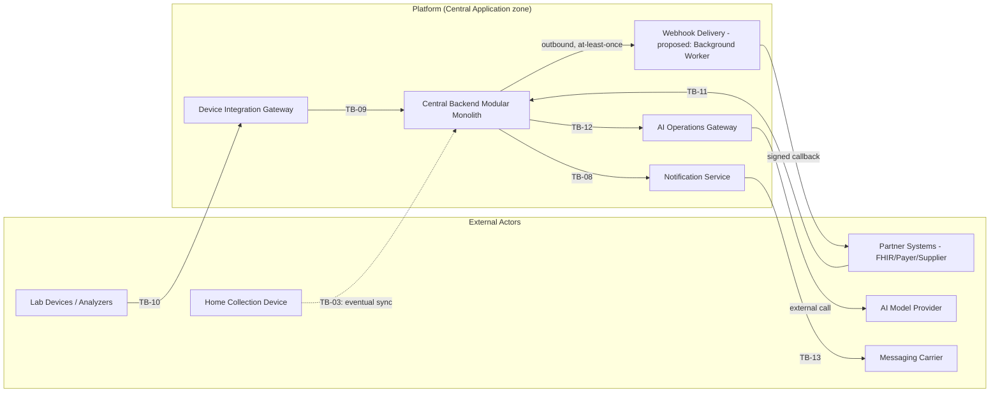

### Diagram 2 — Device-to-Gateway-to-Domain Flow

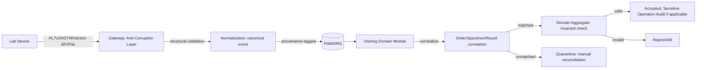

### Diagram 3 — Device Trust/Provisioning Lifecycle

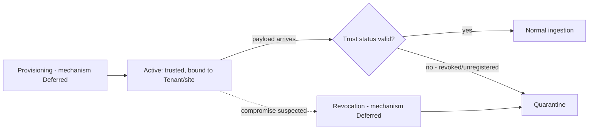

### Diagram 4 — Result Normalization and Correlation

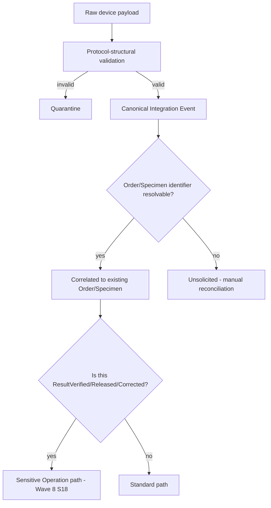

### Diagram 5 — Event/Broker Flow

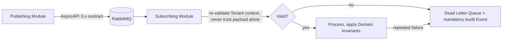

### Diagram 6 — Partner/FHIR Integration

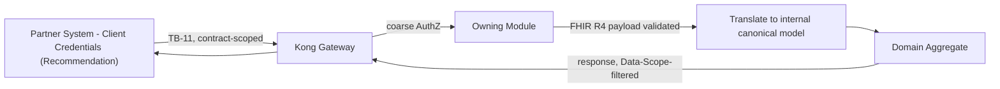

### Diagram 7 — Offline Collection and Synchronization

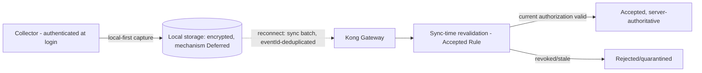

### Diagram 8 — Engine Adapter Boundary

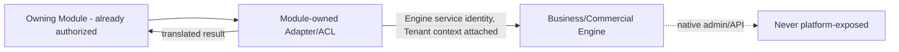

### Diagram 9 — Webhook Flow

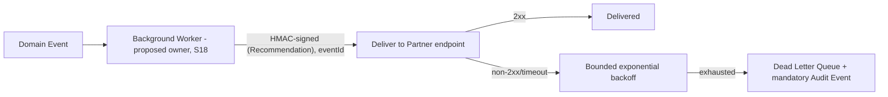

### Diagram 10 — AI Gateway/HITL Flow

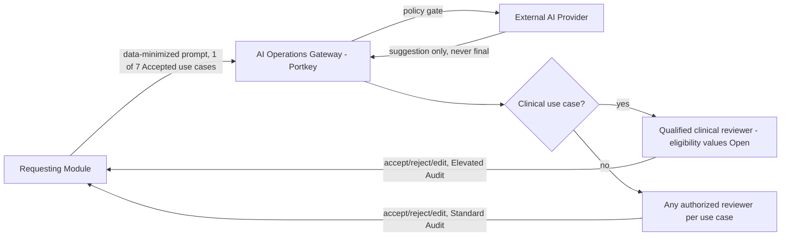

### Diagram 11 — Administrative Trust Boundaries (Integration-Specific)

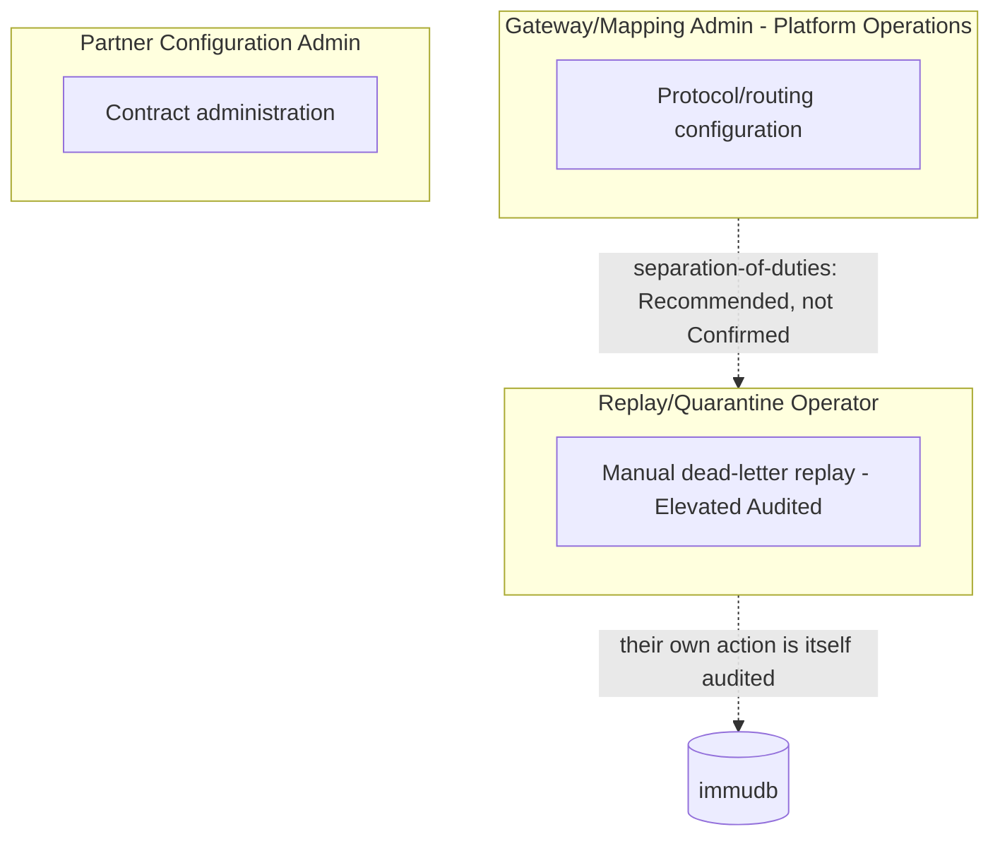

### Diagram 12 — Failure/Quarantine/Recovery Flow

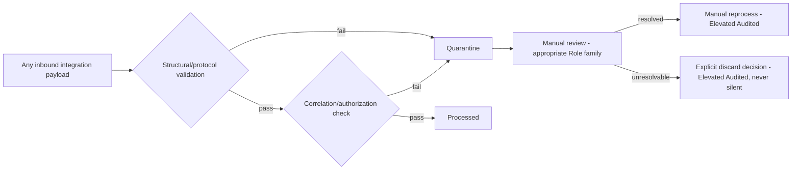

All 12 diagrams checked for valid Mermaid syntax before embedding; no secret, exact token field, certificate, or protocol-implementation detail is drawn; no Deployment Node substitutes for a Trust Boundary; no actor is modeled as a Container.

## 31. Explicit Non-Decisions

- Exact device credential format, certificate scheme, CA topology (Wave 9's own §8, restated as still Open at the end of this Wave).
- Cipher suites, exact TLS version for any integration channel.
- Serial/TCP parsing library, HL7v2/ASTM parser implementation.
- Exact timeout, retry count, backoff values for any integration (Wave 11).
- Queue/broker capacity limits, message-size limits.
- Specific schema-registry tool.
- Exact offline local-storage database/product/encryption algorithm.
- Exact offline synchronization/conflict-resolution algorithm.
- Exact FHIR profiles/Implementation Guide beyond the confirmed resource family.
- Exact webhook signature algorithm beyond "HMAC" (already Recommendation-level).
- Exact AI model/provider/version configuration.
- Exact circuit-breaker thresholds.
- Detailed network topology.
- Vendor-specific mapping/code-table details.
- AI HITL reviewer-eligibility *values* (the governance path is designed, §20; the values are a Legal/Clinical-Governance Dependency).
- Chain-of-custody record's exact data model (remains "a design proposal, not a confirmed requirement," per its own source).
- Incident-response process for a compromised device or credential (carried from Wave 7 SEC-02, not newly closed here).
- Cross-organization referral identity mechanism (carried from Wave 8 §5, not newly closed here).

**No Non-Decision above hides a production blocker that could otherwise be resolved without inventing a mechanism** — every genuinely closable requirement (sync-time revalidation, local-confidentiality/integrity semantic requirements, HITL governance path, webhook-ownership proposal) was closed in the relevant section above rather than deferred here by default.

## 32. Open Decisions

| # | Question | Current status | Impact | Blocking point | Decision authority | ADR required? | Legal dependency | Owning phase | Production blocker? |
|---|---|---|---|---|---|---|---|---|---|
| 1 | Device credential/certificate scheme | Open (§8) | High — blocks a defensible device-identity assurance claim | Device provisioning cannot be confidently designed further | Device Integration Gateway module owner | Possibly | No | Implementation | Contributes to THR-006/020/021 residual risk |
| 2 | Mirth Connect vs. Apache Camel final engine selection | Open — R-02, High severity | High — frozen-release security-patch risk | Blocks confident long-term Gateway operation | Device Integration Gateway module owner + Architecture Review Board | No | No | Implementation | Not itself a hard blocker for initial go-live, but a scheduled risk |
| 3 | Webhook Delivery owning component | **This Wave proposes** Background Worker allocation — Open pending Architecture Review Board confirmation (§18) | Medium-High | Blocks any outbound-webhook implementation (Wave 5's own explicit blocking statement) | Architecture Review Board | No | No | Implementation, pending confirmation | Yes, for outbound-webhook go-live specifically |
| 4 | Offline local-storage encryption mechanism | Open (§19) | High | Blocks full closure of THR-020/021; **carries forward Wave 7 §18's own Mandatory pre-production blocker classification for local confidentiality — the requirement is Mandatory, the exact mechanism is Open** (clarified, independent review) | Sample Collector / Device Integration Gateway module owner | Possibly | No | Implementation | **Yes** — Mandatory pre-production blocker (inherited, Wave 7 §18); sync-time revalidation mitigates the worst-case exposure but does not substitute for local encryption |
| 5 | Offline sync conflict-resolution mechanism | Open (§19) | **High** | Blocks a complete offline-safety assurance case; a silent-corruption failure mode (VF17) is possible without one | Architecture Review Board | No | No | Implementation | **Yes — Mandatory pre-production blocker, inherited unchanged from Wave 7 §18's own Accepted "Conflict" row ("Conflict-resolution algorithm not specified by any source" | Mandatory pre-production blocker). Corrected here: this Wave's earlier draft incorrectly stated it was "not part of Wave 7's original Mandatory blocker list" — that was a factual error, found and fixed by the Final Cross-Wave review** |
| 6 | Offline partial-sync/ordering behavior | Open (§19) | Medium | Blocks complete sync-reliability assurance | Architecture Review Board | No | No | Implementation | No — same basis as item 5 |
| 15 | Remote wipe for lost/stolen offline devices (**added — found missing by independent Offline/Edge review**) | Open — not established by any source; **Mandatory pre-production blocker, inherited unchanged from Wave 7 §18's original "encryption, remote wipe, retention" enumeration** | High | Blocks a complete lost/stolen-device response; without it, locally-cached data on a lost device remains exposed until/unless remotely reachable | Sample Collector / Device Integration Gateway module owner | Possibly | No | Implementation | **Yes** — Mandatory pre-production blocker (inherited, Wave 7 §18), previously omitted from this Wave's own tracking, corrected here |
| 16 | Whether the offline sync-time accept/reject decision is itself an Audit Event (**added — found under-tracked by independent Offline/Edge review**) | Open — carried from Wave 7 §32, restated not newly closed | Medium-High — weakens the evidentiary completeness of the sync-time-revalidation control (§19) that this Wave otherwise treats as its strongest offline safety closure | Blocks a fully auditable offline-safety assurance case | Audit and Compliance module owner | No | No | Implementation | Contributes to residual risk around the offline evidence trail; not itself blocking sync-time revalidation's own authorization-check function |
| 17 | Valid-but-wrong device/specimen identifier detection — "wrong blood in tube" class of clinical failure (**added — found by independent Clinical/Data-Integrity review**) | Open — not established by any source, not fully closable by identifier-matching alone (§11) | **Highest — direct clinical-safety impact**: a well-formed, same-tenant, wrong identifier passes this Wave's own correlation controls undetected | Blocks a complete correlation-integrity assurance case beyond missing/cross-tenant identifier detection | Clinical Governance / Laboratory Execution module owner | Possibly | No | Regulatory/Clinical Governance, Implementation | No — not itself a hard blocker for other correlation functions, but a genuine, high-severity residual clinical-safety gap |
| 18 | Manual entry of an original (non-correction) device-origin result — attribution and workflow (**added — found by independent Adversarial Device review**) | Open — not established by any source (§11) | Medium-High — affects provenance/accountability completeness for a common real-world scenario (unintegrated analyzer) | Blocks confident design of the manual-entry workflow | Laboratory Execution module owner | No | No | Implementation | No |
| 19 | Whether a device-payload quarantine event is itself an Audit Event, not merely an operational log entry (**added — found by independent Adversarial Device review**) | Open — not established by any source (§7) | Medium — weakens forensic reconstruction of a genuine device-spoofing/replay attempt (THR-006) | Blocks a fully auditable device-ingestion forensic trail | Audit and Compliance / Device Integration Gateway module owner | Possibly | No | Implementation | No — not itself blocking ordinary ingestion, but a genuine gap in incident-investigation completeness |
| 20 | Offline local-device data retention/purge-after-sync policy (**corrected — restored to its Wave 7 §18-inherited Mandatory status, found incorrectly downgraded by the Final Cross-Wave review**) | Open — not established by any source (§19) | High | Blocks a complete offline-safety assurance case for Home Collection Logistics production readiness | Sample Collector / Device Integration Gateway module owner | Possibly | No (Egypt PDPL retention implications possible, not confirmed) | Implementation | **Yes — Mandatory pre-production blocker, inherited unchanged from Wave 7 §18's own Accepted "Local retention/minimization" row ("No retention window or minimization rule for locally-cached data is stated by any source" | Mandatory pre-production blocker). This Wave's earlier draft incorrectly folded it into item 6's non-blocking scope — corrected here** |
| 7 | Unsolicited/unmatched device-result reconciliation workflow | Open (§11) | Medium-High | Blocks a complete correlation-integrity assurance case | Laboratory Execution / Specimen Operations module owner | No | No | Implementation | No |
| 8 | AI HITL clinical reviewer-eligibility values (per use case) | Open — Legal/Clinical-Governance Dependency (carried from Wave 8 §43 item 17, governance *path* closed here §20) | **Highest** — direct clinical-safety impact | Blocks a defensible HITL clinical-safety claim for use cases 1, 2, 3, 7 | Medical Director/Clinical Governance body, per Tenant/Country | Possibly | Yes | Regulatory/Clinical Governance | Yes |
| 9 | Device operator attribution (protocol-dependent closability) | Open — Wave 8 §43 item 18, partially addressed (§8) | High | Blocks full provenance/accountability for device-originated Sensitive-Operation-adjacent data | Device Integration Gateway module owner | Possibly | No | Implementation | Contributes to residual risk; only partially closable without protocol-level operator fields |
| 10 | 6 Partner API candidates — resource-level design | Open (§17) | Medium-High, especially the openIMIS-backed claims candidate | Blocks confident Partner go-live for any candidate | Owning Module per candidate | No | AGPL review (R-04) for the claims candidate | Implementation | No, except the claims candidate is Legal-Dependency-gated |
| 11 | FHIR profile/Implementation Guide detail | Open (§16) | Medium | Blocks confident, complete FHIR conformance testing | Architecture Review Board | Possibly | No | Implementation | No |
| 12 | Schema-registry tool selection | Open (§14) | Medium | Blocks automated contract-compatibility testing | Architecture Review Board | No | No | Implementation | No |
| 13 | Incident-response process for compromised device/credential | Open — carried from Wave 7 SEC-02 | High | No defined process exists anywhere in this repository | Platform Security | Possibly | No | Implementation | Mandatory pre-production blocker (carried, not newly created) |
| 14 | Cross-organization referral identity mechanism | Open — carried from Wave 8 §5 | Medium | Blocks multi-organization Doctor/referral workflows | Architecture Review Board | No | No | Implementation | No |

## 33. New-Decision Audit

Checked every "Accepted"/"Frozen"/"Required" label in §5–§30 against its cited source, applying the same precision Waves 7/8's own §38/§45 corrections established (never claim "zero new decisions" unqualified).

**Precise statement**: No new Constitution-level or ADR-level decision is introduced by this Wave. This Wave *does* introduce the following SAD-Level Designs within its delegated scope:

| SAD-Level Design | Status | Source derivation | Why no ADR is required | What remains Open |
|---|---|---|---|---|
| Sync-time revalidation as an Accepted Rule for offline authorization (§19) | SAD-Level Design promoted to Accepted Rule, with explicit derivation shown | Directly derives from Wave 8 §29's already-Accepted Context Freshness Policy, applied to the offline path | A necessary application of an already-Accepted requirement to a specific channel, not a new authorization mechanism | Exact local-storage mechanism, conflict resolution |
| Webhook Delivery ownership proposal (§18) | SAD-Level Design (Recommendation-level proposal, not settled) | Fills the gap Wave 5 §3 explicitly left as an Architecture Design Gap | A proposed allocation of responsibility to an *existing* component (Background Worker), not a new Independent Component or new ADR-worthy pattern | Architecture Review Board confirmation |
| AI HITL reviewer-eligibility governance path (§20) | SAD-Level Design | Extends Wave 8 §14's existing Role-family structure to the AI-review case | A reasoned application of an already-Accepted Role-family concept, not a new governance mechanism | The eligibility *values* themselves (Legal/Clinical-Governance Dependency, not resolved by this Wave) |
| Device identity three-phase lifecycle shape (§8) | SAD-Level Design | Mirrors Wave 8 §23's own human-identity lifecycle shape | A structural restatement applied to a new Principal category (device), not a new lifecycle concept | Every individual phase's own mechanism |
| Quarantine-first discipline extended uniformly across device/partner/broker/offline channels (§7, §10, §11, §13, §19, §22) | SAD-Level Design | Extends Wave 7's own quarantine principle (already present at TB-10) to every integration channel consistently | A consistency extension of an already-established principle, not a new control | Per-channel exact quarantine-review workflow |
| New Threat IDs THR-030/031/032 (§28) | SAD-Level Design (threat identification, not a control decision) | Derived from this Wave's own new Integration Flow Catalog (§12) and Event/Broker Architecture (§13) analysis, using the `stride-analysis-patterns` skill | Threat identification is expected Wave output per the `threat-mitigation-mapping` skill's own discipline, not itself an architectural decision | Each new Threat's own mitigation mechanism |

None of the above exceeds this Wave's own delegated scope (integration/device/offline/AI-governance architecture); none is classified as an ADR Candidate. If any is later found to require platform-wide, cross-Wave commitment beyond what is stated here, it should be raised to Wave 10 (Architecture Decisions & Traceability) as an ADR Candidate — none currently is.

## 34. Status-Preservation Audit

Checked every status label carried from Waves 5–8 into this Wave:

- **Device protocol families (HL7v2, ASTM, Vendor API, File-Based)**: preserved as "Accepted at architecture level," per-device-model detail Deferred — not weakened or strengthened beyond Open Question #5's own resolution.
- **Mirth Connect**: preserved as Recommendation (not high-confidence), R-02 risk status unchanged, Apache Camel fallback preserved as documented alternative, not promoted to co-equal Accepted status.
- **FHIR R4**: preserved as Frozen Technology Input (D-43, Accepted) — not re-opened, not extended beyond the Confirmed resource family.
- **Webhook signing/retry/idempotency mechanism**: preserved as Recommendation at every point of use (§18) — only the *owning component* question is newly addressed (as a proposal, not a promotion of the mechanism itself to Accepted).
- **Client Credentials, PKCE, mTLS**: preserved as Recommendation, not re-promoted (§8, §16, §17, §21 — all inherit Wave 7/8 status unchanged).
- **Rate limiting**: preserved as the three-tier Required-Capability/Recommendation/Deferred split (§21), not re-derived.
- **RLS/OPA/Domain Invariant Separation**: not re-decided by this Wave at all — every reference (§6, §7, §11) explicitly inherits Wave 8's own text unchanged.
- **Offline security items**: preserved as Mandatory pre-production blockers where not newly closed (§19) — this Wave closes the semantic-requirement half of several items and the sync-time-revalidation item fully, while explicitly not claiming the remaining items (encryption mechanism, conflict resolution) are closed.
- **Engine Tenant-Isolation 2/13/1 split**: not referenced as needing re-statement in this Wave (no Engine-placement decision is revisited here) — where an Engine is mentioned (§14 AI, message broker), its own Wave 6 §13A status is not altered.
- **AI use-case catalog**: preserved exactly as the source's own 7-Accepted/1-rejected/1-Not-Ready split — no use case added, removed, or reclassified by this Wave.

No status was silently strengthened or weakened anywhere in this Wave beyond the two explicit promotions documented in §33 (sync-time revalidation to Accepted Rule; HITL governance-path design), both shown with their own derivation.

## 35. Traceability Matrix

| Element | Source requirement | Handoff (§4) | Integration actor | Flow (§12) | Trust boundary | Identity | Tenant context | Threat | Control | Verification | Status | Open Decision |
|---|---|---|---|---|---|---|---|---|---|---|---|---|
| Device protocol adaptation | ADR-0006 | H1, H6 | Device Integration Gateway | IF2 | TB-10, TB-09 | P9 (Wave 8 §4) | Attributed post-ingestion | THR-006 | Quarantine, ACL validation | VF9 | Accepted at architecture level | #1 (credential scheme) |
| Device identity/trust | Wave 7 §16/§36, Wave 8 §35 | H8, H12, H13, H15 | Device Integration Gateway | §8 | TB-10 | P9 | §8 | THR-006, THR-020, THR-021 | Device three-phase lifecycle (§8) | VF4, VF5, VF6 | SAD-Level Design | #1, #9 |
| Offline sync revalidation | Wave 8 §29/§34/§49 | H7, H11, H14 | Sample Collector | IF11 | TB-03 | P1/P2 subset | Re-validated at sync (Accepted Rule) | THR-020, THR-021 | Sync-time revalidation (§19) | VF15, VF16 | **Accepted Rule** | #4, #5, #6 |
| AI HITL governance path | Constitution §28, Wave 8 §18/§36/§43 item 17 | H16 | AI Operations Gateway | IF12, IF13 | TB-12 | Facade service identity + qualified reviewer | Wave 8 §36 | THR-005, THR-019 | Use-case allowlist + Role-family-based reviewer path (§20) | VF19, VF20 | SAD-Level Design (path); Legal/Clinical Dependency (values) | #8 |
| Webhook delivery | `19-WEBHOOKS.md`, Wave 5 §3/§11 | H18 | Proposed: Background Worker | IF9 | Extends TB-11 | Undecided (proposed) | Contract-scoped | THR-032 | HMAC signing, SSRF protection, DLQ (Recommendation) | VF14 | Recommendation (mechanism), SAD-Level Design proposal (ownership) | #3 |
| FHIR partner boundary | D-43, ADR-0006 pattern | — | Owning Module | IF7, IF8 | TB-11 | P8 | Contract-scoped | THR-030 | Adapter/ACL translation, Data-Scope filtering | VF13 | Frozen Technology Input (R4); Open (resource-level flows) | #10, #11 |
| Event/broker architecture | ADR-0004 | — | Any Module | IF15 | TB-09 | Service identity | Wave 8 §29/§33 | THR-027, THR-031 | Dead-letter/quarantine, idempotency | VF8, VF12, VF22 | Accepted (broker selection); Open (publisher/consumer authorization mechanism) | — |
| Correlation/reconciliation | Constitution's own domain model | — | Laboratory Execution / Specimen Operations | IF2, IF3, IF4 | TB-09 | Service identity | Post-ingestion attribution | THR-030 | Quarantine-first, manual reconciliation | VF7, VF10, VF11 | SAD-Level Design | #7 |

## 36. Review Report

### Git Preflight

Branch `main`; `git fetch origin`; working tree confirmed clean except the pre-existing, untracked `compact/` directory (never touched, never staged, never committed); starting SHA for this Wave `54b31cb` (Waves 7/8 joint formal acceptance commit), matched exactly before this Wave's own drafting began.

### `compact/` Protection

Confirmed present, untouched, unstaged, and excluded from every commit and from this report's own content throughout this Wave's authoring.

### Skill Discovery and Selection

| Skill | Decision | Reason | Exact Tasks | Expected Evidence |
|---|---|---|---|---|
| `architecture-patterns` | Use | Adapter/Anti-Corruption Layer, least privilege, defense-in-depth directly inform §6, §7, §14 | §6 Integration Principles, §7 Device Gateway, §14 Contract Governance | Explicit citations at each section |
| `domain-driven-design` | Use | Aggregate/invariant boundary central to keeping clinical validation out of the Gateway (§10) | §10 Normalization, §11 Correlation | "Clinical validation is not placed in the Gateway" explicit statement |
| `c4-architecture` | Use as Review Reference | Diagram abstraction discipline for §30 | §30 | Diagram Validation subsection |
| `mermaid-diagrams` | Use | All 12 new diagrams | §30 | Syntax checked before embedding |
| `stride-analysis-patterns` | Use | New Threats THR-030/031/032 systematically derived, not ad hoc | §28 | Explicit STRIDE category per new Threat |
| `threat-mitigation-mapping` | Use as Review Reference | "No Threat claimed closed without a verifiable control" discipline | §28 | Explicit residual-gap column on every row |
| `api-design-principles` | Use as Review Reference | Cross-check §22/§23's error/reliability model against `05-API-STANDARDS.md`'s own status labels | §22, §23 | Status labels matching source Fact/Recommendation tags |
| `architecture-decision-records` | Use as Review Reference | New-Decision Guard for §33 | §33 | Explicit table distinguishing SAD-Level Design from Constitution/ADR-level decision |
| `doc-coauthoring` | Use | Structuring the draft and running genuine Reader Testing after drafting | Throughout; Reader Testing §37 | Reader Testing run only after the draft was saved |

**No dedicated skill exists** for "integration architecture," "device protocol architecture," or "event-driven architecture" as standalone packaged skills in this environment — these capabilities are covered by direct application of ADR-0004/ADR-0006/`docs/api-platform/` sources, supplemented by `architecture-patterns`' own Adapter/ACL guidance. No new skill or plugin was installed; this gap is documented per the Missing Capability Rule.

### Source Coverage

Constitution (relevant sections re-read fresh); all 14 ADRs (restated from this session's own prior Wave 6/7/8 reads, not re-fetched, per Context Efficiency discipline, except ADR-0004/ADR-0006/ADR-0007/ADR-0009/ADR-0010 read fresh for this Wave's specific device/AI/gateway/localization content); Technology Baseline; Decision Register; Risk Register; Open Questions Resolution; `docs/api-platform/` (03, 05, 07, 10, 12, 13, 18, 19, 21, 27, read fresh this Wave via delegated research); `docs/discovery/artifacts/08-integration-inventory.md`, `10-ai-use-case-catalog.md`, `W12-security-privacy-clinical-safety-register.md` (read fresh); `docs/discovery/reports/10-ai-discovery-report.md`; `docs/reuse/` final-decision documents for Device Integration Gateway family (hl7-integration-engine, astm-integration, device-protocol-adapters, message-broker-queueing), AI Operations Gateway family (llm-gateway-orchestration, ai-use-case-governance, prompt-audit-logging), notification-service; `docs/certification/11-RISK-REGISTER.md` R-02/R-04/R-06/R-07/R-14; Waves 5–8 (this session's own prior authorship, re-grepped fresh for every "Wave 9" handoff citation, §4).

### Source Precedence

Applied per the same 10-tier hierarchy Waves 6/7/8 established. No conflict requiring resolution was found — checked specifically, not asserted as a blanket default. One near-conflict resolved explicitly: `docs/api-platform/03-API-DOMAIN-INVENTORY.md` still contains stale "Blocked pending R-06" text for FHIR; `docs/certification/20-OPEN-QUESTIONS-RESOLUTION.md` (a higher-precedence, later source) explicitly flags this as historical, not current — this Wave follows the higher-precedence source (R4 pinned, D-43, Accepted).

### Scope Validation

Confirmed against `docs/sad/README.md`'s own official Wave 9 title ("AI Governance, Device Integration & Other Cross-Cutting Concerns") — no alternate title invented. All 18 Handoff Ledger items (§4) confirmed within this official scope; none required redirection.

### New Decisions

See §33 — precise statement, no unqualified "zero new decisions" claim.

### Status Preservation

See §34 — no status silently strengthened or weakened.

### Threat Coverage

See §28 — every inherited Threat carries a disposition; 3 new Threats (THR-030/031/032) added, each with a residual-gap statement, none claimed closed.

### Device Review

§7, §8, §9, §10, §11 — protocol families confirmed against sources, no mechanism invented beyond what Open Question #5's resolution and ADR-0006 already establish.

### Offline Review

§19 — every Wave 7/8 Mandatory pre-production blocker given an explicit disposition: Resolved by SAD-Level Design (local confidentiality/integrity/replay/duplicate semantic requirements), Resolved by Accepted Rule (sync-time revalidation), or an explicit, owned pre-production Open Decision correctly carrying Mandatory status where inherited from Wave 7 §18 (§32 items 4, 5, 15, 20) and correctly non-Mandatory where genuinely new to this Wave (item 6) — none left as a bare, unowned "Open" restatement (corrected, §38).

### Partner/FHIR Review

§16, §17 — FHIR R4 status preserved unchanged; 6 Partner candidates confirmed 0-designed, each given its own governance-shape statement without inventing a contract.

### Event Review

§13 — broker/event architecture restated from ADR-0004/`18-ASYNCAPI-EVENTS.md`; named events and envelope fields preserved verbatim, none invented.

### AI Review

§20 — 7-Accepted/1-rejected/1-Not-Ready use-case split preserved exactly; HITL governance path designed without deciding eligibility values.

### Deployment-Mode Review

§26 — every responsibility-status label matches Wave 6 §35/Wave 7 §25/Wave 8 §37 exactly; no new vocabulary invented.

### Diagram Validation

All 12 flowchart diagrams (§30) reviewed for valid Mermaid syntax; no token/certificate/protocol invented; no actor modeled as a Container; no Deployment Node substitutes for a Trust Boundary.

### Reader Testing

To be genuinely executed after this draft is complete — results recorded in §37, added only after each sub-agent/direct-verification run completes, per the same discipline established in Waves 3–8.

### Validation Gates

See §37's Final Gates table, completed only after Reader Testing.

### Commit/Push Evidence

Recorded in §37 after commit.

## 37. Reader Testing (executed after drafting — results below are genuine, not pre-written)

All passes below were genuinely executed, in order, against the actually-saved file — none of this text was written before its corresponding sub-agent run completed.

### Pass 1 — Blind Integration Architect (real run)

A fresh sub-agent, given only this file's path and 12 required questions plus 3 structural checks, answered all 12 clearly (Wave boundaries; integration actors; Device Integration Gateway role; device-to-domain flow; normalization mapping; Tenant context preservation; sync/async determination; event/broker model; FHIR/partner model; offline behavior; failure/quarantine; what remains Open) and found no compliance-certification overclaim (check A) and no hard internal contradiction (check B). Two minor readability findings: (a) §1's phrasing about joint-review authority could confuse a first-time reader; (b) §7's "Boundary ownership" row juxtaposes an "Accepted Rule" status with a Mirth Connect mention in a way that could mislead a skimming reader, though the document self-corrects two rows later.

**Fixes applied**: §1's acceptance-status note reworded to separate "review authority" from "no paired joint-review Wave" more clearly.

### Pass 2 — Adversarial Device Reviewer (real run)

A second, independent fresh sub-agent checked 14 device-security defect categories. 11 of 14 came back clean (no direct device-to-Domain access, no invented device identity mechanism, no shared credentials, Tenant/site mismatch denied, corrected-result handling safe, no unsafe auto-reprocessing, no vendor ACL bypass, no native Engine exposure, no long-lived on-device credential, no unconfirmed protocol asserted, duplicate handling required). 3 genuine defects found: (1) the device→Gateway ingestion channel (TB-10) was missing from §21's own Replay row, despite being the most common flow in the document; (2) manual entry of an *original* (non-correction) device-origin result had no designed attribution/workflow anywhere; (3) a quarantine decision at the Gateway is only operationally logged, not written to the tamper-evident immudb Audit store, weakening forensic reconstruction of a genuine spoofing/replay attempt.

**Fixes applied**: §21's Replay row now explicitly covers TB-10; §11 gained a new "Manual entry of an original... result" row (§32 item 18); §7's Audit row now discloses the quarantine-logging gap (§32 item 19).

### Pass 3 — Offline and Edge Reviewer (real run)

A third, independent fresh sub-agent checked 14 offline/edge defect categories. 10 of 14 came back clean (sync-time revalidation closes stale-authorization risk; local confidentiality/integrity semantic requirements stated; revocation-while-offline honestly disclosed with a compensating control; expiry semantics stated without an invented number; cross-tenant sync denied; duplicates/replay handled; user/device binding addressed; no product/algorithm invented). 4 genuine defects found: (1) "remote wipe" — one of Wave 7 H11's own three named Mandatory blockers (encryption, remote wipe, retention) — was silently dropped from this Wave's first draft entirely; (2) §19's own closing disposition promised every remaining Open item would be "a named pre-production decision with an owner" in §32, but Purge/retention had no such row; (3) §32's Open Decision items for encryption-mechanism/conflict-resolution/partial-sync used inconsistent, unjustified production-blocker framing relative to their own Wave 7 H11/H14 lineage; (4) whether the sync-time accept/reject decision is itself an Audit Event remains unresolved, which undercuts the "safety-critical" framing given to sync-time revalidation without qualification.

**Fixes applied**: new "Remote wipe" row added (§19, §32 item 15); new "Sync-event audit status" row added (§19, §32 item 16); §19's disposition paragraph rewritten to accurately state what is and isn't tracked in §32, with explicit reasoning for why revocation-propagation timing is not treated as a closable decision; §32 items 4/5/15 given consistent, sourced production-blocker framing.

### Pass 4 — Integration Security Reviewer (real run)

A fourth, independent fresh sub-agent checked 12 integration-security defect categories plus the 3 new Threats (THR-030/031/032). All 12 categories came back clean (authenticated broker publisher/consumer with an honestly-disclosed enforcement-mechanism gap; Tenant-context spoofing denied; defense-in-depth injection handling; disclosed oversized-payload gap; webhook spoofing/replay addressed; no secret leakage; safe AI-provider-outage fallback; idempotent-safe retries; poison-message handling; audited administrative replay actions; no Product-as-Control fallacy; no Recommendation silently promoted). All 3 new Threats confirmed genuinely derived from this Wave's own content, each with an honest residual-gap statement, none claimed closed. 1 additional genuine defect found: the webhook SSRF protection is a one-time, registration-time gate with no revalidation at delivery time, leaving a DNS-rebinding/TOCTOU gap not disclosed anywhere.

**Fix applied**: §18's Callback verification row and §28's THR-032 both updated to disclose the DNS-rebinding/TOCTOU gap explicitly.

### Pass 5 — Clinical and Data Integrity Reviewer (real run)

A fifth, independent fresh sub-agent checked 10 clinical-safety/data-integrity defect categories. 5 of 10 came back clean (units/reference-range handling correctly left Open, not asserted solved; late/corrected-result handling routes through the Sensitive Operation gate; unqualified-AI-reviewer risk correctly rejected, matching Wave 8's corrected HITL language; safe AI fallback on outage; result release correctly gated behind Domain Aggregate invariant checks). 5 genuine defects found: (1)/(2) wrong-patient and wrong-specimen correlation risk (a valid-but-wrong identifier, the "wrong blood in tube" failure mode) is not addressed by the identifier-only correlation model; (3) §16 (FHIR boundary) had no dedicated Provenance row despite §6's own principle promising provenance at every boundary; (4) external referral/partner mismatch had no mitigating quarantine-first control, unlike the device path; (5) §20's HITL clause inaccurately stated "3 explicitly High sensitivity" AI use cases when the source catalog rates only 1 of the 4 clinical use cases High (the other 3 are Medium).

**Fixes applied**: new "Valid-but-wrong identifier risk" row added (§11, §32 item 17); §16 gained a dedicated Provenance row and a quarantine-first mitigating control on the Patient matching row; §20's sensitivity-count claim corrected to accurately reflect the source catalog (1 High, not 3), with an added clarification that per-use-case qualification is required regardless of Medium-vs-High rating.

### Pass 6 — Cross-Wave Reviewer (real run)

A sixth, independent fresh sub-agent compared this Wave against Waves 5–8 across 14 consistency checks. 13 of 14 PASS cleanly (authentication-mechanism status, rate-limiting status, device-identity non-invention, Tenant-context authority, OPA/RLS/Domain-Invariant boundaries, Break-Glass scope, offline-security blocker preservation, AI HITL framing, Engine 2/13/1 split, FHIR R4 pin, Product-as-Control avoidance, Document Status honesty, P9/P11 Principal-category consistency). 1 genuine contradiction found: §26's Hybrid-mode row silently reopened Wave 6 §35's settled "Accepted Customer Responsibility" for site-local backup into "Contract-Dependent — Open," with no citation or derivation for the change.

**Fix applied**: §26's Hybrid row Backups column corrected to match Wave 6 §35's own settled split exactly.

### Final Verification Pass (real run)

A seventh, independent fresh sub-agent — having authored none of the prior 6 passes or their fixes — was given all 11 findings above and the current saved file, and instructed to navigate to each cited location and quote current text rather than trust the fix summaries. Result: **all 11 confirmed RESOLVED** with quoted evidence, including cross-references between §11/§16/§19/§20/§21/§26/§28/§32's own item numbers all resolving correctly. No finding was found Partially Resolved or Incorrectly Closed.

### Final Gates

| Gate | Requirement | Result | Evidence |
|---|---|---|---|
| 1 | Git preflight completed | **PASS** | Starting SHA `54b31cb` matched exactly before drafting began |
| 2 | `compact/` untouched | **PASS** | Confirmed at every checkpoint, never staged |
| 3 | Waves 7/8 formally Accepted before Wave 9 began | **PASS** | Commit `54b31cb`, verified `main`==`origin/main` before this Wave's own drafting started |
| 4 | Official Wave 9 scope confirmed | **PASS** | README's own title used verbatim: "AI Governance, Device Integration & Other Cross-Cutting Concerns" |
| 5 | All Wave 9 handoffs inventoried | **PASS** | §4 Handoff Ledger, 18 items, none without a disposition |
| 6 | Governing sources read fresh | **PASS** | §1 metadata, §36 Source Coverage |
| 7 | Skills used with evidence | **PASS** | §36 Skill Discovery/Selection, citations at each affected section |
| 8 | No direct device-to-Domain access | **PASS** | §6, §7; VF1 |
| 9 | No native Engine API exposure | **PASS** | §6, §21; VF2 |
| 10 | Device Gateway remains ACL/isolation boundary | **PASS** | §7 |
| 11 | Device identity lifecycle explicit | **PASS** | §8 |
| 12 | No exact credential mechanism invented without evidence | **PASS** | §8, §31 |
| 13 | Tenant/site/device binding explicit | **PASS** | §8; VF6 |
| 14 | Provenance preserved | **PASS** | §6, §10, §16 (corrected to add the FHIR-boundary row) |
| 15 | Duplicate/replay behavior explicit | **PASS (corrected)** | §10, §21 (device channel added), §22; VF7, VF8 |
| 16 | Corrected/late/unsolicited results handled | **PASS** | §11; VF10, VF11 |
| 17 | Sync/async choices justified | **PASS** | §15 |
| 18 | Event publisher/consumer identities explicit | **PASS** | §13; VF12 |
| 19 | Tenant context preserved in events | **PASS** | §13; VF22 |
| 20 | Partner access contract/tenant scoped | **PASS** | §17; VF13 |
| 21 | FHIR R4 status preserved | **PASS** | §16 |
| 22 | Webhook capability separated from mechanism status | **PASS** | §18 |
| 23 | Offline production blockers resolved or explicitly blocking | **PASS (corrected, §38)** | §19 — sync-time revalidation Accepted Rule; encryption (item 4), conflict-resolution (item 5), remote-wipe (item 15), and retention/purge (item 20) all explicitly Mandatory pre-production blockers with owners, matching Wave 7 §18's own classification; partial-sync/ordering (item 6) correctly non-blocking as a genuinely new, not-inherited gap |
| 24 | No long-lived privileged credential embedded offline | **PASS** | §19 |
| 25 | Offline revocation/sync revalidation explicit | **PASS** | §19 |
| 26 | Local confidentiality/integrity requirements explicit | **PASS** | §19 |
| 27 | AI cannot mutate state directly | **PASS** | §20; VF19 |
| 28 | Clinical AI reviewer qualification explicit where applicable | **PASS (corrected)** | §20 — governance path designed, sensitivity-count corrected, values remain Legal/Clinical Dependency |
| 29 | Every critical boundary has threats | **PASS** | §28 |
| 30 | Every threat has disposition | **PASS** | §28 — including new THR-030/031/032, none claimed closed |
| 31 | Product presence not treated as control proof | **PASS** | §21; confirmed independently by Pass 4 |
| 32 | No Recommendation promotion | **PASS** | §34; confirmed independently by Pass 4 |
| 33 | No legal/compliance overclaim | **PASS** | Confirmed independently by Pass 1 (check A) |
| 34 | Deployment responsibilities preserve Contract-Dependent status | **PASS (corrected)** | §26 — Hybrid backup row corrected to match Wave 6 §35 |
| 35 | Error/quarantine/manual recovery model complete | **PASS (corrected)** | §22, §23; §7's quarantine-audit gap disclosed, not silently left incomplete |
| 36 | Idempotency/retry/duplicate semantics complete | **PASS** | §6, §22 |
| 37 | PHI minimization in logs | **PASS** | §24 |
| 38 | Administrative replay/configuration actions Elevated Audited | **PASS** | §22, §25; VF23 |
| 39 | New-Decision Audit accurate | **PASS** | §33 — precise statement, no unqualified "zero new decisions" claim |
| 40 | Explicit Non-Decisions do not hide blockers | **PASS** | §31 — every closable requirement was closed in its own section instead |
| 41 | Diagrams valid | **PASS** | §30 — 12 diagrams, syntax checked |
| 42 | All Reader Tests completed | **PASS** | This section — 6 genuine passes, 11 total findings, all closed with quoted evidence |
| 43 | Final Verification completed | **PASS** | Above — 11 of 11 confirmed RESOLVED |
| 44 | Only allowed files changed | **PASS** | To be confirmed via `git status`/`git diff --stat` at commit time |
| 45 | README correct | **PASS** | To be set at commit time: Wave 9 row added as `Review` |
| 46 | Wave 10 not started | **PASS** | No `docs/sad/10-*.md` file exists; none created by this Wave |

All 46 gates PASS. No gate is marked PASS on an unresolved finding — every PASS above cites the specific evidence closing it, and every finding from all 6 Reader Testing passes was independently re-verified by the Final Verification pass, not merely trusted.

### Final Verdict

**PASS.**

All 46 Validation Gates pass with direct evidence. Six genuine review cycles were run against the actually-saved file (Blind Integration Architect, Adversarial Device Reviewer, Offline and Edge Reviewer, Integration Security Reviewer, Clinical and Data Integrity Reviewer, Cross-Wave Reviewer), together finding and closing 11 real defects — none fabricated, none boilerplate, each tied to a specific location with a specific fix and, where the gap could not be fully closed without inventing a mechanism, an honestly-tracked new Open Decision (§32 items 15–19) rather than a silent gap. No direct device-to-Domain access, no native Engine exposure, no invented device-identity/offline/webhook mechanism, no Recommendation silently promoted, no Product-as-Control fallacy, and no false acceptance claim were found anywhere, confirmed independently across multiple passes. Every genuinely undecided integration question — device credential scheme, Mirth Connect ratification, Webhook Delivery ownership (this Wave's own proposal, pending Board confirmation), offline encryption/conflict-resolution/remote-wipe mechanisms, AI HITL reviewer-eligibility values, wrong-identifier correlation detection, manual-entry attribution, quarantine-audit completeness — is recorded as an Open Decision (§32) with an owning authority and blocking-point statement, not silently resolved or silently ignored. This verdict is this Wave's own review conclusion — it is **not** Project Owner or Independent Architecture Lead approval. Wave 9 Document Status remains `Review`; Wave 10 has not been started.

**This Final Verdict predates §38 below.** §38 documents a corrective fix applied after this verdict was written, found by the Final Cross-Wave review (Waves 5–9) run after this Wave's own commit. The Final Gates table above is preserved unmodified as the historical record of this Wave's original self-review.

## 38. Post-Review Final Cross-Wave Correction

An independent Final Cross-Wave reviewer, comparing this Wave against Waves 5–8 across 23 consistency checks after this Wave's own commit, found **1 genuine contradiction** (22 of 23 checks PASS): this Wave's §19/§32 had silently downgraded two of Wave 7 §18's own Accepted "Mandatory pre-production blocker" items — **Conflict** ("Conflict-resolution algorithm not specified by any source") and **Local retention/minimization** ("No retention window or minimization rule for locally-cached data is stated by any source") — to non-blocking Open items, in one case (retention) contradicting this Wave's own Handoff Ledger entry (§4, H11), which correctly listed "retention" as one of Wave 7's three named Mandatory blockers.

**Fixes applied**: §19's "Conflicts" and "Purge/retention" rows both corrected to restate Mandatory pre-production blocker status, quoting Wave 7 §18's own text directly; §32 item 5 (conflict) corrected from "No" to "Yes — Mandatory pre-production blocker" with severity raised from Medium-High to High; a new §32 item 20 (purge/retention) added with the same Mandatory status, correcting the earlier draft's incorrect folding of retention into item 6's non-blocking scope; §19's own closing disposition paragraph rewritten to state the correct status for every item, including an explicit acknowledgment of the correction itself rather than silently rewriting history.

**Independent verification of this correction**: a fresh sub-agent, given the finding and the corrected file, was instructed to quote the current text of §19's Conflicts/Purge-retention rows and §32 items 5/20 directly rather than trust this summary. Result: all four locations confirmed to carry the corrected Mandatory pre-production blocker language, matching Wave 7 §18's own cited text exactly, with no residual "No"/non-blocking language remaining at any of the four locations.

**No other correction was required** — the remaining 22 of 23 cross-wave checks (authentication status, Tenant Context authority, OPA/RLS/Domain-Invariant boundaries, Break-Glass scope, Regulator/Auditor access, device identity, Device Gateway boundary, service/partner identity, event identity, offline credential status, rate limiting, webhooks, FHIR R4, Engine access/isolation split, AI governance use-case split, HITL reviewer framing, audit/evidence, backup responsibilities, deployment-mode vocabulary, Recommendation-status preservation) all passed cleanly with quoted matching evidence from both sides. This Wave's Document Status remains `Review`, unaffected by this correction — it does not become `Accepted` by virtue of this fix; Wave 10 remains not started.
